# crates/gwiki/src/compile

Parent: [[code/modules/crates/gwiki/src|crates/gwiki/src]]

## Overview

The `compile` module transforms accepted notes into rendered wiki pages within a vault. It collects in-scope accepted sources (`collect.rs`), parses note sections and chunk offsets, and enforces path-scope safety. The orchestration layer (`mod.rs`) exposes `compile_to_wiki`/`compile_to_wiki_with_options` and `prepare_handoff`, building a `CompileBundle` from `CollectedSources` and driving the compile pipeline via `CompileRequest`/`WikiCompileOptions` into a `CompileOutcome`. Rendering (`render.rs`) produces Obsidian-flavored Markdown sections, normalizes and slugifies target page paths, writes pages with overwrite/race protection, and guards against escaping the vault (including symlinked parents). Index maintenance (`index.rs`) updates the wiki index file under a lock, inserting compiled-page links and headings idempotently via structural checks, and records provenance for compiled sources. The `tests.rs` suite verifies non-destructive handoff, scope and path-traversal rejection, structural index updates, and correct Markdown output.
[crates/gwiki/src/compile/collect.rs:10-82]
[crates/gwiki/src/compile/index.rs:16-63]
[crates/gwiki/src/compile/mod.rs:27-32]
[crates/gwiki/src/compile/render.rs:11-47]
[crates/gwiki/src/compile/tests.rs:6-24]

## Call Diagram

```mermaid
sequenceDiagram
    participant m_0faa4d12_cb37_582c_bb6a_dbe2dcaf0dba as line_body &#91;function&#93;
    participant m_23d732c6_84ed_5480_8de1_d8b5557464ac as collect_accepted_sources &#91;function&#93;
    participant m_34d25cfc_0db8_55ca_93e0_79fba665e376 as prepare_handoff_does_not_write_target_page &#91;function&#93;
    participant m_3f09bb62_7ee3_5979_bcf6_49346dd087f6 as update_wiki_index &#91;function&#93;
    participant m_435b71d5_dfcf_5490_9dc3_4f3f473793ad as compile_to_wiki &#91;function&#93;
    participant m_43fef494_7f9b_5c21_9f91_260631da5688 as has_exact_line &#91;function&#93;
    participant m_4940fb81_b2f5_5531_b686_12f3ea7fae1d as compile_rejects_absolute_or_escaping_target_pages &#91;function&#93;
    participant m_4a414ca2_8f8c_5066_bdf1_00e3a4fa1251 as index_update_preserves_unrelated_entries &#91;function&#93;
    participant m_54ec3ba7_27d4_5900_bbae_9b4a1e506977 as exact_line_end &#91;function&#93;
    participant m_56943c0d_cfe8_5f14_b11b_ef9f9ecc2475 as render_bundle &#91;function&#93;
    participant m_61302e83_d007_53cd_9be3_baedf55045c7 as require_path_in_scope &#91;function&#93;
    participant m_62e35eaa_c21a_554b_9715_46e4c8ec78c1 as compile_bundle_contains_required_sections &#91;function&#93;
    participant m_69699489_4263_5e02_9dbc_56f81d56c6fc as lock_file &#91;function&#93;
    participant m_69d66cc7_b233_5883_90c3_a3afd71cba27 as compile_to_wiki_with_options &#91;function&#93;
    participant m_6e117f33_212e_5617_8922_1f912616373a as has_compiled_pages_heading &#91;function&#93;
    participant m_7f0538f2_0306_5b6e_ab00_51c50cc5070e as prepare_handoff &#91;function&#93;
    participant m_80e78fc1_fb42_57ad_a1d4_18719d825b54 as lock_provenance &#91;function&#93;
    participant m_86a66327_f657_5f40_9456_73fe29a71bec as note_path &#91;function&#93;
    participant m_8826b932_6250_5299_a37c_e218d8fdb489 as lock_wiki_index &#91;function&#93;
    participant m_8a8fad35_0605_5d7e_8337_77d99e362f64 as has_compiled_page_link &#91;function&#93;
    participant m_8b3a3172_d870_51cb_b0a1_e7eda831e87b as next_section_heading_offset &#91;function&#93;
    participant m_9486b9f1_345e_50c5_bc7c_7c3cf70dcad4 as extend_unique &#91;function&#93;
    participant m_ae32249d_50e9_57df_9f43_40958cb632b7 as session_with_note &#91;function&#93;
    participant m_baaff445_0c64_5c5d_a2f4_899d7dcee052 as parse_note_sections &#91;function&#93;
    participant m_db1bb4e7_8492_594b_be39_e60973e9976f as insert_compiled_page_link &#91;function&#93;
    participant m_dd6472a3_a905_5843_99bf_6c5edb0de4c9 as render_list_section &#91;function&#93;
    m_23d732c6_84ed_5480_8de1_d8b5557464ac->>m_61302e83_d007_53cd_9be3_baedf55045c7: calls
    m_23d732c6_84ed_5480_8de1_d8b5557464ac->>m_86a66327_f657_5f40_9456_73fe29a71bec: calls
    m_23d732c6_84ed_5480_8de1_d8b5557464ac->>m_9486b9f1_345e_50c5_bc7c_7c3cf70dcad4: calls
    m_23d732c6_84ed_5480_8de1_d8b5557464ac->>m_baaff445_0c64_5c5d_a2f4_899d7dcee052: calls
    m_34d25cfc_0db8_55ca_93e0_79fba665e376->>m_ae32249d_50e9_57df_9f43_40958cb632b7: calls
    m_3f09bb62_7ee3_5979_bcf6_49346dd087f6->>m_8826b932_6250_5299_a37c_e218d8fdb489: calls
    m_3f09bb62_7ee3_5979_bcf6_49346dd087f6->>m_8a8fad35_0605_5d7e_8337_77d99e362f64: calls
    m_3f09bb62_7ee3_5979_bcf6_49346dd087f6->>m_db1bb4e7_8492_594b_be39_e60973e9976f: calls
    m_435b71d5_dfcf_5490_9dc3_4f3f473793ad->>m_69d66cc7_b233_5883_90c3_a3afd71cba27: calls
    m_4940fb81_b2f5_5531_b686_12f3ea7fae1d->>m_ae32249d_50e9_57df_9f43_40958cb632b7: calls
    m_4a414ca2_8f8c_5066_bdf1_00e3a4fa1251->>m_ae32249d_50e9_57df_9f43_40958cb632b7: calls
    m_54ec3ba7_27d4_5900_bbae_9b4a1e506977->>m_0faa4d12_cb37_582c_bb6a_dbe2dcaf0dba: calls
    m_56943c0d_cfe8_5f14_b11b_ef9f9ecc2475->>m_dd6472a3_a905_5843_99bf_6c5edb0de4c9: calls
    m_62e35eaa_c21a_554b_9715_46e4c8ec78c1->>m_ae32249d_50e9_57df_9f43_40958cb632b7: calls
    m_69d66cc7_b233_5883_90c3_a3afd71cba27->>m_7f0538f2_0306_5b6e_ab00_51c50cc5070e: calls
    m_6e117f33_212e_5617_8922_1f912616373a->>m_43fef494_7f9b_5c21_9f91_260631da5688: calls
    m_80e78fc1_fb42_57ad_a1d4_18719d825b54->>m_69699489_4263_5e02_9dbc_56f81d56c6fc: calls
    m_8826b932_6250_5299_a37c_e218d8fdb489->>m_69699489_4263_5e02_9dbc_56f81d56c6fc: calls
    m_8a8fad35_0605_5d7e_8337_77d99e362f64->>m_43fef494_7f9b_5c21_9f91_260631da5688: calls
    m_8b3a3172_d870_51cb_b0a1_e7eda831e87b->>m_0faa4d12_cb37_582c_bb6a_dbe2dcaf0dba: calls
```

## Files

- [[code/files/crates/gwiki/src/compile/collect.rs|crates/gwiki/src/compile/collect.rs]] - `crates/gwiki/src/compile/collect.rs` exposes 12 indexed API symbols.
[crates/gwiki/src/compile/collect.rs:10-82]
[crates/gwiki/src/compile/collect.rs:85-90]
[crates/gwiki/src/compile/collect.rs:93-97]
[crates/gwiki/src/compile/collect.rs:99-127]
[crates/gwiki/src/compile/collect.rs:129-142]
- [[code/files/crates/gwiki/src/compile/index.rs|crates/gwiki/src/compile/index.rs]] - `crates/gwiki/src/compile/index.rs` exposes 15 indexed API symbols.
[crates/gwiki/src/compile/index.rs:16-63]
[crates/gwiki/src/compile/index.rs:65-94]
[crates/gwiki/src/compile/index.rs:96-98]
[crates/gwiki/src/compile/index.rs:100-102]
[crates/gwiki/src/compile/index.rs:104-106]
- [[code/files/crates/gwiki/src/compile/mod.rs|crates/gwiki/src/compile/mod.rs]] - `crates/gwiki/src/compile/mod.rs` exposes 14 indexed API symbols.
[crates/gwiki/src/compile/mod.rs:27-32]
[crates/gwiki/src/compile/mod.rs:35-38]
[crates/gwiki/src/compile/mod.rs:41-44]
[crates/gwiki/src/compile/mod.rs:46-53]
[crates/gwiki/src/compile/mod.rs:47-52]
- [[code/files/crates/gwiki/src/compile/render.rs|crates/gwiki/src/compile/render.rs]] - `crates/gwiki/src/compile/render.rs` exposes 7 indexed API symbols.
[crates/gwiki/src/compile/render.rs:11-47]
[crates/gwiki/src/compile/render.rs:49-63]
[crates/gwiki/src/compile/render.rs:65-105]
[crates/gwiki/src/compile/render.rs:107-144]
[crates/gwiki/src/compile/render.rs:146-182]
- [[code/files/crates/gwiki/src/compile/tests.rs|crates/gwiki/src/compile/tests.rs]] - `crates/gwiki/src/compile/tests.rs` exposes 13 indexed API symbols.
[crates/gwiki/src/compile/tests.rs:6-24]
[crates/gwiki/src/compile/tests.rs:27-71]
[crates/gwiki/src/compile/tests.rs:74-101]
[crates/gwiki/src/compile/tests.rs:104-130]
[crates/gwiki/src/compile/tests.rs:133-169]

## Components

- `23d732c6-84ed-5480-8de1-d8b5557464ac`
- `c4464172-a545-5c35-b5ab-60a55ecef7e3`
- `288abf22-a012-5bd1-9278-2767c732c5fe`
- `baaff445-0c64-5c5d-a2f4-899d7dcee052`
- `8d85d0a8-e16c-5210-ad8c-bfa04bf7dd56`
- `e7fe4178-31b0-5401-9dcf-ec4d4cc97c51`
- `7487a80f-8096-529f-a1b1-68e8a6df153d`
- `9486b9f1-345e-50c5-bc7c-7c3cf70dcad4`
- `86a66327-f657-5f40-9456-73fe29a71bec`
- `61302e83-d007-53cd-9be3-baedf55045c7`
- `db28a7a8-6630-5489-93fa-ee61cb0d4751`
- `cf9ce15c-731a-59cd-80e6-6ce100eda6a7`
- `3f09bb62-7ee3-5979-bcf6-49346dd087f6`
- `db1bb4e7-8492-594b-be39-e60973e9976f`
- `6e117f33-212e-5617-8922-1f912616373a`
- `8a8fad35-0605-5d7e-8337-77d99e362f64`
- `43fef494-7f9b-5c21-9f91-260631da5688`
- `54ec3ba7-27d4-5900-bbae-9b4a1e506977`
- `8b3a3172-d870-51cb-b0a1-e7eda831e87b`
- `0faa4d12-cb37-582c-bb6a-dbe2dcaf0dba`
- `f36d0d54-3863-5836-b84a-0edaf33e8c9c`
- `80e78fc1-fb42-57ad-a1d4-18719d825b54`
- `31f9fae1-6ee0-5d4b-b604-491003baed5c`
- `bfe33f1b-15af-5af6-ae2e-11e405e0daaa`
- `8826b932-6250-5299-a37c-e218d8fdb489`
- `69699489-4263-5e02-9dbc-56f81d56c6fc`
- `f8472fe5-12c1-50ed-ab41-189036a30911`
- `f142bd4e-6024-5bd2-8a68-d4abbfb74473`
- `0dc46c8c-7081-593e-99c3-6b8af3a12dbc`
- `bc977b2c-ac5e-5f6f-ba8a-642de40a82bd`
- `ea913fe9-5ad5-50c8-9a40-98423b9f608e`
- `c1f28bae-12ac-5369-a916-a4011cbb397e`
- `8ce75f73-c2ee-5237-ad78-6431caf17910`
- `362b576b-41c0-55a0-9d91-df95e0c3ecb7`
- `2335f491-9403-5b78-ab1c-1d04df9b3827`
- `3a630aca-cc9b-57f8-ab22-d2442c6378d8`
- `435b71d5-dfcf-5490-9dc3-4f3f473793ad`
- `69d66cc7-b233-5883-90c3-a3afd71cba27`
- `7f0538f2-0306-5b6e-ab00-51c50cc5070e`
- `3af94de7-7485-5c14-a987-6422e03c702b`
- `12ad8f2c-dfd5-5fbd-9d18-711b84f6ca62`
- `56943c0d-cfe8-5f14-b11b-ef9f9ecc2475`
- `dd6472a3-a905-5843-99bf-6c5edb0de4c9`
- `be4b6643-5374-525e-8c59-cb225be17d24`
- `e08cbe81-33d5-5e97-a81b-d4655ca63529`
- `ce3526ab-ec8a-5db7-ba9f-feebabfe95eb`
- `3ec66435-b542-5a7c-8216-4e8d22ef9b5f`
- `abdea677-0cb5-5f29-8d6d-1d72dc6f098f`
- `ae32249d-50e9-57df-9f43-40958cb632b7`
- `62e35eaa-c21a-554b-9715-46e4c8ec78c1`
- `d9607d17-d79e-531d-b8bb-33b37910fb21`
- `34d25cfc-0db8-55ca-93e0-79fba665e376`
- `a2a5c125-c422-5780-af67-34840d60223f`
- `4940fb81-b2f5-5531-b686-12f3ea7fae1d`
- `3d36043b-e181-578d-9ef8-a75ac10d422e`
- `d734feb4-d0b2-5af6-917d-553b270eef56`
- `d30a45f3-a17d-5087-8e5d-dbc8b7d128dc`
- `4a414ca2-8f8c-5066-bdf1-00e3a4fa1251`
- `620a1437-e143-598b-ba49-a4e3718b38af`
- `48f0721d-dda5-5909-b2de-7af2063d1ff2`
- `9021c487-bcfb-58a9-8839-51cd0072aec3`

