# crates/gwiki/src/falkor_graph

Parent: [[code/modules/crates/gwiki/src|crates/gwiki/src]]

## Overview

The `falkor_graph` module bridges wiki search data, Postgres facts, and FalkorDB graph storage. It can load scoped wiki documents and links from Postgres into `WikiGraphFacts`, resolving raw link targets through path normalization, title slug lookup, unresolved-target preservation, and external-link filtering before sync writes are generated [crates/gwiki/src/falkor_graph/wiki_facts.rs:13-98] [crates/gwiki/src/falkor_graph/wiki_facts.rs:100-132]. The sync path then opens the configured Falkor graph, clears existing scoped wiki nodes, and replays generated Cypher statements, converting connection and write failures into configuration errors [crates/gwiki/src/falkor_graph/sync.rs:13-29] .

For search-time use, the module reads graph boost data and shared code-graph edges from FalkorDB. `load_graph_boost_data` runs separate document and link queries, supports global or scope-filtered Cypher, applies a limit-plus-sentinel pattern through `query_limited`, and reports partial-data degradation when either side is capped [crates/gwiki/src/falkor_graph/boost.rs:11-35]  [crates/gwiki/src/falkor_graph/boost.rs:111-138]. `load_code_graph_edges` filters wiki documents down to source-backed code files, queries call and import relationships from the code graph, spends a shared total edge budget, and records component-specific truncation markers for call, import, or total caps [crates/gwiki/src/falkor_graph/code_edges.rs:18-21] [crates/gwiki/src/falkor_graph/code_edges.rs:23-114] .

The smaller files provide the glue that keeps those flows consistent. `query.rs` centralizes scope parameter construction and typed row extraction so boost and code-edge queries share the same Cypher literal and optional-field behavior . The tests pin the module’s namespace separation, target resolution behavior, scope escaping, truncation accounting, degradation reporting, and graph-write labeling so wiki graph data does not leak into code-graph concerns and capped query behavior remains explicit .

## Call Diagram

```mermaid
sequenceDiagram
    participant m_0775c1dd_d659_5a29_90e5_e97c7e504a3a as load_code_graph_edges &#91;function&#93;
    participant m_0db8eae8_81ba_5f42_a87b_1811ef91f66e as slug_target_map &#91;function&#93;
    participant m_0f96a6b2_3f9f_54e1_8a93_55d3dacff49b as resolve_graph_target &#91;function&#93;
    participant m_2432f054_ea66_5f38_8d6f_5043dbb8d5a0 as load_graph_boost_data &#91;function&#93;
    participant m_2a422e76_1369_55f6_981d_3c337d9e0ea9 as truncate_to_limit &#91;function&#93;
    participant m_3066fff2_6ead_566f_a56b_e95deef1c12e as normalize_graph_path &#91;function&#93;
    participant m_417d8bea_062d_5470_a99f_c23cdb2dd730 as code_import_edges &#91;function&#93;
    participant m_4d60aa47_5986_548d_9cae_f94257e97305 as load_wiki_graph_facts &#91;function&#93;
    participant m_4ef2cfae_3fc1_53fe_a1b1_526ee7a8bf0d as partial_graph_degradation &#91;function&#93;
    participant m_770ff3b5_3bd6_545f_805c_ed9f07a88298 as sync_scope_from_postgres &#91;function&#93;
    participant m_7767ef79_f4a2_5855_b756_46de4172a8d9 as code_import_edges_query &#91;function&#93;
    participant m_988a1ff8_f62d_573d_ac49_fa72e1241701 as clear_scope &#91;function&#93;
    participant m_9da3f5ac_e05b_5052_8e0e_be8d1ad1362b as code_edge_query_params &#91;function&#93;
    participant m_a0c822d1_8b52_5757_8738_840ac6a1b723 as is_external_target &#91;function&#93;
    participant m_bf490a72_e183_5fd3_9932_411dfaaecca9 as code_doc_source_path &#91;function&#93;
    participant m_c464cc10_9b4b_5176_9f42_1704c006adcd as query_documents &#91;function&#93;
    participant m_c6bc2497_2af6_5490_9620_23ac5d92b0c7 as remaining_code_edge_limit &#91;function&#93;
    participant m_c9480e0d_41f7_59cb_9cb1_7b0e6d3928d6 as truncation_component &#91;function&#93;
    participant m_d5d73cb3_82f3_5d7b_bc10_66bfce067773 as sentinel_limit &#91;function&#93;
    participant m_d6ff3e27_e967_5741_bce2_edc03a5634ae as resolve_relative_graph_path &#91;function&#93;
    participant m_de740b87_92a9_5100_a3b7_083e6647e1ea as query_links &#91;function&#93;
    participant m_e353979f_80a6_56cd_993f_957f8701d872 as execute_statement &#91;function&#93;
    participant m_e8c3e0ef_4465_58d5_841a_5cd8343d05c0 as record_code_edge_truncation &#91;function&#93;
    participant m_fb62f197_8f94_5f03_9473_580d85ce25d3 as code_call_edges &#91;function&#93;
    m_0775c1dd_d659_5a29_90e5_e97c7e504a3a->>m_417d8bea_062d_5470_a99f_c23cdb2dd730: calls
    m_0775c1dd_d659_5a29_90e5_e97c7e504a3a->>m_bf490a72_e183_5fd3_9932_411dfaaecca9: calls
    m_0775c1dd_d659_5a29_90e5_e97c7e504a3a->>m_c6bc2497_2af6_5490_9620_23ac5d92b0c7: calls
    m_0775c1dd_d659_5a29_90e5_e97c7e504a3a->>m_c9480e0d_41f7_59cb_9cb1_7b0e6d3928d6: calls
    m_0775c1dd_d659_5a29_90e5_e97c7e504a3a->>m_e8c3e0ef_4465_58d5_841a_5cd8343d05c0: calls
    m_0775c1dd_d659_5a29_90e5_e97c7e504a3a->>m_fb62f197_8f94_5f03_9473_580d85ce25d3: calls
    m_0f96a6b2_3f9f_54e1_8a93_55d3dacff49b->>m_a0c822d1_8b52_5757_8738_840ac6a1b723: calls
    m_0f96a6b2_3f9f_54e1_8a93_55d3dacff49b->>m_d6ff3e27_e967_5741_bce2_edc03a5634ae: calls
    m_2432f054_ea66_5f38_8d6f_5043dbb8d5a0->>m_4ef2cfae_3fc1_53fe_a1b1_526ee7a8bf0d: calls
    m_2432f054_ea66_5f38_8d6f_5043dbb8d5a0->>m_c464cc10_9b4b_5176_9f42_1704c006adcd: calls
    m_2432f054_ea66_5f38_8d6f_5043dbb8d5a0->>m_de740b87_92a9_5100_a3b7_083e6647e1ea: calls
    m_417d8bea_062d_5470_a99f_c23cdb2dd730->>m_2a422e76_1369_55f6_981d_3c337d9e0ea9: calls
    m_417d8bea_062d_5470_a99f_c23cdb2dd730->>m_7767ef79_f4a2_5855_b756_46de4172a8d9: calls
    m_417d8bea_062d_5470_a99f_c23cdb2dd730->>m_9da3f5ac_e05b_5052_8e0e_be8d1ad1362b: calls
    m_4d60aa47_5986_548d_9cae_f94257e97305->>m_0db8eae8_81ba_5f42_a87b_1811ef91f66e: calls
    m_4d60aa47_5986_548d_9cae_f94257e97305->>m_0f96a6b2_3f9f_54e1_8a93_55d3dacff49b: calls
    m_770ff3b5_3bd6_545f_805c_ed9f07a88298->>m_988a1ff8_f62d_573d_ac49_fa72e1241701: calls
    m_770ff3b5_3bd6_545f_805c_ed9f07a88298->>m_e353979f_80a6_56cd_993f_957f8701d872: calls
    m_9da3f5ac_e05b_5052_8e0e_be8d1ad1362b->>m_d5d73cb3_82f3_5d7b_bc10_66bfce067773: calls
    m_bf490a72_e183_5fd3_9932_411dfaaecca9->>m_3066fff2_6ead_566f_a56b_e95deef1c12e: calls
```

## Files

- [[code/files/crates/gwiki/src/falkor_graph/boost.rs|crates/gwiki/src/falkor_graph/boost.rs]] - This file loads FalkorDB-backed graph boost data for wiki search. `load_graph_boost_data` coordinates two scoped queries, one for documents and one for links, then collects any truncation into a partial-data degradation warning and returns a `GraphBoostData` bundle. `query_documents` and `query_links` build the appropriate global or scope-filtered Cypher queries, fetch rows through `query_limited`, and convert them into typed graph boost records. `query_limited` implements the shared limit-plus-sentinel pattern so capped results can be detected, while `LimitedQuery` carries both the items and the capped flag. `partial_graph_degradation` turns any capped document/link results into a `PartialData` degradation entry for `gwiki_graph`.
[crates/gwiki/src/falkor_graph/boost.rs:11-35]
[crates/gwiki/src/falkor_graph/boost.rs:37-67]
[crates/gwiki/src/falkor_graph/boost.rs:69-104]
[crates/gwiki/src/falkor_graph/boost.rs:106-109]
[crates/gwiki/src/falkor_graph/boost.rs:111-138]
- [[code/files/crates/gwiki/src/falkor_graph/code_edges.rs|crates/gwiki/src/falkor_graph/code_edges.rs]] - Builds shared code-graph edge data for a set of documents by querying Falkor for call and import relationships, applying per-edge and global caps, and collecting any truncation markers. `load_code_graph_edges` drives the process: it filters documents to code files, fetches call edges and import edges through the query helpers, tracks remaining edge budget, and records truncation components when limits are hit. The smaller helpers normalize file paths, build query parameters and Cypher strings, map edge endpoints, and encapsulate limit/truncation bookkeeping so the loader can assemble a bounded `SharedCodeGraphEdges` result.
[crates/gwiki/src/falkor_graph/code_edges.rs:18-21]
[crates/gwiki/src/falkor_graph/code_edges.rs:23-114]
[crates/gwiki/src/falkor_graph/code_edges.rs:116-157]
[crates/gwiki/src/falkor_graph/code_edges.rs:159-167]
[crates/gwiki/src/falkor_graph/code_edges.rs:169-205]
- [[code/files/crates/gwiki/src/falkor_graph/query.rs|crates/gwiki/src/falkor_graph/query.rs]] - Provides small FalkorDB query helpers for the wiki graph layer. `scope_params` turns an optional `SearchScope` filter into escaped Cypher string parameters for `scope_kind` and `scope_id`, while `row_string`, `optional_row_string`, and `optional_row_usize` extract typed fields from a `Row`: the first reports a backend error if a required string key is missing, and the latter two safely return optional owned strings or `usize` values when present and valid.
[crates/gwiki/src/falkor_graph/query.rs:8-23]
[crates/gwiki/src/falkor_graph/query.rs:25-28]
[crates/gwiki/src/falkor_graph/query.rs:30-34]
[crates/gwiki/src/falkor_graph/query.rs:36-40]
- [[code/files/crates/gwiki/src/falkor_graph/sync.rs|crates/gwiki/src/falkor_graph/sync.rs]] - This file synchronizes a gwiki search scope from Postgres into FalkorDB. It loads graph facts for a `SearchScope`, opens a `GraphClient` from Falkor config, clears any existing `WikiDoc`, `WikiSource`, and `WikiTarget` nodes for that scope, then replays the generated Cypher write statements into the graph. The helper functions encapsulate scoped deletion, statement execution, and conversion of sync/connect failures into `WikiError::Config`.
[crates/gwiki/src/falkor_graph/sync.rs:13-29]
[crates/gwiki/src/falkor_graph/sync.rs:31-44]
[crates/gwiki/src/falkor_graph/sync.rs:46-49]
[crates/gwiki/src/falkor_graph/sync.rs:51-55]
- [[code/files/crates/gwiki/src/falkor_graph/tests.rs|crates/gwiki/src/falkor_graph/tests.rs]] - This file is a test suite for the Falkor/wiki graph layer. It verifies that the graph is wired to the wiki namespace, that wiki link targets resolve correctly while unresolved and external targets are handled safely, that scope and Cypher string helpers produce the expected literals and escaping, and that code-edge truncation logic respects limits and sentinel handling. It also checks partial degradation reporting and that wiki graph write statements emit the right labels and relationships without leaking code-graph data.
[crates/gwiki/src/falkor_graph/tests.rs:27-30]
[crates/gwiki/src/falkor_graph/tests.rs:33-76]
[crates/gwiki/src/falkor_graph/tests.rs:79-90]
[crates/gwiki/src/falkor_graph/tests.rs:93-95]
[crates/gwiki/src/falkor_graph/tests.rs:98-104]
- [[code/files/crates/gwiki/src/falkor_graph/wiki_facts.rs|crates/gwiki/src/falkor_graph/wiki_facts.rs]] - This file loads wiki graph data from FalkorDB for a given `SearchScope` and turns it into `WikiGraphFacts`. It queries `gwiki_documents` to build `WikiGraphDocument` records, derives lookup structures from their paths and slugified titles, then queries `gwiki_links` and resolves each raw link target into either a concrete internal destination or an unresolved target. The helper functions handle target classification and normalization: they reject external or empty links, normalize relative path-like targets against the source page, map title slugs to document paths, and compare candidates against known document paths to decide whether a link can be resolved.
[crates/gwiki/src/falkor_graph/wiki_facts.rs:13-98]
[crates/gwiki/src/falkor_graph/wiki_facts.rs:100-132]
[crates/gwiki/src/falkor_graph/wiki_facts.rs:134-142]
[crates/gwiki/src/falkor_graph/wiki_facts.rs:144-157]
[crates/gwiki/src/falkor_graph/wiki_facts.rs:159-161]

## Components

- `2432f054-ea66-5f38-8d6f-5043dbb8d5a0`
- `c464cc10-9b4b-5176-9f42-1704c006adcd`
- `de740b87-92a9-5100-a3b7-083e6647e1ea`
- `257581d4-45e1-5496-83d6-f17d4fb2407f`
- `20090afd-3d58-54f5-819e-7b5211a470e9`
- `4ef2cfae-3fc1-53fe-a1b1-526ee7a8bf0d`
- `32f4b0e4-d704-5a95-a9b3-254e2bffa0f9`
- `0775c1dd-d659-5a29-90e5-e97c7e504a3a`
- `fb62f197-8f94-5f03-9473-580d85ce25d3`
- `af1379bb-6fbc-5be2-b869-42db0a5f1569`
- `417d8bea-062d-5470-a99f-c23cdb2dd730`
- `7767ef79-f4a2-5855-b756-46de4172a8d9`
- `9da3f5ac-e05b-5052-8e0e-be8d1ad1362b`
- `d5d73cb3-82f3-5d7b-bc10-66bfce067773`
- `2a422e76-1369-55f6-981d-3c337d9e0ea9`
- `c6bc2497-2af6-5490-9620-23ac5d92b0c7`
- `e8c3e0ef-4465-58d5-841a-5cd8343d05c0`
- `c9480e0d-41f7-59cb-9cb1-7b0e6d3928d6`
- `bf490a72-e183-5fd3-9932-411dfaaecca9`
- `ca4d8e56-ae15-57b4-821d-33a58460bb4b`
- `3066fff2-6ead-566f-a56b-e95deef1c12e`
- `ab081406-4af2-588d-bb69-ce33342eefcd`
- `d9d3982e-ff9d-5a7b-8e09-7101173d7770`
- `cd2b16d3-36c1-51d6-a305-49c704bb7253`
- `8354d785-37a3-5443-94aa-d343bb5881fa`
- `770ff3b5-3bd6-545f-805c-ed9f07a88298`
- `988a1ff8-f62d-573d-ac49-fa72e1241701`
- `e353979f-80a6-56cd-993f-957f8701d872`
- `16c528c1-6f71-5f96-8d12-86160d9397e8`
- `dda75dcf-bed7-502e-8fa9-95594f0457ac`
- `8af826ff-4be3-5ac3-b322-1136a96c7fd5`
- `a482585a-9872-5fc7-a17f-798c33cac30b`
- `69cefdd7-1f80-51a8-b82a-4ae177569bc6`
- `698360e3-f57f-5e20-9552-fe589bbbdbcd`
- `932a5137-6dbb-5ce7-98bf-9801e22b85c2`
- `f34434ae-e2dd-586b-b128-b7a2c6845f5f`
- `d7a19ea1-0976-5338-9677-46448e5dbc23`
- `18c8c2e2-3e75-580b-8fc2-72ed731fa47b`
- `c3d9b04b-5171-5876-b9a9-64a14adcf741`
- `a6ee0af9-71f4-5331-87f2-0166dc3bb591`
- `4c9c1f92-82e3-5e96-b008-d96e90d2b5f8`
- `9dc9ad72-462d-51ff-b7e0-e90e29907994`
- `d13bd21c-ea6b-5d61-a349-13aae32a30a2`
- `4d60aa47-5986-548d-9cae-f94257e97305`
- `0f96a6b2-3f9f-54e1-8a93-55d3dacff49b`
- `0db8eae8-81ba-5f42-a87b-1811ef91f66e`
- `d6ff3e27-e967-5741-bce2-edc03a5634ae`
- `663ec667-9918-525d-a4dc-74935a3d965b`
- `b07ea7cf-e4ea-5736-a222-440a89520e01`
- `a0c822d1-8b52-5757-8738-840ac6a1b723`

