# crates/gwiki/src/graph

Parent: [[code/modules/crates/gwiki/src|crates/gwiki/src]]

## Overview

The graph module owns the wiki graph data model and the shared utilities used to turn wiki facts into scoped graph outputs. Its core types describe documents, sources, links, code edges, and export payloads, while constants define the wiki-owned graph labels and relationship names used across exporters and queries   . The module exposes `analytics` and `context`, keeps `export` internal, and re-exports `render_graph_report`, so callers work through a small public surface while the files share common ID, node, and formatting helpers .

Export flow starts from `WikiGraphFacts::export_graph`, which deduplicates document, source, citation, and link-target nodes, then emits trust and audit edges such as source-to-document `supports` and citation-to-source `cites`; resolved links create document placeholder nodes when needed, while unresolved targets use unresolved-target IDs [crates/gwiki/src/graph/export.rs:11-58] [crates/gwiki/src/graph/export.rs:59-100]. Analytics builds on the same facts and ID helpers, converting wiki documents, sources, citations, and link targets into a core `AnalyticsGraph`; it rejects conflicting duplicate node metadata through `GraphAnalyticsError`, then maps core communities, centrality, bridges, hotspots, and edge refs into serialized export structs  [crates/gwiki/src/graph/analytics.rs:24-39] .

Context flow packages the same graph facts for user-facing graph context. `GraphContextOptions` records degraded sources and truncated components, and `GraphContextPack` combines scope, degradation status, warnings, neighborhoods, and recommendations  . Neighborhood records merge wiki relationships with citations and code edges, so the context layer collaborates with the core model by consuming `WikiGraphFacts`, `WikiGraphLinkTarget`, and `WikiGraphCodeEdge` while export/reporting and analytics provide graph-wide serialization and interpretation  .

## Call Diagram

```mermaid
sequenceDiagram
    participant m_031478d6_2bba_5920_ac6a_ee17c2d497eb as context_scope &#91;function&#93;
    participant m_116bd1b0_a85d_5eb3_b701_758669e4d90a as neighbors_for_path &#91;function&#93;
    participant m_1ae31f01_1c99_55c7_af0c_0e0807245c97 as graph_path &#91;function&#93;
    participant m_21bb4330_85ee_5c20_b5e2_f5f52c922695 as MemoryWikiGraph.related_paths_with_options &#91;method&#93;
    participant m_2289f8d2_db5f_589b_9812_e444b861ebb4 as citations_by_document &#91;function&#93;
    participant m_24dce42f_d268_57bf_a2fd_b868e9457c5f as unresolved_target_node &#91;function&#93;
    participant m_3045da76_83ae_5e87_be99_9a644230d5de as unresolved_target_id &#91;function&#93;
    participant m_3188ca19_45e3_5d82_a48b_a862e1b9c7ec as degradation_warnings &#91;function&#93;
    participant m_390af12e_a48d_51ee_a2c3_b48f854f1065 as build_context_pack &#91;function&#93;
    participant m_3ad916c3_f82b_5773_9170_04d1263017f6 as graph_analytics_converts_memory_graph_to_core_graph &#91;function&#93;
    participant m_3b8f3ab9_33d9_56c4_9b70_e8d86d5b83f1 as document_kind &#91;function&#93;
    participant m_3c908a9e_7ec0_5316_ab44_9748bf8d4cf2 as audit_warnings &#91;function&#93;
    participant m_3fdfe00d_0f4e_537e_8995_3598676a192e as is_code_path &#91;function&#93;
    participant m_44fb0018_7548_564f_8e8b_15854ccf489e as display_path &#91;function&#93;
    participant m_550ceffc_d141_565f_9c7f_538e7664f092 as scoped_id &#91;function&#93;
    participant m_6d03da4d_80fa_51c9_8fd5_174c617260c4 as analytics_graph_from_memory &#91;function&#93;
    participant m_7cc6251b_6f6e_5110_8e0f_76e13187f226 as code_imports_for_path &#91;function&#93;
    participant m_927e84de_831c_546f_b888_34afec7daa35 as stale_link_warnings &#91;function&#93;
    participant m_c5de296b_0fa5_5040_9908_f12f668eeb58 as code_calls_for_path &#91;function&#93;
    participant m_c6d13b57_41a9_5bc9_80b8_7c9136cba20d as recommendations &#91;function&#93;
    participant m_daab9c99_4bfe_5408_a14d_a19d4058753a as capped_graph_warning &#91;function&#93;
    participant m_f2ecf981_f9fe_5b89_ae3c_624c772c387e as MemoryWikiGraph.document_keys &#91;method&#93;
    participant m_f9eca0d4_d6cd_593e_a78a_0def53a2921c as doc_links_for_path &#91;function&#93;
    m_116bd1b0_a85d_5eb3_b701_758669e4d90a->>m_44fb0018_7548_564f_8e8b_15854ccf489e: calls
    m_21bb4330_85ee_5c20_b5e2_f5f52c922695->>m_f2ecf981_f9fe_5b89_ae3c_624c772c387e: calls
    m_2289f8d2_db5f_589b_9812_e444b861ebb4->>m_44fb0018_7548_564f_8e8b_15854ccf489e: calls
    m_24dce42f_d268_57bf_a2fd_b868e9457c5f->>m_3045da76_83ae_5e87_be99_9a644230d5de: calls
    m_3045da76_83ae_5e87_be99_9a644230d5de->>m_550ceffc_d141_565f_9c7f_538e7664f092: calls
    m_3188ca19_45e3_5d82_a48b_a862e1b9c7ec->>m_daab9c99_4bfe_5408_a14d_a19d4058753a: calls
    m_390af12e_a48d_51ee_a2c3_b48f854f1065->>m_031478d6_2bba_5920_ac6a_ee17c2d497eb: calls
    m_390af12e_a48d_51ee_a2c3_b48f854f1065->>m_116bd1b0_a85d_5eb3_b701_758669e4d90a: calls
    m_390af12e_a48d_51ee_a2c3_b48f854f1065->>m_2289f8d2_db5f_589b_9812_e444b861ebb4: calls
    m_390af12e_a48d_51ee_a2c3_b48f854f1065->>m_3188ca19_45e3_5d82_a48b_a862e1b9c7ec: calls
    m_390af12e_a48d_51ee_a2c3_b48f854f1065->>m_3c908a9e_7ec0_5316_ab44_9748bf8d4cf2: calls
    m_390af12e_a48d_51ee_a2c3_b48f854f1065->>m_44fb0018_7548_564f_8e8b_15854ccf489e: calls
    m_390af12e_a48d_51ee_a2c3_b48f854f1065->>m_7cc6251b_6f6e_5110_8e0f_76e13187f226: calls
    m_390af12e_a48d_51ee_a2c3_b48f854f1065->>m_927e84de_831c_546f_b888_34afec7daa35: calls
    m_390af12e_a48d_51ee_a2c3_b48f854f1065->>m_c5de296b_0fa5_5040_9908_f12f668eeb58: calls
    m_390af12e_a48d_51ee_a2c3_b48f854f1065->>m_c6d13b57_41a9_5bc9_80b8_7c9136cba20d: calls
    m_390af12e_a48d_51ee_a2c3_b48f854f1065->>m_f9eca0d4_d6cd_593e_a78a_0def53a2921c: calls
    m_3ad916c3_f82b_5773_9170_04d1263017f6->>m_6d03da4d_80fa_51c9_8fd5_174c617260c4: calls
    m_3b8f3ab9_33d9_56c4_9b70_e8d86d5b83f1->>m_1ae31f01_1c99_55c7_af0c_0e0807245c97: calls
    m_3b8f3ab9_33d9_56c4_9b70_e8d86d5b83f1->>m_3fdfe00d_0f4e_537e_8995_3598676a192e: calls
```

## Files

- [[code/files/crates/gwiki/src/graph/analytics.rs|crates/gwiki/src/graph/analytics.rs]] - Builds graph analytics from wiki facts and converts the core analytics results into export-friendly records. It defines a `GraphAnalyticsError` for duplicate node metadata, constructs an `AnalyticsGraph` by inserting document/source/citation/link-related nodes and edges, and provides `from_core`/`From` conversions that map core communities, centrality, hotspots, node refs, and edge refs into serialized export structs.
[crates/gwiki/src/graph/analytics.rs:14-22]
[crates/gwiki/src/graph/analytics.rs:24-39]
[crates/gwiki/src/graph/analytics.rs:25-38]
[crates/gwiki/src/graph/analytics.rs:41]
[crates/gwiki/src/graph/analytics.rs:44-51]
- [[code/files/crates/gwiki/src/graph/context.rs|crates/gwiki/src/graph/context.rs]] - This file builds and serializes graph-context payloads for wiki and code data. It defines the context options and the output structures for scope, degradation, warnings, neighborhoods, links, code edges, and recommendations, then provides helper functions to derive each piece from `WikiGraphFacts` and `GraphContextOptions` by collecting citations, stale/audit/degradation warnings, neighborhood neighbors and doc links, code call/import edges, and ranked recommendations, with tests covering the combined JSON output and degraded/truncated cases.
[crates/gwiki/src/graph/context.rs:8-11]
[crates/gwiki/src/graph/context.rs:13-29]
[crates/gwiki/src/graph/context.rs:14-16]
[crates/gwiki/src/graph/context.rs:18-23]
[crates/gwiki/src/graph/context.rs:25-28]
- [[code/files/crates/gwiki/src/graph/export.rs|crates/gwiki/src/graph/export.rs]] - This file defines graph export and reporting for wiki facts. `WikiGraphFacts::export_graph` builds a deduplicated `GraphExport` by collecting document, source, citation, and link-target nodes, then wiring them with `supports` edges from sources to documents and `cites` edges from citations to sources, while tracking node IDs to avoid duplicates and to add placeholder nodes for unresolved or missing targets. `render_graph_report` turns that export into a markdown report with graph statistics, degraded-source and analytics sections, and a Mermaid visualization; the tests verify handling of unresolved targets and placeholder nodes.
[crates/gwiki/src/graph/export.rs:11-112]
[crates/gwiki/src/graph/export.rs:12-111]
[crates/gwiki/src/graph/export.rs:114-190]
[crates/gwiki/src/graph/export.rs:204-317]
[crates/gwiki/src/graph/export.rs:320-349]
- [[code/files/crates/gwiki/src/graph/mod.rs|crates/gwiki/src/graph/mod.rs]] - Defines the wiki graph core model and utility layer for `gwiki`: scoped document, source, link, edge, and export DTO types plus constants for the wiki-owned graph labels and relationship names. It also provides constructors and helpers to normalize paths, generate scoped IDs and Mermaid/Falkor-safe strings, build Cypher export statements and export nodes from facts, and query an in-memory `WikiGraphFacts` store for backlinks, link suggestions, and related paths.
[crates/gwiki/src/graph/mod.rs:22-26]
[crates/gwiki/src/graph/mod.rs:29-33]
[crates/gwiki/src/graph/mod.rs:36-39]
[crates/gwiki/src/graph/mod.rs:42-47]
[crates/gwiki/src/graph/mod.rs:50-59]

## Components

- `a728344c-24af-5a8a-bcb1-e70ff6b39cea`
- `80311bef-5cbf-577a-a865-dfc51df63524`
- `0410a958-c158-5f73-a010-4d238fbde733`
- `c7cedb8e-ca45-5e55-a0fd-054d0d56200f`
- `bd8038f9-aef7-589f-b93a-6f9620d5c9a6`
- `991274d0-969a-592f-b866-36c2e3136f33`
- `65447477-7b2a-5a7d-88b9-8907c05a5a31`
- `6095a595-4dc2-51c8-bc6d-1b1428493295`
- `13ad723c-d4a5-59f8-9688-9c6fef0e3ff1`
- `57cf85b0-e509-5b48-af83-f19998bc1709`
- `79cd25b2-34a4-56fa-ad19-122096231d80`
- `6d03da4d-80fa-51c9-8fd5-174c617260c4`
- `88ba2ef7-d638-54aa-9256-b846ade995ca`
- `11666de7-90ca-5e58-84ce-cde8b3d982d0`
- `8fc5924b-464e-5324-a14e-7b24583f9ade`
- `54e18678-d866-5f33-85a9-d819dc9fdb81`
- `e70dce11-cea7-5efa-b359-5a57213eda4a`
- `78267316-5e7f-5fb7-b0c2-8a8e4eec2910`
- `1154dac3-4b86-55a5-a4e0-da536452fe97`
- `5e0b58ed-d457-58a5-bdd8-92349055d719`
- `d9b76b9a-9db0-5737-beca-4c32b628ec63`
- `106df146-0da5-52fa-b6e3-851848e4b6ac`
- `39e5f959-a144-5278-a123-96f7c9e4eb99`
- `c0440e5b-0a07-5671-abcd-1db61053bda8`
- `0095c9da-702f-5cb4-8b6c-8c2c2e9dff50`
- `3a73bcf9-9765-58e0-9090-09c68a9fdfb1`
- `3ad916c3-f82b-5773-9170-04d1263017f6`
- `f3e40b0f-2820-518f-a6cc-6650349c24a4`
- `810cf12d-73c7-590a-9d9f-c0a878e7a6e4`
- `ae429cf1-c77b-58be-bee2-630e1150849f`
- `57bf3270-4dc6-5fed-b931-ce44e5a81668`
- `ab54c7a8-455e-527e-82db-17c7e366cbd2`
- `efaf4f24-0dbc-5da1-9760-f4ec1ae31fc2`
- `00aa606b-8887-508d-bd4a-76d562bfdfef`
- `085f1593-8267-50e2-9788-b8672653e4cf`
- `81940199-14f2-52f7-b553-a043a46cb99e`
- `8d3dc1e2-3854-5ea4-9faf-d87cc94769c6`
- `dae1bbc5-3b4c-5c33-8cd1-671ee6f706c3`
- `94a7851c-1c7a-5287-bae1-9b4239062561`
- `839ccabb-30c6-5660-8b60-12001f3fcaed`
- `bb150b11-0bd9-5a7b-90d1-d37a443367cb`
- `23901316-3853-5209-9121-4dcf36bc096a`
- `3c9d1ab6-770b-5794-9f13-4e51a0170bd2`
- `390af12e-a48d-51ee-a2c3-b48f854f1065`
- `031478d6-2bba-5920-ac6a-ee17c2d497eb`
- `2289f8d2-db5f-589b-9812-e444b861ebb4`
- `3188ca19-45e3-5d82-a48b-a862e1b9c7ec`
- `daab9c99-4bfe-5408-a14d-a19d4058753a`
- `927e84de-831c-546f-b888-34afec7daa35`
- `3c908a9e-7ec0-5316-ab44-9748bf8d4cf2`
- `116bd1b0-a85d-5eb3-b701-758669e4d90a`
- `f9eca0d4-d6cd-593e-a78a-0def53a2921c`
- `c5de296b-0fa5-5040-9908-f12f668eeb58`
- `7cc6251b-6f6e-5110-8e0f-76e13187f226`
- `c56def57-c58a-5054-9681-a828f60fb30b`
- `c6d13b57-41a9-5bc9-80b8-7c9136cba20d`
- `44fb0018-7548-564f-8e8b-15854ccf489e`
- `2a674ccf-433f-591a-b751-8bba0c39eddc`
- `4c042788-2347-572d-84c9-86c85fbc31fb`
- `e9bbaf7b-c48c-5cc3-8300-7804712fd68a`
- `1fe41e41-9221-5863-8ebe-e33434d242ab`
- `a344636d-27a7-584c-a4f8-657e8830da01`
- `86eae7bb-ed54-5a36-9f34-dfe81a217197`
- `c40a8ac3-c381-53ee-9768-4a1a61f3b35a`
- `cc789d4c-c904-5cba-8d63-b5b3aae6fe21`
- `8381d18c-cbbc-55b5-845b-eae574208ca2`
- `7f77bc8c-8763-526d-85f9-942bb2382fa4`
- `24fee7a5-bd0c-5d1b-84b2-2aed37596006`
- `c2d2d1d6-edda-526e-933c-db52b1b81fcb`
- `f8bfc816-60d3-59f3-9a64-6deb429e5dc5`
- `ae3abb0d-9d89-53d0-9f77-bd19629bbd71`
- `23ac1c98-2c08-572e-b5b7-a14206627c82`
- `fe3f6a2f-b7a2-56c0-b7c9-fe9775f112f0`
- `6b8d5203-ecb9-5370-9a9c-05284911f23c`
- `98827567-d658-5c0c-b1c9-264af462d85e`
- `a5370d6c-9459-5382-bdd5-152a94de302e`
- `e44cdaf1-94de-54c4-9d08-5b270d746a8b`
- `2432e1bc-4bad-50f3-a313-4270cb375444`
- `2cc9cd06-73db-572c-a36e-eb8ba2c81965`
- `ccd5801a-c85d-5474-801c-b3f54d6bd654`
- `f0f5a353-0a96-566e-bff2-f5c41eaf0684`
- `22e6ba9d-3a8d-5fb5-b566-4b9d3046aefa`
- `08ac016d-d912-5509-a0a9-a85565487bc7`
- `a5ef95bb-bac2-5680-974c-7f7587e82138`
- `b81e41d4-1540-5197-a578-04aff61df132`
- `3c471dab-f9fe-5d01-95d3-e849ada407f6`
- `9d7ae669-dfd8-5790-b926-27175f6077a6`
- `5ef1a36d-9f7f-59e0-87bd-1571c4abd7cb`
- `5b96336c-9994-5d02-9867-1f7b35d45792`
- `b103dac5-1f0d-5835-82c6-78550850f358`
- `e7fb4b80-5bd1-536c-9ed8-18ad5c3b536c`
- `0ed3333f-6cb2-5f58-9fc4-1ce345e396c3`
- `f24794df-8455-54c8-bbb2-f61785fc78c4`
- `b30def02-4991-528d-b788-f1cef3b98edf`
- `d83faf5b-dce0-5a3e-a62a-4a8bf97da070`
- `3d858d66-f687-552c-bcaf-7c0de1ed61ed`
- `fb9fbf25-409d-52c4-a646-ca4240fe89fc`
- `34bbc1c2-a884-5aa9-9c57-4fc5db3608a8`
- `87577f54-820d-5073-9fa8-74921f0ec1a2`
- `21bb4330-85ee-5c20-b5e2-f5f52c922695`
- `f2ecf981-f9fe-5b89-ae3c-624c772c387e`
- `8ebce724-afcb-555d-ab2c-b44b37028d6d`
- `0c9536ff-594d-5897-b36f-d5a8370c0a07`
- `384294d3-bfb3-5c56-8294-61a1e0f335e8`
- `6ea5885d-0c8f-5bb0-bbb3-a2b573ee67c8`
- `2a80359d-8836-5099-b790-24b620889645`
- `12d8cd19-262d-587e-8cd3-17b2818f3a07`
- `1ae31f01-1c99-55c7-af0c-0e0807245c97`
- `f47d6394-06c6-5a86-8292-ed612ea5a5f0`
- `b07698c6-990b-55a1-a75a-7739b8dd3f33`
- `631a8fb3-e4b5-5c5d-9788-941aac064976`
- `24dce42f-d268-57bf-a2fd-b868e9457c5f`
- `3c0afb87-6378-5d56-9459-8fa2b6d22aff`
- `8505e829-a76a-53ee-bc0b-508940f9bc39`
- `6bee331e-0220-53b2-9bdc-fee7ff6a4983`
- `3045da76-83ae-5e87-be99-9a644230d5de`
- `974a41df-d9c8-578d-8254-b86b9b623780`
- `550ceffc-d141-565f-9c7f-538e7664f092`
- `b0dd8401-9883-5733-9e2d-875c444ff232`
- `3b8f3ab9-33d9-56c4-9b70-e8d86d5b83f1`
- `3fdfe00d-0f4e-537e-8995-3598676a192e`
- `c51b8f74-b8a7-536c-b3c6-fc074dbc9bad`
- `e5b9d33c-9cd5-5bfd-8cc9-830d118d25d4`
- `ea8b41f6-61d3-5f14-a251-f0fe3fe8ae30`
- `ce0fbd0b-2b64-573f-b428-92d87c66590c`
- `3bb5f40e-4065-5517-a19b-e2221a3834cd`
- `c3a548e7-f1ea-521c-903c-698bddf9ed2e`
- `09b5d54f-729b-5869-a4b0-09277b078d16`
- `b10d9cc3-44ac-55cd-b08f-9ace8ccba07b`
- `37f4fe95-ae89-55cc-b264-f944c92007cc`
- `8321713e-3c32-5398-9ae2-bf5895be5554`
- `ac5e6d40-2304-507a-ade6-473ed49dede5`

