# crates/gwiki/src/graph

Parent: [[code/modules/crates/gwiki/src|crates/gwiki/src]]

## Overview

The `graph` module implements a wiki graph management system that handles data modeling, analytics, context-aware navigation, and serialization. It centers on `MemoryWikiGraph` as the primary in-memory graph structure, with supporting utilities for ID generation, path resolution, and Mermaid diagram rendering. The module is divided into four key areas: `analytics.rs` processes graph facts, performs structural analysis, and converts memory graphs to core representations; `context.rs` manages neighborhood exploration, code and documentation links, recommendation generation, and scope-based state tracking; `export.rs` handles data serialization and reporting, supporting analytics, community detection, centrality metrics, and structured node/edge/statement export; and `mod.rs` provides core graph construction helpers, safe writing operations, and link resolution utilities. Together, these components enable efficient graph traversal, analysis, and external integration for wiki content.
[crates/gwiki/src/graph/analytics.rs:14-22]
[crates/gwiki/src/graph/analytics.rs:24-39]
[crates/gwiki/src/graph/analytics.rs:25-38]
[crates/gwiki/src/graph/analytics.rs:41]
[crates/gwiki/src/graph/analytics.rs:44-51]
[crates/gwiki/src/graph/analytics.rs:54-58]
[crates/gwiki/src/graph/analytics.rs:61-65]
[crates/gwiki/src/graph/analytics.rs:68-71]
[crates/gwiki/src/graph/analytics.rs:74-78]
[crates/gwiki/src/graph/analytics.rs:81-85]
[crates/gwiki/src/graph/analytics.rs:87-91]
[crates/gwiki/src/graph/analytics.rs:93-97]
[crates/gwiki/src/graph/analytics.rs:99-157]
[crates/gwiki/src/graph/analytics.rs:159-180]
[crates/gwiki/src/graph/analytics.rs:182-217]
[crates/gwiki/src/graph/analytics.rs:183-216]
[crates/gwiki/src/graph/analytics.rs:219-231]
[crates/gwiki/src/graph/analytics.rs:220-230]
[crates/gwiki/src/graph/analytics.rs:233-241]
[crates/gwiki/src/graph/analytics.rs:234-240]
[crates/gwiki/src/graph/analytics.rs:243-251]
[crates/gwiki/src/graph/analytics.rs:244-250]
[crates/gwiki/src/graph/analytics.rs:253-260]
[crates/gwiki/src/graph/analytics.rs:254-259]
[crates/gwiki/src/graph/analytics.rs:262-270]
[crates/gwiki/src/graph/analytics.rs:263-269]
[crates/gwiki/src/graph/analytics.rs:284-315]
[crates/gwiki/src/graph/analytics.rs:318-343]
[crates/gwiki/src/graph/analytics.rs:346-361]
[crates/gwiki/src/graph/context.rs:8-11]
[crates/gwiki/src/graph/context.rs:13-29]
[crates/gwiki/src/graph/context.rs:14-16]
[crates/gwiki/src/graph/context.rs:18-23]
[crates/gwiki/src/graph/context.rs:25-28]
[crates/gwiki/src/graph/context.rs:32-39]
[crates/gwiki/src/graph/context.rs:42-45]
[crates/gwiki/src/graph/context.rs:48-53]
[crates/gwiki/src/graph/context.rs:56-61]
[crates/gwiki/src/graph/context.rs:64-73]
[crates/gwiki/src/graph/context.rs:76-80]
[crates/gwiki/src/graph/context.rs:83-88]
[crates/gwiki/src/graph/context.rs:91-99]
[crates/gwiki/src/graph/context.rs:102-105]
[crates/gwiki/src/graph/context.rs:107-153]
[crates/gwiki/src/graph/context.rs:155-172]
[crates/gwiki/src/graph/context.rs:174-183]
[crates/gwiki/src/graph/context.rs:185-201]
[crates/gwiki/src/graph/context.rs:203-212]
[crates/gwiki/src/graph/context.rs:214-227]
[crates/gwiki/src/graph/context.rs:229-242]
[crates/gwiki/src/graph/context.rs:244-272]
[crates/gwiki/src/graph/context.rs:274-311]
[crates/gwiki/src/graph/context.rs:313-320]
[crates/gwiki/src/graph/context.rs:322-329]
[crates/gwiki/src/graph/context.rs:331-340]
[crates/gwiki/src/graph/context.rs:342-390]
[crates/gwiki/src/graph/context.rs:392-394]
[crates/gwiki/src/graph/context.rs:407-502]
[crates/gwiki/src/graph/context.rs:505-557]
[crates/gwiki/src/graph/context.rs:560-654]
[crates/gwiki/src/graph/context.rs:656-662]
[crates/gwiki/src/graph/context.rs:664-670]
[crates/gwiki/src/graph/context.rs:672-684]
[crates/gwiki/src/graph/context.rs:686-693]
[crates/gwiki/src/graph/context.rs:695-714]
[crates/gwiki/src/graph/export.rs:11-112]
[crates/gwiki/src/graph/export.rs:12-111]
[crates/gwiki/src/graph/export.rs:114-190]
[crates/gwiki/src/graph/export.rs:204-317]
[crates/gwiki/src/graph/export.rs:320-349]
[crates/gwiki/src/graph/mod.rs:22-26]
[crates/gwiki/src/graph/mod.rs:29-33]
[crates/gwiki/src/graph/mod.rs:36-39]
[crates/gwiki/src/graph/mod.rs:42-47]
[crates/gwiki/src/graph/mod.rs:50-59]
[crates/gwiki/src/graph/mod.rs:62-67]
[crates/gwiki/src/graph/mod.rs:70-72]
[crates/gwiki/src/graph/mod.rs:74-82]
[crates/gwiki/src/graph/mod.rs:75-77]
[crates/gwiki/src/graph/mod.rs:79-81]
[crates/gwiki/src/graph/mod.rs:85-92]
[crates/gwiki/src/graph/mod.rs:95-103]
[crates/gwiki/src/graph/mod.rs:106-113]
[crates/gwiki/src/graph/mod.rs:116-122]
[crates/gwiki/src/graph/mod.rs:125-127]
[crates/gwiki/src/graph/mod.rs:130-135]
[crates/gwiki/src/graph/mod.rs:138-143]
[crates/gwiki/src/graph/mod.rs:146-148]
[crates/gwiki/src/graph/mod.rs:150-156]
[crates/gwiki/src/graph/mod.rs:151-155]
[crates/gwiki/src/graph/mod.rs:158-239]
[crates/gwiki/src/graph/mod.rs:242-244]
[crates/gwiki/src/graph/mod.rs:246-414]
[crates/gwiki/src/graph/mod.rs:247-249]
[crates/gwiki/src/graph/mod.rs:252-254]
[crates/gwiki/src/graph/mod.rs:256-290]
[crates/gwiki/src/graph/mod.rs:292-334]
[crates/gwiki/src/graph/mod.rs:298-301]
[crates/gwiki/src/graph/mod.rs:336-343]
[crates/gwiki/src/graph/mod.rs:345-405]
[crates/gwiki/src/graph/mod.rs:407-413]
[crates/gwiki/src/graph/mod.rs:416-418]
[crates/gwiki/src/graph/mod.rs:420-422]
[crates/gwiki/src/graph/mod.rs:424-426]
[crates/gwiki/src/graph/mod.rs:428-430]
[crates/gwiki/src/graph/mod.rs:432-440]
[crates/gwiki/src/graph/mod.rs:442-449]
[crates/gwiki/src/graph/mod.rs:451-453]
[crates/gwiki/src/graph/mod.rs:455-464]
[crates/gwiki/src/graph/mod.rs:466-475]
[crates/gwiki/src/graph/mod.rs:477-486]
[crates/gwiki/src/graph/mod.rs:488-497]
[crates/gwiki/src/graph/mod.rs:499-501]
[crates/gwiki/src/graph/mod.rs:503-505]
[crates/gwiki/src/graph/mod.rs:507-513]
[crates/gwiki/src/graph/mod.rs:515-517]
[crates/gwiki/src/graph/mod.rs:519-521]
[crates/gwiki/src/graph/mod.rs:523-532]
[crates/gwiki/src/graph/mod.rs:534-554]
[crates/gwiki/src/graph/mod.rs:556-565]
[crates/gwiki/src/graph/mod.rs:567-593]
[crates/gwiki/src/graph/mod.rs:595-599]
[crates/gwiki/src/graph/mod.rs:601-606]
[crates/gwiki/src/graph/mod.rs:613-679]
[crates/gwiki/src/graph/mod.rs:682-715]
[crates/gwiki/src/graph/mod.rs:718-725]
[crates/gwiki/src/graph/mod.rs:728-771]
[crates/gwiki/src/graph/mod.rs:774-817]
[crates/gwiki/src/graph/mod.rs:820-862]
[crates/gwiki/src/graph/mod.rs:864-870]
[crates/gwiki/src/graph/mod.rs:872-884]
[crates/gwiki/src/graph/mod.rs:886-893]

## Call Diagram

```mermaid
sequenceDiagram
    participant m_031478d6_2bba_5920_ac6a_ee17c2d497eb as context_scope &#91;function&#93;
    participant m_116bd1b0_a85d_5eb3_b701_758669e4d90a as neighbors_for_path &#91;function&#93;
    participant m_1ae31f01_1c99_55c7_af0c_0e0807245c97 as graph_path &#91;function&#93;
    participant m_211026e7_9a62_5822_892f_cd6ff01d2f20 as analytics_graph_from_memory &#91;function&#93;
    participant m_21bb4330_85ee_5c20_b5e2_f5f52c922695 as MemoryWikiGraph.related_paths_with_options &#91;method&#93;
    participant m_2289f8d2_db5f_589b_9812_e444b861ebb4 as citations_by_document &#91;function&#93;
    participant m_24dce42f_d268_57bf_a2fd_b868e9457c5f as unresolved_target_node &#91;function&#93;
    participant m_3045da76_83ae_5e87_be99_9a644230d5de as unresolved_target_id &#91;function&#93;
    participant m_3188ca19_45e3_5d82_a48b_a862e1b9c7ec as degradation_warnings &#91;function&#93;
    participant m_390af12e_a48d_51ee_a2c3_b48f854f1065 as build_context_pack &#91;function&#93;
    participant m_3b8f3ab9_33d9_56c4_9b70_e8d86d5b83f1 as document_kind &#91;function&#93;
    participant m_3c908a9e_7ec0_5316_ab44_9748bf8d4cf2 as audit_warnings &#91;function&#93;
    participant m_3fdfe00d_0f4e_537e_8995_3598676a192e as is_code_path &#91;function&#93;
    participant m_44fb0018_7548_564f_8e8b_15854ccf489e as display_path &#91;function&#93;
    participant m_550ceffc_d141_565f_9c7f_538e7664f092 as scoped_id &#91;function&#93;
    participant m_7cc6251b_6f6e_5110_8e0f_76e13187f226 as code_imports_for_path &#91;function&#93;
    participant m_927e84de_831c_546f_b888_34afec7daa35 as stale_link_warnings &#91;function&#93;
    participant m_ad400428_b53a_547d_9885_7a61f075388b as analytics_graph_from_facts &#91;function&#93;
    participant m_c5de296b_0fa5_5040_9908_f12f668eeb58 as code_calls_for_path &#91;function&#93;
    participant m_c6d13b57_41a9_5bc9_80b8_7c9136cba20d as recommendations &#91;function&#93;
    participant m_daab9c99_4bfe_5408_a14d_a19d4058753a as capped_graph_warning &#91;function&#93;
    participant m_f2ecf981_f9fe_5b89_ae3c_624c772c387e as MemoryWikiGraph.document_keys &#91;method&#93;
    participant m_f9eca0d4_d6cd_593e_a78a_0def53a2921c as doc_links_for_path &#91;function&#93;
    m_116bd1b0_a85d_5eb3_b701_758669e4d90a->>m_44fb0018_7548_564f_8e8b_15854ccf489e: calls
    m_211026e7_9a62_5822_892f_cd6ff01d2f20->>m_ad400428_b53a_547d_9885_7a61f075388b: calls
    m_21bb4330_85ee_5c20_b5e2_f5f52c922695->>m_f2ecf981_f9fe_5b89_ae3c_624c772c387e: calls
    m_2289f8d2_db5f_589b_9812_e444b861ebb4->>m_44fb0018_7548_564f_8e8b_15854ccf489e: calls
    m_24dce42f_d268_57bf_a2fd_b868e9457c5f->>m_3045da76_83ae_5e87_be99_9a644230d5de: calls
    m_3045da76_83ae_5e87_be99_9a644230d5de->>m_550ceffc_d141_565f_9c7f_538e7664f092: calls
    m_3188ca19_45e3_5d82_a48b_a862e1b9c7ec->>m_daab9c99_4bfe_5408_a14d_a19d4058753a: calls
    m_390af12e_a48d_51ee_a2c3_b48f854f1065->>m_031478d6_2bba_5920_ac6a_ee17c2d497eb: calls
    m_390af12e_a48d_51ee_a2c3_b48f854f1065->>m_116bd1b0_a85d_5eb3_b701_758669e4d90a: calls
    m_390af12e_a48d_51ee_a2c3_b48f854f1065->>m_2289f8d2_db5f_589b_9812_e444b861ebb4: calls
    m_390af12e_a48d_51ee_a2c3_b48f854f1065->>m_3188ca19_45e3_5d82_a48b_a862e1b9c7ec: calls
    m_390af12e_a48d_51ee_a2c3_b48f854f1065->>m_3c908a9e_7ec0_5316_ab44_9748bf8d4cf2: calls
    m_390af12e_a48d_51ee_a2c3_b48f854f1065->>m_44fb0018_7548_564f_8e8b_15854ccf489e: calls
    m_390af12e_a48d_51ee_a2c3_b48f854f1065->>m_7cc6251b_6f6e_5110_8e0f_76e13187f226: calls
    m_390af12e_a48d_51ee_a2c3_b48f854f1065->>m_927e84de_831c_546f_b888_34afec7daa35: calls
    m_390af12e_a48d_51ee_a2c3_b48f854f1065->>m_c5de296b_0fa5_5040_9908_f12f668eeb58: calls
    m_390af12e_a48d_51ee_a2c3_b48f854f1065->>m_c6d13b57_41a9_5bc9_80b8_7c9136cba20d: calls
    m_390af12e_a48d_51ee_a2c3_b48f854f1065->>m_f9eca0d4_d6cd_593e_a78a_0def53a2921c: calls
    m_3b8f3ab9_33d9_56c4_9b70_e8d86d5b83f1->>m_1ae31f01_1c99_55c7_af0c_0e0807245c97: calls
    m_3b8f3ab9_33d9_56c4_9b70_e8d86d5b83f1->>m_3fdfe00d_0f4e_537e_8995_3598676a192e: calls
```

## Files

- [[code/files/crates/gwiki/src/graph/analytics.rs|crates/gwiki/src/graph/analytics.rs]] - `crates/gwiki/src/graph/analytics.rs` exposes 29 indexed API symbols.
[crates/gwiki/src/graph/analytics.rs:14-22]
[crates/gwiki/src/graph/analytics.rs:24-39]
[crates/gwiki/src/graph/analytics.rs:25-38]
[crates/gwiki/src/graph/analytics.rs:41]
[crates/gwiki/src/graph/analytics.rs:44-51]
[crates/gwiki/src/graph/analytics.rs:54-58]
[crates/gwiki/src/graph/analytics.rs:61-65]
[crates/gwiki/src/graph/analytics.rs:68-71]
[crates/gwiki/src/graph/analytics.rs:74-78]
[crates/gwiki/src/graph/analytics.rs:81-85]
[crates/gwiki/src/graph/analytics.rs:87-91]
[crates/gwiki/src/graph/analytics.rs:93-97]
[crates/gwiki/src/graph/analytics.rs:99-157]
[crates/gwiki/src/graph/analytics.rs:159-180]
[crates/gwiki/src/graph/analytics.rs:182-217]
[crates/gwiki/src/graph/analytics.rs:183-216]
[crates/gwiki/src/graph/analytics.rs:219-231]
[crates/gwiki/src/graph/analytics.rs:220-230]
[crates/gwiki/src/graph/analytics.rs:233-241]
[crates/gwiki/src/graph/analytics.rs:234-240]
[crates/gwiki/src/graph/analytics.rs:243-251]
[crates/gwiki/src/graph/analytics.rs:244-250]
[crates/gwiki/src/graph/analytics.rs:253-260]
[crates/gwiki/src/graph/analytics.rs:254-259]
[crates/gwiki/src/graph/analytics.rs:262-270]
[crates/gwiki/src/graph/analytics.rs:263-269]
[crates/gwiki/src/graph/analytics.rs:284-315]
[crates/gwiki/src/graph/analytics.rs:318-343]
[crates/gwiki/src/graph/analytics.rs:346-361]
- [[code/files/crates/gwiki/src/graph/context.rs|crates/gwiki/src/graph/context.rs]] - `crates/gwiki/src/graph/context.rs` exposes 36 indexed API symbols.
[crates/gwiki/src/graph/context.rs:8-11]
[crates/gwiki/src/graph/context.rs:13-29]
[crates/gwiki/src/graph/context.rs:14-16]
[crates/gwiki/src/graph/context.rs:18-23]
[crates/gwiki/src/graph/context.rs:25-28]
[crates/gwiki/src/graph/context.rs:32-39]
[crates/gwiki/src/graph/context.rs:42-45]
[crates/gwiki/src/graph/context.rs:48-53]
[crates/gwiki/src/graph/context.rs:56-61]
[crates/gwiki/src/graph/context.rs:64-73]
[crates/gwiki/src/graph/context.rs:76-80]
[crates/gwiki/src/graph/context.rs:83-88]
[crates/gwiki/src/graph/context.rs:91-99]
[crates/gwiki/src/graph/context.rs:102-105]
[crates/gwiki/src/graph/context.rs:107-153]
[crates/gwiki/src/graph/context.rs:155-172]
[crates/gwiki/src/graph/context.rs:174-183]
[crates/gwiki/src/graph/context.rs:185-201]
[crates/gwiki/src/graph/context.rs:203-212]
[crates/gwiki/src/graph/context.rs:214-227]
[crates/gwiki/src/graph/context.rs:229-242]
[crates/gwiki/src/graph/context.rs:244-272]
[crates/gwiki/src/graph/context.rs:274-311]
[crates/gwiki/src/graph/context.rs:313-320]
[crates/gwiki/src/graph/context.rs:322-329]
[crates/gwiki/src/graph/context.rs:331-340]
[crates/gwiki/src/graph/context.rs:342-390]
[crates/gwiki/src/graph/context.rs:392-394]
[crates/gwiki/src/graph/context.rs:407-502]
[crates/gwiki/src/graph/context.rs:505-557]
[crates/gwiki/src/graph/context.rs:560-654]
[crates/gwiki/src/graph/context.rs:656-662]
[crates/gwiki/src/graph/context.rs:664-670]
[crates/gwiki/src/graph/context.rs:672-684]
[crates/gwiki/src/graph/context.rs:686-693]
[crates/gwiki/src/graph/context.rs:695-714]
- [[code/files/crates/gwiki/src/graph/export.rs|crates/gwiki/src/graph/export.rs]] - `crates/gwiki/src/graph/export.rs` exposes 5 indexed API symbols.
[crates/gwiki/src/graph/export.rs:11-112]
[crates/gwiki/src/graph/export.rs:12-111]
[crates/gwiki/src/graph/export.rs:114-190]
[crates/gwiki/src/graph/export.rs:204-317]
[crates/gwiki/src/graph/export.rs:320-349]
- [[code/files/crates/gwiki/src/graph/mod.rs|crates/gwiki/src/graph/mod.rs]] - `crates/gwiki/src/graph/mod.rs` exposes 62 indexed API symbols.
[crates/gwiki/src/graph/mod.rs:22-26]
[crates/gwiki/src/graph/mod.rs:29-33]
[crates/gwiki/src/graph/mod.rs:36-39]
[crates/gwiki/src/graph/mod.rs:42-47]
[crates/gwiki/src/graph/mod.rs:50-59]
[crates/gwiki/src/graph/mod.rs:62-67]
[crates/gwiki/src/graph/mod.rs:70-72]
[crates/gwiki/src/graph/mod.rs:74-82]
[crates/gwiki/src/graph/mod.rs:75-77]
[crates/gwiki/src/graph/mod.rs:79-81]
[crates/gwiki/src/graph/mod.rs:85-92]
[crates/gwiki/src/graph/mod.rs:95-103]
[crates/gwiki/src/graph/mod.rs:106-113]
[crates/gwiki/src/graph/mod.rs:116-122]
[crates/gwiki/src/graph/mod.rs:125-127]
[crates/gwiki/src/graph/mod.rs:130-135]
[crates/gwiki/src/graph/mod.rs:138-143]
[crates/gwiki/src/graph/mod.rs:146-148]
[crates/gwiki/src/graph/mod.rs:150-156]
[crates/gwiki/src/graph/mod.rs:151-155]
[crates/gwiki/src/graph/mod.rs:158-239]
[crates/gwiki/src/graph/mod.rs:242-244]
[crates/gwiki/src/graph/mod.rs:246-414]
[crates/gwiki/src/graph/mod.rs:247-249]
[crates/gwiki/src/graph/mod.rs:252-254]
[crates/gwiki/src/graph/mod.rs:256-290]
[crates/gwiki/src/graph/mod.rs:292-334]
[crates/gwiki/src/graph/mod.rs:298-301]
[crates/gwiki/src/graph/mod.rs:336-343]
[crates/gwiki/src/graph/mod.rs:345-405]
[crates/gwiki/src/graph/mod.rs:407-413]
[crates/gwiki/src/graph/mod.rs:416-418]
[crates/gwiki/src/graph/mod.rs:420-422]
[crates/gwiki/src/graph/mod.rs:424-426]
[crates/gwiki/src/graph/mod.rs:428-430]
[crates/gwiki/src/graph/mod.rs:432-440]
[crates/gwiki/src/graph/mod.rs:442-449]
[crates/gwiki/src/graph/mod.rs:451-453]
[crates/gwiki/src/graph/mod.rs:455-464]
[crates/gwiki/src/graph/mod.rs:466-475]
[crates/gwiki/src/graph/mod.rs:477-486]
[crates/gwiki/src/graph/mod.rs:488-497]
[crates/gwiki/src/graph/mod.rs:499-501]
[crates/gwiki/src/graph/mod.rs:503-505]
[crates/gwiki/src/graph/mod.rs:507-513]
[crates/gwiki/src/graph/mod.rs:515-517]
[crates/gwiki/src/graph/mod.rs:519-521]
[crates/gwiki/src/graph/mod.rs:523-532]
[crates/gwiki/src/graph/mod.rs:534-554]
[crates/gwiki/src/graph/mod.rs:556-565]
[crates/gwiki/src/graph/mod.rs:567-593]
[crates/gwiki/src/graph/mod.rs:595-599]
[crates/gwiki/src/graph/mod.rs:601-606]
[crates/gwiki/src/graph/mod.rs:613-679]
[crates/gwiki/src/graph/mod.rs:682-715]
[crates/gwiki/src/graph/mod.rs:718-725]
[crates/gwiki/src/graph/mod.rs:728-771]
[crates/gwiki/src/graph/mod.rs:774-817]
[crates/gwiki/src/graph/mod.rs:820-862]
[crates/gwiki/src/graph/mod.rs:864-870]
[crates/gwiki/src/graph/mod.rs:872-884]
[crates/gwiki/src/graph/mod.rs:886-893]

## Components

- `921ae05d-3610-5274-a87a-0f59b4c67ebc`
- `e9066ffc-f566-5523-a175-157d92a03827`
- `d2a98777-07ec-50be-83ce-44e8c2d2fdb8`
- `bf5a1030-dbd1-50d4-8846-3b9bb9d03fa7`
- `025d0e3a-689b-51eb-a439-c7f12dfee6f1`
- `308baf93-0693-5bc6-8508-db88b6cc6153`
- `29422d75-6b3f-5a77-a463-57bc4780fd75`
- `398d3115-3d4a-5a90-a652-b238e792ef69`
- `14c4080e-b636-5786-9c79-3d608d32fdf8`
- `7d963b3a-a2d5-55bf-9770-844af4552c81`
- `81bd7e8c-76a5-5eff-ac99-ad4d8c949520`
- `211026e7-9a62-5822-892f-cd6ff01d2f20`
- `ad400428-b53a-547d-9885-7a61f075388b`
- `ff84f0d5-f8f4-5bea-a825-747831d0489c`
- `16367347-4279-5326-bbdb-bca33ba9a386`
- `7855ce5c-749e-5ccf-bf12-4d81103072cc`
- `4a43c4c7-2e36-5586-8297-4e5999c73423`
- `4c0cea5c-bea6-5448-b588-d3f96de5317f`
- `1fd173de-9b05-523c-8149-b2f5be54da26`
- `80e428bb-09d0-5c7d-88ec-0503e7eba829`
- `16ae2977-2acc-53aa-a407-c5534b34359b`
- `90054cab-e274-5d87-aa88-1c6f456aa702`
- `dbac8fd7-ce31-5c7b-8e53-c1742db3c0bc`
- `6b2e155c-91ad-50d1-9d9d-374a91983c4e`
- `d2758d86-b9e5-5d12-9d9a-c3e01da6d7cc`
- `2e6a901a-2cff-5716-8ec1-8e68f3cf173d`
- `708b2dea-fa7f-5423-b9c0-eb57cbb6cc62`
- `6f0489c7-742a-5fde-ab45-055a7389065f`
- `7ab6c643-610b-5eb6-8b21-ed23165936f3`
- `ae429cf1-c77b-58be-bee2-630e1150849f`
- `57bf3270-4dc6-5fed-b931-ce44e5a81668`
- `ab54c7a8-455e-527e-82db-17c7e366cbd2`
- `efaf4f24-0dbc-5da1-9760-f4ec1ae31fc2`
- `00aa606b-8887-508d-bd4a-76d562bfdfef`
- `085f1593-8267-50e2-9788-b8672653e4cf`
- `81940199-14f2-52f7-b553-a043a46cb99e`
- `8d3dc1e2-3854-5ea4-9faf-d87cc94769c6`
- `dae1bbc5-3b4c-5c33-8cd1-671ee6f706c3`
- `94a7851c-1c7a-5287-bae1-9b4239062561`
- `839ccabb-30c6-5660-8b60-12001f3fcaed`
- `bb150b11-0bd9-5a7b-90d1-d37a443367cb`
- `23901316-3853-5209-9121-4dcf36bc096a`
- `3c9d1ab6-770b-5794-9f13-4e51a0170bd2`
- `390af12e-a48d-51ee-a2c3-b48f854f1065`
- `031478d6-2bba-5920-ac6a-ee17c2d497eb`
- `2289f8d2-db5f-589b-9812-e444b861ebb4`
- `3188ca19-45e3-5d82-a48b-a862e1b9c7ec`
- `daab9c99-4bfe-5408-a14d-a19d4058753a`
- `927e84de-831c-546f-b888-34afec7daa35`
- `3c908a9e-7ec0-5316-ab44-9748bf8d4cf2`
- `116bd1b0-a85d-5eb3-b701-758669e4d90a`
- `f9eca0d4-d6cd-593e-a78a-0def53a2921c`
- `c5de296b-0fa5-5040-9908-f12f668eeb58`
- `7cc6251b-6f6e-5110-8e0f-76e13187f226`
- `c56def57-c58a-5054-9681-a828f60fb30b`
- `c6d13b57-41a9-5bc9-80b8-7c9136cba20d`
- `44fb0018-7548-564f-8e8b-15854ccf489e`
- `2a674ccf-433f-591a-b751-8bba0c39eddc`
- `4c042788-2347-572d-84c9-86c85fbc31fb`
- `e9bbaf7b-c48c-5cc3-8300-7804712fd68a`
- `1fe41e41-9221-5863-8ebe-e33434d242ab`
- `a344636d-27a7-584c-a4f8-657e8830da01`
- `86eae7bb-ed54-5a36-9f34-dfe81a217197`
- `c40a8ac3-c381-53ee-9768-4a1a61f3b35a`
- `cc789d4c-c904-5cba-8d63-b5b3aae6fe21`
- `8381d18c-cbbc-55b5-845b-eae574208ca2`
- `7f77bc8c-8763-526d-85f9-942bb2382fa4`
- `24fee7a5-bd0c-5d1b-84b2-2aed37596006`
- `c2d2d1d6-edda-526e-933c-db52b1b81fcb`
- `f8bfc816-60d3-59f3-9a64-6deb429e5dc5`
- `ae3abb0d-9d89-53d0-9f77-bd19629bbd71`
- `23ac1c98-2c08-572e-b5b7-a14206627c82`
- `fe3f6a2f-b7a2-56c0-b7c9-fe9775f112f0`
- `6b8d5203-ecb9-5370-9a9c-05284911f23c`
- `98827567-d658-5c0c-b1c9-264af462d85e`
- `a5370d6c-9459-5382-bdd5-152a94de302e`
- `e44cdaf1-94de-54c4-9d08-5b270d746a8b`
- `2432e1bc-4bad-50f3-a313-4270cb375444`
- `2cc9cd06-73db-572c-a36e-eb8ba2c81965`
- `ccd5801a-c85d-5474-801c-b3f54d6bd654`
- `f0f5a353-0a96-566e-bff2-f5c41eaf0684`
- `22e6ba9d-3a8d-5fb5-b566-4b9d3046aefa`
- `08ac016d-d912-5509-a0a9-a85565487bc7`
- `a5ef95bb-bac2-5680-974c-7f7587e82138`
- `b81e41d4-1540-5197-a578-04aff61df132`
- `3c471dab-f9fe-5d01-95d3-e849ada407f6`
- `9d7ae669-dfd8-5790-b926-27175f6077a6`
- `5ef1a36d-9f7f-59e0-87bd-1571c4abd7cb`
- `5b96336c-9994-5d02-9867-1f7b35d45792`
- `b103dac5-1f0d-5835-82c6-78550850f358`
- `e7fb4b80-5bd1-536c-9ed8-18ad5c3b536c`
- `0ed3333f-6cb2-5f58-9fc4-1ce345e396c3`
- `f24794df-8455-54c8-bbb2-f61785fc78c4`
- `b30def02-4991-528d-b788-f1cef3b98edf`
- `d83faf5b-dce0-5a3e-a62a-4a8bf97da070`
- `3d858d66-f687-552c-bcaf-7c0de1ed61ed`
- `fb9fbf25-409d-52c4-a646-ca4240fe89fc`
- `34bbc1c2-a884-5aa9-9c57-4fc5db3608a8`
- `87577f54-820d-5073-9fa8-74921f0ec1a2`
- `21bb4330-85ee-5c20-b5e2-f5f52c922695`
- `f2ecf981-f9fe-5b89-ae3c-624c772c387e`
- `8ebce724-afcb-555d-ab2c-b44b37028d6d`
- `0c9536ff-594d-5897-b36f-d5a8370c0a07`
- `384294d3-bfb3-5c56-8294-61a1e0f335e8`
- `6ea5885d-0c8f-5bb0-bbb3-a2b573ee67c8`
- `2a80359d-8836-5099-b790-24b620889645`
- `12d8cd19-262d-587e-8cd3-17b2818f3a07`
- `1ae31f01-1c99-55c7-af0c-0e0807245c97`
- `f47d6394-06c6-5a86-8292-ed612ea5a5f0`
- `b07698c6-990b-55a1-a75a-7739b8dd3f33`
- `631a8fb3-e4b5-5c5d-9788-941aac064976`
- `24dce42f-d268-57bf-a2fd-b868e9457c5f`
- `3c0afb87-6378-5d56-9459-8fa2b6d22aff`
- `8505e829-a76a-53ee-bc0b-508940f9bc39`
- `6bee331e-0220-53b2-9bdc-fee7ff6a4983`
- `3045da76-83ae-5e87-be99-9a644230d5de`
- `974a41df-d9c8-578d-8254-b86b9b623780`
- `550ceffc-d141-565f-9c7f-538e7664f092`
- `b0dd8401-9883-5733-9e2d-875c444ff232`
- `3b8f3ab9-33d9-56c4-9b70-e8d86d5b83f1`
- `3fdfe00d-0f4e-537e-8995-3598676a192e`
- `c51b8f74-b8a7-536c-b3c6-fc074dbc9bad`
- `e5b9d33c-9cd5-5bfd-8cc9-830d118d25d4`
- `ea8b41f6-61d3-5f14-a251-f0fe3fe8ae30`
- `ce0fbd0b-2b64-573f-b428-92d87c66590c`
- `3bb5f40e-4065-5517-a19b-e2221a3834cd`
- `c3a548e7-f1ea-521c-903c-698bddf9ed2e`
- `09b5d54f-729b-5869-a4b0-09277b078d16`
- `b10d9cc3-44ac-55cd-b08f-9ace8ccba07b`
- `37f4fe95-ae89-55cc-b264-f944c92007cc`
- `8321713e-3c32-5398-9ae2-bf5895be5554`
- `ac5e6d40-2304-507a-ade6-473ed49dede5`

