# crates/gwiki/src/ingest

Parent: [[code/modules/crates/gwiki/src|crates/gwiki/src]]

## Overview

The ingest module provides a comprehensive ingestion pipeline for importing, snapshotting, and processing diverse external data sources into the gwiki system, converting them into standardized markdown and structured assets. It supports:

- **Media & AV:** Ingests audio, video (using FFmpeg for audio/frame extraction), and images, utilizing AI transcription, OCR, and vision models with robust quality degradation fallbacks.
- **Documents:** Extracts text and structures from PDF (via text layers or PDFium page rendering), HTML, and Office documents (DOCX, PPTX, and XLSX spreadsheets) into markdown paragraphs and tables.
- **Web & Archives:** Fetches and parses URLs, Wayback Machine snapshots, and MediaWiki pages, featuring sandboxed network fetching (blocking local/private IPs), redirect resolution, and charset decoding.
- **Git Repositories:** Traverses and snapshots repository structures while preserving commit provenance and code-fence formatting.

All ingestion workflows are anchored by a `RawFirstStore` database layer, which coordinates file hashing, immutable raw asset storage, metadata mapping, and indexing before converting sources into wiki-ready markdown.
[crates/gwiki/src/ingest/audio.rs:21-28]
[crates/gwiki/src/ingest/document/html.rs:8-39]
[crates/gwiki/src/ingest/document/mod.rs:21-27]
[crates/gwiki/src/ingest/document/office.rs:39-52]
[crates/gwiki/src/ingest/document/render.rs:11-33]

## Call Diagram

```mermaid
sequenceDiagram
    participant m_00589531_b7ac_54da_a6ca_02d9c8ea1804 as ingest_image_with_vision &#91;function&#93;
    participant m_014c2f03_e0e9_59cb_945c_7a8bb9c65a6b as source_kind_for_url_response &#91;function&#93;
    participant m_02d14539_2527_53e3_a472_18449d0abb5d as ingest_audio_with_transcription_without_index &#91;function&#93;
    participant m_034da3bd_8d49_5feb_ab68_d7af7f3d4587 as production_path_chunks_long_audio &#91;function&#93;
    participant m_0dd0e533_f57b_517a_80e8_096c27a5ab06 as ingest_snapshot &#91;function&#93;
    participant m_110bf979_ddf0_5b33_980b_1a8ba57a2bec as CountingStore.record_ingestion &#91;method&#93;
    participant m_11f4d2d5_6054_504e_9866_65db2bd9eb8c as RawFirstStore.replace_links &#91;method&#93;
    participant m_13b267a0_6988_5489_b75f_0a40366ee2eb as stores_original_audio &#91;function&#93;
    participant m_14264205_377e_541a_811e_b66050cc0e40 as render_url_markdown &#91;function&#93;
    participant m_1b535367_6c76_569d_a85f_f7e9362ecae4 as wayback_records_capture_metadata &#91;function&#93;
    participant m_1c0206d8_2495_5958_aa6d_68d5ac8946e5 as BlockingUrlFetcher.fetch &#91;method&#93;
    participant m_2cb4ef6e_6b61_595d_9791_f40a34af5d4a as validate_fetch_url &#91;function&#93;
    participant m_3543c95c_df70_5fa5_9de5_b2376e07fccc as transcribe_for_markdown &#91;function&#93;
    participant m_38c2171b_952e_589f_a60c_c7c20cd5719d as content_type_media_type &#91;function&#93;
    participant m_43a1381e_6497_57db_8906_347206fe9065 as long_snapshot &#91;function&#93;
    participant m_5b21522b_ad17_5a68_8968_9327904e4c3d as ingest_audio_with_transcription &#91;function&#93;
    participant m_64b0c162_7265_5858_b461_95e60f8dd46d as ingest_capture &#91;function&#93;
    participant m_6ef88abf_ab84_584b_afa7_ec67e4e92abf as read_limited_body &#91;function&#93;
    participant m_82366b7b_e3da_5b73_96ba_b76acb9779dc as content_length_exceeds_limit &#91;function&#93;
    participant m_83d8044e_2948_5e7e_bc14_780512f683a8 as sample_snapshot &#91;function&#93;
    participant m_8db5b920_f822_5a65_a246_aa0dc1b0d145 as html_to_markdownish_text &#91;function&#93;
    participant m_b77e439d_33bd_5784_b957_75c8d9bba4d1 as ingest_snapshot_without_index &#91;function&#93;
    participant m_c6476a84_0ff8_5c83_9c94_4711a935eea8 as ingest_audio &#91;function&#93;
    participant m_e1ad2580_7234_5d3e_8dda_1e2a1ef1626f as resolve_redirect_url &#91;function&#93;
    participant m_e99f0aa0_7e6b_58d7_a58e_596877ed9e6c as response_too_large &#91;function&#93;
    participant m_e9ec2fbf_b985_51da_b9a8_e713382a55d4 as render_raw_audio_markdown &#91;function&#93;
    participant m_efeab892_9cf0_5013_aa28_d5dc0e350af3 as test_context &#91;function&#93;
    participant m_f606cc2d_ff27_5609_a3d1_bd2e555824f6 as validate_resolved_fetch_url &#91;function&#93;
    participant m_f6fff319_9e6b_5d72_9655_068135e8ea16 as ingest_image_with_vision_without_index &#91;function&#93;
    m_00589531_b7ac_54da_a6ca_02d9c8ea1804->>m_f6fff319_9e6b_5d72_9655_068135e8ea16: calls
    m_014c2f03_e0e9_59cb_945c_7a8bb9c65a6b->>m_38c2171b_952e_589f_a60c_c7c20cd5719d: calls
    m_02d14539_2527_53e3_a472_18449d0abb5d->>m_3543c95c_df70_5fa5_9de5_b2376e07fccc: calls
    m_02d14539_2527_53e3_a472_18449d0abb5d->>m_e9ec2fbf_b985_51da_b9a8_e713382a55d4: calls
    m_034da3bd_8d49_5feb_ab68_d7af7f3d4587->>m_43a1381e_6497_57db_8906_347206fe9065: calls
    m_034da3bd_8d49_5feb_ab68_d7af7f3d4587->>m_5b21522b_ad17_5a68_8968_9327904e4c3d: calls
    m_0dd0e533_f57b_517a_80e8_096c27a5ab06->>m_b77e439d_33bd_5784_b957_75c8d9bba4d1: calls
    m_110bf979_ddf0_5b33_980b_1a8ba57a2bec->>m_110bf979_ddf0_5b33_980b_1a8ba57a2bec: calls
    m_11f4d2d5_6054_504e_9866_65db2bd9eb8c->>m_11f4d2d5_6054_504e_9866_65db2bd9eb8c: calls
    m_13b267a0_6988_5489_b75f_0a40366ee2eb->>m_83d8044e_2948_5e7e_bc14_780512f683a8: calls
    m_13b267a0_6988_5489_b75f_0a40366ee2eb->>m_c6476a84_0ff8_5c83_9c94_4711a935eea8: calls
    m_13b267a0_6988_5489_b75f_0a40366ee2eb->>m_efeab892_9cf0_5013_aa28_d5dc0e350af3: calls
    m_14264205_377e_541a_811e_b66050cc0e40->>m_8db5b920_f822_5a65_a246_aa0dc1b0d145: calls
    m_1b535367_6c76_569d_a85f_f7e9362ecae4->>m_64b0c162_7265_5858_b461_95e60f8dd46d: calls
    m_1c0206d8_2495_5958_aa6d_68d5ac8946e5->>m_2cb4ef6e_6b61_595d_9791_f40a34af5d4a: calls
    m_1c0206d8_2495_5958_aa6d_68d5ac8946e5->>m_6ef88abf_ab84_584b_afa7_ec67e4e92abf: calls
    m_1c0206d8_2495_5958_aa6d_68d5ac8946e5->>m_82366b7b_e3da_5b73_96ba_b76acb9779dc: calls
    m_1c0206d8_2495_5958_aa6d_68d5ac8946e5->>m_e1ad2580_7234_5d3e_8dda_1e2a1ef1626f: calls
    m_1c0206d8_2495_5958_aa6d_68d5ac8946e5->>m_e99f0aa0_7e6b_58d7_a58e_596877ed9e6c: calls
    m_1c0206d8_2495_5958_aa6d_68d5ac8946e5->>m_f606cc2d_ff27_5609_a3d1_bd2e555824f6: calls
```

## Child Modules

- [[code/modules/crates/gwiki/src/ingest/document|crates/gwiki/src/ingest/document]] - `crates/gwiki/src/ingest/document` contains 5 direct files and 0 child modules.
[crates/gwiki/src/ingest/document/html.rs:8-39]
[crates/gwiki/src/ingest/document/mod.rs:21-27]
[crates/gwiki/src/ingest/document/office.rs:39-52]
[crates/gwiki/src/ingest/document/render.rs:11-33]
[crates/gwiki/src/ingest/document/tests.rs:9-18]
- [[code/modules/crates/gwiki/src/ingest/pdf|crates/gwiki/src/ingest/pdf]] - `crates/gwiki/src/ingest/pdf` contains 7 direct files and 0 child modules.
[crates/gwiki/src/ingest/pdf/ingest.rs:23-37]
[crates/gwiki/src/ingest/pdf/markdown.rs:15-89]
[crates/gwiki/src/ingest/pdf/mod.rs:22-25]
[crates/gwiki/src/ingest/pdf/render.rs:23-39]
[crates/gwiki/src/ingest/pdf/tests.rs:21]
- [[code/modules/crates/gwiki/src/ingest/video|crates/gwiki/src/ingest/video]] - `crates/gwiki/src/ingest/video` contains 5 direct files and 0 child modules.
[crates/gwiki/src/ingest/video/assets.rs:4-23]
[crates/gwiki/src/ingest/video/metadata.rs:4-8]
[crates/gwiki/src/ingest/video/mod.rs:32-45]
[crates/gwiki/src/ingest/video/processing.rs:18-26]
[crates/gwiki/src/ingest/video/tests.rs:18-55]

## Files

- [[code/files/crates/gwiki/src/ingest/audio.rs|crates/gwiki/src/ingest/audio.rs]] - `crates/gwiki/src/ingest/audio.rs` exposes 50 indexed API symbols.
[crates/gwiki/src/ingest/audio.rs:21-28]
[crates/gwiki/src/ingest/audio.rs:31-37]
[crates/gwiki/src/ingest/audio.rs:40-54]
[crates/gwiki/src/ingest/audio.rs:56-87]
[crates/gwiki/src/ingest/audio.rs:89-91]
- [[code/files/crates/gwiki/src/ingest/file.rs|crates/gwiki/src/ingest/file.rs]] - `crates/gwiki/src/ingest/file.rs` exposes 30 indexed API symbols.
[crates/gwiki/src/ingest/file.rs:53-57]
[crates/gwiki/src/ingest/file.rs:60-63]
[crates/gwiki/src/ingest/file.rs:65-78]
[crates/gwiki/src/ingest/file.rs:80-262]
[crates/gwiki/src/ingest/file.rs:264-310]
- [[code/files/crates/gwiki/src/ingest/git.rs|crates/gwiki/src/ingest/git.rs]] - `crates/gwiki/src/ingest/git.rs` exposes 12 indexed API symbols.
[crates/gwiki/src/ingest/git.rs:15-18]
[crates/gwiki/src/ingest/git.rs:22-27]
[crates/gwiki/src/ingest/git.rs:30-55]
[crates/gwiki/src/ingest/git.rs:58-74]
[crates/gwiki/src/ingest/git.rs:77-109]
- [[code/files/crates/gwiki/src/ingest/image.rs|crates/gwiki/src/ingest/image.rs]] - `crates/gwiki/src/ingest/image.rs` exposes 17 indexed API symbols.
[crates/gwiki/src/ingest/image.rs:23-31]
[crates/gwiki/src/ingest/image.rs:34-40]
[crates/gwiki/src/ingest/image.rs:43-56]
[crates/gwiki/src/ingest/image.rs:59-70]
[crates/gwiki/src/ingest/image.rs:72-103]
- [[code/files/crates/gwiki/src/ingest/mediawiki.rs|crates/gwiki/src/ingest/mediawiki.rs]] - `crates/gwiki/src/ingest/mediawiki.rs` exposes 4 indexed API symbols.
[crates/gwiki/src/ingest/mediawiki.rs:12-20]
[crates/gwiki/src/ingest/mediawiki.rs:23-41]
[crates/gwiki/src/ingest/mediawiki.rs:44-77]
[crates/gwiki/src/ingest/mediawiki.rs:86-123]
- [[code/files/crates/gwiki/src/ingest/mod.rs|crates/gwiki/src/ingest/mod.rs]] - `crates/gwiki/src/ingest/mod.rs` exposes 61 indexed API symbols.
[crates/gwiki/src/ingest/mod.rs:25-29]
[crates/gwiki/src/ingest/mod.rs:31-36]
[crates/gwiki/src/ingest/mod.rs:38-46]
[crates/gwiki/src/ingest/mod.rs:48-57]
[crates/gwiki/src/ingest/mod.rs:59-73]
- [[code/files/crates/gwiki/src/ingest/url.rs|crates/gwiki/src/ingest/url.rs]] - `crates/gwiki/src/ingest/url.rs` exposes 67 indexed API symbols.
[crates/gwiki/src/ingest/url.rs:22-28]
[crates/gwiki/src/ingest/url.rs:31-35]
[crates/gwiki/src/ingest/url.rs:38-42]
[crates/gwiki/src/ingest/url.rs:45-48]
[crates/gwiki/src/ingest/url.rs:50-62]
- [[code/files/crates/gwiki/src/ingest/wayback.rs|crates/gwiki/src/ingest/wayback.rs]] - `crates/gwiki/src/ingest/wayback.rs` exposes 31 indexed API symbols.
[crates/gwiki/src/ingest/wayback.rs:18-25]
[crates/gwiki/src/ingest/wayback.rs:28-47]
[crates/gwiki/src/ingest/wayback.rs:50-60]
[crates/gwiki/src/ingest/wayback.rs:63-75]
[crates/gwiki/src/ingest/wayback.rs:78-98]

## Components

- `003c630c-73fb-540c-89b2-8e5b0c1147a0`
- `33266ed3-9a67-5693-913b-32bfa8ee9449`
- `c6476a84-0ff8-5c83-9c94-4711a935eea8`
- `ac34e907-e976-5cee-95fe-1bb6b882663a`
- `cc4c7b6a-742d-5e8a-bb61-f7e3c21d2825`
- `4aa3d418-19e9-5e46-956b-717bb5df5f6d`
- `d10dacab-01b7-5a51-bfe5-df484c9399e6`
- `808b0692-32d9-50f4-a5a9-2b2ebff56db8`
- `5de176c9-2796-546f-8c19-126f9e96ebca`
- `2834d8b5-a541-55fd-9288-c55e623cbb09`
- `5b21522b-ad17-5a68-8968-9327904e4c3d`
- `02d14539-2527-53e3-a472-18449d0abb5d`
- `3543c95c-df70-5fa5-9de5-b2376e07fccc`
- `5acbbdbd-c6e7-548a-b0b4-5afdf7a9952a`
- `fcf5a57b-0932-5058-b450-a6a5a63c7786`
- `d7adbabe-c8ce-5efc-bfc0-d6d3c6cdbf7e`
- `5a3b5953-e6a2-51ac-acae-6cba2367b755`
- `d8187d6d-cd9e-56c5-ad05-4663eddd5930`
- `3786153c-d3b1-59db-9482-6a79a93a45ca`
- `079290d7-29a7-524b-8d4f-e07b94a91ca9`
- `e9f91ab6-ea87-5d09-a4d5-ef526014010e`
- `877e19dd-e5de-51ff-8019-72634801405a`
- `e9ec2fbf-b985-51da-b9a8-e713382a55d4`
- `83d8044e-2948-5e7e-bc14-780512f683a8`
- `43a1381e-6497-57db-8906-347206fe9065`
- `b8dd79ca-e136-5be6-9a52-baae39d15ee1`
- `adc8beda-87fd-55b6-8fc3-00cc7c72fc85`
- `f582d7db-5d09-5c3b-b775-24d3812b540b`
- `5fa5393c-0c52-5650-a003-c3c5b369fb99`
- `f8a17112-e824-58d4-a5e6-e389e38aa94e`
- `59c7ac5a-8fa0-54b2-a068-1b38fc6ee609`
- `ff5279e8-0b6b-5ea0-91c9-845ac43ce01c`
- `295202ba-a744-5ff7-b800-c2fb9d547eaa`
- `cfb1375d-868c-5991-8267-f103b7da819c`
- `3d287f97-51bc-5c29-b04d-53cd1903fc7e`
- `90f9c915-e54d-5a7d-8655-f8d7e30613a1`
- `d716b3c0-b1f5-5dd8-a415-0f68f295299f`
- `efeab892-9cf0-5013-aa28-d5dc0e350af3`
- `44c797e1-cc73-5036-971c-41cc55132df6`
- `b198b3aa-e517-512e-a92f-a9322d80e0a2`
- `7fc19776-e4b2-5760-80d8-aebbf3674cf2`
- `84c8e7bc-718a-587f-a16c-44e6cdb6c910`
- `856ad106-e452-508f-8776-80a6c1f61c6e`
- `8970c416-07ba-5032-a379-8be456bf20a0`
- `034da3bd-8d49-5feb-ab68-d7af7f3d4587`
- `952eb600-04f6-5dd1-841e-9f216d8ab5bf`
- `f29d2b19-c1a6-5e40-be90-1c3633695d47`
- `f95accc2-d77a-55b1-b36b-a81cea4b2f22`
- `13b267a0-6988-5489-b75f-0a40366ee2eb`
- `5231f9bc-1b57-58ab-b15d-8d840410c96f`
- `9b8e3792-61bc-5a26-8499-4db9a5cc710d`
- `24fdbb89-caf6-5dd5-83b0-a57f6438c0e5`
- `a6f88179-3233-5c30-89e5-93c0d8542e45`
- `2f85c848-c235-5dfa-a615-7abbab08cb85`
- `e1055ae4-52c6-52ed-a3d6-97a432c43b35`
- `0cc6d692-4a13-5343-81ce-86889c63e31e`
- `61dc0bb5-2a36-5cbd-a745-c44ba6efe62c`
- `28ba99ef-edc1-57f0-9e6a-36196aadde47`
- `1cf6491a-5f7c-5ea6-9d5c-8362eb8ef75b`
- `6ef83a82-c763-594a-af11-a170087e782d`
- `9c64f8e8-149c-5f68-a9e8-0d61b8a81f63`
- `2cf827fd-51b3-5b43-94aa-a20a4aefc1d0`
- `82a3b2b3-5c93-511e-96a6-f21e36891384`
- `338edba2-7b6f-5cb1-9c2b-c86139d3d785`
- `0652ca60-05dc-53c1-988b-fa12d345a297`
- `683c55be-1699-5f50-b792-8f27552bc94b`
- `944fa040-6581-5d6a-9403-31e6d9931563`
- `c0686ad8-8257-5ff8-8823-fcfa817fff77`
- `4c41b68b-915b-538c-a10d-f40a4753e289`
- `b3e07c68-6c09-51a4-a387-acd9ca0d73cb`
- `e83eb15b-2590-5c24-bfc7-810b04db6e75`
- `c5507b09-eeba-5441-a1d9-362668391565`
- `764b80db-be44-51b1-966a-acc729b14de5`
- `2b58efa9-d0ac-5e0d-9fea-19e43c2696dd`
- `e0bff932-28de-5ee8-92e7-d6f50970d2a9`
- `726695e0-ae38-582d-b7cf-4b58998074a9`
- `8f1d3079-db6c-56ac-bb78-66ebc21887ce`
- `a376df42-ea5e-55d2-8f32-2873e2467913`
- `921ca8ab-5fc6-5adc-b40b-56815ff7c7cd`
- `6868ecb1-de40-56a5-a038-808eb1b71fbf`
- `31d7da91-e52c-56e2-b2b6-195f555ba05a`
- `87a82eb0-d930-5b8b-a202-53e8d4c5184a`
- `b9293672-6ee0-5c09-b00b-f4a5a520a3ff`
- `8b196191-5c2c-5c16-8000-b7d923606856`
- `3d83ef72-5f62-57f4-97a9-cc715df5bcd0`
- `72e77782-501f-58ca-9e7b-387f3cdb2519`
- `f185869d-e87e-54cf-b941-12ba58660fa8`
- `3a8a5912-7ca0-5aac-baad-0ad8ba6f79bb`
- `c90da6b4-0423-5aea-b127-6df728cf8025`
- `1ee2f603-9dcb-56da-b029-109200745032`
- `5685732f-8c29-5557-a59d-04658106033d`
- `e9d92190-3075-51ce-94d2-aed5c9e5e93c`
- `49593152-39ab-5a75-8938-baa51af371ee`
- `d430a5ba-d38e-5621-98e1-f3c88139c74a`
- `ccee54f4-7a59-5c41-807c-84d9ea060a10`
- `75fb5927-0fdb-584c-9406-a731bf426c2f`
- `a9f9e868-fb7d-51eb-a304-712192b7363c`
- `00589531-b7ac-54da-a6ca-02d9c8ea1804`
- `f6fff319-9e6b-5d72-9655-068135e8ea16`
- `2485c664-3ffc-50bb-8e20-10aae599721b`
- `e4c1ac75-e76a-5527-922d-c10103e12894`
- `7eaf2504-b8f9-5858-a25f-d8894e98503d`
- `56ed51ef-b574-5871-a83d-fae0d7de936c`
- `4a938bf9-d313-56a9-8de9-3df0a6d4cf0d`
- `6b77f398-c0e7-52da-a670-2558a7f4fce3`
- `5ffa300e-c791-5051-b6b4-348fd0e1ab65`
- `51ba5929-c913-5501-ba14-5cb6c13f7556`
- `bcaeb7c7-04cc-526c-9ca8-518e741a562e`
- `88b38b87-9a88-5a32-82af-7819f05bcd6a`
- `470371ee-0191-55ba-9bd4-50518c31030d`
- `85bc50e7-a305-5dc5-835f-d8714205e70b`
- `8bacfa5e-3925-593c-9c3b-da9a9ebb8967`
- `91cffa1e-7fbc-5079-b2de-98e00d68b797`
- `4fef1039-56f8-52d8-9824-d9ae3d69d4d2`
- `54fcfcf1-8ef3-56c7-8480-d078aaaf97cd`
- `c2d25784-c4d5-5929-8821-7de09490a327`
- `a57054cd-8dca-5f03-8ba8-290fd63e55b4`
- `596673d6-4dca-566c-8d9f-d6d7ac047925`
- `5eef7bd8-030b-5de2-8adf-1543fd4a5ac4`
- `0df6c0b0-0855-576d-b2f7-d34fcb9e3eab`
- `4a9a51b9-9de1-56a5-bf47-605349732406`
- `787733c7-0c89-5a05-98a2-b6e39b8f4d87`
- `de1b363b-24e0-5fe1-8424-e221cee442cc`
- `381987e5-be6b-5262-b999-4bedd9ca2e25`
- `39d96529-84de-57a5-b869-fdabf9dbd318`
- `0e393fe5-59bd-57ea-8468-21f51a97bcbc`
- `9fb50eba-06a2-52a9-a55c-f713ba3df418`
- `2dd94593-ff10-5f9b-bd01-91e88cf8cd07`
- `fee860ae-f37d-5cf8-850a-ca60200fa66a`
- `7838406b-8f27-512f-bcd1-6b7d48517e42`
- `3393c00a-5513-57d7-aa8d-16833151dbf3`
- `59944b46-ab75-5fb7-81d7-917431b1dbc4`
- `9cc5980f-fa05-5595-befe-63b35008b094`
- `2faf1335-31c5-5046-b816-73b61802d9d4`
- `92b30401-0fef-52c5-810e-592a46a1d3ac`
- `7267c008-8fc5-51d8-b844-4b4ef6db8a11`
- `78abbb64-3eb6-5ed7-a4f0-7257c26ae65b`
- `a368dd47-0eb6-5c65-abb0-c7580f08be8a`
- `2453d1ff-cee8-56db-a1bb-257ad1107707`
- `3bc67998-ed2b-5c2e-b433-4b0e3ab41707`
- `eb5df925-00b6-535b-b839-7c7a67b0f41d`
- `22dd1143-f6a1-575a-83e8-c561d6d6aa1a`
- `203c5c46-1d47-5a6d-b927-8b81c9b13a50`
- `53d67764-5fcf-5edf-afde-a13d5fec3d6c`
- `28c43660-0952-5541-a882-4411fc7988a0`
- `572a3f0b-2362-5104-849a-119115653848`
- `dc4c8ae1-7303-536f-9744-9f6260396144`
- `93120540-559d-5fa5-8b81-e4cc98c05e87`
- `3269f5cd-c283-54af-9964-80cbe39e54cb`
- `bad6d23c-4a28-518b-8be0-fd1065e0fe28`
- `354d2b97-bcba-5d0b-8f19-f916f6a5a905`
- `254d402b-c0df-53ca-90f1-d9b4a39d2c96`
- `2dba5aa4-e981-531e-a24d-b2c02db7e8b8`
- `b25cad5b-a834-5ddd-be74-95d6d8d47b67`
- `c05548e1-31f6-529b-8cab-ea22e5682610`
- `4fb5d0ef-5c8c-5c64-9d75-7f6a0cda8a81`
- `ada5c1f8-1083-5b7a-b3f5-ce5e014a29d3`
- `63c0ae4d-14b1-5f6c-91ba-29cac2cc3858`
- `46901b3c-ec09-5052-b7fe-f12ab80b9fb7`
- `82db261e-c96c-57b9-b986-222b277fabfa`
- `b15be3ac-c540-50ee-ba01-c4c820c479b3`
- `095562c7-9b36-5449-8829-baa9d3131765`
- `30aeeb1e-3e83-51de-8518-d03c9fd620b6`
- `1ee63da9-9a82-5309-b840-10fb44fbc5fd`
- `cf597c10-61d5-56f2-a9da-aca1e9ff0924`
- `e4918867-a9a5-5d98-ab6e-ff95576a2142`
- `41a0c096-66bd-507b-b585-65477276ea75`
- `4a9eab20-e050-56b9-9553-3d406c7219bc`
- `11f4d2d5-6054-504e-9866-65db2bd9eb8c`
- `fd072986-038a-5bfd-ab7f-740433dbb110`
- `f20c3adc-5c7f-5147-a078-ff91b43d78a4`
- `30d7cd51-2434-546d-a459-27544ade3e76`
- `ee5c377a-8d68-558f-abb0-d8f66046992e`
- `e716b1c3-df2b-577b-8b69-e8f55fcc986a`
- `03b2d0d4-ab76-5a11-8532-57af80db8a1e`
- `495fcdca-758c-5ee5-a55b-10b5ab71d0b2`
- `feee58c1-9219-5b12-98d1-88fb472054f4`
- `4597585d-3563-5049-9cd0-533d3fbc62ea`
- `913a391b-32da-52fb-bbaf-283f4d9fe000`
- `bbc15fa2-b711-5f9f-b250-7bad075ab341`
- `7e815a52-3ea1-5cd4-b2e4-fd597c2dc9f5`
- `0dd0e533-f57b-517a-80e8-096c27a5ab06`
- `b77e439d-33bd-5784-b957-75c8d9bba4d1`
- `9b3c35e2-b42e-5137-8cf2-bdcaeb3a5293`
- `61e95718-2e6f-598c-90d0-bbb36036db89`
- `46e96afb-5dd4-5076-a5c0-391604cba0b1`
- `cd22916a-d017-51c8-b7bf-d6756190a9b1`
- `33e6a191-e793-5e0f-9218-22db2ae44f3d`
- `1e15e380-5453-539e-8c84-8480d672d4db`
- `ac287915-755c-5a7d-8464-e9b449418900`
- `5fcefe6a-6e54-544f-a21d-148fcabc5f90`
- `1c0206d8-2495-5958-aa6d-68d5ac8946e5`
- `82366b7b-e3da-5b73-96ba-b76acb9779dc`
- `6ef88abf-ab84-584b-afa7-ec67e4e92abf`
- `e99f0aa0-7e6b-58d7-a58e-596877ed9e6c`
- `1e2bde6d-4e02-598d-922c-6646071a461a`
- `54717e47-a33c-5bc9-9d56-8e5f99f4cd15`
- `46304aa6-462e-5a76-85c0-3c4ef611653a`
- `bdc65750-32a9-539d-b33c-0c29ffca43b4`
- `e1ad2580-7234-5d3e-8dda-1e2a1ef1626f`
- `2cb4ef6e-6b61-595d-9791-f40a34af5d4a`
- `f606cc2d-ff27-5609-a3d1-bd2e555824f6`
- `415dd21d-5a8e-5927-b784-a85f589ce66a`
- `7ff4727b-9954-5246-8373-c7eae94fb46c`
- `78cb37f7-9767-50fb-8784-2d5e36987199`
- `4d6cc2ff-b9dd-5a02-a72e-badc26cbefae`
- `0fcc4a10-b739-5b55-9551-1b6e13f3b1c7`
- `14264205-377e-541a-811e-b66050cc0e40`
- `dc411e0e-0bdc-5dd8-ba92-52493e0460e1`
- `f8918254-2f30-538a-ae4f-47406a0ef656`
- `014c2f03-e0e9-59cb-945c-7a8bb9c65a6b`
- `38c2171b-952e-589f-a60c-c7c20cd5719d`
- `06771242-1504-56d3-a3d3-64f8cca73fb8`
- `b47071ed-62e4-503d-9415-6b66ecf0cbb7`
- `693cce67-7f64-5570-8d74-a5cefd105d73`
- `8db5b920-f822-5a65-a246-aa0dc1b0d145`
- `81db6949-de40-50ff-9c07-0d85a2c27dbf`
- `4953e3a3-ec36-5dc2-ad03-e079045f2dee`
- `54c5ac60-a55b-5d2d-9126-18f13d077a0c`
- `4cfd69c7-c2df-5368-b0c1-3eee11c96d1b`
- `b50ba347-0695-5d4b-a583-00c0a1e5045f`
- `eec62052-08a4-575a-8601-3febcdcf749f`
- `a83332af-8945-560d-80b9-3f8ab3bdc844`
- `be630435-6d36-55e8-bc75-2f92616304f1`
- `dff623dc-bd97-5bf6-b9f3-ee39c5d0e8a0`
- `83c41cf8-88db-587a-8eee-721c645834c6`
- `815212f0-e244-5b04-a3b0-160f2e818bcb`
- `394aa041-d174-5283-bd17-1c272c9881c9`
- `6bab79d4-c39f-5c26-ab71-1eb39c60a853`
- `8140c8a0-2167-5cf2-a647-f974d1886b8f`
- `b315db40-1e3b-557f-8a55-172a2bd436ca`
- `f84c3d19-229b-550a-a078-5ab39329b21a`
- `15b1ab32-7604-53ed-95a9-ad2d0bd7b763`
- `895caa0b-ba79-556a-a561-1b40daa184ce`
- `680f32f9-7ede-5b12-809b-e9ec27f248c5`
- `965766c0-64ce-5a8a-acd6-2f353ac02c48`
- `95822980-f2ff-57d0-891c-4881afc0aa34`
- `30496fee-d374-5e6c-ab47-ab30df603f10`
- `110bf979-ddf0-5b33-980b-1a8ba57a2bec`
- `8db88b64-d15a-5ea9-bf9c-e65bd9914846`
- `506c2842-c79c-5682-ac7f-1590d9d033b5`
- `ceb67b01-2212-5c09-80d9-6cc5686bb87b`
- `64b0c162-7265-5858-b461-95e60f8dd46d`
- `74aa7287-4f63-5b76-b031-5476596e6de6`
- `63d89456-50e7-5784-954e-868577d872ba`
- `2fbf37d2-86ce-5b78-9ef9-123d039786df`
- `bbe86f9f-d0dd-5b58-a712-225a48c1e80e`
- `429d497d-d280-5e0e-a700-be67336aeb74`
- `1cc71d43-27e3-51f4-88b0-1945b184c7c4`
- `7a3a3a8d-7036-5b0b-9dec-628897fb0215`
- `b9157707-ea6a-5d17-aad3-840932a7783f`
- `a46c9b3c-1cc8-512c-9bdd-439dc4eeed15`
- `983cc05c-c50f-5d44-b58c-157e91ef49a8`
- `74d345fa-9c9b-5add-a8a6-d07bfe193f5f`
- `5cfab864-7609-5f52-b29e-0d2eb99aacd5`
- `e6fc6764-8a2c-5687-92d1-6f6806110fca`
- `3be24ac8-55f8-5e35-8d9c-e6e0494de09f`
- `8e64392c-e5fd-5aa3-b61d-9a93c43fd092`
- `ffdc2350-229a-58aa-b35b-a4baae81c8ec`
- `84e1fe88-0ea4-5e19-a54d-55c7935ed31d`
- `3dda53fa-58b8-53e7-b90b-c5ce8ff79b57`
- `87d78bce-d102-50f3-b1e9-e47b376f80c0`
- `79d78a00-1ad0-5c4a-91c7-668c833e1d58`
- `fdf6e74d-b4f3-5bbb-9924-e0cb0facb3ed`
- `1b535367-6c76-569d-a85f-f7e9362ecae4`
- `e4fd5946-35c5-52a2-94f0-a26791ab96e4`
- `43692c99-259f-5ccc-9320-3230f7e19ebd`
- `e68e6ece-a42f-5663-8080-9ded3c72cdf5`
- `83ecc2ee-e393-5ad0-a1a7-46e649d9da37`
- `b0348520-a7e0-5b7b-b803-252980536758`
- `8f244255-fb17-54c0-99b8-dcd36feecb42`
- `24eac95d-9a8b-5a3f-842c-a3eba4a478af`

