# crates/gwiki/src/ingest

Parent: [[code/modules/crates/gwiki/src|crates/gwiki/src]]

## Overview

The `ingest` module is gwiki's content ingestion layer, normalizing diverse sources into wiki pages with Markdown bodies, YAML front-matter metadata, and indexed search chunks. A central `mod.rs` provides shared infrastructure: raw-first asset storage (`write_asset`, `write_immutable`, hash validation), atomic immutable writes, source-kind detection and dispatch, metadata/title rendering with YAML-safe scalar quoting, and a `write_raw_then_index` pipeline that guarantees raw bytes exist before indexing.

Each source type has a dedicated handler returning an `IngestResult` and producing degradation summaries when AI processing is unavailable or budgets are exceeded:
- **audio.rs** — transcription with chunking, translation-to-English, and route resolution.
- **image.rs** — vision-based description and OCR.
- **file.rs / stdin** — local file and stdin ingestion, source detection, and orchestrator dispatch to media/document/PDF paths.
- **git.rs** — repository snapshots with commit provenance and bounded code fences.
- **mediawiki.rs / wayback.rs / url.rs** — web and archived HTML ingestion, including SSRF-protected fetching, charset decoding, redirect resolution, and HTML-to-Markdown text extraction.

Child modules extend this for richer media: **document** (HTML and Office DOCX/PPTX/XLSX conversion), **pdf** (text-layer extraction plus vision OCR and page rendering), and **video** (transcripts, sampled frames, and rendered Markdown). The module is extensively unit- and integration-tested with scripted/fake transcription, vision, and media-extraction clients verifying provenance, degradation matrices, bounds, and raw-first storage guarantees.
[crates/gwiki/src/ingest/audio.rs:21-28]
[crates/gwiki/src/ingest/document/html.rs:8-39]
[crates/gwiki/src/ingest/document/mod.rs:21-27]
[crates/gwiki/src/ingest/document/office.rs:39-52]
[crates/gwiki/src/ingest/document/render.rs:11-33]

## Call Diagram

```mermaid
sequenceDiagram
    participant m_00803d20_d817_5876_bf1e_1921804e9836 as RawFirstStore.delete_derived_rows &#91;method&#93;
    participant m_01debb8a_4923_5556_9d02_32b657855bd8 as html_to_text &#91;function&#93;
    participant m_021a8b82_1a9b_50db_8c25_3d5a46468e02 as test_snapshot &#91;function&#93;
    participant m_047d19ca_d043_58a9_9a70_55bae9088303 as ingest_path_without_index &#91;function&#93;
    participant m_052a99d1_9f27_5219_ae8e_fd85302a9f73 as RawFirstStore.replace_links &#91;method&#93;
    participant m_0ca1aa16_1057_5429_b903_5b653255b540 as available_production_transcription_endpoint &#91;function&#93;
    participant m_0e7a3ead_0fe4_55a6_9abe_8fd80680f400 as batch_url_ingest_accepts_successes_and_records_failures &#91;function&#93;
    participant m_0e7b802b_83c3_59e9_8444_f5279a51b5fd as markdown_metadata &#91;function&#93;
    participant m_0f25086b_6a27_5462_8dc8_9c674ea723d3 as CountingStore.delete_derived_rows &#91;method&#93;
    participant m_10bcabbd_5cb6_5f69_ad24_f183453e576e as ingest_image &#91;function&#93;
    participant m_118327f1_6a8a_5549_bf16_13d6539d3154 as RawFirstStore.record_ingestion &#91;method&#93;
    participant m_1709bc2d_2cbd_5935_bdd6_36df6f599943 as yaml_numeric_scalar &#91;function&#93;
    participant m_24b9c06b_46da_5df3_b04a_035d61aff2f0 as markdown_metadata_values &#91;function&#93;
    participant m_3ed8282d_7602_5bff_acfa_b893b1665078 as attach_replay_metadata &#91;function&#93;
    participant m_5cdc7973_566e_5c0f_9553_4587b8104265 as video_degradation_summaries &#91;function&#93;
    participant m_5fc6d669_623c_5d02_a97a_00bcf9b138f3 as detect_source_kind &#91;function&#93;
    participant m_7f6a7509_641c_590b_8a0c_9e461cea329f as quote_yaml_string &#91;function&#93;
    participant m_7f903796_7a22_54ad_b1ca_03c667c4bb0f as extract_html_text &#91;function&#93;
    participant m_84b12f38_046c_50af_b9be_a68288d9bb47 as ingest_generic_file_without_index &#91;function&#93;
    participant m_88831747_f466_537a_96a1_2d504f02303a as yaml_numeric_scalar_is_safe &#91;function&#93;
    participant m_92158aea_4194_5837_9915_97f298e73f6b as ingest_urls_with_fetcher &#91;function&#93;
    participant m_b16377b5_85a1_5bfd_b320_6912db9c4913 as transcription_degradation &#91;function&#93;
    participant m_b4e54fcc_008d_5ccc_8b67_52fc0b794c7b as ingest_image_with_vision &#91;function&#93;
    participant m_bc6a7eba_2ce5_5bb4_a525_5e6490b02668 as vision_degradation &#91;function&#93;
    participant m_c0ab1717_b4ec_5ff9_9b5e_1d7d8c6720d6 as read_source_file &#91;function&#93;
    participant m_e9cfc571_314e_5dd5_b7cd_1ba2e76dcb9f as default_vision_degradation &#91;function&#93;
    participant m_f9ff722e_456f_5b4a_885d_5248b629cba5 as source_location &#91;function&#93;
    m_00803d20_d817_5876_bf1e_1921804e9836->>m_00803d20_d817_5876_bf1e_1921804e9836: calls
    m_01debb8a_4923_5556_9d02_32b657855bd8->>m_7f903796_7a22_54ad_b1ca_03c667c4bb0f: calls
    m_047d19ca_d043_58a9_9a70_55bae9088303->>m_3ed8282d_7602_5bff_acfa_b893b1665078: calls
    m_047d19ca_d043_58a9_9a70_55bae9088303->>m_5cdc7973_566e_5c0f_9553_4587b8104265: calls
    m_047d19ca_d043_58a9_9a70_55bae9088303->>m_5fc6d669_623c_5d02_a97a_00bcf9b138f3: calls
    m_047d19ca_d043_58a9_9a70_55bae9088303->>m_84b12f38_046c_50af_b9be_a68288d9bb47: calls
    m_047d19ca_d043_58a9_9a70_55bae9088303->>m_bc6a7eba_2ce5_5bb4_a525_5e6490b02668: calls
    m_047d19ca_d043_58a9_9a70_55bae9088303->>m_c0ab1717_b4ec_5ff9_9b5e_1d7d8c6720d6: calls
    m_047d19ca_d043_58a9_9a70_55bae9088303->>m_f9ff722e_456f_5b4a_885d_5248b629cba5: calls
    m_052a99d1_9f27_5219_ae8e_fd85302a9f73->>m_052a99d1_9f27_5219_ae8e_fd85302a9f73: calls
    m_0ca1aa16_1057_5429_b903_5b653255b540->>m_b16377b5_85a1_5bfd_b320_6912db9c4913: calls
    m_0e7a3ead_0fe4_55a6_9abe_8fd80680f400->>m_021a8b82_1a9b_50db_8c25_3d5a46468e02: calls
    m_0e7a3ead_0fe4_55a6_9abe_8fd80680f400->>m_92158aea_4194_5837_9915_97f298e73f6b: calls
    m_0e7b802b_83c3_59e9_8444_f5279a51b5fd->>m_24b9c06b_46da_5df3_b04a_035d61aff2f0: calls
    m_0f25086b_6a27_5462_8dc8_9c674ea723d3->>m_0f25086b_6a27_5462_8dc8_9c674ea723d3: calls
    m_10bcabbd_5cb6_5f69_ad24_f183453e576e->>m_b4e54fcc_008d_5ccc_8b67_52fc0b794c7b: calls
    m_10bcabbd_5cb6_5f69_ad24_f183453e576e->>m_e9cfc571_314e_5dd5_b7cd_1ba2e76dcb9f: calls
    m_118327f1_6a8a_5549_bf16_13d6539d3154->>m_118327f1_6a8a_5549_bf16_13d6539d3154: calls
    m_1709bc2d_2cbd_5935_bdd6_36df6f599943->>m_7f6a7509_641c_590b_8a0c_9e461cea329f: calls
    m_1709bc2d_2cbd_5935_bdd6_36df6f599943->>m_88831747_f466_537a_96a1_2d504f02303a: calls
```

## Child Modules

- [[code/modules/crates/gwiki/src/ingest/document|crates/gwiki/src/ingest/document]] - The `document` module handles ingestion of non-PDF document sources, converting HTML and Office files (DOCX, PPTX, XLSX/spreadsheets) into normalized Markdown for the gwiki pipeline.

`mod.rs` defines the public contract—`DocumentRequest`, `DocumentExtraction`, `DocumentSnapshot`, the `DocumentExtractor`/`DocumentEndpoint` traits, and `LocalDocumentExtractor`—plus the orchestration entry points (`ingest_document`, `ingest_document_with_endpoint`, and their without-index/with-endpoint variants) and failure cleanup.

`html.rs` extracts titles and visible/inline text from HTML, applying block-element awareness, whitespace normalization, and closing-punctuation handling. `office.rs` parses ZIP-based Office formats with bounded reads (entry size, slide, row, and column limits configurable via environment), decoding XML entities and emitting Markdown tables. `render.rs` renders and atomically writes derived Markdown, and maps extraction errors to degradation modes and unit counts.

`tests.rs` validates the full pipeline using synthetic Office/HTML fixtures, covering text combination, table edge cases, bounding limits, and degradation metadata.
[crates/gwiki/src/ingest/document/html.rs:8-39]
[crates/gwiki/src/ingest/document/mod.rs:21-27]
[crates/gwiki/src/ingest/document/office.rs:39-52]
[crates/gwiki/src/ingest/document/render.rs:11-33]
[crates/gwiki/src/ingest/document/tests.rs:9-18]
- [[code/modules/crates/gwiki/src/ingest/pdf|crates/gwiki/src/ingest/pdf]] - This module implements PDF ingestion for gwiki, converting PDF documents into wiki pages with Markdown content. It combines text-layer extraction with optional vision-based OCR to capture both embedded text and rendered page imagery.

The pipeline spans several stages: `render.rs` rasterizes PDF pages to PNG via bundled pdfium with DPI and byte-budget controls (degrading gracefully when limits are exceeded); `text.rs` extracts and normalizes text-layer pages while preserving paragraph breaks; `markdown.rs` renders, sanitizes, and merges per-page Markdown, neutralizing internal page markers, escaping horizontal rules, and deduplicating OCR/text overlap; and `ingest.rs` orchestrates the full flow—ingesting pages with vision, registering PDF sources, and rolling back manifests and assets on failure. Shared data types (`PdfPage`, `PdfSnapshot`, `PdfRenderedPage`, `PdfIngestOptions`, etc.) live in `types.rs`, with public entry points re-exported via `mod.rs`. A comprehensive test suite covers text normalization, marker neutralization, render budgets, rollback behavior, and vision integration using fake/failing vision clients.
[crates/gwiki/src/ingest/pdf/ingest.rs:22-36]
[crates/gwiki/src/ingest/pdf/markdown.rs:14-88]
[crates/gwiki/src/ingest/pdf/mod.rs:21-24]
[crates/gwiki/src/ingest/pdf/render.rs:23-39]
[crates/gwiki/src/ingest/pdf/tests.rs:21]
- [[code/modules/crates/gwiki/src/ingest/video|crates/gwiki/src/ingest/video]] - The video ingest module processes video media into wiki-ready artifacts, producing transcripts, sampled frame images, and rendered markdown. The `mod.rs` entry point exposes the primary `ingest_video` and `ingest_video_file` family of functions (including degradation-aware and production-processing variants), backed by `VideoSnapshot`/`VideoFileSnapshot` inputs and `VideoIngestResult`/`IngestResult` outputs.

`processing.rs` defines the `VideoMediaExtractor` trait and its `ProductionVideoMediaExtractor` implementation for extracting audio and sampling frame images, plus frame-description orchestration (`describe_frame_images`), transcription/vision degradation handling, and ffmpeg-availability detection. `metadata.rs` derives video media metadata and degradation context. `assets.rs` persists frame assets (`PersistedVideoFrameAssets`) and manages cleanup of temporary frame sources across deferred, sampled, and kept lifecycles.

`tests.rs` provides extensive coverage via fake and failing transcription/vision/extractor clients, validating transcript and frame generation, translation chunking, degradation matrices, vision-failure fallbacks, temp-frame cleanup, and asset provenance preservation.
[crates/gwiki/src/ingest/video/assets.rs:3-22]
[crates/gwiki/src/ingest/video/metadata.rs:4-8]
[crates/gwiki/src/ingest/video/mod.rs:31-44]
[crates/gwiki/src/ingest/video/processing.rs:19-27]
[crates/gwiki/src/ingest/video/tests.rs:18-55]

## Files

- [[code/files/crates/gwiki/src/ingest/audio.rs|crates/gwiki/src/ingest/audio.rs]] - `crates/gwiki/src/ingest/audio.rs` exposes 50 indexed API symbols.
[crates/gwiki/src/ingest/audio.rs:21-28]
[crates/gwiki/src/ingest/audio.rs:31-37]
[crates/gwiki/src/ingest/audio.rs:39-53]
[crates/gwiki/src/ingest/audio.rs:55-80]
[crates/gwiki/src/ingest/audio.rs:82-84]
- [[code/files/crates/gwiki/src/ingest/file.rs|crates/gwiki/src/ingest/file.rs]] - `crates/gwiki/src/ingest/file.rs` exposes 31 indexed API symbols.
[crates/gwiki/src/ingest/file.rs:51-55]
[crates/gwiki/src/ingest/file.rs:58-61]
[crates/gwiki/src/ingest/file.rs:63-76]
[crates/gwiki/src/ingest/file.rs:78-256]
[crates/gwiki/src/ingest/file.rs:258-304]
- [[code/files/crates/gwiki/src/ingest/git.rs|crates/gwiki/src/ingest/git.rs]] - `crates/gwiki/src/ingest/git.rs` exposes 12 indexed API symbols.
[crates/gwiki/src/ingest/git.rs:13-16]
[crates/gwiki/src/ingest/git.rs:19-24]
[crates/gwiki/src/ingest/git.rs:26-51]
[crates/gwiki/src/ingest/git.rs:53-69]
[crates/gwiki/src/ingest/git.rs:71-103]
- [[code/files/crates/gwiki/src/ingest/image.rs|crates/gwiki/src/ingest/image.rs]] - `crates/gwiki/src/ingest/image.rs` exposes 18 indexed API symbols.
[crates/gwiki/src/ingest/image.rs:23-31]
[crates/gwiki/src/ingest/image.rs:34-40]
[crates/gwiki/src/ingest/image.rs:42-55]
[crates/gwiki/src/ingest/image.rs:57-68]
[crates/gwiki/src/ingest/image.rs:70-96]
- [[code/files/crates/gwiki/src/ingest/mediawiki.rs|crates/gwiki/src/ingest/mediawiki.rs]] - `crates/gwiki/src/ingest/mediawiki.rs` exposes 4 indexed API symbols.
[crates/gwiki/src/ingest/mediawiki.rs:11-19]
[crates/gwiki/src/ingest/mediawiki.rs:21-39]
[crates/gwiki/src/ingest/mediawiki.rs:41-74]
[crates/gwiki/src/ingest/mediawiki.rs:83-120]
- [[code/files/crates/gwiki/src/ingest/mod.rs|crates/gwiki/src/ingest/mod.rs]] - `crates/gwiki/src/ingest/mod.rs` exposes 61 indexed API symbols.
[crates/gwiki/src/ingest/mod.rs:25-29]
[crates/gwiki/src/ingest/mod.rs:31-36]
[crates/gwiki/src/ingest/mod.rs:38-46]
[crates/gwiki/src/ingest/mod.rs:48-57]
[crates/gwiki/src/ingest/mod.rs:59-73]
- [[code/files/crates/gwiki/src/ingest/url.rs|crates/gwiki/src/ingest/url.rs]] - `crates/gwiki/src/ingest/url.rs` exposes 67 indexed API symbols.
[crates/gwiki/src/ingest/url.rs:22-28]
[crates/gwiki/src/ingest/url.rs:31-35]
[crates/gwiki/src/ingest/url.rs:38-42]
[crates/gwiki/src/ingest/url.rs:45-48]
[crates/gwiki/src/ingest/url.rs:50-62]
- [[code/files/crates/gwiki/src/ingest/wayback.rs|crates/gwiki/src/ingest/wayback.rs]] - `crates/gwiki/src/ingest/wayback.rs` exposes 31 indexed API symbols.
[crates/gwiki/src/ingest/wayback.rs:17-24]
[crates/gwiki/src/ingest/wayback.rs:26-45]
[crates/gwiki/src/ingest/wayback.rs:47-57]
[crates/gwiki/src/ingest/wayback.rs:59-71]
[crates/gwiki/src/ingest/wayback.rs:73-93]

## Components

- `003c630c-73fb-540c-89b2-8e5b0c1147a0`
- `33266ed3-9a67-5693-913b-32bfa8ee9449`
- `8ab99296-fbaf-5dd3-8f9f-99ab8fe96bc0`
- `1c5fcf02-79a6-5a2d-9ec7-5f3c73993503`
- `9ec2b79b-51bd-512c-b00d-1cb34421dace`
- `1a694818-0d94-5b68-9dc6-f7d376129947`
- `d8b9c81e-16f0-525e-b45c-ea826ac266a7`
- `89389f5c-dbcb-518d-9f74-2ed83242fd3c`
- `0ca1aa16-1057-5429-b903-5b653255b540`
- `c64a827d-4773-5476-8fe4-e68e4fa4879f`
- `e5896bba-3939-5366-85c4-02a6208cb003`
- `736947d1-dc7e-5b7f-bd3b-ef635bc29351`
- `fca4bbfc-995b-567b-b539-f54445414787`
- `d63cb5bc-16ec-5a7b-8c70-cb68a30c51e7`
- `91b17b95-47d0-5529-8671-91a2cd1976e8`
- `416f6869-3149-5db7-be85-3b2b6f5a8274`
- `4947a350-58f1-5f97-a75c-5a29afac159e`
- `e4414351-617e-50bf-afc8-20ccefe86ffc`
- `4d99f272-8524-5425-8ca5-549090a16d63`
- `b16377b5-85a1-5bfd-b320-6912db9c4913`
- `dd0d16fd-d77f-5bcd-ba10-2184b683bb33`
- `7a8de00f-1465-5d83-81b0-8cc2f50f7ada`
- `8a2707e4-bff9-5c84-b4f1-ea93f4730763`
- `ada8e408-a04f-5c5e-b948-5783b7397938`
- `74959d6f-ee81-50a9-9ce8-1e900af587e4`
- `f49e4d48-e63c-5bae-836a-ac15d7922012`
- `79e6db28-ce89-5196-874e-5b959035d781`
- `aaef4fa3-5eb6-55e0-b463-c628620b62a1`
- `c627f246-d280-5f8e-acd0-93b68dcf1d97`
- `aef287f7-0c92-5941-b56e-c7364db62bba`
- `d3bcd39b-1760-573f-af2b-c03dabbc054d`
- `bfa7b564-b25c-5bfa-93c9-537c665c9ec1`
- `e8d7fbde-4018-5423-903d-47bac3d8d682`
- `72ba206f-554a-50fe-96b9-dc9fb1950acb`
- `56937311-625d-518e-bd64-d14e07762afb`
- `6645a42d-aac5-5187-a60c-92715d64196e`
- `dd21f5e7-4af9-5708-a249-a617a833792e`
- `5ed5304a-f262-59db-9c28-9557927bc505`
- `508da4c7-58dc-58a2-947c-88ee7bf9533a`
- `190b5b1e-a376-55ea-bc5b-4832bca7612f`
- `e7c8cfa8-d4f7-54a1-8e82-76148bb0c6f7`
- `53c7088a-0349-5ea7-89d6-dd637b113125`
- `ccbe7db5-04a0-5e30-b7a8-6d79516139f7`
- `2b71de0f-5449-5a12-b148-c06fe92c9412`
- `c8129044-cc4f-52ff-959b-3c74186e1d36`
- `e54cee38-2210-5448-ba2e-7c3909aa4d04`
- `401d02d8-ed2c-557d-9186-04b3af766720`
- `1a49d715-f2bb-5a2f-bd11-71b9267049af`
- `2235db35-93f9-514a-80a8-7e78b681d9c5`
- `c16887d0-2cb2-5226-94e5-14bf11430185`
- `1bf81aa4-071b-5672-b65a-288e5c3f154f`
- `c6c02a87-4cc3-542e-bbc1-446e0185e8bc`
- `68d26b08-c2bc-5988-ac45-5cf8370577ff`
- `e46717f1-1950-5c09-b743-54cefbefbdfe`
- `fc2bcf43-a8e6-5407-8173-eec93e624e41`
- `3ce743fe-f6bf-5086-9d9a-b4ba0b9d9342`
- `7de0872b-a2d7-554d-931c-3e6e462b823a`
- `2c2e0154-4860-55af-837e-736858f6f3f0`
- `eefaf173-938b-5db1-a098-edfcd7f52ba7`
- `7c193d5d-49db-5bdd-9973-221150919cc7`
- `0aa2ed7b-89d5-5deb-b165-da1cbd3067d4`
- `c9181c23-f1c7-5a08-8c5b-ff3c6ee9673e`
- `a2170ab3-1a1e-5c51-832b-406793e1bce7`
- `c2f16281-469b-5302-a747-bc93bf64448f`
- `8e08dbc3-2620-5c3e-bd4d-0ffd0efcb683`
- `236a0122-e48b-568e-a972-a8f6e74f01d5`
- `57b7429b-82c7-5e61-b514-0414c1939186`
- `155919ce-7fcf-5e47-a07c-36a4c3c0cd67`
- `0504ad43-232f-5372-83f6-19f11aa1fd79`
- `b711a19f-ca46-5c02-92fd-d658bdc13ee9`
- `c414698f-396e-56ce-8131-734d5073562f`
- `680ced59-a597-5600-a6f1-c76a535f8112`
- `74d50e7a-417e-5351-a83e-672ad2956497`
- `3e2326a6-a30f-56cd-ac77-497defe48782`
- `1eb62e82-d791-5f21-a742-6aa5d6bce9cf`
- `6f4cbd57-a915-5fed-a9fa-b99276f8d10b`
- `50c77fe6-826b-5bfd-a089-0395b771c899`
- `28c79fc5-4d65-5581-aca8-e84794639b9b`
- `d57f24a6-a7d6-51ad-95c0-1e1573e96f73`
- `f0f02b28-319c-5b90-8f45-f6305a2891e5`
- `d6e87f6e-13e8-52a9-a6d9-ddca9e0f8772`
- `f6161534-7863-5f87-8c69-5e008789fad6`
- `a92d90b8-571c-5a73-b884-4921f7826f7e`
- `e4bce69a-0c0c-536d-a55d-c34139798481`
- `23189033-d651-57ed-a216-4419f035a28b`
- `4d7b2039-b0d6-5a21-b380-c0c0621979da`
- `7db65dba-79f9-59a6-a0e9-798b6630c6ca`
- `f0f05d5f-7520-5f81-a290-39135561bbff`
- `038959ea-6f68-51a7-b28d-9b857beca386`
- `8d146c2e-c344-5b4e-84a1-f4ddd0d3aa53`
- `b88b4196-0117-5f51-bf3a-f660e788f80b`
- `9076381c-f935-5c44-bf48-257b15ba9c62`
- `bfad9649-0ea9-533e-9a58-053bf3f73079`
- `07e625e6-677d-5f31-9ed1-6712de978c93`
- `67b04ae9-5316-58ad-8c9e-4345e12cef0e`
- `0ed06427-e515-5a86-893e-a64f1bf21762`
- `da78855e-7ec0-5777-967c-41b0fe4c08d8`
- `00bf0f7d-829e-5e70-b512-33f562274178`
- `a6eec892-8230-5d6d-8464-9ad0b5c4a6c2`
- `691382bb-6d34-523f-a32d-a10173803043`
- `297606c0-f447-58e6-8d59-a0e15e64bfb5`
- `43e62dc1-b43f-5abc-9862-0faa90f8c654`
- `fcee01ba-27b2-50fa-9897-5b5851c066da`
- `6175e9c7-964d-5eb5-8086-34858c64ace1`
- `0293eefa-ebf8-591f-8eff-365f417507da`
- `c3723350-1530-5862-a41e-3863a5f97947`
- `2052c6f8-a3c6-5375-83a2-ed7b4eeb350f`
- `57f61d7a-3731-520b-a579-76f4f505c22d`
- `3c268ad6-387c-5585-8bb8-97ecb9fde676`
- `554261b9-ac01-5d3f-af7c-f6248e0a3034`
- `3c09510a-fe5d-53e3-9cf1-861a3002dc5d`
- `a3a6a5d5-1f3f-5fbd-b4f4-ad403beb4630`
- `f10669b8-0540-5d77-9e5a-f0252c503b0e`
- `6284fb14-9c85-5ee6-a5f8-27f0606ae33c`
- `fc3b8bc3-49e9-59e1-afac-ea15c601a0d9`
- `fc378d96-9650-50f1-a916-246f73e66981`
- `e159808c-c939-572e-a119-bfac3b926927`
- `91e776d2-ed03-5f6a-9489-59442936e068`
- `ade42d9a-89bb-5429-9754-b236cc69eb71`
- `f7443137-71ba-573f-bcf4-04fd4fdc0966`
- `8a341812-03b3-56d0-9543-e128a11a545b`
- `b11dcdf9-dd7d-5e03-bc0e-ea1015f543fe`
- `40f28995-bdf8-5e67-b4ad-2d17c3849718`
- `6b25f6cf-427b-5105-8748-49b761667c39`
- `7c3e9394-57e3-5625-a4f9-e0a3adeba928`
- `a2ffb9eb-7e85-5fd7-add1-8964468f09c4`
- `83c6550a-1061-580c-8253-739d6c8277ef`
- `b2fb557d-9a8e-5a02-a338-0e6e73bce9db`
- `d1600852-8553-5f7c-b959-f7981c57e00f`
- `ce934271-3de0-5398-9600-979b8243ea36`
- `d537b31f-c128-5940-bc98-6c57e084622e`
- `9607b55d-3e88-55cc-aeee-8c66cc0e88f9`
- `037adc4d-1760-55f1-a839-e5fe26dd678a`
- `19c5635b-7177-5a23-b621-8ba3627527e5`
- `780f3b70-dcc9-5f1f-a31f-0d9f28f8126c`
- `047d19ca-d043-58a9-9a70-55bae9088303`
- `84b12f38-046c-50af-b9be-a68288d9bb47`
- `3ed8282d-7602-5bff-acfa-b893b1665078`
- `da60bd8b-d33c-5a3e-9a95-96e1e0197477`
- `418e96a1-abcc-53c7-a8ae-54f71262a71b`
- `fe94bf7d-54a2-5560-afb4-a88e5b49eb64`
- `5cdc7973-566e-5c0f-9553-4587b8104265`
- `c0ab1717-b4ec-5ff9-9b5e-1d7d8c6720d6`
- `ad153052-5be5-52c7-902d-ca3f36d800fd`
- `5fc6d669-623c-5d02-a97a-00bcf9b138f3`
- `f9ff722e-456f-5b4a-885d-5248b629cba5`
- `9e226920-411e-53b9-a7cc-fce2c73ce9f5`
- `86ae9fd7-23fc-5c75-9973-c43df94daa5f`
- `bc6a7eba-2ce5-5bb4-a525-5e6490b02668`
- `944fa040-6581-5d6a-9403-31e6d9931563`
- `c0686ad8-8257-5ff8-8823-fcfa817fff77`
- `4c41b68b-915b-538c-a10d-f40a4753e289`
- `b3e07c68-6c09-51a4-a387-acd9ca0d73cb`
- `e83eb15b-2590-5c24-bfc7-810b04db6e75`
- `c5507b09-eeba-5441-a1d9-362668391565`
- `764b80db-be44-51b1-966a-acc729b14de5`
- `2b58efa9-d0ac-5e0d-9fea-19e43c2696dd`
- `e0bff932-28de-5ee8-92e7-d6f50970d2a9`
- `726695e0-ae38-582d-b7cf-4b58998074a9`
- `8f1d3079-db6c-56ac-bb78-66ebc21887ce`
- `a376df42-ea5e-55d2-8f32-2873e2467913`
- `921ca8ab-5fc6-5adc-b40b-56815ff7c7cd`
- `6868ecb1-de40-56a5-a038-808eb1b71fbf`
- `b14e84bf-18b3-5d2f-9d83-8e50e9e17425`
- `eab30da7-60a6-5139-9332-3440c0349236`
- `7b9f7cc6-784e-5302-9820-5946293b3d73`
- `68e3660d-20f0-5aa9-b9c9-a3e5a9bc5971`
- `189d95d2-2e72-5ab0-89b3-025cd59efe38`
- `0ba11fa7-0032-51b6-987f-14d4a89683a4`
- `07596048-983f-5302-a271-1233b52e10e3`
- `de073625-b801-58d6-b5b6-a175827945d8`
- `2f7fbea6-b137-5b6b-a739-e27ed1d6ba8c`
- `f95d4dc4-c452-5f89-ae97-e0a91fe221a5`
- `896eb075-9c0d-56be-adae-ac766442456e`
- `6a9550e2-42a1-5b58-a633-68fac544fa19`
- `49593152-39ab-5a75-8938-baa51af371ee`
- `d430a5ba-d38e-5621-98e1-f3c88139c74a`
- `10bcabbd-5cb6-5f69-ad24-f183453e576e`
- `82791c28-45b7-52da-ae75-b07532d649ec`
- `4a6a3f49-e478-55b6-8ab9-67a5ab53a604`
- `b4e54fcc-008d-5ccc-8b67-52fc0b794c7b`
- `f4eae93a-04b2-57fa-bc21-8c184365577d`
- `2d3e124f-79e7-586c-acb0-e73369e26c2a`
- `5627cf5a-2f55-579a-8406-b3052ddc4422`
- `b283c3a7-2cd3-5b20-98dd-3c1f87a38818`
- `e9cfc571-314e-5dd5-b7cd-1ba2e76dcb9f`
- `e09e45b1-b518-5a8d-a0bc-9d61a8ddc0e5`
- `66cbcc5b-39f8-533e-953e-0d21d9dcc6eb`
- `8a91c013-ca46-5d32-9c14-d68c8a8146d7`
- `a8a57712-7e09-5f8f-9562-c010e91568cb`
- `7201c396-bf17-5dbd-93fc-aa835f8148f4`
- `5b31998d-7937-5382-81c7-c8b568069b13`
- `b7069cca-c2e5-5b57-bdbd-21d7df648cdb`
- `03a1634e-133f-5c13-b1c0-c120d86cb998`
- `77b967ac-499a-5b8e-b001-df7152e82bbc`
- `02f7bfe4-c68b-5768-9baa-90161c0d76c6`
- `7a8dff0f-5ddd-5523-bfb3-3daa3975b059`
- `4fef1039-56f8-52d8-9824-d9ae3d69d4d2`
- `54fcfcf1-8ef3-56c7-8480-d078aaaf97cd`
- `c2d25784-c4d5-5929-8821-7de09490a327`
- `a57054cd-8dca-5f03-8ba8-290fd63e55b4`
- `596673d6-4dca-566c-8d9f-d6d7ac047925`
- `5eef7bd8-030b-5de2-8adf-1543fd4a5ac4`
- `0df6c0b0-0855-576d-b2f7-d34fcb9e3eab`
- `4a9a51b9-9de1-56a5-bf47-605349732406`
- `b64c3593-91a1-5a63-ba90-7d9003da2bd1`
- `0e7b802b-83c3-59e9-8444-f5279a51b5fd`
- `8e2735e9-ebb1-5d33-a425-8b5baa283830`
- `cfdac1e3-d948-5631-a924-3d46bbd591d3`
- `17cb867d-c7a7-54e8-81bd-706b53ebb08d`
- `18ad1e58-88d4-5a0c-9c20-924133037f4e`
- `24b9c06b-46da-5df3-b04a-035d61aff2f0`
- `50cad92e-7696-5755-b87d-d8e8d351ce8c`
- `8c42929b-048c-5dae-8a20-2fb844424646`
- `8c273e9e-83db-5498-a843-1cdb34366c7d`
- `1709bc2d-2cbd-5935-bdd6-36df6f599943`
- `6734882e-cdf8-5540-98c9-80a8bd3a83ce`
- `88831747-f466-537a-96a1-2d504f02303a`
- `fcee03a4-97c7-55ad-86a2-e2b180d2760b`
- `a171e0ef-93c5-5b5f-a3c9-ae15e7507e91`
- `7f6a7509-641c-590b-8a0c-9e461cea329f`
- `b5c27967-c9db-5892-8981-fa98b98d05c8`
- `5a9a8289-dc41-5503-a6ca-e31ae1225603`
- `a78ea851-f148-5a4c-aec7-a6294b98671d`
- `5d183b43-3943-59e8-8817-0e762b2b12f5`
- `afa41f90-7f04-5ffd-8dae-ed1400dd2301`
- `4655b5a4-7233-5278-b98e-18f9525b91ad`
- `43fb9154-d19d-52e0-9272-1498bb1afab0`
- `6f93f739-71ca-5c64-99f8-7f163a225767`
- `d1ec4fd4-22f0-5fdd-af9c-d6ebb00957b9`
- `c6a490cc-bee7-5183-81c6-ce426221642e`
- `56f41b5f-b8e0-5c6e-af28-a91882a57b15`
- `6c9baea3-32b7-53f1-8745-726cd9637b36`
- `8a40d2ac-e1ac-5910-b376-75fc129d3501`
- `c39ea2c7-73b5-591a-b0ec-965e7c15a848`
- `2071c0f7-4fde-5e86-8128-9d235d08f29e`
- `72314a55-1297-5ec6-b0a5-6e88e1c4b639`
- `5a6b3478-994f-5774-a3ef-f7d68a295b41`
- `982abc12-1b6c-5f02-9239-65342c44c686`
- `60e11a07-7725-5b52-b965-a5b95e963875`
- `258c03b2-151c-5142-a57d-24b89a4effbd`
- `24b66dcc-045d-5bf4-8991-d727ee3f1ea3`
- `2c92637e-7924-5459-ab64-b1a760902576`
- `f86b00bc-1b60-553e-be64-0286af1d781b`
- `1d1add87-0e38-5d14-8eff-59d9f28dd507`
- `9681443d-907d-5d93-93b8-cdcc3dcca48c`
- `84ad16e6-f5f7-5775-a33a-3193b377c8b9`
- `798a7b2e-c06f-5dc3-86c7-5d6f2a55df18`
- `08c74ff4-78cd-522e-a344-d0cd5736b7ae`
- `345c7fbb-6396-5a7b-8c80-8427b76d05ee`
- `bdc0472f-032a-542b-b76d-6f3cee7a993d`
- `e492d861-e315-55e7-ac60-9a7074a63229`
- `052a99d1-9f27-5219-ae8e-fd85302a9f73`
- `978ee11e-01ad-5219-9957-e97eb9cd1647`
- `118327f1-6a8a-5549-bf16-13d6539d3154`
- `7cfa5b7e-b3ac-510c-b0b4-c7ea9158fc33`
- `00803d20-d817-5876-bf1e-1921804e9836`
- `1349f575-04bb-54b7-99ae-00a8badcb409`
- `6bb75d7e-5346-5605-a548-efd3bec8d0bd`
- `0dbff40e-79dc-55af-9a8e-081c6e0b6a90`
- `c31a124b-c8b0-5a38-975e-858dfc948d68`
- `e8e8727c-9ab9-5144-8b44-d4059af7d331`
- `48de14c2-fe03-5a2e-a1dd-a09d67251539`
- `1a1ab6c5-a69f-55be-86a4-40c2dc9b90e4`
- `aa49042f-d020-5f88-8653-d05920be2e66`
- `00f73c8d-095a-5e9f-9c63-6f2c28aad24b`
- `ca8ef461-604f-5305-a423-ef35e605d583`
- `8d7d56c6-08d3-5cab-8930-171c49d3a092`
- `0b7af7cb-7b4a-5f37-87d5-36bb1146bf5f`
- `bdf90718-a0de-56ee-b66f-53a8f8241e0a`
- `8b4b8f8d-9f25-57cc-8e54-012e04db2978`
- `488ab16c-90e1-5099-8276-d1f298d35387`
- `6065719f-acc2-5a93-92e2-9087ed3007b3`
- `a043ad92-1f41-542e-becf-793d63c443db`
- `ceb6a4fe-6ee4-5f68-ab33-c41f56e12d17`
- `1b61b7b1-1974-55a8-9a8d-b6e92afe0129`
- `4fd5b650-6d67-54a2-9c74-f72e0621f6c6`
- `ed764084-bbb3-5da6-92b2-a2f2eb5df96c`
- `50586177-3d98-5217-9b5c-a4ce55a42622`
- `9d95e79b-055e-541a-bc21-52246cbf491e`
- `08c28f21-627c-5404-bee2-8c6a0083301a`
- `30281de0-d088-5f9e-824f-0c0e7a576ee0`
- `649603d2-fe46-5603-b101-da3338ecd4f1`
- `fedd563a-dc81-5a0a-8822-0018a1961ec8`
- `aec8a060-5743-570b-b6f3-58b51ee0ec13`
- `b5f69178-bbd3-5486-aa78-706f3ff3a0e1`
- `31ccbf77-12df-5f2e-a241-e04c8307cc67`
- `92f2fd40-e9f7-54ef-acd7-5b0dc9b82b9c`
- `fd9cfd58-390b-56bb-a056-29976930a306`
- `7a16a567-0288-506e-976b-b8ad76746647`
- `f5aa5e0e-b7eb-5b51-82dc-a99119a74c7e`
- `926e6705-b70a-513b-a0ef-32d3d06a855c`
- `e6710159-718a-505a-b81d-e86767a76d84`
- `41a5d1da-3598-557a-ae5d-7aade5549399`
- `12832ccc-165d-5f74-82aa-20c4a257b008`
- `be728204-9652-54d8-be56-194cd549312e`
- `c2dc37b0-0f30-574d-800d-4e6337a5dc7e`
- `20497d71-8f2f-5ac9-beb1-2c524f1c6e47`
- `4842ab69-0b66-5814-a7fa-c1e4a28b580f`
- `de0178ec-0be4-5b54-968a-95dd771b403a`
- `651c7a0e-8cc1-53c2-bbe6-52a6ad8a624c`
- `a57807e9-26ae-5cc9-9731-cb76d1c417f3`
- `a1621a35-c600-5cd5-a74c-fb33b24fbec1`
- `cdd3baf6-20f1-55f7-82ad-536a53b02630`
- `78e2f787-876d-5c9b-a1d3-960ac3859db5`
- `fbba5051-b8e0-5e5b-a2f5-de83b98d2bca`
- `915f2c72-e444-5f1b-bcea-44162ed440b8`
- `c1dd5924-cdc4-5bc6-900f-f73532afc037`
- `1e0be664-e79e-5c8c-984f-34315b94a355`
- `8492045a-b975-52a0-a290-1b5d37027d9f`
- `e272fd09-cbe3-5148-9d16-06a9976ed587`
- `1af04065-a24d-5ec0-9a7b-1978a0f5934b`
- `0f613e1b-3655-5fd0-a9ac-5b49034292b1`
- `1f09a796-9445-5d76-8d68-016e82246539`
- `4454cd3e-6383-5f56-8b1a-450dd5a9ce80`
- `ec9b1991-f190-5f10-8a8a-444fbd050b36`
- `fe1fd048-98cd-5be9-baf5-650d48981875`
- `d4a1110c-ba8c-5c74-9764-624ba549c306`
- `a2b6b035-554c-5751-a34f-967dd243174a`
- `bc6d41fe-1c30-5a70-8479-1ba2acdbd553`
- `5749f63c-518e-5c46-b1ee-a57a54b66f9c`
- `41bf171b-cf2e-584a-8cc1-6cdc4e916918`
- `4f0eb0c1-f87f-588e-a28f-2540a3975703`
- `5d53ed2e-f282-5b8f-8bf9-94fa46694cd9`
- `39d2a6b7-1785-577c-9a00-5cc225f4de59`
- `652ac145-594b-5365-bc62-b95d83012ed9`
- `30250ed2-6bfc-5d20-b864-1d84e8db3545`
- `16cd75be-b206-5d66-a1d5-cdcc6ccb0316`
- `f6b4906e-b089-5636-b201-572e5586be0c`
- `aac75659-363b-5f88-a13a-2cb4082c56f6`
- `03b2d0d4-ab76-5a11-8532-57af80db8a1e`
- `495fcdca-758c-5ee5-a55b-10b5ab71d0b2`
- `feee58c1-9219-5b12-98d1-88fb472054f4`
- `4597585d-3563-5049-9cd0-533d3fbc62ea`
- `913a391b-32da-52fb-bbaf-283f4d9fe000`
- `bbc15fa2-b711-5f9f-b250-7bad075ab341`
- `7e815a52-3ea1-5cd4-b2e4-fd597c2dc9f5`
- `d3389117-a875-5698-8383-5f1a0ac01337`
- `e9eb0771-4164-55a2-aad0-0f7b06249da8`
- `d357af5f-88dd-577f-9c3d-7f8632929ccd`
- `7f46f0ac-271b-5210-b619-7b470e162d10`
- `16c69c47-ff69-5b63-8090-b8c1fb016e92`
- `92158aea-4194-5837-9915-97f298e73f6b`
- `dd03a657-f30b-5e26-ad88-267ff261a443`
- `c13352a9-d6f7-50a1-b2ff-5018db12ad17`
- `c1d6d351-9814-59be-90bc-efc8e8f52e9f`
- `ca1bfe98-7aea-5c82-8393-6a83f0f9164a`
- `7ba0c3fc-8633-51ef-a5b5-e94de0f5e710`
- `7036e186-f1fe-5af9-bfaa-b57a571c45de`
- `f7bb5c50-3fc3-57b8-962a-e0b153edb1e6`
- `e718a2a6-9970-58c9-ba09-2e5d8b395234`
- `92218fb3-bc7e-55d7-9a40-ffdd4597f59c`
- `5ceae82e-366c-5efe-9045-05420b37e9f3`
- `f76f7db6-3a36-501e-a074-bc96dd1d8cea`
- `a4ab1683-9da0-5f28-83b7-83987ebdf449`
- `f04f69f5-461d-5598-8f84-9940292f6eb7`
- `5e14582c-b75d-59bd-aa50-c69cc447537b`
- `fd33cb93-3d02-5907-8c7f-794bd5ad20e3`
- `ea0b1583-5842-5507-a689-95e5c0815622`
- `ca4a3e79-6a5f-5adf-9dd2-957442db89a9`
- `92898b67-3594-50d3-b602-3276a9f09f47`
- `fae004ef-a12c-513a-b07f-cdbe147a596b`
- `d4470a38-0fcf-5dac-9bf9-35b08a67a89e`
- `9e4310a4-2573-52f5-9ac9-59b460a57b95`
- `8611488b-eaf2-5142-86e6-b1bf7cb82df4`
- `79e6c54d-20d5-588f-919e-55794ef519be`
- `c6a91744-da4b-5e21-850d-4820ba14160b`
- `cf037f11-1642-5c3a-80d9-199475315e1f`
- `bb4aafec-872d-5e5c-ba02-4ec3a0496bc5`
- `cf1479e1-9a50-582e-a3a9-8fe37e60ad9c`
- `73ac4fba-cfc7-5457-afe3-b26e34ce33d7`
- `864a2feb-567a-5c12-bc33-e8819505add5`
- `80d86055-bc72-5a2d-8653-ce6b4cd21161`
- `c877b0c3-a988-5d90-8869-aae4941dd477`
- `61c0d465-139c-5ec2-a3ff-ec60b6c855d0`
- `89b7dfeb-dbd1-555d-8ee4-39c7febb7ce0`
- `8d30c726-0e4b-55d1-80fe-672c156b1291`
- `2f8423a1-0cd9-5e29-8a76-b56aa03a05c6`
- `6fa3d962-e94a-5e3d-8698-f2e6b7c88855`
- `48896e58-9bd4-5a9b-b1c3-447fa48a71b9`
- `4fb54bb2-734f-5ae2-bf7b-1ee27fde0d45`
- `0e7a3ead-0fe4-55a6-9abe-8fd80680f400`
- `294fa262-f502-51e7-b0ef-203bfa568da4`
- `41dc9f56-d5e8-5a5a-9026-5f9eeb995075`
- `55923ea1-a789-55ac-b5f8-79ef2a4da582`
- `ed6359f0-c440-518d-85a5-70ab4919d097`
- `021a8b82-1a9b-50db-8c25-3d5a46468e02`
- `7d6f9533-74f4-5865-9520-52ed61e87624`
- `f10d1d64-28cc-554f-9cce-46cfe8dc53d0`
- `943f078d-0892-5f97-86cd-3d287115add2`
- `e0a2b48c-b21a-5037-8f39-6dc6fa76cd4c`
- `728d5ae4-4501-56e5-a827-3f76bd1f8b44`
- `83410f60-0a17-5d47-94bf-bb41abd5697f`
- `9957bb67-7b0b-5ce3-b4f6-cdf12af148cb`
- `3d073dfe-36bf-5960-a5e9-49ef9a3c3e91`
- `8f5bf7c7-b45b-5e9d-b49f-e9cc4782dc57`
- `0f25086b-6a27-5462-8dc8-9c674ea723d3`
- `0f73f741-684f-5f38-bd36-2a015108be1c`
- `1d80e9b2-5f10-5876-a9d4-5956c0b32e8b`
- `91aa01f0-daef-5cbd-8483-b8b0705f3139`
- `bfece869-38bb-5912-bb51-36cb77bf9350`
- `3c714090-f85e-5e7e-838b-1c81cd0bc1c3`
- `4620ed09-061f-5909-8ffa-96abfbdedcbf`
- `80bc3c4e-2d2e-5b52-81b1-aaf1e3e12b1d`
- `5cef0615-849a-5088-9727-c0d3a43555eb`
- `50c14da7-1f27-51f7-a67b-5c60ec275906`
- `972281b0-e102-5a09-82ba-87d19a7ebc0b`
- `9133f29e-aa1d-5869-9bf9-5c593208edd8`
- `99efb05f-bbb7-5205-b58f-843ed69390ab`
- `e81b3e56-aedc-5b3a-935f-bd7f603553ff`
- `521c2914-23e3-5739-8188-2fe2932edb7a`
- `3beca2e6-d782-5ffb-b886-407e6a2de49e`
- `bbc51501-3e90-5f4b-871a-535f22479abd`
- `c657b195-5289-5b67-a0ba-958e3da349da`
- `b409c024-aeea-5073-80e1-c17024d47587`
- `c32fba31-835d-5c73-bd48-880e8cfc3564`
- `994a622c-ec6c-54f1-b5aa-3b017ad88d7c`
- `1396e8ba-e260-5994-b347-daafdfe8aa50`
- `4905ee1a-2d61-5ef6-8213-c1df0913ab86`
- `2431a95c-38da-57fb-bbdb-26047af09bb7`
- `e2e9faf9-8212-5d16-a63a-4a067a5eb1a7`
- `21182664-a2b5-5cd7-9d99-6ae85a3c7847`
- `1e146573-9caf-54df-bde3-29dc65f89ef0`
- `1eb6254e-6880-53bb-85cc-7c4fad4c027b`
- `aa4e5ece-e989-5cf2-8588-90ff29913d28`
- `bf8a078a-8d39-5807-953b-efef9318eba4`
- `ba46913c-27c4-5ba6-8b10-a41a88f447fb`
- `49640cb4-d1e6-50ac-be41-b0b703a8d66e`
- `f93bceec-197e-5356-9fca-063082335497`
- `3b3378c5-f3ac-5c93-a480-85348f94f8a8`
- `2d55b0d0-332d-5041-9eea-c36fc7e1304f`
- `6599d8b6-68b7-50cd-84ae-046dd4e3ed5c`
- `ed0c7b5a-9b6d-588d-ae66-3a030e0a15c3`
- `427a3ebd-198d-5509-a7f8-0abaf4d4a319`
- `84e42e3a-b0bf-5ae2-9354-0815178cd1f2`
- `627958e7-df90-555d-a36a-fc08fbf14048`
- `28f836b4-c6ff-5d8f-984d-d99c991de698`
- `bc0764a2-32f9-571e-87ee-d99e82f20ccc`
- `a0a23429-0424-57a3-b5fd-13ea091bbfdd`
- `6fe6a29e-fafe-53be-b386-2eeb025e3a01`
- `9146306b-2686-5e09-b94b-d5b169eb23dc`
- `a3834ae2-950b-523b-92bb-d69eb0d6195a`
- `8a5f752e-85ed-5180-b3fe-34068e4b3548`
- `7634aaa1-d856-536e-985b-11ab648dec09`
- `c2f5b665-933d-5f81-afa2-fc56cebe3e4b`
- `c6035b26-69a5-5b46-a077-07fedb3d4c87`
- `2b5129ed-040c-551b-8d54-da41506f32e7`
- `074f384b-69b7-5eb6-bba7-e0bb059f81f0`
- `0bd60ab9-5261-536e-a80e-788ea3c857c5`
- `a603bcad-4fcd-54f2-81b2-5ba9b97a405a`
- `79609895-2dcb-52d1-9033-b874fb68b239`
- `b104f54a-e209-5f01-bcc7-d4d1bf64f502`
- `de4eecf8-ad8d-5b21-9473-0a4eb960ea34`
- `4bc6d4ed-8301-5a02-90e9-be584007143c`
- `547464b0-b252-56cc-a798-5164906d7626`
- `e9605554-53ea-5ac0-b5dc-c3b7f3949db5`
- `ae72fad5-9e80-5735-9934-af36d7695c41`
- `f34e3ae0-b8f4-53d2-8da9-44382bf277dc`
- `02593ae8-1a2f-50d9-82a1-1dea8d53fdc2`
- `847c1a28-b1ce-5592-ab9f-5825914b7c91`
- `71cd094a-16cc-5dd6-8843-fc486168dab4`
- `0aa4f156-daae-5d72-a3f8-b83095fb513b`
- `895d57e3-7ad0-5a75-8a35-cc62da58f7c0`
- `b77dc663-8a9c-5d29-a57c-6ea055071c98`
- `0e1f4984-bc24-5a06-92a9-b83da3b5ee3c`
- `25fc4dd3-52da-590c-940d-eb8b45c68bf5`
- `2ac4734d-0a13-58fa-a225-8e35329ea7e6`
- `cd99e40c-1b79-5bb7-b2ca-50f931bdcc45`
- `c26036ec-d3f9-5685-a445-2c62c4ae7dbf`
- `fe46f63f-87ee-5162-b3b0-726f2450a800`
- `886701b0-1a31-5b4c-8e77-b243e3b8f736`
- `8ee2d07c-6db2-55a0-83ea-57e8e95e69b0`
- `0112e846-ae5c-5943-9155-b825f5da1b6e`
- `77753645-33aa-5eb6-addd-cf1b2d84b23d`
- `3836250a-4708-52e4-b189-353890de8382`
- `69f4c775-a8b9-5257-8d30-c4b1054bdb4b`
- `3782102d-0baa-5894-8b1b-3daa71b7f6b0`
- `7bedf6d3-f4c2-54cb-b16a-40fe72a24db4`
- `1a0c6739-ffc5-5cb8-8e44-7b50bc049e41`
- `7daa664d-e27a-5b9c-9e9c-8372e21a2040`
- `403108d7-6074-5fa0-ad83-1df02e033e1b`
- `74f527a3-5555-5ef3-b917-cb7873c6a559`
- `c9aed3dc-9f54-5373-9103-cd4ffe772b49`
- `715a3f8f-d104-5ce3-bfa5-f5ac691c0965`
- `b5fd7f8d-ee49-542c-9c9e-682380ebf331`
- `36676641-fc5d-5776-8999-e849e83bdad5`
- `1a6b76cc-4bec-5e59-aeb7-00eeef1e7ccb`
- `203ac21e-97cf-5111-a227-608d8f6130a7`
- `93a16b8e-a800-52c1-b397-28d5339886d2`
- `810c7483-b377-594d-804d-d60e82bd5706`
- `d4c1b3aa-03c0-5760-ae2d-f23107630a24`
- `b1a3cc02-f1d6-51bf-b640-faa0d4a583e0`
- `01debb8a-4923-5556-9d02-32b657855bd8`
- `7f903796-7a22-54ad-b1ca-03c667c4bb0f`
- `17dc2a6a-e2e7-5f84-be8c-7ebe33cb94f1`
- `f673f2e4-b02f-56d0-ab34-72c7652e3390`
- `4c5c5862-9326-5340-9b05-4116e332d6e4`
- `4b0dd54b-5581-5094-beb1-5fa1b1abf2b2`
- `346392cd-8fef-567f-9632-6f5eba8f8aa9`
- `e440d3ac-25fd-5dc7-9f27-81406f82a27d`
- `47c27ca2-d5c7-52d9-b5d8-74cdb7a5e919`
- `f5343749-32e8-5149-98ee-7ce1179545ea`
- `bd1bb26b-5312-5aa0-b89e-3209cf515265`
- `49a7c712-906e-5df0-b76f-3b63b7505964`
- `58de7c73-107a-58a8-9660-54d30470644a`
- `0237211d-54bc-5a90-8709-ba738ede58a6`
- `c5136a2c-7a83-57b9-8815-64f47f36d46c`

