# crates/gwiki/src/ingest

Parent: [[code/modules/crates/gwiki/src|crates/gwiki/src]]

## Overview

The ingest module is the common gateway for bringing external material into a gwiki vault as immutable raw source records, optional assets, generated markdown, and index rows. Its root module exposes the concrete ingest families for audio, file, git, image, mediawiki, pdf, url, video, wayback, and document ingestion, and provides the shared `IngestResult` plus low-level helpers for lowercase extensions, raw markdown writes, asset writes, suffixed assets, file-backed assets, metadata rendering, and indexing  . The central invariant is raw-first persistence: sources are registered through the source manifest, bytes or rendered markdown are written under `raw` or `raw/assets`, and indexing is triggered only after the durable content exists  [crates/gwiki/src/ingest/file.rs:46-59] [crates/gwiki/src/ingest/file.rs:62-94].

Each source-specific file adapts a different input shape into that same storage/indexing contract. Local file ingestion classifies filesystem or stdin inputs, dispatching path-based content through audio, image, video, document, PDF, or generic pipelines before reindexing, while stdin is rendered as raw markdown and registered as a draft  [crates/gwiki/src/ingest/file/dispatch.rs:42-224]. Remote and structured sources follow parallel flows: URL ingest fetches snapshots, splits HTML from non-HTML assets, records batch successes/failures, and indexes accepted batches; MediaWiki and Wayback ingestion normalize page or capture metadata, render markdown around raw source text or extracted visible HTML text, and write/index the result   [crates/gwiki/src/ingest/wayback.rs:28-47].

Media-heavy submodules extend the same pattern with derived content and graceful degradation. Audio and image ingestion store the original bytes as assets plus raw markdown, then optionally route through AI transcription, translation, OCR, or vision extraction selected from `AiContext`; when routing is unavailable, they still preserve the original source and record degradation metadata  [crates/gwiki/src/ingest/audio.rs:56-87]  . Document, PDF, and video child modules collaborate with this layer by accepting richer snapshots, writing assets and derived markdown, recording extraction/rendering/transcription degradations, and using indexed wrappers that refresh the wiki index after no-index write paths complete   .

## Call Diagram

```mermaid
sequenceDiagram
    participant m_00589531_b7ac_54da_a6ca_02d9c8ea1804 as ingest_image_with_vision &#91;function&#93;
    participant m_0171f70b_fa5e_53e4_8a1c_93801edad135 as test_context &#91;function&#93;
    participant m_017e301e_e617_58cc_b179_cb2195a4f3f0 as sanitize_pdf_page_markdown &#91;function&#93;
    participant m_01a66b80_f006_5fb4_8c35_1312f7b68adb as CountingStore.record_ingestion &#91;method&#93;
    participant m_02d14539_2527_53e3_a472_18449d0abb5d as ingest_audio_with_transcription_without_index &#91;function&#93;
    participant m_038959ea_6f68_51a7_b28d_9b857beca386 as extract_docx &#91;function&#93;
    participant m_05e2eb59_486c_5722_8d2a_9911584d43a2 as ingest_video_file_with_degradations &#91;function&#93;
    participant m_0962ec4b_6488_58a8_b32b_030e362216ae as CountingStore.record_file_hash &#91;method&#93;
    participant m_0ad1e13f_d8f0_5171_9cb6_a5e746907d48 as is_disallowed_fetch_ip &#91;function&#93;
    participant m_0f981cd1_7d73_5d8d_ba02_38756ffa79a9 as stores_original_audio &#91;function&#93;
    participant m_10429e53_e6ce_58de_ba73_2cfec6172411 as no_ai_context &#91;function&#93;
    participant m_11f4d2d5_6054_504e_9866_65db2bd9eb8c as RawFirstStore.replace_links &#91;method&#93;
    participant m_1640a8b2_72ae_5998_b8fd_2de0bc496397 as media_dispatch_registers_once &#91;function&#93;
    participant m_170bc9f5_8062_50c2_a52e_ecd192e32eb5 as validate_resolved_fetch_url &#91;function&#93;
    participant m_3543c95c_df70_5fa5_9de5_b2376e07fccc as transcribe_for_markdown &#91;function&#93;
    participant m_4a3322af_f8bc_5dc0_a366_6e5523d13c7c as is_markdown_horizontal_rule &#91;function&#93;
    participant m_5eaf7359_6733_56b6_9ce1_e6399953a579 as sample_snapshot &#91;function&#93;
    participant m_67b04ae9_5316_58ad_8c9e_4345e12cef0e as extract_xml_paragraphs &#91;function&#93;
    participant m_6a95a7e1_e58c_55a8_ac11_94f20e7abbc5 as neutralize_gwiki_page_marker_variants &#91;function&#93;
    participant m_7699f494_2916_5e24_914a_6af2fb9a4546 as is_ipv6_unicast_link_local &#91;function&#93;
    participant m_9076381c_f935_5c44_bf48_257b15ba9c62 as read_zip_entry &#91;function&#93;
    participant m_91beae62_064b_50ee_a889_d2fb4e4e8d44 as ingest_video_file_with_degradations_without_index &#91;function&#93;
    participant m_abcbd023_5ca6_5268_8972_4c4d361d8fbe as render_raw_audio_markdown &#91;function&#93;
    participant m_b1de1ef8_1fbf_53bf_a96f_76ce74c753c3 as ingest_options &#91;function&#93;
    participant m_c6476a84_0ff8_5c83_9c94_4711a935eea8 as ingest_audio &#91;function&#93;
    participant m_f13ed816_63d9_5fea_92de_d6611de7c6e4 as is_ipv6_unique_local &#91;function&#93;
    participant m_f6fff319_9e6b_5d72_9655_068135e8ea16 as ingest_image_with_vision_without_index &#91;function&#93;
    m_00589531_b7ac_54da_a6ca_02d9c8ea1804->>m_f6fff319_9e6b_5d72_9655_068135e8ea16: calls
    m_017e301e_e617_58cc_b179_cb2195a4f3f0->>m_4a3322af_f8bc_5dc0_a366_6e5523d13c7c: calls
    m_017e301e_e617_58cc_b179_cb2195a4f3f0->>m_6a95a7e1_e58c_55a8_ac11_94f20e7abbc5: calls
    m_01a66b80_f006_5fb4_8c35_1312f7b68adb->>m_01a66b80_f006_5fb4_8c35_1312f7b68adb: calls
    m_02d14539_2527_53e3_a472_18449d0abb5d->>m_3543c95c_df70_5fa5_9de5_b2376e07fccc: calls
    m_02d14539_2527_53e3_a472_18449d0abb5d->>m_abcbd023_5ca6_5268_8972_4c4d361d8fbe: calls
    m_038959ea_6f68_51a7_b28d_9b857beca386->>m_67b04ae9_5316_58ad_8c9e_4345e12cef0e: calls
    m_038959ea_6f68_51a7_b28d_9b857beca386->>m_9076381c_f935_5c44_bf48_257b15ba9c62: calls
    m_05e2eb59_486c_5722_8d2a_9911584d43a2->>m_91beae62_064b_50ee_a889_d2fb4e4e8d44: calls
    m_0962ec4b_6488_58a8_b32b_030e362216ae->>m_0962ec4b_6488_58a8_b32b_030e362216ae: calls
    m_0ad1e13f_d8f0_5171_9cb6_a5e746907d48->>m_0ad1e13f_d8f0_5171_9cb6_a5e746907d48: calls
    m_0ad1e13f_d8f0_5171_9cb6_a5e746907d48->>m_7699f494_2916_5e24_914a_6af2fb9a4546: calls
    m_0ad1e13f_d8f0_5171_9cb6_a5e746907d48->>m_f13ed816_63d9_5fea_92de_d6611de7c6e4: calls
    m_0f981cd1_7d73_5d8d_ba02_38756ffa79a9->>m_0171f70b_fa5e_53e4_8a1c_93801edad135: calls
    m_0f981cd1_7d73_5d8d_ba02_38756ffa79a9->>m_5eaf7359_6733_56b6_9ce1_e6399953a579: calls
    m_0f981cd1_7d73_5d8d_ba02_38756ffa79a9->>m_c6476a84_0ff8_5c83_9c94_4711a935eea8: calls
    m_11f4d2d5_6054_504e_9866_65db2bd9eb8c->>m_11f4d2d5_6054_504e_9866_65db2bd9eb8c: calls
    m_1640a8b2_72ae_5998_b8fd_2de0bc496397->>m_10429e53_e6ce_58de_ba73_2cfec6172411: calls
    m_1640a8b2_72ae_5998_b8fd_2de0bc496397->>m_b1de1ef8_1fbf_53bf_a96f_76ce74c753c3: calls
    m_170bc9f5_8062_50c2_a52e_ecd192e32eb5->>m_0ad1e13f_d8f0_5171_9cb6_a5e746907d48: calls
```

## Child Modules

- [[code/modules/crates/gwiki/src/ingest/document|crates/gwiki/src/ingest/document]] - The document ingest module owns the path from a fetched document snapshot to persisted wiki content: it defines snapshots, extraction requests, extraction results, endpoint availability, and ingest results, including the stored raw path, original asset path, derived markdown path, and optional degradation metadata (crates/gwiki/src/ingest/document/mod.rs:21-53). Its main ingest helpers write the asset and raw/derived markdown, optionally index the result, and use a `DocumentExtractor` endpoint so extraction can be available locally or recorded as unavailable without losing the original document (crates/gwiki/src/ingest/document/mod.rs:54-100).

Extraction is split by source format. HTML bytes are decoded, parsed, titled from `<title>`, traversed from `<body>` or the root, normalized into markdown-like visible text, and degraded as `HtmlNoContent` when no readable text remains while preserving the asset (crates/gwiki/src/ingest/document/html.rs:1-38). Office extraction dispatches by extension to DOCX, PPTX, and spreadsheet handlers, with bounded defaults and environment-backed limits for ZIP entry size, slides, rows, and columns to keep extraction predictable (crates/gwiki/src/ingest/document/office.rs:12-52). The render layer then produces persisted markdown for raw and derived document records, carrying scope, extraction details, degradation context, and the original asset path in metadata.

The files collaborate around `DocumentExtraction`: `LocalDocumentExtractor` selects HTML or office extraction, `mod.rs` coordinates writes, fallback metadata, degradation, cleanup, and indexing, and `render.rs` serializes the final derived markdown. The test module builds minimal ZIP Office fixtures plus an in-memory ingest harness, then verifies successful HTML/Office conversion, indexing, malformed or oversized degradation behavior, bounded reads, spreadsheet table edge cases, and HTML text normalization details (crates/gwiki/src/ingest/document/tests.rs:9-59).
[crates/gwiki/src/ingest/document/html.rs:8-39]
[crates/gwiki/src/ingest/document/mod.rs:21-27]
[crates/gwiki/src/ingest/document/office.rs:39-52]
[crates/gwiki/src/ingest/document/render.rs:11-33]
[crates/gwiki/src/ingest/document/tests.rs:9-18]
- [[code/modules/crates/gwiki/src/ingest/file|crates/gwiki/src/ingest/file]] - The file ingest module turns local paths into normalized wiki ingest results by classifying source files, choosing the appropriate pipeline, preserving source identity, and recording replay metadata. Source handling starts with extension-based `SourceKind` detection for documents, media, markdown, text, and generic files, then derives a vault-relative or canonical display location, decides whether bytes should be stored as an asset, and wraps file-read failures as `WikiError::Io` [crates/gwiki/src/ingest/file/source.rs:9-24] [crates/gwiki/src/ingest/file/source.rs:26-40] . The central dispatch flow, `ingest_path_without_index`, uses that classification plus file name, location, fetched-at time, AI context, and ingest options to route audio, image, video, document, PDF, or generic inputs through the matching no-index ingest helper and return a unified `LocalFileIngestResult` [crates/gwiki/src/ingest/file/dispatch.rs:42-224].

Generic file ingest provides the fallback path: it reads source bytes, derives a markdown title from the filename, registers the source manifest record as a borrowed manual-ingest draft with pending compile status, optionally stores the original artifact, renders markdown, writes it to disk, and returns without degradations [crates/gwiki/src/ingest/file/generic.rs:11-57]. Rendering is shared through `render_file_markdown`, which builds front matter from kind, location, fetch time, hash, and optional asset path, then either inlines lossy UTF-8 for markdown/text/stdin-like sources or points readers to the stored artifact for binary and other non-inline inputs [crates/gwiki/src/ingest/file/render.rs:6-51]. After each ingest, replay metadata is attached by building a `SourceReplay` from the path and options, updating the matching manifest entry when needed, and ensuring the returned record carries the replay data even when the manifest does not change [crates/gwiki/src/ingest/file/replay.rs:8-32].

The module also standardizes degraded-ingest reporting across media and document flows. It formats transcription and vision degradations as compact `type:reason:fallback` strings, conditionally includes document degradations behind the documents feature, and expands video results into both video media degradation strings and any transcription degradation . Tests cover the module as an integration surface, using deterministic no-AI ingest options and `MemoryWikiStore` to verify source hashing, path location behavior, source-kind detection, media/document dispatch, no-AI fallback degradation, and resulting manifest/raw artifact records  [crates/gwiki/src/ingest/file/tests.rs:33-49] .
- [[code/modules/crates/gwiki/src/ingest/pdf|crates/gwiki/src/ingest/pdf]] - The PDF ingest module is the gwiki entry point for turning PDF snapshots or full PDF files into vault assets, Markdown, source manifest state, and index updates. Its public ingest path accepts page snapshots directly or, behind the `documents` feature, extracts text from a full PDF, renders page images for vision/OCR, records degradations, then indexes the result after the write completes [crates/gwiki/src/ingest/pdf/ingest.rs:23-37] [crates/gwiki/src/ingest/pdf/ingest.rs:41-52]. Shared types define the PDF inputs and outputs: page text, fetched snapshot metadata and bytes, rendered PNG pages, render DPI options, and timestamp parsing for RFC3339 or `unix-ms:` collection timestamps [crates/gwiki/src/ingest/pdf/types.rs:11-14] [crates/gwiki/src/ingest/pdf/types.rs:18-24] [crates/gwiki/src/ingest/pdf/types.rs:28-33] [crates/gwiki/src/ingest/pdf/types.rs:37-43] [crates/gwiki/src/ingest/pdf/types.rs:47-49].

The main flow splits responsibilities between extraction/rendering, normalization, Markdown assembly, and vault persistence. `render.rs` extracts 1-indexed text-layer pages and renders pages through Pdfium with limits on rendered page count and total byte budget, converting rendering, PNG, and dimension failures into ingestion errors or degradations [crates/gwiki/src/ingest/pdf/render.rs:23-39] [crates/gwiki/src/ingest/pdf/render.rs:42-94] [crates/gwiki/src/ingest/pdf/render.rs:97-100]. `text.rs` normalizes extracted page text into clean paragraphs by trimming lines, dropping blank runs, joining paragraph lines with spaces, and preserving paragraph breaks with double newlines [crates/gwiki/src/ingest/pdf/text.rs:4-25]. `markdown.rs` then writes metadata such as source location, hash, asset path, page count, text-layer and vision flags, model, scope, and degradation reasons, followed by the document title, degradation notes, and page sections or no-text fallback [crates/gwiki/src/ingest/pdf/markdown.rs:15-89].

The files collaborate around `PdfPageMarkdown`, `PdfMarkdownSummary`, and `PdfRenderOutcome`, which carry page Markdown, extraction metadata, rendered images, and render degradations between substeps [crates/gwiki/src/ingest/pdf/mod.rs:22-25] [crates/gwiki/src/ingest/pdf/mod.rs:28-34] [crates/gwiki/src/ingest/pdf/mod.rs:37-40]. Markdown helpers merge text-layer content with OCR and vision descriptions, deduplicate OCR overlap, derive rendered page asset names and paths, and sanitize unsafe page content including gwiki marker variants and Markdown horizontal rules [crates/gwiki/src/ingest/pdf/markdown.rs:92-107] [crates/gwiki/src/ingest/pdf/markdown.rs:110-135] [crates/gwiki/src/ingest/pdf/markdown.rs:138-156] [crates/gwiki/src/ingest/pdf/markdown.rs:159-239]. The ingest layer stages the source asset and raw Markdown, records failures as uniform degradations, and rolls back registered PDF assets if raw Markdown writing fails, while tests cover the end-to-end behavior with fake vision clients, rollback paths, page references, sanitization, normalization, timestamp parsing, and render-budget reporting [crates/gwiki/src/ingest/pdf/ingest.rs:55-108] [crates/gwiki/src/ingest/pdf/ingest.rs:111-128] [crates/gwiki/src/ingest/pdf/ingest.rs:131-146] [crates/gwiki/src/ingest/pdf/tests.rs:23-27] [crates/gwiki/src/ingest/pdf/tests.rs:29-60].
- [[code/modules/crates/gwiki/src/ingest/url|crates/gwiki/src/ingest/url]] - The `ingest/url` module turns remote URLs into durable wiki source material. Its fetch path builds a default blocking fetcher with a 30-second timeout, disabled automatic redirects, a fixed `gwiki/0.1` user agent, and a manual redirect loop capped at 10 hops; `fetch_url_snapshot` delegates to that fetcher, which validates requested and resolved URLs before each request and converts transport, HTTP status, redirect, size, and address-policy failures into `UrlIngestFailure` values   [crates/gwiki/src/ingest/url/fetch.rs:38-100].

Rendering is split by response shape. HTML snapshots become markdown with URL metadata, canonical and requested locations, fetch time, source hash, optional content type, a title header, and visible document text extracted from the parsed HTML tree [crates/gwiki/src/ingest/url/render.rs:12-37]. Non-HTML snapshots use the same source metadata but classify the source kind, record the preserved asset path, mark the media degradation, and emit a short note that the response was stored as a source asset [crates/gwiki/src/ingest/url/render.rs:39-66]. Helpers decide whether a snapshot is HTML from content type or body shape and support title extraction, text collection, hidden-element skipping, and whitespace normalization .

The tests describe the collaboration across the module and the broader ingest pipeline: a `UrlSnapshot` is rendered into raw markdown, written with canonical URL metadata, hashed, added to the source manifest, and indexed through the wiki store . Additional coverage exercises non-HTML asset preservation, HTML entity/text extraction, batch partial success and single indexing behavior, byte and content-length limits, private/local IP rejection, and relative redirect resolution, tying the fetch safety helpers and render helpers back to end-to-end URL ingestion behavior.
- [[code/modules/crates/gwiki/src/ingest/video|crates/gwiki/src/ingest/video]] - The `crates/gwiki/src/ingest/video` module owns video ingestion from both in-memory and file-backed sources. Its core model types capture source identity, timing, MIME data, frame sampling, extracted frame descriptions, transcripts, and optional transcription output, while `VideoIngestResult` returns the stored source record plus derived asset and degradation information produced by the pipeline. The public ingest entry points compute or forward source hashes, choose degradation and processing settings, write assets into the vault, and refresh the wiki index when using the indexed variants. [crates/gwiki/src/ingest/video/mod.rs:32-45] [crates/gwiki/src/ingest/video/mod.rs:48-61] [crates/gwiki/src/ingest/video/mod.rs:64-73] [crates/gwiki/src/ingest/video/mod.rs:76-94]

The main flow runs through `processing.rs` and `assets.rs`: production processing delegates media work through `VideoMediaExtractor`, with the default extractor calling `crate::media` for audio extraction and frame sampling, then the ingest wrappers optionally call `index_after_ingest` after the without-index pipeline completes. Asset ingestion registers the video source using a content hash, writes the original video and raw markdown, gathers file metadata, persists sampled frames as numbered JPEG assets, and cleans up temporary frame files on a best-effort basis.  [crates/gwiki/src/ingest/video/processing.rs:35-41] [crates/gwiki/src/ingest/video/assets.rs:25-115] [crates/gwiki/src/ingest/video/assets.rs:126-206]

`metadata.rs` supplies the shared glue used by those flows: degradation context, file-size and duration metadata, borrowed snapshot views over both snapshot types, conversion into the local ingest-result shape, and rendering for raw-video markdown with timestamp formatting. The tests mirror the same collaboration points by constructing representative snapshots, fake media extractors, fake transcription and vision clients, temp-file helpers, and assertions over derived outputs, so success and failure paths can be exercised without production media or AI services. [crates/gwiki/src/ingest/video/metadata.rs:4-8] [crates/gwiki/src/ingest/video/metadata.rs:10-25]  [crates/gwiki/src/ingest/video/metadata.rs:59-73] 

## Files

- [[code/files/crates/gwiki/src/ingest/audio.rs|crates/gwiki/src/ingest/audio.rs]] - This file implements audio ingestion for gwiki: it defines the `AudioSnapshot` input and `AudioIngestResult` output types, stores uploaded audio as a raw asset plus a generated markdown record, and drives transcription or translation through an AI routing layer selected from `AiContext`. The helper functions decide whether production transcription is available, fall back to degraded “unavailable” output when routing is off or unsupported, and convert transcription results into markdown-ready text with metadata. The rest of the file is support code for formatting raw-audio markdown, test doubles and fixtures for transcription clients and contexts, and integration tests that verify storage, indexing, chunking, translation, and degradation behavior.
[crates/gwiki/src/ingest/audio.rs:21-28]
[crates/gwiki/src/ingest/audio.rs:31-37]
[crates/gwiki/src/ingest/audio.rs:40-54]
[crates/gwiki/src/ingest/audio.rs:56-87]
[crates/gwiki/src/ingest/audio.rs:89-91]
- [[code/files/crates/gwiki/src/ingest/file.rs|crates/gwiki/src/ingest/file.rs]] - This file contains the local ingest entry points and small support types for turning filesystem or stdin input into wiki content. `StdinSnapshot` captures a labeled stdin payload with its fetch time, `LocalFileIngestResult` bundles an ingest result with any fidelity degradations, `ingest_path` runs path ingestion and then reindexes the store, and `ingest_stdin` registers a stdin-backed draft, writes its rendered raw markdown, reindexes, and returns the resulting record.
[crates/gwiki/src/ingest/file.rs:34-38]
[crates/gwiki/src/ingest/file.rs:41-44]
[crates/gwiki/src/ingest/file.rs:46-59]
[crates/gwiki/src/ingest/file.rs:62-94]
- [[code/files/crates/gwiki/src/ingest/git.rs|crates/gwiki/src/ingest/git.rs]] - Defines ingestion support for Git repository snapshots in `gwiki`. The two snapshot types model a repository commit plus selected files, and `ingest_repository` turns that snapshot into a registered source by validating that files exist, serializing provenance/content for the source draft, rendering a markdown document, and writing/indexing it in the vault store. The helper functions build the serialized byte payload, generate frontmatter and markdown with safe code fences and file-type info, and the tests verify that commit provenance is preserved and fence generation stays bounded under hostile content.
[crates/gwiki/src/ingest/git.rs:15-18]
[crates/gwiki/src/ingest/git.rs:22-27]
[crates/gwiki/src/ingest/git.rs:30-55]
[crates/gwiki/src/ingest/git.rs:58-74]
[crates/gwiki/src/ingest/git.rs:77-109]
- [[code/files/crates/gwiki/src/ingest/image.rs|crates/gwiki/src/ingest/image.rs]] - This file implements image ingestion for gwiki. It defines `ImageSnapshot` as the in-memory input for a fetched image and `ImageIngestResult` as the output bundle with the source record, raw/asset/derived paths, and optional vision-degradation metadata. The ingest functions form a small pipeline: `ingest_image` performs ingestion with the default unavailable-vision fallback, `ingest_image_with_production_vision` and its `_without_index` variant route snapshots through production vision when available and otherwise degrade gracefully, and the non-indexed path writes the source manifest entry, raw image bytes, and markdown before optionally adding vision-derived content; the indexed wrappers then call `index_after_ingest`. Supporting helpers render the raw image markdown, supply the default degradation policy, and provide a conversion into the generic `IngestResult`. The tests verify the original bytes and metadata are preserved, scope indexing is correct, and production vision writes extracted description and OCR data.
[crates/gwiki/src/ingest/image.rs:23-31]
[crates/gwiki/src/ingest/image.rs:34-40]
[crates/gwiki/src/ingest/image.rs:43-56]
[crates/gwiki/src/ingest/image.rs:59-70]
[crates/gwiki/src/ingest/image.rs:72-103]
- [[code/files/crates/gwiki/src/ingest/mediawiki.rs|crates/gwiki/src/ingest/mediawiki.rs]] - This file defines the `MediaWikiPageSnapshot` input model and the ingest path for turning a fetched MediaWiki page into stored wiki content and index metadata. `ingest_page` normalizes the title and source URL, registers the snapshot as a `MediaWiki` source draft with revision/fetch data, renders a Markdown wrapper around the raw wikitext via `render_mediawiki_markdown`, and writes the raw content plus index entry; the test confirms the written metadata preserves the expected normalized fields, revision details, category, and citation/source kind.
[crates/gwiki/src/ingest/mediawiki.rs:12-20]
[crates/gwiki/src/ingest/mediawiki.rs:23-41]
[crates/gwiki/src/ingest/mediawiki.rs:44-77]
[crates/gwiki/src/ingest/mediawiki.rs:86-123]
- [[code/files/crates/gwiki/src/ingest/mod.rs|crates/gwiki/src/ingest/mod.rs]] - Provides ingestion utilities for immutable raw wiki sources and derived assets. It defines `IngestResult`, helpers for normalizing extensions and YAML/markdown metadata, and a set of write functions that place raw markdown or assets under the vault via immutable file writes, then optionally rebuild the index. The file also includes validation and path-sanitizing helpers plus the `RawFirstStore` test decorator and related tests to enforce the invariant that raw content is written before any derived indexing rows.
[crates/gwiki/src/ingest/mod.rs:25-29]
[crates/gwiki/src/ingest/mod.rs:31-36]
[crates/gwiki/src/ingest/mod.rs:38-46]
[crates/gwiki/src/ingest/mod.rs:48-57]
[crates/gwiki/src/ingest/mod.rs:59-73]
- [[code/files/crates/gwiki/src/ingest/url.rs|crates/gwiki/src/ingest/url.rs]] - This file defines the URL-ingest data model and orchestration for turning fetched web content into wiki content. `UrlSnapshot` captures a fetch result, while `AcceptedUrlIngest`, `UrlIngestFailure`, and `UrlBatchIngest` record per-URL outcomes and provide batch status/exit-code reporting. The ingest path splits HTML and non-HTML snapshots: HTML snapshots are parsed for a title, rendered to canonical markdown, and written into the vault, while non-HTML snapshots are stored as assets with a markdown wrapper. Batch ingestion fetches each URL, collects successes and failures, and triggers reindexing when anything was accepted.
[crates/gwiki/src/ingest/url.rs:25-31]
[crates/gwiki/src/ingest/url.rs:34-38]
[crates/gwiki/src/ingest/url.rs:41-45]
[crates/gwiki/src/ingest/url.rs:48-51]
[crates/gwiki/src/ingest/url.rs:53-65]
- [[code/files/crates/gwiki/src/ingest/wayback.rs|crates/gwiki/src/ingest/wayback.rs]] - This file implements ingestion for Wayback-archived captures. `WaybackCaptureSnapshot` holds the archived URL metadata, timestamps, body bytes, and optional content type; `ingest_capture` turns that snapshot into a stored wiki record by validating and decoding the HTML, parsing it for a title and visible text, registering a `SourceDraft` in the source manifest, rendering a Wayback-specific Markdown document, and writing/indexing it. The helper functions support that pipeline by enforcing HTML-only content types, choosing an encoding from the response headers, BOM, or HTML `<meta charset>`, deriving fallback titles from the document or URL, extracting plain text from the HTML tree while skipping head/script/style content and preserving block structure, and formatting the final markdown metadata and body. The tests exercise the main behaviors: metadata recording, title fallback order, charset decoding, HTML validation, and text extraction rules.
[crates/gwiki/src/ingest/wayback.rs:18-25]
[crates/gwiki/src/ingest/wayback.rs:28-47]
[crates/gwiki/src/ingest/wayback.rs:50-60]
[crates/gwiki/src/ingest/wayback.rs:63-75]
[crates/gwiki/src/ingest/wayback.rs:78-98]

## Components

- `003c630c-73fb-540c-89b2-8e5b0c1147a0`
- `33266ed3-9a67-5693-913b-32bfa8ee9449`
- `c6476a84-0ff8-5c83-9c94-4711a935eea8`
- `ac34e907-e976-5cee-95fe-1bb6b882663a`
- `cc4c7b6a-742d-5e8a-bb61-f7e3c21d2825`
- `4aa3d418-19e9-5e46-956b-717bb5df5f6d`
- `d10dacab-01b7-5a51-bfe5-df484c9399e6`
- `808b0692-32d9-50f4-a5a9-2b2ebff56db8`
- `5de176c9-2796-546f-8c19-126f9e96ebca`
- `2834d8b5-a541-55fd-9288-c55e623cbb09`
- `5b21522b-ad17-5a68-8968-9327904e4c3d`
- `02d14539-2527-53e3-a472-18449d0abb5d`
- `3543c95c-df70-5fa5-9de5-b2376e07fccc`
- `5acbbdbd-c6e7-548a-b0b4-5afdf7a9952a`
- `fcf5a57b-0932-5058-b450-a6a5a63c7786`
- `d7adbabe-c8ce-5efc-bfc0-d6d3c6cdbf7e`
- `5a3b5953-e6a2-51ac-acae-6cba2367b755`
- `d8187d6d-cd9e-56c5-ad05-4663eddd5930`
- `3786153c-d3b1-59db-9482-6a79a93a45ca`
- `88bec159-4771-550b-9f29-22b89d007f2a`
- `99ca6ef0-2635-56c1-9242-365cee771a29`
- `b9f5cee3-9599-5a66-b7f6-2e9328d97725`
- `abcbd023-5ca6-5268-8972-4c4d361d8fbe`
- `5eaf7359-6733-56b6-9ce1-e6399953a579`
- `40f82c5d-4153-52c1-84dc-c1cbada0d6f4`
- `8d6ba8a4-6750-57e6-8b15-e4b23eefc31d`
- `83995412-5c6c-5d42-9550-d509eb717353`
- `fe3609ae-bad2-58a4-8d24-db958d5cec95`
- `b2adc447-ecd8-5ec1-9dc0-8631f390fcdb`
- `0ce2fc6f-440e-5f71-9d92-58f44a6f091c`
- `fbead57d-4850-5534-9ad2-9ca0989dcc45`
- `facf006b-b0ec-5ed5-8a89-7cb9fce2f1d3`
- `3a43edfc-8c11-5b83-9cf4-0db0d54783af`
- `f114a1d7-aee2-55a2-a3ac-a5f93f00d76d`
- `26fd6bf4-6e60-59a2-b5b5-5df3c497d33a`
- `e2fd85d2-1c28-577e-a33e-a828028b4229`
- `58740a20-3822-5006-9132-81f3edc5bd88`
- `0171f70b-fa5e-53e4-8a1c-93801edad135`
- `671d921d-86c5-5769-89fe-2fc5136fec1f`
- `9f6d18e8-9e0d-5ddd-8334-a70f35e763ad`
- `4ddc1ea8-2561-52a1-b123-5627c9ec69f8`
- `1d341077-93f2-5f67-a594-7f8e6a7e8dce`
- `3034ec15-5b98-56d3-82b0-c18401963cf1`
- `a383f2d8-0cdb-5a7d-8f57-23a771f72f9a`
- `cfe115d3-30eb-5335-b547-c0150c99e649`
- `7434c8ac-7d40-505a-b34f-2e6cc048f1e9`
- `3e2b8d11-5872-592c-8838-f169e417a49a`
- `293e77aa-b0a4-54c2-9f87-18ae277515f5`
- `0f981cd1-7d73-5d8d-ba02-38756ffa79a9`
- `4a08b009-b68c-5dc7-adaa-f538a5d45b79`
- `b9ed125c-564c-56c9-9d5c-95c5e05d583e`
- `8f47278b-b904-5d63-a869-3086d56965e6`
- `e9e4425e-8125-53ae-bcf0-af650e5c1bdf`
- `b860b1e3-9eba-5669-947a-9bcb5e68bb16`
- `31d7da91-e52c-56e2-b2b6-195f555ba05a`
- `87a82eb0-d930-5b8b-a202-53e8d4c5184a`
- `b9293672-6ee0-5c09-b00b-f4a5a520a3ff`
- `8b196191-5c2c-5c16-8000-b7d923606856`
- `3d83ef72-5f62-57f4-97a9-cc715df5bcd0`
- `72e77782-501f-58ca-9e7b-387f3cdb2519`
- `f185869d-e87e-54cf-b941-12ba58660fa8`
- `3a8a5912-7ca0-5aac-baad-0ad8ba6f79bb`
- `c90da6b4-0423-5aea-b127-6df728cf8025`
- `1ee2f603-9dcb-56da-b029-109200745032`
- `5685732f-8c29-5557-a59d-04658106033d`
- `e9d92190-3075-51ce-94d2-aed5c9e5e93c`
- `49593152-39ab-5a75-8938-baa51af371ee`
- `d430a5ba-d38e-5621-98e1-f3c88139c74a`
- `ccee54f4-7a59-5c41-807c-84d9ea060a10`
- `75fb5927-0fdb-584c-9406-a731bf426c2f`
- `a9f9e868-fb7d-51eb-a304-712192b7363c`
- `00589531-b7ac-54da-a6ca-02d9c8ea1804`
- `f6fff319-9e6b-5d72-9655-068135e8ea16`
- `2485c664-3ffc-50bb-8e20-10aae599721b`
- `e4c1ac75-e76a-5527-922d-c10103e12894`
- `7eaf2504-b8f9-5858-a25f-d8894e98503d`
- `56ed51ef-b574-5871-a83d-fae0d7de936c`
- `4a938bf9-d313-56a9-8de9-3df0a6d4cf0d`
- `6b77f398-c0e7-52da-a670-2558a7f4fce3`
- `5ffa300e-c791-5051-b6b4-348fd0e1ab65`
- `51ba5929-c913-5501-ba14-5cb6c13f7556`
- `bcaeb7c7-04cc-526c-9ca8-518e741a562e`
- `88b38b87-9a88-5a32-82af-7819f05bcd6a`
- `470371ee-0191-55ba-9bd4-50518c31030d`
- `85bc50e7-a305-5dc5-835f-d8714205e70b`
- `8bacfa5e-3925-593c-9c3b-da9a9ebb8967`
- `91cffa1e-7fbc-5079-b2de-98e00d68b797`
- `4fef1039-56f8-52d8-9824-d9ae3d69d4d2`
- `54fcfcf1-8ef3-56c7-8480-d078aaaf97cd`
- `c2d25784-c4d5-5929-8821-7de09490a327`
- `a57054cd-8dca-5f03-8ba8-290fd63e55b4`
- `596673d6-4dca-566c-8d9f-d6d7ac047925`
- `5eef7bd8-030b-5de2-8adf-1543fd4a5ac4`
- `0df6c0b0-0855-576d-b2f7-d34fcb9e3eab`
- `4a9a51b9-9de1-56a5-bf47-605349732406`
- `787733c7-0c89-5a05-98a2-b6e39b8f4d87`
- `de1b363b-24e0-5fe1-8424-e221cee442cc`
- `381987e5-be6b-5262-b999-4bedd9ca2e25`
- `39d96529-84de-57a5-b869-fdabf9dbd318`
- `0e393fe5-59bd-57ea-8468-21f51a97bcbc`
- `9fb50eba-06a2-52a9-a55c-f713ba3df418`
- `2dd94593-ff10-5f9b-bd01-91e88cf8cd07`
- `fee860ae-f37d-5cf8-850a-ca60200fa66a`
- `7838406b-8f27-512f-bcd1-6b7d48517e42`
- `3393c00a-5513-57d7-aa8d-16833151dbf3`
- `59944b46-ab75-5fb7-81d7-917431b1dbc4`
- `9cc5980f-fa05-5595-befe-63b35008b094`
- `2faf1335-31c5-5046-b816-73b61802d9d4`
- `92b30401-0fef-52c5-810e-592a46a1d3ac`
- `7267c008-8fc5-51d8-b844-4b4ef6db8a11`
- `78abbb64-3eb6-5ed7-a4f0-7257c26ae65b`
- `a368dd47-0eb6-5c65-abb0-c7580f08be8a`
- `2453d1ff-cee8-56db-a1bb-257ad1107707`
- `3bc67998-ed2b-5c2e-b433-4b0e3ab41707`
- `eb5df925-00b6-535b-b839-7c7a67b0f41d`
- `22dd1143-f6a1-575a-83e8-c561d6d6aa1a`
- `203c5c46-1d47-5a6d-b927-8b81c9b13a50`
- `53d67764-5fcf-5edf-afde-a13d5fec3d6c`
- `28c43660-0952-5541-a882-4411fc7988a0`
- `572a3f0b-2362-5104-849a-119115653848`
- `dc4c8ae1-7303-536f-9744-9f6260396144`
- `93120540-559d-5fa5-8b81-e4cc98c05e87`
- `3269f5cd-c283-54af-9964-80cbe39e54cb`
- `bad6d23c-4a28-518b-8be0-fd1065e0fe28`
- `354d2b97-bcba-5d0b-8f19-f916f6a5a905`
- `254d402b-c0df-53ca-90f1-d9b4a39d2c96`
- `2dba5aa4-e981-531e-a24d-b2c02db7e8b8`
- `b25cad5b-a834-5ddd-be74-95d6d8d47b67`
- `c05548e1-31f6-529b-8cab-ea22e5682610`
- `4fb5d0ef-5c8c-5c64-9d75-7f6a0cda8a81`
- `ada5c1f8-1083-5b7a-b3f5-ce5e014a29d3`
- `63c0ae4d-14b1-5f6c-91ba-29cac2cc3858`
- `46901b3c-ec09-5052-b7fe-f12ab80b9fb7`
- `82db261e-c96c-57b9-b986-222b277fabfa`
- `b15be3ac-c540-50ee-ba01-c4c820c479b3`
- `095562c7-9b36-5449-8829-baa9d3131765`
- `30aeeb1e-3e83-51de-8518-d03c9fd620b6`
- `1ee63da9-9a82-5309-b840-10fb44fbc5fd`
- `cf597c10-61d5-56f2-a9da-aca1e9ff0924`
- `e4918867-a9a5-5d98-ab6e-ff95576a2142`
- `41a0c096-66bd-507b-b585-65477276ea75`
- `4a9eab20-e050-56b9-9553-3d406c7219bc`
- `11f4d2d5-6054-504e-9866-65db2bd9eb8c`
- `fd072986-038a-5bfd-ab7f-740433dbb110`
- `f20c3adc-5c7f-5147-a078-ff91b43d78a4`
- `30d7cd51-2434-546d-a459-27544ade3e76`
- `ee5c377a-8d68-558f-abb0-d8f66046992e`
- `e716b1c3-df2b-577b-8b69-e8f55fcc986a`
- `c14b8f0a-a77a-503a-9bb9-4353724c9db4`
- `10b5ab90-399b-564d-a071-16987e705a84`
- `e1a888d5-5ecc-50f0-8c6b-a2edc46ac72f`
- `c301d5b8-188c-50a5-acbc-40f22d82cba4`
- `17c6626f-8890-5afa-b08e-d691de95afe8`
- `0cc24868-fd0f-555a-b5cf-895a77c56d02`
- `2e635155-f4db-5502-9348-7e6cdca94939`
- `c056c1c8-97f3-5779-9a83-3d2e3dda80a0`
- `a4f1949d-4667-5f9f-9af6-cf853e1476ca`
- `c4a98887-d879-58d7-81a6-9d70911c19b3`
- `62953a1c-8373-5ac7-a984-4be6c048f349`
- `4c565554-84f8-5b2e-90f6-3ee1cce5914f`
- `ab220337-f2ba-54b8-9c30-7018ddfa681b`
- `ceb67b01-2212-5c09-80d9-6cc5686bb87b`
- `64b0c162-7265-5858-b461-95e60f8dd46d`
- `74aa7287-4f63-5b76-b031-5476596e6de6`
- `63d89456-50e7-5784-954e-868577d872ba`
- `2fbf37d2-86ce-5b78-9ef9-123d039786df`
- `bbe86f9f-d0dd-5b58-a712-225a48c1e80e`
- `429d497d-d280-5e0e-a700-be67336aeb74`
- `1cc71d43-27e3-51f4-88b0-1945b184c7c4`
- `7a3a3a8d-7036-5b0b-9dec-628897fb0215`
- `b9157707-ea6a-5d17-aad3-840932a7783f`
- `a46c9b3c-1cc8-512c-9bdd-439dc4eeed15`
- `983cc05c-c50f-5d44-b58c-157e91ef49a8`
- `74d345fa-9c9b-5add-a8a6-d07bfe193f5f`
- `5cfab864-7609-5f52-b29e-0d2eb99aacd5`
- `e6fc6764-8a2c-5687-92d1-6f6806110fca`
- `3be24ac8-55f8-5e35-8d9c-e6e0494de09f`
- `8e64392c-e5fd-5aa3-b61d-9a93c43fd092`
- `ffdc2350-229a-58aa-b35b-a4baae81c8ec`
- `84e1fe88-0ea4-5e19-a54d-55c7935ed31d`
- `3dda53fa-58b8-53e7-b90b-c5ce8ff79b57`
- `87d78bce-d102-50f3-b1e9-e47b376f80c0`
- `79d78a00-1ad0-5c4a-91c7-668c833e1d58`
- `fdf6e74d-b4f3-5bbb-9924-e0cb0facb3ed`
- `1b535367-6c76-569d-a85f-f7e9362ecae4`
- `e4fd5946-35c5-52a2-94f0-a26791ab96e4`
- `43692c99-259f-5ccc-9320-3230f7e19ebd`
- `e68e6ece-a42f-5663-8080-9ded3c72cdf5`
- `83ecc2ee-e393-5ad0-a1a7-46e649d9da37`
- `b0348520-a7e0-5b7b-b803-252980536758`
- `8f244255-fb17-54c0-99b8-dcd36feecb42`
- `24eac95d-9a8b-5a3f-842c-a3eba4a478af`

