# crates/gwiki/src/ingest/document

Parent: [[code/modules/crates/gwiki/src/ingest|crates/gwiki/src/ingest]]

## Overview

The `document` module handles ingestion of non-PDF document sources, converting HTML and Office files (DOCX, PPTX, XLSX/spreadsheets) into normalized Markdown for the gwiki pipeline.

`mod.rs` defines the public contract—`DocumentRequest`, `DocumentExtraction`, `DocumentSnapshot`, the `DocumentExtractor`/`DocumentEndpoint` traits, and `LocalDocumentExtractor`—plus the orchestration entry points (`ingest_document`, `ingest_document_with_endpoint`, and their without-index/with-endpoint variants) and failure cleanup.

`html.rs` extracts titles and visible/inline text from HTML, applying block-element awareness, whitespace normalization, and closing-punctuation handling. `office.rs` parses ZIP-based Office formats with bounded reads (entry size, slide, row, and column limits configurable via environment), decoding XML entities and emitting Markdown tables. `render.rs` renders and atomically writes derived Markdown, and maps extraction errors to degradation modes and unit counts.

`tests.rs` validates the full pipeline using synthetic Office/HTML fixtures, covering text combination, table edge cases, bounding limits, and degradation metadata.
[crates/gwiki/src/ingest/document/html.rs:8-39]
[crates/gwiki/src/ingest/document/mod.rs:21-27]
[crates/gwiki/src/ingest/document/office.rs:39-52]
[crates/gwiki/src/ingest/document/render.rs:11-33]
[crates/gwiki/src/ingest/document/tests.rs:9-18]

## Call Diagram

```mermaid
sequenceDiagram
    participant m_00bf0f7d_829e_5e70_b512_33f562274178 as warn_empty_office_paragraph &#91;function&#93;
    participant m_038959ea_6f68_51a7_b28d_9b857beca386 as extract_docx &#91;function&#93;
    participant m_1bf81aa4_071b_5672_b65a_288e5c3f154f as extract_html_document &#91;function&#93;
    participant m_1eb62e82_d791_5f21_a742_6aa5d6bce9cf as ingest_document_with_endpoint_without_index &#91;function&#93;
    participant m_2052c6f8_a3c6_5375_83a2_ed7b4eeb350f as xml_paragraphs_ignore_text_outside_t_without_api_change &#91;function&#93;
    participant m_28c79fc5_4d65_5581_aca8_e84794639b9b as LocalDocumentExtractor.extract &#91;method&#93;
    participant m_2c2e0154_4860_55af_837e_736858f6f3f0 as is_block_element &#91;function&#93;
    participant m_3c09510a_fe5d_53e3_9cf1_861a3002dc5d as create_document_temp_file &#91;function&#93;
    participant m_3c268ad6_387c_5585_8bb8_97ecb9fde676 as write_document_derived_markdown &#91;function&#93;
    participant m_3e2326a6_a30f_56cd_ac77_497defe48782 as ingest_document_with_endpoint &#91;function&#93;
    participant m_40f28995_bdf8_5e67_b4ad_2d17c3849718 as xlsx_with_sheet_data &#91;function&#93;
    participant m_554261b9_ac01_5d3f_af7c_f6248e0a3034 as write_document_markdown_atomic &#91;function&#93;
    participant m_67b04ae9_5316_58ad_8c9e_4345e12cef0e as extract_xml_paragraphs &#91;function&#93;
    participant m_680ced59_a597_5600_a6f1_c76a535f8112 as ingest_document &#91;function&#93;
    participant m_68d26b08_c2bc_5988_ac45_5cf8370577ff as collect_visible_text &#91;function&#93;
    participant m_6f4cbd57_a915_5fed_a9fa_b99276f8d10b as remove_document_asset_after_failure &#91;function&#93;
    participant m_74d50e7a_417e_5351_a83e_672ad2956497 as ingest_document_without_index &#91;function&#93;
    participant m_7de0872b_a2d7_554d_931c_3e6e462b823a as push_visible_part &#91;function&#93;
    participant m_9076381c_f935_5c44_bf48_257b15ba9c62 as read_zip_entry &#91;function&#93;
    participant m_a3a6a5d5_1f3f_5fbd_b4f4_ad403beb4630 as render_document_derived_markdown &#91;function&#93;
    participant m_c6c02a87_4cc3_542e_bbc1_446e0185e8bc as extract_html_title &#91;function&#93;
    participant m_d6e87f6e_13e8_52a9_a6d9_ddca9e0f8772 as document_error &#91;function&#93;
    participant m_da78855e_7ec0_5777_967c_41b0fe4c08d8 as warn_ignored_office_text &#91;function&#93;
    participant m_e159808c_c939_572e_a119_bfac3b926927 as zip_bytes &#91;function&#93;
    participant m_eefaf173_938b_5db1_a098_edfcd7f52ba7 as normalize_markdown_text &#91;function&#93;
    participant m_fcee01ba_27b2_50fa_9897_5b5851c066da as local_name &#91;function&#93;
    m_038959ea_6f68_51a7_b28d_9b857beca386->>m_67b04ae9_5316_58ad_8c9e_4345e12cef0e: calls
    m_038959ea_6f68_51a7_b28d_9b857beca386->>m_9076381c_f935_5c44_bf48_257b15ba9c62: calls
    m_1bf81aa4_071b_5672_b65a_288e5c3f154f->>m_68d26b08_c2bc_5988_ac45_5cf8370577ff: calls
    m_1bf81aa4_071b_5672_b65a_288e5c3f154f->>m_c6c02a87_4cc3_542e_bbc1_446e0185e8bc: calls
    m_1bf81aa4_071b_5672_b65a_288e5c3f154f->>m_eefaf173_938b_5db1_a098_edfcd7f52ba7: calls
    m_1eb62e82_d791_5f21_a742_6aa5d6bce9cf->>m_6f4cbd57_a915_5fed_a9fa_b99276f8d10b: calls
    m_2052c6f8_a3c6_5375_83a2_ed7b4eeb350f->>m_67b04ae9_5316_58ad_8c9e_4345e12cef0e: calls
    m_28c79fc5_4d65_5581_aca8_e84794639b9b->>m_d6e87f6e_13e8_52a9_a6d9_ddca9e0f8772: calls
    m_3c268ad6_387c_5585_8bb8_97ecb9fde676->>m_554261b9_ac01_5d3f_af7c_f6248e0a3034: calls
    m_3c268ad6_387c_5585_8bb8_97ecb9fde676->>m_a3a6a5d5_1f3f_5fbd_b4f4_ad403beb4630: calls
    m_3e2326a6_a30f_56cd_ac77_497defe48782->>m_1eb62e82_d791_5f21_a742_6aa5d6bce9cf: calls
    m_40f28995_bdf8_5e67_b4ad_2d17c3849718->>m_e159808c_c939_572e_a119_bfac3b926927: calls
    m_554261b9_ac01_5d3f_af7c_f6248e0a3034->>m_3c09510a_fe5d_53e3_9cf1_861a3002dc5d: calls
    m_67b04ae9_5316_58ad_8c9e_4345e12cef0e->>m_00bf0f7d_829e_5e70_b512_33f562274178: calls
    m_67b04ae9_5316_58ad_8c9e_4345e12cef0e->>m_da78855e_7ec0_5777_967c_41b0fe4c08d8: calls
    m_67b04ae9_5316_58ad_8c9e_4345e12cef0e->>m_fcee01ba_27b2_50fa_9897_5b5851c066da: calls
    m_680ced59_a597_5600_a6f1_c76a535f8112->>m_74d50e7a_417e_5351_a83e_672ad2956497: calls
    m_68d26b08_c2bc_5988_ac45_5cf8370577ff->>m_2c2e0154_4860_55af_837e_736858f6f3f0: calls
    m_68d26b08_c2bc_5988_ac45_5cf8370577ff->>m_68d26b08_c2bc_5988_ac45_5cf8370577ff: calls
    m_68d26b08_c2bc_5988_ac45_5cf8370577ff->>m_7de0872b_a2d7_554d_931c_3e6e462b823a: calls
```

## Files

- [[code/files/crates/gwiki/src/ingest/document/html.rs|crates/gwiki/src/ingest/document/html.rs]] - `crates/gwiki/src/ingest/document/html.rs` exposes 12 indexed API symbols.
[crates/gwiki/src/ingest/document/html.rs:8-39]
[crates/gwiki/src/ingest/document/html.rs:41-51]
[crates/gwiki/src/ingest/document/html.rs:53-76]
[crates/gwiki/src/ingest/document/html.rs:78-96]
[crates/gwiki/src/ingest/document/html.rs:98-110]
- [[code/files/crates/gwiki/src/ingest/document/mod.rs|crates/gwiki/src/ingest/document/mod.rs]] - `crates/gwiki/src/ingest/document/mod.rs` exposes 19 indexed API symbols.
[crates/gwiki/src/ingest/document/mod.rs:21-27]
[crates/gwiki/src/ingest/document/mod.rs:30-36]
[crates/gwiki/src/ingest/document/mod.rs:38-46]
[crates/gwiki/src/ingest/document/mod.rs:39-45]
[crates/gwiki/src/ingest/document/mod.rs:49-53]
- [[code/files/crates/gwiki/src/ingest/document/office.rs|crates/gwiki/src/ingest/document/office.rs]] - `crates/gwiki/src/ingest/document/office.rs` exposes 26 indexed API symbols.
[crates/gwiki/src/ingest/document/office.rs:39-52]
[crates/gwiki/src/ingest/document/office.rs:54-56]
[crates/gwiki/src/ingest/document/office.rs:58-60]
[crates/gwiki/src/ingest/document/office.rs:62-64]
[crates/gwiki/src/ingest/document/office.rs:66-68]
- [[code/files/crates/gwiki/src/ingest/document/render.rs|crates/gwiki/src/ingest/document/render.rs]] - `crates/gwiki/src/ingest/document/render.rs` exposes 9 indexed API symbols.
[crates/gwiki/src/ingest/document/render.rs:11-33]
[crates/gwiki/src/ingest/document/render.rs:36-67]
[crates/gwiki/src/ingest/document/render.rs:69-93]
[crates/gwiki/src/ingest/document/render.rs:95-122]
[crates/gwiki/src/ingest/document/render.rs:124-211]
- [[code/files/crates/gwiki/src/ingest/document/tests.rs|crates/gwiki/src/ingest/document/tests.rs]] - `crates/gwiki/src/ingest/document/tests.rs` exposes 16 indexed API symbols.
[crates/gwiki/src/ingest/document/tests.rs:9-18]
[crates/gwiki/src/ingest/document/tests.rs:20-25]
[crates/gwiki/src/ingest/document/tests.rs:27-38]
[crates/gwiki/src/ingest/document/tests.rs:40-53]
[crates/gwiki/src/ingest/document/tests.rs:55-59]

## Components

- `1bf81aa4-071b-5672-b65a-288e5c3f154f`
- `c6c02a87-4cc3-542e-bbc1-446e0185e8bc`
- `68d26b08-c2bc-5988-ac45-5cf8370577ff`
- `e46717f1-1950-5c09-b743-54cefbefbdfe`
- `fc2bcf43-a8e6-5407-8173-eec93e624e41`
- `3ce743fe-f6bf-5086-9d9a-b4ba0b9d9342`
- `7de0872b-a2d7-554d-931c-3e6e462b823a`
- `2c2e0154-4860-55af-837e-736858f6f3f0`
- `eefaf173-938b-5db1-a098-edfcd7f52ba7`
- `7c193d5d-49db-5bdd-9973-221150919cc7`
- `0aa2ed7b-89d5-5deb-b165-da1cbd3067d4`
- `c9181c23-f1c7-5a08-8c5b-ff3c6ee9673e`
- `a2170ab3-1a1e-5c51-832b-406793e1bce7`
- `c2f16281-469b-5302-a747-bc93bf64448f`
- `8e08dbc3-2620-5c3e-bd4d-0ffd0efcb683`
- `236a0122-e48b-568e-a972-a8f6e74f01d5`
- `57b7429b-82c7-5e61-b514-0414c1939186`
- `155919ce-7fcf-5e47-a07c-36a4c3c0cd67`
- `0504ad43-232f-5372-83f6-19f11aa1fd79`
- `b711a19f-ca46-5c02-92fd-d658bdc13ee9`
- `c414698f-396e-56ce-8131-734d5073562f`
- `680ced59-a597-5600-a6f1-c76a535f8112`
- `74d50e7a-417e-5351-a83e-672ad2956497`
- `3e2326a6-a30f-56cd-ac77-497defe48782`
- `1eb62e82-d791-5f21-a742-6aa5d6bce9cf`
- `6f4cbd57-a915-5fed-a9fa-b99276f8d10b`
- `50c77fe6-826b-5bfd-a089-0395b771c899`
- `28c79fc5-4d65-5581-aca8-e84794639b9b`
- `d57f24a6-a7d6-51ad-95c0-1e1573e96f73`
- `f0f02b28-319c-5b90-8f45-f6305a2891e5`
- `d6e87f6e-13e8-52a9-a6d9-ddca9e0f8772`
- `f6161534-7863-5f87-8c69-5e008789fad6`
- `a92d90b8-571c-5a73-b884-4921f7826f7e`
- `e4bce69a-0c0c-536d-a55d-c34139798481`
- `23189033-d651-57ed-a216-4419f035a28b`
- `4d7b2039-b0d6-5a21-b380-c0c0621979da`
- `7db65dba-79f9-59a6-a0e9-798b6630c6ca`
- `f0f05d5f-7520-5f81-a290-39135561bbff`
- `038959ea-6f68-51a7-b28d-9b857beca386`
- `8d146c2e-c344-5b4e-84a1-f4ddd0d3aa53`
- `b88b4196-0117-5f51-bf3a-f660e788f80b`
- `9076381c-f935-5c44-bf48-257b15ba9c62`
- `bfad9649-0ea9-533e-9a58-053bf3f73079`
- `07e625e6-677d-5f31-9ed1-6712de978c93`
- `67b04ae9-5316-58ad-8c9e-4345e12cef0e`
- `0ed06427-e515-5a86-893e-a64f1bf21762`
- `da78855e-7ec0-5777-967c-41b0fe4c08d8`
- `00bf0f7d-829e-5e70-b512-33f562274178`
- `a6eec892-8230-5d6d-8464-9ad0b5c4a6c2`
- `691382bb-6d34-523f-a32d-a10173803043`
- `297606c0-f447-58e6-8d59-a0e15e64bfb5`
- `43e62dc1-b43f-5abc-9862-0faa90f8c654`
- `fcee01ba-27b2-50fa-9897-5b5851c066da`
- `6175e9c7-964d-5eb5-8086-34858c64ace1`
- `0293eefa-ebf8-591f-8eff-365f417507da`
- `c3723350-1530-5862-a41e-3863a5f97947`
- `2052c6f8-a3c6-5375-83a2-ed7b4eeb350f`
- `57f61d7a-3731-520b-a579-76f4f505c22d`
- `3c268ad6-387c-5585-8bb8-97ecb9fde676`
- `554261b9-ac01-5d3f-af7c-f6248e0a3034`
- `3c09510a-fe5d-53e3-9cf1-861a3002dc5d`
- `a3a6a5d5-1f3f-5fbd-b4f4-ad403beb4630`
- `f10669b8-0540-5d77-9e5a-f0252c503b0e`
- `6284fb14-9c85-5ee6-a5f8-27f0606ae33c`
- `fc3b8bc3-49e9-59e1-afac-ea15c601a0d9`
- `fc378d96-9650-50f1-a916-246f73e66981`
- `e159808c-c939-572e-a119-bfac3b926927`
- `91e776d2-ed03-5f6a-9489-59442936e068`
- `ade42d9a-89bb-5429-9754-b236cc69eb71`
- `f7443137-71ba-573f-bcf4-04fd4fdc0966`
- `8a341812-03b3-56d0-9543-e128a11a545b`
- `b11dcdf9-dd7d-5e03-bc0e-ea1015f543fe`
- `40f28995-bdf8-5e67-b4ad-2d17c3849718`
- `6b25f6cf-427b-5105-8748-49b761667c39`
- `7c3e9394-57e3-5625-a4f9-e0a3adeba928`
- `a2ffb9eb-7e85-5fd7-add1-8964468f09c4`
- `83c6550a-1061-580c-8253-739d6c8277ef`
- `b2fb557d-9a8e-5a02-a338-0e6e73bce9db`
- `d1600852-8553-5f7c-b959-f7981c57e00f`
- `ce934271-3de0-5398-9600-979b8243ea36`
- `d537b31f-c128-5940-bc98-6c57e084622e`
- `9607b55d-3e88-55cc-aeee-8c66cc0e88f9`

