# crates/gwiki/src/ingest/file

Parent: [[code/modules/crates/gwiki/src/ingest|crates/gwiki/src/ingest]]

## Overview

The file ingest module turns local paths into normalized wiki ingest results by classifying source files, choosing the appropriate pipeline, preserving source identity, and recording replay metadata. Source handling starts with extension-based `SourceKind` detection for documents, media, markdown, text, and generic files, then derives a vault-relative or canonical display location, decides whether bytes should be stored as an asset, and wraps file-read failures as `WikiError::Io` [crates/gwiki/src/ingest/file/source.rs:9-24] [crates/gwiki/src/ingest/file/source.rs:26-40] . The central dispatch flow, `ingest_path_without_index`, uses that classification plus file name, location, fetched-at time, AI context, and ingest options to route audio, image, video, document, PDF, or generic inputs through the matching no-index ingest helper and return a unified `LocalFileIngestResult` [crates/gwiki/src/ingest/file/dispatch.rs:42-224].

Generic file ingest provides the fallback path: it reads source bytes, derives a markdown title from the filename, registers the source manifest record as a borrowed manual-ingest draft with pending compile status, optionally stores the original artifact, renders markdown, writes it to disk, and returns without degradations [crates/gwiki/src/ingest/file/generic.rs:11-57]. Rendering is shared through `render_file_markdown`, which builds front matter from kind, location, fetch time, hash, and optional asset path, then either inlines lossy UTF-8 for markdown/text/stdin-like sources or points readers to the stored artifact for binary and other non-inline inputs [crates/gwiki/src/ingest/file/render.rs:6-51]. After each ingest, replay metadata is attached by building a `SourceReplay` from the path and options, updating the matching manifest entry when needed, and ensuring the returned record carries the replay data even when the manifest does not change [crates/gwiki/src/ingest/file/replay.rs:8-32].

The module also standardizes degraded-ingest reporting across media and document flows. It formats transcription and vision degradations as compact `type:reason:fallback` strings, conditionally includes document degradations behind the documents feature, and expands video results into both video media degradation strings and any transcription degradation . Tests cover the module as an integration surface, using deterministic no-AI ingest options and `MemoryWikiStore` to verify source hashing, path location behavior, source-kind detection, media/document dispatch, no-AI fallback degradation, and resulting manifest/raw artifact records  [crates/gwiki/src/ingest/file/tests.rs:33-49] .

## Call Diagram

```mermaid
sequenceDiagram
    participant m_10429e53_e6ce_58de_ba73_2cfec6172411 as no_ai_context &#91;function&#93;
    participant m_1640a8b2_72ae_5998_b8fd_2de0bc496397 as media_dispatch_registers_once &#91;function&#93;
    participant m_28c3a49e_6dc1_55cd_a38f_97158ba4aea3 as pdf_store_as_asset_without_documents_feature &#91;function&#93;
    participant m_60b5dca8_3d53_5d7a_abb4_a6fac808bc20 as office_html_store_as_asset_without_documents_feature &#91;function&#93;
    participant m_6d55bb83_50aa_5ab6_b167_69648a379210 as dispatches_pdf_to_combined_path &#91;function&#93;
    participant m_7415e42f_748d_52f5_8e6c_e7dfce775e0f as dispatches_office_html_to_document &#91;function&#93;
    participant m_8b75c159_11d6_575b_968c_ebef4cd270a0 as file_and_stdin_ingest_hash_sources &#91;function&#93;
    participant m_a1fd8178_96ce_546d_ad0b_f19e41840cf8 as video_degradation_summaries &#91;function&#93;
    participant m_a67767c7_903e_552e_af9e_d5e7def5b090 as common_audio_extensions_ingest_as_audio_assets &#91;function&#93;
    participant m_b1de1ef8_1fbf_53bf_a96f_76ce74c753c3 as ingest_options &#91;function&#93;
    participant m_bab5386c_e7f2_5cae_bcce_36aca58a6b9c as detects_documents_and_inlines_structured_text &#91;function&#93;
    participant m_c332a148_a868_5a5c_9ade_e273cf9edd60 as no_ai_dispatch_degrades &#91;function&#93;
    participant m_d864d1c9_a5d4_56d1_9044_ef2972a76b3e as transcription_degradation_summary &#91;function&#93;
    participant m_e7a24b77_e416_5e28_84fe_3e808eb3c84b as dispatches_media_to_orchestrators &#91;function&#93;
    m_1640a8b2_72ae_5998_b8fd_2de0bc496397->>m_10429e53_e6ce_58de_ba73_2cfec6172411: calls
    m_1640a8b2_72ae_5998_b8fd_2de0bc496397->>m_b1de1ef8_1fbf_53bf_a96f_76ce74c753c3: calls
    m_28c3a49e_6dc1_55cd_a38f_97158ba4aea3->>m_10429e53_e6ce_58de_ba73_2cfec6172411: calls
    m_28c3a49e_6dc1_55cd_a38f_97158ba4aea3->>m_b1de1ef8_1fbf_53bf_a96f_76ce74c753c3: calls
    m_60b5dca8_3d53_5d7a_abb4_a6fac808bc20->>m_10429e53_e6ce_58de_ba73_2cfec6172411: calls
    m_60b5dca8_3d53_5d7a_abb4_a6fac808bc20->>m_b1de1ef8_1fbf_53bf_a96f_76ce74c753c3: calls
    m_6d55bb83_50aa_5ab6_b167_69648a379210->>m_10429e53_e6ce_58de_ba73_2cfec6172411: calls
    m_6d55bb83_50aa_5ab6_b167_69648a379210->>m_b1de1ef8_1fbf_53bf_a96f_76ce74c753c3: calls
    m_7415e42f_748d_52f5_8e6c_e7dfce775e0f->>m_10429e53_e6ce_58de_ba73_2cfec6172411: calls
    m_7415e42f_748d_52f5_8e6c_e7dfce775e0f->>m_b1de1ef8_1fbf_53bf_a96f_76ce74c753c3: calls
    m_8b75c159_11d6_575b_968c_ebef4cd270a0->>m_10429e53_e6ce_58de_ba73_2cfec6172411: calls
    m_8b75c159_11d6_575b_968c_ebef4cd270a0->>m_b1de1ef8_1fbf_53bf_a96f_76ce74c753c3: calls
    m_a1fd8178_96ce_546d_ad0b_f19e41840cf8->>m_d864d1c9_a5d4_56d1_9044_ef2972a76b3e: calls
    m_a67767c7_903e_552e_af9e_d5e7def5b090->>m_10429e53_e6ce_58de_ba73_2cfec6172411: calls
    m_a67767c7_903e_552e_af9e_d5e7def5b090->>m_b1de1ef8_1fbf_53bf_a96f_76ce74c753c3: calls
    m_bab5386c_e7f2_5cae_bcce_36aca58a6b9c->>m_10429e53_e6ce_58de_ba73_2cfec6172411: calls
    m_bab5386c_e7f2_5cae_bcce_36aca58a6b9c->>m_b1de1ef8_1fbf_53bf_a96f_76ce74c753c3: calls
    m_c332a148_a868_5a5c_9ade_e273cf9edd60->>m_10429e53_e6ce_58de_ba73_2cfec6172411: calls
    m_c332a148_a868_5a5c_9ade_e273cf9edd60->>m_b1de1ef8_1fbf_53bf_a96f_76ce74c753c3: calls
    m_e7a24b77_e416_5e28_84fe_3e808eb3c84b->>m_10429e53_e6ce_58de_ba73_2cfec6172411: calls
```

## Files

- [[code/files/crates/gwiki/src/ingest/file/degradation.rs|crates/gwiki/src/ingest/file/degradation.rs]] - Builds compact degradation-summary strings for ingest errors across media types. The helper functions format transcription, vision, and optional document degradations into fixed `type:reason:fallback` strings, and `video_degradation_summaries` collects all video media degradations plus any transcription degradation into a `Vec<String>` for downstream reporting.
[crates/gwiki/src/ingest/file/degradation.rs:4-11]
[crates/gwiki/src/ingest/file/degradation.rs:13-15]
[crates/gwiki/src/ingest/file/degradation.rs:18-22]
[crates/gwiki/src/ingest/file/degradation.rs:24-39]
- [[code/files/crates/gwiki/src/ingest/file/dispatch.rs|crates/gwiki/src/ingest/file/dispatch.rs]] - Dispatches local source files to the correct no-index ingestion pipeline based on detected `SourceKind`, then attaches replay metadata and returns a unified `LocalFileIngestResult`. `ingest_path_without_index` resolves the file name and vault-relative location, reads the file when needed, and routes audio, image, video, document, PDF, or generic content through the corresponding ingest helpers, using AI context and feature-gated document/vision logic where available. After ingestion it computes the appropriate degradation or transcription summaries and preserves the fetched-at/source metadata so callers get a single normalized result regardless of file type. [crates/gwiki/src/ingest/file/dispatch.rs:42-224]
- [[code/files/crates/gwiki/src/ingest/file/generic.rs|crates/gwiki/src/ingest/file/generic.rs]] - Ingests a generic local file into the wiki pipeline without using an index: it reads the source bytes, derives a markdown title from the filename, registers the file as a borrowed draft in the source manifest with manual ingestion and pending compile status, optionally stores the file as an asset, renders raw markdown for the file using the recorded hash and asset path, writes that markdown to disk, and returns the ingest result with no degradations. [crates/gwiki/src/ingest/file/generic.rs:11-57]
- [[code/files/crates/gwiki/src/ingest/file/render.rs|crates/gwiki/src/ingest/file/render.rs]] - Renders an ingested file into a markdown document. It first assembles source metadata front matter from the file kind, location, fetch time, hash, and optional asset path, then adds a title header and either inlines lossy UTF-8 text for Markdown, text, or stdin sources or emits a short note pointing to the stored artifact for other inputs. [crates/gwiki/src/ingest/file/render.rs:6-51]
- [[code/files/crates/gwiki/src/ingest/file/replay.rs|crates/gwiki/src/ingest/file/replay.rs]] - This file attaches replay metadata for an ingested local file. `attach_replay_metadata` builds a `SourceReplay` from the file path and ingest options, then updates the vault manifest entry whose `id` matches `result.record.id`. If the entry is missing or already has the same replay data, it still copies the replay into `result.record.replay` but reports no manifest change; otherwise it writes the new replay into both the manifest entry and the ingest result, and returns whether the manifest was modified. [crates/gwiki/src/ingest/file/replay.rs:8-32]
- [[code/files/crates/gwiki/src/ingest/file/source.rs|crates/gwiki/src/ingest/file/source.rs]] - This file provides the basic file-ingest helpers for source handling: it classifies a path into a `SourceKind` from its extension, builds a normalized display location relative to the vault when possible, decides whether a source should be stored as an asset based on kind and text size, and reads the raw bytes from disk while wrapping I/O failures in `WikiError::Io`. Together these functions support downstream ingest by turning paths into typed, storable source records.
[crates/gwiki/src/ingest/file/source.rs:9-24]
[crates/gwiki/src/ingest/file/source.rs:26-40]
[crates/gwiki/src/ingest/file/source.rs:42-54]
[crates/gwiki/src/ingest/file/source.rs:56-62]
- [[code/files/crates/gwiki/src/ingest/file/tests.rs|crates/gwiki/src/ingest/file/tests.rs]] - Test module for file ingestion in `gwiki`, with helpers that build a no-AI `AiContext` and default ingest options for deterministic test runs. The tests exercise `source_location`, `ingest_path`, and `ingest_stdin` across local files and media types, checking source hashing, source-kind detection, media/document dispatch, no-AI fallback behavior, and the resulting manifest/raw artifact records in `MemoryWikiStore`.
[crates/gwiki/src/ingest/file/tests.rs:13-22]
[crates/gwiki/src/ingest/file/tests.rs:24-30]
[crates/gwiki/src/ingest/file/tests.rs:33-49]
[crates/gwiki/src/ingest/file/tests.rs:52-105]
[crates/gwiki/src/ingest/file/tests.rs:108-130]

## Components

- `d864d1c9-a5d4-56d1-9044-ef2972a76b3e`
- `387e4be4-1a32-5b50-b2d8-46c532d02e50`
- `01d024dc-1ebe-518e-8db2-97d3d9195193`
- `a1fd8178-96ce-546d-ad0b-f19e41840cf8`
- `fe5e6054-2c45-5357-bfbb-427c3064b3e3`
- `aa6e9d33-cb14-5cc9-9e17-40e1c671966c`
- `4564f049-6c18-59cd-9578-af3f8c0754c9`
- `f26f2009-6ceb-59de-9a93-702056d13e39`
- `4b8b28d2-e21b-5fbf-93fd-476a887f484a`
- `a97604f9-b13e-5dfe-91ed-c825c795fa7b`
- `f00d30dc-5524-5c25-a646-e704e2c67ae4`
- `da8534d0-c9fa-5326-8645-1572a61675aa`
- `10429e53-e6ce-58de-ba73-2cfec6172411`
- `b1de1ef8-1fbf-53bf-a96f-76ce74c753c3`
- `95b83175-91e9-5a59-91bd-e5d25eb4379f`
- `8b75c159-11d6-575b-968c-ebef4cd270a0`
- `a67767c7-903e-552e-af9e-d5e7def5b090`
- `39d16249-97cd-51e4-8205-b8ab1a3ea149`
- `e7a24b77-e416-5e28-84fe-3e808eb3c84b`
- `c332a148-a868-5a5c-9ade-e273cf9edd60`
- `1640a8b2-72ae-5998-b8fd-2de0bc496397`
- `bab5386c-e7f2-5cae-bcce-36aca58a6b9c`
- `7415e42f-748d-52f5-8e6c-e7dfce775e0f`
- `6d55bb83-50aa-5ab6-b167-69648a379210`
- `60b5dca8-3d53-5d7a-abb4-a6fac808bc20`
- `28c3a49e-6dc1-55cd-a38f-97158ba4aea3`

