# crates/gwiki/src/ingest/pdf

Parent: [[code/modules/crates/gwiki/src/ingest|crates/gwiki/src/ingest]]

## Overview

This module implements PDF ingestion for gwiki, converting PDF documents into wiki pages with Markdown content. It combines text-layer extraction with optional vision-based OCR to capture both embedded text and rendered page imagery.

The pipeline spans several stages: `render.rs` rasterizes PDF pages to PNG via bundled pdfium with DPI and byte-budget controls (degrading gracefully when limits are exceeded); `text.rs` extracts and normalizes text-layer pages while preserving paragraph breaks; `markdown.rs` renders, sanitizes, and merges per-page Markdown, neutralizing internal page markers, escaping horizontal rules, and deduplicating OCR/text overlap; and `ingest.rs` orchestrates the full flow—ingesting pages with vision, registering PDF sources, and rolling back manifests and assets on failure. Shared data types (`PdfPage`, `PdfSnapshot`, `PdfRenderedPage`, `PdfIngestOptions`, etc.) live in `types.rs`, with public entry points re-exported via `mod.rs`. A comprehensive test suite covers text normalization, marker neutralization, render budgets, rollback behavior, and vision integration using fake/failing vision clients.
[crates/gwiki/src/ingest/pdf/ingest.rs:22-36]
[crates/gwiki/src/ingest/pdf/markdown.rs:14-88]
[crates/gwiki/src/ingest/pdf/mod.rs:21-24]
[crates/gwiki/src/ingest/pdf/render.rs:23-39]
[crates/gwiki/src/ingest/pdf/tests.rs:21]

## Call Diagram

```mermaid
sequenceDiagram
    participant m_0b7af7cb_7b4a_5f37_87d5_36bb1146bf5f as sanitize_pdf_page_markdown &#91;function&#93;
    participant m_0dbff40e_79dc_55af_9a8e_081c6e0b6a90 as ingest_pdf_file &#91;function&#93;
    participant m_12832ccc_165d_5f74_82aa_20c4a257b008 as bitmap_dimensions_reject_non_positive_values_before_cast &#91;function&#93;
    participant m_1a1ab6c5_a69f_55be_86a4_40c2dc9b90e4 as ingest_pages_with_vision_inner &#91;function&#93;
    participant m_1b61b7b1_1974_55a8_9a8d_b6e92afe0129 as dedupe_ocr_text &#91;function&#93;
    participant m_1e0be664_e79e_5c8c_984f_34315b94a355 as pdf_degradation_uses_uniform_metadata &#91;function&#93;
    participant m_1f09a796_9445_5d76_8d68_016e82246539 as normalize_page_text &#91;function&#93;
    participant m_4454cd3e_6383_5f56_8b1a_450dd5a9ce80 as normalize_page_text_preserves_paragraph_breaks &#91;function&#93;
    participant m_488ab16c_90e1_5099_8276_d1f298d35387 as merge_pdf_pages &#91;function&#93;
    participant m_48de14c2_fe03_5a2e_a1dd_a09d67251539 as ingest_pages_with_vision_without_index &#91;function&#93;
    participant m_4fd5b650_6d67_54a2_9c74_f72e0621f6c6 as overlap_key &#91;function&#93;
    participant m_50586177_3d98_5217_9b5c_a4ce55a42622 as rendered_page_file_name &#91;function&#93;
    participant m_6065719f_acc2_5a93_92e2_9087ed3007b3 as extract_vision_for_page &#91;function&#93;
    participant m_6bb75d7e_5346_5605_a548_efd3bec8d0bd as ingest_pages &#91;function&#93;
    participant m_78e2f787_876d_5c9b_a1d3_960ac3859db5 as pdf_ingest_preserves_page_refs &#91;function&#93;
    participant m_8b4b8f8d_9f25_57cc_8e54_012e04db2978 as is_markdown_horizontal_rule &#91;function&#93;
    participant m_8d7d56c6_08d3_5cab_8930_171c49d3a092 as render_pdf_markdown &#91;function&#93;
    participant m_915f2c72_e444_5f1b_bcea_44162ed440b8 as pdf_page_body_sanitizes_internal_markers_and_fences &#91;function&#93;
    participant m_9d95e79b_055e_541a_bc21_52246cbf491e as page_markdown_neutralizes_marker_variants &#91;function&#93;
    participant m_a043ad92_1f41_542e_becf_793d63c443db as rendered_page_asset_path &#91;function&#93;
    participant m_a1621a35_c600_5cd5_a74c_fb33b24fbec1 as pdf_rendered_page_file_names_use_file_stem_for_uppercase_extension &#91;function&#93;
    participant m_aa49042f_d020_5f88_8653_d05920be2e66 as rollback_registered_pdf_source &#91;function&#93;
    participant m_bdf90718_a0de_56ee_b66f_53a8f8241e0a as neutralize_gwiki_page_marker_variants &#91;function&#93;
    participant m_c2dc37b0_0f30_574d_800d_4e6337a5dc7e as fetched_at &#91;function&#93;
    participant m_c31a124b_c8b0_5a38_975e_858dfc948d68 as ingest_pdf_file_without_index &#91;function&#93;
    participant m_ceb6a4fe_6ee4_5f68_ab33_c41f56e12d17 as merge_page_markdown &#91;function&#93;
    participant m_e8e8727c_9ab9_5144_8b44_d4059af7d331 as ingest_pages_with_vision &#91;function&#93;
    participant m_ed764084_bbb3_5da6_92b2_a2f2eb5df96c as vision_model &#91;function&#93;
    participant m_f5aa5e0e_b7eb_5b51_82dc_a99119a74c7e as bitmap_dimension_to_u32 &#91;function&#93;
    m_0b7af7cb_7b4a_5f37_87d5_36bb1146bf5f->>m_8b4b8f8d_9f25_57cc_8e54_012e04db2978: calls
    m_0b7af7cb_7b4a_5f37_87d5_36bb1146bf5f->>m_bdf90718_a0de_56ee_b66f_53a8f8241e0a: calls
    m_0dbff40e_79dc_55af_9a8e_081c6e0b6a90->>m_c31a124b_c8b0_5a38_975e_858dfc948d68: calls
    m_12832ccc_165d_5f74_82aa_20c4a257b008->>m_f5aa5e0e_b7eb_5b51_82dc_a99119a74c7e: calls
    m_1a1ab6c5_a69f_55be_86a4_40c2dc9b90e4->>m_aa49042f_d020_5f88_8653_d05920be2e66: calls
    m_1b61b7b1_1974_55a8_9a8d_b6e92afe0129->>m_4fd5b650_6d67_54a2_9c74_f72e0621f6c6: calls
    m_1e0be664_e79e_5c8c_984f_34315b94a355->>m_c2dc37b0_0f30_574d_800d_4e6337a5dc7e: calls
    m_4454cd3e_6383_5f56_8b1a_450dd5a9ce80->>m_1f09a796_9445_5d76_8d68_016e82246539: calls
    m_488ab16c_90e1_5099_8276_d1f298d35387->>m_6065719f_acc2_5a93_92e2_9087ed3007b3: calls
    m_488ab16c_90e1_5099_8276_d1f298d35387->>m_ceb6a4fe_6ee4_5f68_ab33_c41f56e12d17: calls
    m_488ab16c_90e1_5099_8276_d1f298d35387->>m_ed764084_bbb3_5da6_92b2_a2f2eb5df96c: calls
    m_48de14c2_fe03_5a2e_a1dd_a09d67251539->>m_1a1ab6c5_a69f_55be_86a4_40c2dc9b90e4: calls
    m_6065719f_acc2_5a93_92e2_9087ed3007b3->>m_50586177_3d98_5217_9b5c_a4ce55a42622: calls
    m_6065719f_acc2_5a93_92e2_9087ed3007b3->>m_a043ad92_1f41_542e_becf_793d63c443db: calls
    m_6bb75d7e_5346_5605_a548_efd3bec8d0bd->>m_e8e8727c_9ab9_5144_8b44_d4059af7d331: calls
    m_78e2f787_876d_5c9b_a1d3_960ac3859db5->>m_c2dc37b0_0f30_574d_800d_4e6337a5dc7e: calls
    m_8d7d56c6_08d3_5cab_8930_171c49d3a092->>m_0b7af7cb_7b4a_5f37_87d5_36bb1146bf5f: calls
    m_915f2c72_e444_5f1b_bcea_44162ed440b8->>m_c2dc37b0_0f30_574d_800d_4e6337a5dc7e: calls
    m_9d95e79b_055e_541a_bc21_52246cbf491e->>m_0b7af7cb_7b4a_5f37_87d5_36bb1146bf5f: calls
    m_a1621a35_c600_5cd5_a74c_fb33b24fbec1->>m_c2dc37b0_0f30_574d_800d_4e6337a5dc7e: calls
```

## Files

- [[code/files/crates/gwiki/src/ingest/pdf/ingest.rs|crates/gwiki/src/ingest/pdf/ingest.rs]] - `crates/gwiki/src/ingest/pdf/ingest.rs` exposes 9 indexed API symbols.
[crates/gwiki/src/ingest/pdf/ingest.rs:22-36]
[crates/gwiki/src/ingest/pdf/ingest.rs:39-50]
[crates/gwiki/src/ingest/pdf/ingest.rs:53-106]
[crates/gwiki/src/ingest/pdf/ingest.rs:108-125]
[crates/gwiki/src/ingest/pdf/ingest.rs:127-142]
- [[code/files/crates/gwiki/src/ingest/pdf/markdown.rs|crates/gwiki/src/ingest/pdf/markdown.rs]] - `crates/gwiki/src/ingest/pdf/markdown.rs` exposes 14 indexed API symbols.
[crates/gwiki/src/ingest/pdf/markdown.rs:14-88]
[crates/gwiki/src/ingest/pdf/markdown.rs:90-105]
[crates/gwiki/src/ingest/pdf/markdown.rs:107-132]
[crates/gwiki/src/ingest/pdf/markdown.rs:134-152]
[crates/gwiki/src/ingest/pdf/markdown.rs:154-234]
- [[code/files/crates/gwiki/src/ingest/pdf/mod.rs|crates/gwiki/src/ingest/pdf/mod.rs]] - `crates/gwiki/src/ingest/pdf/mod.rs` exposes 3 indexed API symbols.
[crates/gwiki/src/ingest/pdf/mod.rs:21-24]
[crates/gwiki/src/ingest/pdf/mod.rs:26-32]
[crates/gwiki/src/ingest/pdf/mod.rs:35-38]
- [[code/files/crates/gwiki/src/ingest/pdf/render.rs|crates/gwiki/src/ingest/pdf/render.rs]] - `crates/gwiki/src/ingest/pdf/render.rs` exposes 11 indexed API symbols.
[crates/gwiki/src/ingest/pdf/render.rs:23-39]
[crates/gwiki/src/ingest/pdf/render.rs:42-94]
[crates/gwiki/src/ingest/pdf/render.rs:97-100]
[crates/gwiki/src/ingest/pdf/render.rs:103-114]
[crates/gwiki/src/ingest/pdf/render.rs:117-128]
- [[code/files/crates/gwiki/src/ingest/pdf/tests.rs|crates/gwiki/src/ingest/pdf/tests.rs]] - `crates/gwiki/src/ingest/pdf/tests.rs` exposes 18 indexed API symbols.
[crates/gwiki/src/ingest/pdf/tests.rs:21]
[crates/gwiki/src/ingest/pdf/tests.rs:23-27]
[crates/gwiki/src/ingest/pdf/tests.rs:29-60]
[crates/gwiki/src/ingest/pdf/tests.rs:30-59]
[crates/gwiki/src/ingest/pdf/tests.rs:63-65]
- [[code/files/crates/gwiki/src/ingest/pdf/text.rs|crates/gwiki/src/ingest/pdf/text.rs]] - `crates/gwiki/src/ingest/pdf/text.rs` exposes 9 indexed API symbols.
[crates/gwiki/src/ingest/pdf/text.rs:3-24]
[crates/gwiki/src/ingest/pdf/text.rs:31-35]
[crates/gwiki/src/ingest/pdf/text.rs:38-48]
[crates/gwiki/src/ingest/pdf/text.rs:51-53]
[crates/gwiki/src/ingest/pdf/text.rs:56-58]
- [[code/files/crates/gwiki/src/ingest/pdf/types.rs|crates/gwiki/src/ingest/pdf/types.rs]] - `crates/gwiki/src/ingest/pdf/types.rs` exposes 8 indexed API symbols.
[crates/gwiki/src/ingest/pdf/types.rs:9-12]
[crates/gwiki/src/ingest/pdf/types.rs:15-21]
[crates/gwiki/src/ingest/pdf/types.rs:24-29]
[crates/gwiki/src/ingest/pdf/types.rs:32-38]
[crates/gwiki/src/ingest/pdf/types.rs:41-43]

## Components

- `6bb75d7e-5346-5605-a548-efd3bec8d0bd`
- `0dbff40e-79dc-55af-9a8e-081c6e0b6a90`
- `c31a124b-c8b0-5a38-975e-858dfc948d68`
- `e8e8727c-9ab9-5144-8b44-d4059af7d331`
- `48de14c2-fe03-5a2e-a1dd-a09d67251539`
- `1a1ab6c5-a69f-55be-86a4-40c2dc9b90e4`
- `aa49042f-d020-5f88-8653-d05920be2e66`
- `00f73c8d-095a-5e9f-9c63-6f2c28aad24b`
- `ca8ef461-604f-5305-a423-ef35e605d583`
- `8d7d56c6-08d3-5cab-8930-171c49d3a092`
- `0b7af7cb-7b4a-5f37-87d5-36bb1146bf5f`
- `bdf90718-a0de-56ee-b66f-53a8f8241e0a`
- `8b4b8f8d-9f25-57cc-8e54-012e04db2978`
- `488ab16c-90e1-5099-8276-d1f298d35387`
- `6065719f-acc2-5a93-92e2-9087ed3007b3`
- `a043ad92-1f41-542e-becf-793d63c443db`
- `ceb6a4fe-6ee4-5f68-ab33-c41f56e12d17`
- `1b61b7b1-1974-55a8-9a8d-b6e92afe0129`
- `4fd5b650-6d67-54a2-9c74-f72e0621f6c6`
- `ed764084-bbb3-5da6-92b2-a2f2eb5df96c`
- `50586177-3d98-5217-9b5c-a4ce55a42622`
- `9d95e79b-055e-541a-bc21-52246cbf491e`
- `08c28f21-627c-5404-bee2-8c6a0083301a`
- `30281de0-d088-5f9e-824f-0c0e7a576ee0`
- `649603d2-fe46-5603-b101-da3338ecd4f1`
- `fedd563a-dc81-5a0a-8822-0018a1961ec8`
- `aec8a060-5743-570b-b6f3-58b51ee0ec13`
- `b5f69178-bbd3-5486-aa78-706f3ff3a0e1`
- `31ccbf77-12df-5f2e-a241-e04c8307cc67`
- `92f2fd40-e9f7-54ef-acd7-5b0dc9b82b9c`
- `fd9cfd58-390b-56bb-a056-29976930a306`
- `7a16a567-0288-506e-976b-b8ad76746647`
- `f5aa5e0e-b7eb-5b51-82dc-a99119a74c7e`
- `926e6705-b70a-513b-a0ef-32d3d06a855c`
- `e6710159-718a-505a-b81d-e86767a76d84`
- `41a5d1da-3598-557a-ae5d-7aade5549399`
- `12832ccc-165d-5f74-82aa-20c4a257b008`
- `be728204-9652-54d8-be56-194cd549312e`
- `c2dc37b0-0f30-574d-800d-4e6337a5dc7e`
- `20497d71-8f2f-5ac9-beb1-2c524f1c6e47`
- `4842ab69-0b66-5814-a7fa-c1e4a28b580f`
- `de0178ec-0be4-5b54-968a-95dd771b403a`
- `651c7a0e-8cc1-53c2-bbe6-52a6ad8a624c`
- `a57807e9-26ae-5cc9-9731-cb76d1c417f3`
- `a1621a35-c600-5cd5-a74c-fb33b24fbec1`
- `cdd3baf6-20f1-55f7-82ad-536a53b02630`
- `78e2f787-876d-5c9b-a1d3-960ac3859db5`
- `fbba5051-b8e0-5e5b-a2f5-de83b98d2bca`
- `915f2c72-e444-5f1b-bcea-44162ed440b8`
- `c1dd5924-cdc4-5bc6-900f-f73532afc037`
- `1e0be664-e79e-5c8c-984f-34315b94a355`
- `8492045a-b975-52a0-a290-1b5d37027d9f`
- `e272fd09-cbe3-5148-9d16-06a9976ed587`
- `1af04065-a24d-5ec0-9a7b-1978a0f5934b`
- `0f613e1b-3655-5fd0-a9ac-5b49034292b1`
- `1f09a796-9445-5d76-8d68-016e82246539`
- `4454cd3e-6383-5f56-8b1a-450dd5a9ce80`
- `ec9b1991-f190-5f10-8a8a-444fbd050b36`
- `fe1fd048-98cd-5be9-baf5-650d48981875`
- `d4a1110c-ba8c-5c74-9764-624ba549c306`
- `a2b6b035-554c-5751-a34f-967dd243174a`
- `bc6d41fe-1c30-5a70-8479-1ba2acdbd553`
- `5749f63c-518e-5c46-b1ee-a57a54b66f9c`
- `41bf171b-cf2e-584a-8cc1-6cdc4e916918`
- `4f0eb0c1-f87f-588e-a28f-2540a3975703`
- `5d53ed2e-f282-5b8f-8bf9-94fa46694cd9`
- `39d2a6b7-1785-577c-9a00-5cc225f4de59`
- `652ac145-594b-5365-bc62-b95d83012ed9`
- `30250ed2-6bfc-5d20-b864-1d84e8db3545`
- `16cd75be-b206-5d66-a1d5-cdcc6ccb0316`
- `f6b4906e-b089-5636-b201-572e5586be0c`
- `aac75659-363b-5f88-a13a-2cb4082c56f6`

