# crates/gwiki/src/ingest/pdf

Parent: [[code/modules/crates/gwiki/src/ingest|crates/gwiki/src/ingest]]

## Overview

The PDF ingest module is the gwiki entry point for turning PDF snapshots or full PDF files into vault assets, Markdown, source manifest state, and index updates. Its public ingest path accepts page snapshots directly or, behind the `documents` feature, extracts text from a full PDF, renders page images for vision/OCR, records degradations, then indexes the result after the write completes [crates/gwiki/src/ingest/pdf/ingest.rs:23-37] [crates/gwiki/src/ingest/pdf/ingest.rs:41-52]. Shared types define the PDF inputs and outputs: page text, fetched snapshot metadata and bytes, rendered PNG pages, render DPI options, and timestamp parsing for RFC3339 or `unix-ms:` collection timestamps [crates/gwiki/src/ingest/pdf/types.rs:11-14] [crates/gwiki/src/ingest/pdf/types.rs:18-24] [crates/gwiki/src/ingest/pdf/types.rs:28-33] [crates/gwiki/src/ingest/pdf/types.rs:37-43] [crates/gwiki/src/ingest/pdf/types.rs:47-49].

The main flow splits responsibilities between extraction/rendering, normalization, Markdown assembly, and vault persistence. `render.rs` extracts 1-indexed text-layer pages and renders pages through Pdfium with limits on rendered page count and total byte budget, converting rendering, PNG, and dimension failures into ingestion errors or degradations [crates/gwiki/src/ingest/pdf/render.rs:23-39] [crates/gwiki/src/ingest/pdf/render.rs:42-94] [crates/gwiki/src/ingest/pdf/render.rs:97-100]. `text.rs` normalizes extracted page text into clean paragraphs by trimming lines, dropping blank runs, joining paragraph lines with spaces, and preserving paragraph breaks with double newlines [crates/gwiki/src/ingest/pdf/text.rs:4-25]. `markdown.rs` then writes metadata such as source location, hash, asset path, page count, text-layer and vision flags, model, scope, and degradation reasons, followed by the document title, degradation notes, and page sections or no-text fallback [crates/gwiki/src/ingest/pdf/markdown.rs:15-89].

The files collaborate around `PdfPageMarkdown`, `PdfMarkdownSummary`, and `PdfRenderOutcome`, which carry page Markdown, extraction metadata, rendered images, and render degradations between substeps [crates/gwiki/src/ingest/pdf/mod.rs:22-25] [crates/gwiki/src/ingest/pdf/mod.rs:28-34] [crates/gwiki/src/ingest/pdf/mod.rs:37-40]. Markdown helpers merge text-layer content with OCR and vision descriptions, deduplicate OCR overlap, derive rendered page asset names and paths, and sanitize unsafe page content including gwiki marker variants and Markdown horizontal rules [crates/gwiki/src/ingest/pdf/markdown.rs:92-107] [crates/gwiki/src/ingest/pdf/markdown.rs:110-135] [crates/gwiki/src/ingest/pdf/markdown.rs:138-156] [crates/gwiki/src/ingest/pdf/markdown.rs:159-239]. The ingest layer stages the source asset and raw Markdown, records failures as uniform degradations, and rolls back registered PDF assets if raw Markdown writing fails, while tests cover the end-to-end behavior with fake vision clients, rollback paths, page references, sanitization, normalization, timestamp parsing, and render-budget reporting [crates/gwiki/src/ingest/pdf/ingest.rs:55-108] [crates/gwiki/src/ingest/pdf/ingest.rs:111-128] [crates/gwiki/src/ingest/pdf/ingest.rs:131-146] [crates/gwiki/src/ingest/pdf/tests.rs:23-27] [crates/gwiki/src/ingest/pdf/tests.rs:29-60].

## Call Diagram

```mermaid
sequenceDiagram
    participant m_017e301e_e617_58cc_b179_cb2195a4f3f0 as sanitize_pdf_page_markdown &#91;function&#93;
    participant m_1e0be664_e79e_5c8c_984f_34315b94a355 as pdf_degradation_uses_uniform_metadata &#91;function&#93;
    participant m_22444081_e1c9_5009_9694_9b16b53c3b67 as render_pdf_pages &#91;function&#93;
    participant m_3716ca39_bc6b_58f0_a4c0_a751755ee228 as pdf_render_budget_degradation &#91;function&#93;
    participant m_3bbbf0c9_0582_5b42_b8c8_a30c260370a9 as bitmap_dimension_to_u32 &#91;function&#93;
    participant m_41bdf075_e195_5fd6_ab33_a7552152d06a as normalize_page_text_preserves_paragraph_breaks &#91;function&#93;
    participant m_498013f6_0417_5d77_884f_5dc728e46394 as render_pdf_markdown &#91;function&#93;
    participant m_4a3322af_f8bc_5dc0_a366_6e5523d13c7c as is_markdown_horizontal_rule &#91;function&#93;
    participant m_4c7760f4_07a6_539a_a8d4_c84163b931ee as normalize_page_text &#91;function&#93;
    participant m_4d86afff_2599_5414_9cf3_ce1e3272844f as rollback_registered_pdf_source &#91;function&#93;
    participant m_50cddb42_fe4a_5472_a9b8_334b7a0e7c10 as ingest_pages_with_vision_inner &#91;function&#93;
    participant m_523df09f_79ca_5ea6_acf0_539f5d68ecb6 as ingest_pdf_file_without_index &#91;function&#93;
    participant m_5aa764aa_8fe1_56ef_969d_e8b83d3fbbda as encode_png_rgba &#91;function&#93;
    participant m_69f90f69_6002_56a2_a801_863cff9b6905 as cleanup_pdf_file &#91;function&#93;
    participant m_6a95a7e1_e58c_55a8_ac11_94f20e7abbc5 as neutralize_gwiki_page_marker_variants &#91;function&#93;
    participant m_73b03882_8e07_5e33_a8a3_aadedc3ff349 as bitmap_dimensions_reject_non_positive_values_before_cast &#91;function&#93;
    participant m_78e2f787_876d_5c9b_a1d3_960ac3859db5 as pdf_ingest_preserves_page_refs &#91;function&#93;
    participant m_82620d3f_f256_5280_a998_c75e1e574b2b as points_to_pixels &#91;function&#93;
    participant m_8cf7e35a_c5a2_5626_b253_f54d87a3b81a as ingest_pages_with_vision_without_index &#91;function&#93;
    participant m_8ddf8eef_a485_5a2d_ba71_f896f29f42c6 as ingest_pages_with_vision &#91;function&#93;
    participant m_8ffb36c7_f2e2_56f3_a324_bb3c8f66a4dd as ingest_pages &#91;function&#93;
    participant m_c2dc37b0_0f30_574d_800d_4e6337a5dc7e as fetched_at &#91;function&#93;
    participant m_f8fb3dd3_beb0_5b2f_9095_fe582da03cb5 as pdfium_error &#91;function&#93;
    participant m_f9ef1ddb_ff8e_5820_87ac_46bc6e59b01e as bundled_pdfium &#91;function&#93;
    participant m_ff706ec2_a5fc_531c_8b49_b717a4d9ca49 as next_rendered_byte_total &#91;function&#93;
    m_017e301e_e617_58cc_b179_cb2195a4f3f0->>m_4a3322af_f8bc_5dc0_a366_6e5523d13c7c: calls
    m_017e301e_e617_58cc_b179_cb2195a4f3f0->>m_6a95a7e1_e58c_55a8_ac11_94f20e7abbc5: calls
    m_1e0be664_e79e_5c8c_984f_34315b94a355->>m_c2dc37b0_0f30_574d_800d_4e6337a5dc7e: calls
    m_22444081_e1c9_5009_9694_9b16b53c3b67->>m_3716ca39_bc6b_58f0_a4c0_a751755ee228: calls
    m_22444081_e1c9_5009_9694_9b16b53c3b67->>m_3bbbf0c9_0582_5b42_b8c8_a30c260370a9: calls
    m_22444081_e1c9_5009_9694_9b16b53c3b67->>m_5aa764aa_8fe1_56ef_969d_e8b83d3fbbda: calls
    m_22444081_e1c9_5009_9694_9b16b53c3b67->>m_82620d3f_f256_5280_a998_c75e1e574b2b: calls
    m_22444081_e1c9_5009_9694_9b16b53c3b67->>m_f9ef1ddb_ff8e_5820_87ac_46bc6e59b01e: calls
    m_22444081_e1c9_5009_9694_9b16b53c3b67->>m_ff706ec2_a5fc_531c_8b49_b717a4d9ca49: calls
    m_3bbbf0c9_0582_5b42_b8c8_a30c260370a9->>m_f8fb3dd3_beb0_5b2f_9095_fe582da03cb5: calls
    m_41bdf075_e195_5fd6_ab33_a7552152d06a->>m_4c7760f4_07a6_539a_a8d4_c84163b931ee: calls
    m_498013f6_0417_5d77_884f_5dc728e46394->>m_017e301e_e617_58cc_b179_cb2195a4f3f0: calls
    m_4d86afff_2599_5414_9cf3_ce1e3272844f->>m_69f90f69_6002_56a2_a801_863cff9b6905: calls
    m_50cddb42_fe4a_5472_a9b8_334b7a0e7c10->>m_4d86afff_2599_5414_9cf3_ce1e3272844f: calls
    m_523df09f_79ca_5ea6_acf0_539f5d68ecb6->>m_50cddb42_fe4a_5472_a9b8_334b7a0e7c10: calls
    m_73b03882_8e07_5e33_a8a3_aadedc3ff349->>m_3bbbf0c9_0582_5b42_b8c8_a30c260370a9: calls
    m_78e2f787_876d_5c9b_a1d3_960ac3859db5->>m_c2dc37b0_0f30_574d_800d_4e6337a5dc7e: calls
    m_8cf7e35a_c5a2_5626_b253_f54d87a3b81a->>m_50cddb42_fe4a_5472_a9b8_334b7a0e7c10: calls
    m_8ddf8eef_a485_5a2d_ba71_f896f29f42c6->>m_8cf7e35a_c5a2_5626_b253_f54d87a3b81a: calls
    m_8ffb36c7_f2e2_56f3_a324_bb3c8f66a4dd->>m_8ddf8eef_a485_5a2d_ba71_f896f29f42c6: calls
```

## Files

- [[code/files/crates/gwiki/src/ingest/pdf/ingest.rs|crates/gwiki/src/ingest/pdf/ingest.rs]] - Orchestrates PDF ingestion for gwiki by routing simple page snapshots and full PDF files through shared ingestion logic, with optional vision/OCR rendering and post-ingest reindexing. The module normalizes page content, extracts or renders PDF pages when available, writes the source asset and raw markdown into the vault, records degradations when text extraction or rendering fails, and rolls back the staged source if markdown writing fails; separate helpers handle cleanup and rollback error reporting.
[crates/gwiki/src/ingest/pdf/ingest.rs:23-37]
[crates/gwiki/src/ingest/pdf/ingest.rs:41-52]
[crates/gwiki/src/ingest/pdf/ingest.rs:55-108]
[crates/gwiki/src/ingest/pdf/ingest.rs:111-128]
[crates/gwiki/src/ingest/pdf/ingest.rs:131-146]
- [[code/files/crates/gwiki/src/ingest/pdf/markdown.rs|crates/gwiki/src/ingest/pdf/markdown.rs]] - This file builds the Markdown output for ingested PDFs and the supporting page-level content used to assemble it. `render_pdf_markdown` writes document metadata, degradation notes, the title, and the rendered page sections or a no-text fallback, while `merge_pdf_pages`, `merge_page_markdown`, `dedupe_ocr_text`, and the vision helpers combine OCR and vision extraction into per-page Markdown. The remaining helpers keep the output safe and consistent by sanitizing page text, neutralizing `gwiki-page` marker variants, detecting Markdown horizontal rules, deriving page asset names and paths, and exposing tests that lock in the sanitization and OCR deduplication behavior.
[crates/gwiki/src/ingest/pdf/markdown.rs:15-89]
[crates/gwiki/src/ingest/pdf/markdown.rs:92-107]
[crates/gwiki/src/ingest/pdf/markdown.rs:110-135]
[crates/gwiki/src/ingest/pdf/markdown.rs:138-156]
[crates/gwiki/src/ingest/pdf/markdown.rs:159-239]
- [[code/files/crates/gwiki/src/ingest/pdf/mod.rs|crates/gwiki/src/ingest/pdf/mod.rs]] - This module is the PDF ingestion entry point for gwiki, wiring together text-layer extraction, page rendering, and vision-based Markdown merging. It exposes the document-feature-gated ingest API and shared PDF types, while the internal `PdfPageMarkdown` and `PdfMarkdownSummary` structs capture per-page Markdown plus extraction metadata, and `PdfRenderOutcome` bundles rendered pages with any degradation reported during rendering.
[crates/gwiki/src/ingest/pdf/mod.rs:22-25]
[crates/gwiki/src/ingest/pdf/mod.rs:28-34]
[crates/gwiki/src/ingest/pdf/mod.rs:37-40]
- [[code/files/crates/gwiki/src/ingest/pdf/render.rs|crates/gwiki/src/ingest/pdf/render.rs]] - This file handles PDF ingestion for document documents by extracting the text layer into 1-indexed `PdfPage` values and rendering page snapshots into PNG-encoded `PdfRenderedPage` images. It enforces hard limits on rendered page count and total byte budget, uses helper functions to convert sizes and wrap Pdfium/PNG failures into `WikiError::InvalidInput`, and includes tests that verify the byte-budget and bitmap-dimension checks fail safely before overflow or invalid casts.
[crates/gwiki/src/ingest/pdf/render.rs:23-39]
[crates/gwiki/src/ingest/pdf/render.rs:42-94]
[crates/gwiki/src/ingest/pdf/render.rs:97-100]
[crates/gwiki/src/ingest/pdf/render.rs:103-114]
[crates/gwiki/src/ingest/pdf/render.rs:117-128]
- [[code/files/crates/gwiki/src/ingest/pdf/tests.rs|crates/gwiki/src/ingest/pdf/tests.rs]] - Test module for PDF ingestion, focused on validating the surrounding pipeline from rendered page handling to markdown output and source-state updates. It defines a fake vision client that checks request invariants and returns deterministic OCR/description data, plus a failing client for error-path coverage, and uses them across tests that cover the public PDF render DPI default, timestamp parsing, combining text-layer and vision extraction, page filename generation, markdown sanitization, preservation of page refs and assets, rollback on raw-write failures, normalized page text, uniform degradation metadata, and render-budget degradation reporting.
[crates/gwiki/src/ingest/pdf/tests.rs:21]
[crates/gwiki/src/ingest/pdf/tests.rs:23-27]
[crates/gwiki/src/ingest/pdf/tests.rs:29-60]
[crates/gwiki/src/ingest/pdf/tests.rs:30-59]
[crates/gwiki/src/ingest/pdf/tests.rs:63-65]
- [[code/files/crates/gwiki/src/ingest/pdf/text.rs|crates/gwiki/src/ingest/pdf/text.rs]] - This file normalizes extracted PDF page text into clean paragraphs. `normalize_page_text` trims each line with `single_line`, drops empty/whitespace-only lines, joins consecutive non-empty lines into a single paragraph with spaces, and uses double newlines to separate paragraphs; the tests cover paragraph preservation, whitespace trimming, collapsing multiple blank lines, removing trailing blanks, handling empty or whitespace-only input, and leaving already single-line text unchanged.
[crates/gwiki/src/ingest/pdf/text.rs:4-25]
[crates/gwiki/src/ingest/pdf/text.rs:32-36]
[crates/gwiki/src/ingest/pdf/text.rs:39-49]
[crates/gwiki/src/ingest/pdf/text.rs:52-54]
[crates/gwiki/src/ingest/pdf/text.rs:57-59]
- [[code/files/crates/gwiki/src/ingest/pdf/types.rs|crates/gwiki/src/ingest/pdf/types.rs]] - Defines the PDF ingest types used by gwiki: `PdfPage` holds per-page text, `PdfSnapshot` and `PdfFileSnapshot` capture fetched PDF metadata plus raw bytes, `PdfRenderedPage` stores rendered page images, and `PdfIngestOptions` configures rasterization via `render_dpi` with a default of `DEFAULT_PDF_RENDER_DPI`. The helper `pdf_fetched_at` normalizes configured fetch timestamps, accepting either `unix-ms:<i64>` or RFC3339 and converting them to `DateTime<Utc>`, returning a config error on invalid or out-of-range input.
[crates/gwiki/src/ingest/pdf/types.rs:11-14]
[crates/gwiki/src/ingest/pdf/types.rs:18-24]
[crates/gwiki/src/ingest/pdf/types.rs:28-33]
[crates/gwiki/src/ingest/pdf/types.rs:37-43]
[crates/gwiki/src/ingest/pdf/types.rs:47-49]

## Components

- `8ffb36c7-f2e2-56f3-a324-bb3c8f66a4dd`
- `95c9dc97-74e0-5d87-a3c1-fe755428ff72`
- `523df09f-79ca-5ea6-acf0-539f5d68ecb6`
- `8ddf8eef-a485-5a2d-ba71-f896f29f42c6`
- `8cf7e35a-c5a2-5626-b253-f54d87a3b81a`
- `50cddb42-fe4a-5472-a9b8-334b7a0e7c10`
- `4d86afff-2599-5414-9cf3-ce1e3272844f`
- `69f90f69-6002-56a2-a801-863cff9b6905`
- `0ecb051b-0d96-5dd6-8a20-889652d189cb`
- `498013f6-0417-5d77-884f-5dc728e46394`
- `017e301e-e617-58cc-b179-cb2195a4f3f0`
- `6a95a7e1-e58c-55a8-ac11-94f20e7abbc5`
- `4a3322af-f8bc-5dc0-a366-6e5523d13c7c`
- `b2c5f605-b695-5f0e-9527-409a696011cf`
- `d3218dfc-d267-5f83-a82d-8ce61012bf30`
- `faefec51-786e-56f5-8905-c2b0856b3c9f`
- `bfd548d1-adf4-5a06-bac3-e9f999a00d48`
- `dca13354-ce5c-5155-a62f-8f8d836c3ca0`
- `f14789d1-bb08-5469-86d7-0cb0cdcc0ffb`
- `98b04f8c-8306-5266-a988-fa98f0fae810`
- `81e990f6-f1a7-566f-888e-496dbbdd5eba`
- `c226bd7c-7995-5f04-a7f7-c03947c53a93`
- `fed949bf-d648-5140-b960-e6c28587c8f6`
- `2021a76a-b2b1-532a-8dd0-5615e7b55741`
- `39ec77cb-ca8d-51b8-9930-d61f4bc795bc`
- `3c26316a-01a4-5e2e-b1f7-a3745019079a`
- `078c2eba-2bec-5f7b-ba3f-8ffad07d5a3b`
- `22444081-e1c9-5009-9694-9b16b53c3b67`
- `ff706ec2-a5fc-531c-8b49-b717a4d9ca49`
- `3716ca39-bc6b-58f0-a4c0-a751755ee228`
- `f9ef1ddb-ff8e-5820-87ac-46bc6e59b01e`
- `82620d3f-f256-5280-a998-c75e1e574b2b`
- `3bbbf0c9-0582-5b42-b8c8-a30c260370a9`
- `5aa764aa-8fe1-56ef-969d-e8b83d3fbbda`
- `f8fb3dd3-beb0-5b2f-9095-fe582da03cb5`
- `b8530802-7791-52a6-bf37-e1a6fe0dee3c`
- `73b03882-8e07-5e33-a8a3-aadedc3ff349`
- `be728204-9652-54d8-be56-194cd549312e`
- `c2dc37b0-0f30-574d-800d-4e6337a5dc7e`
- `20497d71-8f2f-5ac9-beb1-2c524f1c6e47`
- `4842ab69-0b66-5814-a7fa-c1e4a28b580f`
- `de0178ec-0be4-5b54-968a-95dd771b403a`
- `651c7a0e-8cc1-53c2-bbe6-52a6ad8a624c`
- `a57807e9-26ae-5cc9-9731-cb76d1c417f3`
- `a1621a35-c600-5cd5-a74c-fb33b24fbec1`
- `cdd3baf6-20f1-55f7-82ad-536a53b02630`
- `78e2f787-876d-5c9b-a1d3-960ac3859db5`
- `fbba5051-b8e0-5e5b-a2f5-de83b98d2bca`
- `915f2c72-e444-5f1b-bcea-44162ed440b8`
- `c1dd5924-cdc4-5bc6-900f-f73532afc037`
- `1e0be664-e79e-5c8c-984f-34315b94a355`
- `8492045a-b975-52a0-a290-1b5d37027d9f`
- `e272fd09-cbe3-5148-9d16-06a9976ed587`
- `1af04065-a24d-5ec0-9a7b-1978a0f5934b`
- `907a1b8c-f67b-5e65-8df7-7f7a2aa6e62a`
- `4c7760f4-07a6-539a-a8d4-c84163b931ee`
- `41bdf075-e195-5fd6-ab33-a7552152d06a`
- `ce04a893-c469-5583-8a35-fbd456b30c8a`
- `78c8c579-da08-566d-a140-56b096072a6a`
- `cec6e7cb-44d8-527c-ab1c-f6f346ccd518`
- `580faa00-90fb-5bed-a4a7-2a41b7b9b9f3`
- `ae9d61ab-19d6-5116-a47e-126ab81e7268`
- `cf4b7879-61e4-58a7-a115-4565247d9046`
- `42d5bcb1-e10e-570f-bfa9-b0010ac3cad9`
- `06e7b5af-6295-5454-9a0c-135ef30fb656`
- `119c895c-c437-5ba5-bff3-6ae273577bcd`
- `ba06730f-3be5-5ca5-a1d2-59c0ff9bebdf`
- `b17a4ad9-249b-56c7-886d-2facf08acb1d`
- `04751078-7613-5241-bda8-4cb2d1b12860`
- `24c2cdf2-a477-5b38-919c-f7f3dc9e0a18`
- `05f36e35-34fa-5a36-b3aa-944c4e78bf21`
- `26d96b42-6ba7-5ef7-b4a4-9915f3170db0`

