# crates/gwiki/src/ingest/url

Parent: [[code/modules/crates/gwiki/src/ingest|crates/gwiki/src/ingest]]

## Overview

The `ingest/url` module turns remote URLs into durable wiki source material. Its fetch path builds a default blocking fetcher with a 30-second timeout, disabled automatic redirects, a fixed `gwiki/0.1` user agent, and a manual redirect loop capped at 10 hops; `fetch_url_snapshot` delegates to that fetcher, which validates requested and resolved URLs before each request and converts transport, HTTP status, redirect, size, and address-policy failures into `UrlIngestFailure` values   [crates/gwiki/src/ingest/url/fetch.rs:38-100].

Rendering is split by response shape. HTML snapshots become markdown with URL metadata, canonical and requested locations, fetch time, source hash, optional content type, a title header, and visible document text extracted from the parsed HTML tree [crates/gwiki/src/ingest/url/render.rs:12-37]. Non-HTML snapshots use the same source metadata but classify the source kind, record the preserved asset path, mark the media degradation, and emit a short note that the response was stored as a source asset [crates/gwiki/src/ingest/url/render.rs:39-66]. Helpers decide whether a snapshot is HTML from content type or body shape and support title extraction, text collection, hidden-element skipping, and whitespace normalization .

The tests describe the collaboration across the module and the broader ingest pipeline: a `UrlSnapshot` is rendered into raw markdown, written with canonical URL metadata, hashed, added to the source manifest, and indexed through the wiki store . Additional coverage exercises non-HTML asset preservation, HTML entity/text extraction, batch partial success and single indexing behavior, byte and content-length limits, private/local IP rejection, and relative redirect resolution, tying the fetch safety helpers and render helpers back to end-to-end URL ingestion behavior.

## Call Diagram

```mermaid
sequenceDiagram
    participant m_01a66b80_f006_5fb4_8c35_1312f7b68adb as CountingStore.record_ingestion &#91;method&#93;
    participant m_0962ec4b_6488_58a8_b32b_030e362216ae as CountingStore.record_file_hash &#91;method&#93;
    participant m_0ad1e13f_d8f0_5171_9cb6_a5e746907d48 as is_disallowed_fetch_ip &#91;function&#93;
    participant m_164fc21b_f3a1_53c6_abb2_59431397aec9 as resolve_redirect_url &#91;function&#93;
    participant m_170bc9f5_8062_50c2_a52e_ecd192e32eb5 as validate_resolved_fetch_url &#91;function&#93;
    participant m_1a1eb760_a5c3_5069_a868_c666ee0860a0 as response_too_large &#91;function&#93;
    participant m_21aefa28_d570_59c8_9cd7_9a6aea6ddc06 as render_url_markdown &#91;function&#93;
    participant m_2573c39b_46fe_5265_897d_74aa7e1a8635 as CountingStore.delete_derived_rows &#91;method&#93;
    participant m_4a4e0d07_296e_56f8_a944_2760bd5eba96 as CountingStore.indexed_hashes &#91;method&#93;
    participant m_52f34138_c19e_56c5_ad66_3be5fc0dd4b7 as CountingStore.upsert_document &#91;method&#93;
    participant m_532bc610_052c_5468_8247_217911c7af4c as validate_fetch_url &#91;function&#93;
    participant m_5c6426f7_8b96_5698_b993_665b683922b3 as loopback_fetch_allowed_for_tests &#91;function&#93;
    participant m_5fb4eb2d_23fa_5f0f_9202_b0fe589584ca as CountingStore.replace_chunks &#91;method&#93;
    participant m_74ea55d8_bf1a_5c27_a16b_9a4c2261649e as BlockingUrlFetcher.fetch &#91;method&#93;
    participant m_7699f494_2916_5e24_914a_6af2fb9a4546 as is_ipv6_unicast_link_local &#91;function&#93;
    participant m_7cca9fea_6099_5172_920a_305501b65dbf as body_looks_like_html &#91;function&#93;
    participant m_80694710_9018_5f4c_a213_8e4b695502a0 as snapshot_is_html &#91;function&#93;
    participant m_8c7a1d45_5b61_5a3c_b0ca_9a0e2c55f319 as html_to_markdownish_text &#91;function&#93;
    participant m_993bd27b_c1c9_5585_91e9_70d32bdbf9b9 as read_limited_body &#91;function&#93;
    participant m_b0ff2069_d800_598c_aaf0_e675340fa595 as content_type_media_type &#91;function&#93;
    participant m_f13ed816_63d9_5fea_92de_d6611de7c6e4 as is_ipv6_unique_local &#91;function&#93;
    participant m_faef89b1_5378_539c_984f_0ef8ae403188 as content_length_exceeds_limit &#91;function&#93;
    m_01a66b80_f006_5fb4_8c35_1312f7b68adb->>m_01a66b80_f006_5fb4_8c35_1312f7b68adb: calls
    m_0962ec4b_6488_58a8_b32b_030e362216ae->>m_0962ec4b_6488_58a8_b32b_030e362216ae: calls
    m_0ad1e13f_d8f0_5171_9cb6_a5e746907d48->>m_0ad1e13f_d8f0_5171_9cb6_a5e746907d48: calls
    m_0ad1e13f_d8f0_5171_9cb6_a5e746907d48->>m_7699f494_2916_5e24_914a_6af2fb9a4546: calls
    m_0ad1e13f_d8f0_5171_9cb6_a5e746907d48->>m_f13ed816_63d9_5fea_92de_d6611de7c6e4: calls
    m_170bc9f5_8062_50c2_a52e_ecd192e32eb5->>m_0ad1e13f_d8f0_5171_9cb6_a5e746907d48: calls
    m_170bc9f5_8062_50c2_a52e_ecd192e32eb5->>m_5c6426f7_8b96_5698_b993_665b683922b3: calls
    m_21aefa28_d570_59c8_9cd7_9a6aea6ddc06->>m_8c7a1d45_5b61_5a3c_b0ca_9a0e2c55f319: calls
    m_2573c39b_46fe_5265_897d_74aa7e1a8635->>m_2573c39b_46fe_5265_897d_74aa7e1a8635: calls
    m_4a4e0d07_296e_56f8_a944_2760bd5eba96->>m_4a4e0d07_296e_56f8_a944_2760bd5eba96: calls
    m_52f34138_c19e_56c5_ad66_3be5fc0dd4b7->>m_52f34138_c19e_56c5_ad66_3be5fc0dd4b7: calls
    m_5fb4eb2d_23fa_5f0f_9202_b0fe589584ca->>m_5fb4eb2d_23fa_5f0f_9202_b0fe589584ca: calls
    m_74ea55d8_bf1a_5c27_a16b_9a4c2261649e->>m_164fc21b_f3a1_53c6_abb2_59431397aec9: calls
    m_74ea55d8_bf1a_5c27_a16b_9a4c2261649e->>m_170bc9f5_8062_50c2_a52e_ecd192e32eb5: calls
    m_74ea55d8_bf1a_5c27_a16b_9a4c2261649e->>m_1a1eb760_a5c3_5069_a868_c666ee0860a0: calls
    m_74ea55d8_bf1a_5c27_a16b_9a4c2261649e->>m_532bc610_052c_5468_8247_217911c7af4c: calls
    m_74ea55d8_bf1a_5c27_a16b_9a4c2261649e->>m_993bd27b_c1c9_5585_91e9_70d32bdbf9b9: calls
    m_74ea55d8_bf1a_5c27_a16b_9a4c2261649e->>m_faef89b1_5378_539c_984f_0ef8ae403188: calls
    m_80694710_9018_5f4c_a213_8e4b695502a0->>m_7cca9fea_6099_5172_920a_305501b65dbf: calls
    m_80694710_9018_5f4c_a213_8e4b695502a0->>m_b0ff2069_d800_598c_aaf0_e675340fa595: calls
```

## Files

- [[code/files/crates/gwiki/src/ingest/url/fetch.rs|crates/gwiki/src/ingest/url/fetch.rs]] - Implements blocking URL snapshot fetching for ingest: `fetch_url_snapshot` constructs a default `BlockingUrlFetcher`, which issues HTTP GETs with a fixed timeout and user agent, follows redirects up to a cap, and returns a `UrlSnapshot` or a structured `UrlIngestFailure`. The supporting helpers validate the original and resolved URLs, reject disallowed fetch targets such as local/private IPs, limit and truncate response bodies, resolve redirect targets, and map fetch or HTTP failures into error types with appropriate status information.
[crates/gwiki/src/ingest/url/fetch.rs:15-20]
[crates/gwiki/src/ingest/url/fetch.rs:23-25]
[crates/gwiki/src/ingest/url/fetch.rs:27-36]
[crates/gwiki/src/ingest/url/fetch.rs:28-35]
[crates/gwiki/src/ingest/url/fetch.rs:38-111]
- [[code/files/crates/gwiki/src/ingest/url/render.rs|crates/gwiki/src/ingest/url/render.rs]] - Builds markdown for ingested URL snapshots. It has one path for HTML responses and another for non-HTML assets: both attach source metadata such as URLs, fetch time, hash, and content type, then emit a title header. The HTML path converts the document into “markdownish” visible text, while the non-HTML path records the asset location and notes that the response was preserved as a source asset. The helper functions classify snapshots by content type and body shape, derive a source kind and filename, extract titles, walk the HTML tree to collect visible inline/block text, skip hidden elements, and normalize whitespace so the rendered output is consistent.
[crates/gwiki/src/ingest/url/render.rs:12-37]
[crates/gwiki/src/ingest/url/render.rs:39-66]
[crates/gwiki/src/ingest/url/render.rs:68-74]
[crates/gwiki/src/ingest/url/render.rs:76-88]
[crates/gwiki/src/ingest/url/render.rs:90-97]
- [[code/files/crates/gwiki/src/ingest/url/tests.rs|crates/gwiki/src/ingest/url/tests.rs]] - Test module for URL ingestion. It exercises the end-to-end ingest pipeline and its helpers: writing raw snapshots and source manifests, preserving non-HTML responses as typed assets, extracting readable text from HTML, handling batch partial success and single indexing passes, enforcing fetch size/IP limits, and resolving redirects.

The file also defines shared test support: `test_snapshot` builds synthetic `UrlSnapshot` values, and `CountingStore` wraps `MemoryWikiStore` to forward all store operations while counting `indexed_hashes()` calls so tests can verify indexing behavior.
[crates/gwiki/src/ingest/url/tests.rs:21-60]
[crates/gwiki/src/ingest/url/tests.rs:63-93]
[crates/gwiki/src/ingest/url/tests.rs:96-107]
[crates/gwiki/src/ingest/url/tests.rs:110-152]
[crates/gwiki/src/ingest/url/tests.rs:155-175]

## Components

- `11a06225-0ad9-5778-8edf-c45ccbf1b0fd`
- `577536dc-7a49-50f2-b7fe-37aebc2cc1d1`
- `a0347384-4666-54de-b135-ac6b40f9b3bc`
- `4da23ab2-00d9-5c2d-90e7-bdbbfaae08ab`
- `c52f6596-547b-58ec-84d3-2ed0330a062e`
- `74ea55d8-bf1a-5c27-a16b-9a4c2261649e`
- `faef89b1-5378-539c-984f-0ef8ae403188`
- `993bd27b-c1c9-5585-91e9-70d32bdbf9b9`
- `1a1eb760-a5c3-5069-a868-c666ee0860a0`
- `ba89700a-570c-532e-ae04-8bbbf85c728a`
- `fd4742a0-ffae-518c-be08-1249389f7f5b`
- `6d9002a2-65da-5412-adbe-037bb1d65852`
- `b860735c-6559-593e-8e4b-d97aed891752`
- `164fc21b-f3a1-53c6-abb2-59431397aec9`
- `532bc610-052c-5468-8247-217911c7af4c`
- `170bc9f5-8062-50c2-a52e-ecd192e32eb5`
- `5c6426f7-8b96-5698-b993-665b683922b3`
- `0ad1e13f-d8f0-5171-9cb6-a5e746907d48`
- `f13ed816-63d9-5fea-92de-d6611de7c6e4`
- `7699f494-2916-5e24-914a-6af2fb9a4546`
- `19d9739a-21b0-5f11-bf97-3db1b9d6fac3`
- `21aefa28-d570-59c8-9cd7-9a6aea6ddc06`
- `1a8b4668-73f8-5f9a-8ddb-2989ddfdd97e`
- `80694710-9018-5f4c-a213-8e4b695502a0`
- `d5a13fd7-9757-5672-967e-1a175cdc83c9`
- `b0ff2069-d800-598c-aaf0-e675340fa595`
- `7cca9fea-6099-5172-920a-305501b65dbf`
- `1fabf794-8ac6-5eb7-a26d-b420746682ea`
- `b852b1ce-8398-5ee7-af3e-9baf14841659`
- `8c7a1d45-5b61-5a3c-b0ca-9a0e2c55f319`
- `ea4a3a39-f2ad-515b-b02d-72e369879180`
- `cb2147a6-c18f-5e8e-871e-73ecd2ea802b`
- `af995ab1-a4e4-5fb5-a6ef-0876089a588a`
- `b9a03989-bd23-5f82-b710-d4dd34ff75a3`
- `1c21bd86-ef5d-5c09-bf50-b7936810284a`
- `e2022f11-057b-5922-9402-f00b897dd499`
- `dc1bc4da-6d0f-5fff-9eb7-f5a9d4488b61`
- `270f239e-942c-5b9c-93fb-e603a581ff4c`
- `9910df43-b2d5-5366-801a-2a532122b7f2`
- `a18ae2a6-e388-5b49-bfa5-cdce243b04f6`
- `ea11c97a-4a6f-5c17-bf3f-5bfe3a3c8fe8`
- `ebc06a55-a3e1-508e-a71c-79ae95b34bcb`
- `5122fa23-568d-5c76-9002-ac467cd4b7d1`
- `c277ee98-3ba2-5a69-b3d3-7a367778c8ac`
- `242d9bc6-25df-5dc5-b7b7-242079068a47`
- `bae02c35-ce0a-5c31-af41-2ffb4e358285`
- `c18ae269-e60a-57f9-a660-ba0a57220b7f`
- `4a4e0d07-296e-56f8-a944-2760bd5eba96`
- `52f34138-c19e-56c5-ad66-3be5fc0dd4b7`
- `5fb4eb2d-23fa-5f0f-9202-b0fe589584ca`
- `ba0352de-22b0-54a0-b1ef-000a467d8acb`
- `badcee9b-37de-5e74-946b-1fa178053e29`
- `01a66b80-f006-5fb4-8c35-1312f7b68adb`
- `0962ec4b-6488-58a8-b32b-030e362216ae`
- `2573c39b-46fe-5265-897d-74aa7e1a8635`

