# crates/gwiki/src/ingest/video

Parent: [[code/modules/crates/gwiki/src/ingest|crates/gwiki/src/ingest]]

## Overview

The `crates/gwiki/src/ingest/video` module owns video ingestion from both in-memory and file-backed sources. Its core model types capture source identity, timing, MIME data, frame sampling, extracted frame descriptions, transcripts, and optional transcription output, while `VideoIngestResult` returns the stored source record plus derived asset and degradation information produced by the pipeline. The public ingest entry points compute or forward source hashes, choose degradation and processing settings, write assets into the vault, and refresh the wiki index when using the indexed variants. [crates/gwiki/src/ingest/video/mod.rs:32-45] [crates/gwiki/src/ingest/video/mod.rs:48-61] [crates/gwiki/src/ingest/video/mod.rs:64-73] [crates/gwiki/src/ingest/video/mod.rs:76-94]

The main flow runs through `processing.rs` and `assets.rs`: production processing delegates media work through `VideoMediaExtractor`, with the default extractor calling `crate::media` for audio extraction and frame sampling, then the ingest wrappers optionally call `index_after_ingest` after the without-index pipeline completes. Asset ingestion registers the video source using a content hash, writes the original video and raw markdown, gathers file metadata, persists sampled frames as numbered JPEG assets, and cleans up temporary frame files on a best-effort basis.  [crates/gwiki/src/ingest/video/processing.rs:35-41] [crates/gwiki/src/ingest/video/assets.rs:25-115] [crates/gwiki/src/ingest/video/assets.rs:126-206]

`metadata.rs` supplies the shared glue used by those flows: degradation context, file-size and duration metadata, borrowed snapshot views over both snapshot types, conversion into the local ingest-result shape, and rendering for raw-video markdown with timestamp formatting. The tests mirror the same collaboration points by constructing representative snapshots, fake media extractors, fake transcription and vision clients, temp-file helpers, and assertions over derived outputs, so success and failure paths can be exercised without production media or AI services. [crates/gwiki/src/ingest/video/metadata.rs:4-8] [crates/gwiki/src/ingest/video/metadata.rs:10-25]  [crates/gwiki/src/ingest/video/metadata.rs:59-73]

## Call Diagram

```mermaid
sequenceDiagram
    participant m_05e2eb59_486c_5722_8d2a_9911584d43a2 as ingest_video_file_with_degradations &#91;function&#93;
    participant m_1a71190e_9caf_5a2d_aa02_dbcd3509a583 as video_media_degradation &#91;function&#93;
    participant m_2dd8e101_7a17_5aaa_a693_020813b3ab27 as ingest_video_file_with_processing_without_index &#91;function&#93;
    participant m_2f4bef6e_9032_5bfb_a651_6e62ae0b3fab as ingest_video_file &#91;function&#93;
    participant m_3e091d5b_55e6_50c2_9fcc_1e1d5e23504e as cleanup_sampled_temp_frame_sources &#91;function&#93;
    participant m_45493ef2_817d_5942_8033_a08e99f45475 as transcript_output &#91;function&#93;
    participant m_51f60224_b068_5792_8c98_547680928136 as temp_file_with_bytes &#91;function&#93;
    participant m_5673efae_ac69_599a_a6ee_c12ce127d063 as FakeTranscriptionClient.transcribe &#91;method&#93;
    participant m_5a4cb586_a932_5132_92c7_c5ebfb5139fe as FakeVideoMediaExtractor.sample_frame_images &#91;method&#93;
    participant m_72be120b_fa86_5597_904e_dd257f05417a as persist_video_frame_assets &#91;function&#93;
    participant m_8c7b0327_80cc_5b3a_ac12_1ce0464a5efa as cleanup_kept_temp_frames &#91;function&#93;
    participant m_8d9c3b8e_052f_5f35_bfc8_9a4fa176a9db as ingest_video_file_with_production_processing_without_index &#91;function&#93;
    participant m_91beae62_064b_50ee_a889_d2fb4e4e8d44 as ingest_video_file_with_degradations_without_index &#91;function&#93;
    participant m_973f3faf_ba04_5707_bb88_b95f33938319 as message_is_ffmpeg_unavailable &#91;function&#93;
    participant m_9851affb_1105_5123_ad66_9abcb51d5378 as FakeVideoMediaExtractor.extract_audio &#91;method&#93;
    participant m_9ab8814d_fbde_559b_93d7_7f2a1255caae as ingest_video_file_with_processing &#91;function&#93;
    participant m_a8e435e0_1b17_5b2e_a62c_69a4fea7a6aa as ingest_video_with_asset_without_index &#91;function&#93;
    participant m_c0627ab3_7704_5909_867c_8ffe194fae67 as remove_sampled_temp_frame &#91;function&#93;
    participant m_cbf01c09_b53c_596c_a141_2b477d8fa40b as ingest_video_with_asset &#91;function&#93;
    participant m_e1826708_fc51_5518_8657_df2ea7c4d3f3 as ingest_video_file_with_production_processing &#91;function&#93;
    participant m_e202b50b_cb72_5795_a111_63bee2362785 as cleanup_deferred_temp_frame_sources &#91;function&#93;
    participant m_e87fb9d9_8b4d_59b8_87b7_589e77628835 as describe_frame_images &#91;function&#93;
    m_05e2eb59_486c_5722_8d2a_9911584d43a2->>m_91beae62_064b_50ee_a889_d2fb4e4e8d44: calls
    m_1a71190e_9caf_5a2d_aa02_dbcd3509a583->>m_973f3faf_ba04_5707_bb88_b95f33938319: calls
    m_2dd8e101_7a17_5aaa_a693_020813b3ab27->>m_1a71190e_9caf_5a2d_aa02_dbcd3509a583: calls
    m_2dd8e101_7a17_5aaa_a693_020813b3ab27->>m_e87fb9d9_8b4d_59b8_87b7_589e77628835: calls
    m_2f4bef6e_9032_5bfb_a651_6e62ae0b3fab->>m_05e2eb59_486c_5722_8d2a_9911584d43a2: calls
    m_5673efae_ac69_599a_a6ee_c12ce127d063->>m_45493ef2_817d_5942_8033_a08e99f45475: calls
    m_5a4cb586_a932_5132_92c7_c5ebfb5139fe->>m_51f60224_b068_5792_8c98_547680928136: calls
    m_72be120b_fa86_5597_904e_dd257f05417a->>m_3e091d5b_55e6_50c2_9fcc_1e1d5e23504e: calls
    m_72be120b_fa86_5597_904e_dd257f05417a->>m_c0627ab3_7704_5909_867c_8ffe194fae67: calls
    m_72be120b_fa86_5597_904e_dd257f05417a->>m_e202b50b_cb72_5795_a111_63bee2362785: calls
    m_9851affb_1105_5123_ad66_9abcb51d5378->>m_51f60224_b068_5792_8c98_547680928136: calls
    m_9ab8814d_fbde_559b_93d7_7f2a1255caae->>m_2dd8e101_7a17_5aaa_a693_020813b3ab27: calls
    m_a8e435e0_1b17_5b2e_a62c_69a4fea7a6aa->>m_72be120b_fa86_5597_904e_dd257f05417a: calls
    m_cbf01c09_b53c_596c_a141_2b477d8fa40b->>m_a8e435e0_1b17_5b2e_a62c_69a4fea7a6aa: calls
    m_e1826708_fc51_5518_8657_df2ea7c4d3f3->>m_8d9c3b8e_052f_5f35_bfc8_9a4fa176a9db: calls
    m_e202b50b_cb72_5795_a111_63bee2362785->>m_c0627ab3_7704_5909_867c_8ffe194fae67: calls
    m_e87fb9d9_8b4d_59b8_87b7_589e77628835->>m_8c7b0327_80cc_5b3a_ac12_1ce0464a5efa: calls
```

## Files

- [[code/files/crates/gwiki/src/ingest/video/assets.rs|crates/gwiki/src/ingest/video/assets.rs]] - This file implements the video-ingest path for wiki assets. `ingest_video_with_asset` is the public entry point: it delegates the actual work to `ingest_video_with_asset_without_index`, then refreshes the wiki index afterward. The core ingest function registers the video source in the vault using a content hash, writes the video asset and derived raw markdown, gathers media metadata, and prepares frame samples based on the snapshot settings and degradation flags. Supporting types and helpers handle frame persistence and cleanup: `PersistedVideoFrameAssets` groups sampled frames with their output paths and descriptions, `persist_video_frame_assets` writes sampled frames as numbered JPEG assets and removes temporary sources, and the cleanup helpers delete temp frame files best-effort while ignoring missing files or noncritical errors.
[crates/gwiki/src/ingest/video/assets.rs:4-23]
[crates/gwiki/src/ingest/video/assets.rs:25-115]
[crates/gwiki/src/ingest/video/assets.rs:118-122]
[crates/gwiki/src/ingest/video/assets.rs:126-206]
[crates/gwiki/src/ingest/video/assets.rs:208-212]
- [[code/files/crates/gwiki/src/ingest/video/metadata.rs|crates/gwiki/src/ingest/video/metadata.rs]] - This file provides borrowed metadata views and rendering helpers for video ingest. It defines a degradation context for controlling video processing, reads file metadata to build `VideoMediaMetadata`, exposes `VideoSnapshotRef` wrappers over full and file-only snapshots without cloning, converts ingest results into the local `IngestResult` form, and renders a raw-video markdown document with a formatted timestamp helper.
[crates/gwiki/src/ingest/video/metadata.rs:4-8]
[crates/gwiki/src/ingest/video/metadata.rs:10-25]
[crates/gwiki/src/ingest/video/metadata.rs:27-39]
[crates/gwiki/src/ingest/video/metadata.rs:43-57]
[crates/gwiki/src/ingest/video/metadata.rs:59-73]
- [[code/files/crates/gwiki/src/ingest/video/mod.rs|crates/gwiki/src/ingest/video/mod.rs]] - This module defines the video-ingest data model and orchestration entry points. `VideoSnapshot` and `VideoFileSnapshot` carry the source identity, timing, MIME, frame-sampling, extracted frame, transcript, and optional transcription data for in-memory and file-backed video assets, while `VideoIngestResult` collects the record plus derived asset and degradation outputs produced by ingestion. The `ingest_video*` functions are thin wrappers around the lower-level ingest pipeline: they compute or forward the source hash, choose the appropriate degradation, processing, and transcription settings, write the asset into the vault, and optionally refresh the wiki index afterward so video ingestion ends with a fully indexed result.
[crates/gwiki/src/ingest/video/mod.rs:32-45]
[crates/gwiki/src/ingest/video/mod.rs:48-61]
[crates/gwiki/src/ingest/video/mod.rs:64-73]
[crates/gwiki/src/ingest/video/mod.rs:76-94]
[crates/gwiki/src/ingest/video/mod.rs:97-104]
- [[code/files/crates/gwiki/src/ingest/video/processing.rs|crates/gwiki/src/ingest/video/processing.rs]] - This file implements the video-ingest processing pipeline for `gwiki`: it defines a `VideoMediaExtractor` abstraction, a production extractor that delegates to `crate::media` for audio extraction and frame sampling, and the main ingest entry points that process a video, optionally reindex the vault, and return a `VideoIngestResult`. It also includes helpers for recording media degradation, detecting FFmpeg-missing errors, describing sampled frame images through the vision endpoint, and cleaning up retained temporary frame files.
[crates/gwiki/src/ingest/video/processing.rs:18-26]
[crates/gwiki/src/ingest/video/processing.rs:28]
[crates/gwiki/src/ingest/video/processing.rs:30-42]
[crates/gwiki/src/ingest/video/processing.rs:31-33]
[crates/gwiki/src/ingest/video/processing.rs:35-41]
- [[code/files/crates/gwiki/src/ingest/video/tests.rs|crates/gwiki/src/ingest/video/tests.rs]] - Test support for video ingestion. This file builds a representative `VideoSnapshot`, then defines fake media, transcription, and vision clients that either return scripted in-memory data or deliberate `WikiError::Config` failures so tests can exercise success and error paths. It also includes helpers for writing temp files, assembling transcription outputs, running ingestion against a temporary source video and in-memory wiki store, and checking the derived asset/output files.
[crates/gwiki/src/ingest/video/tests.rs:24-61]
[crates/gwiki/src/ingest/video/tests.rs:63-68]
[crates/gwiki/src/ingest/video/tests.rs:70-95]
[crates/gwiki/src/ingest/video/tests.rs:71-78]
[crates/gwiki/src/ingest/video/tests.rs:80-94]

## Components

- `cbf01c09-b53c-596c-a141-2b477d8fa40b`
- `a8e435e0-1b17-5b2e-a62c-69a4fea7a6aa`
- `841887f8-f365-5572-926f-ec44648f2c26`
- `72be120b-fa86-5597-904e-dd257f05417a`
- `e202b50b-cb72-5795-a111-63bee2362785`
- `c0627ab3-7704-5909-867c-8ffe194fae67`
- `3e091d5b-55e6-50c2-9fcc-1e1d5e23504e`
- `5cef0615-849a-5088-9727-c0d3a43555eb`
- `50c14da7-1f27-51f7-a67b-5c60ec275906`
- `972281b0-e102-5a09-82ba-87d19a7ebc0b`
- `3522703e-16f5-5898-9feb-e0b52ecbb815`
- `75e3be97-d080-5235-bd93-6bcc2727e1bb`
- `9b8d0d23-cc4d-5679-b896-9f2d56f3ffbf`
- `e26ab6b0-6585-5980-b440-3ac9a7b01222`
- `c50d2c8f-1fc1-52f7-8b50-2ddcbec19ec6`
- `cd0dca05-9cc7-5c6f-a9d2-87f9d92709fe`
- `dd142d97-67d1-5b19-8944-61495d5dbd56`
- `37a00017-4190-5aed-af26-17a9be16f909`
- `90aa09d2-4e3d-5179-80a2-29d1ac9a90e7`
- `da11a34a-ca1b-5284-bfb4-5460849abd5c`
- `2f4bef6e-9032-5bfb-a651-6e62ae0b3fab`
- `05e2eb59-486c-5722-8d2a-9911584d43a2`
- `91beae62-064b-50ee-a889-d2fb4e4e8d44`
- `e1826708-fc51-5518-8657-df2ea7c4d3f3`
- `8d9c3b8e-052f-5f35-bfc8-9a4fa176a9db`
- `feea3095-1de5-5d20-841d-a034f7b03e2c`
- `7182cf5d-71b8-5945-ad4c-d57b815a0f73`
- `d28d9fed-47c0-5683-89b3-92e0b8a462ce`
- `ecaf1caf-2d02-5431-b0c3-2ac9526efde9`
- `6eeb7aba-df07-5af4-8da7-dc95e75b8acd`
- `9ab8814d-fbde-559b-93d7-7f2a1255caae`
- `2dd8e101-7a17-5aaa-a693-020813b3ab27`
- `1a71190e-9caf-5a2d-aa02-dbcd3509a583`
- `973f3faf-ba04-5707-bb88-b95f33938319`
- `dd498a39-6aca-56f5-a7a8-3672a4892e7e`
- `4e412cc1-28bd-572f-bf6c-a91bd5bfc35a`
- `e87fb9d9-8b4d-59b8-87b7-589e77628835`
- `8c7b0327-80cc-5b3a-ac12-1ce0464a5efa`
- `7f890208-ece7-56bf-9039-d276a5b2d149`
- `0b6385cf-0bb7-598b-a599-5af579288a34`
- `7711b7c1-507e-591d-a920-0a18c679d718`
- `9851affb-1105-5123-ad66-9abcb51d5378`
- `5a4cb586-a932-5132-92c7-c5ebfb5139fe`
- `51f60224-b068-5792-8c98-547680928136`
- `8a25289c-22e2-5eb7-ba40-f3c281e36f90`
- `2ed13d73-a0f7-5688-8a7a-a64ec1c8e42f`
- `5673efae-ac69-599a-a6ee-c12ce127d063`
- `631de312-3768-55cc-a4b4-af0e1beea4c6`
- `aff9d74f-ff25-5b67-8002-bf4c70dfe1ad`
- `4bdece68-3c18-5b28-b640-fe714d2a6625`
- `75c94e04-1bb4-58c3-9d2f-c17395c8d100`
- `ea225e83-6a31-509c-b0e8-b87f829e49c1`
- `3288d15f-8991-512b-ac48-fcf4024598f7`
- `2ad52397-96f3-5a7c-9839-ba02dea09de3`
- `9880485c-3e85-5307-99d9-d52577442f09`
- `b1fe9d97-dbe1-5491-a916-6ef662a25a45`
- `45493ef2-817d-5942-8033-a08e99f45475`
- `1ccc660d-28d5-585f-b643-564dfdf6399c`
- `2d49577f-5adf-5ded-9241-35e0cea907ce`
- `dc8380a2-8117-52d5-a06f-5a9b2ccef80b`
- `275249fd-5fa4-59e9-a6c0-9db59a1cf8c0`
- `16d40908-7987-5991-b6d7-2e57d20ee65f`
- `3c5fff66-02f3-52a8-a815-b6b27b8142fa`
- `12d8ba5e-63e3-572c-9c4f-dbb24144a27e`
- `e1c3db54-991c-57f5-ac71-66745dded5c5`
- `4a5dbf5d-a09b-52cb-9b90-14f849bf1d8c`
- `bb72cb2c-1370-5e9d-8d28-9892eb7513ae`

