# crates/gwiki/src/research

Parent: [[code/modules/crates/gwiki/src|crates/gwiki/src]]

## Overview

The `research` module orchestrates AI-assisted research enrichment for the gwiki crate, running an enrichment loop that drives a research model through ask, search, read, and ingest commands to produce accepted notes.

Key components include the `GcoreResearchModel`, which selects the next action and reports AI availability, and the core entry points `run` / `run_enrichment_loop`, which resolve scope, load or create sessions, append loop events, and track enrichment status. The `model` layer defines outcome and status types (`ResearchOutcome`, `ResearchStatus`, `ResearchStopReason`, `ResearchOptions`) and the command primitives (`CommandAsk`, `CommandSearch`, `CommandRead`, `CommandIngestor`).

The `outcome` layer extracts and deduplicates sources, changed paths, and code citations from research outcomes, with path sanitization and provenance handling, plus deterministic audit findings (`AuditFinding`, `AuditSeverity`, `ResearchGap`) and token estimation. The `notes` and `storage` layers handle atomic, idempotent note materialization: drafting accepted notes (`AcceptedNoteDraft`, `AcceptedNoteWriter`), rendering frontmatter and bodies, managing materializing markers with stale-detection and wait guards, resolving collisions via numeric suffixes, and writing files atomically under a raw-index lock with slugified paths.

A comprehensive `tests` suite validates scope resolution, checkpoint reloading, AI-gating, note idempotency and collision handling, path sanitization, YAML field matching, and deterministic audit behavior.
[crates/gwiki/src/research/mod.rs:41]
[crates/gwiki/src/research/model.rs:21-24]
[crates/gwiki/src/research/notes.rs:5-16]
[crates/gwiki/src/research/outcome.rs:15-24]
[crates/gwiki/src/research/storage.rs:12-59]

## Call Diagram

```mermaid
sequenceDiagram
    participant m_0de40973_2b45_5ccb_94c4_a204d4782919 as outcome_degradations &#91;function&#93;
    participant m_179e1b62_c5b0_51b3_8b10_d38374ed5943 as outcome_code_citations_skip_empty_provenance &#91;function&#93;
    participant m_1e6f5c3a_eb65_5d14_b4a5_64c0ec372c80 as wait_for_materializing_research_note &#91;function&#93;
    participant m_21ac680c_12b4_5efe_aafd_805eddbdc1de as write_accepted_note &#91;function&#93;
    participant m_267a61df_4660_57e7_8002_45bafb2a723c as outcome_code_citations &#91;function&#93;
    participant m_2a9413c4_421f_51e7_992e_6ae55479173c as resolve_scope &#91;function&#93;
    participant m_2cff8301_37b0_50ca_9c64_9d1cc6ca3bba as create_materializing_research_note &#91;function&#93;
    participant m_2e751191_f2fe_5fa7_bf0e_8177b8228116 as dedup_strings &#91;function&#93;
    participant m_30524709_0f53_567d_97f0_27432eb4f00f as outcome_changed_paths &#91;function&#93;
    participant m_3bcd02ad_92fc_5a8f_a498_c43f23c2f089 as sanitize_code_path &#91;function&#93;
    participant m_3f73fdeb_40b8_55c5_a707_2ef2588523b9 as observation_from_outcome &#91;function&#93;
    participant m_42a3c4d6_bc96_5b49_a7fa_393fd94823de as remove_accepted_note_after_failure &#91;function&#93;
    participant m_436eb0c1_1863_50d7_b6ef_66006e8d7c0d as append_raw_index &#91;function&#93;
    participant m_44de0153_3b36_5444_8d45_1c93c694114d as research_scope_from_resolved &#91;function&#93;
    participant m_4a1fc371_011e_5a69_93d7_de14237c1c58 as accepted_note_draft_id &#91;function&#93;
    participant m_81ffca0c_119d_5a66_ace4_8391f76fd9b4 as dedup_code_citations &#91;function&#93;
    participant m_9684dbeb_e9a5_5f74_a6fb_58d4afcb9dcd as render_accepted_note_body &#91;function&#93;
    participant m_b0ffd1cb_2a0a_56b8_9d66_36231fe1560a as collect_keyed_strings &#91;function&#93;
    participant m_e6ab371c_3250_54e2_8e61_4c5d7f0113da as research_note_file_state &#91;function&#93;
    participant m_f4aacda3_69dc_5e9b_8f91_7c7c652ce558 as find_completed_accepted_note &#91;function&#93;
    m_0de40973_2b45_5ccb_94c4_a204d4782919->>m_2e751191_f2fe_5fa7_bf0e_8177b8228116: calls
    m_0de40973_2b45_5ccb_94c4_a204d4782919->>m_b0ffd1cb_2a0a_56b8_9d66_36231fe1560a: calls
    m_179e1b62_c5b0_51b3_8b10_d38374ed5943->>m_267a61df_4660_57e7_8002_45bafb2a723c: calls
    m_1e6f5c3a_eb65_5d14_b4a5_64c0ec372c80->>m_e6ab371c_3250_54e2_8e61_4c5d7f0113da: calls
    m_21ac680c_12b4_5efe_aafd_805eddbdc1de->>m_2cff8301_37b0_50ca_9c64_9d1cc6ca3bba: calls
    m_21ac680c_12b4_5efe_aafd_805eddbdc1de->>m_42a3c4d6_bc96_5b49_a7fa_393fd94823de: calls
    m_21ac680c_12b4_5efe_aafd_805eddbdc1de->>m_436eb0c1_1863_50d7_b6ef_66006e8d7c0d: calls
    m_21ac680c_12b4_5efe_aafd_805eddbdc1de->>m_4a1fc371_011e_5a69_93d7_de14237c1c58: calls
    m_21ac680c_12b4_5efe_aafd_805eddbdc1de->>m_9684dbeb_e9a5_5f74_a6fb_58d4afcb9dcd: calls
    m_21ac680c_12b4_5efe_aafd_805eddbdc1de->>m_f4aacda3_69dc_5e9b_8f91_7c7c652ce558: calls
    m_267a61df_4660_57e7_8002_45bafb2a723c->>m_3bcd02ad_92fc_5a8f_a498_c43f23c2f089: calls
    m_267a61df_4660_57e7_8002_45bafb2a723c->>m_81ffca0c_119d_5a66_ace4_8391f76fd9b4: calls
    m_2a9413c4_421f_51e7_992e_6ae55479173c->>m_44de0153_3b36_5444_8d45_1c93c694114d: calls
    m_2cff8301_37b0_50ca_9c64_9d1cc6ca3bba->>m_1e6f5c3a_eb65_5d14_b4a5_64c0ec372c80: calls
    m_2cff8301_37b0_50ca_9c64_9d1cc6ca3bba->>m_9684dbeb_e9a5_5f74_a6fb_58d4afcb9dcd: calls
    m_2cff8301_37b0_50ca_9c64_9d1cc6ca3bba->>m_e6ab371c_3250_54e2_8e61_4c5d7f0113da: calls
    m_30524709_0f53_567d_97f0_27432eb4f00f->>m_2e751191_f2fe_5fa7_bf0e_8177b8228116: calls
    m_30524709_0f53_567d_97f0_27432eb4f00f->>m_b0ffd1cb_2a0a_56b8_9d66_36231fe1560a: calls
    m_3f73fdeb_40b8_55c5_a707_2ef2588523b9->>m_0de40973_2b45_5ccb_94c4_a204d4782919: calls
    m_3f73fdeb_40b8_55c5_a707_2ef2588523b9->>m_267a61df_4660_57e7_8002_45bafb2a723c: calls
```

## Files

- [[code/files/crates/gwiki/src/research/mod.rs|crates/gwiki/src/research/mod.rs]] - `crates/gwiki/src/research/mod.rs` exposes 18 indexed API symbols.
[crates/gwiki/src/research/mod.rs:41]
[crates/gwiki/src/research/mod.rs:44-50]
[crates/gwiki/src/research/mod.rs:45-49]
[crates/gwiki/src/research/mod.rs:53-59]
[crates/gwiki/src/research/mod.rs:62-71]
- [[code/files/crates/gwiki/src/research/model.rs|crates/gwiki/src/research/model.rs]] - `crates/gwiki/src/research/model.rs` exposes 21 indexed API symbols.
[crates/gwiki/src/research/model.rs:21-24]
[crates/gwiki/src/research/model.rs:26-33]
[crates/gwiki/src/research/model.rs:27-32]
[crates/gwiki/src/research/model.rs:35-97]
[crates/gwiki/src/research/model.rs:36-96]
- [[code/files/crates/gwiki/src/research/notes.rs|crates/gwiki/src/research/notes.rs]] - `crates/gwiki/src/research/notes.rs` exposes 20 indexed API symbols.
[crates/gwiki/src/research/notes.rs:5-16]
[crates/gwiki/src/research/notes.rs:18-20]
[crates/gwiki/src/research/notes.rs:22-26]
[crates/gwiki/src/research/notes.rs:28-99]
[crates/gwiki/src/research/notes.rs:101-108]
- [[code/files/crates/gwiki/src/research/outcome.rs|crates/gwiki/src/research/outcome.rs]] - `crates/gwiki/src/research/outcome.rs` exposes 25 indexed API symbols.
[crates/gwiki/src/research/outcome.rs:15-24]
[crates/gwiki/src/research/outcome.rs:26-41]
[crates/gwiki/src/research/outcome.rs:43-51]
[crates/gwiki/src/research/outcome.rs:53-89]
[crates/gwiki/src/research/outcome.rs:91-99]
- [[code/files/crates/gwiki/src/research/storage.rs|crates/gwiki/src/research/storage.rs]] - `crates/gwiki/src/research/storage.rs` exposes 8 indexed API symbols.
[crates/gwiki/src/research/storage.rs:12-59]
[crates/gwiki/src/research/storage.rs:61-91]
[crates/gwiki/src/research/storage.rs:93-95]
[crates/gwiki/src/research/storage.rs:97-135]
[crates/gwiki/src/research/storage.rs:137-151]
- [[code/files/crates/gwiki/src/research/tests.rs|crates/gwiki/src/research/tests.rs]] - `crates/gwiki/src/research/tests.rs` exposes 16 indexed API symbols.
[crates/gwiki/src/research/tests.rs:8-21]
[crates/gwiki/src/research/tests.rs:23-27]
[crates/gwiki/src/research/tests.rs:29-37]
[crates/gwiki/src/research/tests.rs:40-46]
[crates/gwiki/src/research/tests.rs:49-60]

## Components

- `a9592906-9822-528d-94ce-5acfb346e7e1`
- `5e5df1bc-fdba-5d61-b38b-287cc3a6b2e3`
- `cacab5fa-3084-5651-9fd9-6afc784e1efa`
- `512e9d62-ae27-5b7f-9bd0-b69a85c7d1ea`
- `9e7045cd-5bbd-5a02-a73c-2ddd1fbb6287`
- `18abcfeb-fbac-523b-8e77-d5750e8a0d3b`
- `3b3d5fe0-29b9-5bef-af24-2b602b83c514`
- `ae173efe-b988-5067-9025-2645e1497011`
- `5cd0abd0-fd57-5f51-ad30-ad6757867e4a`
- `d2f13344-e047-520a-b422-52457f67c44d`
- `d39c02f2-a870-5eb6-9cef-1f6b7327cb36`
- `23b64e0b-e6a8-59fe-b587-84aa32808467`
- `4cbd9ba8-475e-54a9-93b9-7618ae6536c4`
- `a2a0ab58-6b5e-51c8-be8c-6f27b67cbbf7`
- `63e69e37-0cdd-5019-8a50-4f82f6301d6e`
- `a1097965-374c-5feb-a5fc-344fcbeff697`
- `3dfd2008-9791-50f8-aa2d-49429cba735d`
- `1df0202d-d5e8-5355-91dc-9019a02c104b`
- `caf20e91-0840-562e-ac35-5058d3ecad26`
- `7b6646f4-1914-51e3-9377-2fa387936279`
- `18f3ae85-60d6-590f-b07e-8fae11641408`
- `32d9f475-2599-5454-acdc-0ced8e80fb47`
- `68c822f1-60d4-50a5-95ee-6c55eb050e06`
- `199b4f61-404e-58e0-aaf7-5356e327614a`
- `0defc143-92d3-5788-9a41-f52505179033`
- `87c4bed1-54f6-5402-ac2b-112b1914829f`
- `c96a0610-77a5-5e6f-83d8-439e8b658321`
- `a4b282bf-7aae-570e-8f3a-ac0aeb4c61e5`
- `c498040b-70d6-57c7-83c5-a372b5507b37`
- `5e55ab52-3d18-55c1-b0a4-f56a0f93992b`
- `7449352a-be6e-5d21-9804-2a84fda20333`
- `eee82d72-1823-53a7-8122-b6e1619e2ca6`
- `95cd6f85-56de-5680-ba28-8eaa55ded995`
- `be752102-45ba-5295-a0d0-e21f5aec7fed`
- `a75a4611-2fb4-5351-881e-3107c055d273`
- `880f0466-2bb2-5dfe-b251-5726e300b837`
- `baaa9fd9-3842-5ee8-b697-0b8de264cdcf`
- `3a10eb86-4960-506b-b4bd-c440f8e3ee81`
- `f3dcb3c1-b82d-5e32-aa7f-f5aa7125381f`
- `39fa6fba-c484-583a-af7a-cf12213274fd`
- `f2a4ecb5-d3c3-5e2a-8a80-fd9e113b9871`
- `d88dad28-77b4-551b-83c4-95f8f83c8e7a`
- `21ac680c-12b4-5efe-aafd-805eddbdc1de`
- `42a3c4d6-bc96-5b49-a7fa-393fd94823de`
- `0026686d-e325-540d-89a9-095cd0d9a045`
- `6702468d-220a-5ef7-8898-14705915edb0`
- `9684dbeb-e9a5-5f74-a6fb-58d4afcb9dcd`
- `2cff8301-37b0-50ca-9c64-9d1cc6ca3bba`
- `1e6f5c3a-eb65-5d14-b4a5-64c0ec372c80`
- `4a1fc371-011e-5a69-93d7-de14237c1c58`
- `9a8c65d0-3312-5c81-b395-8edd9e6f69ab`
- `f4aacda3-69dc-5e9b-8f91-7c7c652ce558`
- `e6ab371c-3250-54e2-8e61-4c5d7f0113da`
- `5e40ccee-6ae7-5585-99d1-79a1aa84e306`
- `57b1b64a-6c33-50ad-9ae3-16b972902abe`
- `a5f7cfa2-0174-5c10-9fa2-5f08d0d84731`
- `7b61d0e7-f6c7-54ab-8a58-09df1eb64871`
- `58efe48a-bb61-5c4c-8095-46e0995df6e8`
- `436eb0c1-1863-50d7-b6ef-66006e8d7c0d`
- `3f73fdeb-40b8-55c5-a707-2ef2588523b9`
- `7feb8773-b9dc-546f-92a2-326263a2697c`
- `30524709-0f53-567d-97f0-27432eb4f00f`
- `267a61df-4660-57e7-8002-45bafb2a723c`
- `0de40973-2b45-5ccb-94c4-a204d4782919`
- `81ffca0c-119d-5a66-ace4-8391f76fd9b4`
- `3bcd02ad-92fc-5a8f-a498-c43f23c2f089`
- `943d2eac-a830-5792-acf5-2e7b28cfd20e`
- `b0ffd1cb-2a0a-56b8-9d66-36231fe1560a`
- `6c6d19ef-3312-5994-abb8-995d91517426`
- `2e751191-f2fe-5fa7-bf0e-8177b8228116`
- `d15b1643-f85e-5196-98de-6525165bfb2c`
- `83785a6f-5462-5830-9a43-cc2684b4c0c1`
- `c286c89d-836d-571a-bfd0-36f12439799e`
- `5c4741f3-51f8-5941-b093-806815b6a0dc`
- `0032b8e7-e67d-5a56-b577-9a5672bf23ed`
- `2a9413c4-421f-51e7-992e-6ae55479173c`
- `44de0153-3b36-5444-8d45-1c93c694114d`
- `803e1430-93c2-59f0-9ff6-1b8a38f41c97`
- `5f2ea15f-b7df-54aa-9cc6-fd25a47ebca9`
- `bd215855-2bfb-51af-b331-6059420ed755`
- `5927f5ca-cf9a-554d-8634-34adf496068f`
- `b2272a0d-a49f-56f9-a1cc-7fe96a8fa0b4`
- `179e1b62-c5b0-51b3-8b10-d38374ed5943`
- `c302f376-befe-5b5f-b907-1d1a6c6b02c9`
- `8350b255-90ba-5990-a64e-0be468f89b09`
- `f102ddcd-2977-5479-b47b-5ab922ea849b`
- `e4a7d4e9-4b8a-5ac0-bd98-6bb67cad59ee`
- `adbe7184-ed5f-5dd8-81b5-c18605d3255e`
- `ad72a37c-2940-58a4-a9da-1ab2cc134772`
- `3524a1ec-5f88-5205-8039-b2fb2444c9bb`
- `593726c8-23ee-50b6-8cd1-183cce9ff468`
- `4e521ef2-ee96-56ee-92de-b3af8f2a5ffa`
- `13b5734b-5766-58af-81ec-d3c9db0e3828`
- `b12680e4-8e3f-59ad-a57e-ee6f35c02c20`
- `0f10de80-17f0-5662-8e92-b3ad1f74b9a0`
- `11374150-465b-5b1b-a9c9-e5761f2e5757`
- `7d97c472-54ca-5f2e-ba9b-107806d8cd1c`
- `b21f4c12-f9cd-5388-946f-ddc70ab64506`
- `9dde5b11-f509-5812-87a4-d4420c1bcb1c`
- `818c912e-b973-5efa-a74a-7682a0d4dfc9`
- `81813d08-9294-5cfb-8220-3f4d912474ae`
- `f6c359cc-e87c-53ea-9134-4c408c10364f`
- `805c080e-6f04-5b63-b0f9-800d869651ff`
- `6ad0a94b-a0c5-523b-a5b5-ac01de2cde0c`
- `023b01fc-edc8-5ea8-8169-4846891b3abf`
- `8110eb1f-5348-506a-8663-2ab887c8706e`
- `b07fac2c-81f4-5991-966f-b7d685626672`
- `bd4c8c5c-e055-50d9-abe2-3d3adcfa3473`

