# crates/gwiki/src/research_loop

Parent: [[code/modules/crates/gwiki/src|crates/gwiki/src]]

## Overview

The research_loop module implements an iterative, AI-driven research workflow that systematically observes external sources, plans and writes validated notes, and tracks progress through a structured state machine. It orchestrates interactions with language models, search tools, and content ingestion services via a configurable dependency graph, while enforcing source reference validation, citation deduplication, and write conflict resolution. The module exposes a complete execution lifecycle from initialization through state transitions to final reporting, emitting structured events for monitoring. Comprehensive mock implementations and an extensive test suite ensure reliable behavior across real, budget-constrained, and simulated environments.
[crates/gwiki/src/research_loop/engine.rs:19-28]
[crates/gwiki/src/research_loop/engine.rs:31-46]
[crates/gwiki/src/research_loop/engine.rs:48-160]
[crates/gwiki/src/research_loop/engine.rs:162-183]
[crates/gwiki/src/research_loop/engine.rs:185-278]
[crates/gwiki/src/research_loop/engine.rs:280-292]
[crates/gwiki/src/research_loop/engine.rs:294-331]
[crates/gwiki/src/research_loop/engine.rs:333-374]
[crates/gwiki/src/research_loop/engine.rs:376-407]
[crates/gwiki/src/research_loop/engine.rs:410-416]
[crates/gwiki/src/research_loop/engine.rs:419-435]
[crates/gwiki/src/research_loop/engine.rs:437-538]
[crates/gwiki/src/research_loop/engine.rs:438-477]
[crates/gwiki/src/research_loop/engine.rs:479-489]
[crates/gwiki/src/research_loop/engine.rs:491-502]
[crates/gwiki/src/research_loop/engine.rs:504-516]
[crates/gwiki/src/research_loop/engine.rs:518-537]
[crates/gwiki/src/research_loop/engine.rs:540-554]
[crates/gwiki/src/research_loop/engine.rs:556-566]
[crates/gwiki/src/research_loop/engine.rs:568-573]
[crates/gwiki/src/research_loop/engine.rs:575-588]
[crates/gwiki/src/research_loop/engine.rs:590-593]
[crates/gwiki/src/research_loop/engine.rs:598-601]
[crates/gwiki/src/research_loop/engine.rs:607-610]
[crates/gwiki/src/research_loop/engine.rs:613-630]
[crates/gwiki/src/research_loop/helpers.rs:8-11]
[crates/gwiki/src/research_loop/helpers.rs:13-72]
[crates/gwiki/src/research_loop/helpers.rs:74-77]
[crates/gwiki/src/research_loop/helpers.rs:79-100]
[crates/gwiki/src/research_loop/helpers.rs:102-104]
[crates/gwiki/src/research_loop/helpers.rs:106-117]
[crates/gwiki/src/research_loop/helpers.rs:119-135]
[crates/gwiki/src/research_loop/helpers.rs:137-173]
[crates/gwiki/src/research_loop/helpers.rs:175-185]
[crates/gwiki/src/research_loop/helpers.rs:187-201]
[crates/gwiki/src/research_loop/helpers.rs:203-207]
[crates/gwiki/src/research_loop/helpers.rs:209-219]
[crates/gwiki/src/research_loop/helpers.rs:226-235]
[crates/gwiki/src/research_loop/tests.rs:12-14]
[crates/gwiki/src/research_loop/tests.rs:16-22]
[crates/gwiki/src/research_loop/tests.rs:17-21]
[crates/gwiki/src/research_loop/tests.rs:24-33]
[crates/gwiki/src/research_loop/tests.rs:25-32]
[crates/gwiki/src/research_loop/tests.rs:35]
[crates/gwiki/src/research_loop/tests.rs:37-44]
[crates/gwiki/src/research_loop/tests.rs:38-43]
[crates/gwiki/src/research_loop/tests.rs:46]
[crates/gwiki/src/research_loop/tests.rs:48-57]
[crates/gwiki/src/research_loop/tests.rs:49-56]
[crates/gwiki/src/research_loop/tests.rs:59]
[crates/gwiki/src/research_loop/tests.rs:61-68]
[crates/gwiki/src/research_loop/tests.rs:62-67]
[crates/gwiki/src/research_loop/tests.rs:70]
[crates/gwiki/src/research_loop/tests.rs:72-76]
[crates/gwiki/src/research_loop/tests.rs:73-75]
[crates/gwiki/src/research_loop/tests.rs:78]
[crates/gwiki/src/research_loop/tests.rs:80-85]
[crates/gwiki/src/research_loop/tests.rs:81-84]
[crates/gwiki/src/research_loop/tests.rs:87]
[crates/gwiki/src/research_loop/tests.rs:89-100]
[crates/gwiki/src/research_loop/tests.rs:90-92]
[crates/gwiki/src/research_loop/tests.rs:94-99]
[crates/gwiki/src/research_loop/tests.rs:103-106]
[crates/gwiki/src/research_loop/tests.rs:108-122]
[crates/gwiki/src/research_loop/tests.rs:109-121]
[crates/gwiki/src/research_loop/tests.rs:124-141]
[crates/gwiki/src/research_loop/tests.rs:144-168]
[crates/gwiki/src/research_loop/tests.rs:171-200]
[crates/gwiki/src/research_loop/tests.rs:202-210]
[crates/gwiki/src/research_loop/tests.rs:213-299]
[crates/gwiki/src/research_loop/tests.rs:214]
[crates/gwiki/src/research_loop/tests.rs:216-234]
[crates/gwiki/src/research_loop/tests.rs:217-233]
[crates/gwiki/src/research_loop/tests.rs:302-363]
[crates/gwiki/src/research_loop/tests.rs:303]
[crates/gwiki/src/research_loop/tests.rs:305-323]
[crates/gwiki/src/research_loop/tests.rs:306-322]
[crates/gwiki/src/research_loop/tests.rs:366-444]
[crates/gwiki/src/research_loop/tests.rs:367]
[crates/gwiki/src/research_loop/tests.rs:369-379]
[crates/gwiki/src/research_loop/tests.rs:370-378]
[crates/gwiki/src/research_loop/tests.rs:447-503]
[crates/gwiki/src/research_loop/tests.rs:506-561]
[crates/gwiki/src/research_loop/tests.rs:564-601]
[crates/gwiki/src/research_loop/tests.rs:604-614]
[crates/gwiki/src/research_loop/tests.rs:617-634]
[crates/gwiki/src/research_loop/tests.rs:638-652]
[crates/gwiki/src/research_loop/types.rs:11-17]
[crates/gwiki/src/research_loop/types.rs:20-24]
[crates/gwiki/src/research_loop/types.rs:27-39]
[crates/gwiki/src/research_loop/types.rs:42-45]
[crates/gwiki/src/research_loop/types.rs:48-53]
[crates/gwiki/src/research_loop/types.rs:55-59]
[crates/gwiki/src/research_loop/types.rs:56-58]
[crates/gwiki/src/research_loop/types.rs:61-66]
[crates/gwiki/src/research_loop/types.rs:68-70]
[crates/gwiki/src/research_loop/types.rs:72-74]
[crates/gwiki/src/research_loop/types.rs:76-78]
[crates/gwiki/src/research_loop/types.rs:80-84]
[crates/gwiki/src/research_loop/types.rs:87-91]
[crates/gwiki/src/research_loop/types.rs:93-95]
[crates/gwiki/src/research_loop/types.rs:99-130]
[crates/gwiki/src/research_loop/types.rs:133-140]
[crates/gwiki/src/research_loop/types.rs:142-173]
[crates/gwiki/src/research_loop/types.rs:143-152]
[crates/gwiki/src/research_loop/types.rs:154-157]
[crates/gwiki/src/research_loop/types.rs:159-162]
[crates/gwiki/src/research_loop/types.rs:164-167]
[crates/gwiki/src/research_loop/types.rs:169-172]
[crates/gwiki/src/research_loop/types.rs:176-179]
[crates/gwiki/src/research_loop/types.rs:182-197]
[crates/gwiki/src/research_loop/types.rs:199-206]
[crates/gwiki/src/research_loop/types.rs:200-205]
[crates/gwiki/src/research_loop/types.rs:208-215]
[crates/gwiki/src/research_loop/types.rs:219-226]
[crates/gwiki/src/research_loop/types.rs:230-237]
[crates/gwiki/src/research_loop/types.rs:241-244]
[crates/gwiki/src/research_loop/types.rs:246-249]
[crates/gwiki/src/research_loop/types.rs:251-254]
[crates/gwiki/src/research_loop/types.rs:256-259]
[crates/gwiki/src/research_loop/types.rs:261-264]
[crates/gwiki/src/research_loop/types.rs:266-269]
[crates/gwiki/src/research_loop/types.rs:271-282]

## Call Diagram

```mermaid
sequenceDiagram
    participant m_0d3ed57c_5b8c_50bf_8163_57e5bceee1d1 as LoopState.record_observation &#91;method&#93;
    participant m_106ce7d0_abf8_546a_bdd2_eb877ce0fd2d as config &#91;function&#93;
    participant m_27fa2776_7135_5b0b_8709_63775eb726c4 as validate_source_reference &#91;function&#93;
    participant m_2acb4760_1b7d_51bb_b586_6df99443a7e8 as write_initial_notes &#91;function&#93;
    participant m_2dfefff7_4946_5092_8a4a_6b3eed2a1c3f as dedup_code_citations &#91;function&#93;
    participant m_307c119d_afac_5f10_8c37_2d163445bb2a as LoopState.push_code_citation &#91;method&#93;
    participant m_3ca185e3_df7f_50b1_bc14_6511af0a7cd0 as citations_for_sources &#91;function&#93;
    participant m_6a44acdd_db53_5bb3_bad9_85b534cb8981 as parse_model_action &#91;function&#93;
    participant m_6a519a8c_977f_5548_b811_a4c2dfc83ccb as write_conflict_stops_the_run_without_recording_the_note &#91;function&#93;
    participant m_809bda21_d0cd_5804_bdfe_06dce97ec745 as record_validation_gap &#91;function&#93;
    participant m_82e4ad62_f703_5776_baa2_db16c16fd518 as validate_source_path &#91;function&#93;
    participant m_96c14abd_0064_56a2_8c55_024ea7d47511 as execute_action &#91;function&#93;
    participant m_a456e449_d0c4_5c67_ab9a_1540cfb0481d as extract_json_object &#91;function&#93;
    participant m_b1de196c_7253_5f73_867e_62645df2cc68 as model_planned_note_is_written_after_source_is_observed &#91;function&#93;
    participant m_b739b691_6774_5c39_8db8_b3d87db5ad91 as research_code_citations_flow_into_accepted_notes &#91;function&#93;
    participant m_c36afe3f_2bc3_5e8e_9474_4a49b8f9241b as LoopState.record_degradation &#91;method&#93;
    participant m_c43c92aa_6a6b_567e_91ca_953de50aeddd as LoopState.prepare_note &#91;method&#93;
    participant m_c51135d7_0605_5286_aebe_9f9987e44780 as research_code_model_off_returns_retrieval_only_scaffold &#91;function&#93;
    participant m_c5f53028_e831_5797_b91a_b64979035d4b as test_deps &#91;function&#93;
    participant m_c7a44012_f433_5299_9ea3_2dd3e24d97a9 as model_budget_error_stops_as_budget_exhausted &#91;function&#93;
    participant m_d332a2f7_f637_546d_aa84_0597e1c43272 as citation_matches_source &#91;function&#93;
    m_0d3ed57c_5b8c_50bf_8163_57e5bceee1d1->>m_307c119d_afac_5f10_8c37_2d163445bb2a: calls
    m_0d3ed57c_5b8c_50bf_8163_57e5bceee1d1->>m_c36afe3f_2bc3_5e8e_9474_4a49b8f9241b: calls
    m_27fa2776_7135_5b0b_8709_63775eb726c4->>m_82e4ad62_f703_5776_baa2_db16c16fd518: calls
    m_2acb4760_1b7d_51bb_b586_6df99443a7e8->>m_809bda21_d0cd_5804_bdfe_06dce97ec745: calls
    m_3ca185e3_df7f_50b1_bc14_6511af0a7cd0->>m_2dfefff7_4946_5092_8a4a_6b3eed2a1c3f: calls
    m_3ca185e3_df7f_50b1_bc14_6511af0a7cd0->>m_d332a2f7_f637_546d_aa84_0597e1c43272: calls
    m_6a44acdd_db53_5bb3_bad9_85b534cb8981->>m_a456e449_d0c4_5c67_ab9a_1540cfb0481d: calls
    m_6a519a8c_977f_5548_b811_a4c2dfc83ccb->>m_106ce7d0_abf8_546a_bdd2_eb877ce0fd2d: calls
    m_6a519a8c_977f_5548_b811_a4c2dfc83ccb->>m_c5f53028_e831_5797_b91a_b64979035d4b: calls
    m_96c14abd_0064_56a2_8c55_024ea7d47511->>m_809bda21_d0cd_5804_bdfe_06dce97ec745: calls
    m_b1de196c_7253_5f73_867e_62645df2cc68->>m_106ce7d0_abf8_546a_bdd2_eb877ce0fd2d: calls
    m_b1de196c_7253_5f73_867e_62645df2cc68->>m_c5f53028_e831_5797_b91a_b64979035d4b: calls
    m_b739b691_6774_5c39_8db8_b3d87db5ad91->>m_106ce7d0_abf8_546a_bdd2_eb877ce0fd2d: calls
    m_b739b691_6774_5c39_8db8_b3d87db5ad91->>m_c5f53028_e831_5797_b91a_b64979035d4b: calls
    m_c43c92aa_6a6b_567e_91ca_953de50aeddd->>m_2dfefff7_4946_5092_8a4a_6b3eed2a1c3f: calls
    m_c43c92aa_6a6b_567e_91ca_953de50aeddd->>m_3ca185e3_df7f_50b1_bc14_6511af0a7cd0: calls
    m_c51135d7_0605_5286_aebe_9f9987e44780->>m_106ce7d0_abf8_546a_bdd2_eb877ce0fd2d: calls
    m_c51135d7_0605_5286_aebe_9f9987e44780->>m_c5f53028_e831_5797_b91a_b64979035d4b: calls
    m_c7a44012_f433_5299_9ea3_2dd3e24d97a9->>m_106ce7d0_abf8_546a_bdd2_eb877ce0fd2d: calls
    m_c7a44012_f433_5299_9ea3_2dd3e24d97a9->>m_c5f53028_e831_5797_b91a_b64979035d4b: calls
```

## Files

- [[code/files/crates/gwiki/src/research_loop/engine.rs|crates/gwiki/src/research_loop/engine.rs]] - `crates/gwiki/src/research_loop/engine.rs` exposes 25 indexed API symbols.
[crates/gwiki/src/research_loop/engine.rs:19-28]
[crates/gwiki/src/research_loop/engine.rs:31-46]
[crates/gwiki/src/research_loop/engine.rs:48-160]
[crates/gwiki/src/research_loop/engine.rs:162-183]
[crates/gwiki/src/research_loop/engine.rs:185-278]
[crates/gwiki/src/research_loop/engine.rs:280-292]
[crates/gwiki/src/research_loop/engine.rs:294-331]
[crates/gwiki/src/research_loop/engine.rs:333-374]
[crates/gwiki/src/research_loop/engine.rs:376-407]
[crates/gwiki/src/research_loop/engine.rs:410-416]
[crates/gwiki/src/research_loop/engine.rs:419-435]
[crates/gwiki/src/research_loop/engine.rs:437-538]
[crates/gwiki/src/research_loop/engine.rs:438-477]
[crates/gwiki/src/research_loop/engine.rs:479-489]
[crates/gwiki/src/research_loop/engine.rs:491-502]
[crates/gwiki/src/research_loop/engine.rs:504-516]
[crates/gwiki/src/research_loop/engine.rs:518-537]
[crates/gwiki/src/research_loop/engine.rs:540-554]
[crates/gwiki/src/research_loop/engine.rs:556-566]
[crates/gwiki/src/research_loop/engine.rs:568-573]
[crates/gwiki/src/research_loop/engine.rs:575-588]
[crates/gwiki/src/research_loop/engine.rs:590-593]
[crates/gwiki/src/research_loop/engine.rs:598-601]
[crates/gwiki/src/research_loop/engine.rs:607-610]
[crates/gwiki/src/research_loop/engine.rs:613-630]
- [[code/files/crates/gwiki/src/research_loop/helpers.rs|crates/gwiki/src/research_loop/helpers.rs]] - `crates/gwiki/src/research_loop/helpers.rs` exposes 13 indexed API symbols.
[crates/gwiki/src/research_loop/helpers.rs:8-11]
[crates/gwiki/src/research_loop/helpers.rs:13-72]
[crates/gwiki/src/research_loop/helpers.rs:74-77]
[crates/gwiki/src/research_loop/helpers.rs:79-100]
[crates/gwiki/src/research_loop/helpers.rs:102-104]
[crates/gwiki/src/research_loop/helpers.rs:106-117]
[crates/gwiki/src/research_loop/helpers.rs:119-135]
[crates/gwiki/src/research_loop/helpers.rs:137-173]
[crates/gwiki/src/research_loop/helpers.rs:175-185]
[crates/gwiki/src/research_loop/helpers.rs:187-201]
[crates/gwiki/src/research_loop/helpers.rs:203-207]
[crates/gwiki/src/research_loop/helpers.rs:209-219]
[crates/gwiki/src/research_loop/helpers.rs:226-235]
- [[code/files/crates/gwiki/src/research_loop/mod.rs|crates/gwiki/src/research_loop/mod.rs]] - `crates/gwiki/src/research_loop/mod.rs` has no indexed API symbols.
- [[code/files/crates/gwiki/src/research_loop/tests.rs|crates/gwiki/src/research_loop/tests.rs]] - `crates/gwiki/src/research_loop/tests.rs` exposes 49 indexed API symbols.
[crates/gwiki/src/research_loop/tests.rs:12-14]
[crates/gwiki/src/research_loop/tests.rs:16-22]
[crates/gwiki/src/research_loop/tests.rs:17-21]
[crates/gwiki/src/research_loop/tests.rs:24-33]
[crates/gwiki/src/research_loop/tests.rs:25-32]
[crates/gwiki/src/research_loop/tests.rs:35]
[crates/gwiki/src/research_loop/tests.rs:37-44]
[crates/gwiki/src/research_loop/tests.rs:38-43]
[crates/gwiki/src/research_loop/tests.rs:46]
[crates/gwiki/src/research_loop/tests.rs:48-57]
[crates/gwiki/src/research_loop/tests.rs:49-56]
[crates/gwiki/src/research_loop/tests.rs:59]
[crates/gwiki/src/research_loop/tests.rs:61-68]
[crates/gwiki/src/research_loop/tests.rs:62-67]
[crates/gwiki/src/research_loop/tests.rs:70]
[crates/gwiki/src/research_loop/tests.rs:72-76]
[crates/gwiki/src/research_loop/tests.rs:73-75]
[crates/gwiki/src/research_loop/tests.rs:78]
[crates/gwiki/src/research_loop/tests.rs:80-85]
[crates/gwiki/src/research_loop/tests.rs:81-84]
[crates/gwiki/src/research_loop/tests.rs:87]
[crates/gwiki/src/research_loop/tests.rs:89-100]
[crates/gwiki/src/research_loop/tests.rs:90-92]
[crates/gwiki/src/research_loop/tests.rs:94-99]
[crates/gwiki/src/research_loop/tests.rs:103-106]
[crates/gwiki/src/research_loop/tests.rs:108-122]
[crates/gwiki/src/research_loop/tests.rs:109-121]
[crates/gwiki/src/research_loop/tests.rs:124-141]
[crates/gwiki/src/research_loop/tests.rs:144-168]
[crates/gwiki/src/research_loop/tests.rs:171-200]
[crates/gwiki/src/research_loop/tests.rs:202-210]
[crates/gwiki/src/research_loop/tests.rs:213-299]
[crates/gwiki/src/research_loop/tests.rs:214]
[crates/gwiki/src/research_loop/tests.rs:216-234]
[crates/gwiki/src/research_loop/tests.rs:217-233]
[crates/gwiki/src/research_loop/tests.rs:302-363]
[crates/gwiki/src/research_loop/tests.rs:303]
[crates/gwiki/src/research_loop/tests.rs:305-323]
[crates/gwiki/src/research_loop/tests.rs:306-322]
[crates/gwiki/src/research_loop/tests.rs:366-444]
[crates/gwiki/src/research_loop/tests.rs:367]
[crates/gwiki/src/research_loop/tests.rs:369-379]
[crates/gwiki/src/research_loop/tests.rs:370-378]
[crates/gwiki/src/research_loop/tests.rs:447-503]
[crates/gwiki/src/research_loop/tests.rs:506-561]
[crates/gwiki/src/research_loop/tests.rs:564-601]
[crates/gwiki/src/research_loop/tests.rs:604-614]
[crates/gwiki/src/research_loop/tests.rs:617-634]
[crates/gwiki/src/research_loop/tests.rs:638-652]
- [[code/files/crates/gwiki/src/research_loop/types.rs|crates/gwiki/src/research_loop/types.rs]] - `crates/gwiki/src/research_loop/types.rs` exposes 36 indexed API symbols.
[crates/gwiki/src/research_loop/types.rs:11-17]
[crates/gwiki/src/research_loop/types.rs:20-24]
[crates/gwiki/src/research_loop/types.rs:27-39]
[crates/gwiki/src/research_loop/types.rs:42-45]
[crates/gwiki/src/research_loop/types.rs:48-53]
[crates/gwiki/src/research_loop/types.rs:55-59]
[crates/gwiki/src/research_loop/types.rs:56-58]
[crates/gwiki/src/research_loop/types.rs:61-66]
[crates/gwiki/src/research_loop/types.rs:68-70]
[crates/gwiki/src/research_loop/types.rs:72-74]
[crates/gwiki/src/research_loop/types.rs:76-78]
[crates/gwiki/src/research_loop/types.rs:80-84]
[crates/gwiki/src/research_loop/types.rs:87-91]
[crates/gwiki/src/research_loop/types.rs:93-95]
[crates/gwiki/src/research_loop/types.rs:99-130]
[crates/gwiki/src/research_loop/types.rs:133-140]
[crates/gwiki/src/research_loop/types.rs:142-173]
[crates/gwiki/src/research_loop/types.rs:143-152]
[crates/gwiki/src/research_loop/types.rs:154-157]
[crates/gwiki/src/research_loop/types.rs:159-162]
[crates/gwiki/src/research_loop/types.rs:164-167]
[crates/gwiki/src/research_loop/types.rs:169-172]
[crates/gwiki/src/research_loop/types.rs:176-179]
[crates/gwiki/src/research_loop/types.rs:182-197]
[crates/gwiki/src/research_loop/types.rs:199-206]
[crates/gwiki/src/research_loop/types.rs:200-205]
[crates/gwiki/src/research_loop/types.rs:208-215]
[crates/gwiki/src/research_loop/types.rs:219-226]
[crates/gwiki/src/research_loop/types.rs:230-237]
[crates/gwiki/src/research_loop/types.rs:241-244]
[crates/gwiki/src/research_loop/types.rs:246-249]
[crates/gwiki/src/research_loop/types.rs:251-254]
[crates/gwiki/src/research_loop/types.rs:256-259]
[crates/gwiki/src/research_loop/types.rs:261-264]
[crates/gwiki/src/research_loop/types.rs:266-269]
[crates/gwiki/src/research_loop/types.rs:271-282]

## Components

- `a37ee5ab-8856-5a46-9b53-b9fdfd998d78`
- `8fd6069c-6c70-579f-8235-8cdcf9ab500d`
- `ff9abec2-23f2-5b00-b3de-cf7dfbf093aa`
- `2acb4760-1b7d-51bb-b586-6df99443a7e8`
- `96c14abd-0064-56a2-8c55-024ea7d47511`
- `5f9c6953-7c1c-53d0-a7f4-ef0d44e98143`
- `83735bbc-4c9d-5016-9a33-9d835f52b7d7`
- `8e10b4a6-6a25-5d4c-9ebc-f17cb960af0c`
- `ea923514-4f66-5513-8421-e4d37b4d5c0e`
- `809bda21-d0cd-5804-bdfe-06dce97ec745`
- `9689772c-99f8-571c-a4a6-f5299712969d`
- `a02f9be3-d302-5b90-b08d-f85b016ed9b0`
- `0d3ed57c-5b8c-50bf-8163-57e5bceee1d1`
- `c43c92aa-6a6b-567e-91ca-953de50aeddd`
- `c36afe3f-2bc3-5e8e-9474-4a49b8f9241b`
- `307c119d-afac-5f10-8c37-2d163445bb2a`
- `d4798843-b902-591b-8aa4-78ccb0471fb6`
- `3ca185e3-df7f-50b1-bc14-6511af0a7cd0`
- `d332a2f7-f637-546d-aa84-0597e1c43272`
- `3792b296-4e87-5391-9103-1b19bfe80cbd`
- `2dfefff7-4946-5092-8a4a-6b3eed2a1c3f`
- `dfc94108-a261-5de9-a70a-dc43a42b4b40`
- `d27baa62-ef77-507a-8024-1836d9ecf4fd`
- `376a94b2-8c29-5f79-9791-697d3df9b158`
- `4bc27a28-9591-5c36-8be1-84348b055851`
- `6a44acdd-db53-5bb3-bad9-85b534cb8981`
- `eea217db-9fa9-5223-9fba-f8e8a6d84d89`
- `4fab27f1-63bc-5a58-99e6-b55632845b29`
- `a456e449-d0c4-5c67-ab9a-1540cfb0481d`
- `f8d80855-7a4b-541e-96af-847458631c1d`
- `a1a889d9-ef6f-5646-be78-d36e17ca6017`
- `27fa2776-7135-5b0b-8709-63775eb726c4`
- `82e4ad62-f703-5776-baa2-db16c16fd518`
- `bec1e788-79fa-58b9-86c7-4c86d60f5bd1`
- `28821539-972d-5d73-a3ea-6053931cc288`
- `3373af2e-e884-5e25-b6d4-73f176f73a6c`
- `310135d3-8fb3-5473-9660-63d5bc925613`
- `fcfcc0bb-9421-5dcf-861f-d0e01bb19d56`
- `868b2217-5d95-55f7-8f85-ed8326e12078`
- `dca03cfa-e89e-540b-aa6c-f9a7d92fc012`
- `1cd24e1b-b512-5735-8f14-fe8e82fef050`
- `1e6ececa-0fe5-588c-b325-3df05b2bd832`
- `2570ba48-e22d-5e49-93d2-895acfdb88c2`
- `20cb03c3-f881-5291-abc8-74aea3e103b8`
- `04c33b0e-d324-5acc-82f0-3e600685ed55`
- `abb726db-3ebf-5fb0-85da-bb47292a69d8`
- `7a802989-d790-50cb-98b4-0be3a91af333`
- `9e836069-8fda-5b9d-b38f-b3af22e1ff3e`
- `3de4015c-374a-51ac-a83e-307a66edc20d`
- `f669f3c7-4b47-5425-91cd-db497e5c9c75`
- `3a8ff63e-be78-50f3-a28c-cd895e82da30`
- `20696c09-b5e1-5b60-9b6e-b257b696964d`
- `eefd9137-f916-54d7-9ac9-396ad24c724c`
- `8c429fc5-cc0e-5a39-9eb0-f0a07738dace`
- `f97f5aed-7785-57f8-abf9-050ded606d75`
- `a4944f7e-f68f-5e24-8086-e85aa0f30cea`
- `67a6b069-c3c9-5ce0-80db-ad1a47ca5ebb`
- `81667992-210f-5047-a391-0f965ff939e1`
- `04e30e71-376a-5203-b379-eaed9eec89e0`
- `fc342d7f-4083-5735-aa1c-a58ba422b2f8`
- `b969ee74-a591-5b43-ba14-c0a23b51b1b1`
- `ffa466ce-2193-5ba7-8f73-4d3f022c7932`
- `f98a28b0-7250-50ed-979e-1888af530d87`
- `2849f45a-8c31-5beb-bfb7-41c5a972d336`
- `98b2d462-53c6-561e-9f74-ceabb4d03be6`
- `c5f53028-e831-5797-b91a-b64979035d4b`
- `1872caed-36e0-5803-8973-4ae9a4fc1e81`
- `c7a44012-f433-5299-9ea3-2dd3e24d97a9`
- `106ce7d0-abf8-546a-bdd2-eb877ce0fd2d`
- `b739b691-6774-5c39-8db8-b3d87db5ad91`
- `8c3ec5a8-d751-5a12-bf0d-e14d34071699`
- `19160217-b7cb-5f88-a0f8-249de8d2f6ad`
- `2035e60b-0b97-5219-897c-18e6eac473cb`
- `c51135d7-0605-5286-aebe-9f9987e44780`
- `2b356d02-2e24-55b9-907d-e733ccf4a85f`
- `32aa93e1-0288-5b60-a6c9-5822333ffa77`
- `db87db05-afc8-582d-990a-5b466ec73efc`
- `d25e2d85-1245-562e-9d65-33d021ee603f`
- `1023b11b-0203-5014-947a-a0c597d2a7e9`
- `e9750b24-cea5-501c-a4de-5a942eb36102`
- `d943d02e-f007-5f87-91f5-d7a75d104550`
- `b1de196c-7253-5f73-867e-62645df2cc68`
- `6a519a8c-977f-5548-b811-a4c2dfc83ccb`
- `d2f0aa86-55b9-5724-8674-278f915ccaf6`
- `18aa5282-ebee-51bd-a569-f12a92744ccf`
- `ffae54c0-79ff-5e1f-a715-4426e7dcb8b6`
- `b0578679-023b-5674-96f9-92eb878f6dbb`
- `7d172678-1fd6-51a0-aba5-8fb4ef2c02e1`
- `70c721fc-5701-58c3-8eb7-c99d3fceb0d6`
- `fb643cf3-4a6c-5999-b80e-42ef621632c5`
- `10edc2af-2ada-5b68-8d10-b985207f3102`
- `da5b3cb9-828f-50a0-a5db-6e941de58b1a`
- `189ded12-b2a9-51bb-b8a3-c8be9ac67f92`
- `4b2df538-5890-5975-9117-fa438d05b657`
- `b4c2d509-0844-5046-bd6c-f2c33396909c`
- `541948bc-2b93-55e0-af79-5149dd807ebb`
- `c7c84249-0b6f-5da7-a189-3b17e16645ae`
- `51d8f1c7-399f-5418-88b8-a3766aa3ff8b`
- `618aab09-6a7c-5665-86e3-44d34f4c189c`
- `9049db61-2037-519a-8650-81856cb8e50c`
- `33e5167f-3abe-5b40-a84c-a79129cd4909`
- `28da2511-d0ce-59d7-8048-dbac6adfe47e`
- `2e86fc60-b375-5297-b5f1-1cab083fb1e1`
- `f4d64429-5955-5dd1-b897-b1b5cb4c4875`
- `676b723f-5df0-5886-b48f-a06b1a904458`
- `be49e81d-2f41-5751-b98a-4492944952c4`
- `4f015688-1740-5df2-bbf7-6e7998f3e91b`
- `3254d942-8a9d-591b-a2f8-be6369ab091e`
- `59162b08-5f2b-5598-854f-3cadc6eb2b25`
- `872f6ca2-8813-541f-9e04-7434617f96c0`
- `058f88c8-063e-5b2f-8e7d-68f8164b4fee`
- `decace47-a4be-53c8-8bc8-987b4e90506b`
- `c97013d6-e9d3-54d6-a06c-afb1f6c610fe`
- `a51981da-3a30-5a56-85df-1da6d06eb8b5`
- `77b9680c-d347-55eb-af82-0b893e999a9a`
- `6638cadf-70b8-51bc-9211-1351a73ecb1b`
- `4909bdc7-fee4-5746-b09c-3557da025051`
- `fd16f134-f5bb-529d-8205-5ee8046aacf2`
- `ebf5772b-6b78-51d6-bd01-b342d614afe6`
- `bc8ec016-b663-5684-a204-ed274c1df8cc`
- `ba928ccb-4d3d-5407-bdc3-6fbdceaab846`
- `68e5d58a-b795-5f7b-964b-a1c0f824894f`
- `6d60e245-29b3-5ac5-aa92-79802e5d8781`

