# crates/gwiki/src/search

Parent: [[code/modules/crates/gwiki/src|crates/gwiki/src]]

## Overview

The `gwiki::search` module implements hybrid wiki search that fuses three retrieval backends and reconciles their results into a unified, scope-aware response.

Core types in `mod.rs` define the public contract: `SearchRequest`/`WikiSearchResponse`, `SearchScope` (global/project/topic with SQL filter generation), `SearchSource`, `SearchHitKind`, `WikiSearchResult` with provenance metadata, and `SearchError`. The top-level `search` function orchestrates the backends, tracks unavailable sources, and degrades gracefully when individual services fail.

The three retrieval strategies:
- **bm25.rs** — keyword/full-text search over a managed Postgres (ParadeDB) schema, with SQL builders, query sanitization, searchable-path predicates, row-to-result mapping, plus a `PostgresBm25Backend` and in-memory test backend.
- **semantic.rs** — vector similarity search via query embedders (`OpenAiEmbeddingBackend`, daemon/direct variants) and a Qdrant vector backend, with scope-based collection routing and payload filtering, plus unavailable/fixed/recording/failing test doubles.
- **graph_boost.rs** — link-neighborhood ranking that boosts outbound links and backlinks via Falkor/in-memory graph backends, resolving and normalizing link targets relative to a source page.

`rrf.rs` performs Reciprocal Rank Fusion (`fuse_sources`) to merge ranked results across sources under a canonical page key while preserving per-source provenance. Each backend reports service degradation independently so partial failures surface once without aborting the overall search.
[crates/gwiki/src/search/bm25.rs:13-17]
[crates/gwiki/src/search/graph_boost.rs:21-24]
[crates/gwiki/src/search/mod.rs:14-18]
[crates/gwiki/src/search/rrf.rs:8-92]
[crates/gwiki/src/search/semantic.rs:20-24]

## Call Diagram

```mermaid
sequenceDiagram
    participant m_07327f8f_1ee3_5f82_b528_c0825ff9eda9 as graph_boost_hits &#91;function&#93;
    participant m_075bf38b_fb30_5918_b746_c1c9254303ba as merge_hit_metadata &#91;function&#93;
    participant m_0ee61cb5_e8a7_5723_8af3_1e294804f954 as is_keyword_searchable_path &#91;function&#93;
    participant m_110023b3_89ee_5be2_925e_e4d64a6705cc as fusion_preserves_sources &#91;function&#93;
    participant m_1212e8d2_a999_5c37_a45d_c14fda12be1d as parse_hit_kind_rejects_unknown_backend_values &#91;function&#93;
    participant m_16dcccf0_03cf_5683_99a9_eb827eb5b241 as embed_direct_queries &#91;function&#93;
    participant m_1c7467e0_e1dc_5305_88b8_95350229127b as rank_link_neighborhood_boosts_outbound_and_backlinks &#91;function&#93;
    participant m_1d8614e1_270e_5465_97ad_ebf2bcb5c3e6 as embed_daemon_query &#91;function&#93;
    participant m_282251c4_626e_523d_81ef_94eb2b0819b7 as graph_linked_pages_enter_search_results &#91;function&#93;
    participant m_30c42656_3e15_598c_870b_eaab68f28588 as normalize_path &#91;function&#93;
    participant m_38001561_c03c_5ed3_b17a_1b424564adf5 as payload_matches_scope &#91;function&#93;
    participant m_38f6d167_e3ad_5dc7_bc6c_aed414e42259 as resolve_graph_target &#91;function&#93;
    participant m_3e92ee08_dacc_56f4_9457_858523ae97f7 as search_bm25 &#91;function&#93;
    participant m_419738fe_3b7e_5097_8f51_40685e008784 as combined_partial_search_reports_all_unavailable_sources_once &#91;function&#93;
    participant m_42431d05_2d1e_5841_bf27_26de71369ce3 as degraded &#91;function&#93;
    participant m_4948e0ad_1596_5012_9c69_7aabceec6ed0 as OpenAiEmbeddingBackend.embed_query &#91;method&#93;
    participant m_4eca450f_d42b_5051_b76f_64bbcfd6a47a as fuse_sources &#91;function&#93;
    participant m_6c04c67b_f714_5f35_b2d6_0c14b30fa25d as semantic_unavailable_degrades &#91;function&#93;
    participant m_6d3f0e17_61fd_5ec0_a022_a17967039563 as payload_string &#91;function&#93;
    participant m_70031b06_b973_5c95_8021_203a877364f3 as UnavailableSemanticBackend.search_semantic &#91;method&#93;
    participant m_7a24decb_e0e0_5178_8e26_b78685014932 as bm25_filters_to_keyword_searchable_results &#91;function&#93;
    participant m_807b64c5_f8d2_5665_af55_c7b476f0acd6 as qdrant_degradation &#91;function&#93;
    participant m_829c8eba_b3bd_5a63_9496_a7d951bead2a as memory_hit &#91;function&#93;
    participant m_89d7bf9d_1935_59c5_9c76_38222176f2c7 as parse_hit_kind &#91;function&#93;
    participant m_8bb5fcfc_9bfd_5192_95f3_5408b87e8e9f as graph_result &#91;function&#93;
    participant m_ad0392d9_ba55_585f_b864_5a7b751f2a7f as memory_graph &#91;function&#93;
    participant m_ae3b3e24_8cf2_533d_bd30_e5c12b0c8e4e as build_bm25_sql &#91;function&#93;
    participant m_b4816375_18b6_5a61_99a2_8fed1ec25de2 as search &#91;function&#93;
    participant m_b74b6fbe_cf70_5109_a481_8fbd0fd6348a as rank_link_neighborhood &#91;function&#93;
    participant m_d7947f91_c709_58f8_8413_3f7b0d707c00 as is_external_target &#91;function&#93;
    participant m_e622f5b9_e60b_5d5c_8c70_6991229b985a as ranked_keys &#91;function&#93;
    m_07327f8f_1ee3_5f82_b528_c0825ff9eda9->>m_8bb5fcfc_9bfd_5192_95f3_5408b87e8e9f: calls
    m_110023b3_89ee_5be2_925e_e4d64a6705cc->>m_4eca450f_d42b_5051_b76f_64bbcfd6a47a: calls
    m_1212e8d2_a999_5c37_a45d_c14fda12be1d->>m_89d7bf9d_1935_59c5_9c76_38222176f2c7: calls
    m_1c7467e0_e1dc_5305_88b8_95350229127b->>m_b74b6fbe_cf70_5109_a481_8fbd0fd6348a: calls
    m_282251c4_626e_523d_81ef_94eb2b0819b7->>m_ad0392d9_ba55_585f_b864_5a7b751f2a7f: calls
    m_282251c4_626e_523d_81ef_94eb2b0819b7->>m_b4816375_18b6_5a61_99a2_8fed1ec25de2: calls
    m_38001561_c03c_5ed3_b17a_1b424564adf5->>m_6d3f0e17_61fd_5ec0_a022_a17967039563: calls
    m_38f6d167_e3ad_5dc7_bc6c_aed414e42259->>m_30c42656_3e15_598c_870b_eaab68f28588: calls
    m_38f6d167_e3ad_5dc7_bc6c_aed414e42259->>m_d7947f91_c709_58f8_8413_3f7b0d707c00: calls
    m_3e92ee08_dacc_56f4_9457_858523ae97f7->>m_0ee61cb5_e8a7_5723_8af3_1e294804f954: calls
    m_419738fe_3b7e_5097_8f51_40685e008784->>m_b4816375_18b6_5a61_99a2_8fed1ec25de2: calls
    m_4948e0ad_1596_5012_9c69_7aabceec6ed0->>m_16dcccf0_03cf_5683_99a9_eb827eb5b241: calls
    m_4948e0ad_1596_5012_9c69_7aabceec6ed0->>m_1d8614e1_270e_5465_97ad_ebf2bcb5c3e6: calls
    m_4eca450f_d42b_5051_b76f_64bbcfd6a47a->>m_075bf38b_fb30_5918_b746_c1c9254303ba: calls
    m_4eca450f_d42b_5051_b76f_64bbcfd6a47a->>m_e622f5b9_e60b_5d5c_8c70_6991229b985a: calls
    m_6c04c67b_f714_5f35_b2d6_0c14b30fa25d->>m_b4816375_18b6_5a61_99a2_8fed1ec25de2: calls
    m_70031b06_b973_5c95_8021_203a877364f3->>m_42431d05_2d1e_5841_bf27_26de71369ce3: calls
    m_7a24decb_e0e0_5178_8e26_b78685014932->>m_829c8eba_b3bd_5a63_9496_a7d951bead2a: calls
    m_7a24decb_e0e0_5178_8e26_b78685014932->>m_ae3b3e24_8cf2_533d_bd30_e5c12b0c8e4e: calls
    m_807b64c5_f8d2_5665_af55_c7b476f0acd6->>m_42431d05_2d1e_5841_bf27_26de71369ce3: calls
```

## Files

- [[code/files/crates/gwiki/src/search/bm25.rs|crates/gwiki/src/search/bm25.rs]] - `crates/gwiki/src/search/bm25.rs` exposes 33 indexed API symbols.
[crates/gwiki/src/search/bm25.rs:13-17]
[crates/gwiki/src/search/bm25.rs:20-23]
[crates/gwiki/src/search/bm25.rs:26-37]
[crates/gwiki/src/search/bm25.rs:39-44]
[crates/gwiki/src/search/bm25.rs:46-69]
- [[code/files/crates/gwiki/src/search/graph_boost.rs|crates/gwiki/src/search/graph_boost.rs]] - `crates/gwiki/src/search/graph_boost.rs` exposes 43 indexed API symbols.
[crates/gwiki/src/search/graph_boost.rs:21-24]
[crates/gwiki/src/search/graph_boost.rs:26-33]
[crates/gwiki/src/search/graph_boost.rs:27-32]
[crates/gwiki/src/search/graph_boost.rs:35-39]
[crates/gwiki/src/search/graph_boost.rs:41-44]
- [[code/files/crates/gwiki/src/search/mod.rs|crates/gwiki/src/search/mod.rs]] - `crates/gwiki/src/search/mod.rs` exposes 39 indexed API symbols.
[crates/gwiki/src/search/mod.rs:14-18]
[crates/gwiki/src/search/mod.rs:20-60]
[crates/gwiki/src/search/mod.rs:21-23]
[crates/gwiki/src/search/mod.rs:25-29]
[crates/gwiki/src/search/mod.rs:31-35]
- [[code/files/crates/gwiki/src/search/rrf.rs|crates/gwiki/src/search/rrf.rs]] - `crates/gwiki/src/search/rrf.rs` exposes 7 indexed API symbols.
[crates/gwiki/src/search/rrf.rs:8-92]
[crates/gwiki/src/search/rrf.rs:94-96]
[crates/gwiki/src/search/rrf.rs:98-108]
[crates/gwiki/src/search/rrf.rs:119-180]
[crates/gwiki/src/search/rrf.rs:183-225]
- [[code/files/crates/gwiki/src/search/semantic.rs|crates/gwiki/src/search/semantic.rs]] - `crates/gwiki/src/search/semantic.rs` exposes 64 indexed API symbols.
[crates/gwiki/src/search/semantic.rs:20-24]
[crates/gwiki/src/search/semantic.rs:27-30]
[crates/gwiki/src/search/semantic.rs:32-37]
[crates/gwiki/src/search/semantic.rs:39-56]
[crates/gwiki/src/search/semantic.rs:46-55]

## Components

- `c1043b19-879e-5d04-b27d-7e63f00fa47e`
- `f4caaf29-7860-57e3-a053-bd938c52eb8d`
- `cbe7012b-96f0-5e21-a2fb-5e0dc17cf461`
- `3472a43b-e8b5-57a9-94c0-f4f60731426c`
- `3e92ee08-dacc-56f4-9457-858523ae97f7`
- `ae3b3e24-8cf2-533d-bd30-e5c12b0c8e4e`
- `082b7053-83b3-5322-a197-316a61fd0c34`
- `0ee61cb5-e8a7-5723-8af3-1e294804f954`
- `d3a83c4b-a779-52f5-85cc-9a4353b64a10`
- `297de766-fd17-57d0-a241-555e79584c92`
- `c04e4ee8-6494-5216-9a37-748e77c838b0`
- `84cc4fd4-e04a-5262-8eda-bc3fcec89ae3`
- `a0cebe77-40a9-51a3-8770-f5337beb9d32`
- `27293249-ea59-599a-b1ad-142c66738f38`
- `89d7bf9d-1935-59c5-9c76-38222176f2c7`
- `e948445f-d1d7-5a4b-9d30-0179b5800c66`
- `11c27ab0-6653-5fe8-8991-21d62647b93a`
- `d380d50f-6efe-5007-932e-e9d6f3736f4e`
- `f8f887d1-2bbc-5e63-9583-6ddd9deb54c9`
- `9171dd6c-ff85-59c4-8142-78a02395356a`
- `83783c9f-b227-5c26-a160-149d60bcdf08`
- `7a24decb-e0e0-5178-8e26-b78685014932`
- `9fbac8ef-8a6a-58b4-891d-a8b3530e44c3`
- `1212e8d2-a999-5c37-a45d-c14fda12be1d`
- `189aeb01-358f-5bd7-96b8-2322453010cf`
- `78f8e2f0-6ffe-5566-92ed-cd4e212d5034`
- `d99e816a-8c36-5aea-b61e-b42b2f7daa3d`
- `f0226d12-ee2e-58c9-8a68-38e1cc5b9702`
- `829c8eba-b3bd-5a63-9496-a7d951bead2a`
- `9e560a41-f576-50f9-9dd9-44ced797f50e`
- `1004ccd7-3a64-5a2f-8690-b753f7bf308e`
- `c7044903-7a12-5431-96de-88878bd8e2a4`
- `1a6991b5-8ac0-55f7-a6c4-cf789884ca08`
- `c6a6d24a-b8ee-52d3-9c20-562e234ab20e`
- `111dfcc3-3f75-57aa-87b0-b9dc128ebbcb`
- `78eceb97-9cc6-5e56-b572-150250b3dbd6`
- `8f5be825-7c2b-53eb-b02a-82f0654d2051`
- `3a59b0b5-bc0e-5cd9-9b25-309e57f45d4b`
- `79b9f5cf-8ade-5662-b3ca-60dc0207e563`
- `e66a2440-b384-554a-a3e9-5d0384f9e039`
- `44067d65-c431-55f4-834f-bd49bb29ed4b`
- `32b6a519-80ca-5300-8ffa-7b57b7ee0d81`
- `226b1b7c-2fe3-5863-bd9b-8ab9aee735e8`
- `330f31f8-165b-5eb1-817d-3ab643bca26d`
- `dec7de72-0db3-5547-89bf-ef0046732d37`
- `6cb7473e-7c6c-594e-8cb8-0d4c9be0351a`
- `006e9539-6463-5936-81a4-052222237a3a`
- `6685cc89-2c3c-5645-9ea9-21b64dde8a72`
- `c30cbebe-2767-59da-bc02-51f5f21f27b1`
- `7e4f282c-89f1-5843-827a-318ce46923d2`
- `5bb7cd22-8580-50ef-9f8d-d229fdb65034`
- `aa90d159-1da5-5b91-be74-96a480a785cc`
- `bbca9a54-385f-5ed5-b262-a1728d6e1f5a`
- `26713af0-5f85-5d8e-bf4b-168cad1d36f0`
- `4bd06c19-1dba-548c-bd16-d39a628681d7`
- `3074e6a4-a582-5333-bf1d-5ddb443df364`
- `c94f4149-23c3-5480-b613-ab216a5881c0`
- `f6dda4c4-ba57-5cf4-aa15-27ef500996b9`
- `cfe875d6-69be-5cc0-bbe5-f93566f20c85`
- `2e3e4a4c-9ece-5a0a-ad49-8a300112da87`
- `54b6cb11-c78c-5de5-9c2e-3ae920c1bd42`
- `b74b6fbe-cf70-5109-a481-8fbd0fd6348a`
- `07327f8f-1ee3-5f82-b528-c0825ff9eda9`
- `8bb5fcfc-9bfd-5192-95f3-5408b87e8e9f`
- `b57e7bb4-5b8a-570a-8708-6b1c71e52d1e`
- `38f6d167-e3ad-5dc7-bc6c-aed414e42259`
- `30c42656-3e15-598c-870b-eaab68f28588`
- `03f40a7f-98c6-53fe-b0ee-5f89ab47e68d`
- `d7947f91-c709-58f8-8413-3f7b0d707c00`
- `1c7467e0-e1dc-5305-88b8-95350229127b`
- `bc77a448-779e-577b-97e5-7933920336ea`
- `d5e975cf-f240-54ab-bf58-a5c27a8bffa9`
- `e673cda7-f20f-5753-81da-d305bc0fc023`
- `e32fd87d-d63e-5855-9b99-57930c56b006`
- `10606c7d-551a-5ce5-b5b5-ebaad55c4ac6`
- `34862526-6253-5dfc-804b-2d97ed43d494`
- `a63cb94e-d63c-58fd-af84-544dcd0bd720`
- `9c0a1c25-8b03-5683-b905-c46d1f99bc1a`
- `b27ef063-c0ad-59d0-9e50-be86046d0b3c`
- `70ae924d-f3f7-5971-bc71-3511345d8122`
- `aff26efa-2cb6-58e9-8db8-5fc6cac04600`
- `3dd66973-b246-5962-a7c6-4d9fc30dfc93`
- `0418928a-81f8-5b89-99ee-bddb52956242`
- `86ab9027-1d50-54b8-96ac-549535fbb473`
- `f9ed8292-0111-5c80-b179-fffd4ded63c1`
- `042ad156-1bed-56d8-a90a-125f88967f2f`
- `d747f79b-5dbe-5969-911a-6c3e5540a68c`
- `2739f536-c326-5de1-baf4-7ba55775033f`
- `7e10eaf5-b0bf-551e-b2ac-1659a4ba4909`
- `5118d0c5-3226-5954-aa30-fc988ef44685`
- `06d0a076-3d6f-59bb-a654-075e9d4d514f`
- `bf098cd0-f7b6-509b-ac2e-2334317dc22c`
- `93643579-4075-5161-991e-eac8c12cafaa`
- `b0f1d507-d6e7-5b43-ab3e-f609d749caeb`
- `47d3ba11-a1f0-5527-a3dd-c6d03288d75a`
- `259af494-7635-5c39-9db3-429610dc6821`
- `c45344b7-6b8c-5b2c-b52d-e7672c54efb7`
- `5a16aadf-dccd-5200-846f-e086df69e820`
- `9d7f2f31-2c39-50bb-993e-64c2e52b8308`
- `b9f7c22b-f760-59d4-a43e-9e3b691c278c`
- `7db4ab35-8c10-5a6b-859c-bc41fbc56fad`
- `0332c212-278e-58d3-90cd-f796264124bc`
- `b4816375-18b6-5a61-99a2-8fed1ec25de2`
- `d1715451-a38b-5f95-83f2-4281d2859ce6`
- `16966054-19cc-57fb-befe-703147f828d7`
- `078b8f70-5599-55ea-b4a0-e9e925df08dd`
- `6c04c67b-f714-5f35-b2d6-0c14b30fa25d`
- `282251c4-626e-523d-81ef-94eb2b0819b7`
- `419738fe-3b7e-5097-8f51-40685e008784`
- `cf7401b8-eafb-5d98-b247-ebd9137391e8`
- `ad0392d9-ba55-585f-b864-5a7b751f2a7f`
- `c958ce76-8fa9-53fc-ac87-5ef843ccd51f`
- `3267fed8-3392-5a02-8ea2-e6101cdfd1d6`
- `45a99ef8-ce87-5531-89bb-597cd6cd5683`
- `33a97877-4fbb-5668-9f67-0e149bf1d9c5`
- `4eca450f-d42b-5051-b76f-64bbcfd6a47a`
- `e622f5b9-e60b-5d5c-8c70-6991229b985a`
- `075bf38b-fb30-5918-b746-c1c9254303ba`
- `110023b3-89ee-5be2-925e-e4d64a6705cc`
- `dbf76817-ee41-55ac-a8cb-9ed7bb0c1559`
- `92abeb5a-b0ae-58e1-8850-acb5b03c331a`
- `c7c9774d-0fd0-51de-93df-b76b8da72b79`
- `fcd76c39-3e6f-58e5-83c9-8d6b44c89c4a`
- `2162460d-2f39-5999-8395-7c3cea127ad1`
- `ad8ffe89-6885-5f12-92c6-0700415749a1`
- `3d354977-ddb3-524a-8d05-d697067a14b9`
- `c9d4c932-902e-5088-9292-6fc4c7d5c6eb`
- `b8d67927-68ec-5754-bbc0-6c250714074c`
- `3e5f3253-3b32-5395-b159-5f2631d400ef`
- `b2338da4-812d-5c44-a95b-8c4b0c1ce91e`
- `8ef0745f-f266-5417-8d85-8d6f9f901e36`
- `c797ac97-4466-5653-a4cb-e5b6f419b10d`
- `30c38949-5211-5fea-a8da-0dfd6842083a`
- `221b8991-7faa-5066-9a86-8cc5d98c62ad`
- `e9915e90-958b-549b-91b8-26249159abb9`
- `31a348da-0d89-5063-8ddd-27cfbe395da4`
- `5bdc32c0-dd91-5e4f-a91d-9b85584fd3ea`
- `36a6b340-2a5a-5d08-98a1-3a75cedf4423`
- `6fa67f84-c282-5ac2-b62b-c95b8984b8ee`
- `1b21a71f-fe74-5eda-8bff-bb88ad5abebd`
- `42b8e2e5-293d-5e30-84af-abc26c784d81`
- `812b500a-95f1-5bca-aacc-99f060ea9e98`
- `5e4f1d91-cdfa-5b68-8313-5612fa5bc3a0`
- `4948e0ad-1596-5012-9c69-7aabceec6ed0`
- `a8ff22c7-01d8-5735-b903-10537b7da193`
- `16dcccf0-03cf-5683-99a9-eb827eb5b241`
- `597f5328-6579-50f5-a980-1993d7fa5249`
- `677c311a-d7d0-575c-a43d-f420b347fd7a`
- `0607d207-4c71-5d2d-912e-1ac24ef085f2`
- `be7bbf3c-9d52-5e6e-a8e4-7e22b92fb306`
- `ad54fcff-e0bd-500b-bcca-ed34c0313959`
- `d98d94aa-6803-5b0a-ab72-15c39cf3edf7`
- `9f8a06b3-04f2-57e6-9ccc-c9d0c42ef4d9`
- `1d8614e1-270e-5465-97ad-ebf2bcb5c3e6`
- `efc70a08-3938-53b2-bc31-f7b96b4084e5`
- `7ca7b586-4d5d-57d6-bb94-0361227a2803`
- `22282fff-df93-56ba-af50-5662e330fbed`
- `9d68ab2d-0567-5000-94e9-231fea4b9fe9`
- `38001561-c03c-5ed3-b17a-1b424564adf5`
- `eacd4c35-2f28-57b7-85c2-c5854c228ea3`
- `6d3f0e17-61fd-5ec0-a022-a17967039563`
- `8de03126-5079-5c3e-aa52-c7aa8dd30d0e`
- `42431d05-2d1e-5841-bf27-26de71369ce3`
- `807b64c5-f8d2-5665-af55-c7b476f0acd6`
- `f9b8abfd-f29d-5b66-aa0c-251fd40a41dc`
- `2846b98b-ec23-5ed9-b905-56af160669b6`
- `70031b06-b973-5c95-8021-203a877364f3`
- `b6dc7f47-5f93-566d-976c-862d9a198bbe`
- `7ed8c002-cce2-5d21-a650-a57a9eb77226`
- `1091ef9f-f711-5cb1-8acc-95a60271d94d`
- `604c3ca8-7095-5184-b081-b661a6c39f83`
- `67f8cbe3-10fc-5114-8f21-384271dd989f`
- `82b1bcfc-dc85-5528-9d29-e846ffcb2480`
- `3d83ec20-4eb5-5ec3-ab75-9fae6ec1e6af`
- `649a3ba8-28cd-5341-9dce-6d3403f57c32`
- `875ec055-c99f-54ca-b60a-77f23fcf13a7`
- `66322308-54b7-5504-b147-615ee833035a`
- `acbd9a29-e9fa-582c-8dcc-3d4e5cb285dc`
- `e3591953-48ed-5dc6-b50b-8f3586f9ba89`
- `85ae84ae-d297-5e68-b00b-75cb1054311f`
- `7d4f61bc-3e5b-5973-bd6e-183387a4a48f`
- `f727a0f7-9a80-5b11-815b-9b965bba059d`
- `2a04f31d-0afc-5289-a748-07fa3fe6ae45`
- `d034811c-113b-5ea2-b952-453dace8f3e6`
- `83c99450-b698-5fc2-a9f9-0f2334c92ce4`
- `bd7a6fd5-c7ab-5e2a-abda-5c94032147e0`

