# crates/gwiki/src/search

Parent: [[code/modules/crates/gwiki/src|crates/gwiki/src]]

## Overview

The `crates/gwiki/src/search` module defines the shared wiki-search model and coordinates the concrete retrieval layers. Its root module exposes BM25, graph boost, reciprocal-rank fusion, and semantic search, while defining common scope, source, hit kind, provenance, result, response, path normalization, and error types used across those layers  [crates/gwiki/src/search/mod.rs:20-60]. `SearchScope` provides global, project, and topic filtering with reusable scope-kind/value helpers, and `SearchSource` standardizes source names for BM25, graph, and semantic hits .

The main flow starts with source-specific retrieval. BM25 builds sanitized, parameterized PostgreSQL search SQL from a query, scope, and limit, fetches extra candidates, then keeps only keyword-searchable paths carrying BM25 provenance before truncating to the requested limit . Semantic search separates embedding generation from vector lookup: `search_semantic` short-circuits empty queries and invalid limits, chooses a scoped Qdrant collection, embeds the query, searches vectors, and returns hits with optional degradation status . Graph boost accepts seed paths and a scope, then uses graph backends to rank linked neighborhoods, with no-op and unavailable implementations supporting graceful fallback .

The files collaborate by producing the same `WikiSearchResult` shape with consistent `SearchSource`, `SearchHitKind`, and provenance metadata, then fusing those independent result streams. Graph boost reuses BM25 path-searchability rules so graph-sourced pages remain compatible with keyword-search result constraints . RRF combines BM25, semantic, and graph lists by canonical document identity, merges metadata from duplicate hits, assigns final fusion scores, and preserves degradation details in the final `WikiSearchResponse` [crates/gwiki/src/search/rrf.rs:8-92] [crates/gwiki/src/search/rrf.rs:119-180].

## Call Diagram

```mermaid
sequenceDiagram
    participant m_06b9608d_606c_5193_82e7_12263f23d17a as embed_daemon_query &#91;function&#93;
    participant m_075bf38b_fb30_5918_b746_c1c9254303ba as merge_hit_metadata &#91;function&#93;
    participant m_07a0094a_ab99_575b_b481_334a769e52a4 as graph_boost_hits_marks_graph_source &#91;function&#93;
    participant m_0ee61cb5_e8a7_5723_8af3_1e294804f954 as is_keyword_searchable_path &#91;function&#93;
    participant m_110023b3_89ee_5be2_925e_e4d64a6705cc as fusion_preserves_sources &#91;function&#93;
    participant m_1212e8d2_a999_5c37_a45d_c14fda12be1d as parse_hit_kind_rejects_unknown_backend_values &#91;function&#93;
    participant m_1e6f24e6_88ef_533b_a262_90c856e9b2ee as OpenAiEmbeddingBackend.embed_query &#91;method&#93;
    participant m_282251c4_626e_523d_81ef_94eb2b0819b7 as graph_linked_pages_enter_search_results &#91;function&#93;
    participant m_2e663a3b_96f6_5002_abfb_da5c0995391b as FalkorGraphBoostBackend.search_graph_boost &#91;method&#93;
    participant m_399bea63_f61b_5125_b349_6fbb15c7749e as rank_link_neighborhood &#91;function&#93;
    participant m_3bfa7530_6717_5406_bda1_f02eb1504763 as payload_usize &#91;function&#93;
    participant m_3e5c6516_7d7b_5dfd_9c57_ea322f818b50 as OpenAiEmbeddingBackend.embed_queries &#91;method&#93;
    participant m_3e92ee08_dacc_56f4_9457_858523ae97f7 as search_bm25 &#91;function&#93;
    participant m_419738fe_3b7e_5097_8f51_40685e008784 as combined_partial_search_reports_all_unavailable_sources_once &#91;function&#93;
    participant m_4eca450f_d42b_5051_b76f_64bbcfd6a47a as fuse_sources &#91;function&#93;
    participant m_5497cb79_b2bb_5b5d_943a_0f9d4af8d67e as slug_target_map &#91;function&#93;
    participant m_63421599_fd6c_5332_8274_76b5bfbbfeb6 as hit_to_result &#91;function&#93;
    participant m_6790f5e3_3bd0_52ab_a222_0c1734c084a1 as MemoryGraphBoostBackend.search_graph_boost &#91;method&#93;
    participant m_89d7bf9d_1935_59c5_9c76_38222176f2c7 as parse_hit_kind &#91;function&#93;
    participant m_9d290002_e63f_51b2_8789_20e00e994aeb as OpenAiEmbeddingBackend.embed_query &#91;method&#93;
    participant m_ad0392d9_ba55_585f_b864_5a7b751f2a7f as memory_graph &#91;function&#93;
    participant m_b4816375_18b6_5a61_99a2_8fed1ec25de2 as search &#91;function&#93;
    participant m_bca4e613_b421_596c_a803_b72bcfbe2d58 as payload_string &#91;function&#93;
    participant m_c3c15f84_b5cf_5302_a3df_fbab1d14abad as graph_degradation &#91;function&#93;
    participant m_c5b8b0c9_5895_5b22_b50d_9380acf8430d as graph_boost_hits &#91;function&#93;
    participant m_c73a05c9_11de_5f55_bbc8_2d839c17768c as embed_direct_queries &#91;function&#93;
    participant m_dc80325d_a260_5da1_b7e6_fb3ea37368a9 as resolve_graph_target &#91;function&#93;
    participant m_e622f5b9_e60b_5d5c_8c70_6991229b985a as ranked_keys &#91;function&#93;
    m_07a0094a_ab99_575b_b481_334a769e52a4->>m_c5b8b0c9_5895_5b22_b50d_9380acf8430d: calls
    m_110023b3_89ee_5be2_925e_e4d64a6705cc->>m_4eca450f_d42b_5051_b76f_64bbcfd6a47a: calls
    m_1212e8d2_a999_5c37_a45d_c14fda12be1d->>m_89d7bf9d_1935_59c5_9c76_38222176f2c7: calls
    m_1e6f24e6_88ef_533b_a262_90c856e9b2ee->>m_06b9608d_606c_5193_82e7_12263f23d17a: calls
    m_282251c4_626e_523d_81ef_94eb2b0819b7->>m_ad0392d9_ba55_585f_b864_5a7b751f2a7f: calls
    m_282251c4_626e_523d_81ef_94eb2b0819b7->>m_b4816375_18b6_5a61_99a2_8fed1ec25de2: calls
    m_2e663a3b_96f6_5002_abfb_da5c0995391b->>m_399bea63_f61b_5125_b349_6fbb15c7749e: calls
    m_2e663a3b_96f6_5002_abfb_da5c0995391b->>m_c3c15f84_b5cf_5302_a3df_fbab1d14abad: calls
    m_2e663a3b_96f6_5002_abfb_da5c0995391b->>m_c5b8b0c9_5895_5b22_b50d_9380acf8430d: calls
    m_399bea63_f61b_5125_b349_6fbb15c7749e->>m_5497cb79_b2bb_5b5d_943a_0f9d4af8d67e: calls
    m_399bea63_f61b_5125_b349_6fbb15c7749e->>m_dc80325d_a260_5da1_b7e6_fb3ea37368a9: calls
    m_3e5c6516_7d7b_5dfd_9c57_ea322f818b50->>m_9d290002_e63f_51b2_8789_20e00e994aeb: calls
    m_3e5c6516_7d7b_5dfd_9c57_ea322f818b50->>m_c73a05c9_11de_5f55_bbc8_2d839c17768c: calls
    m_3e92ee08_dacc_56f4_9457_858523ae97f7->>m_0ee61cb5_e8a7_5723_8af3_1e294804f954: calls
    m_419738fe_3b7e_5097_8f51_40685e008784->>m_b4816375_18b6_5a61_99a2_8fed1ec25de2: calls
    m_4eca450f_d42b_5051_b76f_64bbcfd6a47a->>m_075bf38b_fb30_5918_b746_c1c9254303ba: calls
    m_4eca450f_d42b_5051_b76f_64bbcfd6a47a->>m_e622f5b9_e60b_5d5c_8c70_6991229b985a: calls
    m_63421599_fd6c_5332_8274_76b5bfbbfeb6->>m_3bfa7530_6717_5406_bda1_f02eb1504763: calls
    m_63421599_fd6c_5332_8274_76b5bfbbfeb6->>m_bca4e613_b421_596c_a803_b72bcfbe2d58: calls
    m_6790f5e3_3bd0_52ab_a222_0c1734c084a1->>m_c5b8b0c9_5895_5b22_b50d_9380acf8430d: calls
```

## Files

- [[code/files/crates/gwiki/src/search/bm25.rs|crates/gwiki/src/search/bm25.rs]] - This file implements BM25-backed wiki search. It defines the request and SQL parameter types, a `Bm25SearchBackend` trait, and a high-level `search_bm25` wrapper that asks a backend for extra candidates, then filters them down to keyword-searchable paths and BM25-sourced hits before truncating to the requested limit. `build_bm25_sql` turns a query, scope, and limit into parameterized PostgreSQL BM25 SQL, using shared score expressions and scope/path predicates, while helpers like `trusted_row_id`, `is_keyword_searchable_path`, and `searchable_path_predicate` support safe SQL construction and path filtering. The file also provides a `PostgresBm25Backend` that runs the SQL and maps rows into `WikiSearchResult` values, a `MemoryBm25Backend` for cached hits in tests or in-memory use, and unit tests that lock down SQL shape, sanitization, path coverage, and row parsing behavior.
[crates/gwiki/src/search/bm25.rs:13-17]
[crates/gwiki/src/search/bm25.rs:20-23]
[crates/gwiki/src/search/bm25.rs:26-37]
[crates/gwiki/src/search/bm25.rs:39-44]
[crates/gwiki/src/search/bm25.rs:46-69]
- [[code/files/crates/gwiki/src/search/graph_boost.rs|crates/gwiki/src/search/graph_boost.rs]] - This file defines the graph-boost search layer for gwiki: a backend abstraction for running graph-based search boosts, plus the request, outcome, and config types that control query limits and returned degradation status. It provides a no-op backend, an unavailable backend that always reports a service degradation, and a Falkor-backed implementation that can be configured from `FalkorConfig` and `GraphClient` state. The rest of the file is the ranking and normalization logic that resolves graph targets, filters and scores link neighborhoods, builds boosted hits and results, and constructs graph documents and links for use by wiki search.
[crates/gwiki/src/search/graph_boost.rs:21-24]
[crates/gwiki/src/search/graph_boost.rs:26-33]
[crates/gwiki/src/search/graph_boost.rs:27-32]
[crates/gwiki/src/search/graph_boost.rs:35-39]
[crates/gwiki/src/search/graph_boost.rs:41-44]
- [[code/files/crates/gwiki/src/search/mod.rs|crates/gwiki/src/search/mod.rs]] - This module defines the search domain model and shared utilities for wiki search, while re-exporting the BM25, graph-boost, RRF, and semantic submodules that implement the actual retrieval pipeline. It centers on `SearchScope` and `SearchSource` for describing where results come from and how they are filtered, `SearchHitKind` plus provenance structs for attaching chunk/document metadata to hits, and `WikiSearchResult`/`WikiSearchResponse` for packaging ranked results, explanations, and degradation details. It also provides `normalized_path` and `SearchError` so results can be keyed and reported consistently, and includes search helpers/tests that show the search flow combining BM25 with optional semantic and graph boosting, including graceful fallback when backends are unavailable.
[crates/gwiki/src/search/mod.rs:14-18]
[crates/gwiki/src/search/mod.rs:20-60]
[crates/gwiki/src/search/mod.rs:21-23]
[crates/gwiki/src/search/mod.rs:25-29]
[crates/gwiki/src/search/mod.rs:31-35]
- [[code/files/crates/gwiki/src/search/rrf.rs|crates/gwiki/src/search/rrf.rs]] - Implements reciprocal-rank fusion for wiki search results by combining BM25, semantic, and graph hit lists into a single `WikiSearchResponse`. `fuse_sources` first collects ranked fusion keys from each source, deduplicates hits in a `BTreeMap` keyed by canonical document identity, merges missing metadata across duplicate hits, then feeds the ranked key lists into the core RRF merge to assign final scores plus ordered source and explanation provenance; `ranked_keys` and `merge_hit_metadata` support that pipeline, while the tests verify duplicate coalescing, canonical page-key behavior, invalid-path rejection, and preservation of degradation metadata.
[crates/gwiki/src/search/rrf.rs:8-92]
[crates/gwiki/src/search/rrf.rs:94-96]
[crates/gwiki/src/search/rrf.rs:98-108]
[crates/gwiki/src/search/rrf.rs:119-180]
[crates/gwiki/src/search/rrf.rs:183-225]
- [[code/files/crates/gwiki/src/search/semantic.rs|crates/gwiki/src/search/semantic.rs]] - This file defines the semantic-search abstraction layer for Gobby wiki search. It introduces request and result types, then splits the pipeline into an embedder interface and a vector-search interface so `search_semantic` can turn a query plus scope into embeddings, choose the right Qdrant collection and payload filter, run the vector lookup, and convert hits into `WikiSearchResult` values with any degradation status.

The rest of the file provides concrete backend adapters and helpers for the supported embedding modes and Qdrant behavior, including collection/scope mapping, payload extraction, degradation detection, and “unavailable” or failing test doubles used to exercise error paths and backend-specific search behavior.
[crates/gwiki/src/search/semantic.rs:18-22]
[crates/gwiki/src/search/semantic.rs:25-28]
[crates/gwiki/src/search/semantic.rs:30-35]
[crates/gwiki/src/search/semantic.rs:37-54]
[crates/gwiki/src/search/semantic.rs:44-53]

## Components

- `c1043b19-879e-5d04-b27d-7e63f00fa47e`
- `f4caaf29-7860-57e3-a053-bd938c52eb8d`
- `cbe7012b-96f0-5e21-a2fb-5e0dc17cf461`
- `3472a43b-e8b5-57a9-94c0-f4f60731426c`
- `3e92ee08-dacc-56f4-9457-858523ae97f7`
- `ae3b3e24-8cf2-533d-bd30-e5c12b0c8e4e`
- `082b7053-83b3-5322-a197-316a61fd0c34`
- `0ee61cb5-e8a7-5723-8af3-1e294804f954`
- `d3a83c4b-a779-52f5-85cc-9a4353b64a10`
- `297de766-fd17-57d0-a241-555e79584c92`
- `c04e4ee8-6494-5216-9a37-748e77c838b0`
- `84cc4fd4-e04a-5262-8eda-bc3fcec89ae3`
- `a0cebe77-40a9-51a3-8770-f5337beb9d32`
- `27293249-ea59-599a-b1ad-142c66738f38`
- `89d7bf9d-1935-59c5-9c76-38222176f2c7`
- `e948445f-d1d7-5a4b-9d30-0179b5800c66`
- `11c27ab0-6653-5fe8-8991-21d62647b93a`
- `d380d50f-6efe-5007-932e-e9d6f3736f4e`
- `f8f887d1-2bbc-5e63-9583-6ddd9deb54c9`
- `9171dd6c-ff85-59c4-8142-78a02395356a`
- `83783c9f-b227-5c26-a160-149d60bcdf08`
- `7a24decb-e0e0-5178-8e26-b78685014932`
- `9fbac8ef-8a6a-58b4-891d-a8b3530e44c3`
- `1212e8d2-a999-5c37-a45d-c14fda12be1d`
- `189aeb01-358f-5bd7-96b8-2322453010cf`
- `78f8e2f0-6ffe-5566-92ed-cd4e212d5034`
- `d99e816a-8c36-5aea-b61e-b42b2f7daa3d`
- `f0226d12-ee2e-58c9-8a68-38e1cc5b9702`
- `829c8eba-b3bd-5a63-9496-a7d951bead2a`
- `9e560a41-f576-50f9-9dd9-44ced797f50e`
- `1004ccd7-3a64-5a2f-8690-b753f7bf308e`
- `c7044903-7a12-5431-96de-88878bd8e2a4`
- `1a6991b5-8ac0-55f7-a6c4-cf789884ca08`
- `c6a6d24a-b8ee-52d3-9c20-562e234ab20e`
- `111dfcc3-3f75-57aa-87b0-b9dc128ebbcb`
- `78eceb97-9cc6-5e56-b572-150250b3dbd6`
- `8f5be825-7c2b-53eb-b02a-82f0654d2051`
- `3a59b0b5-bc0e-5cd9-9b25-309e57f45d4b`
- `79b9f5cf-8ade-5662-b3ca-60dc0207e563`
- `fdcf7e67-3ae8-5cd0-bbf5-cbf0b414835b`
- `10a25239-1459-5946-89f1-9e0a51be5313`
- `f32690f3-5a50-56d2-ba9a-9cbcfdecf2fe`
- `40dcc694-d455-5d95-878f-28874a4b72f6`
- `85b9c1ad-d53f-5860-b15d-eaa2f692e7b0`
- `add1c616-c757-52e5-a5c1-55ee56ebaa9f`
- `bc4ba5f4-1b2f-5625-9238-9c17078bff8f`
- `0a53f15f-1efa-59fd-86e8-dbf219fb2520`
- `70163a3f-43fe-5629-80aa-8c5df7226a57`
- `1d246388-9a09-55e8-ac0a-d925bebd6cab`
- `3f9bc16a-2c00-5675-9203-3f7e80cfb5d2`
- `8c18633a-8ea1-5131-8d52-c333b9b42f3b`
- `0bbd103a-f087-5b8b-b5fd-74d1be8652bc`
- `6790f5e3-3bd0-52ab-a222-0c1734c084a1`
- `712ab77e-617b-5fd8-9c07-592dc9d51642`
- `d4cfaa9b-2244-5fa3-a8d4-556ad1602614`
- `7cc7999d-089c-5f8c-937b-9857da600394`
- `0bd13d2e-41a2-591a-a482-6b576bc6976b`
- `1b495188-16e0-5626-9fe5-790990586a6c`
- `2e663a3b-96f6-5002-abfb-da5c0995391b`
- `fde38213-4994-52f6-af90-c7927cdbbb4d`
- `2d5784f3-b5af-54db-9564-f1dfb698531a`
- `399bea63-f61b-5125-b349-6fbb15c7749e`
- `c5b8b0c9-5895-5b22-b50d-9380acf8430d`
- `252c20c0-2879-5e9a-ace9-2c20b779f1bb`
- `c3c15f84-b5cf-5302-a3df-fbab1d14abad`
- `dc80325d-a260-5da1-b7e6-fb3ea37368a9`
- `78122284-8a95-5c83-a110-878250ca0676`
- `5497cb79-b2bb-5b5d-943a-0f9d4af8d67e`
- `2a76763b-11aa-53db-a2c2-91355e88c41b`
- `919d4929-726e-54d4-bfff-6d45ae422378`
- `b5d596ff-a374-5d33-bbfd-6cc4cc9efee2`
- `d6ed0fc2-a13e-5a0d-9cc3-57070804098c`
- `07a0094a-ab99-575b-b481-334a769e52a4`
- `5819796a-5e77-539e-9acd-1fbefbc7e2ec`
- `17385d68-e8e9-5c02-94c9-eed3651bf547`
- `276cff58-94f4-5748-bee9-4deb1a269a57`
- `a63cb94e-d63c-58fd-af84-544dcd0bd720`
- `9c0a1c25-8b03-5683-b905-c46d1f99bc1a`
- `b27ef063-c0ad-59d0-9e50-be86046d0b3c`
- `70ae924d-f3f7-5971-bc71-3511345d8122`
- `aff26efa-2cb6-58e9-8db8-5fc6cac04600`
- `3dd66973-b246-5962-a7c6-4d9fc30dfc93`
- `0418928a-81f8-5b89-99ee-bddb52956242`
- `86ab9027-1d50-54b8-96ac-549535fbb473`
- `f9ed8292-0111-5c80-b179-fffd4ded63c1`
- `042ad156-1bed-56d8-a90a-125f88967f2f`
- `d747f79b-5dbe-5969-911a-6c3e5540a68c`
- `2739f536-c326-5de1-baf4-7ba55775033f`
- `7e10eaf5-b0bf-551e-b2ac-1659a4ba4909`
- `5118d0c5-3226-5954-aa30-fc988ef44685`
- `06d0a076-3d6f-59bb-a654-075e9d4d514f`
- `bf098cd0-f7b6-509b-ac2e-2334317dc22c`
- `93643579-4075-5161-991e-eac8c12cafaa`
- `b0f1d507-d6e7-5b43-ab3e-f609d749caeb`
- `47d3ba11-a1f0-5527-a3dd-c6d03288d75a`
- `259af494-7635-5c39-9db3-429610dc6821`
- `c45344b7-6b8c-5b2c-b52d-e7672c54efb7`
- `5a16aadf-dccd-5200-846f-e086df69e820`
- `9d7f2f31-2c39-50bb-993e-64c2e52b8308`
- `b9f7c22b-f760-59d4-a43e-9e3b691c278c`
- `7db4ab35-8c10-5a6b-859c-bc41fbc56fad`
- `0332c212-278e-58d3-90cd-f796264124bc`
- `b4816375-18b6-5a61-99a2-8fed1ec25de2`
- `d1715451-a38b-5f95-83f2-4281d2859ce6`
- `16966054-19cc-57fb-befe-703147f828d7`
- `078b8f70-5599-55ea-b4a0-e9e925df08dd`
- `6c04c67b-f714-5f35-b2d6-0c14b30fa25d`
- `282251c4-626e-523d-81ef-94eb2b0819b7`
- `419738fe-3b7e-5097-8f51-40685e008784`
- `cf7401b8-eafb-5d98-b247-ebd9137391e8`
- `ad0392d9-ba55-585f-b864-5a7b751f2a7f`
- `c958ce76-8fa9-53fc-ac87-5ef843ccd51f`
- `3267fed8-3392-5a02-8ea2-e6101cdfd1d6`
- `45a99ef8-ce87-5531-89bb-597cd6cd5683`
- `33a97877-4fbb-5668-9f67-0e149bf1d9c5`
- `4eca450f-d42b-5051-b76f-64bbcfd6a47a`
- `e622f5b9-e60b-5d5c-8c70-6991229b985a`
- `075bf38b-fb30-5918-b746-c1c9254303ba`
- `110023b3-89ee-5be2-925e-e4d64a6705cc`
- `dbf76817-ee41-55ac-a8cb-9ed7bb0c1559`
- `92abeb5a-b0ae-58e1-8850-acb5b03c331a`
- `c7c9774d-0fd0-51de-93df-b76b8da72b79`
- `d6edffdf-1297-5822-aae4-00a043fe8092`
- `95ea6dda-0ac2-5969-8bce-57f6cf74dfa1`
- `964f66d5-41d8-50a4-abe7-7e7cd382834e`
- `aa0b0e5d-7e99-5107-9a5c-8cd065d8c67a`
- `40da33c3-a2c0-517a-8b45-6baf6e17108e`
- `ed766e3a-dee2-5c09-ae98-11b3cb1edb6c`
- `77087767-c390-5ad9-8503-6415578f32aa`
- `a15a29e6-9caf-5477-aca8-2159fa3bcd6c`
- `e7e52f31-36dd-5f38-9fb3-4d877021128c`
- `a80fcd6d-1997-54e8-bdda-b73358d8aae6`
- `9b627ece-45a5-5290-90bb-f7c37255bba5`
- `550c2c0b-2c44-513a-9092-6f7362d7091f`
- `bd5626de-b898-5a11-b600-fecd2f33ef81`
- `576d5cb0-9daa-517e-9bb5-63bef7cb4578`
- `1bf478cc-b39f-5e99-995d-0ca75a1058d4`
- `e1789e22-b2b0-500f-be70-197f0899b7cf`
- `5bcebb6d-2258-560e-ab0f-6060664c7b9f`
- `ece5a9f4-aa45-5237-86c8-87565ae31085`
- `bffb1e91-65cc-5832-8342-93d894caa83e`
- `2ab99996-d154-5f0a-905b-fcb5d2f9c62f`
- `899e654c-7111-5016-8f48-7f8ad9698154`
- `9d290002-e63f-51b2-8789-20e00e994aeb`
- `3e5c6516-7d7b-5dfd-9c57-ea322f818b50`
- `c73a05c9-11de-5f55-bbc8-2d839c17768c`
- `b8dcdbdb-8eb6-5ec9-9ba7-bca1397c09fd`
- `930b3c2f-fe61-50c7-8917-1b7131f6983c`
- `4ac5fdda-2aa1-5559-8d05-dc3548bc63a1`
- `1c0612c9-5641-553d-aafb-3f389b2e7329`
- `1e6f24e6-88ef-533b-a262-90c856e9b2ee`
- `f5926178-0040-56d9-a2fc-5c6784a15d72`
- `6c12087d-e424-5a18-8c0c-2a1475e4e1a9`
- `06b9608d-606c-5193-82e7-12263f23d17a`
- `6570a6e4-6307-5af9-822e-3aafe8d5f53b`
- `128319ef-f904-58e5-aa0f-2fdcc2e2767c`
- `18be91b5-215c-57a8-a113-35143841770d`
- `f7624e02-1bb3-50f0-af68-0d43e3cfc449`
- `aafb800f-8717-594b-8248-becc9d6069af`
- `63421599-fd6c-5332-8274-76b5bfbbfeb6`
- `bca4e613-b421-596c-a803-b72bcfbe2d58`
- `3bfa7530-6717-5406-bda1-f02eb1504763`
- `81c916dd-6f47-5fa9-9ee6-d7984c403816`
- `c3aadf88-0434-5ffe-91d1-6ec63067862f`
- `ae502464-896d-59c6-ba4b-899972bb3249`
- `6f2b91ca-05d5-587f-b87f-c7dd711f3e2b`
- `d458326e-45fb-5c26-a721-378426725213`
- `229359d9-b506-5b8f-8eab-e4689ccede18`
- `cadc6bd5-c4a8-5e82-9f8f-2cae776e696c`
- `e6979e46-22b9-56c8-bbaf-c1d887c0163c`
- `21f4bbce-508b-5ae0-87f4-706f60a71387`
- `6fd06202-1b73-5177-a670-361ded1747ce`
- `563ea9bc-0313-5891-8548-976d54b55d6e`
- `86e3218d-f18d-556a-910c-4893dd5f90f9`
- `3a4d69a7-62d6-5a13-b911-68f919b80ac1`
- `67f62072-3a2a-59f8-aa39-80b5e48ddec2`
- `88d6660e-06a2-51a6-b984-6f95637a1eca`
- `cd81caa4-39cf-5b20-83e2-4004551759fa`
- `543f4619-deb6-565e-9dcd-36016fd1b751`
- `381d678b-9362-5b15-8e55-4b5c283bcb02`
- `dd201376-fadd-5fb9-94d2-b346649d3920`
- `33c51ed1-d1e7-5928-b0ff-96b5acb58770`
- `06c4c211-94cd-507d-bbe5-2988a585c0a6`
- `9ae3231d-caad-585e-b9dd-7c91e4b62516`
- `8676c06b-70ed-59ae-a490-bf0a11d7e87a`
- `955afd6f-48c6-5a3c-8f9c-8e2985d66b7b`

