# crates/gwiki/src/sources

Parent: [[code/modules/crates/gwiki/src|crates/gwiki/src]]

## Overview

The `sources` module owns `gwiki`’s raw-source manifest workflow: it defines the metadata model for fetched content, exposes the module API, and manages the generated `raw/INDEX.md` manifest for immutable source records. `types.rs` supplies the shared vocabulary for source kinds, ingestion methods, compile state, drafts, persisted records, and replay options, with serialized snake-case enums and display forms used throughout the manifest and renderer . The module entry point ties these pieces together by wiring the atomic, manifest, render, and type submodules, re-exporting the manifest/type APIs, and defining shared constants for source IDs, lock timing, and generated marker strings [crates/gwiki/src/sources/mod.rs:1-24].

The main flow starts in `SourceManifest`: reads scan `raw/INDEX.md` for embedded `gwiki` JSON markers, deserialize them into `SourceRecord` entries, and return an empty manifest when the index is absent . Registration normalizes source identity through render helpers, hashes and deduplicates drafts by canonical location and content, then writes generated manifest output while preserving user-authored content around it [crates/gwiki/src/sources/manifest.rs:27-213] [crates/gwiki/src/sources/render.rs:47-58] [crates/gwiki/src/sources/render.rs:77-124]. Manifest operations are guarded by lock and timeout helpers so reads, writes, removals, and updates remain safe under concurrent access [crates/gwiki/src/sources/manifest.rs:68-92].

Rendering and persistence are split cleanly from manifest logic. `render.rs` formats each record as a markdown list item with escaped link text/destinations, inline citation/license fields, stable IDs, canonical locations, content hashes, and embedded JSON metadata markers [crates/gwiki/src/sources/render.rs:15-45]. `atomic.rs` then makes writes durable by creating a temporary sibling file, writing and syncing contents, atomically replacing the target, and syncing the parent directory, with platform-specific handling for replacement and directory syncing [crates/gwiki/src/sources/atomic.rs:7-44] [crates/gwiki/src/sources/atomic.rs:46-56] [crates/gwiki/src/sources/atomic.rs:85-104]. Tests cover the expected collaboration points: canonical deduplication, replay metadata round trips, URL normalization, and preservation or stripping of generated manifest sections in mixed manual/generated indexes .

## Call Diagram

```mermaid
sequenceDiagram
    participant m_09c70535_b2f1_5d8c_a26b_cefa4e2e25b3 as SourceManifest.update &#91;method&#93;
    participant m_11efb02f_d9a8_57e5_9544_9e2d23c9ee47 as source_manifest_lock_timeout &#91;function&#93;
    participant m_1c9e0102_691f_523d_997d_7ca20601c51b as canonicalize_location &#91;function&#93;
    participant m_1fe0585a_5198_590d_b63c_0fe3dc6d0c88 as lock_source_manifest &#91;function&#93;
    participant m_2e39bc5d_8f78_50d4_9695_bcbbeced6754 as normalize_preserved_index_prefix &#91;function&#93;
    participant m_2ea5e442_5c30_58a3_999b_7afe9f100107 as inline_text &#91;function&#93;
    participant m_2fb3fded_79b8_5165_aeea_af2a124a3a39 as escape_markdown_destination &#91;function&#93;
    participant m_3b6e188a_4356_52ba_9c06_3bc22ca25dd6 as escape_markdown_text &#91;function&#93;
    participant m_5be09559_7ca3_54fd_844e_81b97f88c3b2 as lower_url_scheme_and_authority &#91;function&#93;
    participant m_5e77abb0_7a68_59c2_b1ee_79caa6f3fcf4 as render_entry &#91;function&#93;
    participant m_722b360b_f71b_5232_a99c_cc119eb7fb8c as SourceManifest.register_parts_with_content_hash &#91;method&#93;
    participant m_86daa3b3_b195_5bb7_8c8e_91c63037142c as SourceManifest.write_unlocked &#91;method&#93;
    participant m_98d0a19e_a5f8_5a31_9ce6_67dcdd71be6c as split_sorted_query &#91;function&#93;
    participant m_b69f4896_6357_5679_8ef6_b3f05d22c2a7 as SourceManifest.remove &#91;method&#93;
    participant m_bb5c9d2b_b880_56ce_9d80_142eeb0eb048 as try_lock_exclusive &#91;function&#93;
    participant m_c25e2aa2_7d8a_5895_8c19_d4b09c22fff6 as normalize_newlines &#91;function&#93;
    participant m_c659fb5b_a01d_558f_88ef_15ccb78d1f98 as existing_index_without_manifest &#91;function&#93;
    participant m_ceba4072_2897_5aa3_af55_49687688a1af as normalize_preserved_index_suffix &#91;function&#93;
    participant m_d6eb26bd_2075_5aab_b236_c6c02ce9f87a as suffix_after_unmarked_manifest &#91;function&#93;
    participant m_dcab3658_49b7_53f5_8248_d07e6a9f3e35 as with_manifest_lock &#91;function&#93;
    m_09c70535_b2f1_5d8c_a26b_cefa4e2e25b3->>m_86daa3b3_b195_5bb7_8c8e_91c63037142c: calls
    m_09c70535_b2f1_5d8c_a26b_cefa4e2e25b3->>m_dcab3658_49b7_53f5_8248_d07e6a9f3e35: calls
    m_1c9e0102_691f_523d_997d_7ca20601c51b->>m_5be09559_7ca3_54fd_844e_81b97f88c3b2: calls
    m_1c9e0102_691f_523d_997d_7ca20601c51b->>m_98d0a19e_a5f8_5a31_9ce6_67dcdd71be6c: calls
    m_1fe0585a_5198_590d_b63c_0fe3dc6d0c88->>m_11efb02f_d9a8_57e5_9544_9e2d23c9ee47: calls
    m_1fe0585a_5198_590d_b63c_0fe3dc6d0c88->>m_bb5c9d2b_b880_56ce_9d80_142eeb0eb048: calls
    m_2ea5e442_5c30_58a3_999b_7afe9f100107->>m_c25e2aa2_7d8a_5895_8c19_d4b09c22fff6: calls
    m_2fb3fded_79b8_5165_aeea_af2a124a3a39->>m_c25e2aa2_7d8a_5895_8c19_d4b09c22fff6: calls
    m_3b6e188a_4356_52ba_9c06_3bc22ca25dd6->>m_c25e2aa2_7d8a_5895_8c19_d4b09c22fff6: calls
    m_5e77abb0_7a68_59c2_b1ee_79caa6f3fcf4->>m_2fb3fded_79b8_5165_aeea_af2a124a3a39: calls
    m_5e77abb0_7a68_59c2_b1ee_79caa6f3fcf4->>m_3b6e188a_4356_52ba_9c06_3bc22ca25dd6: calls
    m_722b360b_f71b_5232_a99c_cc119eb7fb8c->>m_86daa3b3_b195_5bb7_8c8e_91c63037142c: calls
    m_722b360b_f71b_5232_a99c_cc119eb7fb8c->>m_dcab3658_49b7_53f5_8248_d07e6a9f3e35: calls
    m_b69f4896_6357_5679_8ef6_b3f05d22c2a7->>m_86daa3b3_b195_5bb7_8c8e_91c63037142c: calls
    m_b69f4896_6357_5679_8ef6_b3f05d22c2a7->>m_b69f4896_6357_5679_8ef6_b3f05d22c2a7: calls
    m_b69f4896_6357_5679_8ef6_b3f05d22c2a7->>m_dcab3658_49b7_53f5_8248_d07e6a9f3e35: calls
    m_c659fb5b_a01d_558f_88ef_15ccb78d1f98->>m_2e39bc5d_8f78_50d4_9695_bcbbeced6754: calls
    m_c659fb5b_a01d_558f_88ef_15ccb78d1f98->>m_ceba4072_2897_5aa3_af55_49687688a1af: calls
    m_c659fb5b_a01d_558f_88ef_15ccb78d1f98->>m_d6eb26bd_2075_5aab_b236_c6c02ce9f87a: calls
    m_d6eb26bd_2075_5aab_b236_c6c02ce9f87a->>m_ceba4072_2897_5aa3_af55_49687688a1af: calls
```

## Files

- [[code/files/crates/gwiki/src/sources/atomic.rs|crates/gwiki/src/sources/atomic.rs]] - This module implements durable atomic file writes for wiki sources. `write_atomic` creates a uniquely named temporary sibling with `temp_sibling_path`, writes and syncs the bytes, replaces the target with `replace_atomic`, and then syncs the parent directory with `sync_parent_dir` so the update is persisted; the helpers handle path validation, Windows-specific replacement behavior, and platform-specific directory syncing, with tests covering invalid temp-path cases.
[crates/gwiki/src/sources/atomic.rs:7-44]
[crates/gwiki/src/sources/atomic.rs:46-56]
[crates/gwiki/src/sources/atomic.rs:58-83]
[crates/gwiki/src/sources/atomic.rs:85-104]
[crates/gwiki/src/sources/atomic.rs:111-116]
- [[code/files/crates/gwiki/src/sources/manifest.rs|crates/gwiki/src/sources/manifest.rs]] - Maintains the vault’s source manifest in `raw/INDEX.md`: it loads existing `SourceRecord` entries from `gwiki`-marked JSON lines, registers new `SourceDraft` inputs by hashing and deduplicating them against canonical location and content, and persists the manifest back as a generated block while preserving surrounding user content. The file also provides the manifest lock and timeout logic to make reads, writes, removals, and updates safe under concurrent access, plus the `SourceRecordParts` helper used to assemble stored records.
[crates/gwiki/src/sources/manifest.rs:23-25]
[crates/gwiki/src/sources/manifest.rs:27-213]
[crates/gwiki/src/sources/manifest.rs:28-66]
[crates/gwiki/src/sources/manifest.rs:68-71]
[crates/gwiki/src/sources/manifest.rs:73-92]
- [[code/files/crates/gwiki/src/sources/mod.rs|crates/gwiki/src/sources/mod.rs]] - Module entry point for `gwiki` source-manifest handling for immutable raw wiki sources. It wires together the atomic, manifest, render, and type submodules, re-exports manifest and type APIs, and defines constants for source ID hashing, manifest lock timing, and the marker strings used to identify and generate source manifests. [crates/gwiki/src/sources/mod.rs:1-24]
- [[code/files/crates/gwiki/src/sources/render.rs|crates/gwiki/src/sources/render.rs]] - This file builds and preserves the rendered raw-source index for `SourceRecord` entries. It serializes each entry into a markdown list item with escaped link text and destination, inline citation/license text, and embedded JSON metadata, and it also provides URL and text normalization helpers that canonicalize source locations, generate stable source IDs, and extract or preserve the non-manifest portions of an existing index so regenerated output can retain surrounding content.
[crates/gwiki/src/sources/render.rs:15-45]
[crates/gwiki/src/sources/render.rs:47-58]
[crates/gwiki/src/sources/render.rs:60-70]
[crates/gwiki/src/sources/render.rs:72-75]
[crates/gwiki/src/sources/render.rs:77-124]
- [[code/files/crates/gwiki/src/sources/tests.rs|crates/gwiki/src/sources/tests.rs]] - This file contains tests for source-manifest and index handling in `gwiki`: it checks that `SourceManifest::register()` deduplicates equivalent sources by canonical URL and content hash, preserves replay metadata for local file ingestion, and keeps canonical URL normalization consistent. It also verifies `existing_index_without_manifest()` correctly strips generated manifest sections while preserving surrounding manual content in both marked and unmarked index layouts.
[crates/gwiki/src/sources/tests.rs:8-50]
[crates/gwiki/src/sources/tests.rs:53-113]
[crates/gwiki/src/sources/tests.rs:116-121]
[crates/gwiki/src/sources/tests.rs:124-140]
[crates/gwiki/src/sources/tests.rs:143-160]
- [[code/files/crates/gwiki/src/sources/types.rs|crates/gwiki/src/sources/types.rs]] - This file defines the core source metadata and replay types used by `gwiki` to track how content is fetched, attributed, ingested, and compiled. It provides serialized enums for source kind, ingestion method, and compile status with `Display` impls for their lowercase string forms, a `SourceDraft` builder for constructing fetched source records with optional title/citation/license and processing state, a borrowed `SourceDraftRef` view, a serializable `SourceRecord` for persisted source metadata and hash/state, and `SourceReplay`/`SourceReplayOptions` helpers to build replay requests and convert routing configuration to and from `IngestFileOptions`, with small utilities for boolean filtering and routing name parsing.
[crates/gwiki/src/sources/types.rs:12-29]
[crates/gwiki/src/sources/types.rs:31-51]
[crates/gwiki/src/sources/types.rs:32-50]
[crates/gwiki/src/sources/types.rs:55-58]
[crates/gwiki/src/sources/types.rs:60-67]

## Components

- `d727156b-09a1-574e-ae55-ec7e16497c1f`
- `145c1170-f37f-5dce-876e-e31177f6123b`
- `3890ab81-748a-5f41-8438-989da59810ce`
- `119d0c70-66bd-5558-bbfb-48af00da6966`
- `76ca60eb-5da6-5d7f-8316-5dd10384941b`
- `95ebb71d-e9d2-5fce-9afb-6fe792c0d65f`
- `838096cd-1be9-5ad6-83e2-5c01a2f67ac8`
- `0ba6eb85-a319-5ace-afbc-8150a665165f`
- `21efa115-c306-574d-a89a-dd384f131a47`
- `a63fd77c-0692-52fc-94a8-07f5f1aef241`
- `4d78ce00-3e24-57f6-ab3f-5b51e95d20b6`
- `49dd7a6b-43a0-5e34-90f7-bd5c78bcb64c`
- `722b360b-f71b-5232-a99c-cc119eb7fb8c`
- `fa76f27c-224a-5a6c-8ba1-c3f4a0117359`
- `86daa3b3-b195-5bb7-8c8e-91c63037142c`
- `b69f4896-6357-5679-8ef6-b3f05d22c2a7`
- `09c70535-b2f1-5d8c-a26b-cefa4e2e25b3`
- `2dc6ff46-1f6f-5b0b-a679-b845877e7cde`
- `dcab3658-49b7-53f5-8248-d07e6a9f3e35`
- `1fe0585a-5198-590d-b63c-0fe3dc6d0c88`
- `bb5c9d2b-b880-56ce-9d80-142eeb0eb048`
- `11efb02f-d9a8-57e5-9544-9e2d23c9ee47`
- `c60f671f-3407-5aff-93d4-a72477521cca`
- `5e77abb0-7a68-59c2-b1ee-79caa6f3fcf4`
- `1c9e0102-691f-523d-997d-7ca20601c51b`
- `98d0a19e-a5f8-5a31-9ce6-67dcdd71be6c`
- `b08e7597-ef34-54ae-8163-e620ab79f2ef`
- `c659fb5b-a01d-558f-88ef-15ccb78d1f98`
- `2e39bc5d-8f78-50d4-9695-bcbbeced6754`
- `ceba4072-2897-5aa3-af55-49687688a1af`
- `d6eb26bd-2075-5aab-b236-c6c02ce9f87a`
- `5be09559-7ca3-54fd-844e-81b97f88c3b2`
- `b80e810a-c3c7-508a-ad81-060a03868bf2`
- `3b6e188a-4356-52ba-9c06-3bc22ca25dd6`
- `2fb3fded-79b8-5165-aeea-af2a124a3a39`
- `2ea5e442-5c30-58a3-999b-7afe9f100107`
- `c25e2aa2-7d8a-5895-8c19-d4b09c22fff6`
- `adfc137e-4c0f-5355-a08c-b90d50ae35cd`
- `6677691f-1273-5176-be48-2654e734120e`
- `1b88729e-637a-5d95-b494-5b4655f76e45`
- `e90ad7dd-1e73-5888-a7ba-0bf11e3d78b9`
- `98234679-435b-5104-bd46-e7e1cfaba61f`
- `71e75e80-b30f-5090-9cf0-dfac821ca024`
- `2ae2fa17-e2ea-5fa2-ad13-a7bef2d414fe`
- `cef27902-e350-5015-b565-f06bb54ffb9d`
- `8b758196-f7d8-5d59-b91b-dddde418094a`
- `5936801e-9940-56ea-931a-6cbe08780739`
- `c7ff205b-8363-5c43-8450-0c766e6347d8`
- `c17769c3-5495-562b-86fb-521153c39217`
- `f46961b7-60e2-5227-9362-772c87807c2c`
- `4bc9987b-89ce-5327-96a8-9530c6a82262`
- `fca71646-4457-548a-9c90-d339db8d7f57`
- `3edcac4c-01dc-5407-bf0a-902911710861`
- `38236796-e917-5b3c-809b-b2453104fde3`
- `a500f118-4197-5ad9-9cdc-d124c17571d7`
- `33b03758-0364-5ba8-a747-f65ee307de8b`
- `9ba6bea9-28bb-528c-b810-54d3747b1555`
- `27bf00ef-04d3-5a91-86e1-baf0dedc5620`
- `38657335-7c91-59d6-b891-4799a00dc930`
- `64e1473c-540b-524b-87d9-a2e17e79e115`
- `4668cd27-42ca-5fb3-89df-d7b7456cb832`
- `e077a26c-d43f-5210-88f3-206bf697f0f0`
- `f0707ea8-0ecc-5f5c-addd-c0d9767290c5`
- `e575ee1c-8cf3-573d-bd82-22095636f6ae`
- `875299cc-ea97-543e-87b2-6d73cec4bd98`
- `240f8474-f1e0-52c8-a89a-7ce7577dd9ca`
- `fae6c226-9b73-5179-ad5d-661bcc9e8d69`
- `87011e0f-70f4-597b-9438-867b7de96945`
- `077c4e82-e940-5261-beb2-13c25c6de786`
- `947afab6-e15f-5dad-8125-a859db6b17a6`
- `37489d9d-7d73-5174-bdba-72e54009a0d6`
- `ee4dfc2b-02bf-5315-b679-2455aaf542ba`
- `3600fe38-8b85-546a-a9e3-4179e120c5dd`
- `3e8b6526-3c4a-5bf9-9624-e5cd4cc5a8e0`
- `54fbd985-78bf-52a9-b8b5-ec10d2c683ce`

