# crates/gwiki/src/store

Parent: [[code/modules/crates/gwiki/src|crates/gwiki/src]]

## Overview

The store module defines the persistence boundary for wiki indexing. Its shared model types cover documents, chunks, links, sources, ingestion events, and scoped store identity, with `WikiStoreScope` wrapping project and topic scopes and exposing scope kind, identity, project ID, and topic name for backends to use [crates/gwiki/src/store/types.rs:8-14] [crates/gwiki/src/store/types.rs:17-23] [crates/gwiki/src/store/types.rs:26-33] [crates/gwiki/src/store/types.rs:36-42] [crates/gwiki/src/store/types.rs:45-50]. The helper layer keeps backend behavior consistent by normalizing paths to display form, validating that replacement chunks and links belong to the path being updated, converting display paths back to platform paths, and building scoped IDs from a prefix, scope, path, and optional suffixes [crates/gwiki/src/store/helpers.rs:12-14] [crates/gwiki/src/store/helpers.rs:16-21] [crates/gwiki/src/store/helpers.rs:23-28] [crates/gwiki/src/store/helpers.rs:30-46].

There are two concrete store flows behind the same `WikiIndexStore` interface. `MemoryWikiStore` is the local/test implementation: it retains documents, chunks, links, sources, file hashes, ingestions, deleted paths, and write counters in maps and vectors, then clones or inserts data as trait calls arrive [crates/gwiki/src/store/memory.rs:16-28] [crates/gwiki/src/store/memory.rs:30-81]. Its chunk and link replacement paths call the shared validators before updating derived rows, so even the in-memory backend enforces path consistency [crates/gwiki/src/store/memory.rs:35-46].

`PostgresWikiStore` is the scoped database implementation, wrapping a mutable Postgres client plus a local document metadata cache . It derives scope parameters from `WikiStoreScope`, resolves document metadata from the cache or `gwiki_documents`, and reports missing indexed documents as store data errors . Its implementation imports the same helper functions for path display, scoped ID construction, status/kind mapping, validation, platform path conversion, and transaction rollback handling, so the persistent backend shares the same normalization and integrity rules as the memory backend while adding database-backed upserts, atomic replacement of derived chunks and links, ingestion recording, and deletion of related rows .

## Call Diagram

```mermaid
sequenceDiagram
    participant m_041f849e_720e_500c_8373_09cf0694550f as scoped_text_id &#91;function&#93;
    participant m_1dd28eca_1e3e_50e7_857c_c514f00a66e1 as scoped_id &#91;function&#93;
    participant m_2a8dd597_78e1_51b5_a767_d34cbfc1998c as display_path &#91;function&#93;
    participant m_6940abd7_4c1b_5b2b_84af_f59915ba03e8 as WikiStoreScope.project_id &#91;method&#93;
    participant m_6df4dce1_50af_5d79_a23e_db5736fa15a6 as validate_chunk_paths &#91;function&#93;
    participant m_7e30ebcd_d714_5605_915b_e7e58576290b as validate_matching_path &#91;function&#93;
    participant m_88c1e57b_a93b_5ed2_9772_7b70f87c2f4c as equivalent_display_path &#91;function&#93;
    participant m_89287596_2fa9_51fb_926f_059fdf821ee4 as cap_scoped_id_with_hash &#91;function&#93;
    participant m_931bde35_e7af_5485_9f25_9bc6a5d2ca1f as WikiStoreScope.topic_name &#91;method&#93;
    participant m_9aa33ced_929a_54ad_a23d_84bb6d6291d4 as cap_scoped_id &#91;function&#93;
    participant m_dff60475_953c_54e7_a949_143f48d4f651 as has_uri_scheme &#91;function&#93;
    participant m_e04cec1c_fabf_527b_942d_f8417af86f43 as link_kind &#91;function&#93;
    participant m_f32c6060_b5fa_5511_88c8_b26238a79877 as validate_link_paths &#91;function&#93;
    m_041f849e_720e_500c_8373_09cf0694550f->>m_9aa33ced_929a_54ad_a23d_84bb6d6291d4: calls
    m_1dd28eca_1e3e_50e7_857c_c514f00a66e1->>m_041f849e_720e_500c_8373_09cf0694550f: calls
    m_6940abd7_4c1b_5b2b_84af_f59915ba03e8->>m_6940abd7_4c1b_5b2b_84af_f59915ba03e8: calls
    m_6df4dce1_50af_5d79_a23e_db5736fa15a6->>m_7e30ebcd_d714_5605_915b_e7e58576290b: calls
    m_7e30ebcd_d714_5605_915b_e7e58576290b->>m_88c1e57b_a93b_5ed2_9772_7b70f87c2f4c: calls
    m_88c1e57b_a93b_5ed2_9772_7b70f87c2f4c->>m_2a8dd597_78e1_51b5_a767_d34cbfc1998c: calls
    m_931bde35_e7af_5485_9f25_9bc6a5d2ca1f->>m_931bde35_e7af_5485_9f25_9bc6a5d2ca1f: calls
    m_9aa33ced_929a_54ad_a23d_84bb6d6291d4->>m_89287596_2fa9_51fb_926f_059fdf821ee4: calls
    m_e04cec1c_fabf_527b_942d_f8417af86f43->>m_dff60475_953c_54e7_a949_143f48d4f651: calls
    m_f32c6060_b5fa_5511_88c8_b26238a79877->>m_7e30ebcd_d714_5605_915b_e7e58576290b: calls
```

## Files

- [[code/files/crates/gwiki/src/store/helpers.rs|crates/gwiki/src/store/helpers.rs]] - This file provides store-side utility helpers for path handling, identifier construction, and a few small classification/configuration tasks. It normalizes paths into a display form, compares and validates stored chunk and link paths against an expected path, converts display paths back to platform paths, and builds scoped IDs that combine a prefix, store scope, path, optional suffixes, and a capped hash-backed length limit. It also maps document kinds and ingestion events to canonical strings, distinguishes wiki vs markdown links by inspecting the target, wraps transaction rollback logging for failed chunk/link replacements, and reads the optional memory index limit from the environment.
[crates/gwiki/src/store/helpers.rs:12-14]
[crates/gwiki/src/store/helpers.rs:16-21]
[crates/gwiki/src/store/helpers.rs:23-28]
[crates/gwiki/src/store/helpers.rs:30-46]
[crates/gwiki/src/store/helpers.rs:48-50]
- [[code/files/crates/gwiki/src/store/memory.rs|crates/gwiki/src/store/memory.rs]] - This file implements `MemoryWikiStore`, an in-memory `WikiIndexStore` used by local shell commands and tests. It keeps wiki state in `BTreeMap`s and vectors for documents, chunks, links, sources, file hashes, ingestions, and deleted paths, while also tracking simple counters for how often each kind of write happens. The trait methods mostly clone or insert data into those collections, validate chunk and link paths before replacing derived rows, record ingestion and file-hash metadata, and handle deletion of derived data for a path.
[crates/gwiki/src/store/memory.rs:16-28]
[crates/gwiki/src/store/memory.rs:30-81]
[crates/gwiki/src/store/memory.rs:31-33]
[crates/gwiki/src/store/memory.rs:35-39]
[crates/gwiki/src/store/memory.rs:41-46]
- [[code/files/crates/gwiki/src/store/postgres.rs|crates/gwiki/src/store/postgres.rs]] - This file implements a PostgreSQL-backed `WikiIndexStore` for a scoped wiki, centered on a `PostgresWikiStore` wrapper around a mutable `postgres::Client` plus an in-memory cache of document metadata. It resolves scope parameters and document metadata, using the cache first and falling back to `gwiki_documents` when needed, then exposes operations to list indexed hashes and upsert documents, sources, and ingestions. It also manages derived content atomically: chunks and links are replaced in transactions, file-hash recording is a no-op because that state lives in Postgres, and deleting a document removes all related rows from the database and the local index.
[crates/gwiki/src/store/postgres.rs:18-22]
[crates/gwiki/src/store/postgres.rs:24-28]
[crates/gwiki/src/store/postgres.rs:31-37]
[crates/gwiki/src/store/postgres.rs:39-46]
[crates/gwiki/src/store/postgres.rs:48-75]
- [[code/files/crates/gwiki/src/store/types.rs|crates/gwiki/src/store/types.rs]] - This file defines the store-layer data model for wiki ingestion and indexing: document, chunk, link, source, and ingestion event records, plus a `WikiDocumentKind` enum that classifies document types. It also wraps `WikiScope` in `WikiStoreScope` to construct project/topic scopes and expose their kind, identity, and derived IDs, and it defines `StoreError` for formatting/conversion plus a `WikiIndexStore` type used by the store.
[crates/gwiki/src/store/types.rs:8-14]
[crates/gwiki/src/store/types.rs:17-23]
[crates/gwiki/src/store/types.rs:26-33]
[crates/gwiki/src/store/types.rs:36-42]
[crates/gwiki/src/store/types.rs:45-50]

## Components

- `2a8dd597-78e1-51b5-a767-d34cbfc1998c`
- `6df4dce1-50af-5d79-a23e-db5736fa15a6`
- `f32c6060-b5fa-5511-88c8-b26238a79877`
- `7e30ebcd-d714-5605-915b-e7e58576290b`
- `88c1e57b-a93b-5ed2-9772-7b70f87c2f4c`
- `758fad7b-a8b7-5499-8e52-f6ad8cf65fec`
- `1dd28eca-1e3e-50e7-857c-c514f00a66e1`
- `041f849e-720e-500c-8373-09cf0694550f`
- `9aa33ced-929a-54ad-a23d-84bb6d6291d4`
- `89287596-2fa9-51fb-926f-059fdf821ee4`
- `9f65c057-0fbd-5612-b2b6-cef243e7e17d`
- `be88c27d-70a1-54b5-9fd3-cdaabfc1eab4`
- `e04cec1c-fabf-527b-942d-f8417af86f43`
- `dff60475-953c-54e7-a949-143f48d4f651`
- `81cc13a7-54d5-5839-8581-0aaf116c4dfc`
- `d0c1d948-f823-54d4-8726-f63e2cb24d3d`
- `f8d84331-d177-5eb5-96c7-f17ef9b3eac9`
- `471ad5cd-38e5-5097-8647-346a22f56acb`
- `aa6230aa-f886-533c-bb2d-925417bebe1f`
- `99513529-e0df-5c0e-b6b0-605370d5c4ef`
- `c2fb8efe-0517-50e0-be53-75578a31734b`
- `07647b82-41b2-57bc-b8cf-f313cdd6fbe4`
- `1e428d30-f1e7-559f-a668-371a41acc996`
- `549f7764-1f18-5f91-8f6f-5678bfa40d64`
- `a7cca8e5-67d1-5ae8-85cb-495919abcfba`
- `612e1196-d61f-50ff-968e-d285169c514e`
- `682f720c-3ac7-5cea-b1a2-700d8c2c1f86`
- `dd3cf6fd-b416-5b98-bfc6-8cc64c666857`
- `93c4fb76-5399-5f16-b669-ce57e18ffba3`
- `00be2b94-0b3b-55b2-a0e6-1a96870b19c2`
- `440893f1-b63d-5df8-968e-49b1acfcee31`
- `eb7905c0-edac-5745-b2d1-ffdb910f6898`
- `5dcfb813-96ec-5bef-bb30-938ea6711c8c`
- `779e2c92-0acd-57ae-a3d9-e245cfd62ad9`
- `5de7a549-abee-579a-aafe-34062356486c`
- `519dbccf-25a4-5c1a-81d4-c97eac28d0bc`
- `b2c0144e-822a-54a1-8545-316046cdb22d`
- `90d9507c-2a45-53bf-8885-6b996c1cdfcb`
- `8e8d1d2e-a409-5aa5-9a5e-a490b1257108`
- `956bbf09-d81b-5ca3-bec2-01022cab0dc7`
- `a9a513a7-38be-532d-969c-7734cc2a7324`
- `a4d1991b-d7d7-501b-bc91-920e1feb59a6`
- `274a3f7b-3f5a-5a5d-b7cb-d994d281f66e`
- `ccc3f0fd-75d0-5e46-97b9-0a57087c15ae`
- `0993e308-6704-5b8b-8bea-647c2c415753`
- `adf6b959-071e-5f08-8fae-f4e9117eefdb`
- `0b0d8aa5-e3fa-5814-a9ab-3d11fee13862`
- `d3e1fa5b-1625-5ea1-b25b-5638cd5ebae9`
- `ca3a95e7-421b-519b-9c3e-e1391cfbd3d9`
- `1489fd1b-aebf-5c55-ae43-cfb71b333e9a`
- `2f96cf4e-37fb-5afa-8f78-f47c53194737`
- `752989fa-3377-5b80-8918-e63f084c4314`
- `9af54b62-a10e-532d-8a48-d4f5e421fa26`
- `6940abd7-4c1b-5b2b-84af-f59915ba03e8`
- `931bde35-e7af-5485-9f25-9bc6a5d2ca1f`
- `fe011066-9b74-5b71-80c4-0b30af29fa4f`
- `91a61636-dd30-5a42-89a1-476fa68cb1a6`
- `4df97852-9bdc-51a8-8227-d9e65ca165b7`
- `afae1730-dc70-52f8-8ec1-f236f8460068`
- `e4c789e1-8fca-546c-8c87-6272fe3941db`
- `104a272f-e79d-5469-baf6-7c986eda0c59`
- `a35a23c5-eace-5743-a594-87e0732a1e58`

