# crates/gwiki/src/support

Parent: [[code/modules/crates/gwiki/src|crates/gwiki/src]]

## Overview

The `support` module gathers gwiki’s shared adapters and normalization helpers behind focused submodules for configuration, counting, environment, graph, Postgres access, scoping, search, text, and time, with `mod.rs` wiring those pieces together for the rest of the crate. Its configuration path can build AI config sources from local Gobby home state or a PostgreSQL hub, with `HubPrimary` resolving regular config values and `$secret:` references through an optional database connection, while local and connection-backed helpers resolve indexing options and shared code graph limits with defaults and config precedence. crates/gwiki/src/support/mod.rs:1-12 crates/gwiki/src/support/config.rs:18-20 crates/gwiki/src/support/config.rs:22-44 crates/gwiki/src/support/config.rs:46-61

The main runtime flows revolve around finding the right backing data and converting it into stable gwiki views. `env.rs` resolves the PostgreSQL URL by preferring direct environment variables, then brokered lookup through the user’s Gobby home bootstrap file, then bootstrap and gcore config fallbacks; it also validates loopback daemon URLs, headers, database URLs, timeouts, and inbox byte limits. `postgres.rs` uses that resolution to require an attached PostgreSQL index, open a readonly client, and run schema validation, while `counts.rs` presents the same `IndexCounts` shape for either memory stores or scoped PostgreSQL tables. crates/gwiki/src/support/env.rs:27-30 crates/gwiki/src/support/env.rs:32-49 crates/gwiki/src/support/env.rs:51-55 crates/gwiki/src/support/postgres.rs:6-39 crates/gwiki/src/support/counts.rs:4-10 crates/gwiki/src/support/counts.rs:22-33

The in-memory support flow is built from small reusable collaborators: `scope.rs` resolves user scope selections into identities, search scopes, and optional indexed stores; `graph.rs` turns a memory store into graph facts by copying documents and sources, resolving internal links, rejecting URL-like targets, and using slug or relative-path fallbacks; `search.rs` adapts precomputed BM25 hits, unavailable semantic search, Postgres config lookup, and keyword ranking; and `text.rs` supplies shared tokenization, scoring, safe path normalization, snippets, labels, and slugification. `time.rs` rounds out the package with Unix millisecond timestamps and the downstream `unix-ms:<millis>` collection format. crates/gwiki/src/support/scope.rs:12-36 crates/gwiki/src/support/graph.rs:8-55 crates/gwiki/src/support/graph.rs:57-90 crates/gwiki/src/support/search.rs:15-22 crates/gwiki/src/support/search.rs:26-39 crates/gwiki/src/support/text.rs:7-13 crates/gwiki/src/support/text.rs:26-46 crates/gwiki/src/support/time.rs:8-17
[crates/gwiki/src/support/config.rs:18-20]
[crates/gwiki/src/support/counts.rs:4-10]
[crates/gwiki/src/support/env.rs:21-24]
[crates/gwiki/src/support/graph.rs:8-55]
[crates/gwiki/src/support/mod.rs:1-12]

## Call Diagram

```mermaid
sequenceDiagram
    participant m_0e66cf59_0d78_55be_9627_7fe994e92989 as graph_resolves_relative_targets_from_source_document_directory &#91;function&#93;
    participant m_162348de_8b35_5292_872d_aae9d34f1e6a as write_file &#91;function&#93;
    participant m_18b25317_47eb_57e2_a149_7bee167bfb4a as resolve_database_url_from_gcore_config &#91;function&#93;
    participant m_1fad4bf4_a690_52bc_8d03_af8b394ae02c as database_url_from_env &#91;function&#93;
    participant m_227d07d9_395c_5de5_b248_f26b36b2c4fb as max_inbox_item_bytes_from_env &#91;function&#93;
    participant m_289e2b52_0509_5e66_b63a_ba50562a6513 as graph_uses_distinct_source_document_paths &#91;function&#93;
    participant m_30377db8_c862_5fb7_a883_ddd62e0e4acb as resolve_database_url_from_bootstrap_file &#91;function&#93;
    participant m_3bcc6db3_11eb_5919_8bfe_ee76e46c64b8 as topic_project_precedence &#91;function&#93;
    participant m_3e2f928b_097a_5b21_9bce_c31e8a06b096 as collect_timestamp &#91;function&#93;
    participant m_410c7d5e_0ab7_5e59_965c_ebac3fe2d0a2 as local_index_options &#91;function&#93;
    participant m_48263c4e_f642_5b7b_9ebd_554b1bf614e9 as search_scope_for_resolved &#91;function&#93;
    participant m_53594747_a121_50f2_a698_e8d276c76a69 as unix_timestamp_ms_returns_epoch_milliseconds &#91;function&#93;
    participant m_58500376_9458_5dd0_aacc_f3d53c8080f0 as database_url_for &#91;function&#93;
    participant m_60853d35_bf82_58e6_ad93_cc1f079f8d0d as local_shared_code_graph_limits &#91;function&#93;
    participant m_6091d7ec_1fde_5e22_b8d8_76e452eb8ad4 as database_url_broker_rejects_non_loopback_daemon_host &#91;function&#93;
    participant m_7437ceb8_e970_50fa_bca9_257417e413de as graph_resolves_slug_targets_from_precomputed_map &#91;function&#93;
    participant m_78da5e83_3767_5309_8c31_229eca2daee8 as local_shared_code_graph_limits_read_gcore_yaml &#91;function&#93;
    participant m_7acfa5f4_1a8d_55c2_8c66_45705c0b2ae9 as database_url &#91;function&#93;
    participant m_846416e3_5b33_5a34_aaa2_933004d7b604 as unix_timestamp_ms &#91;function&#93;
    participant m_920f35da_5b07_5065_b5fa_c5ab57f1ad2c as validate_loopback_daemon_url &#91;function&#93;
    participant m_a6f8ad7e_af2f_59a1_bae5_47c7094b7d91 as slug_target_map &#91;function&#93;
    participant m_aafef5e8_bf8a_5a7f_a7d7_e7a44e2a4855 as parse_positive_u64 &#91;function&#93;
    participant m_bb07c06f_6a16_5a03_b359_d42af8261ce6 as non_empty_trimmed &#91;function&#93;
    participant m_c35262bf_e907_56e5_a22b_192bcc35ddcf as resolve_index_options &#91;function&#93;
    participant m_c58bfe53_d5ea_5e3b_8307_5db7d7679aeb as memory_graph_from_store &#91;function&#93;
    participant m_d0057609_80cc_5913_9b05_63a231f0a13e as resolve_shared_code_graph_limits &#91;function&#93;
    participant m_fbc1bd41_cbfc_577a_aabe_3bcc8801eb76 as read_standalone_config &#91;function&#93;
    m_0e66cf59_0d78_55be_9627_7fe994e92989->>m_a6f8ad7e_af2f_59a1_bae5_47c7094b7d91: calls
    m_18b25317_47eb_57e2_a149_7bee167bfb4a->>m_bb07c06f_6a16_5a03_b359_d42af8261ce6: calls
    m_227d07d9_395c_5de5_b248_f26b36b2c4fb->>m_aafef5e8_bf8a_5a7f_a7d7_e7a44e2a4855: calls
    m_289e2b52_0509_5e66_b63a_ba50562a6513->>m_c58bfe53_d5ea_5e3b_8307_5db7d7679aeb: calls
    m_30377db8_c862_5fb7_a883_ddd62e0e4acb->>m_bb07c06f_6a16_5a03_b359_d42af8261ce6: calls
    m_3e2f928b_097a_5b21_9bce_c31e8a06b096->>m_846416e3_5b33_5a34_aaa2_933004d7b604: calls
    m_410c7d5e_0ab7_5e59_965c_ebac3fe2d0a2->>m_c35262bf_e907_56e5_a22b_192bcc35ddcf: calls
    m_410c7d5e_0ab7_5e59_965c_ebac3fe2d0a2->>m_fbc1bd41_cbfc_577a_aabe_3bcc8801eb76: calls
    m_48263c4e_f642_5b7b_9ebd_554b1bf614e9->>m_3bcc6db3_11eb_5919_8bfe_ee76e46c64b8: calls
    m_53594747_a121_50f2_a698_e8d276c76a69->>m_846416e3_5b33_5a34_aaa2_933004d7b604: calls
    m_58500376_9458_5dd0_aacc_f3d53c8080f0->>m_7acfa5f4_1a8d_55c2_8c66_45705c0b2ae9: calls
    m_60853d35_bf82_58e6_ad93_cc1f079f8d0d->>m_d0057609_80cc_5913_9b05_63a231f0a13e: calls
    m_60853d35_bf82_58e6_ad93_cc1f079f8d0d->>m_fbc1bd41_cbfc_577a_aabe_3bcc8801eb76: calls
    m_6091d7ec_1fde_5e22_b8d8_76e452eb8ad4->>m_920f35da_5b07_5065_b5fa_c5ab57f1ad2c: calls
    m_7437ceb8_e970_50fa_bca9_257417e413de->>m_a6f8ad7e_af2f_59a1_bae5_47c7094b7d91: calls
    m_78da5e83_3767_5309_8c31_229eca2daee8->>m_162348de_8b35_5292_872d_aae9d34f1e6a: calls
    m_78da5e83_3767_5309_8c31_229eca2daee8->>m_60853d35_bf82_58e6_ad93_cc1f079f8d0d: calls
    m_7acfa5f4_1a8d_55c2_8c66_45705c0b2ae9->>m_18b25317_47eb_57e2_a149_7bee167bfb4a: calls
    m_7acfa5f4_1a8d_55c2_8c66_45705c0b2ae9->>m_1fad4bf4_a690_52bc_8d03_af8b394ae02c: calls
    m_7acfa5f4_1a8d_55c2_8c66_45705c0b2ae9->>m_30377db8_c862_5fb7_a883_ddd62e0e4acb: calls
```

## Files

- [[code/files/crates/gwiki/src/support/config.rs|crates/gwiki/src/support/config.rs]] - This file centralizes gwiki support configuration: it builds AI config sources from either the PostgreSQL hub or local Gobby home settings, resolves indexing options, and loads shared code graph edge limits with fallback/default behavior. `HubPrimary` bridges config reads and `$secret:` resolution to Postgres when available, while the `local_*` and `*_from_conn` helpers layer standalone config with database-backed overrides and map failures into `WikiError`. It also includes small test-support utilities like a scoped `GOBBY_HOME` guard, file writing, and an in-memory `TestSource`, plus tests that verify default limits, config precedence, YAML parsing, and indexing behavior.
[crates/gwiki/src/support/config.rs:18-20]
[crates/gwiki/src/support/config.rs:22-44]
[crates/gwiki/src/support/config.rs:23-29]
[crates/gwiki/src/support/config.rs:31-43]
[crates/gwiki/src/support/config.rs:46-61]
- [[code/files/crates/gwiki/src/support/counts.rs|crates/gwiki/src/support/counts.rs]] - This file provides count aggregation for gwiki index data across both in-memory and PostgreSQL-backed stores. `IndexCounts` is a shared result struct for document, chunk, link, source, and ingestion totals; `index_counts` computes those totals directly from `MemoryWikiStore`, while `postgres_index_counts` computes the same shape by calling `postgres_count` for each logical table in a given `SearchScope`. `GwikiTable` centralizes the fixed table-name mapping via `as_identifier`, and the test module verifies those identifiers stay stable.
[crates/gwiki/src/support/counts.rs:4-10]
[crates/gwiki/src/support/counts.rs:12-20]
[crates/gwiki/src/support/counts.rs:22-33]
[crates/gwiki/src/support/counts.rs:36-42]
[crates/gwiki/src/support/counts.rs:44-54]
- [[code/files/crates/gwiki/src/support/env.rs|crates/gwiki/src/support/env.rs]] - Resolves the wiki’s PostgreSQL connection details from environment, bootstrap/config files, or a brokered hub lookup, while validating the daemon URL and related request headers used in that flow. `database_url` is the top-level resolver: it prefers direct env vars, then tries broker-based discovery from the user’s gobby home bootstrap file, then falls back to the bootstrap file itself and finally gcore config. The helper functions break that path into smaller steps for reading the local CLI token, constructing and timing out broker requests, validating loopback daemon URLs and database URLs, and deriving request base/host headers. The file also defines parsing for positive byte limits for inbox items, plus tests covering env parsing, broker fallback behavior, and rejection of non-loopback daemon hosts.
[crates/gwiki/src/support/env.rs:21-24]
[crates/gwiki/src/support/env.rs:27-30]
[crates/gwiki/src/support/env.rs:32-49]
[crates/gwiki/src/support/env.rs:51-55]
[crates/gwiki/src/support/env.rs:57-66]
- [[code/files/crates/gwiki/src/support/graph.rs|crates/gwiki/src/support/graph.rs]] - Builds an in-memory wiki graph from a memory store by collecting documents, links, and sources into `MemoryWikiGraph` facts. It first copies all stored documents and sources into graph records, then resolves each link target with a target-resolution pipeline that filters out external/URL-like targets, normalizes fragments and path separators, checks for direct document-path matches, and falls back to a precomputed slug-to-path map or relative-path resolution from the source document’s directory. Helper functions centralize path normalization, slug mapping, and external-target detection so the main graph assembly stays focused on translating store state into resolved graph facts.
[crates/gwiki/src/support/graph.rs:8-55]
[crates/gwiki/src/support/graph.rs:57-90]
[crates/gwiki/src/support/graph.rs:92-103]
[crates/gwiki/src/support/graph.rs:105-107]
[crates/gwiki/src/support/graph.rs:109-122]
- [[code/files/crates/gwiki/src/support/mod.rs|crates/gwiki/src/support/mod.rs]] - Module declaration file that organizes the `support` package for `gwiki`, exposing internal helper submodules for configuration, counting, environment, graph, Postgres access, scoping, search, text, and time, plus a test-only environment module. [crates/gwiki/src/support/mod.rs:1-12]
- [[code/files/crates/gwiki/src/support/postgres.rs|crates/gwiki/src/support/postgres.rs]] - This file provides PostgreSQL-specific support checks for `gwiki`. `require_attached_index` verifies that a PostgreSQL hub is configured, opens a readonly connection, runs runtime schema validation through `ValidationContext`, and returns a config error if required index pieces are missing. `require_postgres_index` is the lower-level helper that resolves the database URL from environment settings and returns a readonly `postgres::Client`, converting missing config or connection failures into `WikiError::Config`.
[crates/gwiki/src/support/postgres.rs:6-39]
[crates/gwiki/src/support/postgres.rs:41-51]
- [[code/files/crates/gwiki/src/support/scope.rs|crates/gwiki/src/support/scope.rs]] - Provides scope-resolution helpers for gwiki commands: it turns a user’s `ScopeSelection` into a resolved wiki scope, an output `ScopeIdentity`, and a matching search scope, then optionally indexes the vault root into an in-memory wiki store. The helpers keep topic/project precedence consistent across search and storage, map resolved scopes back to identities, and enforce that global search scopes are not converted into scoped stores.
[crates/gwiki/src/support/scope.rs:12-36]
[crates/gwiki/src/support/scope.rs:38-42]
[crates/gwiki/src/support/scope.rs:44-55]
[crates/gwiki/src/support/scope.rs:60-66]
[crates/gwiki/src/support/scope.rs:68-76]
- [[code/files/crates/gwiki/src/support/search.rs|crates/gwiki/src/support/search.rs]] - This file provides support adapters for wiki search and config lookup. It wraps precomputed BM25 hits in `StoreBm25Backend` so the search trait can return a truncated cloned slice, defines `UnavailableSemanticBackend` as a stub semantic backend that reports Qdrant as not configured, and adapts a live PostgreSQL client through `PostgresConfigSource` to read and resolve configuration values, including `$secret:` references. The `store_search_hits` helper performs keyword-based ranking over in-memory wiki documents by tokenizing the query, scoring matching documents, and returning `WikiSearchResult` values.
[crates/gwiki/src/support/search.rs:11-13]
[crates/gwiki/src/support/search.rs:15-22]
[crates/gwiki/src/support/search.rs:16-21]
[crates/gwiki/src/support/search.rs:24]
[crates/gwiki/src/support/search.rs:26-39]
- [[code/files/crates/gwiki/src/support/text.rs|crates/gwiki/src/support/text.rs]] - This file provides shared text utilities for gwiki: it tokenizes search queries, scores text against normalized keywords, safely normalizes code paths to repo-relative form, extracts short snippets from text, and maps degradation states and document/object kinds to stable labels or names. It also exposes slugification helpers plus a small path display helper, so the rest of the crate can reuse consistent text normalization, indexing, and user-facing formatting rules from one place.
[crates/gwiki/src/support/text.rs:7-13]
[crates/gwiki/src/support/text.rs:15-22]
[crates/gwiki/src/support/text.rs:26-46]
[crates/gwiki/src/support/text.rs:48-59]
[crates/gwiki/src/support/text.rs:61-73]
- [[code/files/crates/gwiki/src/support/time.rs|crates/gwiki/src/support/time.rs]] - Provides timestamp helpers for the wiki crate. `unix_timestamp_ms` reads the current system time, converts it to Unix epoch milliseconds, and returns a `u64` or a `WikiError` if the clock is before the epoch or the value does not fit in `u64`. `collect_timestamp` wraps that value in the `unix-ms:<millis>` string format for downstream use. The test verifies the millisecond timestamp falls within a reasonable range between a fixed minimum date and the current time.
[crates/gwiki/src/support/time.rs:3-6]
[crates/gwiki/src/support/time.rs:8-17]
[crates/gwiki/src/support/time.rs:24-39]

## Components

- `bf09877f-8772-5b79-a0ea-177a058fea73`
- `89604c04-2512-5bfc-a00c-5b62cdbbab09`
- `46a3fb54-b9ad-5717-be8e-31b1ea45da5f`
- `7e81b3d9-3fd8-5dce-b466-5aa424f98ba2`
- `03673ec0-e042-5ecb-8465-83e2e29b50c4`
- `faa4c6ea-6b38-5a26-b2f0-43a0a74136be`
- `2d122f90-2cec-5b9b-844c-c2bcf3f3085a`
- `fe650e09-8172-5b62-82ad-66fb771a5059`
- `410c7d5e-0ab7-5e59-965c-ebac3fe2d0a2`
- `f55cd370-a57f-5a75-a653-96990fbd8c19`
- `60853d35-bf82-58e6-ad93-cc1f079f8d0d`
- `d61deee2-96f4-5fde-ace0-2f4e6cd04042`
- `d63925a8-cd8e-5d7e-82ab-f08e1213999a`
- `fbc1bd41-cbfc-577a-aabe-3bcc8801eb76`
- `c35262bf-e907-56e5-a22b-192bcc35ddcf`
- `8f6696ea-2c91-51c7-8c27-d72238555df6`
- `d0057609-80cc-5913-9b05-63a231f0a13e`
- `fef1c01e-4e64-5064-9a84-fedd43d43c67`
- `9b254d32-ba5e-511e-933d-54eb161a4d0d`
- `283bd840-f436-58f3-8b06-2b559813f06b`
- `7d7aa43d-75b2-5e0a-8631-f66e995e198d`
- `56b415b4-f4df-5b29-9ed6-2b9a7db3c254`
- `562394c7-f0b4-5683-a08e-78c1833110e3`
- `162348de-8b35-5292-872d-aae9d34f1e6a`
- `6ce590b9-9982-5fc5-bba7-38ce4f07de55`
- `63949847-1b7f-59b8-91ba-5616e9444d69`
- `bbe05f32-4c07-5393-aa0e-c64985500da8`
- `e900ddd4-6107-5fce-8250-6eed86c8b7c5`
- `a3921349-05db-58ca-aaf4-ca8caa1c947f`
- `18816624-9bb0-5bf6-92ae-cca2b4841b3e`
- `f1646dc9-8c4c-58f1-9150-c0f8cce540f5`
- `cc49d970-fc85-595f-aae5-63d7e1050965`
- `78da5e83-3767-5309-8c31-229eca2daee8`
- `7bd819cf-723b-5c97-a07b-5e6035272491`
- `97fc85e9-83df-5235-9cd4-56db6ab3aba5`
- `eaf58024-bf53-5d32-bbf3-478b8b17238d`
- `656f145d-38f1-5e5f-8d2f-3e5b9e20e1e1`
- `fc6bcd38-24d5-5898-abd8-f7cccb038630`
- `b479c64e-4fae-51b0-92fe-d60f7c9f9d94`
- `95bb5c54-adbf-5876-a1e5-d79aac9a09ba`
- `d9074934-27e8-51a1-87d0-41b9ed0a7b34`
- `dbfc88fd-48d8-53db-864a-51902f6844ea`
- `92643004-1821-5f95-a129-821545208e0d`
- `c79499c8-39f6-5d27-85e5-9ec608e58c4a`
- `6eef951c-c8de-5b3b-9eeb-431794396c90`
- `8786c9c3-4b38-5f85-8f9a-a2fa7b4b178a`
- `7acfa5f4-1a8d-55c2-8c66-45705c0b2ae9`
- `58500376-9458-5dd0-aacc-f3d53c8080f0`
- `1fad4bf4-a690-52bc-8d03-af8b394ae02c`
- `18b25317-47eb-57e2-a149-7bee167bfb4a`
- `30377db8-c862-5fb7-a883-ddd62e0e4acb`
- `96399e18-c124-5761-8a66-ebd00f10e793`
- `61248448-64b6-5ffa-b408-02fe22e9008a`
- `ce1e7c82-54fe-51d6-8571-84cfc5fe744e`
- `3e2c75af-1071-5ca2-a35a-c7576e8bb014`
- `920f35da-5b07-5065-b5fa-c5ab57f1ad2c`
- `65d37a63-038e-5844-85cd-a977b9824c6e`
- `51ab5688-3f0e-5b2e-8541-8fe116e619a9`
- `d20510a2-2f42-591d-b7be-4edd7db4fba3`
- `bb07c06f-6a16-5a03-b359-d42af8261ce6`
- `227d07d9-395c-5de5-b248-f26b36b2c4fb`
- `aafef5e8-bf8a-5a7f-a7d7-e7a44e2a4855`
- `4dadd1a6-e5a9-5733-8ff9-727835cf4023`
- `d5b21cc5-c6c1-530d-8aac-f21ed1660bd6`
- `6091d7ec-1fde-5e22-b8d8-76e452eb8ad4`
- `df1722b7-7ee6-534e-ae75-bd9bd50080e3`
- `c58bfe53-d5ea-5e3b-8307-5db7d7679aeb`
- `fbf0a734-28e0-54f1-a47d-63120beb0197`
- `cd20f1ee-83ea-57bb-96a3-d927c3608429`
- `c5197c2f-64c9-5a8b-abd7-ffce06d1e758`
- `5b38ce11-b074-5501-ad0f-a67c932f35f7`
- `a6f8ad7e-af2f-59a1-bae5-47c7094b7d91`
- `f10918ae-5486-56ec-bb51-c573bd941deb`
- `289e2b52-0509-5e66-b63a-ba50562a6513`
- `d111c3fe-cfab-50a5-8389-52b9fb7880ec`
- `7437ceb8-e970-50fa-bca9-257417e413de`
- `0e66cf59-0d78-55be-9627-7fe994e92989`
- `e5e4bf14-b0e4-5ecf-a2e7-b9ca1e8a01db`
- `5f965f9d-b719-59de-84bd-72e703a7bc08`
- `8f54063e-8084-55f1-b7d1-bf23dfd5fb0c`
- `821fcfba-0b58-5df4-bb53-99251b725b62`
- `c6b77ff9-7bf5-59cd-a76d-7e4e64dd367e`
- `48263c4e-f642-5b7b-9ebd-554b1bf614e9`
- `f7e64c9b-bd8c-56a3-85e1-a58a9e27c5ec`
- `1a05aa2b-117b-54d7-849b-2696e6197f32`
- `b5b3766e-efe7-5e0f-a92e-2813c361acfd`
- `cfa277c0-f6f7-5eed-8532-63622bc7b822`
- `0b81337a-18a6-53c5-b6fa-fd3e0d49c61c`
- `3bcc6db3-11eb-5919-8bfe-ee76e46c64b8`
- `57275bba-d082-54ff-b944-52fdd9f97c05`
- `8eb2ef98-3345-5b48-b9ce-625bdc330f44`
- `1f0c3d0f-f271-5426-a656-c12b82843f34`
- `0ab4dcb5-bbbc-51a8-b5ef-972b072e1658`
- `4f1ae42c-5d04-5187-8aec-95d9b9af2b9d`
- `15803901-4cc1-572d-a4ba-7110dfe6fe1a`
- `7c1fea1d-963a-5541-9f57-2744e8bb5f8d`
- `2325a736-cca6-5936-9f50-8c4900f9f802`
- `70142db5-bd7d-559f-b313-2ac7ee7cb55b`
- `23d15dc3-e88a-5fc5-8acf-a92884afbccf`
- `9d7a2ce6-8feb-5fb6-aa36-19986c3ef7b7`
- `91790d1a-0fe3-5fc3-ab61-2655714dc637`
- `e6ee4298-a16f-59b0-8280-90cadaa5fcc3`
- `a19532b2-de2b-59bd-8b3b-75376c885954`
- `67129cf2-e917-5cd9-b30a-aed2a05b5be1`
- `d42b4658-ebe0-52ae-a9e1-373a5a81d760`
- `972dc6e5-2409-58d6-b9ed-89de9de3b427`
- `a33408bc-a2eb-574c-b231-09c256188203`
- `f9678e6e-5cab-5644-9005-69225719f089`
- `85deb1dd-437d-5e93-bed7-18ce0f2b4493`
- `9e229e53-0e5c-5140-b948-55f4b02e870a`
- `8cf79b6a-4e06-5249-bb09-a271f3e99c7a`
- `68bfe972-fb6b-5463-b9b8-292389fe08ce`
- `3e2f928b-097a-5b21-9bce-c31e8a06b096`
- `846416e3-5b33-5a34-aaa2-933004d7b604`
- `53594747-a121-50f2-a698-e8d276c76a69`

