# crates/gwiki/src/synthesis

Parent: [[code/modules/crates/gwiki/src|crates/gwiki/src]]

## Overview

The synthesis module is responsible for turning accepted research material into vault-safe wiki pages and then writing them without trampling user-authored content. Its central data model classifies generated articles as source, concept, or topic, mapping each kind to a knowledge directory and source label, while `SynthesisInput`, `SynthesisSource`, `SynthesisPrompt`, and `SynthesizedPage` carry job metadata, source chunks, prompt accounting, rendered markdown, and optional explainer reports through the pipeline . The main generation flow builds the article path, validates it remains inside the vault, resolves source pages and citation links, grounds explainer text, and renders markdown with frontmatter, sources, and generated or fallback body content [crates/gwiki/src/synthesis/generate.rs:13-100].

Path handling and rendering are separated into focused helpers. `paths.rs` canonicalizes the vault root and the longest existing target prefix so new files can be checked before they exist, rejects parent-directory/root/prefix escapes, and supplies slugging, relative path, wiki-link, markdown-extension, and unique source-page allocation utilities [crates/gwiki/src/synthesis/paths.rs:10-38] [crates/gwiki/src/synthesis/paths.rs:40-63] . `render.rs` formats YAML frontmatter, source excerpts, list sections, and safely escaped YAML scalars, giving `generate.rs` reusable Markdown building blocks for both article pages and source pages .

Writing is the final safety boundary. `write.rs` offers an advisory merge-intent preflight, then validates the destination inside the vault, checks the existing parent path, creates directories, and either creates a new file or atomically replaces an existing one according to `WritePolicy` . Its tests cover overwrite protection, create-versus-overwrite classification, slug collision behavior, source path reservation, path escape rejection, symlinked parent rejection, and YAML escaping, tying together the module’s invariants around durable writes, safe naming, and predictable generated content [crates/gwiki/src/synthesis/tests.rs:15-42] [crates/gwiki/src/synthesis/tests.rs:45-67] .

## Call Diagram

```mermaid
sequenceDiagram
    participant m_00fc693e_7832_5ed3_a282_75e59b65d790 as temp_sibling_path &#91;function&#93;
    participant m_0263f169_28eb_5daf_af73_0e82de1a1e71 as synthesize_article &#91;function&#93;
    participant m_0f8bb06f_4162_5a3c_ab30_73196b5771a8 as ensure_existing_parent_inside_vault &#91;function&#93;
    participant m_13e54dbd_8af5_5b39_b995_b8669f055ea5 as render_frontmatter &#91;function&#93;
    participant m_16a3f599_5006_5d2c_a302_a60cfb3d38c8 as synthesized_path_outside_vault &#91;function&#93;
    participant m_1afe4b8d_6db3_5b65_8595_9123d02e330d as slugify_unique &#91;function&#93;
    participant m_2cb7da8b_561e_5a0d_b989_e5ee9a9d0dbb as canonicalize_existing_prefix &#91;function&#93;
    participant m_449d7b64_76a5_597d_92b0_3a571d00417c as sync_parent_dir &#91;function&#93;
    participant m_4cc01a9b_4cd0_5f77_a008_49c7410cf3d0 as ground_article_explainer &#91;function&#93;
    participant m_651d7a15_d89f_5623_8a02_980d15d0d494 as write_synthesized_page_atomically &#91;function&#93;
    participant m_770c444d_c8c2_5bac_b97f_b6c6cccfcf34 as source_page_paths &#91;function&#93;
    participant m_7af270fd_4f51_5d18_a756_620f8b404c20 as slugify &#91;function&#93;
    participant m_8acef57f_b4b9_5b51_bfef_b766b70fe43d as source_links &#91;function&#93;
    participant m_96caeb49_0570_51eb_99f7_44deed808120 as ensure_synthesized_path_inside_vault &#91;function&#93;
    participant m_98a4e06d_f486_5146_99a8_b88f5faff8e6 as write_created_synthesized_page &#91;function&#93;
    participant m_c1b49f48_d413_5523_a62b_1e98dc06e3da as wiki_link &#91;function&#93;
    participant m_e51004e1_278a_56d8_b5c2_3614bd320813 as yaml_scalar &#91;function&#93;
    participant m_f74ce39e_687e_5291_9022_b4138bcf5fc4 as write_synthesized_page &#91;function&#93;
    m_0263f169_28eb_5daf_af73_0e82de1a1e71->>m_4cc01a9b_4cd0_5f77_a008_49c7410cf3d0: calls
    m_0f8bb06f_4162_5a3c_ab30_73196b5771a8->>m_16a3f599_5006_5d2c_a302_a60cfb3d38c8: calls
    m_0f8bb06f_4162_5a3c_ab30_73196b5771a8->>m_2cb7da8b_561e_5a0d_b989_e5ee9a9d0dbb: calls
    m_13e54dbd_8af5_5b39_b995_b8669f055ea5->>m_e51004e1_278a_56d8_b5c2_3614bd320813: calls
    m_1afe4b8d_6db3_5b65_8595_9123d02e330d->>m_7af270fd_4f51_5d18_a756_620f8b404c20: calls
    m_651d7a15_d89f_5623_8a02_980d15d0d494->>m_00fc693e_7832_5ed3_a282_75e59b65d790: calls
    m_651d7a15_d89f_5623_8a02_980d15d0d494->>m_449d7b64_76a5_597d_92b0_3a571d00417c: calls
    m_770c444d_c8c2_5bac_b97f_b6c6cccfcf34->>m_1afe4b8d_6db3_5b65_8595_9123d02e330d: calls
    m_8acef57f_b4b9_5b51_bfef_b766b70fe43d->>m_c1b49f48_d413_5523_a62b_1e98dc06e3da: calls
    m_96caeb49_0570_51eb_99f7_44deed808120->>m_16a3f599_5006_5d2c_a302_a60cfb3d38c8: calls
    m_96caeb49_0570_51eb_99f7_44deed808120->>m_2cb7da8b_561e_5a0d_b989_e5ee9a9d0dbb: calls
    m_f74ce39e_687e_5291_9022_b4138bcf5fc4->>m_449d7b64_76a5_597d_92b0_3a571d00417c: calls
    m_f74ce39e_687e_5291_9022_b4138bcf5fc4->>m_651d7a15_d89f_5623_8a02_980d15d0d494: calls
    m_f74ce39e_687e_5291_9022_b4138bcf5fc4->>m_98a4e06d_f486_5146_99a8_b88f5faff8e6: calls
```

## Files

- [[code/files/crates/gwiki/src/synthesis/generate.rs|crates/gwiki/src/synthesis/generate.rs]] - This file orchestrates wiki content synthesis. `synthesize_article` builds the target article path, validates it stays inside the vault, resolves source pages and citation links, grounds the explainer text, and renders the final article markdown with frontmatter, title, sources, and either generated prose or outline-based fallback content. `ground_article_explainer` wraps explainer grounding and reporting, while `synthesize_source_pages` generates corresponding markdown pages for each accepted source with source metadata, excerpts, and a backreference to the synthesized article.
[crates/gwiki/src/synthesis/generate.rs:13-100]
[crates/gwiki/src/synthesis/generate.rs:106-148]
[crates/gwiki/src/synthesis/generate.rs:150-190]
- [[code/files/crates/gwiki/src/synthesis/paths.rs|crates/gwiki/src/synthesis/paths.rs]] - This file centralizes path handling for wiki synthesis: it validates that generated paths and their parent directories stay inside the vault, canonicalizing the longest existing prefix to make checks work even when the target path does not yet exist. It also provides the supporting utilities used during synthesis, including slug generation and uniqueness, relative-path formatting, markdown-extension trimming, Obsidian-style wiki link construction, and assigning unique source-page paths and links for synthesized sources.
[crates/gwiki/src/synthesis/paths.rs:10-38]
[crates/gwiki/src/synthesis/paths.rs:40-63]
[crates/gwiki/src/synthesis/paths.rs:65-80]
[crates/gwiki/src/synthesis/paths.rs:82-87]
[crates/gwiki/src/synthesis/paths.rs:89-95]
- [[code/files/crates/gwiki/src/synthesis/render.rs|crates/gwiki/src/synthesis/render.rs]] - This file provides helper routines for rendering synthesis output into Markdown. `render_frontmatter` writes a YAML frontmatter block with escaped metadata fields, fixed `gwiki` and `compiled` tags, and optional degraded-source markers; `render_source_excerpts` emits a bullet list of accepted sources and their first extracted chunk, or a fallback message when none exist; `render_list_section` formats titled `##` sections for string lists with a “None recorded” fallback; and `yaml_scalar` supplies the safe YAML string escaping used by the frontmatter writer.
[crates/gwiki/src/synthesis/render.rs:3-37]
[crates/gwiki/src/synthesis/render.rs:39-57]
[crates/gwiki/src/synthesis/render.rs:59-73]
[crates/gwiki/src/synthesis/render.rs:75-93]
- [[code/files/crates/gwiki/src/synthesis/tests.rs|crates/gwiki/src/synthesis/tests.rs]] - This file contains unit tests for the synthesis layer in `gwiki`, covering page creation and overwrite behavior, slug generation, article/source path allocation, path-safety checks, and YAML scalar escaping. Together the tests verify that synthesized content is written atomically and only within the allowed wiki root, that existing human-authored pages are protected unless merge intent is explicit, and that helper formatting and naming functions handle collisions and special characters correctly.
[crates/gwiki/src/synthesis/tests.rs:15-42]
[crates/gwiki/src/synthesis/tests.rs:45-67]
[crates/gwiki/src/synthesis/tests.rs:70-75]
[crates/gwiki/src/synthesis/tests.rs:78-91]
[crates/gwiki/src/synthesis/tests.rs:94-130]
- [[code/files/crates/gwiki/src/synthesis/types.rs|crates/gwiki/src/synthesis/types.rs]] - This file defines the core data types for the synthesis pipeline: `ArticleKind` classifies generated content as source, concept, or topic and provides the matching knowledge directory and source-kind label; `SynthesisSource`, `SynthesisInput`, `SynthesisPrompt`, and `SynthesizedPage` carry the source material, job metadata, prompt text, and generated page artifact through synthesis; and `WritePolicy`, `PageWriteKind`, and `PageWriteOutcome` describe how page writes are allowed and what result was produced.
[crates/gwiki/src/synthesis/types.rs:9-13]
[crates/gwiki/src/synthesis/types.rs:15-31]
[crates/gwiki/src/synthesis/types.rs:16-22]
[crates/gwiki/src/synthesis/types.rs:24-30]
[crates/gwiki/src/synthesis/types.rs:34-38]
- [[code/files/crates/gwiki/src/synthesis/write.rs|crates/gwiki/src/synthesis/write.rs]] - Utilities for safely writing synthesized wiki pages into a vault. It first offers a preflight check that rejects overwriting an existing page when the policy requires merge intent, then the main write path validates the target stays inside the vault, creates parent directories, and either creates a new file or overwrites atomically depending on `WritePolicy`. Supporting helpers perform the actual file write and fsync, clean up on failure, sync the parent directory for durability, and generate a unique sibling temp path for atomic replacement.
[crates/gwiki/src/synthesis/write.rs:15-29]
[crates/gwiki/src/synthesis/write.rs:31-102]
[crates/gwiki/src/synthesis/write.rs:104-128]
[crates/gwiki/src/synthesis/write.rs:130-164]
[crates/gwiki/src/synthesis/write.rs:166-185]

## Components

- `0263f169-28eb-5daf-af73-0e82de1a1e71`
- `4cc01a9b-4cd0-5f77-a008-49c7410cf3d0`
- `ea8e504d-5eb7-5496-938a-293d095450ad`
- `96caeb49-0570-51eb-99f7-44deed808120`
- `2cb7da8b-561e-5a0d-b989-e5ee9a9d0dbb`
- `0f8bb06f-4162-5a3c-ab30-73196b5771a8`
- `16a3f599-5006-5d2c-a302-a60cfb3d38c8`
- `c1b49f48-d413-5523-a62b-1e98dc06e3da`
- `7af270fd-4f51-5d18-a756-620f8b404c20`
- `1afe4b8d-6db3-5b65-8595-9123d02e330d`
- `4ed48e8f-e1aa-57c2-afa7-fcb5cf31233a`
- `770c444d-c8c2-5bac-b97f-b6c6cccfcf34`
- `8acef57f-b4b9-5b51-bfef-b766b70fe43d`
- `7835d455-c923-5368-8b76-da211b993b61`
- `13e54dbd-8af5-5b39-b995-b8669f055ea5`
- `dbf2584a-c570-5cf9-b80c-860b50707bd8`
- `e443c3fa-b93b-52b9-bf71-4b2227ad2a45`
- `e51004e1-278a-56d8-b5c2-3614bd320813`
- `713a4c1d-6940-566f-afcb-3ca7ba69b958`
- `e2fd588c-ce7b-51ff-9d77-f845016d4936`
- `acb552ba-1c4d-52bc-9716-d73c66665457`
- `74455708-d8b5-5b45-bcd5-c3269e570478`
- `b6403911-944c-5069-977b-cc33a95054d1`
- `aaa752b8-50ee-5afd-a991-01526f4eca10`
- `233bda42-fb3c-5ffe-b219-475898bff7cf`
- `0c9c97b7-e2d7-5857-aac4-80d6339c4725`
- `fb40bf25-69b2-5b00-aa18-746404bc7734`
- `97652b28-47ed-5814-8c4e-1e8f45a4a043`
- `21431119-194d-53a6-af44-8d9e9c405b2f`
- `5d897595-73a4-576d-9f4e-4b9faf3be1f2`
- `a5a52ff8-a19a-5061-ae79-0a17546d8b76`
- `eccae649-6221-5eae-8d58-f57f8d51c46a`
- `8946dc82-f2b7-559f-8631-8855772610a0`
- `534c3f96-98ef-546b-8ba7-bea9c94e8934`
- `3127013d-7e2e-51e0-9884-4d3c26a55e8c`
- `a9cd13e0-2661-5365-9319-1f219574b051`
- `cdf885f0-1cf7-5471-aafe-61189d8ac8ea`
- `49c79991-c3fb-5d13-8d39-db9fc2977c16`
- `f74ce39e-687e-5291-9022-b4138bcf5fc4`
- `98a4e06d-f486-5146-99a8-b88f5faff8e6`
- `651d7a15-d89f-5623-8a02-980d15d0d494`
- `449d7b64-76a5-597d-92b0-3a571d00417c`
- `00fc693e-7832-5ed3-a282-75e59b65d790`

