# crates/gwiki/src/video

Parent: [[code/modules/crates/gwiki/src|crates/gwiki/src]]

## Overview

The video module owns the video-to-markdown data path: it defines the shared types for sampling plans, sampled frames, frame descriptions, aligned transcript/frame groups, audio references, media metadata, degradation records, and markdown requests/results in `types.rs` . Timestamp helpers provide the common conversion layer between transcript milliseconds and human-readable video timestamps, including clamped transcript start seconds, parsing `SS`, `MM:SS`, and `HH:MM:SS` forms, formatting zero-padded timestamps, and serializing transcription ranges .

The main flow starts by building media references: `sample_frames` emits frame zero, then advances by the requested interval until the duration is exceeded, returns no samples for a zero interval, and falls back to only frame zero when duration is unknown . Each sample is assembled by `frame_sample`, which formats the timestamp and creates a `path#t=<timestamp>` source reference, while `audio_reference_for_video` creates a matching `#audio` reference for the same asset . Alignment then combines transcript segments with frame descriptions by timestamp, assigning each transcript segment to the latest frame at or before its start time, with fallbacks for missing or unparsable frame timestamps and for videos with no frames .

Markdown generation is the integration point: `write_video_derived_markdown` aligns transcript and frame data, resolves and creates the output path, renders markdown, and writes it atomically, returning both the relative markdown path and ordered aligned segments [crates/gwiki/src/video/markdown.rs:15-40]. `render_video_derived_markdown` collects normalized metadata from the scope, source record, request paths, audio reference, frame samples, frame images, frame descriptions, transcript data, and degradation information into the derived document [crates/gwiki/src/video/markdown.rs:42-300]. The atomic writer stages bytes in a hidden sibling temp file, flushes and syncs them, renames into place with overwrite handling, cleans up on failure, and syncs the parent directory on Unix ; tests cover frame sampling, alignment, partial failure metadata, and helper fixture construction for source records and transcription output .

## Call Diagram

```mermaid
sequenceDiagram
    participant m_20d24412_1afe_5535_952f_2b26a5764613 as sync_parent_dir &#91;function&#93;
    participant m_4150cec7_1348_5e19_864c_054dfe51b997 as render_video_derived_markdown &#91;function&#93;
    participant m_5872cc23_1676_599d_b273_32a4f1b149ba as write_video_derived_markdown &#91;function&#93;
    participant m_6797d9d6_ffdd_5ca6_9955_2c5029dfe431 as frame_sample &#91;function&#93;
    participant m_82f22277_4b79_50ad_bddd_1aa65100561f as temp_sibling_path &#91;function&#93;
    participant m_a0e2ac4b_9490_5618_a6d6_4637bc99547c as timestamp_seconds_or_zero &#91;function&#93;
    participant m_a4cff237_0f26_5236_b79a_a2c68949c40f as sample_frames &#91;function&#93;
    participant m_ab37aabd_60ce_567f_88f3_d8751ff3489e as degradation_metadata_has_size_and_duration &#91;function&#93;
    participant m_aede4e76_4c9d_5c7c_95ec_498ce45db5f9 as partial_failure_matrix &#91;function&#93;
    participant m_c7e4e34c_ab3c_5038_b99c_c87129530f46 as align_transcript_and_frames &#91;function&#93;
    participant m_d2654acd_d611_5d33_8ce2_0b290487ca2c as transcription_output &#91;function&#93;
    participant m_eeefc41f_ce3c_5f36_8395_c52b9dce3854 as write_video_markdown_atomic &#91;function&#93;
    participant m_f3de798d_c73f_5e8c_9d01_d6012f9bfc3e as record_for &#91;function&#93;
    m_5872cc23_1676_599d_b273_32a4f1b149ba->>m_4150cec7_1348_5e19_864c_054dfe51b997: calls
    m_a4cff237_0f26_5236_b79a_a2c68949c40f->>m_6797d9d6_ffdd_5ca6_9955_2c5029dfe431: calls
    m_ab37aabd_60ce_567f_88f3_d8751ff3489e->>m_f3de798d_c73f_5e8c_9d01_d6012f9bfc3e: calls
    m_aede4e76_4c9d_5c7c_95ec_498ce45db5f9->>m_d2654acd_d611_5d33_8ce2_0b290487ca2c: calls
    m_aede4e76_4c9d_5c7c_95ec_498ce45db5f9->>m_f3de798d_c73f_5e8c_9d01_d6012f9bfc3e: calls
    m_c7e4e34c_ab3c_5038_b99c_c87129530f46->>m_a0e2ac4b_9490_5618_a6d6_4637bc99547c: calls
    m_eeefc41f_ce3c_5f36_8395_c52b9dce3854->>m_20d24412_1afe_5535_952f_2b26a5764613: calls
    m_eeefc41f_ce3c_5f36_8395_c52b9dce3854->>m_82f22277_4b79_50ad_bddd_1aa65100561f: calls
```

## Files

- [[code/files/crates/gwiki/src/video/alignment.rs|crates/gwiki/src/video/alignment.rs]] - Aligns transcript segments with video frame descriptions into ordered `AlignedVideoSegment`s. It groups frames by parsed timestamp in a `BTreeMap`, then attaches each transcript segment to the latest frame timestamp at or before its start time, or to the first frame when needed; if there are no frames, it instead groups transcript segments by their own start times. The helper `timestamp_seconds_or_zero` parses frame timestamps for that grouping and logs a debug fallback to `0` when parsing fails.
[crates/gwiki/src/video/alignment.rs:8-66]
[crates/gwiki/src/video/alignment.rs:68-76]
- [[code/files/crates/gwiki/src/video/markdown.rs|crates/gwiki/src/video/markdown.rs]] - This file turns a video source record plus transcript and frame data into derived markdown and writes it into the vault. `write_video_derived_markdown` aligns transcript segments with frame descriptions, resolves and creates the output path, renders the markdown, and atomically saves it, returning the relative path and aligned segments. `render_video_derived_markdown` builds the markdown content itself by collecting normalized metadata from the scope, source record, request paths, audio reference, and aligned video segments.
[crates/gwiki/src/video/markdown.rs:15-40]
[crates/gwiki/src/video/markdown.rs:42-300]
- [[code/files/crates/gwiki/src/video/sampling.rs|crates/gwiki/src/video/sampling.rs]] - This file builds video source references for downstream processing. `sample_frames` turns a `FrameSamplingPlan` into a list of `VideoFrameSample`s by emitting frame 0 first and then stepping by `interval_seconds` up to `duration_seconds`, with edge cases for zero interval and unknown duration. `frame_sample` centralizes construction of each frame sample by formatting the timestamp and generating a `path#t=<timestamp>` reference. `audio_reference_for_video` similarly creates a `VideoAudioReference` for the same asset, pointing to the display path with an `#audio` fragment.
[crates/gwiki/src/video/sampling.rs:8-32]
[crates/gwiki/src/video/sampling.rs:34-41]
[crates/gwiki/src/video/sampling.rs:43-54]
- [[code/files/crates/gwiki/src/video/tests.rs|crates/gwiki/src/video/tests.rs]] - This file contains tests and test helpers for the video-processing pipeline in `gwiki`. It verifies that frame sampling emits the expected timestamps and source references, that transcript segments are aligned to frame descriptions by time, and that video-derived markdown preserves available modalities while recording degradation metadata when extraction or transcription fails. The helper constructors at the end build a fixed `SourceRecord` and a fake `TranscriptionOutput` so the tests can exercise those behaviors with controlled video and transcript data.
[crates/gwiki/src/video/tests.rs:12-39]
[crates/gwiki/src/video/tests.rs:42-52]
[crates/gwiki/src/video/tests.rs:55-90]
[crates/gwiki/src/video/tests.rs:93-128]
[crates/gwiki/src/video/tests.rs:131-224]
- [[code/files/crates/gwiki/src/video/timestamps.rs|crates/gwiki/src/video/timestamps.rs]] - This file provides timestamp utilities for video transcription data. It converts a transcript segment’s millisecond start time into clamped whole seconds, parses colon-separated timestamp strings in `SS`, `MM:SS`, or `HH:MM:SS` form by accepting trimmed integer parts and ignoring fractional suffixes, formats second counts back into zero-padded `HH:MM:SS`, and serializes transcription ranges as comma-separated `start_ms-end_ms` pairs. The parser and formatter functions work together to move between human-readable timestamps and the numeric time values used elsewhere in the video code.
[crates/gwiki/src/video/timestamps.rs:3-6]
[crates/gwiki/src/video/timestamps.rs:8-23]
[crates/gwiki/src/video/timestamps.rs:25-32]
[crates/gwiki/src/video/timestamps.rs:34-39]
[crates/gwiki/src/video/timestamps.rs:41-47]
- [[code/files/crates/gwiki/src/video/types.rs|crates/gwiki/src/video/types.rs]] - Defines the core data types used by the video-to-markdown pipeline. It models how frames are sampled (`FrameSamplingPlan`, `VideoFrameSample`), annotated (`VideoFrameDescription`), and aligned with transcript text (`AlignedVideoSegment`), along with source references, media metadata, and degradation reporting. The borrowed `VideoMarkdownRequest` gathers all inputs needed to generate markdown from a video, and `VideoMarkdownResult` վերադարձs the output path plus the ordered aligned segments produced from those inputs.
[crates/gwiki/src/video/types.rs:6-9]
[crates/gwiki/src/video/types.rs:12-17]
[crates/gwiki/src/video/types.rs:20-24]
[crates/gwiki/src/video/types.rs:27-31]
[crates/gwiki/src/video/types.rs:34-37]
- [[code/files/crates/gwiki/src/video/write.rs|crates/gwiki/src/video/write.rs]] - Provides atomic writing for video-derived markdown files: it stages bytes in a unique hidden temp file beside the target, flushes and syncs the temp file, then renames it into place with overwrite handling and cleanup on any I/O failure. The helper `temp_sibling_path` builds the sibling temp filename from the target’s basename plus process/time entropy, and `sync_parent_dir` persists the containing directory on Unix after the rename while remaining a no-op on other platforms.
[crates/gwiki/src/video/write.rs:9-65]
[crates/gwiki/src/video/write.rs:67-77]
[crates/gwiki/src/video/write.rs:79-98]

## Components

- `c7e4e34c-ab3c-5038-b99c-c87129530f46`
- `a0e2ac4b-9490-5618-a6d6-4637bc99547c`
- `5872cc23-1676-599d-b273-32a4f1b149ba`
- `4150cec7-1348-5e19-864c-054dfe51b997`
- `a4cff237-0f26-5236-b79a-a2c68949c40f`
- `ddeba91d-f1f9-5b9b-a1a9-62a80b0766a0`
- `6797d9d6-ffdd-5ca6-9955-2c5029dfe431`
- `769ded0d-c741-55d4-90d5-76aa79cee96b`
- `c9cb4807-f063-51ef-89ab-e8ec3ff6d653`
- `d32901ed-1285-5ba8-8591-15195b8c86cd`
- `136f56f0-2bf3-5059-bbd9-ebf2a7b60798`
- `aede4e76-4c9d-5c7c-95ec-498ce45db5f9`
- `ab37aabd-60ce-567f-88f3-d8751ff3489e`
- `f3de798d-c73f-5e8c-9d01-d6012f9bfc3e`
- `d2654acd-d611-5d33-8ce2-0b290487ca2c`
- `6a783710-46ae-5509-bb2d-b289c602287c`
- `bf62ccaa-7515-594a-87cf-42439c2d93bb`
- `9e8faf50-0062-51bc-a7e7-0c10a59423d1`
- `bff9ee35-e9a8-56c5-91f8-eb806eaba451`
- `452654ed-932d-5da0-9733-3b216c21dd9f`
- `d3ccb48c-5fdf-561e-8b4b-4083a831d59b`
- `86956c5f-ad2c-532a-a5ab-6dde564425f8`
- `cb00a920-6569-542b-bd6e-2679411bf30a`
- `19b2f3b8-524d-59c2-a879-9088072b35e3`
- `b0f3c0fe-c88d-517c-b003-cfb6479f83d7`
- `ae9bb369-5991-5ff4-bbce-64480d5e0a72`
- `72a7dc30-b5d4-5f49-abd7-d2eb5a5e8dec`
- `1fae5c29-e587-59de-b5e9-5ab0b5bed290`
- `22446b6f-de7f-5b4b-867e-00bcf324acc4`
- `eeefc41f-ce3c-5f36-8395-c52b9dce3854`
- `82f22277-4b79-50ad-bddd-1aa65100561f`
- `20d24412-1afe-5535-952f-2b26a5764613`

