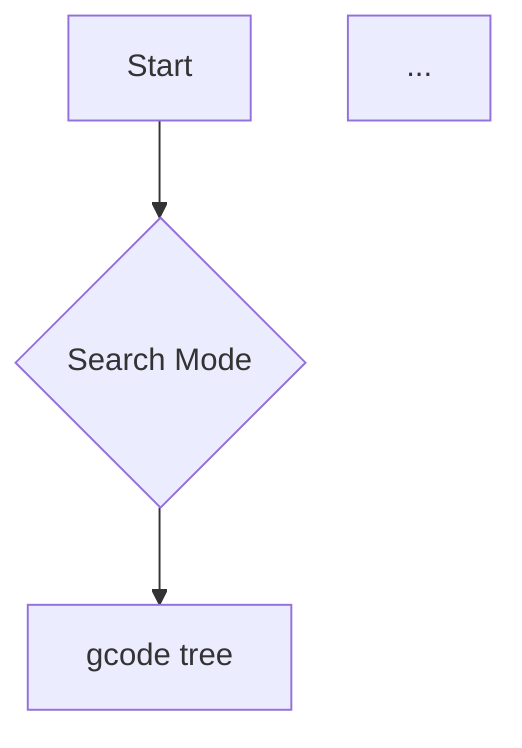

# Codewiki narrative quality — #853 investigation & baseline

**Task:** #853 — "Investigate generated codewiki narrative quality" → DeepWiki-grade narrative
for `gcode codewiki`.
**Baseline captured at:** commit `e8ddea5` (vault `gobby-wiki/`, relocated in `b8c4aa0`).
**Status of this doc:** the *before* anchor. After-regen numbers are appended by **#853E**
(the before/after `missing_backlinks` delta is a required line there).

## TL;DR

We ran the wiki bake-off, adopted candidates C1–C10, and regenerated the gobby-cli codewiki.
The generated curated layer (`gobby-wiki/code/concepts/*`, `gobby-wiki/code/narrative/*`)
**reads thin** versus DeepWiki-Open / OpenDeepWiki. The cause is **structural, not a model
problem**: the C1/C9 "curated layer" adoption shipped a **structure pass but no per-page
content pass**. The concept/narrative pages a newcomer hits first are a *one-sentence summary +
link lists*, wrapped in 89–1,316 lines of provenance frontmatter. DeepWiki/OpenDeepWiki run
structure *then* generate each page as a multi-section narrative; we stop after structure.

The human-readable target is "explain my codebase" / guided tutorial. The fix
(#853B–E) is two-pass content generation, bounded diagrams on curated pages, frontmatter
bounding, a guided-tour spine, and a lint cleanup — all content-only (no CLI/JSON contract
change).

---

## 1. Side-by-side narrative samples

### 1a. Competitor — DeepWiki-Open, "gcode: Code Search & Intelligence"

Source: `~/Projects/wiki-bakeoff/outputs/deepwiki-open/page_04_page-gcode-tool-gcode-code-search-intelligence.md`
(116 lines, **5 `## ` sections**, **2 mermaid diagrams**, prose is the bulk of the file).

A short `<details>` source list (5 files), then a real multi-section page — H2/H3 headings,
prose, tables, a diagram, and per-section `Sources: [file:line]()` grounding:

````markdown
# gcode: Code Search & Intelligence

`gcode` is a core component of the Gobby CLI designed for advanced code search, navigation,
and impact analysis within indexed projects. It enables developers to interact with their
codebase using natural language queries, symbol lookups, and graph-based relationships ...

## Search Capabilities
The `gcode` tool provides multiple layers of search, ranging from precise text matching to
semantic understanding.

### Search Modes
| Command | Purpose | Search Type |
| :--- | :--- | :--- |
| `gcode grep` | Identifier/Regex text search | ASCII identifier or regex |
| `gcode search` | Fuzzy/Natural language query | Hybrid (BM25 + semantic + graph) |
| ...

Sources: [crates/gcode/assets/SKILL.md:23-41]()

### Navigation Workflow


## Impact Analysis
To understand the consequences of making code changes, `gcode` provides transitive analysis ...
````

OpenDeepWiki's `architecture_core-primitives.md` follows the same shape (3 `## ` sections, 1
mermaid). Both competitors emit pages a newcomer can *read and learn from*.

### 1b. gobby — `code/concepts/foundational-bedrock.md` (1,304 lines)

The entire human-visible body of a 1,304-line file is **a title, a one-line summary, and a
4-item wikilink list** — frontmatter ends at **line 1253 (96% of the file)**:

```markdown
# Foundational Bedrock

## Overview

Houses shared configurations, CLI contracts, container orchestrations, and community detection
graph analytics.

## Reference Modules

- [[code/modules/crates|crates]]
- [[code/modules/crates/gcore|crates/gcore]]
- [[code/modules/crates/gcore/assets|crates/gcore/assets]]
- [[code/modules/crates/gcore/assets/postgres-pgsearch|crates/gcore/assets/postgres-pgsearch]]
```

### 1c. gobby — `code/concepts/cli-interface-routing.md` (89 lines)

The smaller concept pages show the pattern without the link-dump bulk: 58 lines of frontmatter,
a `<details>` source dump, then `## Overview` (one sentence) + `## Reference Modules` +
`## Source Files` link lists. Three `## ` headings, none of them narrative.

### 1d. gobby — `code/narrative/introduction.md` (1,316 lines), the *tutorial entry point*

The page a newcomer is meant to start from is also a one-sentence "Guide" + truncated link
lists (frontmatter ends ~line 1292):

```markdown
# Introduction to Gobby and GCode

## Guide

An architectural tour over the Gobby Rust codebase, showcasing its layered toolchain spanning
GCore foundation, GCode code fact indexing, and the AI-driven CodeWiki engine.

## Concepts
- [[code/concepts/foundational-bedrock|Foundational Bedrock]]
- [[code/concepts/cli-interface-routing|CLI Interface & Routing]]
- [[code/concepts/configuration-database-core|Configuration & Database Core]]

## Reference Modules
- [[code/modules/crates|crates]]
- ...

## Source Files
- [[code/files/crates/gcode/contract/gcode.contract.json|...]]
- ...
```

**The contrast:** competitor pages teach in multiple grounded sections with a diagram; gobby
curated pages summarize in one sentence and then enumerate links.

---

## 2. Root causes (verified, file:line, at `e8ddea5`)

| # | Root cause | Evidence (file:line) |
|---|------------|----------------------|
| 1 | **No content pass (the #1 cause).** One structure call returns JSON whose pages carry a one-line `summary`; the renderer writes that one-liner straight in as the body. No second per-page LLM call exists. | Structure call `build_parts/concepts.rs:29-30` (`curated_navigation_prompt` / `CURATED_NAVIGATION_SYSTEM`); concept body `concepts.rs:166` (`ground_text(&concept.summary, …)`); narrative body `concepts.rs:200` (`write_section(.., "Guide", &ground_text(&page.summary, ..))`). |
| 2 | **Self-throttling prompts.** Aggregate prompts cap themselves at a couple of short paragraphs and (for architecture) forbid headings/lists. | `prompts.rs:10` MODULE_SYSTEM "one to two short paragraphs"; `prompts.rs:11` REPO_SYSTEM "one to two short paragraphs"; `prompts.rs:13` ARCHITECTURE_NARRATIVE_SYSTEM "two to three short paragraphs … no headings, no lists". |
| 3 | **Tight input budgets.** "Rich input → rich output" is under-fed. | `prompts.rs:272` `MAX_PROMPT_SOURCE_EXCERPTS = 4`; `prompts.rs:271` `SOURCE_EXCERPT_MAX_CHARS = 2_400`; `prompts.rs:265` `CHILD_SUMMARY_EXCERPT_MAX_CHARS = 2_000`. |
| 4 | **Curated pages render 0 diagrams.** The diagram renderers *bound* rather than suppress, but curated concept/narrative pages never call any of them. | `grep -rl '```mermaid' gobby-wiki/code/concepts gobby-wiki/code/narrative` → **0**; the capability exists and is used on module pages (e.g. `code/modules/crates/gcode.md`). `render/diagrams.rs` (`simplified_diagram_note`). |
| 5 | **Frontmatter / provenance bloat.** Curated pages keep every file's full per-range YAML array plus an inline `<details>Relevant source files</details>` dump; prose is a few % of the file. The cap is on file *count* only. | `text/frontmatter.rs:33` `MAX_FRONTMATTER_PROVENANCE_FILES = 30`; range-free helper already exists at `frontmatter.rs:51` (`frontmatter_with_degradation_without_ranges`). `foundational-bedrock.md`: frontmatter = lines 1–1253 of 1304 (**96%**). |
| 6 | **Exhaustive down-link dumps → 2,102 `missing_backlinks`.** `gwiki lint` is a reciprocity check (A links to B but B doesn't link back → flag B). All 2,102 come from pages that dump every member file/module as a wikilink and never get linked back. For concept/narrative pages the exhaustive `## Source Files`/`## Reference Modules` lists *are* the link-farm that makes them read thin → cut them. For genuine index/aggregate pages enumeration is the point → exempt them in lint. | `lint.rs:399` (`missing_backlinks`); orphan-exempt sibling at `lint.rs:367` (`is_orphan_exempt`). Per-target breakdown in §3. |

The reuse-invalidation lever is `mod.rs:14` `CODEWIKI_RENDER_VERSION = 3` (consumed at
`reuse.rs:100`); unchanged-source thin pages are silently reused unless this is bumped.

---

## 3. Before-metrics (hard numbers, `gwiki lint --project --format json` at `e8ddea5`)

| Metric | Baseline |
|--------|----------|
| `broken_links` | **0** |
| `orphan_pages` | **8** (see note) |
| `missing_backlinks` | **2,102** |
| `missing_frontmatter` | 2 (`code/INDEX.md`, `knowledge/INDEX.md` — directory indexes) |
| Curated diagrams (`mermaid` on `code/{concepts,narrative}`) | **0** |
| Reference appendix (`code/files` + `code/modules` `.md`) | **551** (471 files + 80 modules) |

**`missing_backlinks` by target page** (the dumping/aggregate page expecting a backlink) —
77 distinct targets; the head:

| Count | Target page | Kind |
|------:|-------------|------|
| 530 | Code Ownership | aggregate/index |
| 279 | Hotspots | aggregate/index |
| 189 | Start Here (onboarding) | aggregate/index |
| 46 | Architecture Overview | aggregate/index |
| 42 | Curated Concept Navigation (`code/concepts/index`) | navigation root |
| 33–39 each | the concept & narrative pages (Introduction, Query Dispatch, CodeWiki Engine, Architecture, Data Flow, Foundational Bedrock, …) | content pages |
| ≤37 each | module pages (`crates/gwiki/src/commands`, `crates/gwiki/src/ingest`, `crates`, `crates/gcode`, …) | module index |

Flagged target (`path`) pages: **1,946** under `code/files/`, **123** under `code/modules/`,
**33** elsewhere ≈ 2,102.

This splits the fix cleanly: the big aggregate/navigation roots (Ownership 530 + Hotspots 279 +
onboarding 189 + Architecture Overview 46 + nav 42 + Repository Overview 31 ≈ **1,117**) are
fixed by the **lint navigation-root exemption (#853D)**; the concept/narrative content-page
share (~33–39 each) is fixed **at the source** by **sparse curated linking (#853B commit 4)** —
no 2,102-row reciprocal-breadcrumb pass needed. Per-source module pages remain reciprocal via
their own member lists.

> **Note (orphans):** the plan's investigation expected ~1 orphan; the live vault shows **8**:
> the five `code/_*` aggregate pages (`_architecture`, `_changes`, `_hotspots`, `_onboarding`,
> `_ownership`) and three narrative subsystem pages (`codewiki-engine`,
> `fact-extraction-pipeline`, `searching-and-projections`). The narrative orphans are a symptom
> the **#853C guided-tour spine** (curated TOC + `Previous`/`Next` chapter chain) should clear;
> the `_*` aggregate orphans are expected index roots. **#853E** must re-baseline its
> "orphans ≤ 1" acceptance against this 8, or itemize the residual.

### Curated-page line counts (mostly frontmatter + link dumps, not narrative)

`concepts/` (`## ` heading count in parens): foundational-bedrock 1304 (2) · query-dispatch
1155 (3) · index 891 (2) · filesystem-walker 597 (3) · codewiki-ai-engine 511 (3) ·
falkordb-sync 442 (3) · import-resolution 419 (3) · configuration-database 267 (3) ·
postgresql-schema 110 (2) · cli-interface-routing 89 (3).

`narrative/`: introduction 1316 (4) · architecture 1306 (2) · data-flow 1306 (2) ·
searching-and-projections 1154 (4) · fact-extraction 589 (4) · codewiki-engine 510 (4).

Every curated page has **2–4 `## ` headings**, and on the large pages those are `Overview` +
`Reference Modules`/`Source Files` link dumps — i.e. line count is provenance and links, not
prose. Compare: the deepwiki-open gcode page is 116 lines with **5** narrative `## ` sections
and 2 diagrams.

---

## 4. Remediation summary (#853B–E)

Content-only; no CLI flag, no JSON-key change (contract tests pin codewiki/gwiki byte-for-byte).
Commits `[gobby-cli-#853] type: summary`, explicit staging, no push.

- **#853A (this doc)** — baseline writeup, committed first so regen is a measurable before/after.
- **#853B — narrative & content engine (commits 2–6):**
  - bump `CODEWIKI_RENDER_VERSION 3→4` to force regeneration (root cause invalidation lever);
  - add per-page `CONCEPT_PAGE_SYSTEM` (reference-explainer) / `NARRATIVE_PAGE_SYSTEM`
    (tutorial/chapter voice) prompts demanding multi-section pages with evidence anchors, plus
    per-pass excerpt budgets (shared `MAX_PROMPT_SOURCE_EXCERPTS=4` left untouched);
  - two-pass curated generation in a **new** `build_parts/curated_content.rs` (keeps
    `concepts.rs` < 1,000 lines), with a deterministic multi-section structural fallback for
    `--ai off`/failures and `body_degraded` honesty;
  - **sparse curated linking** — replace exhaustive `## Source Files`/`## Reference Modules`
    dumps with a bounded `## Key components` (`MAX_CURATED_KEY_COMPONENTS=8`) + module-root
    links (this is also the #853D source-side fix for root cause 6);
  - bounded frontmatter (range-free curated frontmatter; reference pages keep full ranges);
  - bounded diagrams injected on curated pages (reuse `ModuleDoc.dependency_diagram`).
- **#853C — guided tour & entry UX (commits 7–8):** promote a curated "Start here" TOC on
  `code/repo.md`, demote Modules/Files to a labeled "Reference appendix" (kept), dependency-
  ordered narrative chapters with `← Previous`/`Next →` links, and a `gwiki ask`/`search`
  pointer. Navigation/linking only — no disk path moves, no new generation calls.
- **#853D — lint cleanup (commit 9):** `is_backlink_source_exempt(path)` in `gwiki/src/lint.rs`
  exempting navigation/index/aggregate roots (`code/repo`, `code/concepts/index`,
  `code/_ownership`, `code/_hotspots`, `code/_onboarding`) matched by **relative path only**;
  content pages stay non-exempt (handled at source by #853B).
- **#853E — regen + after-metrics closeout:** full gates, build+deploy gcode, regenerate, verify
  against this baseline, and append the after-numbers below.

---

## 5. After-regen results (filled in by #853E)

_To be completed by #853E. Required lines:_
- `missing_backlinks` before → after (the delta Josh flagged): **2,102 → _TBD_**.
- Zero thin curated pages (every `code/{concepts,narrative}/*.md` ≥ 4 real `## ` sections;
  frontmatter a small fraction of line count).
- Diagrams present on curated pages (was 0).
- Reference appendix intact (~551 file+module pages, full-range provenance).
- Guided tour reads as a tutorial (curated TOC, dependency-ordered chapters with Prev/Next chain).
- `_meta/codewiki.json` `render_version: 4`.
- Residual `missing_backlinks` itemized by source page (not dismissed).

---

## 6. Epic #871 closeout (Leaf 6 / #877) — verified-shape regen + after-metrics

Supersedes §5 and the old #853E / #869 "regen-only" acceptance. This is the closeout of the
umbrella epic **#871 — "Trustworthy code-intelligence surfaces"**, which shipped (Leaves 1–5):
decomposed `concepts.rs`; a grounded codewiki **verify pass** (generate → verify → strip
unsupported blocks); verified multi-section file/module **narrative rendering**; internal
**citation re-anchoring** + a no-LLM repair routine; and **gcode contract v2** (daemon-consumed
query surface + public `codewiki --repair-citations`), built and installed to `~/.gobby/bin/`.

### Regen

Installed binary `~/.gobby/bin/gcode` 1.2.0 (`contract_version: 2`, `--repair-citations` live)
ran:

```
gcode codewiki --out gobby-wiki --ai off
```

Result: `files: 482, modules: 81, symbols: 9600, skipped: 0, ai_enabled: false`. Every page in
`_meta/codewiki.json` is now **`render_version: 6`** (585/585 docs; the cache epoch bumped 3/4→6
in Leaves 2–3 forces a full rewrite out of the legacy symbol-dump shape).

### Page-shape assertions (whole vault)

| Check | Result |
| --- | --- |
| File pages with ≥3 `## ` sections | **482/482** (min = 3: `Overview` / `How it fits` / `Key components`) |
| `Component ID` occurrences | **0** files |
| `API Symbols` symbol-table header | **0** files |
| `<details>` on file pages | **0** |
| `<details>` on module pages | **0** |
| Module pages slimmed (range-free frontmatter, bounded `Overview`/diagrams/`Files`) | yes |
| `_meta/codewiki.json` render_version | **6** (all docs) |

The 20 residual `<details>` blocks are all on **aggregate** pages (`concepts/`, `narrative/`,
`repo.md`, `_architecture`, `_hotspots`, `_onboarding`) and are the curated
`<summary>Relevant source files</summary>` navigation aid — not the legacy per-symbol
byte/line provenance dump that Leaf 3 removed from `render_file_doc`/`render_module_doc`.

### `gwiki lint --project` deltas (before → after regen)

| Metric | Before | After | Δ |
| --- | --- | --- | --- |
| `broken_links` | 0 | 0 | 0 |
| `missing_backlinks` | 2297 | 1471 | **−826** |
| `orphan_pages` | 13 | 5 | **−8** |
| `missing_frontmatter` | 2 | 2 | 0 (pre-existing) |
| `duplicate_aliases` | 0 | 0 | 0 |

Broken links stay at zero; the new narrative shape cut missing backlinks by 826 and orphan pages
by 8.

### AI narrative + verify layer — deferred to nightly daemon regen (honest cost)

This regen used `--ai off`, so the committed vault carries the deterministic structural body
(multi-section shape, hub-`summary` Key-components purposes, range-free frontmatter) and the
**verify pass did not run on it**. The grounded generate→verify pipeline itself is independently
proven by the Leaf 2/3 unit tests (planted-unsupported-block stripping, each degradation path,
standalone direct generate+verify) and the Leaf 5 contract/CLI acceptance. A cold full **AI-on**
regen is intentionally deferred to the nightly daemon regen (linked gobby-cron task), per the
epic's "Honest cost" note: with the serial `AiLimiter` (`max_concurrency = 1`) a full
generate+verify pass is ~2 calls × 574 pages and is hours-scale — observed **67 s blocked on
file 1 of 482** before switching to the deterministic structural regen for this closeout.

## 2026-06-20 — AI-on full regen + citation-anchor fix (#897 / #898 / #901, closeout #899)

Full **AI-on** vault regen (`gcode codewiki --out gobby-wiki --ai daemon --ai-depth sections
--ai-aggregate-profile feature_high`): 602 pages (491 files / 81 modules / 9809 symbols),
`CODEWIKI_RENDER_VERSION` 10. Lands the #897 deep-wiki narrative renderer plus the #901
citation-anchor fix.

### `gwiki lint --project` deltas (this regen)

| Metric | First AI-on regen | After #901 fix + orphan cleanup | Δ |
| --- | --- | --- | --- |
| `broken_links` | **209** | **0** | **−209** |
| degraded pages (`model-unavailable`) | 7 | **0** | **−7** |
| `orphan_pages` | 12 | 9 | −3 (residual 9 are the expected `_*`/catalog index roots) |
| `missing_backlinks` | 706 | 667 | −39 |
| `missing_frontmatter` | 1 | 1 | 0 (pre-existing) |
| `duplicate_aliases` | 0 | 0 | 0 |

### Root causes found this session

1. **`broken_links` 0→209 regression (#901, fixed).** #897's "cite inline" change made the model emit
   citations as `[path:line](path:line)` markdown links; `text/sanitize.rs::sanitize_model_markdown_links`
   passed the relative `path:line` target through verbatim, so the colon target never resolved and
   `gwiki lint` flagged it. Added a re-anchoring pass (`citation_anchor_replacements` /
   `anchor_citation_target`) at the `ground_text` chokepoint that rewrites relative citation targets
   `path:line[-end]` → `path#Lline[-Lend]` (the `frontmatter.rs::source_range_href` form). Result across
   the vault: **2360 anchored `#L` links, 0 broken**. Unit test
   `reanchors_relative_citation_link_targets_to_line_anchors`.
2. **Non-deterministic narrative slugs leave orphaned stale pages (systemic — tracked under #878/#900).**
   Narrative page slugs drift across regens: the original run's `from-files-to-code-facts` /
   `retrieving-code` were not reproduced this run, which instead emitted `building-the-code-index` /
   `resolving-relationships` / etc., and superseded pages are **not** garbage-collected. The 2 stale
   leftovers (`from-files-to-code-facts.md` @11:50, `retrieving-code.md` @10:54) were `cache=false`
   orphans carrying all 33 residual broken links **and** the lone `degraded` marker — the degradation was
   a *transient* failure on the original run, not deterministic (the new-slug equivalent regenerated
   clean). Removing the 2 orphans drove broken_links and degraded both to 0. Codewiki needs stable
   narrative slugs or orphan GC.

Definition-of-done for codewiki work is now the **regen + `gwiki lint` clean** gate (broken_links 0,
degraded ≤1, orphans = the `_*` index roots), under epic #878 — not a downstream fix-up epic.

## #894 final pass — full-vault verification & v13 cleanup (2026-06-22)

**Leaf G (#894):** the single full-regen + bake-off + commit. The 601-page vault was already fully
regenerated at render-version 12 (#904 opus-first writer + sonnet QA, riding the robust verifier from
Leaves 8–10) and committed. This pass verifies that output and lands the residual v13 (#905) render fix
without a wasteful from-scratch regen.

**Daemon chains (live probe, `POST /api/llm/generate`):** `feature_low`→claude/haiku (2.7s),
`feature_mid`→claude/sonnet (2.5s), `feature_high`→codex/gpt-5.5@xhigh (4.5s, `applied_reasoning_effort`
surfaced). **No gemini in any chain** — confirms the Phase-1 reasoning refactor is deployed and the
feature_low/mid/high tiers are haiku/sonnet/opus-class.

**Verifier robustness (scoped sample, `crates/gcode/src/search`, 12 pages):** 0 `degraded`, 0
false-positive verify flags — vs the 8–10/12 `model-unavailable` baseline that motivated this epic. The
evidence-starved verifier was the bug; giving it the generator's symbol table (Leaf 8) + non-destructive
frontmatter notes (Leaf 9) fixed it.

**v12→v13 delta applied deterministically (no AI, no 10–17h regen):** the render-version bump 12→13
globally invalidates page reuse, so a from-scratch regen would re-generate 592 byte-identical pages to
fix 9. Instead the committed #905 render behavior was replicated in place — removed the model's duplicate
leading `# H1` on the 7 narrative pages + 1 concept page + `repo.md`, and removed `repo.md`'s orphaned
dead-code-candidates link (#902 dropped that page). 9 files, 19 deletions.

**Final `gwiki lint --project` (clean gate met):**

| metric | before (#894) | after | note |
|---|---|---|---|
| `broken_links` | 1 | **0** | removed the orphaned dead-code-candidates link |
| `duplicate_aliases` | 0 | 0 | |
| `missing_backlinks` | 506 | 506 | pre-existing (file/symbol leaf pages) |
| `missing_frontmatter` | 1 | 1 | pre-existing |
| `orphan_pages` | 5 | 5 | the `_*` index roots (expected) |
| duplicate-H1 pages | 9 | **0** | #905 strip applied |
| `degraded: true` | 1 | 1 | `_ownership` only — genuine `codeowners_unavailable` (no CODEOWNERS file) |

Definition-of-done met: broken_links 0, degraded ≤1 (genuine), orphans = the `_*` index roots, **0
false-positive degradation**.
