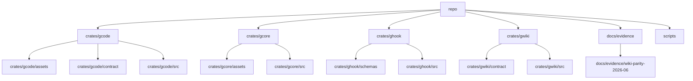

Relevant source files

- [crates/gcode/contract/gcode.contract.json:2-1729](crates/gcode/contract/gcode.contract.json#L2-L1729)
- [crates/gcode/src/commands/codewiki/types.rs:11-21](crates/gcode/src/commands/codewiki/types.rs#L11-L21), [crates/gcode/src/commands/codewiki/types.rs:26-30](crates/gcode/src/commands/codewiki/types.rs#L26-L30), [crates/gcode/src/commands/codewiki/types.rs:33-45](crates/gcode/src/commands/codewiki/types.rs#L33-L45), [crates/gcode/src/commands/codewiki/types.rs:50-62](crates/gcode/src/commands/codewiki/types.rs#L50-L62), [crates/gcode/src/commands/codewiki/types.rs:65-69](crates/gcode/src/commands/codewiki/types.rs#L65-L69), [crates/gcode/src/commands/codewiki/types.rs:72-81](crates/gcode/src/commands/codewiki/types.rs#L72-L81), [crates/gcode/src/commands/codewiki/types.rs:83-92](crates/gcode/src/commands/codewiki/types.rs#L83-L92), [crates/gcode/src/commands/codewiki/types.rs:96-99](crates/gcode/src/commands/codewiki/types.rs#L96-L99), [crates/gcode/src/commands/codewiki/types.rs:102-105](crates/gcode/src/commands/codewiki/types.rs#L102-L105), [crates/gcode/src/commands/codewiki/types.rs:108-113](crates/gcode/src/commands/codewiki/types.rs#L108-L113), [crates/gcode/src/commands/codewiki/types.rs:115-120](crates/gcode/src/commands/codewiki/types.rs#L115-L120), [crates/gcode/src/commands/codewiki/types.rs:122-127](crates/gcode/src/commands/codewiki/types.rs#L122-L127), [crates/gcode/src/commands/codewiki/types.rs:131-135](crates/gcode/src/commands/codewiki/types.rs#L131-L135), [crates/gcode/src/commands/codewiki/types.rs:138-150](crates/gcode/src/commands/codewiki/types.rs#L138-L150), [crates/gcode/src/commands/codewiki/types.rs:153-159](crates/gcode/src/commands/codewiki/types.rs#L153-L159), [crates/gcode/src/commands/codewiki/types.rs:162-177](crates/gcode/src/commands/codewiki/types.rs#L162-L177), [crates/gcode/src/commands/codewiki/types.rs:180-186](crates/gcode/src/commands/codewiki/types.rs#L180-L186), [crates/gcode/src/commands/codewiki/types.rs:189-194](crates/gcode/src/commands/codewiki/types.rs#L189-L194), [crates/gcode/src/commands/codewiki/types.rs:197-202](crates/gcode/src/commands/codewiki/types.rs#L197-L202), [crates/gcode/src/commands/codewiki/types.rs:205-209](crates/gcode/src/commands/codewiki/types.rs#L205-L209), [crates/gcode/src/commands/codewiki/types.rs:212-217](crates/gcode/src/commands/codewiki/types.rs#L212-L217), [crates/gcode/src/commands/codewiki/types.rs:220-226](crates/gcode/src/commands/codewiki/types.rs#L220-L226), [crates/gcode/src/commands/codewiki/types.rs:229-235](crates/gcode/src/commands/codewiki/types.rs#L229-L235), [crates/gcode/src/commands/codewiki/types.rs:238-245](crates/gcode/src/commands/codewiki/types.rs#L238-L245), [crates/gcode/src/commands/codewiki/types.rs:248-252](crates/gcode/src/commands/codewiki/types.rs#L248-L252), [crates/gcode/src/commands/codewiki/types.rs:255-259](crates/gcode/src/commands/codewiki/types.rs#L255-L259), [crates/gcode/src/commands/codewiki/types.rs:262-266](crates/gcode/src/commands/codewiki/types.rs#L262-L266), [crates/gcode/src/commands/codewiki/types.rs:269-281](crates/gcode/src/commands/codewiki/types.rs#L269-L281), [crates/gcode/src/commands/codewiki/types.rs:284-291](crates/gcode/src/commands/codewiki/types.rs#L284-L291), [crates/gcode/src/commands/codewiki/types.rs:294-314](crates/gcode/src/commands/codewiki/types.rs#L294-L314), [crates/gcode/src/commands/codewiki/types.rs:319-326](crates/gcode/src/commands/codewiki/types.rs#L319-L326), [crates/gcode/src/commands/codewiki/types.rs:329-336](crates/gcode/src/commands/codewiki/types.rs#L329-L336), [crates/gcode/src/commands/codewiki/types.rs:340-347](crates/gcode/src/commands/codewiki/types.rs#L340-L347), [crates/gcode/src/commands/codewiki/types.rs:350-353](crates/gcode/src/commands/codewiki/types.rs#L350-L353), [crates/gcode/src/commands/codewiki/types.rs:356-362](crates/gcode/src/commands/codewiki/types.rs#L356-L362), [crates/gcode/src/commands/codewiki/types.rs:364](crates/gcode/src/commands/codewiki/types.rs#L364), [crates/gcode/src/commands/codewiki/types.rs:371-375](crates/gcode/src/commands/codewiki/types.rs#L371-L375), [crates/gcode/src/commands/codewiki/types.rs:380-388](crates/gcode/src/commands/codewiki/types.rs#L380-L388), [crates/gcode/src/commands/codewiki/types.rs:391-393](crates/gcode/src/commands/codewiki/types.rs#L391-L393), [crates/gcode/src/commands/codewiki/types.rs:395-397](crates/gcode/src/commands/codewiki/types.rs#L395-L397), [crates/gcode/src/commands/codewiki/types.rs:399-405](crates/gcode/src/commands/codewiki/types.rs#L399-L405), [crates/gcode/src/commands/codewiki/types.rs:409-415](crates/gcode/src/commands/codewiki/types.rs#L409-L415), [crates/gcode/src/commands/codewiki/types.rs:418-424](crates/gcode/src/commands/codewiki/types.rs#L418-L424), [crates/gcode/src/commands/codewiki/types.rs:426-432](crates/gcode/src/commands/codewiki/types.rs#L426-L432), [crates/gcode/src/commands/codewiki/types.rs:434-436](crates/gcode/src/commands/codewiki/types.rs#L434-L436)
- [crates/gcode/src/config/services.rs:20-22](crates/gcode/src/config/services.rs#L20-L22), [crates/gcode/src/config/services.rs:24-27](crates/gcode/src/config/services.rs#L24-L27), [crates/gcode/src/config/services.rs:29-39](crates/gcode/src/config/services.rs#L29-L39), [crates/gcode/src/config/services.rs:41-48](crates/gcode/src/config/services.rs#L41-L48), [crates/gcode/src/config/services.rs:51-57](crates/gcode/src/config/services.rs#L51-L57), [crates/gcode/src/config/services.rs:59-61](crates/gcode/src/config/services.rs#L59-L61), [crates/gcode/src/config/services.rs:64-67](crates/gcode/src/config/services.rs#L64-L67), [crates/gcode/src/config/services.rs:70-81](crates/gcode/src/config/services.rs#L70-L81), [crates/gcode/src/config/services.rs:83-85](crates/gcode/src/config/services.rs#L83-L85), [crates/gcode/src/config/services.rs:89-93](crates/gcode/src/config/services.rs#L89-L93), [crates/gcode/src/config/services.rs:95-99](crates/gcode/src/config/services.rs#L95-L99), [crates/gcode/src/config/services.rs:102-104](crates/gcode/src/config/services.rs#L102-L104), [crates/gcode/src/config/services.rs:108-125](crates/gcode/src/config/services.rs#L108-L125), [crates/gcode/src/config/services.rs:127-129](crates/gcode/src/config/services.rs#L127-L129), [crates/gcode/src/config/services.rs:132-135](crates/gcode/src/config/services.rs#L132-L135), [crates/gcode/src/config/services.rs:138-143](crates/gcode/src/config/services.rs#L138-L143), [crates/gcode/src/config/services.rs:150-162](crates/gcode/src/config/services.rs#L150-L162), [crates/gcode/src/config/services.rs:164-166](crates/gcode/src/config/services.rs#L164-L166), [crates/gcode/src/config/services.rs:169-178](crates/gcode/src/config/services.rs#L169-L178), [crates/gcode/src/config/services.rs:181-196](crates/gcode/src/config/services.rs#L181-L196), [crates/gcode/src/config/services.rs:199-221](crates/gcode/src/config/services.rs#L199-L221), [crates/gcode/src/config/services.rs:226-241](crates/gcode/src/config/services.rs#L226-L241), [crates/gcode/src/config/services.rs:244-247](crates/gcode/src/config/services.rs#L244-L247), [crates/gcode/src/config/services.rs:255-257](crates/gcode/src/config/services.rs#L255-L257), [crates/gcode/src/config/services.rs:259-261](crates/gcode/src/config/services.rs#L259-L261), [crates/gcode/src/config/services.rs:270-276](crates/gcode/src/config/services.rs#L270-L276), [crates/gcode/src/config/services.rs:278-280](crates/gcode/src/config/services.rs#L278-L280), [crates/gcode/src/config/services.rs:284-287](crates/gcode/src/config/services.rs#L284-L287), [crates/gcode/src/config/services.rs:295-301](crates/gcode/src/config/services.rs#L295-L301), [crates/gcode/src/config/services.rs:303-305](crates/gcode/src/config/services.rs#L303-L305), [crates/gcode/src/config/services.rs:309-322](crates/gcode/src/config/services.rs#L309-L322), [crates/gcode/src/config/services.rs:325-338](crates/gcode/src/config/services.rs#L325-L338), [crates/gcode/src/config/services.rs:341-354](crates/gcode/src/config/services.rs#L341-L354), [crates/gcode/src/config/services.rs:357-370](crates/gcode/src/config/services.rs#L357-L370), [crates/gcode/src/config/services.rs:373-384](crates/gcode/src/config/services.rs#L373-L384), [crates/gcode/src/config/services.rs:389-399](crates/gcode/src/config/services.rs#L389-L399), [crates/gcode/src/config/services.rs:401-416](crates/gcode/src/config/services.rs#L401-L416), [crates/gcode/src/config/services.rs:421-431](crates/gcode/src/config/services.rs#L421-L431), [crates/gcode/src/config/services.rs:433-442](crates/gcode/src/config/services.rs#L433-L442), [crates/gcode/src/config/services.rs:444-452](crates/gcode/src/config/services.rs#L444-L452), [crates/gcode/src/config/services.rs:454-469](crates/gcode/src/config/services.rs#L454-L469), [crates/gcode/src/config/services.rs:471-494](crates/gcode/src/config/services.rs#L471-L494), [crates/gcode/src/config/services.rs:501-511](crates/gcode/src/config/services.rs#L501-L511), [crates/gcode/src/config/services.rs:513-533](crates/gcode/src/config/services.rs#L513-L533), [crates/gcode/src/config/services.rs:535-545](crates/gcode/src/config/services.rs#L535-L545), [crates/gcode/src/config/services.rs:547-557](crates/gcode/src/config/services.rs#L547-L557), [crates/gcode/src/config/services.rs:559-568](crates/gcode/src/config/services.rs#L559-L568), [crates/gcode/src/config/services.rs:570-576](crates/gcode/src/config/services.rs#L570-L576), [crates/gcode/src/config/services.rs:578-587](crates/gcode/src/config/services.rs#L578-L587), [crates/gcode/src/config/services.rs:589-603](crates/gcode/src/config/services.rs#L589-L603), [crates/gcode/src/config/services.rs:605-611](crates/gcode/src/config/services.rs#L605-L611), [crates/gcode/src/config/services.rs:613-624](crates/gcode/src/config/services.rs#L613-L624), [crates/gcode/src/config/services.rs:626-635](crates/gcode/src/config/services.rs#L626-L635)
- [crates/gcode/src/db/resolution.rs:16-18](crates/gcode/src/db/resolution.rs#L16-L18), [crates/gcode/src/db/resolution.rs:21-24](crates/gcode/src/db/resolution.rs#L21-L24), [crates/gcode/src/db/resolution.rs:27-29](crates/gcode/src/db/resolution.rs#L27-L29), [crates/gcode/src/db/resolution.rs:31-33](crates/gcode/src/db/resolution.rs#L31-L33), [crates/gcode/src/db/resolution.rs:39-48](crates/gcode/src/db/resolution.rs#L39-L48), [crates/gcode/src/db/resolution.rs:51-64](crates/gcode/src/db/resolution.rs#L51-L64), [crates/gcode/src/db/resolution.rs:67-81](crates/gcode/src/db/resolution.rs#L67-L81), [crates/gcode/src/db/resolution.rs:83-138](crates/gcode/src/db/resolution.rs#L83-L138), [crates/gcode/src/db/resolution.rs:140-156](crates/gcode/src/db/resolution.rs#L140-L156), [crates/gcode/src/db/resolution.rs:158-166](crates/gcode/src/db/resolution.rs#L158-L166), [crates/gcode/src/db/resolution.rs:168-175](crates/gcode/src/db/resolution.rs#L168-L175), [crates/gcode/src/db/resolution.rs:177-186](crates/gcode/src/db/resolution.rs#L177-L186), [crates/gcode/src/db/resolution.rs:188-211](crates/gcode/src/db/resolution.rs#L188-L211), [crates/gcode/src/db/resolution.rs:213-226](crates/gcode/src/db/resolution.rs#L213-L226), [crates/gcode/src/db/resolution.rs:228-235](crates/gcode/src/db/resolution.rs#L228-L235), [crates/gcode/src/db/resolution.rs:237-244](crates/gcode/src/db/resolution.rs#L237-L244), [crates/gcode/src/db/resolution.rs:246-255](crates/gcode/src/db/resolution.rs#L246-L255), [crates/gcode/src/db/resolution.rs:257-280](crates/gcode/src/db/resolution.rs#L257-L280), [crates/gcode/src/db/resolution.rs:282-284](crates/gcode/src/db/resolution.rs#L282-L284), [crates/gcode/src/db/resolution.rs:286-300](crates/gcode/src/db/resolution.rs#L286-L300), [crates/gcode/src/db/resolution.rs:302-323](crates/gcode/src/db/resolution.rs#L302-L323), [crates/gcode/src/db/resolution.rs:325-353](crates/gcode/src/db/resolution.rs#L325-L353), [crates/gcode/src/db/resolution.rs:362-367](crates/gcode/src/db/resolution.rs#L362-L367), [crates/gcode/src/db/resolution.rs:370-378](crates/gcode/src/db/resolution.rs#L370-L378), [crates/gcode/src/db/resolution.rs:381-388](crates/gcode/src/db/resolution.rs#L381-L388), [crates/gcode/src/db/resolution.rs:391-399](crates/gcode/src/db/resolution.rs#L391-L399), [crates/gcode/src/db/resolution.rs:402-417](crates/gcode/src/db/resolution.rs#L402-L417), [crates/gcode/src/db/resolution.rs:420-432](crates/gcode/src/db/resolution.rs#L420-L432), [crates/gcode/src/db/resolution.rs:435-452](crates/gcode/src/db/resolution.rs#L435-L452), [crates/gcode/src/db/resolution.rs:455-472](crates/gcode/src/db/resolution.rs#L455-L472), [crates/gcode/src/db/resolution.rs:475-500](crates/gcode/src/db/resolution.rs#L475-L500), [crates/gcode/src/db/resolution.rs:503-511](crates/gcode/src/db/resolution.rs#L503-L511), [crates/gcode/src/db/resolution.rs:514-521](crates/gcode/src/db/resolution.rs#L514-L521), [crates/gcode/src/db/resolution.rs:524-529](crates/gcode/src/db/resolution.rs#L524-L529), [crates/gcode/src/db/resolution.rs:532-537](crates/gcode/src/db/resolution.rs#L532-L537), [crates/gcode/src/db/resolution.rs:540-552](crates/gcode/src/db/resolution.rs#L540-L552), [crates/gcode/src/db/resolution.rs:555-572](crates/gcode/src/db/resolution.rs#L555-L572), [crates/gcode/src/db/resolution.rs:575-583](crates/gcode/src/db/resolution.rs#L575-L583), [crates/gcode/src/db/resolution.rs:586-597](crates/gcode/src/db/resolution.rs#L586-L597), [crates/gcode/src/db/resolution.rs:600-604](crates/gcode/src/db/resolution.rs#L600-L604), [crates/gcode/src/db/resolution.rs:607-613](crates/gcode/src/db/resolution.rs#L607-L613), [crates/gcode/src/db/resolution.rs:616-622](crates/gcode/src/db/resolution.rs#L616-L622), [crates/gcode/src/db/resolution.rs:625-633](crates/gcode/src/db/resolution.rs#L625-L633), [crates/gcode/src/db/resolution.rs:636-648](crates/gcode/src/db/resolution.rs#L636-L648), [crates/gcode/src/db/resolution.rs:651-665](crates/gcode/src/db/resolution.rs#L651-L665), [crates/gcode/src/db/resolution.rs:668-682](crates/gcode/src/db/resolution.rs#L668-L682), [crates/gcode/src/db/resolution.rs:685-696](crates/gcode/src/db/resolution.rs#L685-L696), [crates/gcode/src/db/resolution.rs:699-711](crates/gcode/src/db/resolution.rs#L699-L711), [crates/gcode/src/db/resolution.rs:714-722](crates/gcode/src/db/resolution.rs#L714-L722), [crates/gcode/src/db/resolution.rs:725-733](crates/gcode/src/db/resolution.rs#L725-L733), [crates/gcode/src/db/resolution.rs:736-744](crates/gcode/src/db/resolution.rs#L736-L744), [crates/gcode/src/db/resolution.rs:746-754](crates/gcode/src/db/resolution.rs#L746-L754), [crates/gcode/src/db/resolution.rs:756-761](crates/gcode/src/db/resolution.rs#L756-L761), [crates/gcode/src/db/resolution.rs:763-765](crates/gcode/src/db/resolution.rs#L763-L765), [crates/gcode/src/db/resolution.rs:767-794](crates/gcode/src/db/resolution.rs#L767-L794)
- [crates/gcode/src/index/semantic.rs:15-23](crates/gcode/src/index/semantic.rs#L15-L23), [crates/gcode/src/index/semantic.rs:26-29](crates/gcode/src/index/semantic.rs#L26-L29), [crates/gcode/src/index/semantic.rs:33-43](crates/gcode/src/index/semantic.rs#L33-L43), [crates/gcode/src/index/semantic.rs:45-50](crates/gcode/src/index/semantic.rs#L45-L50), [crates/gcode/src/index/semantic.rs:53-55](crates/gcode/src/index/semantic.rs#L53-L55), [crates/gcode/src/index/semantic.rs:57-85](crates/gcode/src/index/semantic.rs#L57-L85), [crates/gcode/src/index/semantic.rs:87-105](crates/gcode/src/index/semantic.rs#L87-L105), [crates/gcode/src/index/semantic.rs:107-122](crates/gcode/src/index/semantic.rs#L107-L122), [crates/gcode/src/index/semantic.rs:124-135](crates/gcode/src/index/semantic.rs#L124-L135), [crates/gcode/src/index/semantic.rs:137-145](crates/gcode/src/index/semantic.rs#L137-L145), [crates/gcode/src/index/semantic.rs:147-153](crates/gcode/src/index/semantic.rs#L147-L153), [crates/gcode/src/index/semantic.rs:155-175](crates/gcode/src/index/semantic.rs#L155-L175), [crates/gcode/src/index/semantic.rs:177-210](crates/gcode/src/index/semantic.rs#L177-L210), [crates/gcode/src/index/semantic.rs:215-231](crates/gcode/src/index/semantic.rs#L215-L231), [crates/gcode/src/index/semantic.rs:233-240](crates/gcode/src/index/semantic.rs#L233-L240), [crates/gcode/src/index/semantic.rs:242-248](crates/gcode/src/index/semantic.rs#L242-L248), [crates/gcode/src/index/semantic.rs:251-256](crates/gcode/src/index/semantic.rs#L251-L256), [crates/gcode/src/index/semantic.rs:259-271](crates/gcode/src/index/semantic.rs#L259-L271), [crates/gcode/src/index/semantic.rs:274-295](crates/gcode/src/index/semantic.rs#L274-L295), [crates/gcode/src/index/semantic.rs:297-302](crates/gcode/src/index/semantic.rs#L297-L302), [crates/gcode/src/index/semantic.rs:304-330](crates/gcode/src/index/semantic.rs#L304-L330), [crates/gcode/src/index/semantic.rs:332-335](crates/gcode/src/index/semantic.rs#L332-L335), [crates/gcode/src/index/semantic.rs:337-339](crates/gcode/src/index/semantic.rs#L337-L339), [crates/gcode/src/index/semantic.rs:341-356](crates/gcode/src/index/semantic.rs#L341-L356), [crates/gcode/src/index/semantic.rs:358-366](crates/gcode/src/index/semantic.rs#L358-L366), [crates/gcode/src/index/semantic.rs:369-399](crates/gcode/src/index/semantic.rs#L369-L399), [crates/gcode/src/index/semantic.rs:401-413](crates/gcode/src/index/semantic.rs#L401-L413), [crates/gcode/src/index/semantic.rs:415-433](crates/gcode/src/index/semantic.rs#L415-L433), [crates/gcode/src/index/semantic.rs:435-463](crates/gcode/src/index/semantic.rs#L435-L463), [crates/gcode/src/index/semantic.rs:465-475](crates/gcode/src/index/semantic.rs#L465-L475), [crates/gcode/src/index/semantic.rs:477-483](crates/gcode/src/index/semantic.rs#L477-L483), [crates/gcode/src/index/semantic.rs:485-490](crates/gcode/src/index/semantic.rs#L485-L490), [crates/gcode/src/index/semantic.rs:492-494](crates/gcode/src/index/semantic.rs#L492-L494), [crates/gcode/src/index/semantic.rs:498-504](crates/gcode/src/index/semantic.rs#L498-L504), [crates/gcode/src/index/semantic.rs:508-543](crates/gcode/src/index/semantic.rs#L508-L543), [crates/gcode/src/index/semantic.rs:546-552](crates/gcode/src/index/semantic.rs#L546-L552), [crates/gcode/src/index/semantic.rs:554-572](crates/gcode/src/index/semantic.rs#L554-L572), [crates/gcode/src/index/semantic.rs:574-596](crates/gcode/src/index/semantic.rs#L574-L596), [crates/gcode/src/index/semantic.rs:598-630](crates/gcode/src/index/semantic.rs#L598-L630), [crates/gcode/src/index/semantic.rs:632-640](crates/gcode/src/index/semantic.rs#L632-L640), [crates/gcode/src/index/semantic.rs:651-658](crates/gcode/src/index/semantic.rs#L651-L658), [crates/gcode/src/index/semantic.rs:661-673](crates/gcode/src/index/semantic.rs#L661-L673), [crates/gcode/src/index/semantic.rs:676-685](crates/gcode/src/index/semantic.rs#L676-L685), [crates/gcode/src/index/semantic.rs:688-693](crates/gcode/src/index/semantic.rs#L688-L693), [crates/gcode/src/index/semantic.rs:696-702](crates/gcode/src/index/semantic.rs#L696-L702), [crates/gcode/src/index/semantic.rs:705-723](crates/gcode/src/index/semantic.rs#L705-L723), [crates/gcode/src/index/semantic.rs:726-746](crates/gcode/src/index/semantic.rs#L726-L746), [crates/gcode/src/index/semantic.rs:749-762](crates/gcode/src/index/semantic.rs#L749-L762), [crates/gcode/src/index/semantic.rs:765-798](crates/gcode/src/index/semantic.rs#L765-L798), [crates/gcode/src/index/semantic.rs:801-819](crates/gcode/src/index/semantic.rs#L801-L819), [crates/gcode/src/index/semantic.rs:823-827](crates/gcode/src/index/semantic.rs#L823-L827), [crates/gcode/src/index/semantic.rs:831-835](crates/gcode/src/index/semantic.rs#L831-L835), [crates/gcode/src/index/semantic.rs:839-844](crates/gcode/src/index/semantic.rs#L839-L844), [crates/gcode/src/index/semantic.rs:848-853](crates/gcode/src/index/semantic.rs#L848-L853), [crates/gcode/src/index/semantic.rs:858-882](crates/gcode/src/index/semantic.rs#L858-L882), [crates/gcode/src/index/semantic.rs:885-920](crates/gcode/src/index/semantic.rs#L885-L920)
- [crates/gcode/src/models.rs:19-24](crates/gcode/src/models.rs#L19-L24), [crates/gcode/src/models.rs:27-33](crates/gcode/src/models.rs#L27-L33), [crates/gcode/src/models.rs:35-42](crates/gcode/src/models.rs#L35-L42), [crates/gcode/src/models.rs:46-48](crates/gcode/src/models.rs#L46-L48), [crates/gcode/src/models.rs:53-66](crates/gcode/src/models.rs#L53-L66), [crates/gcode/src/models.rs:69-79](crates/gcode/src/models.rs#L69-L79), [crates/gcode/src/models.rs:81-83](crates/gcode/src/models.rs#L81-L83), [crates/gcode/src/models.rs:85-87](crates/gcode/src/models.rs#L85-L87), [crates/gcode/src/models.rs:89-91](crates/gcode/src/models.rs#L89-L91), [crates/gcode/src/models.rs:93-96](crates/gcode/src/models.rs#L93-L96), [crates/gcode/src/models.rs:98-101](crates/gcode/src/models.rs#L98-L101), [crates/gcode/src/models.rs:103-106](crates/gcode/src/models.rs#L103-L106), [crates/gcode/src/models.rs:108-111](crates/gcode/src/models.rs#L108-L111), [crates/gcode/src/models.rs:113-116](crates/gcode/src/models.rs#L113-L116), [crates/gcode/src/models.rs:118-123](crates/gcode/src/models.rs#L118-L123), [crates/gcode/src/models.rs:128-154](crates/gcode/src/models.rs#L128-L154), [crates/gcode/src/models.rs:159-168](crates/gcode/src/models.rs#L159-L168), [crates/gcode/src/models.rs:174-201](crates/gcode/src/models.rs#L174-L201), [crates/gcode/src/models.rs:204-213](crates/gcode/src/models.rs#L204-L213), [crates/gcode/src/models.rs:216-232](crates/gcode/src/models.rs#L216-L232), [crates/gcode/src/models.rs:235-238](crates/gcode/src/models.rs#L235-L238), [crates/gcode/src/models.rs:240-248](crates/gcode/src/models.rs#L240-L248), [crates/gcode/src/models.rs:252-261](crates/gcode/src/models.rs#L252-L261), [crates/gcode/src/models.rs:264-267](crates/gcode/src/models.rs#L264-L267), [crates/gcode/src/models.rs:272-282](crates/gcode/src/models.rs#L272-L282), [crates/gcode/src/models.rs:285-288](crates/gcode/src/models.rs#L285-L288), [crates/gcode/src/models.rs:293-296](crates/gcode/src/models.rs#L293-L296), [crates/gcode/src/models.rs:300-310](crates/gcode/src/models.rs#L300-L310), [crates/gcode/src/models.rs:313-320](crates/gcode/src/models.rs#L313-L320), [crates/gcode/src/models.rs:325-333](crates/gcode/src/models.rs#L325-L333), [crates/gcode/src/models.rs:336-351](crates/gcode/src/models.rs#L336-L351), [crates/gcode/src/models.rs:353-357](crates/gcode/src/models.rs#L353-L357), [crates/gcode/src/models.rs:359-368](crates/gcode/src/models.rs#L359-L368), [crates/gcode/src/models.rs:382-392](crates/gcode/src/models.rs#L382-L392), [crates/gcode/src/models.rs:394-408](crates/gcode/src/models.rs#L394-L408), [crates/gcode/src/models.rs:410-417](crates/gcode/src/models.rs#L410-L417), [crates/gcode/src/models.rs:421-435](crates/gcode/src/models.rs#L421-L435), [crates/gcode/src/models.rs:446-455](crates/gcode/src/models.rs#L446-L455), [crates/gcode/src/models.rs:459-477](crates/gcode/src/models.rs#L459-L477), [crates/gcode/src/models.rs:481-495](crates/gcode/src/models.rs#L481-L495), [crates/gcode/src/models.rs:498-504](crates/gcode/src/models.rs#L498-L504), [crates/gcode/src/models.rs:507-513](crates/gcode/src/models.rs#L507-L513), [crates/gcode/src/models.rs:517-524](crates/gcode/src/models.rs#L517-L524), [crates/gcode/src/models.rs:529-537](crates/gcode/src/models.rs#L529-L537), [crates/gcode/src/models.rs:541-549](crates/gcode/src/models.rs#L541-L549), [crates/gcode/src/models.rs:553-560](crates/gcode/src/models.rs#L553-L560), [crates/gcode/src/models.rs:567-615](crates/gcode/src/models.rs#L567-L615), [crates/gcode/src/models.rs:618-631](crates/gcode/src/models.rs#L618-L631), [crates/gcode/src/models.rs:633-644](crates/gcode/src/models.rs#L633-L644), [crates/gcode/src/models.rs:647-663](crates/gcode/src/models.rs#L647-L663), [crates/gcode/src/models.rs:666-702](crates/gcode/src/models.rs#L666-L702)
- [crates/gcore/assets/docker-compose.services.yml:5-117](crates/gcore/assets/docker-compose.services.yml#L5-L117), [crates/gcore/assets/docker-compose.services.yml:119-128](crates/gcore/assets/docker-compose.services.yml#L119-L128)
- [crates/gcore/src/ai_context.rs:25-30](crates/gcore/src/ai_context.rs#L25-L30), [crates/gcore/src/ai_context.rs:34-36](crates/gcore/src/ai_context.rs#L34-L36), [crates/gcore/src/ai_context.rs:39-64](crates/gcore/src/ai_context.rs#L39-L64), [crates/gcore/src/ai_context.rs:66-68](crates/gcore/src/ai_context.rs#L66-L68), [crates/gcore/src/ai_context.rs:73-76](crates/gcore/src/ai_context.rs#L73-L76), [crates/gcore/src/ai_context.rs:80-86](crates/gcore/src/ai_context.rs#L80-L86), [crates/gcore/src/ai_context.rs:89-97](crates/gcore/src/ai_context.rs#L89-L97), [crates/gcore/src/ai_context.rs:99-107](crates/gcore/src/ai_context.rs#L99-L107), [crates/gcore/src/ai_context.rs:109-117](crates/gcore/src/ai_context.rs#L109-L117), [crates/gcore/src/ai_context.rs:119-123](crates/gcore/src/ai_context.rs#L119-L123), [crates/gcore/src/ai_context.rs:127-129](crates/gcore/src/ai_context.rs#L127-L129), [crates/gcore/src/ai_context.rs:133-135](crates/gcore/src/ai_context.rs#L133-L135), [crates/gcore/src/ai_context.rs:137-141](crates/gcore/src/ai_context.rs#L137-L141), [crates/gcore/src/ai_context.rs:144-152](crates/gcore/src/ai_context.rs#L144-L152), [crates/gcore/src/ai_context.rs:154-156](crates/gcore/src/ai_context.rs#L154-L156), [crates/gcore/src/ai_context.rs:158-175](crates/gcore/src/ai_context.rs#L158-L175), [crates/gcore/src/ai_context.rs:177-190](crates/gcore/src/ai_context.rs#L177-L190), [crates/gcore/src/ai_context.rs:194-198](crates/gcore/src/ai_context.rs#L194-L198), [crates/gcore/src/ai_context.rs:203-205](crates/gcore/src/ai_context.rs#L203-L205), [crates/gcore/src/ai_context.rs:208-216](crates/gcore/src/ai_context.rs#L208-L216), [crates/gcore/src/ai_context.rs:220-224](crates/gcore/src/ai_context.rs#L220-L224), [crates/gcore/src/ai_context.rs:232-235](crates/gcore/src/ai_context.rs#L232-L235), [crates/gcore/src/ai_context.rs:237](crates/gcore/src/ai_context.rs#L237), [crates/gcore/src/ai_context.rs:240-245](crates/gcore/src/ai_context.rs#L240-L245), [crates/gcore/src/ai_context.rs:252-257](crates/gcore/src/ai_context.rs#L252-L257), [crates/gcore/src/ai_context.rs:259-267](crates/gcore/src/ai_context.rs#L259-L267), [crates/gcore/src/ai_context.rs:274-283](crates/gcore/src/ai_context.rs#L274-L283), [crates/gcore/src/ai_context.rs:285-296](crates/gcore/src/ai_context.rs#L285-L296), [crates/gcore/src/ai_context.rs:299-302](crates/gcore/src/ai_context.rs#L299-L302), [crates/gcore/src/ai_context.rs:306](crates/gcore/src/ai_context.rs#L306), [crates/gcore/src/ai_context.rs:309-311](crates/gcore/src/ai_context.rs#L309-L311), [crates/gcore/src/ai_context.rs:313-318](crates/gcore/src/ai_context.rs#L313-L318), [crates/gcore/src/ai_context.rs:323-327](crates/gcore/src/ai_context.rs#L323-L327), [crates/gcore/src/ai_context.rs:334-340](crates/gcore/src/ai_context.rs#L334-L340), [crates/gcore/src/ai_context.rs:342-344](crates/gcore/src/ai_context.rs#L342-L344), [crates/gcore/src/ai_context.rs:352-367](crates/gcore/src/ai_context.rs#L352-L367), [crates/gcore/src/ai_context.rs:369-374](crates/gcore/src/ai_context.rs#L369-L374), [crates/gcore/src/ai_context.rs:378-385](crates/gcore/src/ai_context.rs#L378-L385), [crates/gcore/src/ai_context.rs:399-402](crates/gcore/src/ai_context.rs#L399-L402), [crates/gcore/src/ai_context.rs:405-413](crates/gcore/src/ai_context.rs#L405-L413), [crates/gcore/src/ai_context.rs:415-424](crates/gcore/src/ai_context.rs#L415-L424), [crates/gcore/src/ai_context.rs:428-430](crates/gcore/src/ai_context.rs#L428-L430), [crates/gcore/src/ai_context.rs:432-437](crates/gcore/src/ai_context.rs#L432-L437), [crates/gcore/src/ai_context.rs:440-443](crates/gcore/src/ai_context.rs#L440-L443), [crates/gcore/src/ai_context.rs:446-456](crates/gcore/src/ai_context.rs#L446-L456), [crates/gcore/src/ai_context.rs:460-462](crates/gcore/src/ai_context.rs#L460-L462), [crates/gcore/src/ai_context.rs:465-469](crates/gcore/src/ai_context.rs#L465-L469), [crates/gcore/src/ai_context.rs:472-525](crates/gcore/src/ai_context.rs#L472-L525), [crates/gcore/src/ai_context.rs:528-548](crates/gcore/src/ai_context.rs#L528-L548), [crates/gcore/src/ai_context.rs:551-579](crates/gcore/src/ai_context.rs#L551-L579), [crates/gcore/src/ai_context.rs:582-606](crates/gcore/src/ai_context.rs#L582-L606), [crates/gcore/src/ai_context.rs:609-625](crates/gcore/src/ai_context.rs#L609-L625), [crates/gcore/src/ai_context.rs:628-637](crates/gcore/src/ai_context.rs#L628-L637), [crates/gcore/src/ai_context.rs:640-651](crates/gcore/src/ai_context.rs#L640-L651), [crates/gcore/src/ai_context.rs:654-713](crates/gcore/src/ai_context.rs#L654-L713), [crates/gcore/src/ai_context.rs:716-738](crates/gcore/src/ai_context.rs#L716-L738)
- [crates/ghook/schemas/diagnose-output.v2.schema.json:2-79](crates/ghook/schemas/diagnose-output.v2.schema.json#L2-L79)
- [crates/gwiki/contract/gwiki.contract.json:2-931](crates/gwiki/contract/gwiki.contract.json#L2-L931)
- [crates/gwiki/src/benchmark.rs:30-39](crates/gwiki/src/benchmark.rs#L30-L39), [crates/gwiki/src/benchmark.rs:42-48](crates/gwiki/src/benchmark.rs#L42-L48), [crates/gwiki/src/benchmark.rs:51-58](crates/gwiki/src/benchmark.rs#L51-L58), [crates/gwiki/src/benchmark.rs:61-67](crates/gwiki/src/benchmark.rs#L61-L67), [crates/gwiki/src/benchmark.rs:70-75](crates/gwiki/src/benchmark.rs#L70-L75), [crates/gwiki/src/benchmark.rs:78-85](crates/gwiki/src/benchmark.rs#L78-L85), [crates/gwiki/src/benchmark.rs:88-91](crates/gwiki/src/benchmark.rs#L88-L91), [crates/gwiki/src/benchmark.rs:94-99](crates/gwiki/src/benchmark.rs#L94-L99), [crates/gwiki/src/benchmark.rs:104-114](crates/gwiki/src/benchmark.rs#L104-L114), [crates/gwiki/src/benchmark.rs:117-120](crates/gwiki/src/benchmark.rs#L117-L120), [crates/gwiki/src/benchmark.rs:122-145](crates/gwiki/src/benchmark.rs#L122-L145), [crates/gwiki/src/benchmark.rs:147-157](crates/gwiki/src/benchmark.rs#L147-L157), [crates/gwiki/src/benchmark.rs:159-193](crates/gwiki/src/benchmark.rs#L159-L193), [crates/gwiki/src/benchmark.rs:195-249](crates/gwiki/src/benchmark.rs#L195-L249), [crates/gwiki/src/benchmark.rs:251-264](crates/gwiki/src/benchmark.rs#L251-L264), [crates/gwiki/src/benchmark.rs:266-281](crates/gwiki/src/benchmark.rs#L266-L281), [crates/gwiki/src/benchmark.rs:283-299](crates/gwiki/src/benchmark.rs#L283-L299), [crates/gwiki/src/benchmark.rs:301-305](crates/gwiki/src/benchmark.rs#L301-L305), [crates/gwiki/src/benchmark.rs:307-331](crates/gwiki/src/benchmark.rs#L307-L331), [crates/gwiki/src/benchmark.rs:333-342](crates/gwiki/src/benchmark.rs#L333-L342), [crates/gwiki/src/benchmark.rs:344-377](crates/gwiki/src/benchmark.rs#L344-L377), [crates/gwiki/src/benchmark.rs:379-395](crates/gwiki/src/benchmark.rs#L379-L395), [crates/gwiki/src/benchmark.rs:397-489](crates/gwiki/src/benchmark.rs#L397-L489), [crates/gwiki/src/benchmark.rs:491-501](crates/gwiki/src/benchmark.rs#L491-L501), [crates/gwiki/src/benchmark.rs:503-509](crates/gwiki/src/benchmark.rs#L503-L509), [crates/gwiki/src/benchmark.rs:511-513](crates/gwiki/src/benchmark.rs#L511-L513), [crates/gwiki/src/benchmark.rs:515-534](crates/gwiki/src/benchmark.rs#L515-L534), [crates/gwiki/src/benchmark.rs:536-554](crates/gwiki/src/benchmark.rs#L536-L554), [crates/gwiki/src/benchmark.rs:556-562](crates/gwiki/src/benchmark.rs#L556-L562), [crates/gwiki/src/benchmark.rs:564-570](crates/gwiki/src/benchmark.rs#L564-L570), [crates/gwiki/src/benchmark.rs:572-584](crates/gwiki/src/benchmark.rs#L572-L584), [crates/gwiki/src/benchmark.rs:586-602](crates/gwiki/src/benchmark.rs#L586-L602), [crates/gwiki/src/benchmark.rs:604-611](crates/gwiki/src/benchmark.rs#L604-L611), [crates/gwiki/src/benchmark.rs:613-626](crates/gwiki/src/benchmark.rs#L613-L626), [crates/gwiki/src/benchmark.rs:628-631](crates/gwiki/src/benchmark.rs#L628-L631), [crates/gwiki/src/benchmark.rs:633-635](crates/gwiki/src/benchmark.rs#L633-L635), [crates/gwiki/src/benchmark.rs:637-639](crates/gwiki/src/benchmark.rs#L637-L639), [crates/gwiki/src/benchmark.rs:641-643](crates/gwiki/src/benchmark.rs#L641-L643), [crates/gwiki/src/benchmark.rs:645-649](crates/gwiki/src/benchmark.rs#L645-L649), [crates/gwiki/src/benchmark.rs:657](crates/gwiki/src/benchmark.rs#L657), [crates/gwiki/src/benchmark.rs:660-666](crates/gwiki/src/benchmark.rs#L660-L666), [crates/gwiki/src/benchmark.rs:669-671](crates/gwiki/src/benchmark.rs#L669-L671), [crates/gwiki/src/benchmark.rs:674-678](crates/gwiki/src/benchmark.rs#L674-L678), [crates/gwiki/src/benchmark.rs:682-701](crates/gwiki/src/benchmark.rs#L682-L701), [crates/gwiki/src/benchmark.rs:704-719](crates/gwiki/src/benchmark.rs#L704-L719), [crates/gwiki/src/benchmark.rs:721-737](crates/gwiki/src/benchmark.rs#L721-L737), [crates/gwiki/src/benchmark.rs:740-771](crates/gwiki/src/benchmark.rs#L740-L771), [crates/gwiki/src/benchmark.rs:774-818](crates/gwiki/src/benchmark.rs#L774-L818), [crates/gwiki/src/benchmark.rs:821-860](crates/gwiki/src/benchmark.rs#L821-L860), [crates/gwiki/src/benchmark.rs:863-873](crates/gwiki/src/benchmark.rs#L863-L873), [crates/gwiki/src/benchmark.rs:876-881](crates/gwiki/src/benchmark.rs#L876-L881), [crates/gwiki/src/benchmark.rs:884-893](crates/gwiki/src/benchmark.rs#L884-L893)
- [crates/gwiki/src/graph/mod.rs:22-26](crates/gwiki/src/graph/mod.rs#L22-L26), [crates/gwiki/src/graph/mod.rs:29-33](crates/gwiki/src/graph/mod.rs#L29-L33), [crates/gwiki/src/graph/mod.rs:36-39](crates/gwiki/src/graph/mod.rs#L36-L39), [crates/gwiki/src/graph/mod.rs:42-47](crates/gwiki/src/graph/mod.rs#L42-L47), [crates/gwiki/src/graph/mod.rs:50-59](crates/gwiki/src/graph/mod.rs#L50-L59), [crates/gwiki/src/graph/mod.rs:62-67](crates/gwiki/src/graph/mod.rs#L62-L67), [crates/gwiki/src/graph/mod.rs:70-72](crates/gwiki/src/graph/mod.rs#L70-L72), [crates/gwiki/src/graph/mod.rs:75-77](crates/gwiki/src/graph/mod.rs#L75-L77), [crates/gwiki/src/graph/mod.rs:79-81](crates/gwiki/src/graph/mod.rs#L79-L81), [crates/gwiki/src/graph/mod.rs:85-92](crates/gwiki/src/graph/mod.rs#L85-L92), [crates/gwiki/src/graph/mod.rs:95-103](crates/gwiki/src/graph/mod.rs#L95-L103), [crates/gwiki/src/graph/mod.rs:106-113](crates/gwiki/src/graph/mod.rs#L106-L113), [crates/gwiki/src/graph/mod.rs:116-122](crates/gwiki/src/graph/mod.rs#L116-L122), [crates/gwiki/src/graph/mod.rs:125-127](crates/gwiki/src/graph/mod.rs#L125-L127), [crates/gwiki/src/graph/mod.rs:130-135](crates/gwiki/src/graph/mod.rs#L130-L135), [crates/gwiki/src/graph/mod.rs:138-143](crates/gwiki/src/graph/mod.rs#L138-L143), [crates/gwiki/src/graph/mod.rs:146-148](crates/gwiki/src/graph/mod.rs#L146-L148), [crates/gwiki/src/graph/mod.rs:151-155](crates/gwiki/src/graph/mod.rs#L151-L155), [crates/gwiki/src/graph/mod.rs:158-239](crates/gwiki/src/graph/mod.rs#L158-L239), [crates/gwiki/src/graph/mod.rs:242-244](crates/gwiki/src/graph/mod.rs#L242-L244), [crates/gwiki/src/graph/mod.rs:247-249](crates/gwiki/src/graph/mod.rs#L247-L249), [crates/gwiki/src/graph/mod.rs:252-254](crates/gwiki/src/graph/mod.rs#L252-L254), [crates/gwiki/src/graph/mod.rs:256-290](crates/gwiki/src/graph/mod.rs#L256-L290), [crates/gwiki/src/graph/mod.rs:292-334](crates/gwiki/src/graph/mod.rs#L292-L334), [crates/gwiki/src/graph/mod.rs:336-343](crates/gwiki/src/graph/mod.rs#L336-L343), [crates/gwiki/src/graph/mod.rs:345-405](crates/gwiki/src/graph/mod.rs#L345-L405), [crates/gwiki/src/graph/mod.rs:407-413](crates/gwiki/src/graph/mod.rs#L407-L413), [crates/gwiki/src/graph/mod.rs:416-418](crates/gwiki/src/graph/mod.rs#L416-L418), [crates/gwiki/src/graph/mod.rs:420-422](crates/gwiki/src/graph/mod.rs#L420-L422), [crates/gwiki/src/graph/mod.rs:424-426](crates/gwiki/src/graph/mod.rs#L424-L426), [crates/gwiki/src/graph/mod.rs:428-430](crates/gwiki/src/graph/mod.rs#L428-L430), [crates/gwiki/src/graph/mod.rs:432-440](crates/gwiki/src/graph/mod.rs#L432-L440), [crates/gwiki/src/graph/mod.rs:442-449](crates/gwiki/src/graph/mod.rs#L442-L449), [crates/gwiki/src/graph/mod.rs:451-453](crates/gwiki/src/graph/mod.rs#L451-L453), [crates/gwiki/src/graph/mod.rs:455-464](crates/gwiki/src/graph/mod.rs#L455-L464), [crates/gwiki/src/graph/mod.rs:466-475](crates/gwiki/src/graph/mod.rs#L466-L475), [crates/gwiki/src/graph/mod.rs:477-486](crates/gwiki/src/graph/mod.rs#L477-L486), [crates/gwiki/src/graph/mod.rs:488-497](crates/gwiki/src/graph/mod.rs#L488-L497), [crates/gwiki/src/graph/mod.rs:499-501](crates/gwiki/src/graph/mod.rs#L499-L501), [crates/gwiki/src/graph/mod.rs:503-505](crates/gwiki/src/graph/mod.rs#L503-L505), [crates/gwiki/src/graph/mod.rs:507-513](crates/gwiki/src/graph/mod.rs#L507-L513), [crates/gwiki/src/graph/mod.rs:515-517](crates/gwiki/src/graph/mod.rs#L515-L517), [crates/gwiki/src/graph/mod.rs:519-521](crates/gwiki/src/graph/mod.rs#L519-L521), [crates/gwiki/src/graph/mod.rs:523-532](crates/gwiki/src/graph/mod.rs#L523-L532), [crates/gwiki/src/graph/mod.rs:534-554](crates/gwiki/src/graph/mod.rs#L534-L554), [crates/gwiki/src/graph/mod.rs:556-565](crates/gwiki/src/graph/mod.rs#L556-L565), [crates/gwiki/src/graph/mod.rs:567-593](crates/gwiki/src/graph/mod.rs#L567-L593), [crates/gwiki/src/graph/mod.rs:595-599](crates/gwiki/src/graph/mod.rs#L595-L599), [crates/gwiki/src/graph/mod.rs:601-606](crates/gwiki/src/graph/mod.rs#L601-L606), [crates/gwiki/src/graph/mod.rs:613-679](crates/gwiki/src/graph/mod.rs#L613-L679), [crates/gwiki/src/graph/mod.rs:682-715](crates/gwiki/src/graph/mod.rs#L682-L715), [crates/gwiki/src/graph/mod.rs:718-725](crates/gwiki/src/graph/mod.rs#L718-L725), [crates/gwiki/src/graph/mod.rs:728-771](crates/gwiki/src/graph/mod.rs#L728-L771), [crates/gwiki/src/graph/mod.rs:774-817](crates/gwiki/src/graph/mod.rs#L774-L817), [crates/gwiki/src/graph/mod.rs:820-862](crates/gwiki/src/graph/mod.rs#L820-L862), [crates/gwiki/src/graph/mod.rs:864-870](crates/gwiki/src/graph/mod.rs#L864-L870), [crates/gwiki/src/graph/mod.rs:872-884](crates/gwiki/src/graph/mod.rs#L872-L884), [crates/gwiki/src/graph/mod.rs:886-893](crates/gwiki/src/graph/mod.rs#L886-L893)
- [crates/gwiki/src/health.rs:22-34](crates/gwiki/src/health.rs#L22-L34), [crates/gwiki/src/health.rs:37-41](crates/gwiki/src/health.rs#L37-L41), [crates/gwiki/src/health.rs:44-47](crates/gwiki/src/health.rs#L44-L47), [crates/gwiki/src/health.rs:49-53](crates/gwiki/src/health.rs#L49-L53), [crates/gwiki/src/health.rs:55-95](crates/gwiki/src/health.rs#L55-L95), [crates/gwiki/src/health.rs:97-106](crates/gwiki/src/health.rs#L97-L106), [crates/gwiki/src/health.rs:108-132](crates/gwiki/src/health.rs#L108-L132), [crates/gwiki/src/health.rs:134-142](crates/gwiki/src/health.rs#L134-L142), [crates/gwiki/src/health.rs:144-169](crates/gwiki/src/health.rs#L144-L169), [crates/gwiki/src/health.rs:171-188](crates/gwiki/src/health.rs#L171-L188), [crates/gwiki/src/health.rs:190-192](crates/gwiki/src/health.rs#L190-L192), [crates/gwiki/src/health.rs:194-197](crates/gwiki/src/health.rs#L194-L197), [crates/gwiki/src/health.rs:199-211](crates/gwiki/src/health.rs#L199-L211), [crates/gwiki/src/health.rs:213-226](crates/gwiki/src/health.rs#L213-L226), [crates/gwiki/src/health.rs:228-236](crates/gwiki/src/health.rs#L228-L236), [crates/gwiki/src/health.rs:238-240](crates/gwiki/src/health.rs#L238-L240), [crates/gwiki/src/health.rs:242-247](crates/gwiki/src/health.rs#L242-L247), [crates/gwiki/src/health.rs:249-253](crates/gwiki/src/health.rs#L249-L253), [crates/gwiki/src/health.rs:255-262](crates/gwiki/src/health.rs#L255-L262), [crates/gwiki/src/health.rs:265-276](crates/gwiki/src/health.rs#L265-L276), [crates/gwiki/src/health.rs:279-281](crates/gwiki/src/health.rs#L279-L281), [crates/gwiki/src/health.rs:284-286](crates/gwiki/src/health.rs#L284-L286), [crates/gwiki/src/health.rs:289-327](crates/gwiki/src/health.rs#L289-L327), [crates/gwiki/src/health.rs:329-339](crates/gwiki/src/health.rs#L329-L339), [crates/gwiki/src/health.rs:341-350](crates/gwiki/src/health.rs#L341-L350), [crates/gwiki/src/health.rs:353-360](crates/gwiki/src/health.rs#L353-L360), [crates/gwiki/src/health.rs:362-381](crates/gwiki/src/health.rs#L362-L381), [crates/gwiki/src/health.rs:384-386](crates/gwiki/src/health.rs#L384-L386), [crates/gwiki/src/health.rs:389-391](crates/gwiki/src/health.rs#L389-L391), [crates/gwiki/src/health.rs:393-398](crates/gwiki/src/health.rs#L393-L398), [crates/gwiki/src/health.rs:400-403](crates/gwiki/src/health.rs#L400-L403), [crates/gwiki/src/health.rs:406-435](crates/gwiki/src/health.rs#L406-L435), [crates/gwiki/src/health.rs:439-441](crates/gwiki/src/health.rs#L439-L441), [crates/gwiki/src/health.rs:445-450](crates/gwiki/src/health.rs#L445-L450), [crates/gwiki/src/health.rs:452-458](crates/gwiki/src/health.rs#L452-L458), [crates/gwiki/src/health.rs:461-467](crates/gwiki/src/health.rs#L461-L467), [crates/gwiki/src/health.rs:469-489](crates/gwiki/src/health.rs#L469-L489), [crates/gwiki/src/health.rs:491-504](crates/gwiki/src/health.rs#L491-L504), [crates/gwiki/src/health.rs:506-521](crates/gwiki/src/health.rs#L506-L521), [crates/gwiki/src/health.rs:523-538](crates/gwiki/src/health.rs#L523-L538), [crates/gwiki/src/health.rs:540-560](crates/gwiki/src/health.rs#L540-L560), [crates/gwiki/src/health.rs:568-611](crates/gwiki/src/health.rs#L568-L611), [crates/gwiki/src/health.rs:614-638](crates/gwiki/src/health.rs#L614-L638), [crates/gwiki/src/health.rs:641-654](crates/gwiki/src/health.rs#L641-L654), [crates/gwiki/src/health.rs:657-695](crates/gwiki/src/health.rs#L657-L695), [crates/gwiki/src/health.rs:698-700](crates/gwiki/src/health.rs#L698-L700), [crates/gwiki/src/health.rs:703-712](crates/gwiki/src/health.rs#L703-L712), [crates/gwiki/src/health.rs:715-726](crates/gwiki/src/health.rs#L715-L726), [crates/gwiki/src/health.rs:729-735](crates/gwiki/src/health.rs#L729-L735), [crates/gwiki/src/health.rs:738-745](crates/gwiki/src/health.rs#L738-L745), [crates/gwiki/src/health.rs:748-753](crates/gwiki/src/health.rs#L748-L753), [crates/gwiki/src/health.rs:756-769](crates/gwiki/src/health.rs#L756-L769), [crates/gwiki/src/health.rs:772-807](crates/gwiki/src/health.rs#L772-L807), [crates/gwiki/src/health.rs:809-813](crates/gwiki/src/health.rs#L809-L813), [crates/gwiki/src/health.rs:815-830](crates/gwiki/src/health.rs#L815-L830)
- [crates/gwiki/src/ingest/audio.rs:21-28](crates/gwiki/src/ingest/audio.rs#L21-L28), [crates/gwiki/src/ingest/audio.rs:31-37](crates/gwiki/src/ingest/audio.rs#L31-L37), [crates/gwiki/src/ingest/audio.rs:40-54](crates/gwiki/src/ingest/audio.rs#L40-L54), [crates/gwiki/src/ingest/audio.rs:56-87](crates/gwiki/src/ingest/audio.rs#L56-L87), [crates/gwiki/src/ingest/audio.rs:89-91](crates/gwiki/src/ingest/audio.rs#L89-L91), [crates/gwiki/src/ingest/audio.rs:94-96](crates/gwiki/src/ingest/audio.rs#L94-L96), [crates/gwiki/src/ingest/audio.rs:99-101](crates/gwiki/src/ingest/audio.rs#L99-L101), [crates/gwiki/src/ingest/audio.rs:104-125](crates/gwiki/src/ingest/audio.rs#L104-L125), [crates/gwiki/src/ingest/audio.rs:128-137](crates/gwiki/src/ingest/audio.rs#L128-L137), [crates/gwiki/src/ingest/audio.rs:139-145](crates/gwiki/src/ingest/audio.rs#L139-L145), [crates/gwiki/src/ingest/audio.rs:148-159](crates/gwiki/src/ingest/audio.rs#L148-L159), [crates/gwiki/src/ingest/audio.rs:161-202](crates/gwiki/src/ingest/audio.rs#L161-L202), [crates/gwiki/src/ingest/audio.rs:204-226](crates/gwiki/src/ingest/audio.rs#L204-L226), [crates/gwiki/src/ingest/audio.rs:228-238](crates/gwiki/src/ingest/audio.rs#L228-L238), [crates/gwiki/src/ingest/audio.rs:241-250](crates/gwiki/src/ingest/audio.rs#L241-L250), [crates/gwiki/src/ingest/audio.rs:253-258](crates/gwiki/src/ingest/audio.rs#L253-L258), [crates/gwiki/src/ingest/audio.rs:261-286](crates/gwiki/src/ingest/audio.rs#L261-L286), [crates/gwiki/src/ingest/audio.rs:289-299](crates/gwiki/src/ingest/audio.rs#L289-L299), [crates/gwiki/src/ingest/audio.rs:301-326](crates/gwiki/src/ingest/audio.rs#L301-L326), [crates/gwiki/src/ingest/audio.rs:329-336](crates/gwiki/src/ingest/audio.rs#L329-L336), [crates/gwiki/src/ingest/audio.rs:339-345](crates/gwiki/src/ingest/audio.rs#L339-L345), [crates/gwiki/src/ingest/audio.rs:348-376](crates/gwiki/src/ingest/audio.rs#L348-L376), [crates/gwiki/src/ingest/audio.rs:396-405](crates/gwiki/src/ingest/audio.rs#L396-L405), [crates/gwiki/src/ingest/audio.rs:408-414](crates/gwiki/src/ingest/audio.rs#L408-L414), [crates/gwiki/src/ingest/audio.rs:416](crates/gwiki/src/ingest/audio.rs#L416), [crates/gwiki/src/ingest/audio.rs:419-440](crates/gwiki/src/ingest/audio.rs#L419-L440), [crates/gwiki/src/ingest/audio.rs:444-449](crates/gwiki/src/ingest/audio.rs#L444-L449), [crates/gwiki/src/ingest/audio.rs:453-460](crates/gwiki/src/ingest/audio.rs#L453-L460), [crates/gwiki/src/ingest/audio.rs:462-469](crates/gwiki/src/ingest/audio.rs#L462-L469), [crates/gwiki/src/ingest/audio.rs:471-473](crates/gwiki/src/ingest/audio.rs#L471-L473), [crates/gwiki/src/ingest/audio.rs:478-484](crates/gwiki/src/ingest/audio.rs#L478-L484), [crates/gwiki/src/ingest/audio.rs:486-493](crates/gwiki/src/ingest/audio.rs#L486-L493), [crates/gwiki/src/ingest/audio.rs:495-510](crates/gwiki/src/ingest/audio.rs#L495-L510), [crates/gwiki/src/ingest/audio.rs:513-541](crates/gwiki/src/ingest/audio.rs#L513-L541), [crates/gwiki/src/ingest/audio.rs:544-548](crates/gwiki/src/ingest/audio.rs#L544-L548), [crates/gwiki/src/ingest/audio.rs:551-559](crates/gwiki/src/ingest/audio.rs#L551-L559), [crates/gwiki/src/ingest/audio.rs:562-588](crates/gwiki/src/ingest/audio.rs#L562-L588), [crates/gwiki/src/ingest/audio.rs:592-598](crates/gwiki/src/ingest/audio.rs#L592-L598), [crates/gwiki/src/ingest/audio.rs:602-636](crates/gwiki/src/ingest/audio.rs#L602-L636), [crates/gwiki/src/ingest/audio.rs:640-674](crates/gwiki/src/ingest/audio.rs#L640-L674), [crates/gwiki/src/ingest/audio.rs:678-704](crates/gwiki/src/ingest/audio.rs#L678-L704), [crates/gwiki/src/ingest/audio.rs:708-745](crates/gwiki/src/ingest/audio.rs#L708-L745), [crates/gwiki/src/ingest/audio.rs:749-787](crates/gwiki/src/ingest/audio.rs#L749-L787), [crates/gwiki/src/ingest/audio.rs:790-821](crates/gwiki/src/ingest/audio.rs#L790-L821), [crates/gwiki/src/ingest/audio.rs:824-859](crates/gwiki/src/ingest/audio.rs#L824-L859), [crates/gwiki/src/ingest/audio.rs:862-897](crates/gwiki/src/ingest/audio.rs#L862-L897)
- [crates/gwiki/src/ingest/mod.rs:29-33](crates/gwiki/src/ingest/mod.rs#L29-L33), [crates/gwiki/src/ingest/mod.rs:35-40](crates/gwiki/src/ingest/mod.rs#L35-L40), [crates/gwiki/src/ingest/mod.rs:42-50](crates/gwiki/src/ingest/mod.rs#L42-L50), [crates/gwiki/src/ingest/mod.rs:52-61](crates/gwiki/src/ingest/mod.rs#L52-L61), [crates/gwiki/src/ingest/mod.rs:63-77](crates/gwiki/src/ingest/mod.rs#L63-L77), [crates/gwiki/src/ingest/mod.rs:79-89](crates/gwiki/src/ingest/mod.rs#L79-L89), [crates/gwiki/src/ingest/mod.rs:91-111](crates/gwiki/src/ingest/mod.rs#L91-L111), [crates/gwiki/src/ingest/mod.rs:113-121](crates/gwiki/src/ingest/mod.rs#L113-L121), [crates/gwiki/src/ingest/mod.rs:124-139](crates/gwiki/src/ingest/mod.rs#L124-L139), [crates/gwiki/src/ingest/mod.rs:141-147](crates/gwiki/src/ingest/mod.rs#L141-L147), [crates/gwiki/src/ingest/mod.rs:150-155](crates/gwiki/src/ingest/mod.rs#L150-L155), [crates/gwiki/src/ingest/mod.rs:158-160](crates/gwiki/src/ingest/mod.rs#L158-L160), [crates/gwiki/src/ingest/mod.rs:162-164](crates/gwiki/src/ingest/mod.rs#L162-L164), [crates/gwiki/src/ingest/mod.rs:166-168](crates/gwiki/src/ingest/mod.rs#L166-L168), [crates/gwiki/src/ingest/mod.rs:170-172](crates/gwiki/src/ingest/mod.rs#L170-L172), [crates/gwiki/src/ingest/mod.rs:175-185](crates/gwiki/src/ingest/mod.rs#L175-L185), [crates/gwiki/src/ingest/mod.rs:187-194](crates/gwiki/src/ingest/mod.rs#L187-L194), [crates/gwiki/src/ingest/mod.rs:196-202](crates/gwiki/src/ingest/mod.rs#L196-L202), [crates/gwiki/src/ingest/mod.rs:204-211](crates/gwiki/src/ingest/mod.rs#L204-L211), [crates/gwiki/src/ingest/mod.rs:213-220](crates/gwiki/src/ingest/mod.rs#L213-L220), [crates/gwiki/src/ingest/mod.rs:222-229](crates/gwiki/src/ingest/mod.rs#L222-L229), [crates/gwiki/src/ingest/mod.rs:231-251](crates/gwiki/src/ingest/mod.rs#L231-L251), [crates/gwiki/src/ingest/mod.rs:253-255](crates/gwiki/src/ingest/mod.rs#L253-L255), [crates/gwiki/src/ingest/mod.rs:257-260](crates/gwiki/src/ingest/mod.rs#L257-L260), [crates/gwiki/src/ingest/mod.rs:262-269](crates/gwiki/src/ingest/mod.rs#L262-L269), [crates/gwiki/src/ingest/mod.rs:271-273](crates/gwiki/src/ingest/mod.rs#L271-L273), [crates/gwiki/src/ingest/mod.rs:275-277](crates/gwiki/src/ingest/mod.rs#L275-L277), [crates/gwiki/src/ingest/mod.rs:279-281](crates/gwiki/src/ingest/mod.rs#L279-L281), [crates/gwiki/src/ingest/mod.rs:283-285](crates/gwiki/src/ingest/mod.rs#L283-L285), [crates/gwiki/src/ingest/mod.rs:287-289](crates/gwiki/src/ingest/mod.rs#L287-L289), [crates/gwiki/src/ingest/mod.rs:291-330](crates/gwiki/src/ingest/mod.rs#L291-L330), [crates/gwiki/src/ingest/mod.rs:332-382](crates/gwiki/src/ingest/mod.rs#L332-L382), [crates/gwiki/src/ingest/mod.rs:384-399](crates/gwiki/src/ingest/mod.rs#L384-L399), [crates/gwiki/src/ingest/mod.rs:401-416](crates/gwiki/src/ingest/mod.rs#L401-L416), [crates/gwiki/src/ingest/mod.rs:418-435](crates/gwiki/src/ingest/mod.rs#L418-L435), [crates/gwiki/src/ingest/mod.rs:437-445](crates/gwiki/src/ingest/mod.rs#L437-L445), [crates/gwiki/src/ingest/mod.rs:447-474](crates/gwiki/src/ingest/mod.rs#L447-L474), [crates/gwiki/src/ingest/mod.rs:478-483](crates/gwiki/src/ingest/mod.rs#L478-L483), [crates/gwiki/src/ingest/mod.rs:485-499](crates/gwiki/src/ingest/mod.rs#L485-L499), [crates/gwiki/src/ingest/mod.rs:501-507](crates/gwiki/src/ingest/mod.rs#L501-L507), [crates/gwiki/src/ingest/mod.rs:534-543](crates/gwiki/src/ingest/mod.rs#L534-L543), [crates/gwiki/src/ingest/mod.rs:545-551](crates/gwiki/src/ingest/mod.rs#L545-L551), [crates/gwiki/src/ingest/mod.rs:553-568](crates/gwiki/src/ingest/mod.rs#L553-L568), [crates/gwiki/src/ingest/mod.rs:571-582](crates/gwiki/src/ingest/mod.rs#L571-L582), [crates/gwiki/src/ingest/mod.rs:585-611](crates/gwiki/src/ingest/mod.rs#L585-L611), [crates/gwiki/src/ingest/mod.rs:614-629](crates/gwiki/src/ingest/mod.rs#L614-L629), [crates/gwiki/src/ingest/mod.rs:632-649](crates/gwiki/src/ingest/mod.rs#L632-L649), [crates/gwiki/src/ingest/mod.rs:652-701](crates/gwiki/src/ingest/mod.rs#L652-L701), [crates/gwiki/src/ingest/mod.rs:704-750](crates/gwiki/src/ingest/mod.rs#L704-L750), [crates/gwiki/src/ingest/mod.rs:753-758](crates/gwiki/src/ingest/mod.rs#L753-L758), [crates/gwiki/src/ingest/mod.rs:761-768](crates/gwiki/src/ingest/mod.rs#L761-L768), [crates/gwiki/src/ingest/mod.rs:770-776](crates/gwiki/src/ingest/mod.rs#L770-L776), [crates/gwiki/src/ingest/mod.rs:780-784](crates/gwiki/src/ingest/mod.rs#L780-L784), [crates/gwiki/src/ingest/mod.rs:786-789](crates/gwiki/src/ingest/mod.rs#L786-L789), [crates/gwiki/src/ingest/mod.rs:791-798](crates/gwiki/src/ingest/mod.rs#L791-L798), [crates/gwiki/src/ingest/mod.rs:800-803](crates/gwiki/src/ingest/mod.rs#L800-L803), [crates/gwiki/src/ingest/mod.rs:805-808](crates/gwiki/src/ingest/mod.rs#L805-L808), [crates/gwiki/src/ingest/mod.rs:810-813](crates/gwiki/src/ingest/mod.rs#L810-L813), [crates/gwiki/src/ingest/mod.rs:815-822](crates/gwiki/src/ingest/mod.rs#L815-L822), [crates/gwiki/src/ingest/mod.rs:824-827](crates/gwiki/src/ingest/mod.rs#L824-L827), [crates/gwiki/src/ingest/mod.rs:831-864](crates/gwiki/src/ingest/mod.rs#L831-L864)
- [crates/gwiki/src/ingest/session.rs:34-40](crates/gwiki/src/ingest/session.rs#L34-L40), [crates/gwiki/src/ingest/session.rs:43-49](crates/gwiki/src/ingest/session.rs#L43-L49), [crates/gwiki/src/ingest/session.rs:52-57](crates/gwiki/src/ingest/session.rs#L52-L57), [crates/gwiki/src/ingest/session.rs:60-65](crates/gwiki/src/ingest/session.rs#L60-L65), [crates/gwiki/src/ingest/session.rs:67-77](crates/gwiki/src/ingest/session.rs#L67-L77), [crates/gwiki/src/ingest/session.rs:79-114](crates/gwiki/src/ingest/session.rs#L79-L114), [crates/gwiki/src/ingest/session.rs:116-137](crates/gwiki/src/ingest/session.rs#L116-L137), [crates/gwiki/src/ingest/session.rs:139-166](crates/gwiki/src/ingest/session.rs#L139-L166), [crates/gwiki/src/ingest/session.rs:168-196](crates/gwiki/src/ingest/session.rs#L168-L196), [crates/gwiki/src/ingest/session.rs:198-208](crates/gwiki/src/ingest/session.rs#L198-L208), [crates/gwiki/src/ingest/session.rs:213](crates/gwiki/src/ingest/session.rs#L213), [crates/gwiki/src/ingest/session.rs:216-221](crates/gwiki/src/ingest/session.rs#L216-L221), [crates/gwiki/src/ingest/session.rs:223-271](crates/gwiki/src/ingest/session.rs#L223-L271), [crates/gwiki/src/ingest/session.rs:275-281](crates/gwiki/src/ingest/session.rs#L275-L281), [crates/gwiki/src/ingest/session.rs:284-288](crates/gwiki/src/ingest/session.rs#L284-L288), [crates/gwiki/src/ingest/session.rs:290-302](crates/gwiki/src/ingest/session.rs#L290-L302), [crates/gwiki/src/ingest/session.rs:304-315](crates/gwiki/src/ingest/session.rs#L304-L315), [crates/gwiki/src/ingest/session.rs:317](crates/gwiki/src/ingest/session.rs#L317), [crates/gwiki/src/ingest/session.rs:320-333](crates/gwiki/src/ingest/session.rs#L320-L333), [crates/gwiki/src/ingest/session.rs:335-402](crates/gwiki/src/ingest/session.rs#L335-L402), [crates/gwiki/src/ingest/session.rs:407-417](crates/gwiki/src/ingest/session.rs#L407-L417), [crates/gwiki/src/ingest/session.rs:420-426](crates/gwiki/src/ingest/session.rs#L420-L426), [crates/gwiki/src/ingest/session.rs:428-445](crates/gwiki/src/ingest/session.rs#L428-L445), [crates/gwiki/src/ingest/session.rs:447-459](crates/gwiki/src/ingest/session.rs#L447-L459), [crates/gwiki/src/ingest/session.rs:461-471](crates/gwiki/src/ingest/session.rs#L461-L471), [crates/gwiki/src/ingest/session.rs:473-477](crates/gwiki/src/ingest/session.rs#L473-L477), [crates/gwiki/src/ingest/session.rs:479-498](crates/gwiki/src/ingest/session.rs#L479-L498), [crates/gwiki/src/ingest/session.rs:500-514](crates/gwiki/src/ingest/session.rs#L500-L514), [crates/gwiki/src/ingest/session.rs:516-537](crates/gwiki/src/ingest/session.rs#L516-L537), [crates/gwiki/src/ingest/session.rs:539-550](crates/gwiki/src/ingest/session.rs#L539-L550), [crates/gwiki/src/ingest/session.rs:552-561](crates/gwiki/src/ingest/session.rs#L552-L561), [crates/gwiki/src/ingest/session.rs:563-590](crates/gwiki/src/ingest/session.rs#L563-L590), [crates/gwiki/src/ingest/session.rs:592-605](crates/gwiki/src/ingest/session.rs#L592-L605), [crates/gwiki/src/ingest/session.rs:607-609](crates/gwiki/src/ingest/session.rs#L607-L609), [crates/gwiki/src/ingest/session.rs:611-673](crates/gwiki/src/ingest/session.rs#L611-L673), [crates/gwiki/src/ingest/session.rs:675-677](crates/gwiki/src/ingest/session.rs#L675-L677), [crates/gwiki/src/ingest/session.rs:679-681](crates/gwiki/src/ingest/session.rs#L679-L681), [crates/gwiki/src/ingest/session.rs:683-686](crates/gwiki/src/ingest/session.rs#L683-L686), [crates/gwiki/src/ingest/session.rs:688-693](crates/gwiki/src/ingest/session.rs#L688-L693), [crates/gwiki/src/ingest/session.rs:700-750](crates/gwiki/src/ingest/session.rs#L700-L750), [crates/gwiki/src/ingest/session.rs:753-779](crates/gwiki/src/ingest/session.rs#L753-L779), [crates/gwiki/src/ingest/session.rs:782-798](crates/gwiki/src/ingest/session.rs#L782-L798), [crates/gwiki/src/ingest/session.rs:801-904](crates/gwiki/src/ingest/session.rs#L801-L904), [crates/gwiki/src/ingest/session.rs:907-968](crates/gwiki/src/ingest/session.rs#L907-L968)
- [crates/gwiki/src/search/semantic.rs:18-22](crates/gwiki/src/search/semantic.rs#L18-L22), [crates/gwiki/src/search/semantic.rs:25-28](crates/gwiki/src/search/semantic.rs#L25-L28), [crates/gwiki/src/search/semantic.rs:30-35](crates/gwiki/src/search/semantic.rs#L30-L35), [crates/gwiki/src/search/semantic.rs:37-54](crates/gwiki/src/search/semantic.rs#L37-L54), [crates/gwiki/src/search/semantic.rs:57-61](crates/gwiki/src/search/semantic.rs#L57-L61), [crates/gwiki/src/search/semantic.rs:63-70](crates/gwiki/src/search/semantic.rs#L63-L70), [crates/gwiki/src/search/semantic.rs:72-163](crates/gwiki/src/search/semantic.rs#L72-L163), [crates/gwiki/src/search/semantic.rs:165-170](crates/gwiki/src/search/semantic.rs#L165-L170), [crates/gwiki/src/search/semantic.rs:172-174](crates/gwiki/src/search/semantic.rs#L172-L174), [crates/gwiki/src/search/semantic.rs:176-182](crates/gwiki/src/search/semantic.rs#L176-L182), [crates/gwiki/src/search/semantic.rs:184-204](crates/gwiki/src/search/semantic.rs#L184-L204), [crates/gwiki/src/search/semantic.rs:206-211](crates/gwiki/src/search/semantic.rs#L206-L211), [crates/gwiki/src/search/semantic.rs:214-226](crates/gwiki/src/search/semantic.rs#L214-L226), [crates/gwiki/src/search/semantic.rs:234-245](crates/gwiki/src/search/semantic.rs#L234-L245), [crates/gwiki/src/search/semantic.rs:250-252](crates/gwiki/src/search/semantic.rs#L250-L252), [crates/gwiki/src/search/semantic.rs:256-260](crates/gwiki/src/search/semantic.rs#L256-L260), [crates/gwiki/src/search/semantic.rs:265-267](crates/gwiki/src/search/semantic.rs#L265-L267), [crates/gwiki/src/search/semantic.rs:272-288](crates/gwiki/src/search/semantic.rs#L272-L288), [crates/gwiki/src/search/semantic.rs:290-305](crates/gwiki/src/search/semantic.rs#L290-L305), [crates/gwiki/src/search/semantic.rs:309-323](crates/gwiki/src/search/semantic.rs#L309-L323), [crates/gwiki/src/search/semantic.rs:327](crates/gwiki/src/search/semantic.rs#L327), [crates/gwiki/src/search/semantic.rs:331-333](crates/gwiki/src/search/semantic.rs#L331-L333), [crates/gwiki/src/search/semantic.rs:338-350](crates/gwiki/src/search/semantic.rs#L338-L350), [crates/gwiki/src/search/semantic.rs:355-364](crates/gwiki/src/search/semantic.rs#L355-L364), [crates/gwiki/src/search/semantic.rs:368-376](crates/gwiki/src/search/semantic.rs#L368-L376), [crates/gwiki/src/search/semantic.rs:379](crates/gwiki/src/search/semantic.rs#L379), [crates/gwiki/src/search/semantic.rs:382-389](crates/gwiki/src/search/semantic.rs#L382-L389), [crates/gwiki/src/search/semantic.rs:392-396](crates/gwiki/src/search/semantic.rs#L392-L396), [crates/gwiki/src/search/semantic.rs:398-411](crates/gwiki/src/search/semantic.rs#L398-L411), [crates/gwiki/src/search/semantic.rs:413-457](crates/gwiki/src/search/semantic.rs#L413-L457), [crates/gwiki/src/search/semantic.rs:459-461](crates/gwiki/src/search/semantic.rs#L459-L461), [crates/gwiki/src/search/semantic.rs:463-468](crates/gwiki/src/search/semantic.rs#L463-L468), [crates/gwiki/src/search/semantic.rs:470-478](crates/gwiki/src/search/semantic.rs#L470-L478), [crates/gwiki/src/search/semantic.rs:480-509](crates/gwiki/src/search/semantic.rs#L480-L509), [crates/gwiki/src/search/semantic.rs:512](crates/gwiki/src/search/semantic.rs#L512), [crates/gwiki/src/search/semantic.rs:516-524](crates/gwiki/src/search/semantic.rs#L516-L524), [crates/gwiki/src/search/semantic.rs:528-531](crates/gwiki/src/search/semantic.rs#L528-L531), [crates/gwiki/src/search/semantic.rs:535-540](crates/gwiki/src/search/semantic.rs#L535-L540), [crates/gwiki/src/search/semantic.rs:545-552](crates/gwiki/src/search/semantic.rs#L545-L552), [crates/gwiki/src/search/semantic.rs:556-560](crates/gwiki/src/search/semantic.rs#L556-L560), [crates/gwiki/src/search/semantic.rs:564-570](crates/gwiki/src/search/semantic.rs#L564-L570), [crates/gwiki/src/search/semantic.rs:575-584](crates/gwiki/src/search/semantic.rs#L575-L584), [crates/gwiki/src/search/semantic.rs:588](crates/gwiki/src/search/semantic.rs#L588), [crates/gwiki/src/search/semantic.rs:592-598](crates/gwiki/src/search/semantic.rs#L592-L598), [crates/gwiki/src/search/semantic.rs:602](crates/gwiki/src/search/semantic.rs#L602), [crates/gwiki/src/search/semantic.rs:606-613](crates/gwiki/src/search/semantic.rs#L606-L613), [crates/gwiki/src/search/semantic.rs:617-619](crates/gwiki/src/search/semantic.rs#L617-L619), [crates/gwiki/src/search/semantic.rs:623-637](crates/gwiki/src/search/semantic.rs#L623-L637)
- [crates/gwiki/src/vector.rs:17-26](crates/gwiki/src/vector.rs#L17-L26), [crates/gwiki/src/vector.rs:29-33](crates/gwiki/src/vector.rs#L29-L33), [crates/gwiki/src/vector.rs:36-40](crates/gwiki/src/vector.rs#L36-L40), [crates/gwiki/src/vector.rs:43-48](crates/gwiki/src/vector.rs#L43-L48), [crates/gwiki/src/vector.rs:51-58](crates/gwiki/src/vector.rs#L51-L58), [crates/gwiki/src/vector.rs:64-66](crates/gwiki/src/vector.rs#L64-L66), [crates/gwiki/src/vector.rs:69-73](crates/gwiki/src/vector.rs#L69-L73), [crates/gwiki/src/vector.rs:75-77](crates/gwiki/src/vector.rs#L75-L77), [crates/gwiki/src/vector.rs:79-99](crates/gwiki/src/vector.rs#L79-L99), [crates/gwiki/src/vector.rs:101-193](crates/gwiki/src/vector.rs#L101-L193), [crates/gwiki/src/vector.rs:195-197](crates/gwiki/src/vector.rs#L195-L197), [crates/gwiki/src/vector.rs:199-205](crates/gwiki/src/vector.rs#L199-L205), [crates/gwiki/src/vector.rs:207-245](crates/gwiki/src/vector.rs#L207-L245), [crates/gwiki/src/vector.rs:247-249](crates/gwiki/src/vector.rs#L247-L249), [crates/gwiki/src/vector.rs:251-253](crates/gwiki/src/vector.rs#L251-L253), [crates/gwiki/src/vector.rs:255-257](crates/gwiki/src/vector.rs#L255-L257), [crates/gwiki/src/vector.rs:260-262](crates/gwiki/src/vector.rs#L260-L262), [crates/gwiki/src/vector.rs:266-282](crates/gwiki/src/vector.rs#L266-L282), [crates/gwiki/src/vector.rs:284-298](crates/gwiki/src/vector.rs#L284-L298), [crates/gwiki/src/vector.rs:301-323](crates/gwiki/src/vector.rs#L301-L323), [crates/gwiki/src/vector.rs:325-330](crates/gwiki/src/vector.rs#L325-L330), [crates/gwiki/src/vector.rs:332-340](crates/gwiki/src/vector.rs#L332-L340), [crates/gwiki/src/vector.rs:342-345](crates/gwiki/src/vector.rs#L342-L345), [crates/gwiki/src/vector.rs:348-353](crates/gwiki/src/vector.rs#L348-L353), [crates/gwiki/src/vector.rs:357-370](crates/gwiki/src/vector.rs#L357-L370), [crates/gwiki/src/vector.rs:373-375](crates/gwiki/src/vector.rs#L373-L375), [crates/gwiki/src/vector.rs:378-380](crates/gwiki/src/vector.rs#L378-L380), [crates/gwiki/src/vector.rs:384-392](crates/gwiki/src/vector.rs#L384-L392), [crates/gwiki/src/vector.rs:394-397](crates/gwiki/src/vector.rs#L394-L397), [crates/gwiki/src/vector.rs:399-415](crates/gwiki/src/vector.rs#L399-L415), [crates/gwiki/src/vector.rs:425-452](crates/gwiki/src/vector.rs#L425-L452), [crates/gwiki/src/vector.rs:455-522](crates/gwiki/src/vector.rs#L455-L522), [crates/gwiki/src/vector.rs:525-566](crates/gwiki/src/vector.rs#L525-L566), [crates/gwiki/src/vector.rs:570-604](crates/gwiki/src/vector.rs#L570-L604), [crates/gwiki/src/vector.rs:607-617](crates/gwiki/src/vector.rs#L607-L617), [crates/gwiki/src/vector.rs:619-622](crates/gwiki/src/vector.rs#L619-L622), [crates/gwiki/src/vector.rs:625-630](crates/gwiki/src/vector.rs#L625-L630), [crates/gwiki/src/vector.rs:632-634](crates/gwiki/src/vector.rs#L632-L634), [crates/gwiki/src/vector.rs:637-640](crates/gwiki/src/vector.rs#L637-L640), [crates/gwiki/src/vector.rs:643-647](crates/gwiki/src/vector.rs#L643-L647), [crates/gwiki/src/vector.rs:651-655](crates/gwiki/src/vector.rs#L651-L655), [crates/gwiki/src/vector.rs:657-660](crates/gwiki/src/vector.rs#L657-L660), [crates/gwiki/src/vector.rs:663-671](crates/gwiki/src/vector.rs#L663-L671), [crates/gwiki/src/vector.rs:673-680](crates/gwiki/src/vector.rs#L673-L680), [crates/gwiki/src/vector.rs:682-692](crates/gwiki/src/vector.rs#L682-L692), [crates/gwiki/src/vector.rs:695-704](crates/gwiki/src/vector.rs#L695-L704)
- [docs/evidence/wiki-parity-2026-06/wp3-deposit-search.json:2-90](docs/evidence/wiki-parity-2026-06/wp3-deposit-search.json#L2-L90)
- [docs/evidence/wiki-parity-2026-06/wp3-qa-ghook-ask-daemon.json:3-299](docs/evidence/wiki-parity-2026-06/wp3-qa-ghook-ask-daemon.json#L3-L299)
- [docs/evidence/wiki-parity-2026-06/wp3-qa-ghook-ask-direct.json:3-295](docs/evidence/wiki-parity-2026-06/wp3-qa-ghook-ask-direct.json#L3-L295)
- [docs/evidence/wiki-parity-2026-06/wp3-qa-ghook-search.json:2-113](docs/evidence/wiki-parity-2026-06/wp3-qa-ghook-search.json#L2-L113)
- [docs/evidence/wiki-parity-2026-06/wp3-qa-q2-rrf-ask-daemon.json:3-341](docs/evidence/wiki-parity-2026-06/wp3-qa-q2-rrf-ask-daemon.json#L3-L341)
- [docs/evidence/wiki-parity-2026-06/wp3-qa-q2-rrf-search.json:2-84](docs/evidence/wiki-parity-2026-06/wp3-qa-q2-rrf-search.json#L2-L84)
- [docs/evidence/wiki-parity-2026-06/wp3-qa-q3-uuid5-ask-daemon.json:3-327](docs/evidence/wiki-parity-2026-06/wp3-qa-q3-uuid5-ask-daemon.json#L3-L327)
- [docs/evidence/wiki-parity-2026-06/wp3-qa-q3-uuid5-search.json:2-78](docs/evidence/wiki-parity-2026-06/wp3-qa-q3-uuid5-search.json#L2-L78)
- [docs/evidence/wiki-parity-2026-06/wp3-qa-q4-falkor-ask-daemon.json:3-341](docs/evidence/wiki-parity-2026-06/wp3-qa-q4-falkor-ask-daemon.json#L3-L341)
- [docs/evidence/wiki-parity-2026-06/wp3-qa-q4-falkor-search.json:2-84](docs/evidence/wiki-parity-2026-06/wp3-qa-q4-falkor-search.json#L2-L84)
- [docs/evidence/wiki-parity-2026-06/wp3-search-hybrid.json:3-137](docs/evidence/wiki-parity-2026-06/wp3-search-hybrid.json#L3-L137)
- [docs/evidence/wiki-parity-2026-06/wp3-search-sources.json:3-227](docs/evidence/wiki-parity-2026-06/wp3-search-sources.json#L3-L227)

_441 more source files omitted._

# Architecture Overview

## Overview

The foundation of the repository comprises infrastructure, utility, and low-level communication subsystems. The scripts subsystem standardizes maintenance, compilation, and testing workflows across development and continuous integration environments, ensuring repository stability. Operating alongside this operational baseline, crates/gcore serves as a foundational core, while crates/ghook establishes a robust, sandbox-tolerant operational bridge that serializes and routes external host CLI triggers into the background daemon safely.

Building upon these foundational mechanisms, crates/gcode and crates/gwiki drive the core application capabilities. The crates/gcode subsystem orchestrates code fact extraction, database indexing, and semantic search integration to maintain a local code index. Working in parallel, crates/gwiki operates specialized wiki execution pipelines, implementing the primary functional domains of the system without relying on cross-subsystem code dependencies.

At the observation and verification level, docs/evidence serves as an auditing and tracing layer. It captures structured JSON snapshots of the gwiki execution pipelines to monitor project health, track regression failures, and log ingestion metrics. By observing these executions, this audit layer ensures overall quality and traceability across the independent functional layers of the repository.
[crates/gcode/src/index/import_resolution/js_local.rs:7-24]
[crates/gcode/src/index/import_resolution/rust_local.rs:5-9]
[crates/gcode/src/index/indexer/local_imports.rs:31-38]
[crates/gcode/src/index/semantic.rs:15-23]
[crates/gcode/src/vector/code_symbols/repository.rs:6-18]

## Subsystem Map

## Subsystems

| Subsystem | Responsibility | Child modules |
| --- | --- | --- |
| [[code/modules/crates/gcode\|crates/gcode]] | Subsystem Responsibility: crates/gcode The crates/gcode subsystem acts as the core fact extraction, database indexing, projection synchronization, and query engine for Gobby's local code index. It orchestrates the extraction of programming language facts (imports, calls, and symbol definitions) and reconciles them incrementally into a central PostgreSQL hub. It syncs these code facts to downstream projection stores, utilizing FalkorDB for structural graph representations and Qdrant for vector-based semantic search embeddings. Additionally, it exposes a formalized CLI contract, supports C/C++ semantic analysis via Clangd integration, resolves git worktree layouts, and manages project identities. ### CLI Commands \| Command \| Summary \| \| --- \| --- \| \| contract \| Emits GCode's formal CLI integration contract schema. \| \| init \| Initializes the project context and identity for the current repository. \| \| search \| Performs symbol, text, and hybrid searches across indexed codebase files. \| \| outline \| Lists the structural outline of symbols defined inside a specific file. \| \| tree \| Renders a directory-grouped view of files and symbols in the project. \| \| grep \| Executes fast pattern searches over indexed file content chunks. \| \| prune \| Cleans up orphaned or stale project projection entries in vector and graph stores. \| \| doctor \| Validates status, dimensionality, and drift of downstream embedding and projection backends. \| ### CLI Global Flags \| Flag \| Value \| Description \| \| --- \| --- \| --- \| \| --project \| ROOT \| Specific project root directory to target (defaults to CWD discovery). \| \| --format \| json\\|text \| Output serialization format for command results. \| \| --quiet \| None \| Suppresses terminal warning diagnostics and logs. \| \| --verbose \| None \| Enables verbose logging output to stderr. \| \| --no-freshness \| None \| Disables on-the-fly file freshness checks and incremental indexing. \| ### Environment Variables \| Variable \| Description \| \| --- \| --- \| \| GCODE_POSTGRES_TEST_DATABASE_URL \| Configures build-time conditional compilation (gcode_postgres_tests) and runtime connection url for PostgreSQL tests. \| \| GCODE_REQUIRE_CPP_SEMANTICS \| Mandates strict C/C++ semantic indexing via clangd, failing if compile_commands.json is missing. \| ### Core Public API Symbols \| Symbol \| Type \| Description \| \| --- \| --- \| --- \| \| Cli \| Class \| Main command-line interface entry-point and runner. \| \| Context \| Class \| Manages active service connections (database, vector, graph) and active project state. \| \| ProjectIdentity \| Class \| Resolves and persists unique workspace roots and project IDs. \| \| CodeGraph \| Class \| Facilitates direct writes and updates of file, import, and call facts to FalkorDB. \| \| CodeSymbolVectorLifecycle \| Class \| Manages collection schemas, point upserts, and staleness checks in Qdrant. \| \| Symbol \| Class \| Represents extracted code symbol properties, UUIDs, and signatures. \| \| IndexedFile \| Class \| Represents indexed files and tracks change status and content hashes. \| \| ClangdResolver \| Class \| Manages LSP request transactions with a background clangd process. \| \| GcodeStandaloneSetup \| Class \| Declares and installs the local PostgreSQL schema and relations contract. \| [crates/gcode/src/vector/code_symbols/embedding.rs:21-23] [crates/gcode/src/vector/code_symbols/qdrant.rs:21-27] [crates/gcode/src/vector/code_symbols/repository.rs:6-18] [crates/gcode/src/vector/code_symbols/search.rs:8-14] [crates/gcode/src/vector/code_symbols/tests.rs:20-41] | [[code/modules/crates/gcode/assets\|crates/gcode/assets]], [[code/modules/crates/gcode/contract\|crates/gcode/contract]], [[code/modules/crates/gcode/src\|crates/gcode/src]] |
| [[code/modules/crates/gcore\|crates/gcore]] | gcore Subsystem Responsibility Summary The crates/gcore subsystem serves as the foundational shared core for Gobby CLI tools, managing configuration resolution, local service provisioning, health validation, and core data transport. It coordinates FalkorDB, Qdrant, and PostgreSQL service deployments via Docker Compose, performs non-destructive schema checks, decrypts database-stored secrets, and provides transport-free network graph analytics pipelines such as deterministic Leiden community detection. Environment Variables \| Environment Variable \| Default Value \| Description \| \| --- \| --- \| --- \| \| GOBBY_FALKORDB_PORT \| 16379 \| Host port for the FalkorDB service \| \| GOBBY_FALKORDB_BROWSER_PORT \| 13000 \| Host port for the FalkorDB browser interface \| \| GOBBY_FALKORDB_PASSWORD \| gobbyfalkor \| Password used for FalkorDB Redis AUTH \| \| GOBBY_QDRANT_HTTP_PORT \| 6333 \| HTTP port for the Qdrant vector storage service \| \| GOBBY_QDRANT_GRPC_PORT \| 6334 \| gRPC port for the Qdrant vector storage service \| \| GOBBY_QDRANT_LOG_LEVEL \| WARN \| Log level filter for the Qdrant service \| \| GOBBY_PG_SEARCH_VERSION \| 0.23.4 \| Version of the pg_search extension pre-loaded in Postgres \| \| GOBBY_PG_SEARCH_SHA256 \| (None) \| SHA256 checksum for the pg_search extension package \| \| GOBBY_PGAUDIT_LOG \| ddl \| Audit log configuration for the PostgreSQL pgaudit extension \| Core Infrastructure Configuration Properties \| Configuration Property \| Type \| Description \| \| --- \| --- \| --- \| \| falkordb \| Property \| FalkorDB service definition block \| \| qdrant \| Property \| Qdrant service definition block \| \| postgres \| Property \| PostgreSQL service definition block \| \| POSTGRES_DB \| Property \| Target database name for PostgreSQL initialization \| \| POSTGRES_USER \| Property \| Main database user for PostgreSQL initialization \| \| POSTGRES_PASSWORD \| Property \| Password credential for the main PostgreSQL user \| \| PG_SEARCH_VERSION \| Property \| Docker build argument for pg_search extension version \| \| PG_SEARCH_SHA256 \| Property \| Docker build argument for pg_search extension verification \| Primary Public API Symbols \| Symbol \| Kind \| Description \| \| --- \| --- \| --- \| \| AiContext \| Class \| High-level coordinator managing resolved AI bindings, tuning, and concurrency limits \| \| AiBindings \| Class \| Core capability router matching AI actions to configured providers \| \| AiLimiter \| Class \| Concurrency rate-limiter enforcing thread execution caps for AI requests \| \| StandaloneConfig \| Class \| Core YAML reader and writer for flat and nested service configurations \| \| GraphClient \| Class \| Client wrapper for FalkorDB graph database querying and validation \| \| PreparedGraph \| Class \| In-memory graph structure for centrality, bridge search, and cluster identification \| \| LeidenGraph \| Class \| Specialized graph representation optimized for Leiden community detection \| \| SchemaCheck \| Class \| Non-destructive database schema structural validator \| \| DockerServiceOptions \| Class \| Target parameters and URLs for local dockerized storage backends \| \| HubIdentity \| Class \| Unique PostgreSQL Hub connection and permission verification prober \| CLI Serialization Contracts \| Symbol \| Kind \| Description \| \| --- \| --- \| --- \| \| CliContract \| Class \| Foundational contract structure for serializing Gobby CLI configurations \| \| CommandContract \| Class \| Serializer for CLI builder shapes, skipping empty optional fields \| \| FlagContract \| Class \| Defines repeatable, required, and value constraints for CLI flags \| \| PositionalContract \| Class \| Defines positional argument constraints for CLI commands \| \| ScopeContract \| Class \| Defines scope boundaries for command-line options \| \| DegradationContract \| Class \| Serializes modality degradation states for system health reporting \| [crates/gcore/src/graph_analytics/leiden.rs:32-40] [crates/gcore/assets/postgres-pgsearch/scripts/pg_audit_export.sh:10-17] [crates/gcore/src/cli_contract.rs:4-12] [crates/gcore/src/graph_analytics.rs:9-13] [crates/gcore/src/provisioning/docker.rs:9-18] | [[code/modules/crates/gcore/assets\|crates/gcore/assets]], [[code/modules/crates/gcore/src\|crates/gcore/src]] |
| [[code/modules/crates/ghook\|crates/ghook]] | ### Subsystem Responsibility Summary The `crates/ghook` subsystem is a sandbox-tolerant hook dispatcher that routes executions into version, diagnostics, or Gobby-owned dispatch modes. It acts as a reliable bridge between host CLIs (such as Claude Code, Codex, Gemini, Grok, and Droid) and the Gobby background daemon. To prevent data loss, it implements an "enqueue-first" transport mechanism that serializes hook payloads and metadata into unique, lexically sortable JSON envelopes under `~/.gobby/hooks/inbox/` before attempting to POST them to the daemon. If transport fails, envelopes are preserved for offline replay, while critical hooks enforce fail-closed exits (exit code 2). Additionally, it supports self-diagnostics via `--diagnose`, intercepts Claude Code statusline hooks, manages planned shutdown markers to gracefully suppress connection errors, and enriches payloads with terminal/tmux pane context. ### CLI Commands and Flags \| Command / Flag \| Description \| \| --- \| --- \| \| `ghook --diagnose` \| Runs self-diagnostics reporting binary health, install provenance, and socket connectivity. \| \| `--cli=<value>` \| Diagnostics flag specifying the client CLI tool to emulate (e.g., `claude`, `droid`, `grok`). \| \| `--type=<value>` \| Diagnostics flag specifying the hook type to emulate (e.g., `session-start`). \| ### Schema Properties #### Diagnose Output Schema (v2) Governs diagnostics output generated by `ghook --diagnose`. \| Property \| Type \| Required \| Description \| \| --- \| --- \| --- \| --- \| \| `schema_version` \| integer \| Yes \| Must be `2`. \| \| `ghook_version` \| string \| Yes \| The version of the running `ghook` binary. \| \| `cli` \| string \| Yes \| Target host CLI being emulated. \| \| `hook_type` \| string \| Yes \| Hook type being emulated. \| \| `source` \| string or null \| No \| Source identifier. \| \| `critical` \| boolean \| Yes \| Whether hook failure causes a fail-closed exit. \| \| `terminal_context_enabled` \| boolean \| Yes \| Whether terminal context capture is active. \| \| `daemon_url` \| string \| Yes \| Resolved URL endpoint of the Gobby daemon. \| \| `daemon_host` \| string \| Yes \| Resolved host of the Gobby daemon. \| \| `daemon_port` \| integer \| Yes \| Resolved port of the Gobby daemon (1-65535). \| \| `project_root` \| string or null \| No \| Detected root path of the project. \| \| `project_id` \| string or null \| No \| Unique ID of the project workspace. \| \| `terminal_context_preview` \| object or null \| No \| Preview of the captured tmux/terminal context. \| \| `cli_recognized` \| boolean \| Yes \| Indicates if the host CLI is officially recognized. \| \| `install_method` \| string or null \| No \| Sourced from `.ghook-install.json` (e.g., `github-release`, `cargo-install`). \| \| `install_source_url` \| string or null \| No \| Download source URL of the binary. \| #### Inbox Envelope Schema (v1) Governs serialized hook payloads written to `~/.gobby/hooks/inbox/`. \| Property \| Type \| Required \| Description \| \| --- \| --- \| --- \| --- \| \| `schema_version` \| integer \| Yes \| Must be `1`. \| \| `enqueued_at` \| string (date-time) \| Yes \| ISO-8601 UTC timestamp of enqueueing. \| \| `critical` \| boolean \| Yes \| If true, dispatcher failure triggers exit code 2. \| \| `hook_type` \| string \| Yes \| Host-CLI-specific hook name (e.g., `SessionStart`). \| \| `input_data` \| any \| Yes \| Stdin payload, optionally enriched with `terminal_context`. \| \| `source` \| string \| Yes \| Source identifier (`claude`, `codex`, `gemini`, `qwen`, `droid`, `grok`). \| \| `headers` \| object \| Yes \| Mirror of HTTP headers including project and session IDs. \| ### Public API / Key Symbols \| Class / Symbol \| Type \| Description \| \| --- \| --- \| --- \| \| `Args` \| Class \| Parses and models command-line arguments. \| \| `CliConfig` \| Class \| Manages host CLI specific behaviors and critical hook rules. \| \| `CliConfig::for_cli` \| Method \| Instantiates a configuration for a specific host CLI. \| \| `CliConfig::for_dispatch` \| Method \| Instantiates a configuration tailored for dispatch routing. \| \| `CliConfig::is_critical_hook` \| Method \| Checks if the given hook requires fail-closed behavior. \| \| `DiagnoseOutput` \| Class \| Represents the schema-compliant diagnostics diagnostic payload. \| \| `Envelope` \| Class \| Models the serialized offline-replay envelope. \| \| `Envelope::new` \| Method \| Creates a new payload envelope. \| \| `InstallSidecar` \| Class \| Models local install metadata stored in `.ghook-install.json`. \| \| `SourceEnvGuard` \| Class \| RAII guard managing environment variables for sources. \| \| `run_gobby_owned` \| Function \| Dispatches the central hook handling and queueing routine. \| \| `diagnose` \| Function \| Runs the diagnostic pipeline and outputs JSON. \| \| `handle` \| Function \| Intercepts and processes Claude statusline updates. \| \| `enqueue_to` \| Function \| Atomically enqueues a serialized envelope to the inbox folder. \| \| `post_and_cleanup` \| Function \| Posts the envelope to the daemon and deletes the file on success. \| [crates/ghook/src/json_value.rs:3-20] [crates/ghook/src/planned_shutdown.rs:21-27] [crates/ghook/src/terminal_context.rs:18-23] [crates/ghook/src/args.rs:9-33] [crates/ghook/src/cli_config.rs:11-18] | [[code/modules/crates/ghook/schemas\|crates/ghook/schemas]], [[code/modules/crates/ghook/src\|crates/ghook/src]] |
| [[code/modules/crates/gwiki\|crates/gwiki]] | ### Subsystem Responsibility Summary The crates/gwiki subsystem serves as the core engine and integration boundary for the gwiki local-first wiki system, orchestrating document capture, structured indexing, search, and synthesis. It is organized into two primary components: 1. Contract Definition (crates/gwiki/contract): Specifies a machine-readable JSON schema defining the CLI commands, options, scopes, and predictable output shapes. This contract serves as a stable integration boundary for external daemons and automation tools, facilitating automated discovery and parameter validation. 2. Core Library (crates/gwiki/src): Implements a "raw-first" pipeline that ingests external resources (files, URLs, audio, git repos, Wayback captures) and converts them into uniform Markdown pages within an Obsidian vault layout. It parses frontmatter metadata, normalizes links, manages concurrent vault modifications using durable atomic writes and locks, and implements AI-assisted transcription, translation, and image OCR. ### CLI Global and Scope Flags \| Flag \| Category \| Takes Value \| Allowed/Expected Values \| Description \| \| --- \| --- \| --- \| --- \| --- \| \| --format \| Global \| Yes \| json, text \| Formats CLI command output \| \| --quiet \| Global \| No \| - \| Silences non-essential CLI logs \| \| --project \| Scope \| Yes \| ROOT \| Scopes commands to a project directory (defaults to current directory) \| \| --topic \| Scope \| Yes \| NAME \| Scopes commands to a specific topic name \| ### CLI Commands \| Command \| Summary \| Daemon Consumed \| \| --- \| --- \| --- \| \| contract \| Emit this CLI contract. \| Yes \| \| index \| Index markdown and source notes in the selected scope. \| Yes \| \| search \| Search wiki documents in the selected scope. \| Yes \| ### Environment Variables \| Variable / Function Reference \| Subsystem Usage \| \| --- \| --- \| \| DATABASE_URL \| Resolves the PostgreSQL database connection string for store indexing and retrieval \| \| max_inbox_item_bytes_from_env \| Configures the maximum allowed size in bytes for accepted inbox items \| \| stale_citation_years_from_env \| Establishes the age threshold in years used to flag a source citation as stale \| \| office_env_u64 / office_env_usize \| Enforces parser boundaries for office docs (e.g., maximum rows, slides, and zip entry sizes) \| ### Key Public API Symbols \| Symbol / Component \| Kind \| Description \| \| --- \| --- \| --- \| \| SourceManifest \| class \| Directs concurrent updates, registration, and locking of the vault's source metadata \| \| WikiDocument \| class \| Represents a parsed document within the local-first vault structure \| \| WikiChunk \| class \| Represents an atomic, indexable text segment of a wiki document \| \| WikiLink \| class \| Models and normalizes page links, markdown links, and external references \| \| WikiSource \| class \| Encapsulates metadata and origin paths of ingested external assets \| \| WikiIngestion \| class \| Tracks ingestion lifecycle events, hashes, and asset associations \| \| ProvenanceGraph \| class \| Maps and persists connections between parsed sections, synthesized targets, and sources \| \| ProductionTranscriptionClient \| class \| Ingests audio, managing chunking, transcription, and translation workflows \| \| ProductionVisionClient \| class \| Performs vision-based OCR extraction and image description generation \| \| WikiCompileOptions \| class \| Declares policies (such as overwrite or merge options) for compiling synthesized pages \| \| WikiStoreScope \| class \| Defines project- or topic-level constraints for database store queries \| \| MemoryWikiStore / PostgresWikiStore \| class \| Implements transactional indexing, chunking, and metadata storage backends \| [crates/gwiki/src/commands/ask/citation.rs:25-46] [crates/gwiki/src/commands/ask/synthesis.rs:15-45] [crates/gwiki/src/commands/citation_quality.rs:26-33] [crates/gwiki/src/commands/citation_quality/contradictions.rs:15-18] [crates/gwiki/src/commands/index.rs:35-38] | [[code/modules/crates/gwiki/contract\|crates/gwiki/contract]], [[code/modules/crates/gwiki/src\|crates/gwiki/src]] |
| [[code/modules/docs/evidence\|docs/evidence]] | The docs/evidence subsystem serves as the centralized artifact store and audit trail for the gwiki and wiki-parity execution pipelines. It captures structured JSON snapshots of system executions to enable tracing, regression verification, and quality auditing. The subsystem monitors project health by tracking stale citations, broken links, duplicate concepts, and uncited sources; logs file ingestion metrics; records reciprocal rank fusion (RRF) search outcomes; and registers detailed execution failure checkpoints. Execution Commands \| Command \| Mode / Target \| Description \| \| --- \| --- \| --- \| \| ask \| daemon \| Queries the workspace index under a resolved scope to produce syntheses and citation checks \| Key Trace Properties (JSON Schema Fields) \| Component Property \| Parent / Context \| Purpose \| \| --- \| --- \| --- \| \| ai \| Root Trace \| Tracks the model used, routing mode, execution status, and API error codes \| \| code_citations \| Synthesis \| Lists files and exact symbols referenced to justify generated answers \| \| broken_links \| wp3-health \| Records path, line number, and invalid target of broken hyperlink references \| \| duplicate_concepts \| wp3-health \| Identifies duplicate conceptual structures and files within the scope \| \| stale_citations \| wp3-health \| Logs source IDs and paths where citation markers are outdated \| \| uncited_sources \| wp3-health \| Records source IDs and paths of files lacking citation references \| \| explanations \| Fusion Results \| Logs reciprocal rank fusion search explanations, scores, and ranks \| \| synthesis \| Root Trace \| Stores generated answers, checked claims, and unsupported assertions \| [docs/evidence/wiki-parity-2026-06/wp3-qa-q2-rrf-ask-daemon.json:3-10] [docs/evidence/wiki-parity-2026-06/wp3-qa-ghook-ask-daemon.json:3-10] [docs/evidence/wiki-parity-2026-06/wp3-qa-q2-rrf-search.json:2-11] [docs/evidence/wiki-parity-2026-06/wp3-qa-q3-uuid5-ask-daemon.json:3-10] [docs/evidence/wiki-parity-2026-06/wp3-qa-q4-falkor-ask-daemon.json:3-10] | [[code/modules/docs/evidence/wiki-parity-2026-06\|docs/evidence/wiki-parity-2026-06]] |
| [[code/modules/scripts\|scripts]] | Subsystem Responsibility The scripts subsystem manages local and CI validation checks via a unified Bash wrapper script. It standardizes common Rust repository maintenance tasks, including compilation, formatting verification, static analysis, unit testing, and documentation testing, facilitating consistent check execution across development and integration environments. CLI Usage and Commands \| Argument/Flag \| Description \| Action/Cargo Command \| \| --- \| --- \| --- \| \| (None) \| Default mode. Runs all checks in sequence \| Executes build, unit_tests, doc_tests, format, and lint \| \| build \| Verifies compilation \| cargo build --workspace --no-default-features \| \| unit_tests \| Runs cargo nextest runner \| cargo nextest run --workspace --no-default-features \| \| doc_tests \| Runs code documentation tests \| cargo test --doc --workspace --no-default-features \| \| format \| Verifies rustfmt style compliance \| cargo fmt --all --check \| \| lint \| Runs clippy with compiler warnings treated as errors \| cargo clippy --workspace --no-default-features -- -D warnings \| \| -h, --help, help \| Outputs command usage instructions and exits \| Invokes usage function and exits 0 \| Stable Component Functions \| Component ID \| Name \| Description \| \| --- \| --- \| --- \| \| a2012a5e-328e-53ba-9859-6ec386be77cc \| usage \| Prints command-line help instructions to standard error \| \| 37c18a2a-c9eb-575b-9103-7673b10f6ef1 \| run_check \| Validates and dispatches an input argument to its corresponding verification check \| [scripts/verify.sh:4-10] [scripts/verify.sh:12-39] | None |
