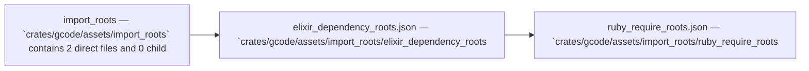

Relevant source files

- [crates/gcode/assets/import_roots/elixir_dependency_roots.json](crates/gcode/assets/import_roots/elixir_dependency_roots.json)
- [crates/gcode/assets/import_roots/ruby_require_roots.json](crates/gcode/assets/import_roots/ruby_require_roots.json)

# Import Roots

## Purpose

Import Roots groups the related modules and files listed below; read the key components for the grounded detail.

## Key components

| Symbol | Kind | Source | Role |
| --- | --- | --- | --- |
| benchee | property | [crates/gcode/assets/import_roots/elixir_dependency_roots.json:16] | Indexed property `benchee` in `crates/gcode/assets/import_roots/elixir_dependency_roots.json`. [crates/gcode/assets/import_roots/elixir_dependency_roots.json:16] |
| broadway | property | [crates/gcode/assets/import_roots/elixir_dependency_roots.json:12] | Indexed property `broadway` in `crates/gcode/assets/import_roots/elixir_dependency_roots.json`. [crates/gcode/assets/import_roots/elixir_dependency_roots.json:12] |
| ecto | property | [crates/gcode/assets/import_roots/elixir_dependency_roots.json:8] | Indexed property `ecto` in `crates/gcode/assets/import_roots/elixir_dependency_roots.json`. [crates/gcode/assets/import_roots/elixir_dependency_roots.json:8] |
| ex_doc | property | [crates/gcode/assets/import_roots/elixir_dependency_roots.json:17] | Indexed property `ex_doc` in `crates/gcode/assets/import_roots/elixir_dependency_roots.json`. [crates/gcode/assets/import_roots/elixir_dependency_roots.json:17] |
| faraday | property | [crates/gcode/assets/import_roots/ruby_require_roots.json:6] | Indexed property `faraday` in `crates/gcode/assets/import_roots/ruby_require_roots.json`. [crates/gcode/assets/import_roots/ruby_require_roots.json:6] |
| fileutils | property | [crates/gcode/assets/import_roots/ruby_require_roots.json:3] | Indexed property `fileutils` in `crates/gcode/assets/import_roots/ruby_require_roots.json`. [crates/gcode/assets/import_roots/ruby_require_roots.json:3] |
| finch | property | [crates/gcode/assets/import_roots/elixir_dependency_roots.json:6] | Indexed property `finch` in `crates/gcode/assets/import_roots/elixir_dependency_roots.json`. [crates/gcode/assets/import_roots/elixir_dependency_roots.json:6] |
| httpoison | property | [crates/gcode/assets/import_roots/elixir_dependency_roots.json:3] | Indexed property `httpoison` in `crates/gcode/assets/import_roots/elixir_dependency_roots.json`. [crates/gcode/assets/import_roots/elixir_dependency_roots.json:3] |
| jason | property | [crates/gcode/assets/import_roots/elixir_dependency_roots.json:2] | Indexed property `jason` in `crates/gcode/assets/import_roots/elixir_dependency_roots.json`. [crates/gcode/assets/import_roots/elixir_dependency_roots.json:2] |
| json | property | [crates/gcode/assets/import_roots/ruby_require_roots.json:2] | Indexed property `json` in `crates/gcode/assets/import_roots/ruby_require_roots.json`. [crates/gcode/assets/import_roots/ruby_require_roots.json:2] |
| mint | property | [crates/gcode/assets/import_roots/elixir_dependency_roots.json:7] | Indexed property `mint` in `crates/gcode/assets/import_roots/elixir_dependency_roots.json`. [crates/gcode/assets/import_roots/elixir_dependency_roots.json:7] |
| net/http | property | [crates/gcode/assets/import_roots/ruby_require_roots.json:4] | Indexed property `net/http` in `crates/gcode/assets/import_roots/ruby_require_roots.json`. [crates/gcode/assets/import_roots/ruby_require_roots.json:4] |

## Members

- `crates/gcode/assets/import_roots` (module) [crates/gcode/assets/import_roots/elixir_dependency_roots.json:2]
- `crates/gcode/assets/import_roots/elixir_dependency_roots.json` (file) [crates/gcode/assets/import_roots/elixir_dependency_roots.json:2]
- `crates/gcode/assets/import_roots/ruby_require_roots.json` (file) [crates/gcode/assets/import_roots/ruby_require_roots.json:2]

## Conceptual flow

> _Conceptual flow_ — how this page's subsystems behave together, in the order these subsystems are grouped on this page. Grounded in the member module/file summaries below; it is a behavior sketch, not a per-symbol call or import graph.

## Explore

- [[code/modules/crates/gcode/assets/import_roots|crates/gcode/assets/import_roots]]

