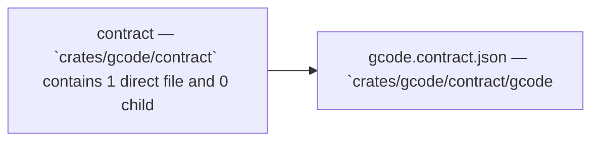

Relevant source files

- [crates/gcode/contract/gcode.contract.json](crates/gcode/contract/gcode.contract.json)

# Contract

## Purpose

Contract groups the related modules and files listed below; read the key components for the grounded detail.

## Key components

| Symbol | Kind | Source | Role |
| --- | --- | --- | --- |
| allowed_values | property | [crates/gcode/contract/gcode.contract.json:10] | Indexed property `allowed_values` in `crates/gcode/contract/gcode.contract.json`. [crates/gcode/contract/gcode.contract.json:10] |
| allowed_values | property | [crates/gcode/contract/gcode.contract.json:18-21] | Indexed property `allowed_values` in `crates/gcode/contract/gcode.contract.json`. [crates/gcode/contract/gcode.contract.json:18-21] |
| allowed_values | property | [crates/gcode/contract/gcode.contract.json:29] | Indexed property `allowed_values` in `crates/gcode/contract/gcode.contract.json`. [crates/gcode/contract/gcode.contract.json:29] |
| allowed_values | property | [crates/gcode/contract/gcode.contract.json:37] | Indexed property `allowed_values` in `crates/gcode/contract/gcode.contract.json`. [crates/gcode/contract/gcode.contract.json:37] |
| allowed_values | property | [crates/gcode/contract/gcode.contract.json:45] | Indexed property `allowed_values` in `crates/gcode/contract/gcode.contract.json`. [crates/gcode/contract/gcode.contract.json:45] |
| allowed_values | property | [crates/gcode/contract/gcode.contract.json:56] | Indexed property `allowed_values` in `crates/gcode/contract/gcode.contract.json`. [crates/gcode/contract/gcode.contract.json:56] |
| allowed_values | property | [crates/gcode/contract/gcode.contract.json:78-81] | Indexed property `allowed_values` in `crates/gcode/contract/gcode.contract.json`. [crates/gcode/contract/gcode.contract.json:78-81] |
| allowed_values | property | [crates/gcode/contract/gcode.contract.json:114] | Indexed property `allowed_values` in `crates/gcode/contract/gcode.contract.json`. [crates/gcode/contract/gcode.contract.json:114] |
| allowed_values | property | [crates/gcode/contract/gcode.contract.json:122] | Indexed property `allowed_values` in `crates/gcode/contract/gcode.contract.json`. [crates/gcode/contract/gcode.contract.json:122] |
| allowed_values | property | [crates/gcode/contract/gcode.contract.json:130] | Indexed property `allowed_values` in `crates/gcode/contract/gcode.contract.json`. [crates/gcode/contract/gcode.contract.json:130] |
| allowed_values | property | [crates/gcode/contract/gcode.contract.json:138] | Indexed property `allowed_values` in `crates/gcode/contract/gcode.contract.json`. [crates/gcode/contract/gcode.contract.json:138] |
| allowed_values | property | [crates/gcode/contract/gcode.contract.json:146] | Indexed property `allowed_values` in `crates/gcode/contract/gcode.contract.json`. [crates/gcode/contract/gcode.contract.json:146] |

## Members

- `crates/gcode/contract` (module) [crates/gcode/contract/gcode.contract.json:2]
- `crates/gcode/contract/gcode.contract.json` (file) [crates/gcode/contract/gcode.contract.json:2]

## Conceptual flow

> _Conceptual flow_ — how this page's subsystems behave together, in the order these subsystems are grouped on this page. Grounded in the member module/file summaries below; it is a behavior sketch, not a per-symbol call or import graph.

## Explore

- [[code/modules/crates/gcode/contract|crates/gcode/contract]]

