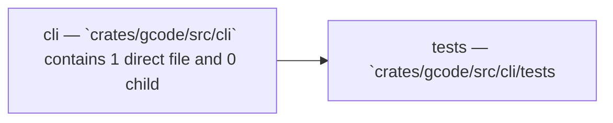

Relevant source files

- [crates/gcode/src/cli/tests.rs](crates/gcode/src/cli/tests.rs)

# Cli

## Purpose

Cli groups the related modules and files listed below; read the key components for the grounded detail.

## Key components

| Symbol | Kind | Source | Role |
| --- | --- | --- | --- |
| clap_command_leaves | function | [crates/gcode/src/cli/tests.rs:32-36] | Returns the set of leaf command names reachable from the given 'clap::Command' by recursively collecting them into a 'BTreeSet<String>'. [crates/gcode/src/cli/tests.rs:32-36] |
| clap_command_leaves_are_documented_in_contract | function | [crates/gcode/src/cli/tests.rs:12-30] | Verifies that every leaf command exposed by 'Cli::command()' via 'clap_command_leaves' has a corresponding entry in the Gobby contract, failing with a list of missing command names if any are absent. [crates/gcode/src/cli/tests.rs:12-30] |
| collect_clap_command_leaves | function | [crates/gcode/src/cli/tests.rs:38-55] | Recursively traverses a 'clap::Command' subtree, building space-delimited subcommand paths from an optional prefix and inserting the full paths of all leaf subcommands into the provided 'BTreeSet<String>'. [crates/gcode/src/cli/tests.rs:38-55] |

## Members

- `crates/gcode/src/cli` (module) [crates/gcode/src/cli/tests.rs:12-30]
- `crates/gcode/src/cli/tests.rs` (file) [crates/gcode/src/cli/tests.rs:12-30]

## Conceptual flow

> _Conceptual flow_ — how this page's subsystems behave together, in the order these subsystems are grouped on this page. Grounded in the member module/file summaries below; it is a behavior sketch, not a per-symbol call or import graph.

## Explore

- [[code/modules/crates/gcode/src/cli|crates/gcode/src/cli]]

