Relevant source files

- [crates/gcode/src/commands/codewiki/build_parts/concepts/plan.rs](crates/gcode/src/commands/codewiki/build_parts/concepts/plan.rs)
- [crates/gcode/src/commands/codewiki/build_parts/concepts/render.rs](crates/gcode/src/commands/codewiki/build_parts/concepts/render.rs)
- [crates/gcode/src/commands/codewiki/build_parts/concepts/spans.rs](crates/gcode/src/commands/codewiki/build_parts/concepts/spans.rs)
- [crates/gcode/src/commands/codewiki/build_parts/concepts/support.rs](crates/gcode/src/commands/codewiki/build_parts/concepts/support.rs)
- [crates/gcode/src/commands/codewiki/build_parts/concepts/types.rs](crates/gcode/src/commands/codewiki/build_parts/concepts/types.rs)

# Concepts

## Purpose

Concepts groups the related modules and files listed below; read the key components for the grounded detail.

## Key components

| Symbol | Kind | Source | Role |
| --- | --- | --- | --- |
| ConceptModule | class | [crates/gcode/src/commands/codewiki/build_parts/concepts/types.rs:16-37] | 'ConceptModule' is a crate-private Rust struct representing a concept module, containing serializable metadata (slug, title, summary, sub-modules, and files) alongside deserialization-skipped fields for post-normalization body content, content degradation tracking, and verification notes. [crates/gcode/src/commands/codewiki/build_parts/concepts/types.rs:16-37] |
| ConceptSection | class | [crates/gcode/src/commands/codewiki/build_parts/concepts/types.rs:40-46] | The 'ConceptSection' struct is a module-private ('pub(super)') Rust data structure consisting of a 'title' string, a 'summary' string, and a vector of 'concepts' strings, with the latter two fields defaulting to empty values during deserialization. [crates/gcode/src/commands/codewiki/build_parts/concepts/types.rs:40-46] |
| CuratedNavigationPlan | class | [crates/gcode/src/commands/codewiki/build_parts/concepts/types.rs:6-13] | The 'CuratedNavigationPlan' struct is a super-module private Rust data structure that aggregates vectors of 'ConceptModule', 'ConceptSection', and 'NarrativePage' elements, with each field configured to use its default value during deserialization if absent. [crates/gcode/src/commands/codewiki/build_parts/concepts/types.rs:6-13] |
| NarrativePage | class | [crates/gcode/src/commands/codewiki/build_parts/concepts/types.rs:49-69] | The 'NarrativePage' struct is a module-private Rust data structure that aggregates serialized documentation metadata—including slug, title, and relationships to concepts, modules, and files—with deserialization-skipped fields for the page's body content, body degradation state, and verification notes. [crates/gcode/src/commands/codewiki/build_parts/concepts/types.rs:49-69] |
| all_input_spans | function | [crates/gcode/src/commands/codewiki/build_parts/concepts/spans.rs:4-13] | Returns a deduplicated, sorted 'Vec<SourceSpan>' containing the union of all 'source_spans' from the provided 'files' and 'modules' by inserting them into a 'BTreeSet' and collecting the result. [crates/gcode/src/commands/codewiki/build_parts/concepts/spans.rs:4-13] |
| append_curated_body | function | [crates/gcode/src/commands/codewiki/build_parts/concepts/render.rs:294-314] | Appends a body string to a document after stripping its leading H1 heading, or writes a fallback section if the body is absent or empty. [crates/gcode/src/commands/codewiki/build_parts/concepts/render.rs:294-314] |
| append_curated_body_drops_the_duplicate_h1 | function | [crates/gcode/src/commands/codewiki/build_parts/concepts/render.rs:442-454] | This function tests that 'append_curated_body()' deduplicates H1 headers, ensuring only one instance of a duplicate Markdown header remains after appending curated content that repeats the document's initial H1. [crates/gcode/src/commands/codewiki/build_parts/concepts/render.rs:442-454] |
| append_curated_body_falls_back_when_body_is_only_a_heading | function | [crates/gcode/src/commands/codewiki/build_parts/concepts/render.rs:457-469] | This test verifies that 'append_curated_body' renders the provided fallback text when the body parameter consists of only a markdown heading, which results in empty content after stripping. [crates/gcode/src/commands/codewiki/build_parts/concepts/render.rs:457-469] |
| append_explore_section | function | [crates/gcode/src/commands/codewiki/build_parts/concepts/render.rs:358-379] | This function appends a markdown "## Explore" section to a document string, populated with up to MAX_CURATED_KEY_COMPONENTS wikilinks derived from the modules array, or the files array as a fallback, formatted as a markdown list. [crates/gcode/src/commands/codewiki/build_parts/concepts/render.rs:358-379] |
| chapter_link | function | [crates/gcode/src/commands/codewiki/build_parts/concepts/render.rs:164-166] | Returns a tuple of string slices containing a 'NarrativePage''s slug and title fields. [crates/gcode/src/commands/codewiki/build_parts/concepts/render.rs:164-166] |
| concept_doc_path | function | [crates/gcode/src/commands/codewiki/build_parts/concepts/support.rs:27-29] | Returns the concept document path for a given slug by appending '.md' to the result of 'concept_doc_stem(slug)'. [crates/gcode/src/commands/codewiki/build_parts/concepts/support.rs:27-29] |
| concept_doc_stem | function | [crates/gcode/src/commands/codewiki/build_parts/concepts/support.rs:31-33] | Returns a 'String' containing the concept documentation path stem 'code/concepts/{slug}' by formatting the provided slug into that template. [crates/gcode/src/commands/codewiki/build_parts/concepts/support.rs:31-33] |

## Members

- `crates/gcode/src/commands/codewiki/build_parts/concepts` (module) [crates/gcode/src/commands/codewiki/build_parts/concepts/plan.rs:6-38]
- `crates/gcode/src/commands/codewiki/build_parts/concepts/plan.rs` (file) [crates/gcode/src/commands/codewiki/build_parts/concepts/plan.rs:6-38]
- `crates/gcode/src/commands/codewiki/build_parts/concepts/render.rs` (file) [crates/gcode/src/commands/codewiki/build_parts/concepts/render.rs:10-161]
- `crates/gcode/src/commands/codewiki/build_parts/concepts/spans.rs` (file) [crates/gcode/src/commands/codewiki/build_parts/concepts/spans.rs:4-13]
- `crates/gcode/src/commands/codewiki/build_parts/concepts/support.rs` (file) [crates/gcode/src/commands/codewiki/build_parts/concepts/support.rs:1-7]
- `crates/gcode/src/commands/codewiki/build_parts/concepts/types.rs` (file) [crates/gcode/src/commands/codewiki/build_parts/concepts/types.rs:6-13]

## Conceptual flow

> _Conceptual flow_ — how this page's subsystems behave together, in the order these subsystems are grouped on this page. Grounded in the member module/file summaries below; it is a behavior sketch, not a per-symbol call or import graph.

```mermaid
flowchart LR
    s0["concepts — `crates/gcode/src/commands/codewiki/build_parts/concepts` contains 5 direct files and 0 child"]
    s1["plan — `crates/gcode/src/commands/codewiki/build_parts/concepts/plan"]
    s2["render — `crates/gcode/src/commands/codewiki/build_parts/concepts/render"]
    s3["spans — `crates/gcode/src/commands/codewiki/build_parts/concepts/spans"]
    s4["support — `crates/gcode/src/commands/codewiki/build_parts/concepts/support"]
    s5["types — `crates/gcode/src/commands/codewiki/build_parts/concepts/types"]
    s0 --> s1
    s1 --> s2
    s2 --> s3
    s3 --> s4
    s4 --> s5
```

## Explore

- [[code/modules/crates/gcode/src/commands/codewiki/build_parts/concepts|crates/gcode/src/commands/codewiki/build_parts/concepts]]

