Relevant source files

- [crates/gcode/src/commands/codewiki/build_parts/architecture.rs](crates/gcode/src/commands/codewiki/build_parts/architecture.rs)
- [crates/gcode/src/commands/codewiki/build_parts/audit.rs](crates/gcode/src/commands/codewiki/build_parts/audit.rs)
- [crates/gcode/src/commands/codewiki/build_parts/changes.rs](crates/gcode/src/commands/codewiki/build_parts/changes.rs)
- [crates/gcode/src/commands/codewiki/build_parts/concepts.rs](crates/gcode/src/commands/codewiki/build_parts/concepts.rs)
- [crates/gcode/src/commands/codewiki/build_parts/concepts/plan.rs](crates/gcode/src/commands/codewiki/build_parts/concepts/plan.rs)
- [crates/gcode/src/commands/codewiki/build_parts/concepts/render.rs](crates/gcode/src/commands/codewiki/build_parts/concepts/render.rs)
- [crates/gcode/src/commands/codewiki/build_parts/concepts/spans.rs](crates/gcode/src/commands/codewiki/build_parts/concepts/spans.rs)
- [crates/gcode/src/commands/codewiki/build_parts/concepts/support.rs](crates/gcode/src/commands/codewiki/build_parts/concepts/support.rs)
- [crates/gcode/src/commands/codewiki/build_parts/concepts/types.rs](crates/gcode/src/commands/codewiki/build_parts/concepts/types.rs)
- [crates/gcode/src/commands/codewiki/build_parts/curated_content.rs](crates/gcode/src/commands/codewiki/build_parts/curated_content.rs)
- [crates/gcode/src/commands/codewiki/build_parts/features.rs](crates/gcode/src/commands/codewiki/build_parts/features.rs)
- [crates/gcode/src/commands/codewiki/build_parts/file.rs](crates/gcode/src/commands/codewiki/build_parts/file.rs)

_5 more source files omitted._

# Build Parts

## Purpose

Build Parts groups the related modules and files listed below; read the key components for the grounded detail.

## Key components

| Symbol | Kind | Source | Role |
| --- | --- | --- | --- |
| AuditContext | class | [crates/gcode/src/commands/codewiki/build_parts/audit.rs:28-34] | AuditContext is a crate-private struct aggregating DeprecationIndex and TestIndex indices constructed during bounded source code scanning for documentation auditing and page rendering. [crates/gcode/src/commands/codewiki/build_parts/audit.rs:28-34] |
| BinaryContract | class | [crates/gcode/src/commands/codewiki/build_parts/features.rs:39-46] | The 'BinaryContract' struct holds metadata that maps a binary's display name to its respective workspace crate directory and contract file path. [crates/gcode/src/commands/codewiki/build_parts/features.rs:39-46] |
| ChangesFrontmatter | class | [crates/gcode/src/commands/codewiki/build_parts/changes.rs:104-113] | 'ChangesFrontmatter' is a borrowed frontmatter record that captures change-metadata fields for a document, including title, kind, generator, trust and freshness status, a baseline/degraded flag pair, and a list of degraded sources. [crates/gcode/src/commands/codewiki/build_parts/changes.rs:104-113] |
| Contract | class | [crates/gcode/src/commands/codewiki/build_parts/features.rs:16-19] | The 'Contract' struct represents a contract definition containing a sequence of 'ContractCommand' objects that defaults to an empty vector during deserialization. [crates/gcode/src/commands/codewiki/build_parts/features.rs:16-19] |
| ContractCommand | class | [crates/gcode/src/commands/codewiki/build_parts/features.rs:22-28] | The 'ContractCommand' struct represents a command definition containing a name, a default-initialized summary, and a default-initialized vector of associated contract flags. [crates/gcode/src/commands/codewiki/build_parts/features.rs:22-28] |
| ContractFlag | class | [crates/gcode/src/commands/codewiki/build_parts/features.rs:31-34] | The 'ContractFlag' struct represents a contract flag containing a single deserializable 'name' string field that defaults to its standard default value if omitted during deserialization. [crates/gcode/src/commands/codewiki/build_parts/features.rs:31-34] |
| CuratedBody | class | [crates/gcode/src/commands/codewiki/build_parts/curated_content.rs:34-44] | 'CuratedBody' stores the finalized page body text as an optional multi-section string, a 'degraded' flag indicating whether AI content-pass generation failed and the structural fallback was used, and a list of 'VerifyNote' validation notes. [crates/gcode/src/commands/codewiki/build_parts/curated_content.rs:34-44] |
| CuratedPageKind | type | [crates/gcode/src/commands/codewiki/build_parts/curated_content.rs:28-31] | Indexed type `CuratedPageKind` in `crates/gcode/src/commands/codewiki/build_parts/curated_content.rs`. [crates/gcode/src/commands/codewiki/build_parts/curated_content.rs:28-31] |
| FlowComponent | class | [crates/gcode/src/commands/codewiki/build_parts/curated_content.rs:312-318] | FlowComponent is a struct that represents a stage in a data-flow analysis chain, identified by normalized module/file keys for alignment with documented flows, a descriptive label, and an optional role designation. [crates/gcode/src/commands/codewiki/build_parts/curated_content.rs:312-318] |
| append_ask_hint | function | [crates/gcode/src/commands/codewiki/build_parts/curated_content.rs:284-288] | Appends a fixed help hint to the provided string, instructing users to query the vault with 'gwiki ask "..."' or locate pages with 'gwiki search "..."'. [crates/gcode/src/commands/codewiki/build_parts/curated_content.rs:284-288] |
| append_guided_tour | function | [crates/gcode/src/commands/codewiki/build_parts/curated_content.rs:268-281] | Appends a “guided tour” section to 'doc' by inserting a header, an optional introductory link to the first chapter, a numbered list of wiki-style links for all provided chapters, a trailing blank line, and the ask hint footer. [crates/gcode/src/commands/codewiki/build_parts/curated_content.rs:268-281] |
| append_tour_nav | function | [crates/gcode/src/commands/codewiki/build_parts/curated_content.rs:293-309] | Appends a “Continue the tour” navigation section to 'doc' with optional previous and next narrative links in wiki markup, and does nothing if both links are absent. [crates/gcode/src/commands/codewiki/build_parts/curated_content.rs:293-309] |

## Members

- `crates/gcode/src/commands/codewiki/build_parts` (module) [crates/gcode/src/commands/codewiki/build_parts/architecture.rs:5-170]
- `crates/gcode/src/commands/codewiki/build_parts/architecture.rs` (file) [crates/gcode/src/commands/codewiki/build_parts/architecture.rs:5-170]
- `crates/gcode/src/commands/codewiki/build_parts/audit.rs` (file) [crates/gcode/src/commands/codewiki/build_parts/audit.rs:28-34]
- `crates/gcode/src/commands/codewiki/build_parts/changes.rs` (file) [crates/gcode/src/commands/codewiki/build_parts/changes.rs:5-101]
- `crates/gcode/src/commands/codewiki/build_parts/concepts.rs` (file) [crates/gcode/src/commands/codewiki/build_parts/concepts.rs:35-85]
- `crates/gcode/src/commands/codewiki/build_parts/curated_content.rs` (file) [crates/gcode/src/commands/codewiki/build_parts/curated_content.rs:28-31]
- `crates/gcode/src/commands/codewiki/build_parts/features.rs` (file) [crates/gcode/src/commands/codewiki/build_parts/features.rs:16-19]

## Conceptual flow

> _Conceptual flow_ — how this page's subsystems behave together, in the order these subsystems are grouped on this page. Grounded in the member module/file summaries below; it is a behavior sketch, not a per-symbol call or import graph.

```mermaid
flowchart LR
    s0["build_parts — `crates/gcode/src/commands/codewiki/build_parts` contains 12 direct files and 1 child"]
    s1["architecture — `crates/gcode/src/commands/codewiki/build_parts/architecture"]
    s2["audit — `crates/gcode/src/commands/codewiki/build_parts/audit"]
    s3["changes — `crates/gcode/src/commands/codewiki/build_parts/changes"]
    s4["concepts — `crates/gcode/src/commands/codewiki/build_parts/concepts"]
    s5["curated_content — `crates/gcode/src/commands/codewiki/build_parts/curated_content"]
    s6["features — `crates/gcode/src/commands/codewiki/build_parts/features"]
    s0 --> s1
    s1 --> s2
    s2 --> s3
    s3 --> s4
    s4 --> s5
    s5 --> s6
```

## Explore

- [[code/modules/crates/gcode/src/commands/codewiki/build_parts|crates/gcode/src/commands/codewiki/build_parts]]

