Relevant source files

- [crates/gcode/src/commands/codewiki/ownership/analysis.rs](crates/gcode/src/commands/codewiki/ownership/analysis.rs)
- [crates/gcode/src/commands/codewiki/ownership/codeowners.rs](crates/gcode/src/commands/codewiki/ownership/codeowners.rs)
- [crates/gcode/src/commands/codewiki/ownership/render.rs](crates/gcode/src/commands/codewiki/ownership/render.rs)
- [crates/gcode/src/commands/codewiki/ownership/tests.rs](crates/gcode/src/commands/codewiki/ownership/tests.rs)

# Ownership

## Purpose

Ownership groups the related modules and files listed below; read the key components for the grounded detail.

## Key components

| Symbol | Kind | Source | Role |
| --- | --- | --- | --- |
| BlameContributorsOutcome | type | [crates/gcode/src/commands/codewiki/ownership/analysis.rs:17-21] | Indexed type `BlameContributorsOutcome` in `crates/gcode/src/commands/codewiki/ownership/analysis.rs`. [crates/gcode/src/commands/codewiki/ownership/analysis.rs:17-21] |
| Codeowners | class | [crates/gcode/src/commands/codewiki/ownership/codeowners.rs:5-7] | 'Codeowners' is an internal struct that stores an ordered 'Vec<CodeownersEntry>' representing CODEOWNERS entries. [crates/gcode/src/commands/codewiki/ownership/codeowners.rs:5-7] |
| CodeownersEntry | class | [crates/gcode/src/commands/codewiki/ownership/codeowners.rs:10-13] | 'CodeownersEntry' is a struct that represents a CODEOWNERS rule by pairing a path pattern string with a list of owner identifiers. [crates/gcode/src/commands/codewiki/ownership/codeowners.rs:10-13] |
| Frontmatter | class | [crates/gcode/src/commands/codewiki/ownership/render.rs:38-52] | 'Frontmatter<'a>' is a Serde-serializable metadata struct that records a document’s title, type, provenance, generator, trust and freshness labels, plus optional degradation flags and source lists, with conditional omission of empty or false fields during serialization. [crates/gcode/src/commands/codewiki/ownership/render.rs:38-52] |
| GitBlameOutput | class | [crates/gcode/src/commands/codewiki/ownership/analysis.rs:106-110] | 'GitBlameOutput' is a private module-visible struct that encapsulates the result of a 'git blame'-related process invocation, storing its 'ExitStatus' plus captured 'stdout' and 'stderr' as 'String's. [crates/gcode/src/commands/codewiki/ownership/analysis.rs:106-110] |
| aggregate_contributors | function | [crates/gcode/src/commands/codewiki/ownership/render.rs:128-172] | Aggregates all 'derived' contributors across the input 'FileOwnership' values by contributor ID, deterministically merges identity fields while summing line counts, then returns the top five 'OwnershipContributor' records sorted by descending lines, ascending name, and ascending contributor ID. [crates/gcode/src/commands/codewiki/ownership/render.rs:128-172] |
| aggregate_primary | function | [crates/gcode/src/commands/codewiki/ownership/render.rs:116-126] | Returns a sorted, deduplicated 'Vec<String>' of primary owner names by collecting all non-empty declared owners from the input files, otherwise falling back to the first derived owner name for files without declared owners. [crates/gcode/src/commands/codewiki/ownership/render.rs:116-126] |
| blame_file_contributors | function | [crates/gcode/src/commands/codewiki/ownership/analysis.rs:112-133] | Runs 'git blame' with a timeout for the specified file at the given commit in 'project_root', returns 'Ok(None)' if the blame command times out or produces no output, bails on non-success exit status with stderr when available, and otherwise parses the porcelain blame output into 'Vec<OwnershipContributor>'. [crates/gcode/src/commands/codewiki/ownership/analysis.rs:112-133] |
| blame_file_contributors_with_timeout | function | [crates/gcode/src/commands/codewiki/ownership/analysis.rs:93-104] | Wraps 'blame_file_contributors' and converts its 'Result<Option<...>, _>' into 'BlameContributorsOutcome', returning 'Success(contributors)' on 'Ok(Some(...))', 'Timeout' on 'Ok(None)', and 'Error(error)' on 'Err(error)'. [crates/gcode/src/commands/codewiki/ownership/analysis.rs:93-104] |
| codeowners_pattern_matches | function | [crates/gcode/src/commands/codewiki/ownership/codeowners.rs:68-103] | 'codeowners_pattern_matches' normalizes a CODEOWNERS pattern by stripping a leading '/', then matches directory prefixes, glob patterns, or exact path/basename equality against 'file' depending on whether the pattern ends with '/', contains wildcard metacharacters, or includes '/', returning 'false' and logging a warning if glob parsing fails. [crates/gcode/src/commands/codewiki/ownership/codeowners.rs:68-103] |
| codewiki_ownership_blame_error_marks_partial_without_caching | function | [crates/gcode/src/commands/codewiki/ownership/tests.rs:194-218] | Builds ownership docs for an untracked source file with blame enabled, and verifies that a blame failure marks the document partial, records 'git_blame_errors', and does not cache any file metadata. [crates/gcode/src/commands/codewiki/ownership/tests.rs:194-218] |
| codewiki_ownership_codeowners_only_maps_declared_owners | function | [crates/gcode/src/commands/codewiki/ownership/tests.rs:8-35] | Verifies that 'build_ownership_doc' for 'src/api/mod.rs' produces a degraded 'code_ownership' document marked 'git_blame_unavailable' that includes the 'src/api' module, the declared CODEOWNERS entry '@platform', and the source path. [crates/gcode/src/commands/codewiki/ownership/tests.rs:8-35] |

## Members

- `crates/gcode/src/commands/codewiki/ownership` (module) [crates/gcode/src/commands/codewiki/ownership/analysis.rs:17-21]
- `crates/gcode/src/commands/codewiki/ownership/analysis.rs` (file) [crates/gcode/src/commands/codewiki/ownership/analysis.rs:17-21]
- `crates/gcode/src/commands/codewiki/ownership/codeowners.rs` (file) [crates/gcode/src/commands/codewiki/ownership/codeowners.rs:5-7]
- `crates/gcode/src/commands/codewiki/ownership/render.rs` (file) [crates/gcode/src/commands/codewiki/ownership/render.rs:10-34]
- `crates/gcode/src/commands/codewiki/ownership/tests.rs` (file) [crates/gcode/src/commands/codewiki/ownership/tests.rs:8-35]

## Conceptual flow

> _Conceptual flow_ — how this page's subsystems behave together, in the order these subsystems are grouped on this page. Grounded in the member module/file summaries below; it is a behavior sketch, not a per-symbol call or import graph.

```mermaid
flowchart LR
    s0["ownership — `crates/gcode/src/commands/codewiki/ownership` contains 4 direct files and 0 child"]
    s1["analysis — `crates/gcode/src/commands/codewiki/ownership/analysis"]
    s2["codeowners — `crates/gcode/src/commands/codewiki/ownership/codeowners"]
    s3["render — `crates/gcode/src/commands/codewiki/ownership/render"]
    s4["tests — `crates/gcode/src/commands/codewiki/ownership/tests"]
    s0 --> s1
    s1 --> s2
    s2 --> s3
    s3 --> s4
```

## Explore

- [[code/modules/crates/gcode/src/commands/codewiki/ownership|crates/gcode/src/commands/codewiki/ownership]]

