Relevant source files

- [crates/gcode/src/commands/codewiki/architecture_diagrams.rs](crates/gcode/src/commands/codewiki/architecture_diagrams.rs)
- [crates/gcode/src/commands/codewiki/build_parts/audit.rs](crates/gcode/src/commands/codewiki/build_parts/audit.rs)
- [crates/gcode/src/commands/codewiki/build_parts/concepts/plan.rs](crates/gcode/src/commands/codewiki/build_parts/concepts/plan.rs)
- [crates/gcode/src/commands/codewiki/build_parts/concepts/render.rs](crates/gcode/src/commands/codewiki/build_parts/concepts/render.rs)
- [crates/gcode/src/commands/codewiki/build_parts/curated_content.rs](crates/gcode/src/commands/codewiki/build_parts/curated_content.rs)
- [crates/gcode/src/commands/codewiki/build_parts/features.rs](crates/gcode/src/commands/codewiki/build_parts/features.rs)
- [crates/gcode/src/commands/codewiki/build_parts/onboarding.rs](crates/gcode/src/commands/codewiki/build_parts/onboarding.rs)
- [crates/gcode/src/commands/codewiki/cluster.rs](crates/gcode/src/commands/codewiki/cluster.rs)
- [crates/gcode/src/commands/codewiki/generation.rs](crates/gcode/src/commands/codewiki/generation.rs)
- [crates/gcode/src/commands/codewiki/io.rs](crates/gcode/src/commands/codewiki/io.rs)
- [crates/gcode/src/commands/codewiki/ownership.rs](crates/gcode/src/commands/codewiki/ownership.rs)
- [crates/gcode/src/commands/codewiki/ownership/analysis.rs](crates/gcode/src/commands/codewiki/ownership/analysis.rs)

_50 more source files omitted._

# Codewiki

## Purpose

Codewiki groups the related modules and files listed below; read the key components for the grounded detail.

## Key components

| Symbol | Kind | Source | Role |
| --- | --- | --- | --- |
| ConceptualFlowStep | class | [crates/gcode/src/commands/codewiki/architecture_diagrams.rs:519-523] | ConceptualFlowStep is a crate-scoped struct that encapsulates a workflow step with a required String identifier and label, plus an optional String role field. [crates/gcode/src/commands/codewiki/architecture_diagrams.rs:519-523] |
| DocPruneScope | class | [crates/gcode/src/commands/codewiki/io.rs:46-48] | 'DocPruneScope' is a crate-private Rust struct that stores a 'Vec<String>' of scope identifiers used to define the pruning scope for documentation processing. [crates/gcode/src/commands/codewiki/io.rs:46-48] |
| DocSink | class | [crates/gcode/src/commands/codewiki/io.rs:99-120] | DocSink is a crate-internal documentation generation manager that orchestrates AI-enhanced code documentation with git-diff-based incremental updates and automatic structural fallback on AI degradation. [crates/gcode/src/commands/codewiki/io.rs:99-120] |
| ai_feature_crate | function | [crates/gcode/src/commands/codewiki/architecture_diagrams.rs:329-335] | This function searches the given 'SystemModel' and returns the name of the first crate containing the "ai" feature as an optional string slice. [crates/gcode/src/commands/codewiki/architecture_diagrams.rs:329-335] |
| balanced_delimiters | function | [crates/gcode/src/commands/codewiki/architecture_diagrams.rs:482-513] | This function determines whether parentheses, brackets, and braces are balanced and properly nested across a slice of string lines, ignoring any delimiters located inside double quotes and returning 'false' if any quote spans across line boundaries or if any delimiter counter drops below zero. [crates/gcode/src/commands/codewiki/architecture_diagrams.rs:482-513] |
| call_edges_never_merge_clusters_across_subsystem_roots | function | [crates/gcode/src/commands/codewiki/cluster.rs:353-413] | Verifies that a call edge between symbols in different subsystem roots does not cause 'cluster_file_modules' to collapse the file modules to a shared higher-level directory like 'crates', preserving each root’s separate module path. [crates/gcode/src/commands/codewiki/cluster.rs:353-413] |
| cluster_file_modules | function | [crates/gcode/src/commands/codewiki/cluster.rs:63-123] | Clusters files into module groups by mapping symbols to their owning files, unioning files connected by 'Call' edges that stay within the same subsystem root, and then assigning each connected set either a shared common module name or a per-file module path. [crates/gcode/src/commands/codewiki/cluster.rs:63-123] |
| codewiki_call_edges_query | function | [crates/gcode/src/commands/codewiki/graph.rs:149-164] | Builds and returns a Cypher query plus parameter map that selects intra-project 'CALLS' edges between 'CodeSymbol' nodes, returning source and target IDs and applying the provided 'edge_limit'. [crates/gcode/src/commands/codewiki/graph.rs:149-164] |
| codewiki_import_edges_query | function | [crates/gcode/src/commands/codewiki/graph.rs:166-181] | Builds and returns a Cypher 'MATCH' query that selects 'CodeFile' nodes importing 'CodeModule' nodes within the given 'project_id', limits results to 'edge_limit', and supplies a parameter map containing the quoted 'project' value. [crates/gcode/src/commands/codewiki/graph.rs:166-181] |
| collect_generated_doc_pages | function | [crates/gcode/src/commands/codewiki/io.rs:331-360] | The function recursively collects all Markdown files from a "code" subdirectory and returns their paths relative to the output directory with normalized forward-slash separators. [crates/gcode/src/commands/codewiki/io.rs:331-360] |
| common_module_for_files | function | [crates/gcode/src/commands/codewiki/cluster.rs:201-225] | Returns the deepest shared slash-separated module path among all input files by computing each file’s module path via 'module_for_file', intersecting path components from the front, and joining the common prefix, or an empty string for no files. [crates/gcode/src/commands/codewiki/cluster.rs:201-225] |
| conceptual_flow_chains_members_with_roles_caption_and_degradation | function | [crates/gcode/src/commands/codewiki/architecture_diagrams.rs:610-648] | This test verifies that 'render_conceptual_flow()' generates a valid Mermaid flowchart markdown section with role-and-caption-labeled nodes, degradation indicators for steps lacking captions, and sequential edges connecting the flow stages in documented order. [crates/gcode/src/commands/codewiki/architecture_diagrams.rs:610-648] |

## Members

- `crates/gcode/src/commands/codewiki` (module) [crates/gcode/src/commands/codewiki/architecture_diagrams.rs:40-81]
- `crates/gcode/src/commands/codewiki/architecture_diagrams.rs` (file) [crates/gcode/src/commands/codewiki/architecture_diagrams.rs:40-81]
- `crates/gcode/src/commands/codewiki/build.rs` (file) [crates/gcode/src/commands/codewiki/build.rs:1-39]
- `crates/gcode/src/commands/codewiki/cluster.rs` (file) [crates/gcode/src/commands/codewiki/cluster.rs:8-43]
- `crates/gcode/src/commands/codewiki/generation.rs` (file) [crates/gcode/src/commands/codewiki/generation.rs:19-27]
- `crates/gcode/src/commands/codewiki/graph.rs` (file) [crates/gcode/src/commands/codewiki/graph.rs:5-110]
- `crates/gcode/src/commands/codewiki/io.rs` (file) [crates/gcode/src/commands/codewiki/io.rs:3-9]

## Conceptual flow

> _Conceptual flow_ — how this page's subsystems behave together, in the order these subsystems are grouped on this page. Grounded in the member module/file summaries below; it is a behavior sketch, not a per-symbol call or import graph.

```mermaid
flowchart LR
    s0["codewiki — `crates/gcode/src/commands/codewiki` contains 24 direct files and 5 child"]
    s1["architecture_diagrams — `crates/gcode/src/commands/codewiki/architecture_diagrams"]
    s2["build — `crates/gcode/src/commands/codewiki/build"]
    s3["cluster — `crates/gcode/src/commands/codewiki/cluster"]
    s4["generation — `crates/gcode/src/commands/codewiki/generation"]
    s5["graph — `crates/gcode/src/commands/codewiki/graph"]
    s6["io — `crates/gcode/src/commands/codewiki/io"]
    s0 --> s1
    s1 --> s2
    s2 --> s3
    s3 --> s4
    s4 --> s5
    s5 --> s6
```

## Explore

- [[code/modules/crates/gcode/src/commands/codewiki|crates/gcode/src/commands/codewiki]]

