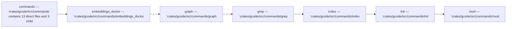

Relevant source files

- [crates/gcode/src/commands/codewiki/architecture_diagrams.rs](crates/gcode/src/commands/codewiki/architecture_diagrams.rs)
- [crates/gcode/src/commands/codewiki/build_parts/audit.rs](crates/gcode/src/commands/codewiki/build_parts/audit.rs)
- [crates/gcode/src/commands/codewiki/build_parts/concepts/render.rs](crates/gcode/src/commands/codewiki/build_parts/concepts/render.rs)
- [crates/gcode/src/commands/codewiki/build_parts/curated_content.rs](crates/gcode/src/commands/codewiki/build_parts/curated_content.rs)
- [crates/gcode/src/commands/codewiki/cluster.rs](crates/gcode/src/commands/codewiki/cluster.rs)
- [crates/gcode/src/commands/codewiki/io.rs](crates/gcode/src/commands/codewiki/io.rs)
- [crates/gcode/src/commands/codewiki/paths.rs](crates/gcode/src/commands/codewiki/paths.rs)
- [crates/gcode/src/commands/codewiki/prompts/builders.rs](crates/gcode/src/commands/codewiki/prompts/builders.rs)
- [crates/gcode/src/commands/codewiki/prompts/tests.rs](crates/gcode/src/commands/codewiki/prompts/tests.rs)
- [crates/gcode/src/commands/codewiki/relationship_facts.rs](crates/gcode/src/commands/codewiki/relationship_facts.rs)
- [crates/gcode/src/commands/codewiki/system_model.rs](crates/gcode/src/commands/codewiki/system_model.rs)
- [crates/gcode/src/commands/codewiki/text.rs](crates/gcode/src/commands/codewiki/text.rs)

_68 more source files omitted._

# Commands

## Purpose

Commands groups the related modules and files listed below; read the key components for the grounded detail.

## Key components

| Symbol | Kind | Source | Role |
| --- | --- | --- | --- |
| CompiledGlob | class | [crates/gcode/src/commands/grep.rs:469-472] | 'CompiledGlob' is a struct that stores both the original glob string ('raw') and its precompiled 'glob::Pattern' representation ('pattern') for efficient matching. [crates/gcode/src/commands/grep.rs:469-472] |
| EmbeddingsDoctorDrift | class | [crates/gcode/src/commands/embeddings_doctor.rs:58-63] | 'EmbeddingsDoctorDrift' is a crate-visible Serde-serializable data container that records a field name plus two comparison values, 'self' (renamed as 'self_value') and 'peer', both stored as untyped 'Value's. [crates/gcode/src/commands/embeddings_doctor.rs:58-63] |
| EmbeddingsDoctorExit | class | [crates/gcode/src/commands/embeddings_doctor.rs:19-22] | 'EmbeddingsDoctorExit' is a Rust struct that bundles an 'EmbeddingsDoctorReport' payload with a 'u8' process exit code. [crates/gcode/src/commands/embeddings_doctor.rs:19-22] |
| EmbeddingsDoctorReport | class | [crates/gcode/src/commands/embeddings_doctor.rs:43-55] | 'EmbeddingsDoctorReport' is a serializable diagnostic record for an embeddings configuration, capturing the configured endpoint, model, vector dimension, probe error, API key presence and fingerprint, resolved namespace, source, agreement status, and any detected drift entries. [crates/gcode/src/commands/embeddings_doctor.rs:43-55] |
| GrepContextLine | class | [crates/gcode/src/commands/grep.rs:55-58] | 'GrepContextLine' is a crate-visible struct that represents a single grep context line by storing its 1-based line number as a 'usize' and its full line contents as a 'String'. [crates/gcode/src/commands/grep.rs:55-58] |
| GrepFilters | class | [crates/gcode/src/commands/grep.rs:409-414] | 'GrepFilters' is a filter-configuration struct that stores path and glob matchers, plus optional SQL prefix lists for path and glob constraints. [crates/gcode/src/commands/grep.rs:409-414] |
| GrepMatch | class | [crates/gcode/src/commands/grep.rs:61-68] | 'GrepMatch' is a crate-private struct representing a single grep result, containing the matched file path, 1-based line number, matched text, highlighted match spans, and the surrounding before/after context lines. [crates/gcode/src/commands/grep.rs:61-68] |
| GrepOptions | class | [crates/gcode/src/commands/grep.rs:21-33] | 'GrepOptions<'a>' is a borrowed configuration struct for a grep-style search, carrying the search pattern, target paths and glob filters, matching flags, optional context/count limits, and an output 'Format'. [crates/gcode/src/commands/grep.rs:21-33] |
| GrepResponse | class | [crates/gcode/src/commands/grep.rs:71-84] | 'GrepResponse' is a search-result payload that records the query parameters and execution metadata for a grep operation, including the project and pattern used, matching options, scoped paths/globs, optional result limit, match count, truncation status, scanned chunk count, and the collected 'GrepMatch' entries. [crates/gcode/src/commands/grep.rs:71-84] |
| GrepResult | class | [crates/gcode/src/commands/grep.rs:87-92] | 'GrepResult' is a result struct that records how many chunks were scanned, how many lines matched, whether output was truncated, and the collected 'GrepMatch' entries. [crates/gcode/src/commands/grep.rs:87-92] |
| GrepSpan | class | [crates/gcode/src/commands/grep.rs:49-52] | 'GrepSpan' is a crate-visible struct representing a half-open span of text or bytes with inclusive start and exclusive end offsets, both stored as 'usize'. [crates/gcode/src/commands/grep.rs:49-52] |
| IndexSyncProjectionsOutput | class | [crates/gcode/src/commands/index.rs:107-117] | 'IndexSyncProjectionsOutput' is a crate-visible aggregation struct that reports an index-sync run’s file and symbol/chunk counts, skipped files, unsupported file types, degradation records, and nested projection synchronization reports. [crates/gcode/src/commands/index.rs:107-117] |

## Members

- `crates/gcode/src/commands` (module) [crates/gcode/src/commands/codewiki/architecture_diagrams.rs:40-81]
- `crates/gcode/src/commands/embeddings_doctor.rs` (file) [crates/gcode/src/commands/embeddings_doctor.rs:19-22]
- `crates/gcode/src/commands/graph.rs` (file) [crates/gcode/src/commands/graph.rs:1-15]
- `crates/gcode/src/commands/grep.rs` (file) [crates/gcode/src/commands/grep.rs:21-33]
- `crates/gcode/src/commands/index.rs` (file) [crates/gcode/src/commands/index.rs:10-60]
- `crates/gcode/src/commands/init.rs` (file) [crates/gcode/src/commands/init.rs:11-148]
- `crates/gcode/src/commands/mod.rs` (file) [crates/gcode/src/commands/mod.rs:1-15]

## Conceptual flow

> _Conceptual flow_ — how this page's subsystems behave together, in the order these subsystems are grouped on this page. Grounded in the member module/file summaries below; it is a behavior sketch, not a per-symbol call or import graph.

## Explore

- [[code/modules/crates/gcode/src/commands|crates/gcode/src/commands]]

