Relevant source files

- [crates/gcode/src/commands/codewiki/architecture_diagrams.rs](crates/gcode/src/commands/codewiki/architecture_diagrams.rs)
- [crates/gcode/src/commands/codewiki/build_parts/curated_content.rs](crates/gcode/src/commands/codewiki/build_parts/curated_content.rs)
- [crates/gcode/src/commands/codewiki/io.rs](crates/gcode/src/commands/codewiki/io.rs)
- [crates/gcode/src/commands/codewiki/system_model.rs](crates/gcode/src/commands/codewiki/system_model.rs)
- [crates/gcode/src/commands/codewiki/text/sanitize.rs](crates/gcode/src/commands/codewiki/text/sanitize.rs)
- [crates/gcode/src/commands/codewiki/types.rs](crates/gcode/src/commands/codewiki/types.rs)
- [crates/gcode/src/commands/graph/lifecycle.rs](crates/gcode/src/commands/graph/lifecycle.rs)
- [crates/gcode/src/commands/graph/reads.rs](crates/gcode/src/commands/graph/reads.rs)
- [crates/gcode/src/commands/graph/tests.rs](crates/gcode/src/commands/graph/tests.rs)
- [crates/gcode/src/commands/grep.rs](crates/gcode/src/commands/grep.rs)
- [crates/gcode/src/commands/search.rs](crates/gcode/src/commands/search.rs)
- [crates/gcode/src/commands/status.rs](crates/gcode/src/commands/status.rs)

_210 more source files omitted._

# Src

## Purpose

Src groups the related modules and files listed below; read the key components for the grounded detail.

## Key components

| Symbol | Kind | Source | Role |
| --- | --- | --- | --- |
| AiDepthArg | type | [crates/gcode/src/cli.rs:68-73] | Indexed type `AiDepthArg` in `crates/gcode/src/cli.rs`. [crates/gcode/src/cli.rs:68-73] |
| AiProseDepthArg | type | [crates/gcode/src/cli.rs:86-91] | Indexed type `AiProseDepthArg` in `crates/gcode/src/cli.rs`. [crates/gcode/src/cli.rs:86-91] |
| AiRegisterArg | type | [crates/gcode/src/cli.rs:104-108] | Indexed type `AiRegisterArg` in `crates/gcode/src/cli.rs`. [crates/gcode/src/cli.rs:104-108] |
| AiRouteArg | type | [crates/gcode/src/cli.rs:49-54] | Indexed type `AiRouteArg` in `crates/gcode/src/cli.rs`. [crates/gcode/src/cli.rs:49-54] |
| Cli | class | [crates/gcode/src/cli.rs:23-46] | 'Cli' is a crate-private Clap-parsed top-level command-line configuration struct that provides global flags for project root, output format, quiet/verbose logging, and freshness checks, plus a required 'Command' subcommand. [crates/gcode/src/cli.rs:23-46] |
| CodeGraphLifecycleBackend | class | [crates/gcode/src/commands/graph/lifecycle.rs:86] | 'CodeGraphLifecycleBackend' is a backend abstraction for managing the lifecycle of a code graph, represented here as an opaque 'struct' with no exposed fields or methods. [crates/gcode/src/commands/graph/lifecycle.rs:86] |
| Command | type | [crates/gcode/src/cli.rs:121-469] | Indexed type `Command` in `crates/gcode/src/cli.rs`. [crates/gcode/src/cli.rs:121-469] |
| CompiledGlob | class | [crates/gcode/src/commands/grep.rs:469-472] | 'CompiledGlob' is a struct that stores both the original glob string ('raw') and its precompiled 'glob::Pattern' representation ('pattern') for efficient matching. [crates/gcode/src/commands/grep.rs:469-472] |
| EmbeddingsCommand | type | [crates/gcode/src/cli.rs:558-561] | Indexed type `EmbeddingsCommand` in `crates/gcode/src/cli.rs`. [crates/gcode/src/cli.rs:558-561] |
| GraphCommand | type | [crates/gcode/src/cli.rs:472-536] | Indexed type `GraphCommand` in `crates/gcode/src/cli.rs`. [crates/gcode/src/cli.rs:472-536] |
| GraphFileSyncOutcome | type | [crates/gcode/src/commands/graph/lifecycle.rs:131-140] | Indexed type `GraphFileSyncOutcome` in `crates/gcode/src/commands/graph/lifecycle.rs`. [crates/gcode/src/commands/graph/lifecycle.rs:131-140] |
| GraphPathEndpoint | class | [crates/gcode/src/commands/graph/reads.rs:155-159] | 'GraphPathEndpoint' is a serde-serializable struct representing a path endpoint with an optional 'id' field omitted when 'None' and a required 'display_name' string. [crates/gcode/src/commands/graph/reads.rs:155-159] |

## Members

- `crates/gcode/src` (module) [crates/gcode/src/cli.rs:23-46]
- `crates/gcode/src/cli.rs` (file) [crates/gcode/src/cli.rs:23-46]
- `crates/gcode/src/commands/graph/lifecycle.rs` (file) [crates/gcode/src/commands/graph/lifecycle.rs:12-14]
- `crates/gcode/src/commands/graph/payload.rs` (file) [crates/gcode/src/commands/graph/payload.rs:6-37]
- `crates/gcode/src/commands/graph/reads.rs` (file) [crates/gcode/src/commands/graph/reads.rs:19-25]
- `crates/gcode/src/commands/graph/tests.rs` (file) [crates/gcode/src/commands/graph/tests.rs:22-36]
- `crates/gcode/src/commands/grep.rs` (file) [crates/gcode/src/commands/grep.rs:21-33]

## Conceptual flow

> _Conceptual flow_ — how this page's subsystems behave together, in the order these subsystems are grouped on this page. Grounded in the member module/file summaries below; it is a behavior sketch, not a per-symbol call or import graph.

```mermaid
flowchart LR
    s0["src — `crates/gcode/src` contains 39 direct files and 11 child"]
    s1["cli — `crates/gcode/src/cli"]
    s2["lifecycle — `crates/gcode/src/commands/graph/lifecycle"]
    s3["payload — `crates/gcode/src/commands/graph/payload"]
    s4["reads — `crates/gcode/src/commands/graph/reads"]
    s5["tests — `crates/gcode/src/commands/graph/tests"]
    s6["grep — `crates/gcode/src/commands/grep"]
    s0 --> s1
    s1 --> s2
    s2 --> s3
    s3 --> s4
    s4 --> s5
    s5 --> s6
```

## Explore

- [[code/modules/crates/gcode/src|crates/gcode/src]]

