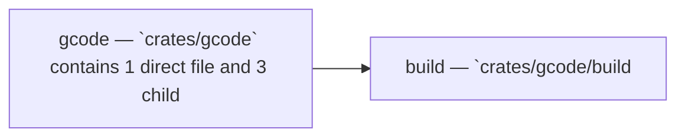

Relevant source files

- [crates/gcode/contract/gcode.contract.json](crates/gcode/contract/gcode.contract.json)
- [crates/gcode/src/commands/codewiki/architecture_diagrams.rs](crates/gcode/src/commands/codewiki/architecture_diagrams.rs)
- [crates/gcode/src/commands/codewiki/build_parts/curated_content.rs](crates/gcode/src/commands/codewiki/build_parts/curated_content.rs)
- [crates/gcode/src/commands/codewiki/io.rs](crates/gcode/src/commands/codewiki/io.rs)
- [crates/gcode/src/commands/codewiki/system_model.rs](crates/gcode/src/commands/codewiki/system_model.rs)
- [crates/gcode/src/commands/codewiki/text/sanitize.rs](crates/gcode/src/commands/codewiki/text/sanitize.rs)
- [crates/gcode/src/commands/codewiki/types.rs](crates/gcode/src/commands/codewiki/types.rs)
- [crates/gcode/src/commands/graph/lifecycle.rs](crates/gcode/src/commands/graph/lifecycle.rs)
- [crates/gcode/src/commands/graph/reads.rs](crates/gcode/src/commands/graph/reads.rs)
- [crates/gcode/src/commands/grep.rs](crates/gcode/src/commands/grep.rs)
- [crates/gcode/src/commands/search.rs](crates/gcode/src/commands/search.rs)
- [crates/gcode/src/commands/status.rs](crates/gcode/src/commands/status.rs)

_214 more source files omitted._

# Gcode

## Purpose

Gcode groups the related modules and files listed below; read the key components for the grounded detail.

## Key components

| Symbol | Kind | Source | Role |
| --- | --- | --- | --- |
| main | function | [crates/gcode/build.rs:1-8] | Emits Cargo build-script directives to rerun when 'GCODE_POSTGRES_TEST_DATABASE_URL' changes, register the 'gcode_postgres_tests' cfg for check-cfg, and enable that cfg when the environment variable is set. [crates/gcode/build.rs:1-8] |

## Members

- `crates/gcode` (module) [crates/gcode/assets/import_roots/elixir_dependency_roots.json:2]
- `crates/gcode/build.rs` (file) [crates/gcode/build.rs:1-8]

## Conceptual flow

> _Conceptual flow_ — how this page's subsystems behave together, in the order these subsystems are grouped on this page. Grounded in the member module/file summaries below; it is a behavior sketch, not a per-symbol call or import graph.

## Explore

- [[code/modules/crates/gcode|crates/gcode]]

