Relevant source files

- [crates/gcode/contract/gcode.contract.json:2-1729](crates/gcode/contract/gcode.contract.json#L2-L1729)
- [crates/gcode/src/commands/codewiki/types.rs:11-21](crates/gcode/src/commands/codewiki/types.rs#L11-L21), [crates/gcode/src/commands/codewiki/types.rs:26-30](crates/gcode/src/commands/codewiki/types.rs#L26-L30), [crates/gcode/src/commands/codewiki/types.rs:33-45](crates/gcode/src/commands/codewiki/types.rs#L33-L45), [crates/gcode/src/commands/codewiki/types.rs:50-62](crates/gcode/src/commands/codewiki/types.rs#L50-L62), [crates/gcode/src/commands/codewiki/types.rs:65-69](crates/gcode/src/commands/codewiki/types.rs#L65-L69), [crates/gcode/src/commands/codewiki/types.rs:72-81](crates/gcode/src/commands/codewiki/types.rs#L72-L81), [crates/gcode/src/commands/codewiki/types.rs:83-92](crates/gcode/src/commands/codewiki/types.rs#L83-L92), [crates/gcode/src/commands/codewiki/types.rs:96-99](crates/gcode/src/commands/codewiki/types.rs#L96-L99), [crates/gcode/src/commands/codewiki/types.rs:102-105](crates/gcode/src/commands/codewiki/types.rs#L102-L105), [crates/gcode/src/commands/codewiki/types.rs:108-113](crates/gcode/src/commands/codewiki/types.rs#L108-L113), [crates/gcode/src/commands/codewiki/types.rs:115-120](crates/gcode/src/commands/codewiki/types.rs#L115-L120), [crates/gcode/src/commands/codewiki/types.rs:122-127](crates/gcode/src/commands/codewiki/types.rs#L122-L127), [crates/gcode/src/commands/codewiki/types.rs:131-135](crates/gcode/src/commands/codewiki/types.rs#L131-L135), [crates/gcode/src/commands/codewiki/types.rs:138-150](crates/gcode/src/commands/codewiki/types.rs#L138-L150), [crates/gcode/src/commands/codewiki/types.rs:153-159](crates/gcode/src/commands/codewiki/types.rs#L153-L159), [crates/gcode/src/commands/codewiki/types.rs:162-177](crates/gcode/src/commands/codewiki/types.rs#L162-L177), [crates/gcode/src/commands/codewiki/types.rs:180-186](crates/gcode/src/commands/codewiki/types.rs#L180-L186), [crates/gcode/src/commands/codewiki/types.rs:189-194](crates/gcode/src/commands/codewiki/types.rs#L189-L194), [crates/gcode/src/commands/codewiki/types.rs:197-202](crates/gcode/src/commands/codewiki/types.rs#L197-L202), [crates/gcode/src/commands/codewiki/types.rs:205-209](crates/gcode/src/commands/codewiki/types.rs#L205-L209), [crates/gcode/src/commands/codewiki/types.rs:212-217](crates/gcode/src/commands/codewiki/types.rs#L212-L217), [crates/gcode/src/commands/codewiki/types.rs:220-226](crates/gcode/src/commands/codewiki/types.rs#L220-L226), [crates/gcode/src/commands/codewiki/types.rs:229-235](crates/gcode/src/commands/codewiki/types.rs#L229-L235), [crates/gcode/src/commands/codewiki/types.rs:238-245](crates/gcode/src/commands/codewiki/types.rs#L238-L245), [crates/gcode/src/commands/codewiki/types.rs:248-252](crates/gcode/src/commands/codewiki/types.rs#L248-L252), [crates/gcode/src/commands/codewiki/types.rs:255-259](crates/gcode/src/commands/codewiki/types.rs#L255-L259), [crates/gcode/src/commands/codewiki/types.rs:262-266](crates/gcode/src/commands/codewiki/types.rs#L262-L266), [crates/gcode/src/commands/codewiki/types.rs:269-281](crates/gcode/src/commands/codewiki/types.rs#L269-L281), [crates/gcode/src/commands/codewiki/types.rs:284-291](crates/gcode/src/commands/codewiki/types.rs#L284-L291), [crates/gcode/src/commands/codewiki/types.rs:294-314](crates/gcode/src/commands/codewiki/types.rs#L294-L314), [crates/gcode/src/commands/codewiki/types.rs:319-326](crates/gcode/src/commands/codewiki/types.rs#L319-L326), [crates/gcode/src/commands/codewiki/types.rs:329-336](crates/gcode/src/commands/codewiki/types.rs#L329-L336), [crates/gcode/src/commands/codewiki/types.rs:340-347](crates/gcode/src/commands/codewiki/types.rs#L340-L347), [crates/gcode/src/commands/codewiki/types.rs:350-353](crates/gcode/src/commands/codewiki/types.rs#L350-L353), [crates/gcode/src/commands/codewiki/types.rs:356-362](crates/gcode/src/commands/codewiki/types.rs#L356-L362), [crates/gcode/src/commands/codewiki/types.rs:364](crates/gcode/src/commands/codewiki/types.rs#L364), [crates/gcode/src/commands/codewiki/types.rs:371-375](crates/gcode/src/commands/codewiki/types.rs#L371-L375), [crates/gcode/src/commands/codewiki/types.rs:380-388](crates/gcode/src/commands/codewiki/types.rs#L380-L388), [crates/gcode/src/commands/codewiki/types.rs:391-393](crates/gcode/src/commands/codewiki/types.rs#L391-L393), [crates/gcode/src/commands/codewiki/types.rs:395-397](crates/gcode/src/commands/codewiki/types.rs#L395-L397), [crates/gcode/src/commands/codewiki/types.rs:399-405](crates/gcode/src/commands/codewiki/types.rs#L399-L405), [crates/gcode/src/commands/codewiki/types.rs:409-415](crates/gcode/src/commands/codewiki/types.rs#L409-L415), [crates/gcode/src/commands/codewiki/types.rs:418-424](crates/gcode/src/commands/codewiki/types.rs#L418-L424), [crates/gcode/src/commands/codewiki/types.rs:426-432](crates/gcode/src/commands/codewiki/types.rs#L426-L432), [crates/gcode/src/commands/codewiki/types.rs:434-436](crates/gcode/src/commands/codewiki/types.rs#L434-L436)
- [crates/gcode/src/commands/graph/reads.rs:19-25](crates/gcode/src/commands/graph/reads.rs#L19-L25), [crates/gcode/src/commands/graph/reads.rs:27-35](crates/gcode/src/commands/graph/reads.rs#L27-L35), [crates/gcode/src/commands/graph/reads.rs:37-43](crates/gcode/src/commands/graph/reads.rs#L37-L43), [crates/gcode/src/commands/graph/reads.rs:45-49](crates/gcode/src/commands/graph/reads.rs#L45-L49), [crates/gcode/src/commands/graph/reads.rs:51-59](crates/gcode/src/commands/graph/reads.rs#L51-L59), [crates/gcode/src/commands/graph/reads.rs:61-84](crates/gcode/src/commands/graph/reads.rs#L61-L84), [crates/gcode/src/commands/graph/reads.rs:86-101](crates/gcode/src/commands/graph/reads.rs#L86-L101), [crates/gcode/src/commands/graph/reads.rs:103-129](crates/gcode/src/commands/graph/reads.rs#L103-L129), [crates/gcode/src/commands/graph/reads.rs:131-136](crates/gcode/src/commands/graph/reads.rs#L131-L136), [crates/gcode/src/commands/graph/reads.rs:138-144](crates/gcode/src/commands/graph/reads.rs#L138-L144), [crates/gcode/src/commands/graph/reads.rs:146-152](crates/gcode/src/commands/graph/reads.rs#L146-L152), [crates/gcode/src/commands/graph/reads.rs:155-159](crates/gcode/src/commands/graph/reads.rs#L155-L159), [crates/gcode/src/commands/graph/reads.rs:162-172](crates/gcode/src/commands/graph/reads.rs#L162-L172), [crates/gcode/src/commands/graph/reads.rs:174-181](crates/gcode/src/commands/graph/reads.rs#L174-L181), [crates/gcode/src/commands/graph/reads.rs:183-214](crates/gcode/src/commands/graph/reads.rs#L183-L214), [crates/gcode/src/commands/graph/reads.rs:216-251](crates/gcode/src/commands/graph/reads.rs#L216-L251), [crates/gcode/src/commands/graph/reads.rs:253-266](crates/gcode/src/commands/graph/reads.rs#L253-L266), [crates/gcode/src/commands/graph/reads.rs:268-280](crates/gcode/src/commands/graph/reads.rs#L268-L280), [crates/gcode/src/commands/graph/reads.rs:282-291](crates/gcode/src/commands/graph/reads.rs#L282-L291), [crates/gcode/src/commands/graph/reads.rs:295-301](crates/gcode/src/commands/graph/reads.rs#L295-L301), [crates/gcode/src/commands/graph/reads.rs:303-332](crates/gcode/src/commands/graph/reads.rs#L303-L332), [crates/gcode/src/commands/graph/reads.rs:334-348](crates/gcode/src/commands/graph/reads.rs#L334-L348), [crates/gcode/src/commands/graph/reads.rs:350-383](crates/gcode/src/commands/graph/reads.rs#L350-L383), [crates/gcode/src/commands/graph/reads.rs:385-436](crates/gcode/src/commands/graph/reads.rs#L385-L436), [crates/gcode/src/commands/graph/reads.rs:438-502](crates/gcode/src/commands/graph/reads.rs#L438-L502), [crates/gcode/src/commands/graph/reads.rs:504-539](crates/gcode/src/commands/graph/reads.rs#L504-L539), [crates/gcode/src/commands/graph/reads.rs:541-562](crates/gcode/src/commands/graph/reads.rs#L541-L562), [crates/gcode/src/commands/graph/reads.rs:564-623](crates/gcode/src/commands/graph/reads.rs#L564-L623), [crates/gcode/src/commands/graph/reads.rs:640-643](crates/gcode/src/commands/graph/reads.rs#L640-L643), [crates/gcode/src/commands/graph/reads.rs:645-652](crates/gcode/src/commands/graph/reads.rs#L645-L652), [crates/gcode/src/commands/graph/reads.rs:654-661](crates/gcode/src/commands/graph/reads.rs#L654-L661), [crates/gcode/src/commands/graph/reads.rs:663-666](crates/gcode/src/commands/graph/reads.rs#L663-L666), [crates/gcode/src/commands/graph/reads.rs:669-674](crates/gcode/src/commands/graph/reads.rs#L669-L674), [crates/gcode/src/commands/graph/reads.rs:678-689](crates/gcode/src/commands/graph/reads.rs#L678-L689), [crates/gcode/src/commands/graph/reads.rs:692-695](crates/gcode/src/commands/graph/reads.rs#L692-L695), [crates/gcode/src/commands/graph/reads.rs:697-711](crates/gcode/src/commands/graph/reads.rs#L697-L711), [crates/gcode/src/commands/graph/reads.rs:713-722](crates/gcode/src/commands/graph/reads.rs#L713-L722), [crates/gcode/src/commands/graph/reads.rs:724-735](crates/gcode/src/commands/graph/reads.rs#L724-L735), [crates/gcode/src/commands/graph/reads.rs:737-756](crates/gcode/src/commands/graph/reads.rs#L737-L756), [crates/gcode/src/commands/graph/reads.rs:767-793](crates/gcode/src/commands/graph/reads.rs#L767-L793), [crates/gcode/src/commands/graph/reads.rs:801-825](crates/gcode/src/commands/graph/reads.rs#L801-L825), [crates/gcode/src/commands/graph/reads.rs:833-867](crates/gcode/src/commands/graph/reads.rs#L833-L867)
- [crates/gcode/src/commands/grep.rs:21-33](crates/gcode/src/commands/grep.rs#L21-L33), [crates/gcode/src/commands/grep.rs:36-40](crates/gcode/src/commands/grep.rs#L36-L40), [crates/gcode/src/commands/grep.rs:43-46](crates/gcode/src/commands/grep.rs#L43-L46), [crates/gcode/src/commands/grep.rs:49-52](crates/gcode/src/commands/grep.rs#L49-L52), [crates/gcode/src/commands/grep.rs:55-58](crates/gcode/src/commands/grep.rs#L55-L58), [crates/gcode/src/commands/grep.rs:61-68](crates/gcode/src/commands/grep.rs#L61-L68), [crates/gcode/src/commands/grep.rs:71-84](crates/gcode/src/commands/grep.rs#L71-L84), [crates/gcode/src/commands/grep.rs:87-92](crates/gcode/src/commands/grep.rs#L87-L92), [crates/gcode/src/commands/grep.rs:94-125](crates/gcode/src/commands/grep.rs#L94-L125), [crates/gcode/src/commands/grep.rs:127-234](crates/gcode/src/commands/grep.rs#L127-L234), [crates/gcode/src/commands/grep.rs:236-254](crates/gcode/src/commands/grep.rs#L236-L254), [crates/gcode/src/commands/grep.rs:256-276](crates/gcode/src/commands/grep.rs#L256-L276), [crates/gcode/src/commands/grep.rs:279-285](crates/gcode/src/commands/grep.rs#L279-L285), [crates/gcode/src/commands/grep.rs:287-352](crates/gcode/src/commands/grep.rs#L287-L352), [crates/gcode/src/commands/grep.rs:354-375](crates/gcode/src/commands/grep.rs#L354-L375), [crates/gcode/src/commands/grep.rs:377-407](crates/gcode/src/commands/grep.rs#L377-L407), [crates/gcode/src/commands/grep.rs:409-414](crates/gcode/src/commands/grep.rs#L409-L414), [crates/gcode/src/commands/grep.rs:417-430](crates/gcode/src/commands/grep.rs#L417-L430), [crates/gcode/src/commands/grep.rs:432-438](crates/gcode/src/commands/grep.rs#L432-L438), [crates/gcode/src/commands/grep.rs:441-456](crates/gcode/src/commands/grep.rs#L441-L456), [crates/gcode/src/commands/grep.rs:458-467](crates/gcode/src/commands/grep.rs#L458-L467), [crates/gcode/src/commands/grep.rs:469-472](crates/gcode/src/commands/grep.rs#L469-L472), [crates/gcode/src/commands/grep.rs:475-481](crates/gcode/src/commands/grep.rs#L475-L481), [crates/gcode/src/commands/grep.rs:483-496](crates/gcode/src/commands/grep.rs#L483-L496), [crates/gcode/src/commands/grep.rs:499-515](crates/gcode/src/commands/grep.rs#L499-L515), [crates/gcode/src/commands/grep.rs:517-533](crates/gcode/src/commands/grep.rs#L517-L533), [crates/gcode/src/commands/grep.rs:535-582](crates/gcode/src/commands/grep.rs#L535-L582), [crates/gcode/src/commands/grep.rs:584-597](crates/gcode/src/commands/grep.rs#L584-L597), [crates/gcode/src/commands/grep.rs:603-609](crates/gcode/src/commands/grep.rs#L603-L609), [crates/gcode/src/commands/grep.rs:611-625](crates/gcode/src/commands/grep.rs#L611-L625), [crates/gcode/src/commands/grep.rs:628-633](crates/gcode/src/commands/grep.rs#L628-L633), [crates/gcode/src/commands/grep.rs:636-647](crates/gcode/src/commands/grep.rs#L636-L647), [crates/gcode/src/commands/grep.rs:650-664](crates/gcode/src/commands/grep.rs#L650-L664), [crates/gcode/src/commands/grep.rs:667-674](crates/gcode/src/commands/grep.rs#L667-L674), [crates/gcode/src/commands/grep.rs:677-685](crates/gcode/src/commands/grep.rs#L677-L685), [crates/gcode/src/commands/grep.rs:688-703](crates/gcode/src/commands/grep.rs#L688-L703), [crates/gcode/src/commands/grep.rs:706-738](crates/gcode/src/commands/grep.rs#L706-L738), [crates/gcode/src/commands/grep.rs:741-759](crates/gcode/src/commands/grep.rs#L741-L759), [crates/gcode/src/commands/grep.rs:762-776](crates/gcode/src/commands/grep.rs#L762-L776), [crates/gcode/src/commands/grep.rs:779-799](crates/gcode/src/commands/grep.rs#L779-L799), [crates/gcode/src/commands/grep.rs:802-817](crates/gcode/src/commands/grep.rs#L802-L817), [crates/gcode/src/commands/grep.rs:820-837](crates/gcode/src/commands/grep.rs#L820-L837), [crates/gcode/src/commands/grep.rs:840-868](crates/gcode/src/commands/grep.rs#L840-L868), [crates/gcode/src/commands/grep.rs:871-879](crates/gcode/src/commands/grep.rs#L871-L879)
- [crates/gcode/src/commands/search.rs:13-22](crates/gcode/src/commands/search.rs#L13-L22), [crates/gcode/src/commands/search.rs:28-211](crates/gcode/src/commands/search.rs#L28-L211), [crates/gcode/src/commands/search.rs:213-303](crates/gcode/src/commands/search.rs#L213-L303), [crates/gcode/src/commands/search.rs:305-310](crates/gcode/src/commands/search.rs#L305-L310), [crates/gcode/src/commands/search.rs:312-416](crates/gcode/src/commands/search.rs#L312-L416), [crates/gcode/src/commands/search.rs:418-496](crates/gcode/src/commands/search.rs#L418-L496), [crates/gcode/src/commands/search.rs:499-522](crates/gcode/src/commands/search.rs#L499-L522), [crates/gcode/src/commands/search.rs:524-604](crates/gcode/src/commands/search.rs#L524-L604), [crates/gcode/src/commands/search.rs:606-616](crates/gcode/src/commands/search.rs#L606-L616), [crates/gcode/src/commands/search.rs:618-624](crates/gcode/src/commands/search.rs#L618-L624), [crates/gcode/src/commands/search.rs:626-628](crates/gcode/src/commands/search.rs#L626-L628), [crates/gcode/src/commands/search.rs:630-642](crates/gcode/src/commands/search.rs#L630-L642), [crates/gcode/src/commands/search.rs:644-654](crates/gcode/src/commands/search.rs#L644-L654), [crates/gcode/src/commands/search.rs:656-658](crates/gcode/src/commands/search.rs#L656-L658), [crates/gcode/src/commands/search.rs:660-665](crates/gcode/src/commands/search.rs#L660-L665), [crates/gcode/src/commands/search.rs:667-670](crates/gcode/src/commands/search.rs#L667-L670), [crates/gcode/src/commands/search.rs:672-674](crates/gcode/src/commands/search.rs#L672-L674), [crates/gcode/src/commands/search.rs:676-678](crates/gcode/src/commands/search.rs#L676-L678), [crates/gcode/src/commands/search.rs:680-690](crates/gcode/src/commands/search.rs#L680-L690), [crates/gcode/src/commands/search.rs:692-696](crates/gcode/src/commands/search.rs#L692-L696), [crates/gcode/src/commands/search.rs:698-709](crates/gcode/src/commands/search.rs#L698-L709), [crates/gcode/src/commands/search.rs:711-713](crates/gcode/src/commands/search.rs#L711-L713), [crates/gcode/src/commands/search.rs:715-723](crates/gcode/src/commands/search.rs#L715-L723), [crates/gcode/src/commands/search.rs:725-727](crates/gcode/src/commands/search.rs#L725-L727), [crates/gcode/src/commands/search.rs:729-735](crates/gcode/src/commands/search.rs#L729-L735), [crates/gcode/src/commands/search.rs:737-752](crates/gcode/src/commands/search.rs#L737-L752), [crates/gcode/src/commands/search.rs:754-769](crates/gcode/src/commands/search.rs#L754-L769), [crates/gcode/src/commands/search.rs:771-773](crates/gcode/src/commands/search.rs#L771-L773), [crates/gcode/src/commands/search.rs:775-786](crates/gcode/src/commands/search.rs#L775-L786), [crates/gcode/src/commands/search.rs:788-797](crates/gcode/src/commands/search.rs#L788-L797), [crates/gcode/src/commands/search.rs:803-824](crates/gcode/src/commands/search.rs#L803-L824), [crates/gcode/src/commands/search.rs:827-838](crates/gcode/src/commands/search.rs#L827-L838), [crates/gcode/src/commands/search.rs:841-855](crates/gcode/src/commands/search.rs#L841-L855), [crates/gcode/src/commands/search.rs:858-867](crates/gcode/src/commands/search.rs#L858-L867), [crates/gcode/src/commands/search.rs:870-879](crates/gcode/src/commands/search.rs#L870-L879), [crates/gcode/src/commands/search.rs:882-904](crates/gcode/src/commands/search.rs#L882-L904), [crates/gcode/src/commands/search.rs:907-918](crates/gcode/src/commands/search.rs#L907-L918), [crates/gcode/src/commands/search.rs:921-923](crates/gcode/src/commands/search.rs#L921-L923), [crates/gcode/src/commands/search.rs:926-931](crates/gcode/src/commands/search.rs#L926-L931)
- [crates/gcode/src/commands/status.rs:18-42](crates/gcode/src/commands/status.rs#L18-L42), [crates/gcode/src/commands/status.rs:45-58](crates/gcode/src/commands/status.rs#L45-L58), [crates/gcode/src/commands/status.rs:60-134](crates/gcode/src/commands/status.rs#L60-L134), [crates/gcode/src/commands/status.rs:136-158](crates/gcode/src/commands/status.rs#L136-L158), [crates/gcode/src/commands/status.rs:160-185](crates/gcode/src/commands/status.rs#L160-L185), [crates/gcode/src/commands/status.rs:187-197](crates/gcode/src/commands/status.rs#L187-L197), [crates/gcode/src/commands/status.rs:200-227](crates/gcode/src/commands/status.rs#L200-L227), [crates/gcode/src/commands/status.rs:229-245](crates/gcode/src/commands/status.rs#L229-L245), [crates/gcode/src/commands/status.rs:248-256](crates/gcode/src/commands/status.rs#L248-L256), [crates/gcode/src/commands/status.rs:259-268](crates/gcode/src/commands/status.rs#L259-L268), [crates/gcode/src/commands/status.rs:271-293](crates/gcode/src/commands/status.rs#L271-L293), [crates/gcode/src/commands/status.rs:296-310](crates/gcode/src/commands/status.rs#L296-L310), [crates/gcode/src/commands/status.rs:313-316](crates/gcode/src/commands/status.rs#L313-L316), [crates/gcode/src/commands/status.rs:319-322](crates/gcode/src/commands/status.rs#L319-L322), [crates/gcode/src/commands/status.rs:325-334](crates/gcode/src/commands/status.rs#L325-L334), [crates/gcode/src/commands/status.rs:337-341](crates/gcode/src/commands/status.rs#L337-L341), [crates/gcode/src/commands/status.rs:343-347](crates/gcode/src/commands/status.rs#L343-L347), [crates/gcode/src/commands/status.rs:349-358](crates/gcode/src/commands/status.rs#L349-L358), [crates/gcode/src/commands/status.rs:361-367](crates/gcode/src/commands/status.rs#L361-L367), [crates/gcode/src/commands/status.rs:369-423](crates/gcode/src/commands/status.rs#L369-L423), [crates/gcode/src/commands/status.rs:426-437](crates/gcode/src/commands/status.rs#L426-L437), [crates/gcode/src/commands/status.rs:439-452](crates/gcode/src/commands/status.rs#L439-L452), [crates/gcode/src/commands/status.rs:454-494](crates/gcode/src/commands/status.rs#L454-L494), [crates/gcode/src/commands/status.rs:496-520](crates/gcode/src/commands/status.rs#L496-L520), [crates/gcode/src/commands/status.rs:522-526](crates/gcode/src/commands/status.rs#L522-L526), [crates/gcode/src/commands/status.rs:528-547](crates/gcode/src/commands/status.rs#L528-L547), [crates/gcode/src/commands/status.rs:549-567](crates/gcode/src/commands/status.rs#L549-L567), [crates/gcode/src/commands/status.rs:569-597](crates/gcode/src/commands/status.rs#L569-L597), [crates/gcode/src/commands/status.rs:599-605](crates/gcode/src/commands/status.rs#L599-L605), [crates/gcode/src/commands/status.rs:607-614](crates/gcode/src/commands/status.rs#L607-L614), [crates/gcode/src/commands/status.rs:616-629](crates/gcode/src/commands/status.rs#L616-L629), [crates/gcode/src/commands/status.rs:631-635](crates/gcode/src/commands/status.rs#L631-L635), [crates/gcode/src/commands/status.rs:637-677](crates/gcode/src/commands/status.rs#L637-L677), [crates/gcode/src/commands/status.rs:683-693](crates/gcode/src/commands/status.rs#L683-L693), [crates/gcode/src/commands/status.rs:695-709](crates/gcode/src/commands/status.rs#L695-L709), [crates/gcode/src/commands/status.rs:712-717](crates/gcode/src/commands/status.rs#L712-L717), [crates/gcode/src/commands/status.rs:720-725](crates/gcode/src/commands/status.rs#L720-L725), [crates/gcode/src/commands/status.rs:728-746](crates/gcode/src/commands/status.rs#L728-L746)
- [crates/gcode/src/commands/symbol_at.rs:16-20](crates/gcode/src/commands/symbol_at.rs#L16-L20), [crates/gcode/src/commands/symbol_at.rs:23-26](crates/gcode/src/commands/symbol_at.rs#L23-L26), [crates/gcode/src/commands/symbol_at.rs:30-33](crates/gcode/src/commands/symbol_at.rs#L30-L33), [crates/gcode/src/commands/symbol_at.rs:36-47](crates/gcode/src/commands/symbol_at.rs#L36-L47), [crates/gcode/src/commands/symbol_at.rs:50-55](crates/gcode/src/commands/symbol_at.rs#L50-L55), [crates/gcode/src/commands/symbol_at.rs:57-64](crates/gcode/src/commands/symbol_at.rs#L57-L64), [crates/gcode/src/commands/symbol_at.rs:66-122](crates/gcode/src/commands/symbol_at.rs#L66-L122), [crates/gcode/src/commands/symbol_at.rs:124-171](crates/gcode/src/commands/symbol_at.rs#L124-L171), [crates/gcode/src/commands/symbol_at.rs:173-183](crates/gcode/src/commands/symbol_at.rs#L173-L183), [crates/gcode/src/commands/symbol_at.rs:185-193](crates/gcode/src/commands/symbol_at.rs#L185-L193), [crates/gcode/src/commands/symbol_at.rs:195-197](crates/gcode/src/commands/symbol_at.rs#L195-L197), [crates/gcode/src/commands/symbol_at.rs:202-218](crates/gcode/src/commands/symbol_at.rs#L202-L218), [crates/gcode/src/commands/symbol_at.rs:220-233](crates/gcode/src/commands/symbol_at.rs#L220-L233), [crates/gcode/src/commands/symbol_at.rs:235-241](crates/gcode/src/commands/symbol_at.rs#L235-L241), [crates/gcode/src/commands/symbol_at.rs:243-268](crates/gcode/src/commands/symbol_at.rs#L243-L268), [crates/gcode/src/commands/symbol_at.rs:270-275](crates/gcode/src/commands/symbol_at.rs#L270-L275), [crates/gcode/src/commands/symbol_at.rs:277-282](crates/gcode/src/commands/symbol_at.rs#L277-L282), [crates/gcode/src/commands/symbol_at.rs:284-292](crates/gcode/src/commands/symbol_at.rs#L284-L292), [crates/gcode/src/commands/symbol_at.rs:294-311](crates/gcode/src/commands/symbol_at.rs#L294-L311), [crates/gcode/src/commands/symbol_at.rs:313-323](crates/gcode/src/commands/symbol_at.rs#L313-L323), [crates/gcode/src/commands/symbol_at.rs:325-327](crates/gcode/src/commands/symbol_at.rs#L325-L327), [crates/gcode/src/commands/symbol_at.rs:329-331](crates/gcode/src/commands/symbol_at.rs#L329-L331), [crates/gcode/src/commands/symbol_at.rs:333-339](crates/gcode/src/commands/symbol_at.rs#L333-L339), [crates/gcode/src/commands/symbol_at.rs:341-349](crates/gcode/src/commands/symbol_at.rs#L341-L349), [crates/gcode/src/commands/symbol_at.rs:351-365](crates/gcode/src/commands/symbol_at.rs#L351-L365), [crates/gcode/src/commands/symbol_at.rs:367-372](crates/gcode/src/commands/symbol_at.rs#L367-L372), [crates/gcode/src/commands/symbol_at.rs:374-383](crates/gcode/src/commands/symbol_at.rs#L374-L383), [crates/gcode/src/commands/symbol_at.rs:385-410](crates/gcode/src/commands/symbol_at.rs#L385-L410), [crates/gcode/src/commands/symbol_at.rs:412-422](crates/gcode/src/commands/symbol_at.rs#L412-L422), [crates/gcode/src/commands/symbol_at.rs:429-456](crates/gcode/src/commands/symbol_at.rs#L429-L456), [crates/gcode/src/commands/symbol_at.rs:458-463](crates/gcode/src/commands/symbol_at.rs#L458-L463), [crates/gcode/src/commands/symbol_at.rs:466-476](crates/gcode/src/commands/symbol_at.rs#L466-L476), [crates/gcode/src/commands/symbol_at.rs:479-485](crates/gcode/src/commands/symbol_at.rs#L479-L485), [crates/gcode/src/commands/symbol_at.rs:488-509](crates/gcode/src/commands/symbol_at.rs#L488-L509), [crates/gcode/src/commands/symbol_at.rs:512-520](crates/gcode/src/commands/symbol_at.rs#L512-L520), [crates/gcode/src/commands/symbol_at.rs:523-528](crates/gcode/src/commands/symbol_at.rs#L523-L528), [crates/gcode/src/commands/symbol_at.rs:531-549](crates/gcode/src/commands/symbol_at.rs#L531-L549), [crates/gcode/src/commands/symbol_at.rs:552-569](crates/gcode/src/commands/symbol_at.rs#L552-L569), [crates/gcode/src/commands/symbol_at.rs:572-590](crates/gcode/src/commands/symbol_at.rs#L572-L590), [crates/gcode/src/commands/symbol_at.rs:593-616](crates/gcode/src/commands/symbol_at.rs#L593-L616), [crates/gcode/src/commands/symbol_at.rs:619-640](crates/gcode/src/commands/symbol_at.rs#L619-L640)
- [crates/gcode/src/config/services.rs:20-22](crates/gcode/src/config/services.rs#L20-L22), [crates/gcode/src/config/services.rs:24-27](crates/gcode/src/config/services.rs#L24-L27), [crates/gcode/src/config/services.rs:29-39](crates/gcode/src/config/services.rs#L29-L39), [crates/gcode/src/config/services.rs:41-48](crates/gcode/src/config/services.rs#L41-L48), [crates/gcode/src/config/services.rs:51-57](crates/gcode/src/config/services.rs#L51-L57), [crates/gcode/src/config/services.rs:59-61](crates/gcode/src/config/services.rs#L59-L61), [crates/gcode/src/config/services.rs:64-67](crates/gcode/src/config/services.rs#L64-L67), [crates/gcode/src/config/services.rs:70-81](crates/gcode/src/config/services.rs#L70-L81), [crates/gcode/src/config/services.rs:83-85](crates/gcode/src/config/services.rs#L83-L85), [crates/gcode/src/config/services.rs:89-93](crates/gcode/src/config/services.rs#L89-L93), [crates/gcode/src/config/services.rs:95-99](crates/gcode/src/config/services.rs#L95-L99), [crates/gcode/src/config/services.rs:102-104](crates/gcode/src/config/services.rs#L102-L104), [crates/gcode/src/config/services.rs:108-125](crates/gcode/src/config/services.rs#L108-L125), [crates/gcode/src/config/services.rs:127-129](crates/gcode/src/config/services.rs#L127-L129), [crates/gcode/src/config/services.rs:132-135](crates/gcode/src/config/services.rs#L132-L135), [crates/gcode/src/config/services.rs:138-143](crates/gcode/src/config/services.rs#L138-L143), [crates/gcode/src/config/services.rs:150-162](crates/gcode/src/config/services.rs#L150-L162), [crates/gcode/src/config/services.rs:164-166](crates/gcode/src/config/services.rs#L164-L166), [crates/gcode/src/config/services.rs:169-178](crates/gcode/src/config/services.rs#L169-L178), [crates/gcode/src/config/services.rs:181-196](crates/gcode/src/config/services.rs#L181-L196), [crates/gcode/src/config/services.rs:199-221](crates/gcode/src/config/services.rs#L199-L221), [crates/gcode/src/config/services.rs:226-241](crates/gcode/src/config/services.rs#L226-L241), [crates/gcode/src/config/services.rs:244-247](crates/gcode/src/config/services.rs#L244-L247), [crates/gcode/src/config/services.rs:255-257](crates/gcode/src/config/services.rs#L255-L257), [crates/gcode/src/config/services.rs:259-261](crates/gcode/src/config/services.rs#L259-L261), [crates/gcode/src/config/services.rs:270-276](crates/gcode/src/config/services.rs#L270-L276), [crates/gcode/src/config/services.rs:278-280](crates/gcode/src/config/services.rs#L278-L280), [crates/gcode/src/config/services.rs:284-287](crates/gcode/src/config/services.rs#L284-L287), [crates/gcode/src/config/services.rs:295-301](crates/gcode/src/config/services.rs#L295-L301), [crates/gcode/src/config/services.rs:303-305](crates/gcode/src/config/services.rs#L303-L305), [crates/gcode/src/config/services.rs:309-322](crates/gcode/src/config/services.rs#L309-L322), [crates/gcode/src/config/services.rs:325-338](crates/gcode/src/config/services.rs#L325-L338), [crates/gcode/src/config/services.rs:341-354](crates/gcode/src/config/services.rs#L341-L354), [crates/gcode/src/config/services.rs:357-370](crates/gcode/src/config/services.rs#L357-L370), [crates/gcode/src/config/services.rs:373-384](crates/gcode/src/config/services.rs#L373-L384), [crates/gcode/src/config/services.rs:389-399](crates/gcode/src/config/services.rs#L389-L399), [crates/gcode/src/config/services.rs:401-416](crates/gcode/src/config/services.rs#L401-L416), [crates/gcode/src/config/services.rs:421-431](crates/gcode/src/config/services.rs#L421-L431), [crates/gcode/src/config/services.rs:433-442](crates/gcode/src/config/services.rs#L433-L442), [crates/gcode/src/config/services.rs:444-452](crates/gcode/src/config/services.rs#L444-L452), [crates/gcode/src/config/services.rs:454-469](crates/gcode/src/config/services.rs#L454-L469), [crates/gcode/src/config/services.rs:471-494](crates/gcode/src/config/services.rs#L471-L494), [crates/gcode/src/config/services.rs:501-511](crates/gcode/src/config/services.rs#L501-L511), [crates/gcode/src/config/services.rs:513-533](crates/gcode/src/config/services.rs#L513-L533), [crates/gcode/src/config/services.rs:535-545](crates/gcode/src/config/services.rs#L535-L545), [crates/gcode/src/config/services.rs:547-557](crates/gcode/src/config/services.rs#L547-L557), [crates/gcode/src/config/services.rs:559-568](crates/gcode/src/config/services.rs#L559-L568), [crates/gcode/src/config/services.rs:570-576](crates/gcode/src/config/services.rs#L570-L576), [crates/gcode/src/config/services.rs:578-587](crates/gcode/src/config/services.rs#L578-L587), [crates/gcode/src/config/services.rs:589-603](crates/gcode/src/config/services.rs#L589-L603), [crates/gcode/src/config/services.rs:605-611](crates/gcode/src/config/services.rs#L605-L611), [crates/gcode/src/config/services.rs:613-624](crates/gcode/src/config/services.rs#L613-L624), [crates/gcode/src/config/services.rs:626-635](crates/gcode/src/config/services.rs#L626-L635)
- [crates/gcode/src/db/resolution.rs:16-18](crates/gcode/src/db/resolution.rs#L16-L18), [crates/gcode/src/db/resolution.rs:21-24](crates/gcode/src/db/resolution.rs#L21-L24), [crates/gcode/src/db/resolution.rs:27-29](crates/gcode/src/db/resolution.rs#L27-L29), [crates/gcode/src/db/resolution.rs:31-33](crates/gcode/src/db/resolution.rs#L31-L33), [crates/gcode/src/db/resolution.rs:39-48](crates/gcode/src/db/resolution.rs#L39-L48), [crates/gcode/src/db/resolution.rs:51-64](crates/gcode/src/db/resolution.rs#L51-L64), [crates/gcode/src/db/resolution.rs:67-81](crates/gcode/src/db/resolution.rs#L67-L81), [crates/gcode/src/db/resolution.rs:83-138](crates/gcode/src/db/resolution.rs#L83-L138), [crates/gcode/src/db/resolution.rs:140-156](crates/gcode/src/db/resolution.rs#L140-L156), [crates/gcode/src/db/resolution.rs:158-166](crates/gcode/src/db/resolution.rs#L158-L166), [crates/gcode/src/db/resolution.rs:168-175](crates/gcode/src/db/resolution.rs#L168-L175), [crates/gcode/src/db/resolution.rs:177-186](crates/gcode/src/db/resolution.rs#L177-L186), [crates/gcode/src/db/resolution.rs:188-211](crates/gcode/src/db/resolution.rs#L188-L211), [crates/gcode/src/db/resolution.rs:213-226](crates/gcode/src/db/resolution.rs#L213-L226), [crates/gcode/src/db/resolution.rs:228-235](crates/gcode/src/db/resolution.rs#L228-L235), [crates/gcode/src/db/resolution.rs:237-244](crates/gcode/src/db/resolution.rs#L237-L244), [crates/gcode/src/db/resolution.rs:246-255](crates/gcode/src/db/resolution.rs#L246-L255), [crates/gcode/src/db/resolution.rs:257-280](crates/gcode/src/db/resolution.rs#L257-L280), [crates/gcode/src/db/resolution.rs:282-284](crates/gcode/src/db/resolution.rs#L282-L284), [crates/gcode/src/db/resolution.rs:286-300](crates/gcode/src/db/resolution.rs#L286-L300), [crates/gcode/src/db/resolution.rs:302-323](crates/gcode/src/db/resolution.rs#L302-L323), [crates/gcode/src/db/resolution.rs:325-353](crates/gcode/src/db/resolution.rs#L325-L353), [crates/gcode/src/db/resolution.rs:362-367](crates/gcode/src/db/resolution.rs#L362-L367), [crates/gcode/src/db/resolution.rs:370-378](crates/gcode/src/db/resolution.rs#L370-L378), [crates/gcode/src/db/resolution.rs:381-388](crates/gcode/src/db/resolution.rs#L381-L388), [crates/gcode/src/db/resolution.rs:391-399](crates/gcode/src/db/resolution.rs#L391-L399), [crates/gcode/src/db/resolution.rs:402-417](crates/gcode/src/db/resolution.rs#L402-L417), [crates/gcode/src/db/resolution.rs:420-432](crates/gcode/src/db/resolution.rs#L420-L432), [crates/gcode/src/db/resolution.rs:435-452](crates/gcode/src/db/resolution.rs#L435-L452), [crates/gcode/src/db/resolution.rs:455-472](crates/gcode/src/db/resolution.rs#L455-L472), [crates/gcode/src/db/resolution.rs:475-500](crates/gcode/src/db/resolution.rs#L475-L500), [crates/gcode/src/db/resolution.rs:503-511](crates/gcode/src/db/resolution.rs#L503-L511), [crates/gcode/src/db/resolution.rs:514-521](crates/gcode/src/db/resolution.rs#L514-L521), [crates/gcode/src/db/resolution.rs:524-529](crates/gcode/src/db/resolution.rs#L524-L529), [crates/gcode/src/db/resolution.rs:532-537](crates/gcode/src/db/resolution.rs#L532-L537), [crates/gcode/src/db/resolution.rs:540-552](crates/gcode/src/db/resolution.rs#L540-L552), [crates/gcode/src/db/resolution.rs:555-572](crates/gcode/src/db/resolution.rs#L555-L572), [crates/gcode/src/db/resolution.rs:575-583](crates/gcode/src/db/resolution.rs#L575-L583), [crates/gcode/src/db/resolution.rs:586-597](crates/gcode/src/db/resolution.rs#L586-L597), [crates/gcode/src/db/resolution.rs:600-604](crates/gcode/src/db/resolution.rs#L600-L604), [crates/gcode/src/db/resolution.rs:607-613](crates/gcode/src/db/resolution.rs#L607-L613), [crates/gcode/src/db/resolution.rs:616-622](crates/gcode/src/db/resolution.rs#L616-L622), [crates/gcode/src/db/resolution.rs:625-633](crates/gcode/src/db/resolution.rs#L625-L633), [crates/gcode/src/db/resolution.rs:636-648](crates/gcode/src/db/resolution.rs#L636-L648), [crates/gcode/src/db/resolution.rs:651-665](crates/gcode/src/db/resolution.rs#L651-L665), [crates/gcode/src/db/resolution.rs:668-682](crates/gcode/src/db/resolution.rs#L668-L682), [crates/gcode/src/db/resolution.rs:685-696](crates/gcode/src/db/resolution.rs#L685-L696), [crates/gcode/src/db/resolution.rs:699-711](crates/gcode/src/db/resolution.rs#L699-L711), [crates/gcode/src/db/resolution.rs:714-722](crates/gcode/src/db/resolution.rs#L714-L722), [crates/gcode/src/db/resolution.rs:725-733](crates/gcode/src/db/resolution.rs#L725-L733), [crates/gcode/src/db/resolution.rs:736-744](crates/gcode/src/db/resolution.rs#L736-L744), [crates/gcode/src/db/resolution.rs:746-754](crates/gcode/src/db/resolution.rs#L746-L754), [crates/gcode/src/db/resolution.rs:756-761](crates/gcode/src/db/resolution.rs#L756-L761), [crates/gcode/src/db/resolution.rs:763-765](crates/gcode/src/db/resolution.rs#L763-L765), [crates/gcode/src/db/resolution.rs:767-794](crates/gcode/src/db/resolution.rs#L767-L794)
- [crates/gcode/src/index/semantic.rs:15-23](crates/gcode/src/index/semantic.rs#L15-L23), [crates/gcode/src/index/semantic.rs:26-29](crates/gcode/src/index/semantic.rs#L26-L29), [crates/gcode/src/index/semantic.rs:33-43](crates/gcode/src/index/semantic.rs#L33-L43), [crates/gcode/src/index/semantic.rs:45-50](crates/gcode/src/index/semantic.rs#L45-L50), [crates/gcode/src/index/semantic.rs:53-55](crates/gcode/src/index/semantic.rs#L53-L55), [crates/gcode/src/index/semantic.rs:57-85](crates/gcode/src/index/semantic.rs#L57-L85), [crates/gcode/src/index/semantic.rs:87-105](crates/gcode/src/index/semantic.rs#L87-L105), [crates/gcode/src/index/semantic.rs:107-122](crates/gcode/src/index/semantic.rs#L107-L122), [crates/gcode/src/index/semantic.rs:124-135](crates/gcode/src/index/semantic.rs#L124-L135), [crates/gcode/src/index/semantic.rs:137-145](crates/gcode/src/index/semantic.rs#L137-L145), [crates/gcode/src/index/semantic.rs:147-153](crates/gcode/src/index/semantic.rs#L147-L153), [crates/gcode/src/index/semantic.rs:155-175](crates/gcode/src/index/semantic.rs#L155-L175), [crates/gcode/src/index/semantic.rs:177-210](crates/gcode/src/index/semantic.rs#L177-L210), [crates/gcode/src/index/semantic.rs:215-231](crates/gcode/src/index/semantic.rs#L215-L231), [crates/gcode/src/index/semantic.rs:233-240](crates/gcode/src/index/semantic.rs#L233-L240), [crates/gcode/src/index/semantic.rs:242-248](crates/gcode/src/index/semantic.rs#L242-L248), [crates/gcode/src/index/semantic.rs:251-256](crates/gcode/src/index/semantic.rs#L251-L256), [crates/gcode/src/index/semantic.rs:259-271](crates/gcode/src/index/semantic.rs#L259-L271), [crates/gcode/src/index/semantic.rs:274-295](crates/gcode/src/index/semantic.rs#L274-L295), [crates/gcode/src/index/semantic.rs:297-302](crates/gcode/src/index/semantic.rs#L297-L302), [crates/gcode/src/index/semantic.rs:304-330](crates/gcode/src/index/semantic.rs#L304-L330), [crates/gcode/src/index/semantic.rs:332-335](crates/gcode/src/index/semantic.rs#L332-L335), [crates/gcode/src/index/semantic.rs:337-339](crates/gcode/src/index/semantic.rs#L337-L339), [crates/gcode/src/index/semantic.rs:341-356](crates/gcode/src/index/semantic.rs#L341-L356), [crates/gcode/src/index/semantic.rs:358-366](crates/gcode/src/index/semantic.rs#L358-L366), [crates/gcode/src/index/semantic.rs:369-399](crates/gcode/src/index/semantic.rs#L369-L399), [crates/gcode/src/index/semantic.rs:401-413](crates/gcode/src/index/semantic.rs#L401-L413), [crates/gcode/src/index/semantic.rs:415-433](crates/gcode/src/index/semantic.rs#L415-L433), [crates/gcode/src/index/semantic.rs:435-463](crates/gcode/src/index/semantic.rs#L435-L463), [crates/gcode/src/index/semantic.rs:465-475](crates/gcode/src/index/semantic.rs#L465-L475), [crates/gcode/src/index/semantic.rs:477-483](crates/gcode/src/index/semantic.rs#L477-L483), [crates/gcode/src/index/semantic.rs:485-490](crates/gcode/src/index/semantic.rs#L485-L490), [crates/gcode/src/index/semantic.rs:492-494](crates/gcode/src/index/semantic.rs#L492-L494), [crates/gcode/src/index/semantic.rs:498-504](crates/gcode/src/index/semantic.rs#L498-L504), [crates/gcode/src/index/semantic.rs:508-543](crates/gcode/src/index/semantic.rs#L508-L543), [crates/gcode/src/index/semantic.rs:546-552](crates/gcode/src/index/semantic.rs#L546-L552), [crates/gcode/src/index/semantic.rs:554-572](crates/gcode/src/index/semantic.rs#L554-L572), [crates/gcode/src/index/semantic.rs:574-596](crates/gcode/src/index/semantic.rs#L574-L596), [crates/gcode/src/index/semantic.rs:598-630](crates/gcode/src/index/semantic.rs#L598-L630), [crates/gcode/src/index/semantic.rs:632-640](crates/gcode/src/index/semantic.rs#L632-L640), [crates/gcode/src/index/semantic.rs:651-658](crates/gcode/src/index/semantic.rs#L651-L658), [crates/gcode/src/index/semantic.rs:661-673](crates/gcode/src/index/semantic.rs#L661-L673), [crates/gcode/src/index/semantic.rs:676-685](crates/gcode/src/index/semantic.rs#L676-L685), [crates/gcode/src/index/semantic.rs:688-693](crates/gcode/src/index/semantic.rs#L688-L693), [crates/gcode/src/index/semantic.rs:696-702](crates/gcode/src/index/semantic.rs#L696-L702), [crates/gcode/src/index/semantic.rs:705-723](crates/gcode/src/index/semantic.rs#L705-L723), [crates/gcode/src/index/semantic.rs:726-746](crates/gcode/src/index/semantic.rs#L726-L746), [crates/gcode/src/index/semantic.rs:749-762](crates/gcode/src/index/semantic.rs#L749-L762), [crates/gcode/src/index/semantic.rs:765-798](crates/gcode/src/index/semantic.rs#L765-L798), [crates/gcode/src/index/semantic.rs:801-819](crates/gcode/src/index/semantic.rs#L801-L819), [crates/gcode/src/index/semantic.rs:823-827](crates/gcode/src/index/semantic.rs#L823-L827), [crates/gcode/src/index/semantic.rs:831-835](crates/gcode/src/index/semantic.rs#L831-L835), [crates/gcode/src/index/semantic.rs:839-844](crates/gcode/src/index/semantic.rs#L839-L844), [crates/gcode/src/index/semantic.rs:848-853](crates/gcode/src/index/semantic.rs#L848-L853), [crates/gcode/src/index/semantic.rs:858-882](crates/gcode/src/index/semantic.rs#L858-L882), [crates/gcode/src/index/semantic.rs:885-920](crates/gcode/src/index/semantic.rs#L885-L920)
- [crates/gcode/src/models.rs:19-24](crates/gcode/src/models.rs#L19-L24), [crates/gcode/src/models.rs:27-33](crates/gcode/src/models.rs#L27-L33), [crates/gcode/src/models.rs:35-42](crates/gcode/src/models.rs#L35-L42), [crates/gcode/src/models.rs:46-48](crates/gcode/src/models.rs#L46-L48), [crates/gcode/src/models.rs:53-66](crates/gcode/src/models.rs#L53-L66), [crates/gcode/src/models.rs:69-79](crates/gcode/src/models.rs#L69-L79), [crates/gcode/src/models.rs:81-83](crates/gcode/src/models.rs#L81-L83), [crates/gcode/src/models.rs:85-87](crates/gcode/src/models.rs#L85-L87), [crates/gcode/src/models.rs:89-91](crates/gcode/src/models.rs#L89-L91), [crates/gcode/src/models.rs:93-96](crates/gcode/src/models.rs#L93-L96), [crates/gcode/src/models.rs:98-101](crates/gcode/src/models.rs#L98-L101), [crates/gcode/src/models.rs:103-106](crates/gcode/src/models.rs#L103-L106), [crates/gcode/src/models.rs:108-111](crates/gcode/src/models.rs#L108-L111), [crates/gcode/src/models.rs:113-116](crates/gcode/src/models.rs#L113-L116), [crates/gcode/src/models.rs:118-123](crates/gcode/src/models.rs#L118-L123), [crates/gcode/src/models.rs:128-154](crates/gcode/src/models.rs#L128-L154), [crates/gcode/src/models.rs:159-168](crates/gcode/src/models.rs#L159-L168), [crates/gcode/src/models.rs:174-201](crates/gcode/src/models.rs#L174-L201), [crates/gcode/src/models.rs:204-213](crates/gcode/src/models.rs#L204-L213), [crates/gcode/src/models.rs:216-232](crates/gcode/src/models.rs#L216-L232), [crates/gcode/src/models.rs:235-238](crates/gcode/src/models.rs#L235-L238), [crates/gcode/src/models.rs:240-248](crates/gcode/src/models.rs#L240-L248), [crates/gcode/src/models.rs:252-261](crates/gcode/src/models.rs#L252-L261), [crates/gcode/src/models.rs:264-267](crates/gcode/src/models.rs#L264-L267), [crates/gcode/src/models.rs:272-282](crates/gcode/src/models.rs#L272-L282), [crates/gcode/src/models.rs:285-288](crates/gcode/src/models.rs#L285-L288), [crates/gcode/src/models.rs:293-296](crates/gcode/src/models.rs#L293-L296), [crates/gcode/src/models.rs:300-310](crates/gcode/src/models.rs#L300-L310), [crates/gcode/src/models.rs:313-320](crates/gcode/src/models.rs#L313-L320), [crates/gcode/src/models.rs:325-333](crates/gcode/src/models.rs#L325-L333), [crates/gcode/src/models.rs:336-351](crates/gcode/src/models.rs#L336-L351), [crates/gcode/src/models.rs:353-357](crates/gcode/src/models.rs#L353-L357), [crates/gcode/src/models.rs:359-368](crates/gcode/src/models.rs#L359-L368), [crates/gcode/src/models.rs:382-392](crates/gcode/src/models.rs#L382-L392), [crates/gcode/src/models.rs:394-408](crates/gcode/src/models.rs#L394-L408), [crates/gcode/src/models.rs:410-417](crates/gcode/src/models.rs#L410-L417), [crates/gcode/src/models.rs:421-435](crates/gcode/src/models.rs#L421-L435), [crates/gcode/src/models.rs:446-455](crates/gcode/src/models.rs#L446-L455), [crates/gcode/src/models.rs:459-477](crates/gcode/src/models.rs#L459-L477), [crates/gcode/src/models.rs:481-495](crates/gcode/src/models.rs#L481-L495), [crates/gcode/src/models.rs:498-504](crates/gcode/src/models.rs#L498-L504), [crates/gcode/src/models.rs:507-513](crates/gcode/src/models.rs#L507-L513), [crates/gcode/src/models.rs:517-524](crates/gcode/src/models.rs#L517-L524), [crates/gcode/src/models.rs:529-537](crates/gcode/src/models.rs#L529-L537), [crates/gcode/src/models.rs:541-549](crates/gcode/src/models.rs#L541-L549), [crates/gcode/src/models.rs:553-560](crates/gcode/src/models.rs#L553-L560), [crates/gcode/src/models.rs:567-615](crates/gcode/src/models.rs#L567-L615), [crates/gcode/src/models.rs:618-631](crates/gcode/src/models.rs#L618-L631), [crates/gcode/src/models.rs:633-644](crates/gcode/src/models.rs#L633-L644), [crates/gcode/src/models.rs:647-663](crates/gcode/src/models.rs#L647-L663), [crates/gcode/src/models.rs:666-702](crates/gcode/src/models.rs#L666-L702)
- [crates/gcore/assets/docker-compose.services.yml:5-117](crates/gcore/assets/docker-compose.services.yml#L5-L117), [crates/gcore/assets/docker-compose.services.yml:119-128](crates/gcore/assets/docker-compose.services.yml#L119-L128)
- [crates/gcore/src/ai_context.rs:25-30](crates/gcore/src/ai_context.rs#L25-L30), [crates/gcore/src/ai_context.rs:34-36](crates/gcore/src/ai_context.rs#L34-L36), [crates/gcore/src/ai_context.rs:39-64](crates/gcore/src/ai_context.rs#L39-L64), [crates/gcore/src/ai_context.rs:66-68](crates/gcore/src/ai_context.rs#L66-L68), [crates/gcore/src/ai_context.rs:73-76](crates/gcore/src/ai_context.rs#L73-L76), [crates/gcore/src/ai_context.rs:80-86](crates/gcore/src/ai_context.rs#L80-L86), [crates/gcore/src/ai_context.rs:89-97](crates/gcore/src/ai_context.rs#L89-L97), [crates/gcore/src/ai_context.rs:99-107](crates/gcore/src/ai_context.rs#L99-L107), [crates/gcore/src/ai_context.rs:109-117](crates/gcore/src/ai_context.rs#L109-L117), [crates/gcore/src/ai_context.rs:119-123](crates/gcore/src/ai_context.rs#L119-L123), [crates/gcore/src/ai_context.rs:127-129](crates/gcore/src/ai_context.rs#L127-L129), [crates/gcore/src/ai_context.rs:133-135](crates/gcore/src/ai_context.rs#L133-L135), [crates/gcore/src/ai_context.rs:137-141](crates/gcore/src/ai_context.rs#L137-L141), [crates/gcore/src/ai_context.rs:144-152](crates/gcore/src/ai_context.rs#L144-L152), [crates/gcore/src/ai_context.rs:154-156](crates/gcore/src/ai_context.rs#L154-L156), [crates/gcore/src/ai_context.rs:158-175](crates/gcore/src/ai_context.rs#L158-L175), [crates/gcore/src/ai_context.rs:177-190](crates/gcore/src/ai_context.rs#L177-L190), [crates/gcore/src/ai_context.rs:194-198](crates/gcore/src/ai_context.rs#L194-L198), [crates/gcore/src/ai_context.rs:203-205](crates/gcore/src/ai_context.rs#L203-L205), [crates/gcore/src/ai_context.rs:208-216](crates/gcore/src/ai_context.rs#L208-L216), [crates/gcore/src/ai_context.rs:220-224](crates/gcore/src/ai_context.rs#L220-L224), [crates/gcore/src/ai_context.rs:232-235](crates/gcore/src/ai_context.rs#L232-L235), [crates/gcore/src/ai_context.rs:237](crates/gcore/src/ai_context.rs#L237), [crates/gcore/src/ai_context.rs:240-245](crates/gcore/src/ai_context.rs#L240-L245), [crates/gcore/src/ai_context.rs:252-257](crates/gcore/src/ai_context.rs#L252-L257), [crates/gcore/src/ai_context.rs:259-267](crates/gcore/src/ai_context.rs#L259-L267), [crates/gcore/src/ai_context.rs:274-283](crates/gcore/src/ai_context.rs#L274-L283), [crates/gcore/src/ai_context.rs:285-296](crates/gcore/src/ai_context.rs#L285-L296), [crates/gcore/src/ai_context.rs:299-302](crates/gcore/src/ai_context.rs#L299-L302), [crates/gcore/src/ai_context.rs:306](crates/gcore/src/ai_context.rs#L306), [crates/gcore/src/ai_context.rs:309-311](crates/gcore/src/ai_context.rs#L309-L311), [crates/gcore/src/ai_context.rs:313-318](crates/gcore/src/ai_context.rs#L313-L318), [crates/gcore/src/ai_context.rs:323-327](crates/gcore/src/ai_context.rs#L323-L327), [crates/gcore/src/ai_context.rs:334-340](crates/gcore/src/ai_context.rs#L334-L340), [crates/gcore/src/ai_context.rs:342-344](crates/gcore/src/ai_context.rs#L342-L344), [crates/gcore/src/ai_context.rs:352-367](crates/gcore/src/ai_context.rs#L352-L367), [crates/gcore/src/ai_context.rs:369-374](crates/gcore/src/ai_context.rs#L369-L374), [crates/gcore/src/ai_context.rs:378-385](crates/gcore/src/ai_context.rs#L378-L385), [crates/gcore/src/ai_context.rs:399-402](crates/gcore/src/ai_context.rs#L399-L402), [crates/gcore/src/ai_context.rs:405-413](crates/gcore/src/ai_context.rs#L405-L413), [crates/gcore/src/ai_context.rs:415-424](crates/gcore/src/ai_context.rs#L415-L424), [crates/gcore/src/ai_context.rs:428-430](crates/gcore/src/ai_context.rs#L428-L430), [crates/gcore/src/ai_context.rs:432-437](crates/gcore/src/ai_context.rs#L432-L437), [crates/gcore/src/ai_context.rs:440-443](crates/gcore/src/ai_context.rs#L440-L443), [crates/gcore/src/ai_context.rs:446-456](crates/gcore/src/ai_context.rs#L446-L456), [crates/gcore/src/ai_context.rs:460-462](crates/gcore/src/ai_context.rs#L460-L462), [crates/gcore/src/ai_context.rs:465-469](crates/gcore/src/ai_context.rs#L465-L469), [crates/gcore/src/ai_context.rs:472-525](crates/gcore/src/ai_context.rs#L472-L525), [crates/gcore/src/ai_context.rs:528-548](crates/gcore/src/ai_context.rs#L528-L548), [crates/gcore/src/ai_context.rs:551-579](crates/gcore/src/ai_context.rs#L551-L579), [crates/gcore/src/ai_context.rs:582-606](crates/gcore/src/ai_context.rs#L582-L606), [crates/gcore/src/ai_context.rs:609-625](crates/gcore/src/ai_context.rs#L609-L625), [crates/gcore/src/ai_context.rs:628-637](crates/gcore/src/ai_context.rs#L628-L637), [crates/gcore/src/ai_context.rs:640-651](crates/gcore/src/ai_context.rs#L640-L651), [crates/gcore/src/ai_context.rs:654-713](crates/gcore/src/ai_context.rs#L654-L713), [crates/gcore/src/ai_context.rs:716-738](crates/gcore/src/ai_context.rs#L716-L738)
- [crates/ghook/schemas/diagnose-output.v2.schema.json:2-79](crates/ghook/schemas/diagnose-output.v2.schema.json#L2-L79)
- [crates/ghook/schemas/inbox-envelope.v1.schema.json:2-63](crates/ghook/schemas/inbox-envelope.v1.schema.json#L2-L63)
- [crates/gwiki/contract/gwiki.contract.json:2-931](crates/gwiki/contract/gwiki.contract.json#L2-L931)
- [crates/gwiki/src/ai/chunk.rs:24-30](crates/gwiki/src/ai/chunk.rs#L24-L30), [crates/gwiki/src/ai/chunk.rs:33-35](crates/gwiki/src/ai/chunk.rs#L33-L35), [crates/gwiki/src/ai/chunk.rs:38-47](crates/gwiki/src/ai/chunk.rs#L38-L47), [crates/gwiki/src/ai/chunk.rs:49-56](crates/gwiki/src/ai/chunk.rs#L49-L56), [crates/gwiki/src/ai/chunk.rs:58](crates/gwiki/src/ai/chunk.rs#L58), [crates/gwiki/src/ai/chunk.rs:61-90](crates/gwiki/src/ai/chunk.rs#L61-L90), [crates/gwiki/src/ai/chunk.rs:93-99](crates/gwiki/src/ai/chunk.rs#L93-L99), [crates/gwiki/src/ai/chunk.rs:101-113](crates/gwiki/src/ai/chunk.rs#L101-L113), [crates/gwiki/src/ai/chunk.rs:115-117](crates/gwiki/src/ai/chunk.rs#L115-L117), [crates/gwiki/src/ai/chunk.rs:120-131](crates/gwiki/src/ai/chunk.rs#L120-L131), [crates/gwiki/src/ai/chunk.rs:133-197](crates/gwiki/src/ai/chunk.rs#L133-L197), [crates/gwiki/src/ai/chunk.rs:199-214](crates/gwiki/src/ai/chunk.rs#L199-L214), [crates/gwiki/src/ai/chunk.rs:216-229](crates/gwiki/src/ai/chunk.rs#L216-L229), [crates/gwiki/src/ai/chunk.rs:231-245](crates/gwiki/src/ai/chunk.rs#L231-L245), [crates/gwiki/src/ai/chunk.rs:247-265](crates/gwiki/src/ai/chunk.rs#L247-L265), [crates/gwiki/src/ai/chunk.rs:267-272](crates/gwiki/src/ai/chunk.rs#L267-L272), [crates/gwiki/src/ai/chunk.rs:274-281](crates/gwiki/src/ai/chunk.rs#L274-L281), [crates/gwiki/src/ai/chunk.rs:283-289](crates/gwiki/src/ai/chunk.rs#L283-L289), [crates/gwiki/src/ai/chunk.rs:291-293](crates/gwiki/src/ai/chunk.rs#L291-L293), [crates/gwiki/src/ai/chunk.rs:301](crates/gwiki/src/ai/chunk.rs#L301), [crates/gwiki/src/ai/chunk.rs:305-309](crates/gwiki/src/ai/chunk.rs#L305-L309), [crates/gwiki/src/ai/chunk.rs:313-319](crates/gwiki/src/ai/chunk.rs#L313-L319), [crates/gwiki/src/ai/chunk.rs:322-324](crates/gwiki/src/ai/chunk.rs#L322-L324), [crates/gwiki/src/ai/chunk.rs:335-343](crates/gwiki/src/ai/chunk.rs#L335-L343), [crates/gwiki/src/ai/chunk.rs:346-351](crates/gwiki/src/ai/chunk.rs#L346-L351), [crates/gwiki/src/ai/chunk.rs:354-385](crates/gwiki/src/ai/chunk.rs#L354-L385), [crates/gwiki/src/ai/chunk.rs:388-403](crates/gwiki/src/ai/chunk.rs#L388-L403), [crates/gwiki/src/ai/chunk.rs:406-432](crates/gwiki/src/ai/chunk.rs#L406-L432), [crates/gwiki/src/ai/chunk.rs:435-487](crates/gwiki/src/ai/chunk.rs#L435-L487), [crates/gwiki/src/ai/chunk.rs:489-492](crates/gwiki/src/ai/chunk.rs#L489-L492), [crates/gwiki/src/ai/chunk.rs:495-500](crates/gwiki/src/ai/chunk.rs#L495-L500), [crates/gwiki/src/ai/chunk.rs:504-512](crates/gwiki/src/ai/chunk.rs#L504-L512), [crates/gwiki/src/ai/chunk.rs:515-517](crates/gwiki/src/ai/chunk.rs#L515-L517), [crates/gwiki/src/ai/chunk.rs:520-524](crates/gwiki/src/ai/chunk.rs#L520-L524), [crates/gwiki/src/ai/chunk.rs:528-533](crates/gwiki/src/ai/chunk.rs#L528-L533), [crates/gwiki/src/ai/chunk.rs:536-539](crates/gwiki/src/ai/chunk.rs#L536-L539), [crates/gwiki/src/ai/chunk.rs:542-548](crates/gwiki/src/ai/chunk.rs#L542-L548), [crates/gwiki/src/ai/chunk.rs:550-561](crates/gwiki/src/ai/chunk.rs#L550-L561), [crates/gwiki/src/ai/chunk.rs:564-571](crates/gwiki/src/ai/chunk.rs#L564-L571), [crates/gwiki/src/ai/chunk.rs:574-584](crates/gwiki/src/ai/chunk.rs#L574-L584), [crates/gwiki/src/ai/chunk.rs:586-594](crates/gwiki/src/ai/chunk.rs#L586-L594), [crates/gwiki/src/ai/chunk.rs:596-617](crates/gwiki/src/ai/chunk.rs#L596-L617)
- [crates/gwiki/src/benchmark.rs:30-39](crates/gwiki/src/benchmark.rs#L30-L39), [crates/gwiki/src/benchmark.rs:42-48](crates/gwiki/src/benchmark.rs#L42-L48), [crates/gwiki/src/benchmark.rs:51-58](crates/gwiki/src/benchmark.rs#L51-L58), [crates/gwiki/src/benchmark.rs:61-67](crates/gwiki/src/benchmark.rs#L61-L67), [crates/gwiki/src/benchmark.rs:70-75](crates/gwiki/src/benchmark.rs#L70-L75), [crates/gwiki/src/benchmark.rs:78-85](crates/gwiki/src/benchmark.rs#L78-L85), [crates/gwiki/src/benchmark.rs:88-91](crates/gwiki/src/benchmark.rs#L88-L91), [crates/gwiki/src/benchmark.rs:94-99](crates/gwiki/src/benchmark.rs#L94-L99), [crates/gwiki/src/benchmark.rs:104-114](crates/gwiki/src/benchmark.rs#L104-L114), [crates/gwiki/src/benchmark.rs:117-120](crates/gwiki/src/benchmark.rs#L117-L120), [crates/gwiki/src/benchmark.rs:122-145](crates/gwiki/src/benchmark.rs#L122-L145), [crates/gwiki/src/benchmark.rs:147-157](crates/gwiki/src/benchmark.rs#L147-L157), [crates/gwiki/src/benchmark.rs:159-193](crates/gwiki/src/benchmark.rs#L159-L193), [crates/gwiki/src/benchmark.rs:195-249](crates/gwiki/src/benchmark.rs#L195-L249), [crates/gwiki/src/benchmark.rs:251-264](crates/gwiki/src/benchmark.rs#L251-L264), [crates/gwiki/src/benchmark.rs:266-281](crates/gwiki/src/benchmark.rs#L266-L281), [crates/gwiki/src/benchmark.rs:283-299](crates/gwiki/src/benchmark.rs#L283-L299), [crates/gwiki/src/benchmark.rs:301-305](crates/gwiki/src/benchmark.rs#L301-L305), [crates/gwiki/src/benchmark.rs:307-331](crates/gwiki/src/benchmark.rs#L307-L331), [crates/gwiki/src/benchmark.rs:333-342](crates/gwiki/src/benchmark.rs#L333-L342), [crates/gwiki/src/benchmark.rs:344-377](crates/gwiki/src/benchmark.rs#L344-L377), [crates/gwiki/src/benchmark.rs:379-395](crates/gwiki/src/benchmark.rs#L379-L395), [crates/gwiki/src/benchmark.rs:397-489](crates/gwiki/src/benchmark.rs#L397-L489), [crates/gwiki/src/benchmark.rs:491-501](crates/gwiki/src/benchmark.rs#L491-L501), [crates/gwiki/src/benchmark.rs:503-509](crates/gwiki/src/benchmark.rs#L503-L509), [crates/gwiki/src/benchmark.rs:511-513](crates/gwiki/src/benchmark.rs#L511-L513), [crates/gwiki/src/benchmark.rs:515-534](crates/gwiki/src/benchmark.rs#L515-L534), [crates/gwiki/src/benchmark.rs:536-554](crates/gwiki/src/benchmark.rs#L536-L554), [crates/gwiki/src/benchmark.rs:556-562](crates/gwiki/src/benchmark.rs#L556-L562), [crates/gwiki/src/benchmark.rs:564-570](crates/gwiki/src/benchmark.rs#L564-L570), [crates/gwiki/src/benchmark.rs:572-584](crates/gwiki/src/benchmark.rs#L572-L584), [crates/gwiki/src/benchmark.rs:586-602](crates/gwiki/src/benchmark.rs#L586-L602), [crates/gwiki/src/benchmark.rs:604-611](crates/gwiki/src/benchmark.rs#L604-L611), [crates/gwiki/src/benchmark.rs:613-626](crates/gwiki/src/benchmark.rs#L613-L626), [crates/gwiki/src/benchmark.rs:628-631](crates/gwiki/src/benchmark.rs#L628-L631), [crates/gwiki/src/benchmark.rs:633-635](crates/gwiki/src/benchmark.rs#L633-L635), [crates/gwiki/src/benchmark.rs:637-639](crates/gwiki/src/benchmark.rs#L637-L639), [crates/gwiki/src/benchmark.rs:641-643](crates/gwiki/src/benchmark.rs#L641-L643), [crates/gwiki/src/benchmark.rs:645-649](crates/gwiki/src/benchmark.rs#L645-L649), [crates/gwiki/src/benchmark.rs:657](crates/gwiki/src/benchmark.rs#L657), [crates/gwiki/src/benchmark.rs:660-666](crates/gwiki/src/benchmark.rs#L660-L666), [crates/gwiki/src/benchmark.rs:669-671](crates/gwiki/src/benchmark.rs#L669-L671), [crates/gwiki/src/benchmark.rs:674-678](crates/gwiki/src/benchmark.rs#L674-L678), [crates/gwiki/src/benchmark.rs:682-701](crates/gwiki/src/benchmark.rs#L682-L701), [crates/gwiki/src/benchmark.rs:704-719](crates/gwiki/src/benchmark.rs#L704-L719), [crates/gwiki/src/benchmark.rs:721-737](crates/gwiki/src/benchmark.rs#L721-L737), [crates/gwiki/src/benchmark.rs:740-771](crates/gwiki/src/benchmark.rs#L740-L771), [crates/gwiki/src/benchmark.rs:774-818](crates/gwiki/src/benchmark.rs#L774-L818), [crates/gwiki/src/benchmark.rs:821-860](crates/gwiki/src/benchmark.rs#L821-L860), [crates/gwiki/src/benchmark.rs:863-873](crates/gwiki/src/benchmark.rs#L863-L873), [crates/gwiki/src/benchmark.rs:876-881](crates/gwiki/src/benchmark.rs#L876-L881), [crates/gwiki/src/benchmark.rs:884-893](crates/gwiki/src/benchmark.rs#L884-L893)
- [crates/gwiki/src/collect.rs:18-21](crates/gwiki/src/collect.rs#L18-L21), [crates/gwiki/src/collect.rs:24-30](crates/gwiki/src/collect.rs#L24-L30), [crates/gwiki/src/collect.rs:34-37](crates/gwiki/src/collect.rs#L34-L37), [crates/gwiki/src/collect.rs:39-42](crates/gwiki/src/collect.rs#L39-L42), [crates/gwiki/src/collect.rs:44-46](crates/gwiki/src/collect.rs#L44-L46), [crates/gwiki/src/collect.rs:48-140](crates/gwiki/src/collect.rs#L48-L140), [crates/gwiki/src/collect.rs:142-152](crates/gwiki/src/collect.rs#L142-L152), [crates/gwiki/src/collect.rs:154-165](crates/gwiki/src/collect.rs#L154-L165), [crates/gwiki/src/collect.rs:167-179](crates/gwiki/src/collect.rs#L167-L179), [crates/gwiki/src/collect.rs:181-204](crates/gwiki/src/collect.rs#L181-L204), [crates/gwiki/src/collect.rs:206-327](crates/gwiki/src/collect.rs#L206-L327), [crates/gwiki/src/collect.rs:329-352](crates/gwiki/src/collect.rs#L329-L352), [crates/gwiki/src/collect.rs:354-361](crates/gwiki/src/collect.rs#L354-L361), [crates/gwiki/src/collect.rs:363-390](crates/gwiki/src/collect.rs#L363-L390), [crates/gwiki/src/collect.rs:392-398](crates/gwiki/src/collect.rs#L392-L398), [crates/gwiki/src/collect.rs:400-418](crates/gwiki/src/collect.rs#L400-L418), [crates/gwiki/src/collect.rs:420-433](crates/gwiki/src/collect.rs#L420-L433), [crates/gwiki/src/collect.rs:435-480](crates/gwiki/src/collect.rs#L435-L480), [crates/gwiki/src/collect.rs:482-501](crates/gwiki/src/collect.rs#L482-L501), [crates/gwiki/src/collect.rs:503-550](crates/gwiki/src/collect.rs#L503-L550), [crates/gwiki/src/collect.rs:552-572](crates/gwiki/src/collect.rs#L552-L572), [crates/gwiki/src/collect.rs:574-588](crates/gwiki/src/collect.rs#L574-L588), [crates/gwiki/src/collect.rs:590-592](crates/gwiki/src/collect.rs#L590-L592), [crates/gwiki/src/collect.rs:594-604](crates/gwiki/src/collect.rs#L594-L604), [crates/gwiki/src/collect.rs:606-610](crates/gwiki/src/collect.rs#L606-L610), [crates/gwiki/src/collect.rs:612-615](crates/gwiki/src/collect.rs#L612-L615), [crates/gwiki/src/collect.rs:617-622](crates/gwiki/src/collect.rs#L617-L622), [crates/gwiki/src/collect.rs:624-628](crates/gwiki/src/collect.rs#L624-L628), [crates/gwiki/src/collect.rs:630-636](crates/gwiki/src/collect.rs#L630-L636), [crates/gwiki/src/collect.rs:638-642](crates/gwiki/src/collect.rs#L638-L642), [crates/gwiki/src/collect.rs:644-646](crates/gwiki/src/collect.rs#L644-L646), [crates/gwiki/src/collect.rs:648-654](crates/gwiki/src/collect.rs#L648-L654), [crates/gwiki/src/collect.rs:665-671](crates/gwiki/src/collect.rs#L665-L671), [crates/gwiki/src/collect.rs:674-736](crates/gwiki/src/collect.rs#L674-L736), [crates/gwiki/src/collect.rs:739-768](crates/gwiki/src/collect.rs#L739-L768), [crates/gwiki/src/collect.rs:771-781](crates/gwiki/src/collect.rs#L771-L781), [crates/gwiki/src/collect.rs:784-789](crates/gwiki/src/collect.rs#L784-L789), [crates/gwiki/src/collect.rs:792-797](crates/gwiki/src/collect.rs#L792-L797), [crates/gwiki/src/collect.rs:800-815](crates/gwiki/src/collect.rs#L800-L815), [crates/gwiki/src/collect.rs:818-830](crates/gwiki/src/collect.rs#L818-L830), [crates/gwiki/src/collect.rs:833-847](crates/gwiki/src/collect.rs#L833-L847), [crates/gwiki/src/collect.rs:850-866](crates/gwiki/src/collect.rs#L850-L866), [crates/gwiki/src/collect.rs:869-892](crates/gwiki/src/collect.rs#L869-L892)
- [crates/gwiki/src/commands/citation_quality.rs:26-33](crates/gwiki/src/commands/citation_quality.rs#L26-L33), [crates/gwiki/src/commands/citation_quality.rs:36-40](crates/gwiki/src/commands/citation_quality.rs#L36-L40), [crates/gwiki/src/commands/citation_quality.rs:43-49](crates/gwiki/src/commands/citation_quality.rs#L43-L49), [crates/gwiki/src/commands/citation_quality.rs:52-56](crates/gwiki/src/commands/citation_quality.rs#L52-L56), [crates/gwiki/src/commands/citation_quality.rs:59-64](crates/gwiki/src/commands/citation_quality.rs#L59-L64), [crates/gwiki/src/commands/citation_quality.rs:67-70](crates/gwiki/src/commands/citation_quality.rs#L67-L70), [crates/gwiki/src/commands/citation_quality.rs:73-76](crates/gwiki/src/commands/citation_quality.rs#L73-L76), [crates/gwiki/src/commands/citation_quality.rs:79-83](crates/gwiki/src/commands/citation_quality.rs#L79-L83), [crates/gwiki/src/commands/citation_quality.rs:86-89](crates/gwiki/src/commands/citation_quality.rs#L86-L89), [crates/gwiki/src/commands/citation_quality.rs:92-95](crates/gwiki/src/commands/citation_quality.rs#L92-L95), [crates/gwiki/src/commands/citation_quality.rs:98-101](crates/gwiki/src/commands/citation_quality.rs#L98-L101), [crates/gwiki/src/commands/citation_quality.rs:104-107](crates/gwiki/src/commands/citation_quality.rs#L104-L107), [crates/gwiki/src/commands/citation_quality.rs:110-114](crates/gwiki/src/commands/citation_quality.rs#L110-L114), [crates/gwiki/src/commands/citation_quality.rs:116-146](crates/gwiki/src/commands/citation_quality.rs#L116-L146), [crates/gwiki/src/commands/citation_quality.rs:148-162](crates/gwiki/src/commands/citation_quality.rs#L148-L162), [crates/gwiki/src/commands/citation_quality.rs:164-175](crates/gwiki/src/commands/citation_quality.rs#L164-L175), [crates/gwiki/src/commands/citation_quality.rs:177-222](crates/gwiki/src/commands/citation_quality.rs#L177-L222), [crates/gwiki/src/commands/citation_quality.rs:224-264](crates/gwiki/src/commands/citation_quality.rs#L224-L264), [crates/gwiki/src/commands/citation_quality.rs:266-276](crates/gwiki/src/commands/citation_quality.rs#L266-L276), [crates/gwiki/src/commands/citation_quality.rs:278-285](crates/gwiki/src/commands/citation_quality.rs#L278-L285), [crates/gwiki/src/commands/citation_quality.rs:287-302](crates/gwiki/src/commands/citation_quality.rs#L287-L302), [crates/gwiki/src/commands/citation_quality.rs:304-335](crates/gwiki/src/commands/citation_quality.rs#L304-L335), [crates/gwiki/src/commands/citation_quality.rs:337-349](crates/gwiki/src/commands/citation_quality.rs#L337-L349), [crates/gwiki/src/commands/citation_quality.rs:351-383](crates/gwiki/src/commands/citation_quality.rs#L351-L383), [crates/gwiki/src/commands/citation_quality.rs:385-395](crates/gwiki/src/commands/citation_quality.rs#L385-L395), [crates/gwiki/src/commands/citation_quality.rs:397-403](crates/gwiki/src/commands/citation_quality.rs#L397-L403), [crates/gwiki/src/commands/citation_quality.rs:405-416](crates/gwiki/src/commands/citation_quality.rs#L405-L416), [crates/gwiki/src/commands/citation_quality.rs:418-428](crates/gwiki/src/commands/citation_quality.rs#L418-L428), [crates/gwiki/src/commands/citation_quality.rs:430-454](crates/gwiki/src/commands/citation_quality.rs#L430-L454), [crates/gwiki/src/commands/citation_quality.rs:456-470](crates/gwiki/src/commands/citation_quality.rs#L456-L470), [crates/gwiki/src/commands/citation_quality.rs:472-483](crates/gwiki/src/commands/citation_quality.rs#L472-L483), [crates/gwiki/src/commands/citation_quality.rs:485-504](crates/gwiki/src/commands/citation_quality.rs#L485-L504), [crates/gwiki/src/commands/citation_quality.rs:506-517](crates/gwiki/src/commands/citation_quality.rs#L506-L517), [crates/gwiki/src/commands/citation_quality.rs:519-532](crates/gwiki/src/commands/citation_quality.rs#L519-L532), [crates/gwiki/src/commands/citation_quality.rs:534-548](crates/gwiki/src/commands/citation_quality.rs#L534-L548), [crates/gwiki/src/commands/citation_quality.rs:562-572](crates/gwiki/src/commands/citation_quality.rs#L562-L572), [crates/gwiki/src/commands/citation_quality.rs:575-639](crates/gwiki/src/commands/citation_quality.rs#L575-L639), [crates/gwiki/src/commands/citation_quality.rs:642-716](crates/gwiki/src/commands/citation_quality.rs#L642-L716), [crates/gwiki/src/commands/citation_quality.rs:719-769](crates/gwiki/src/commands/citation_quality.rs#L719-L769), [crates/gwiki/src/commands/citation_quality.rs:772-786](crates/gwiki/src/commands/citation_quality.rs#L772-L786), [crates/gwiki/src/commands/citation_quality.rs:789-818](crates/gwiki/src/commands/citation_quality.rs#L789-L818), [crates/gwiki/src/commands/citation_quality.rs:822-841](crates/gwiki/src/commands/citation_quality.rs#L822-L841), [crates/gwiki/src/commands/citation_quality.rs:843-847](crates/gwiki/src/commands/citation_quality.rs#L843-L847), [crates/gwiki/src/commands/citation_quality.rs:849-864](crates/gwiki/src/commands/citation_quality.rs#L849-L864)
- [crates/gwiki/src/commands/sources.rs:15-23](crates/gwiki/src/commands/sources.rs#L15-L23), [crates/gwiki/src/commands/sources.rs:25-122](crates/gwiki/src/commands/sources.rs#L25-L122), [crates/gwiki/src/commands/sources.rs:125-138](crates/gwiki/src/commands/sources.rs#L125-L138), [crates/gwiki/src/commands/sources.rs:141-146](crates/gwiki/src/commands/sources.rs#L141-L146), [crates/gwiki/src/commands/sources.rs:149-155](crates/gwiki/src/commands/sources.rs#L149-L155), [crates/gwiki/src/commands/sources.rs:157-163](crates/gwiki/src/commands/sources.rs#L157-L163), [crates/gwiki/src/commands/sources.rs:165-171](crates/gwiki/src/commands/sources.rs#L165-L171), [crates/gwiki/src/commands/sources.rs:175-181](crates/gwiki/src/commands/sources.rs#L175-L181), [crates/gwiki/src/commands/sources.rs:184-192](crates/gwiki/src/commands/sources.rs#L184-L192), [crates/gwiki/src/commands/sources.rs:195-205](crates/gwiki/src/commands/sources.rs#L195-L205), [crates/gwiki/src/commands/sources.rs:208-213](crates/gwiki/src/commands/sources.rs#L208-L213), [crates/gwiki/src/commands/sources.rs:216-219](crates/gwiki/src/commands/sources.rs#L216-L219), [crates/gwiki/src/commands/sources.rs:221-230](crates/gwiki/src/commands/sources.rs#L221-L230), [crates/gwiki/src/commands/sources.rs:232-260](crates/gwiki/src/commands/sources.rs#L232-L260), [crates/gwiki/src/commands/sources.rs:262-301](crates/gwiki/src/commands/sources.rs#L262-L301), [crates/gwiki/src/commands/sources.rs:303-316](crates/gwiki/src/commands/sources.rs#L303-L316), [crates/gwiki/src/commands/sources.rs:318-340](crates/gwiki/src/commands/sources.rs#L318-L340), [crates/gwiki/src/commands/sources.rs:342-363](crates/gwiki/src/commands/sources.rs#L342-L363), [crates/gwiki/src/commands/sources.rs:365-396](crates/gwiki/src/commands/sources.rs#L365-L396), [crates/gwiki/src/commands/sources.rs:398-441](crates/gwiki/src/commands/sources.rs#L398-L441), [crates/gwiki/src/commands/sources.rs:443-462](crates/gwiki/src/commands/sources.rs#L443-L462), [crates/gwiki/src/commands/sources.rs:464-486](crates/gwiki/src/commands/sources.rs#L464-L486), [crates/gwiki/src/commands/sources.rs:488-490](crates/gwiki/src/commands/sources.rs#L488-L490), [crates/gwiki/src/commands/sources.rs:492-525](crates/gwiki/src/commands/sources.rs#L492-L525), [crates/gwiki/src/commands/sources.rs:527-566](crates/gwiki/src/commands/sources.rs#L527-L566), [crates/gwiki/src/commands/sources.rs:568-573](crates/gwiki/src/commands/sources.rs#L568-L573), [crates/gwiki/src/commands/sources.rs:575-585](crates/gwiki/src/commands/sources.rs#L575-L585), [crates/gwiki/src/commands/sources.rs:587-593](crates/gwiki/src/commands/sources.rs#L587-L593), [crates/gwiki/src/commands/sources.rs:595-616](crates/gwiki/src/commands/sources.rs#L595-L616), [crates/gwiki/src/commands/sources.rs:618-657](crates/gwiki/src/commands/sources.rs#L618-L657), [crates/gwiki/src/commands/sources.rs:659-661](crates/gwiki/src/commands/sources.rs#L659-L661), [crates/gwiki/src/commands/sources.rs:669-695](crates/gwiki/src/commands/sources.rs#L669-L695), [crates/gwiki/src/commands/sources.rs:698-716](crates/gwiki/src/commands/sources.rs#L698-L716), [crates/gwiki/src/commands/sources.rs:719-730](crates/gwiki/src/commands/sources.rs#L719-L730), [crates/gwiki/src/commands/sources.rs:733-738](crates/gwiki/src/commands/sources.rs#L733-L738), [crates/gwiki/src/commands/sources.rs:741-767](crates/gwiki/src/commands/sources.rs#L741-L767), [crates/gwiki/src/commands/sources.rs:770-812](crates/gwiki/src/commands/sources.rs#L770-L812), [crates/gwiki/src/commands/sources.rs:815-828](crates/gwiki/src/commands/sources.rs#L815-L828), [crates/gwiki/src/commands/sources.rs:831-839](crates/gwiki/src/commands/sources.rs#L831-L839), [crates/gwiki/src/commands/sources.rs:841-857](crates/gwiki/src/commands/sources.rs#L841-L857), [crates/gwiki/src/commands/sources.rs:859-874](crates/gwiki/src/commands/sources.rs#L859-L874)
- [crates/gwiki/src/graph/mod.rs:22-26](crates/gwiki/src/graph/mod.rs#L22-L26), [crates/gwiki/src/graph/mod.rs:29-33](crates/gwiki/src/graph/mod.rs#L29-L33), [crates/gwiki/src/graph/mod.rs:36-39](crates/gwiki/src/graph/mod.rs#L36-L39), [crates/gwiki/src/graph/mod.rs:42-47](crates/gwiki/src/graph/mod.rs#L42-L47), [crates/gwiki/src/graph/mod.rs:50-59](crates/gwiki/src/graph/mod.rs#L50-L59), [crates/gwiki/src/graph/mod.rs:62-67](crates/gwiki/src/graph/mod.rs#L62-L67), [crates/gwiki/src/graph/mod.rs:70-72](crates/gwiki/src/graph/mod.rs#L70-L72), [crates/gwiki/src/graph/mod.rs:75-77](crates/gwiki/src/graph/mod.rs#L75-L77), [crates/gwiki/src/graph/mod.rs:79-81](crates/gwiki/src/graph/mod.rs#L79-L81), [crates/gwiki/src/graph/mod.rs:85-92](crates/gwiki/src/graph/mod.rs#L85-L92), [crates/gwiki/src/graph/mod.rs:95-103](crates/gwiki/src/graph/mod.rs#L95-L103), [crates/gwiki/src/graph/mod.rs:106-113](crates/gwiki/src/graph/mod.rs#L106-L113), [crates/gwiki/src/graph/mod.rs:116-122](crates/gwiki/src/graph/mod.rs#L116-L122), [crates/gwiki/src/graph/mod.rs:125-127](crates/gwiki/src/graph/mod.rs#L125-L127), [crates/gwiki/src/graph/mod.rs:130-135](crates/gwiki/src/graph/mod.rs#L130-L135), [crates/gwiki/src/graph/mod.rs:138-143](crates/gwiki/src/graph/mod.rs#L138-L143), [crates/gwiki/src/graph/mod.rs:146-148](crates/gwiki/src/graph/mod.rs#L146-L148), [crates/gwiki/src/graph/mod.rs:151-155](crates/gwiki/src/graph/mod.rs#L151-L155), [crates/gwiki/src/graph/mod.rs:158-239](crates/gwiki/src/graph/mod.rs#L158-L239), [crates/gwiki/src/graph/mod.rs:242-244](crates/gwiki/src/graph/mod.rs#L242-L244), [crates/gwiki/src/graph/mod.rs:247-249](crates/gwiki/src/graph/mod.rs#L247-L249), [crates/gwiki/src/graph/mod.rs:252-254](crates/gwiki/src/graph/mod.rs#L252-L254), [crates/gwiki/src/graph/mod.rs:256-290](crates/gwiki/src/graph/mod.rs#L256-L290), [crates/gwiki/src/graph/mod.rs:292-334](crates/gwiki/src/graph/mod.rs#L292-L334), [crates/gwiki/src/graph/mod.rs:336-343](crates/gwiki/src/graph/mod.rs#L336-L343), [crates/gwiki/src/graph/mod.rs:345-405](crates/gwiki/src/graph/mod.rs#L345-L405), [crates/gwiki/src/graph/mod.rs:407-413](crates/gwiki/src/graph/mod.rs#L407-L413), [crates/gwiki/src/graph/mod.rs:416-418](crates/gwiki/src/graph/mod.rs#L416-L418), [crates/gwiki/src/graph/mod.rs:420-422](crates/gwiki/src/graph/mod.rs#L420-L422), [crates/gwiki/src/graph/mod.rs:424-426](crates/gwiki/src/graph/mod.rs#L424-L426), [crates/gwiki/src/graph/mod.rs:428-430](crates/gwiki/src/graph/mod.rs#L428-L430), [crates/gwiki/src/graph/mod.rs:432-440](crates/gwiki/src/graph/mod.rs#L432-L440), [crates/gwiki/src/graph/mod.rs:442-449](crates/gwiki/src/graph/mod.rs#L442-L449), [crates/gwiki/src/graph/mod.rs:451-453](crates/gwiki/src/graph/mod.rs#L451-L453), [crates/gwiki/src/graph/mod.rs:455-464](crates/gwiki/src/graph/mod.rs#L455-L464), [crates/gwiki/src/graph/mod.rs:466-475](crates/gwiki/src/graph/mod.rs#L466-L475), [crates/gwiki/src/graph/mod.rs:477-486](crates/gwiki/src/graph/mod.rs#L477-L486), [crates/gwiki/src/graph/mod.rs:488-497](crates/gwiki/src/graph/mod.rs#L488-L497), [crates/gwiki/src/graph/mod.rs:499-501](crates/gwiki/src/graph/mod.rs#L499-L501), [crates/gwiki/src/graph/mod.rs:503-505](crates/gwiki/src/graph/mod.rs#L503-L505), [crates/gwiki/src/graph/mod.rs:507-513](crates/gwiki/src/graph/mod.rs#L507-L513), [crates/gwiki/src/graph/mod.rs:515-517](crates/gwiki/src/graph/mod.rs#L515-L517), [crates/gwiki/src/graph/mod.rs:519-521](crates/gwiki/src/graph/mod.rs#L519-L521), [crates/gwiki/src/graph/mod.rs:523-532](crates/gwiki/src/graph/mod.rs#L523-L532), [crates/gwiki/src/graph/mod.rs:534-554](crates/gwiki/src/graph/mod.rs#L534-L554), [crates/gwiki/src/graph/mod.rs:556-565](crates/gwiki/src/graph/mod.rs#L556-L565), [crates/gwiki/src/graph/mod.rs:567-593](crates/gwiki/src/graph/mod.rs#L567-L593), [crates/gwiki/src/graph/mod.rs:595-599](crates/gwiki/src/graph/mod.rs#L595-L599), [crates/gwiki/src/graph/mod.rs:601-606](crates/gwiki/src/graph/mod.rs#L601-L606), [crates/gwiki/src/graph/mod.rs:613-679](crates/gwiki/src/graph/mod.rs#L613-L679), [crates/gwiki/src/graph/mod.rs:682-715](crates/gwiki/src/graph/mod.rs#L682-L715), [crates/gwiki/src/graph/mod.rs:718-725](crates/gwiki/src/graph/mod.rs#L718-L725), [crates/gwiki/src/graph/mod.rs:728-771](crates/gwiki/src/graph/mod.rs#L728-L771), [crates/gwiki/src/graph/mod.rs:774-817](crates/gwiki/src/graph/mod.rs#L774-L817), [crates/gwiki/src/graph/mod.rs:820-862](crates/gwiki/src/graph/mod.rs#L820-L862), [crates/gwiki/src/graph/mod.rs:864-870](crates/gwiki/src/graph/mod.rs#L864-L870), [crates/gwiki/src/graph/mod.rs:872-884](crates/gwiki/src/graph/mod.rs#L872-L884), [crates/gwiki/src/graph/mod.rs:886-893](crates/gwiki/src/graph/mod.rs#L886-L893)
- [crates/gwiki/src/health.rs:22-34](crates/gwiki/src/health.rs#L22-L34), [crates/gwiki/src/health.rs:37-41](crates/gwiki/src/health.rs#L37-L41), [crates/gwiki/src/health.rs:44-47](crates/gwiki/src/health.rs#L44-L47), [crates/gwiki/src/health.rs:49-53](crates/gwiki/src/health.rs#L49-L53), [crates/gwiki/src/health.rs:55-95](crates/gwiki/src/health.rs#L55-L95), [crates/gwiki/src/health.rs:97-106](crates/gwiki/src/health.rs#L97-L106), [crates/gwiki/src/health.rs:108-132](crates/gwiki/src/health.rs#L108-L132), [crates/gwiki/src/health.rs:134-142](crates/gwiki/src/health.rs#L134-L142), [crates/gwiki/src/health.rs:144-169](crates/gwiki/src/health.rs#L144-L169), [crates/gwiki/src/health.rs:171-188](crates/gwiki/src/health.rs#L171-L188), [crates/gwiki/src/health.rs:190-192](crates/gwiki/src/health.rs#L190-L192), [crates/gwiki/src/health.rs:194-197](crates/gwiki/src/health.rs#L194-L197), [crates/gwiki/src/health.rs:199-211](crates/gwiki/src/health.rs#L199-L211), [crates/gwiki/src/health.rs:213-226](crates/gwiki/src/health.rs#L213-L226), [crates/gwiki/src/health.rs:228-236](crates/gwiki/src/health.rs#L228-L236), [crates/gwiki/src/health.rs:238-240](crates/gwiki/src/health.rs#L238-L240), [crates/gwiki/src/health.rs:242-247](crates/gwiki/src/health.rs#L242-L247), [crates/gwiki/src/health.rs:249-253](crates/gwiki/src/health.rs#L249-L253), [crates/gwiki/src/health.rs:255-262](crates/gwiki/src/health.rs#L255-L262), [crates/gwiki/src/health.rs:265-276](crates/gwiki/src/health.rs#L265-L276), [crates/gwiki/src/health.rs:279-281](crates/gwiki/src/health.rs#L279-L281), [crates/gwiki/src/health.rs:284-286](crates/gwiki/src/health.rs#L284-L286), [crates/gwiki/src/health.rs:289-327](crates/gwiki/src/health.rs#L289-L327), [crates/gwiki/src/health.rs:329-339](crates/gwiki/src/health.rs#L329-L339), [crates/gwiki/src/health.rs:341-350](crates/gwiki/src/health.rs#L341-L350), [crates/gwiki/src/health.rs:353-360](crates/gwiki/src/health.rs#L353-L360), [crates/gwiki/src/health.rs:362-381](crates/gwiki/src/health.rs#L362-L381), [crates/gwiki/src/health.rs:384-386](crates/gwiki/src/health.rs#L384-L386), [crates/gwiki/src/health.rs:389-391](crates/gwiki/src/health.rs#L389-L391), [crates/gwiki/src/health.rs:393-398](crates/gwiki/src/health.rs#L393-L398), [crates/gwiki/src/health.rs:400-403](crates/gwiki/src/health.rs#L400-L403), [crates/gwiki/src/health.rs:406-435](crates/gwiki/src/health.rs#L406-L435), [crates/gwiki/src/health.rs:439-441](crates/gwiki/src/health.rs#L439-L441), [crates/gwiki/src/health.rs:445-450](crates/gwiki/src/health.rs#L445-L450), [crates/gwiki/src/health.rs:452-458](crates/gwiki/src/health.rs#L452-L458), [crates/gwiki/src/health.rs:461-467](crates/gwiki/src/health.rs#L461-L467), [crates/gwiki/src/health.rs:469-489](crates/gwiki/src/health.rs#L469-L489), [crates/gwiki/src/health.rs:491-504](crates/gwiki/src/health.rs#L491-L504), [crates/gwiki/src/health.rs:506-521](crates/gwiki/src/health.rs#L506-L521), [crates/gwiki/src/health.rs:523-538](crates/gwiki/src/health.rs#L523-L538), [crates/gwiki/src/health.rs:540-560](crates/gwiki/src/health.rs#L540-L560), [crates/gwiki/src/health.rs:568-611](crates/gwiki/src/health.rs#L568-L611), [crates/gwiki/src/health.rs:614-638](crates/gwiki/src/health.rs#L614-L638), [crates/gwiki/src/health.rs:641-654](crates/gwiki/src/health.rs#L641-L654), [crates/gwiki/src/health.rs:657-695](crates/gwiki/src/health.rs#L657-L695), [crates/gwiki/src/health.rs:698-700](crates/gwiki/src/health.rs#L698-L700), [crates/gwiki/src/health.rs:703-712](crates/gwiki/src/health.rs#L703-L712), [crates/gwiki/src/health.rs:715-726](crates/gwiki/src/health.rs#L715-L726), [crates/gwiki/src/health.rs:729-735](crates/gwiki/src/health.rs#L729-L735), [crates/gwiki/src/health.rs:738-745](crates/gwiki/src/health.rs#L738-L745), [crates/gwiki/src/health.rs:748-753](crates/gwiki/src/health.rs#L748-L753), [crates/gwiki/src/health.rs:756-769](crates/gwiki/src/health.rs#L756-L769), [crates/gwiki/src/health.rs:772-807](crates/gwiki/src/health.rs#L772-L807), [crates/gwiki/src/health.rs:809-813](crates/gwiki/src/health.rs#L809-L813), [crates/gwiki/src/health.rs:815-830](crates/gwiki/src/health.rs#L815-L830)
- [crates/gwiki/src/ingest/audio.rs:21-28](crates/gwiki/src/ingest/audio.rs#L21-L28), [crates/gwiki/src/ingest/audio.rs:31-37](crates/gwiki/src/ingest/audio.rs#L31-L37), [crates/gwiki/src/ingest/audio.rs:40-54](crates/gwiki/src/ingest/audio.rs#L40-L54), [crates/gwiki/src/ingest/audio.rs:56-87](crates/gwiki/src/ingest/audio.rs#L56-L87), [crates/gwiki/src/ingest/audio.rs:89-91](crates/gwiki/src/ingest/audio.rs#L89-L91), [crates/gwiki/src/ingest/audio.rs:94-96](crates/gwiki/src/ingest/audio.rs#L94-L96), [crates/gwiki/src/ingest/audio.rs:99-101](crates/gwiki/src/ingest/audio.rs#L99-L101), [crates/gwiki/src/ingest/audio.rs:104-125](crates/gwiki/src/ingest/audio.rs#L104-L125), [crates/gwiki/src/ingest/audio.rs:128-137](crates/gwiki/src/ingest/audio.rs#L128-L137), [crates/gwiki/src/ingest/audio.rs:139-145](crates/gwiki/src/ingest/audio.rs#L139-L145), [crates/gwiki/src/ingest/audio.rs:148-159](crates/gwiki/src/ingest/audio.rs#L148-L159), [crates/gwiki/src/ingest/audio.rs:161-202](crates/gwiki/src/ingest/audio.rs#L161-L202), [crates/gwiki/src/ingest/audio.rs:204-226](crates/gwiki/src/ingest/audio.rs#L204-L226), [crates/gwiki/src/ingest/audio.rs:228-238](crates/gwiki/src/ingest/audio.rs#L228-L238), [crates/gwiki/src/ingest/audio.rs:241-250](crates/gwiki/src/ingest/audio.rs#L241-L250), [crates/gwiki/src/ingest/audio.rs:253-258](crates/gwiki/src/ingest/audio.rs#L253-L258), [crates/gwiki/src/ingest/audio.rs:261-286](crates/gwiki/src/ingest/audio.rs#L261-L286), [crates/gwiki/src/ingest/audio.rs:289-299](crates/gwiki/src/ingest/audio.rs#L289-L299), [crates/gwiki/src/ingest/audio.rs:301-326](crates/gwiki/src/ingest/audio.rs#L301-L326), [crates/gwiki/src/ingest/audio.rs:329-336](crates/gwiki/src/ingest/audio.rs#L329-L336), [crates/gwiki/src/ingest/audio.rs:339-345](crates/gwiki/src/ingest/audio.rs#L339-L345), [crates/gwiki/src/ingest/audio.rs:348-376](crates/gwiki/src/ingest/audio.rs#L348-L376), [crates/gwiki/src/ingest/audio.rs:396-405](crates/gwiki/src/ingest/audio.rs#L396-L405), [crates/gwiki/src/ingest/audio.rs:408-414](crates/gwiki/src/ingest/audio.rs#L408-L414), [crates/gwiki/src/ingest/audio.rs:416](crates/gwiki/src/ingest/audio.rs#L416), [crates/gwiki/src/ingest/audio.rs:419-440](crates/gwiki/src/ingest/audio.rs#L419-L440), [crates/gwiki/src/ingest/audio.rs:444-449](crates/gwiki/src/ingest/audio.rs#L444-L449), [crates/gwiki/src/ingest/audio.rs:453-460](crates/gwiki/src/ingest/audio.rs#L453-L460), [crates/gwiki/src/ingest/audio.rs:462-469](crates/gwiki/src/ingest/audio.rs#L462-L469), [crates/gwiki/src/ingest/audio.rs:471-473](crates/gwiki/src/ingest/audio.rs#L471-L473), [crates/gwiki/src/ingest/audio.rs:478-484](crates/gwiki/src/ingest/audio.rs#L478-L484), [crates/gwiki/src/ingest/audio.rs:486-493](crates/gwiki/src/ingest/audio.rs#L486-L493), [crates/gwiki/src/ingest/audio.rs:495-510](crates/gwiki/src/ingest/audio.rs#L495-L510), [crates/gwiki/src/ingest/audio.rs:513-541](crates/gwiki/src/ingest/audio.rs#L513-L541), [crates/gwiki/src/ingest/audio.rs:544-548](crates/gwiki/src/ingest/audio.rs#L544-L548), [crates/gwiki/src/ingest/audio.rs:551-559](crates/gwiki/src/ingest/audio.rs#L551-L559), [crates/gwiki/src/ingest/audio.rs:562-588](crates/gwiki/src/ingest/audio.rs#L562-L588), [crates/gwiki/src/ingest/audio.rs:592-598](crates/gwiki/src/ingest/audio.rs#L592-L598), [crates/gwiki/src/ingest/audio.rs:602-636](crates/gwiki/src/ingest/audio.rs#L602-L636), [crates/gwiki/src/ingest/audio.rs:640-674](crates/gwiki/src/ingest/audio.rs#L640-L674), [crates/gwiki/src/ingest/audio.rs:678-704](crates/gwiki/src/ingest/audio.rs#L678-L704), [crates/gwiki/src/ingest/audio.rs:708-745](crates/gwiki/src/ingest/audio.rs#L708-L745), [crates/gwiki/src/ingest/audio.rs:749-787](crates/gwiki/src/ingest/audio.rs#L749-L787), [crates/gwiki/src/ingest/audio.rs:790-821](crates/gwiki/src/ingest/audio.rs#L790-L821), [crates/gwiki/src/ingest/audio.rs:824-859](crates/gwiki/src/ingest/audio.rs#L824-L859), [crates/gwiki/src/ingest/audio.rs:862-897](crates/gwiki/src/ingest/audio.rs#L862-L897)
- [crates/gwiki/src/ingest/mod.rs:29-33](crates/gwiki/src/ingest/mod.rs#L29-L33), [crates/gwiki/src/ingest/mod.rs:35-40](crates/gwiki/src/ingest/mod.rs#L35-L40), [crates/gwiki/src/ingest/mod.rs:42-50](crates/gwiki/src/ingest/mod.rs#L42-L50), [crates/gwiki/src/ingest/mod.rs:52-61](crates/gwiki/src/ingest/mod.rs#L52-L61), [crates/gwiki/src/ingest/mod.rs:63-77](crates/gwiki/src/ingest/mod.rs#L63-L77), [crates/gwiki/src/ingest/mod.rs:79-89](crates/gwiki/src/ingest/mod.rs#L79-L89), [crates/gwiki/src/ingest/mod.rs:91-111](crates/gwiki/src/ingest/mod.rs#L91-L111), [crates/gwiki/src/ingest/mod.rs:113-121](crates/gwiki/src/ingest/mod.rs#L113-L121), [crates/gwiki/src/ingest/mod.rs:124-139](crates/gwiki/src/ingest/mod.rs#L124-L139), [crates/gwiki/src/ingest/mod.rs:141-147](crates/gwiki/src/ingest/mod.rs#L141-L147), [crates/gwiki/src/ingest/mod.rs:150-155](crates/gwiki/src/ingest/mod.rs#L150-L155), [crates/gwiki/src/ingest/mod.rs:158-160](crates/gwiki/src/ingest/mod.rs#L158-L160), [crates/gwiki/src/ingest/mod.rs:162-164](crates/gwiki/src/ingest/mod.rs#L162-L164), [crates/gwiki/src/ingest/mod.rs:166-168](crates/gwiki/src/ingest/mod.rs#L166-L168), [crates/gwiki/src/ingest/mod.rs:170-172](crates/gwiki/src/ingest/mod.rs#L170-L172), [crates/gwiki/src/ingest/mod.rs:175-185](crates/gwiki/src/ingest/mod.rs#L175-L185), [crates/gwiki/src/ingest/mod.rs:187-194](crates/gwiki/src/ingest/mod.rs#L187-L194), [crates/gwiki/src/ingest/mod.rs:196-202](crates/gwiki/src/ingest/mod.rs#L196-L202), [crates/gwiki/src/ingest/mod.rs:204-211](crates/gwiki/src/ingest/mod.rs#L204-L211), [crates/gwiki/src/ingest/mod.rs:213-220](crates/gwiki/src/ingest/mod.rs#L213-L220), [crates/gwiki/src/ingest/mod.rs:222-229](crates/gwiki/src/ingest/mod.rs#L222-L229), [crates/gwiki/src/ingest/mod.rs:231-251](crates/gwiki/src/ingest/mod.rs#L231-L251), [crates/gwiki/src/ingest/mod.rs:253-255](crates/gwiki/src/ingest/mod.rs#L253-L255), [crates/gwiki/src/ingest/mod.rs:257-260](crates/gwiki/src/ingest/mod.rs#L257-L260), [crates/gwiki/src/ingest/mod.rs:262-269](crates/gwiki/src/ingest/mod.rs#L262-L269), [crates/gwiki/src/ingest/mod.rs:271-273](crates/gwiki/src/ingest/mod.rs#L271-L273), [crates/gwiki/src/ingest/mod.rs:275-277](crates/gwiki/src/ingest/mod.rs#L275-L277), [crates/gwiki/src/ingest/mod.rs:279-281](crates/gwiki/src/ingest/mod.rs#L279-L281), [crates/gwiki/src/ingest/mod.rs:283-285](crates/gwiki/src/ingest/mod.rs#L283-L285), [crates/gwiki/src/ingest/mod.rs:287-289](crates/gwiki/src/ingest/mod.rs#L287-L289), [crates/gwiki/src/ingest/mod.rs:291-330](crates/gwiki/src/ingest/mod.rs#L291-L330), [crates/gwiki/src/ingest/mod.rs:332-382](crates/gwiki/src/ingest/mod.rs#L332-L382), [crates/gwiki/src/ingest/mod.rs:384-399](crates/gwiki/src/ingest/mod.rs#L384-L399), [crates/gwiki/src/ingest/mod.rs:401-416](crates/gwiki/src/ingest/mod.rs#L401-L416), [crates/gwiki/src/ingest/mod.rs:418-435](crates/gwiki/src/ingest/mod.rs#L418-L435), [crates/gwiki/src/ingest/mod.rs:437-445](crates/gwiki/src/ingest/mod.rs#L437-L445), [crates/gwiki/src/ingest/mod.rs:447-474](crates/gwiki/src/ingest/mod.rs#L447-L474), [crates/gwiki/src/ingest/mod.rs:478-483](crates/gwiki/src/ingest/mod.rs#L478-L483), [crates/gwiki/src/ingest/mod.rs:485-499](crates/gwiki/src/ingest/mod.rs#L485-L499), [crates/gwiki/src/ingest/mod.rs:501-507](crates/gwiki/src/ingest/mod.rs#L501-L507), [crates/gwiki/src/ingest/mod.rs:534-543](crates/gwiki/src/ingest/mod.rs#L534-L543), [crates/gwiki/src/ingest/mod.rs:545-551](crates/gwiki/src/ingest/mod.rs#L545-L551), [crates/gwiki/src/ingest/mod.rs:553-568](crates/gwiki/src/ingest/mod.rs#L553-L568), [crates/gwiki/src/ingest/mod.rs:571-582](crates/gwiki/src/ingest/mod.rs#L571-L582), [crates/gwiki/src/ingest/mod.rs:585-611](crates/gwiki/src/ingest/mod.rs#L585-L611), [crates/gwiki/src/ingest/mod.rs:614-629](crates/gwiki/src/ingest/mod.rs#L614-L629), [crates/gwiki/src/ingest/mod.rs:632-649](crates/gwiki/src/ingest/mod.rs#L632-L649), [crates/gwiki/src/ingest/mod.rs:652-701](crates/gwiki/src/ingest/mod.rs#L652-L701), [crates/gwiki/src/ingest/mod.rs:704-750](crates/gwiki/src/ingest/mod.rs#L704-L750), [crates/gwiki/src/ingest/mod.rs:753-758](crates/gwiki/src/ingest/mod.rs#L753-L758), [crates/gwiki/src/ingest/mod.rs:761-768](crates/gwiki/src/ingest/mod.rs#L761-L768), [crates/gwiki/src/ingest/mod.rs:770-776](crates/gwiki/src/ingest/mod.rs#L770-L776), [crates/gwiki/src/ingest/mod.rs:780-784](crates/gwiki/src/ingest/mod.rs#L780-L784), [crates/gwiki/src/ingest/mod.rs:786-789](crates/gwiki/src/ingest/mod.rs#L786-L789), [crates/gwiki/src/ingest/mod.rs:791-798](crates/gwiki/src/ingest/mod.rs#L791-L798), [crates/gwiki/src/ingest/mod.rs:800-803](crates/gwiki/src/ingest/mod.rs#L800-L803), [crates/gwiki/src/ingest/mod.rs:805-808](crates/gwiki/src/ingest/mod.rs#L805-L808), [crates/gwiki/src/ingest/mod.rs:810-813](crates/gwiki/src/ingest/mod.rs#L810-L813), [crates/gwiki/src/ingest/mod.rs:815-822](crates/gwiki/src/ingest/mod.rs#L815-L822), [crates/gwiki/src/ingest/mod.rs:824-827](crates/gwiki/src/ingest/mod.rs#L824-L827), [crates/gwiki/src/ingest/mod.rs:831-864](crates/gwiki/src/ingest/mod.rs#L831-L864)
- [crates/gwiki/src/ingest/session.rs:34-40](crates/gwiki/src/ingest/session.rs#L34-L40), [crates/gwiki/src/ingest/session.rs:43-49](crates/gwiki/src/ingest/session.rs#L43-L49), [crates/gwiki/src/ingest/session.rs:52-57](crates/gwiki/src/ingest/session.rs#L52-L57), [crates/gwiki/src/ingest/session.rs:60-65](crates/gwiki/src/ingest/session.rs#L60-L65), [crates/gwiki/src/ingest/session.rs:67-77](crates/gwiki/src/ingest/session.rs#L67-L77), [crates/gwiki/src/ingest/session.rs:79-114](crates/gwiki/src/ingest/session.rs#L79-L114), [crates/gwiki/src/ingest/session.rs:116-137](crates/gwiki/src/ingest/session.rs#L116-L137), [crates/gwiki/src/ingest/session.rs:139-166](crates/gwiki/src/ingest/session.rs#L139-L166), [crates/gwiki/src/ingest/session.rs:168-196](crates/gwiki/src/ingest/session.rs#L168-L196), [crates/gwiki/src/ingest/session.rs:198-208](crates/gwiki/src/ingest/session.rs#L198-L208), [crates/gwiki/src/ingest/session.rs:213](crates/gwiki/src/ingest/session.rs#L213), [crates/gwiki/src/ingest/session.rs:216-221](crates/gwiki/src/ingest/session.rs#L216-L221), [crates/gwiki/src/ingest/session.rs:223-271](crates/gwiki/src/ingest/session.rs#L223-L271), [crates/gwiki/src/ingest/session.rs:275-281](crates/gwiki/src/ingest/session.rs#L275-L281), [crates/gwiki/src/ingest/session.rs:284-288](crates/gwiki/src/ingest/session.rs#L284-L288), [crates/gwiki/src/ingest/session.rs:290-302](crates/gwiki/src/ingest/session.rs#L290-L302), [crates/gwiki/src/ingest/session.rs:304-315](crates/gwiki/src/ingest/session.rs#L304-L315), [crates/gwiki/src/ingest/session.rs:317](crates/gwiki/src/ingest/session.rs#L317), [crates/gwiki/src/ingest/session.rs:320-333](crates/gwiki/src/ingest/session.rs#L320-L333), [crates/gwiki/src/ingest/session.rs:335-402](crates/gwiki/src/ingest/session.rs#L335-L402), [crates/gwiki/src/ingest/session.rs:407-417](crates/gwiki/src/ingest/session.rs#L407-L417), [crates/gwiki/src/ingest/session.rs:420-426](crates/gwiki/src/ingest/session.rs#L420-L426), [crates/gwiki/src/ingest/session.rs:428-445](crates/gwiki/src/ingest/session.rs#L428-L445), [crates/gwiki/src/ingest/session.rs:447-459](crates/gwiki/src/ingest/session.rs#L447-L459), [crates/gwiki/src/ingest/session.rs:461-471](crates/gwiki/src/ingest/session.rs#L461-L471), [crates/gwiki/src/ingest/session.rs:473-477](crates/gwiki/src/ingest/session.rs#L473-L477), [crates/gwiki/src/ingest/session.rs:479-498](crates/gwiki/src/ingest/session.rs#L479-L498), [crates/gwiki/src/ingest/session.rs:500-514](crates/gwiki/src/ingest/session.rs#L500-L514), [crates/gwiki/src/ingest/session.rs:516-537](crates/gwiki/src/ingest/session.rs#L516-L537), [crates/gwiki/src/ingest/session.rs:539-550](crates/gwiki/src/ingest/session.rs#L539-L550), [crates/gwiki/src/ingest/session.rs:552-561](crates/gwiki/src/ingest/session.rs#L552-L561), [crates/gwiki/src/ingest/session.rs:563-590](crates/gwiki/src/ingest/session.rs#L563-L590), [crates/gwiki/src/ingest/session.rs:592-605](crates/gwiki/src/ingest/session.rs#L592-L605), [crates/gwiki/src/ingest/session.rs:607-609](crates/gwiki/src/ingest/session.rs#L607-L609), [crates/gwiki/src/ingest/session.rs:611-673](crates/gwiki/src/ingest/session.rs#L611-L673), [crates/gwiki/src/ingest/session.rs:675-677](crates/gwiki/src/ingest/session.rs#L675-L677), [crates/gwiki/src/ingest/session.rs:679-681](crates/gwiki/src/ingest/session.rs#L679-L681), [crates/gwiki/src/ingest/session.rs:683-686](crates/gwiki/src/ingest/session.rs#L683-L686), [crates/gwiki/src/ingest/session.rs:688-693](crates/gwiki/src/ingest/session.rs#L688-L693), [crates/gwiki/src/ingest/session.rs:700-750](crates/gwiki/src/ingest/session.rs#L700-L750), [crates/gwiki/src/ingest/session.rs:753-779](crates/gwiki/src/ingest/session.rs#L753-L779), [crates/gwiki/src/ingest/session.rs:782-798](crates/gwiki/src/ingest/session.rs#L782-L798), [crates/gwiki/src/ingest/session.rs:801-904](crates/gwiki/src/ingest/session.rs#L801-L904), [crates/gwiki/src/ingest/session.rs:907-968](crates/gwiki/src/ingest/session.rs#L907-L968)
- [crates/gwiki/src/links.rs:4-7](crates/gwiki/src/links.rs#L4-L7), [crates/gwiki/src/links.rs:10-19](crates/gwiki/src/links.rs#L10-L19), [crates/gwiki/src/links.rs:21-23](crates/gwiki/src/links.rs#L21-L23), [crates/gwiki/src/links.rs:25-61](crates/gwiki/src/links.rs#L25-L61), [crates/gwiki/src/links.rs:63-72](crates/gwiki/src/links.rs#L63-L72), [crates/gwiki/src/links.rs:74-104](crates/gwiki/src/links.rs#L74-L104), [crates/gwiki/src/links.rs:106-141](crates/gwiki/src/links.rs#L106-L141), [crates/gwiki/src/links.rs:143-149](crates/gwiki/src/links.rs#L143-L149), [crates/gwiki/src/links.rs:151-166](crates/gwiki/src/links.rs#L151-L166), [crates/gwiki/src/links.rs:168-185](crates/gwiki/src/links.rs#L168-L185), [crates/gwiki/src/links.rs:187-202](crates/gwiki/src/links.rs#L187-L202), [crates/gwiki/src/links.rs:204-214](crates/gwiki/src/links.rs#L204-L214), [crates/gwiki/src/links.rs:216-225](crates/gwiki/src/links.rs#L216-L225), [crates/gwiki/src/links.rs:227-233](crates/gwiki/src/links.rs#L227-L233), [crates/gwiki/src/links.rs:235-257](crates/gwiki/src/links.rs#L235-L257), [crates/gwiki/src/links.rs:259-283](crates/gwiki/src/links.rs#L259-L283), [crates/gwiki/src/links.rs:285-289](crates/gwiki/src/links.rs#L285-L289), [crates/gwiki/src/links.rs:291-295](crates/gwiki/src/links.rs#L291-L295), [crates/gwiki/src/links.rs:297-309](crates/gwiki/src/links.rs#L297-L309), [crates/gwiki/src/links.rs:311-315](crates/gwiki/src/links.rs#L311-L315), [crates/gwiki/src/links.rs:317-322](crates/gwiki/src/links.rs#L317-L322), [crates/gwiki/src/links.rs:324-338](crates/gwiki/src/links.rs#L324-L338), [crates/gwiki/src/links.rs:340-342](crates/gwiki/src/links.rs#L340-L342), [crates/gwiki/src/links.rs:348-350](crates/gwiki/src/links.rs#L348-L350), [crates/gwiki/src/links.rs:352-383](crates/gwiki/src/links.rs#L352-L383), [crates/gwiki/src/links.rs:385-400](crates/gwiki/src/links.rs#L385-L400), [crates/gwiki/src/links.rs:402-406](crates/gwiki/src/links.rs#L402-L406), [crates/gwiki/src/links.rs:408-414](crates/gwiki/src/links.rs#L408-L414), [crates/gwiki/src/links.rs:416-418](crates/gwiki/src/links.rs#L416-L418), [crates/gwiki/src/links.rs:420-422](crates/gwiki/src/links.rs#L420-L422), [crates/gwiki/src/links.rs:429-468](crates/gwiki/src/links.rs#L429-L468), [crates/gwiki/src/links.rs:471-488](crates/gwiki/src/links.rs#L471-L488), [crates/gwiki/src/links.rs:491-500](crates/gwiki/src/links.rs#L491-L500), [crates/gwiki/src/links.rs:503-508](crates/gwiki/src/links.rs#L503-L508), [crates/gwiki/src/links.rs:511-517](crates/gwiki/src/links.rs#L511-L517), [crates/gwiki/src/links.rs:520-526](crates/gwiki/src/links.rs#L520-L526), [crates/gwiki/src/links.rs:529-536](crates/gwiki/src/links.rs#L529-L536), [crates/gwiki/src/links.rs:539-553](crates/gwiki/src/links.rs#L539-L553), [crates/gwiki/src/links.rs:556-567](crates/gwiki/src/links.rs#L556-L567)
- [crates/gwiki/src/search/semantic.rs:18-22](crates/gwiki/src/search/semantic.rs#L18-L22), [crates/gwiki/src/search/semantic.rs:25-28](crates/gwiki/src/search/semantic.rs#L25-L28), [crates/gwiki/src/search/semantic.rs:30-35](crates/gwiki/src/search/semantic.rs#L30-L35), [crates/gwiki/src/search/semantic.rs:37-54](crates/gwiki/src/search/semantic.rs#L37-L54), [crates/gwiki/src/search/semantic.rs:57-61](crates/gwiki/src/search/semantic.rs#L57-L61), [crates/gwiki/src/search/semantic.rs:63-70](crates/gwiki/src/search/semantic.rs#L63-L70), [crates/gwiki/src/search/semantic.rs:72-163](crates/gwiki/src/search/semantic.rs#L72-L163), [crates/gwiki/src/search/semantic.rs:165-170](crates/gwiki/src/search/semantic.rs#L165-L170), [crates/gwiki/src/search/semantic.rs:172-174](crates/gwiki/src/search/semantic.rs#L172-L174), [crates/gwiki/src/search/semantic.rs:176-182](crates/gwiki/src/search/semantic.rs#L176-L182), [crates/gwiki/src/search/semantic.rs:184-204](crates/gwiki/src/search/semantic.rs#L184-L204), [crates/gwiki/src/search/semantic.rs:206-211](crates/gwiki/src/search/semantic.rs#L206-L211), [crates/gwiki/src/search/semantic.rs:214-226](crates/gwiki/src/search/semantic.rs#L214-L226), [crates/gwiki/src/search/semantic.rs:234-245](crates/gwiki/src/search/semantic.rs#L234-L245), [crates/gwiki/src/search/semantic.rs:250-252](crates/gwiki/src/search/semantic.rs#L250-L252), [crates/gwiki/src/search/semantic.rs:256-260](crates/gwiki/src/search/semantic.rs#L256-L260), [crates/gwiki/src/search/semantic.rs:265-267](crates/gwiki/src/search/semantic.rs#L265-L267), [crates/gwiki/src/search/semantic.rs:272-288](crates/gwiki/src/search/semantic.rs#L272-L288), [crates/gwiki/src/search/semantic.rs:290-305](crates/gwiki/src/search/semantic.rs#L290-L305), [crates/gwiki/src/search/semantic.rs:309-323](crates/gwiki/src/search/semantic.rs#L309-L323), [crates/gwiki/src/search/semantic.rs:327](crates/gwiki/src/search/semantic.rs#L327), [crates/gwiki/src/search/semantic.rs:331-333](crates/gwiki/src/search/semantic.rs#L331-L333), [crates/gwiki/src/search/semantic.rs:338-350](crates/gwiki/src/search/semantic.rs#L338-L350), [crates/gwiki/src/search/semantic.rs:355-364](crates/gwiki/src/search/semantic.rs#L355-L364), [crates/gwiki/src/search/semantic.rs:368-376](crates/gwiki/src/search/semantic.rs#L368-L376), [crates/gwiki/src/search/semantic.rs:379](crates/gwiki/src/search/semantic.rs#L379), [crates/gwiki/src/search/semantic.rs:382-389](crates/gwiki/src/search/semantic.rs#L382-L389), [crates/gwiki/src/search/semantic.rs:392-396](crates/gwiki/src/search/semantic.rs#L392-L396), [crates/gwiki/src/search/semantic.rs:398-411](crates/gwiki/src/search/semantic.rs#L398-L411), [crates/gwiki/src/search/semantic.rs:413-457](crates/gwiki/src/search/semantic.rs#L413-L457), [crates/gwiki/src/search/semantic.rs:459-461](crates/gwiki/src/search/semantic.rs#L459-L461), [crates/gwiki/src/search/semantic.rs:463-468](crates/gwiki/src/search/semantic.rs#L463-L468), [crates/gwiki/src/search/semantic.rs:470-478](crates/gwiki/src/search/semantic.rs#L470-L478), [crates/gwiki/src/search/semantic.rs:480-509](crates/gwiki/src/search/semantic.rs#L480-L509), [crates/gwiki/src/search/semantic.rs:512](crates/gwiki/src/search/semantic.rs#L512), [crates/gwiki/src/search/semantic.rs:516-524](crates/gwiki/src/search/semantic.rs#L516-L524), [crates/gwiki/src/search/semantic.rs:528-531](crates/gwiki/src/search/semantic.rs#L528-L531), [crates/gwiki/src/search/semantic.rs:535-540](crates/gwiki/src/search/semantic.rs#L535-L540), [crates/gwiki/src/search/semantic.rs:545-552](crates/gwiki/src/search/semantic.rs#L545-L552), [crates/gwiki/src/search/semantic.rs:556-560](crates/gwiki/src/search/semantic.rs#L556-L560), [crates/gwiki/src/search/semantic.rs:564-570](crates/gwiki/src/search/semantic.rs#L564-L570), [crates/gwiki/src/search/semantic.rs:575-584](crates/gwiki/src/search/semantic.rs#L575-L584), [crates/gwiki/src/search/semantic.rs:588](crates/gwiki/src/search/semantic.rs#L588), [crates/gwiki/src/search/semantic.rs:592-598](crates/gwiki/src/search/semantic.rs#L592-L598), [crates/gwiki/src/search/semantic.rs:602](crates/gwiki/src/search/semantic.rs#L602), [crates/gwiki/src/search/semantic.rs:606-613](crates/gwiki/src/search/semantic.rs#L606-L613), [crates/gwiki/src/search/semantic.rs:617-619](crates/gwiki/src/search/semantic.rs#L617-L619), [crates/gwiki/src/search/semantic.rs:623-637](crates/gwiki/src/search/semantic.rs#L623-L637)
- [crates/gwiki/src/session.rs:15-18](crates/gwiki/src/session.rs#L15-L18), [crates/gwiki/src/session.rs:21-26](crates/gwiki/src/session.rs#L21-L26), [crates/gwiki/src/session.rs:28-33](crates/gwiki/src/session.rs#L28-L33), [crates/gwiki/src/session.rs:35-39](crates/gwiki/src/session.rs#L35-L39), [crates/gwiki/src/session.rs:41-45](crates/gwiki/src/session.rs#L41-L45), [crates/gwiki/src/session.rs:49-56](crates/gwiki/src/session.rs#L49-L56), [crates/gwiki/src/session.rs:60-64](crates/gwiki/src/session.rs#L60-L64), [crates/gwiki/src/session.rs:68-76](crates/gwiki/src/session.rs#L68-L76), [crates/gwiki/src/session.rs:79-87](crates/gwiki/src/session.rs#L79-L87), [crates/gwiki/src/session.rs:90](crates/gwiki/src/session.rs#L90), [crates/gwiki/src/session.rs:92-94](crates/gwiki/src/session.rs#L92-L94), [crates/gwiki/src/session.rs:98-110](crates/gwiki/src/session.rs#L98-L110), [crates/gwiki/src/session.rs:112-139](crates/gwiki/src/session.rs#L112-L139), [crates/gwiki/src/session.rs:141-143](crates/gwiki/src/session.rs#L141-L143), [crates/gwiki/src/session.rs:145-147](crates/gwiki/src/session.rs#L145-L147), [crates/gwiki/src/session.rs:149-151](crates/gwiki/src/session.rs#L149-L151), [crates/gwiki/src/session.rs:153-155](crates/gwiki/src/session.rs#L153-L155), [crates/gwiki/src/session.rs:159-166](crates/gwiki/src/session.rs#L159-L166), [crates/gwiki/src/session.rs:169-179](crates/gwiki/src/session.rs#L169-L179), [crates/gwiki/src/session.rs:182-194](crates/gwiki/src/session.rs#L182-L194), [crates/gwiki/src/session.rs:197-224](crates/gwiki/src/session.rs#L197-L224), [crates/gwiki/src/session.rs:226-228](crates/gwiki/src/session.rs#L226-L228), [crates/gwiki/src/session.rs:230-289](crates/gwiki/src/session.rs#L230-L289), [crates/gwiki/src/session.rs:291-307](crates/gwiki/src/session.rs#L291-L307), [crates/gwiki/src/session.rs:309-312](crates/gwiki/src/session.rs#L309-L312), [crates/gwiki/src/session.rs:315-334](crates/gwiki/src/session.rs#L315-L334), [crates/gwiki/src/session.rs:336-345](crates/gwiki/src/session.rs#L336-L345), [crates/gwiki/src/session.rs:347-352](crates/gwiki/src/session.rs#L347-L352), [crates/gwiki/src/session.rs:354-361](crates/gwiki/src/session.rs#L354-L361), [crates/gwiki/src/session.rs:363-365](crates/gwiki/src/session.rs#L363-L365), [crates/gwiki/src/session.rs:367-383](crates/gwiki/src/session.rs#L367-L383), [crates/gwiki/src/session.rs:390-423](crates/gwiki/src/session.rs#L390-L423), [crates/gwiki/src/session.rs:426-437](crates/gwiki/src/session.rs#L426-L437), [crates/gwiki/src/session.rs:440-452](crates/gwiki/src/session.rs#L440-L452), [crates/gwiki/src/session.rs:455-463](crates/gwiki/src/session.rs#L455-L463), [crates/gwiki/src/session.rs:466-474](crates/gwiki/src/session.rs#L466-L474), [crates/gwiki/src/session.rs:477-502](crates/gwiki/src/session.rs#L477-L502), [crates/gwiki/src/session.rs:505-526](crates/gwiki/src/session.rs#L505-L526), [crates/gwiki/src/session.rs:529-550](crates/gwiki/src/session.rs#L529-L550)
- [crates/gwiki/src/vector.rs:17-26](crates/gwiki/src/vector.rs#L17-L26), [crates/gwiki/src/vector.rs:29-33](crates/gwiki/src/vector.rs#L29-L33), [crates/gwiki/src/vector.rs:36-40](crates/gwiki/src/vector.rs#L36-L40), [crates/gwiki/src/vector.rs:43-48](crates/gwiki/src/vector.rs#L43-L48), [crates/gwiki/src/vector.rs:51-58](crates/gwiki/src/vector.rs#L51-L58), [crates/gwiki/src/vector.rs:64-66](crates/gwiki/src/vector.rs#L64-L66), [crates/gwiki/src/vector.rs:69-73](crates/gwiki/src/vector.rs#L69-L73), [crates/gwiki/src/vector.rs:75-77](crates/gwiki/src/vector.rs#L75-L77), [crates/gwiki/src/vector.rs:79-99](crates/gwiki/src/vector.rs#L79-L99), [crates/gwiki/src/vector.rs:101-193](crates/gwiki/src/vector.rs#L101-L193), [crates/gwiki/src/vector.rs:195-197](crates/gwiki/src/vector.rs#L195-L197), [crates/gwiki/src/vector.rs:199-205](crates/gwiki/src/vector.rs#L199-L205), [crates/gwiki/src/vector.rs:207-245](crates/gwiki/src/vector.rs#L207-L245), [crates/gwiki/src/vector.rs:247-249](crates/gwiki/src/vector.rs#L247-L249), [crates/gwiki/src/vector.rs:251-253](crates/gwiki/src/vector.rs#L251-L253), [crates/gwiki/src/vector.rs:255-257](crates/gwiki/src/vector.rs#L255-L257), [crates/gwiki/src/vector.rs:260-262](crates/gwiki/src/vector.rs#L260-L262), [crates/gwiki/src/vector.rs:266-282](crates/gwiki/src/vector.rs#L266-L282), [crates/gwiki/src/vector.rs:284-298](crates/gwiki/src/vector.rs#L284-L298), [crates/gwiki/src/vector.rs:301-323](crates/gwiki/src/vector.rs#L301-L323), [crates/gwiki/src/vector.rs:325-330](crates/gwiki/src/vector.rs#L325-L330), [crates/gwiki/src/vector.rs:332-340](crates/gwiki/src/vector.rs#L332-L340), [crates/gwiki/src/vector.rs:342-345](crates/gwiki/src/vector.rs#L342-L345), [crates/gwiki/src/vector.rs:348-353](crates/gwiki/src/vector.rs#L348-L353), [crates/gwiki/src/vector.rs:357-370](crates/gwiki/src/vector.rs#L357-L370), [crates/gwiki/src/vector.rs:373-375](crates/gwiki/src/vector.rs#L373-L375), [crates/gwiki/src/vector.rs:378-380](crates/gwiki/src/vector.rs#L378-L380), [crates/gwiki/src/vector.rs:384-392](crates/gwiki/src/vector.rs#L384-L392), [crates/gwiki/src/vector.rs:394-397](crates/gwiki/src/vector.rs#L394-L397), [crates/gwiki/src/vector.rs:399-415](crates/gwiki/src/vector.rs#L399-L415), [crates/gwiki/src/vector.rs:425-452](crates/gwiki/src/vector.rs#L425-L452), [crates/gwiki/src/vector.rs:455-522](crates/gwiki/src/vector.rs#L455-L522), [crates/gwiki/src/vector.rs:525-566](crates/gwiki/src/vector.rs#L525-L566), [crates/gwiki/src/vector.rs:570-604](crates/gwiki/src/vector.rs#L570-L604), [crates/gwiki/src/vector.rs:607-617](crates/gwiki/src/vector.rs#L607-L617), [crates/gwiki/src/vector.rs:619-622](crates/gwiki/src/vector.rs#L619-L622), [crates/gwiki/src/vector.rs:625-630](crates/gwiki/src/vector.rs#L625-L630), [crates/gwiki/src/vector.rs:632-634](crates/gwiki/src/vector.rs#L632-L634), [crates/gwiki/src/vector.rs:637-640](crates/gwiki/src/vector.rs#L637-L640), [crates/gwiki/src/vector.rs:643-647](crates/gwiki/src/vector.rs#L643-L647), [crates/gwiki/src/vector.rs:651-655](crates/gwiki/src/vector.rs#L651-L655), [crates/gwiki/src/vector.rs:657-660](crates/gwiki/src/vector.rs#L657-L660), [crates/gwiki/src/vector.rs:663-671](crates/gwiki/src/vector.rs#L663-L671), [crates/gwiki/src/vector.rs:673-680](crates/gwiki/src/vector.rs#L673-L680), [crates/gwiki/src/vector.rs:682-692](crates/gwiki/src/vector.rs#L682-L692), [crates/gwiki/src/vector.rs:695-704](crates/gwiki/src/vector.rs#L695-L704)

_422 more source files omitted._

# crates

Parent: [[code/repo|Repository Overview]]

## Overview

The `crates` workspace is the root of the Gobby Rust toolchain, housing four crates whose responsibilities are layered around a shared foundation. `gcore` acts as the dependency bedrock for the other three crates, supplying daemon bootstrap resolution, serializable CLI contracts, project-root detection, Docker-based service provisioning for three persistent datastores, non-destructive PostgreSQL schema checks, TCP-based health validation, and a deterministic std-only Leiden community detection algorithm for graph analytics [crates/gcore/src/lib.rs:25-32, crates/gcore/assets/docker-compose.services.yml:5-117]. `gcode` consumes `gcore` to orchestrate incremental extraction of code facts—imports, call bindings, and symbol definitions—into the central PostgreSQL hub, then synchronizes projections downstream to Qdrant vector stores and FalkorDB graph structures, relying on static configuration registries to resolve Ruby and Elixir third-party dependencies without runtime execution state [crates/gcode/contract/gcode.contract.json:5-49, crates/gcode/src/index/indexer.rs:1-28, crates/gcode/src/projection/sync.rs:11-14]. `ghook` bridges AI agent CLIs to the Gobby daemon's asynchronous inbox by translating HTTP hook outcomes into typed process exit codes, stdout JSON payloads, and stderr messages, enforcing fail-closed exits for critical hooks while handling Claude Code statusline hooks best-effort [crates/ghook/src/main.rs:40-63, crates/ghook/src/cli_config.rs:21-59]. `gwiki` provides a local-first Obsidian wiki engine with a raw-first ingest pipeline that normalizes files, URLs, audio, git repositories, session transcripts, documents, and PDF pages into Markdown with frontmatter and resolved links, backed by the same PostgreSQL, Qdrant, and FalkorDB services [crates/gwiki/src/ingest/mod.rs:29-33, crates/gwiki/src/vault.rs:19-22].

Key flows run in two directions. At index time, `gcode` and `gwiki` each write relational and vector facts through `gcore`'s connection and schema machinery, degrading gracefully when optional services are absent. At query time, CLI commands resolve project context through `gcore`, then fan out reads across available datastores. Hook dispatch is a synchronous, HTTP-only side path in `ghook` with no datastore writes.

| Crate | Role | Primary collaboration points |
|---|---|---|
| gcore | Shared foundation: bootstrap, contracts, provisioning, analytics | Consumed by gcode, ghook, and gwiki for config, DB, and infra |
| gcode | Code fact extraction, indexing, and projection sync | Writes to PostgreSQL hub; projects to Qdrant and FalkorDB |
| ghook | Hook dispatcher for AI agent CLIs → Gobby daemon inbox | HTTP-only; no shared datastore writes |
| gwiki | Local-first wiki ingest, search, and analysis engine | PostgreSQL, Qdrant, FalkorDB; shares graph analytics with gcore |

| Provisioned Docker service | Purpose |
|---|---|
| `postgres` | Central relational hub for code facts and wiki index |
| `qdrant` | Vector store for semantic search projections |
| `falkordb` | Graph database for code and wiki link graphs |
[crates/gcode/src/graph/code_graph/write/sync_plan.rs:30-81]
[crates/gcode/src/index/import_resolution/context/bindings.rs:6-9]
[crates/gcode/src/index/import_resolution/context/elixir.rs:13-49]
[crates/gcode/src/index/import_resolution/rust_local.rs:5-9]
[crates/gcode/src/index/indexer/local_imports.rs:31-38]

## Dependency Diagram

`degraded: graph-truncated`

## Call Diagram

_Simplified diagram: showing top 20 of 4395 available symbol call edge(s); source graph was truncated._

```mermaid
sequenceDiagram
    participant m_00015808_7660_5129_8df1_45d4b9551ad1 as section_claim_comparisons &#91;function&#93;
    participant m_00447dc2_bfc5_5aa9_bc0e_11a47087513d as parse_shell_import_statement &#91;function&#93;
    participant m_00589531_b7ac_54da_a6ca_02d9c8ea1804 as ingest_image_with_vision &#91;function&#93;
    participant m_00c45c9b_0377_5f2c_b12f_360c8d9afc3b as marker_accepts_fresh_allowed_intents &#91;function&#93;
    participant m_00cbc729_855d_5862_882b_0eb46c04e2fb as normalize_sslmode_pair &#91;function&#93;
    participant m_00fcb270_174d_5305_b915_713696c44cd6 as LayeredTestSource::resolve_value &#91;method&#93;
    participant m_011a0baa_dc8d_5b8e_b0e9_cb9f4295edb3 as falkor_password_reads_password_key &#91;function&#93;
    participant m_01368509_6873_510a_9138_026736b2283e as frontmatter_migration_parses_shared_contract_keys &#91;function&#93;
    participant m_013ba3fc_1ab0_5c4d_b432_2bb0c60d53f4 as find_callers_batch &#91;function&#93;
    participant m_01643f1a_bc6d_5aa0_b1c7_e24709829aa6 as TypedQuery::insert_param &#91;method&#93;
    participant m_017e301e_e617_58cc_b179_cb2195a4f3f0 as sanitize_pdf_page_markdown &#91;function&#93;
    participant m_01a3ccf5_d2d1_5ce6_92bc_687095e11869 as project_overview_imports_query &#91;function&#93;
    participant m_01a578a5_71ed_5a3f_a7a4_153605f04415 as english_one_pass_vs_target_first &#91;function&#93;
    participant m_04796375_e1a3_5fa7_af29_7b585d7764a4 as parse_frontmatter &#91;function&#93;
    participant m_1af288d8_23f1_5892_a97d_1b8bc93831c6 as find_callers_batch_query &#91;function&#93;
    participant m_4a3322af_f8bc_5dc0_a366_6e5523d13c7c as is_markdown_horizontal_rule &#91;function&#93;
    participant m_60722538_2324_5c6e_ac3a_7e80a0c05e72 as normalize_sslmode_token &#91;function&#93;
    participant m_653f5cff_90ae_52e9_9bfb_ba0d78c31172 as validate_identifier &#91;function&#93;
    participant m_6a95a7e1_e58c_55a8_ac11_94f20e7abbc5 as neutralize_gwiki_page_marker_variants &#91;function&#93;
    participant m_74c91864_ce73_5e7a_bf1c_749773eb62dd as render_cypher_value &#91;function&#93;
    participant m_80b86ae0_52b6_557e_a3f7_fcd29acbffbd as with_service_env &#91;function&#93;
    participant m_82f3e4f9_5e64_5f94_84ff_2c0e0dbef37e as normalize_claim &#91;function&#93;
    participant m_8c66f12f_4bbb_5a85_b464_7dc9611dfb24 as request &#91;function&#93;
    participant m_99326af5_69bd_5565_bee6_cb3375d238ae as config_value_for &#91;function&#93;
    participant m_b12da834_1ad0_513b_8140_d1e831914a66 as clamp_limit &#91;function&#93;
    participant m_b790b565_784f_5385_819b_858e1b4a29e2 as write_marker &#91;function&#93;
    participant m_b904720c_a279_5107_93cd_ceb111199ebb as translate_audio &#91;function&#93;
    participant m_bd494856_c957_5339_9143_c30a026a49b3 as index_after_ingest &#91;function&#93;
    participant m_c68dee89_e779_5e4f_998c_585372ffeab9 as output &#91;function&#93;
    participant m_cc9828a3_8814_52a1_b87c_59e38dc98650 as resolve_falkordb_config_from_values &#91;function&#93;
    participant m_f3d5fddd_d9a7_5917_9fd0_c7b03fdc3961 as shell_source_target &#91;function&#93;
    participant m_f6fff319_9e6b_5d72_9655_068135e8ea16 as ingest_image_with_vision_without_index &#91;function&#93;
    m_00015808_7660_5129_8df1_45d4b9551ad1->>m_82f3e4f9_5e64_5f94_84ff_2c0e0dbef37e: calls
    m_00447dc2_bfc5_5aa9_bc0e_11a47087513d->>m_f3d5fddd_d9a7_5917_9fd0_c7b03fdc3961: calls
    m_00589531_b7ac_54da_a6ca_02d9c8ea1804->>m_bd494856_c957_5339_9143_c30a026a49b3: calls
    m_00589531_b7ac_54da_a6ca_02d9c8ea1804->>m_f6fff319_9e6b_5d72_9655_068135e8ea16: calls
    m_00c45c9b_0377_5f2c_b12f_360c8d9afc3b->>m_b790b565_784f_5385_819b_858e1b4a29e2: calls
    m_00cbc729_855d_5862_882b_0eb46c04e2fb->>m_60722538_2324_5c6e_ac3a_7e80a0c05e72: calls
    m_00fcb270_174d_5305_b915_713696c44cd6->>m_00fcb270_174d_5305_b915_713696c44cd6: calls
    m_011a0baa_dc8d_5b8e_b0e9_cb9f4295edb3->>m_80b86ae0_52b6_557e_a3f7_fcd29acbffbd: calls
    m_011a0baa_dc8d_5b8e_b0e9_cb9f4295edb3->>m_99326af5_69bd_5565_bee6_cb3375d238ae: calls
    m_011a0baa_dc8d_5b8e_b0e9_cb9f4295edb3->>m_cc9828a3_8814_52a1_b87c_59e38dc98650: calls
    m_01368509_6873_510a_9138_026736b2283e->>m_04796375_e1a3_5fa7_af29_7b585d7764a4: calls
    m_013ba3fc_1ab0_5c4d_b432_2bb0c60d53f4->>m_1af288d8_23f1_5892_a97d_1b8bc93831c6: calls
    m_01643f1a_bc6d_5aa0_b1c7_e24709829aa6->>m_653f5cff_90ae_52e9_9bfb_ba0d78c31172: calls
    m_01643f1a_bc6d_5aa0_b1c7_e24709829aa6->>m_74c91864_ce73_5e7a_bf1c_749773eb62dd: calls
    m_017e301e_e617_58cc_b179_cb2195a4f3f0->>m_4a3322af_f8bc_5dc0_a366_6e5523d13c7c: calls
    m_017e301e_e617_58cc_b179_cb2195a4f3f0->>m_6a95a7e1_e58c_55a8_ac11_94f20e7abbc5: calls
    m_01a3ccf5_d2d1_5ce6_92bc_687095e11869->>m_b12da834_1ad0_513b_8140_d1e831914a66: calls
    m_01a578a5_71ed_5a3f_a7a4_153605f04415->>m_8c66f12f_4bbb_5a85_b464_7dc9611dfb24: calls
    m_01a578a5_71ed_5a3f_a7a4_153605f04415->>m_b904720c_a279_5107_93cd_ceb111199ebb: calls
    m_01a578a5_71ed_5a3f_a7a4_153605f04415->>m_c68dee89_e779_5e4f_998c_585372ffeab9: calls
```

## Child Modules

| Module | Summary |
| --- | --- |
| [[code/modules/crates/gcode\|crates/gcode]] | The `crates/gcode` module implements GCode, a high-performance local code fact extraction, database indexing, and projection synchronization engine that serves Gobby [crates/gcode/contract/gcode.contract.json:5-49]. It orchestrates the incremental reconciliation of file-derived code facts—including imports, call bindings, and symbol definitions—into a central PostgreSQL hub [crates/gcode/src/index/indexer.rs:1-28, crates/gcode/src/db/queries.rs:8-13]. From this relational storage, GCode synchronizes the code facts downstream to vector stores in Qdrant [crates/gcode/src/vector/code_symbols.rs:1-29, crates/gcode/src/projection/sync.rs:11-14] and graph structures in FalkorDB [crates/gcode/src/graph/code_graph/connection.rs:7-12]. It leverages static configuration registries mapping Ruby and Elixir dependencies to canonical namespaces, facilitating systematic third-party import resolution without complex execution state. GCode operates as a CLI tool with global flags, error codes, identity keys, and scope resolution behavior defined by its unified contract [crates/gcode/contract/gcode.contract.json:5-49]. It collaborates with `gobby_core` for configuration handling, secret resolution, and AI routing strategies [crates/gcode/src/cli.rs:49-54, crates/gcode/src/secrets.rs:1-4]. To inspect system layout and report metrics, GCode interfaces with the Git CLI to analyze worktree layouts [crates/gcode/src/git.rs:12-17], communicates with Clangd for C/C++ semantic analysis [crates/gcode/src/index/semantic.rs:15-23], and contacts the central Gobby daemon to report symbol space savings [crates/gcode/src/savings.rs:18-29]. Additionally, its build script enables conditional compilation for PostgreSQL testing when specific environment configuration is present [crates/gcode/build.rs:1-8]. ### Environment Variables \| Variable \| Description \| Supporting Source \| \| --- \| --- \| --- \| \| `GCODE_POSTGRES_TEST_DATABASE_URL` \| Dictates Cargo rebuild triggers on change and enables conditional compilation (`gcode_postgres_tests` cfg) for PostgreSQL tests. \| [crates/gcode/build.rs:1-8] \| ### Public API Symbols & CLI Commands \| Symbol \| Type \| Description \| Supporting Source \| \| --- \| --- \| --- \| --- \| \| `Cli` \| Class \| Core command-line interface entry point for GCode. \| [crates/gcode/src/cli.rs:49-54] \| \| `Command` \| Type \| Representation of the command payload executed by the GCode tool. \| [crates/gcode/src/cli.rs:49-54] \| \| `GraphCommand` \| Type \| CLI command group managing FalkorDB code graph projections. \| [crates/gcode/src/cli.rs:49-54] \| \| `VectorCommand` \| Type \| CLI command group managing Qdrant vector store projections. \| [crates/gcode/src/cli.rs:49-54] \| \| `EmbeddingsCommand` \| Type \| CLI command group managing embeddings configurations and generations. \| [crates/gcode/src/cli.rs:49-54] \| |
| [[code/modules/crates/gcore\|crates/gcore]] | The `crates/gcore` module serves as the foundational shared core for Gobby CLI tools [crates/gcore/src/lib.rs:25-32]. Its primary responsibilities include resolving Gobby daemon bootstrap settings [crates/gcore/src/bootstrap.rs:33-36], defining serializable CLI contracts [crates/gcore/src/cli_contract.rs:4-12], and locating project roots [crates/gcore/src/project.rs:12-24]. The module coordinates local Docker infrastructure dependencies, orchestrating three persistent services—`falkordb`, `qdrant`, and a custom `postgres` database—via its asset layer [crates/gcore/assets/docker-compose.services.yml:5-117] [crates/gcore/src/provisioning/mod.rs:55-57]. Key operational flows include non-destructive schema checks and TCP-based health validations to confirm datastore readiness without mutating state implicitly [crates/gcore/src/setup.rs:11-18] [crates/gcore/src/postgres.rs:36-45], as well as transport-free graph analytics pipelines utilizing a deterministic, std-only Leiden community detection algorithm to map knowledge structures [crates/gcore/src/graph_analytics/leiden.rs:32-40] [crates/gcore/src/graph_analytics.rs:9-13]. Collaboration within Gobby is supported by core security and integration endpoints that decrypt database-stored secrets using Fernet decryption [crates/gcore/src/secrets.rs:18-22]. It exposes structured client interfaces for interacting with FalkorDB and Qdrant. FalkorDB is configured as a Redis-compatible database with password-based authentication [crates/gcore/assets/docker-compose.services.yml:11-16], Qdrant is operated as local-only vector storage [crates/gcore/assets/docker-compose.services.yml:29-37], and Postgres is custom-built with the `pg_search` and `pgaudit` extensions pre-loaded [crates/gcore/assets/docker-compose.services.yml:45-72]. This configuration enables the daemon to securely store secrets, index vectors, and audit queries. ### Environment Variables \| Environment Variable \| Description \| Supporting Citations \| \| --- \| --- \| --- \| \| `POSTGRES_DB` \| Name of the primary PostgreSQL database \| [crates/gcore/assets/docker-compose.services.yml:45-72] \| \| `POSTGRES_USER` \| Username for PostgreSQL access \| [crates/gcore/assets/docker-compose.services.yml:45-72] \| \| `POSTGRES_PASSWORD` \| Password for PostgreSQL access \| [crates/gcore/assets/docker-compose.services.yml:45-72] \| \| `GOBBY_PGAUDIT_LOG` \| Path or configuration for auditing database logs via pgaudit \| [crates/gcore/assets/docker-compose.services.yml:45-72] \| ### Docker Infrastructure Services \| Service Name \| Type / Authentication \| Configuration & Extensions \| Supporting Citations \| \| --- \| --- \| --- \| --- \| \| `falkordb` \| Redis-compatible \| Password-based authentication \| [crates/gcore/assets/docker-compose.services.yml:11-16] \| \| `qdrant` \| Local-only Vector Storage \| Default vector endpoint configuration \| [crates/gcore/assets/docker-compose.services.yml:29-37] \| \| `postgres` \| Custom relational database \| Pre-loaded with `pg_search` and `pgaudit` extensions \| [crates/gcore/assets/docker-compose.services.yml:45-72] \| ### Core Public API Symbols \| Symbol / Component \| Type \| Responsibility \| Supporting Citations \| \| --- \| --- \| --- \| --- \| \| `CliContract` \| Class \| Represents serializable contracts for CLI tools \| [crates/gcore/src/cli_contract.rs:4-12] \| \| `find_project_root` \| Function \| Locates the root of the active Gobby project \| [crates/gcore/src/project.rs:12-24] \| \| `resolve_secret` \| Function \| Securely decrypts database-stored credentials \| [crates/gcore/src/secrets.rs:18-22] \| \| `provision_docker_services` \| Function \| Spawns FalkorDB, Qdrant, and Postgres databases \| [crates/gcore/src/provisioning/mod.rs:55-57] \| \| `validate_schema` \| Function \| Non-destructively confirms datastore schema readiness \| [crates/gcore/src/setup.rs:11-18] \| \| `LeidenGraph` \| Class \| Local in-memory graph representation for Leiden analytics \| [crates/gcore/src/graph_analytics/leiden.rs:32-40] \| \| `detect_communities` \| Function \| Executes Leiden community detection to map knowledge structures \| [crates/gcore/src/graph_analytics/leiden.rs:32-40] \| |
| [[code/modules/crates/ghook\|crates/ghook]] | The crates/ghook module implements ghook, a sandbox-tolerant hook dispatcher that serves as a bridge translating hook execution outcomes into process exit codes, stdout JSON, and stderr messages [crates/ghook/src/main.rs:40-63, crates/ghook/src/args.rs:9-33, crates/ghook/src/action.rs:9-13]. It acts as a primary API contract and collaboration point between the ghook CLI and the Gobby daemon's asynchronous replay/drain worker [crates/ghook/schemas/inbox-envelope.v1.schema.json:4]. Under this architecture, the dispatcher enforces policy constraints by executing critical hooks with fail-closed exits [crates/ghook/src/cli_config.rs:21-59, crates/ghook/src/action.rs:37-107] and intercepts Claude Code statusline hooks downstream best-effort [crates/ghook/src/statusline.rs:25-27, crates/ghook/src/statusline.rs:37-67]. Key operational flows are centered on an "enqueue-first" transport mechanism where raw envelopes containing hook execution metadata are written locally to ~/.gobby/hooks/inbox/ using unique, lexically sortable filenames before initiating a live HTTP POST to the daemon [crates/ghook/src/transport.rs:31-36]. Successful POST requests trigger local envelope deletion, while transport failures leave the files for later daemon-side replay [crates/ghook/src/transport.rs:31-36]. To handle scheduled stop-hook windows smoothly, the module leverages short-lived shutdown markers to suppress daemon-unreachable errors [crates/ghook/src/planned_shutdown.rs:21-27]. Binary health, install provenance, and socket connectivity are further reported through a dedicated diagnose flow governed by structured schema contracts [crates/ghook/schemas/diagnose-output.v2.schema.json:4, 12-19]. ### CLI Commands & Flags \| Command / Flag \| Responsibility \| Citations \| \| --- \| --- \| --- \| \| `ghook --diagnose` \| Evaluates and reports binary health, install provenance, and daemon socket connectivity \| [crates/ghook/schemas/diagnose-output.v2.schema.json:4, 12-19] \| ### Public API Symbols & Types \| Symbol / Component \| Category \| Purpose \| Supporting Spans \| \| --- \| --- \| --- \| --- \| \| `HookAction` \| Class \| Translates execution outcomes and manages continuation or blocking logic \| [crates/ghook/src/action.rs:9-13] \| \| `Args` \| Class \| Handles CLI argument parsing and routing paths \| [crates/ghook/src/args.rs:9-33] \| \| `CliConfig` \| Class \| Governs hook criticality and recognized CLI execution environments \| [crates/ghook/src/cli_config.rs:21-59] \| \| `Envelope` \| Class \| Formulates raw envelope structures serialized to Gobby's local inbox \| [crates/ghook/schemas/inbox-envelope.v1.schema.json:4] \| \| `DiagnoseOutput` \| Class \| Defines diagnostic payload formatting and validation \| [crates/ghook/schemas/diagnose-output.v2.schema.json:4] \| \| `DeliveryOutcome` \| Type \| Classifies the outcomes of enqueued payload transport attempts \| [crates/ghook/src/transport.rs:31-36] \| \| `DeliveryFailureKind` \| Type \| Specifies underlying transport failure causes \| [crates/ghook/src/transport.rs:31-36] \| ### HTTP Headers & API Contract Fields \| Field Name \| Type / Context \| Role \| \| --- \| --- \| --- \| \| `X-Gobby-Project-Id` \| HTTP Header Property \| Transmits project scope context during live dispatch attempts \| \| `X-Gobby-Session-Id` \| HTTP Header Property \| Identifies active session scope context for Gobby dispatch \| \| `schema_version` \| JSON Property \| Validates standard API contracts against schema schemas \| \| `enqueued_at` \| JSON Property \| ISO timestamp used for chronological, lexically sortable envelope filenames \| |
| [[code/modules/crates/gwiki\|crates/gwiki]] | The crates/gwiki module serves as a local-first Obsidian wiki application and CLI engine. It defines vault layouts [crates/gwiki/src/vault.rs:19-22] and orchestrates a "raw-first" pipeline to ingest files, URLs, audio, and git repositories into a uniform Markdown representation [crates/gwiki/src/ingest/mod.rs:29-33][crates/gwiki/src/ingest/file/dispatch.rs:43-242]. Incoming assets are processed—for instance, transcribing speech audio via chunk pipelines [crates/gwiki/src/ai/chunk.rs:38-47] or capturing Wayback snapshots [crates/gwiki/src/ingest/wayback.rs:18-25]—and normalized into Markdown with frontmatter [crates/gwiki/src/frontmatter.rs:10-13] and resolved links [crates/gwiki/src/links.rs:4-7]. Vault manifests are updated concurrently via atomic replacement and file locks [crates/gwiki/src/sources/manifest.rs:73-92][crates/gwiki/src/sources/atomic.rs:7-44] before documents are parsed and indexed [crates/gwiki/src/markdown.rs:11-19][crates/gwiki/src/indexer.rs:16-18]. As an integration boundary, the module defines a structured JSON contract for tool and daemon communication crates/gwiki/contract/gwiki.contract.json:2. This contract specifies schemas for CLI commands, capabilities, versioning, global options, and selection mechanisms crates/gwiki/contract/gwiki.contract.json:3,5-25, enabling automated parameter validation and predictable output structures crates/gwiki/contract/gwiki.contract.json:7. ### CLI Commands and Arguments \| Command Class \| Description \| \| --- \| --- \| \| SetupArgs \| Handles database setup and service configuration. \| \| SearchArgs \| Runs keyword and semantic search queries across documents. \| \| AskArgs \| Handles direct questions, synthesis, and citation checking. \| \| SyncSessionsArgs \| Synchronizes and ingests session transcript archives. \| \| BenchmarkArgs \| Measures performance and precision across search backends. \| \| RemoveSourceArgs \| Stages and removes source entries and raw assets from the vault. \| \| RefreshArgs \| Updates and refreshes content for url and local sources. \| \| ReadArgs \| Reads pages, resolves titles, and displays target content. \| \| BacklinksArgs \| Resolves and displays backlinks for a specific wiki page. \| \| LinkSuggestArgs \| Suggests inline links to other wiki documents. \| \| CompileArgs \| Compiles a topic seed and sources into wiki pages. \| \| ExportArgs \| Exports graphs, workflow assets, and community reports. \| \| ReviewReportArgs \| Generates reviews mapping changes to affected pages and risks. \| ### Public API Core Symbols \| Symbol \| Kind \| Description \| \| --- \| --- \| --- \| \| WikiScope \| Type \| Represents the project, topic, or global scope of the wiki. \| \| WikiDocument \| Class \| Represents a markdown page inside the wiki vault. \| \| WikiChunk \| Class \| A segment of document text indexed for search. \| \| WikiLink \| Class \| Represents an internal wikilink or standard Markdown URL. \| \| WikiSource \| Class \| Represents an ingested source tracking raw media. \| \| WikiProvenance \| Class \| Tracks relationships between structural segments and sources. \| \| SourceManifest \| Class \| The manifest cataloging all raw ingested vault sources. \| \| PostgresWikiStore \| Class \| Persistent storage engine backed by PostgreSQL. \| \| MemoryWikiStore \| Class \| In-memory store implementation for testing and development. \| ### Configuration Environment Variables \| Environment Variable \| Source Function \| Description \| \| --- \| --- \| --- \| \| DATABASE_URL \| database_url_from_env \| PostgreSQL connection string for metadata and search indexes. \| \| MAX_INBOX_ITEM_BYTES \| max_inbox_item_bytes_from_env \| Maximum allowed byte size for inbox collection items. \| \| STALE_CITATION_YEARS \| stale_citation_years_from_env \| Number of years after which a source citation is flagged stale. \| |
