# crates

Parent: [[code/repo|Repository Overview]]

## Overview

`crates` contains 0 direct files and 4 child modules.
[crates/gcode/src/commands/codewiki/build_parts/modules.rs:6-27]
[crates/gcode/build.rs:1-8]
[crates/gcode/src/cli.rs:23-46]
[crates/gcode/src/cli/tests.rs:12-30]
[crates/gcode/src/commands/codewiki/build.rs:1-30]

## Dependency Diagram

`degraded: graph-truncated`

## Call Diagram

_Simplified diagram: showing top 20 of 4608 available symbol call edge(s); source graph was truncated._

```mermaid
sequenceDiagram
    participant m_00015808_7660_5129_8df1_45d4b9551ad1 as section_claim_comparisons &#91;function&#93;
    participant m_003db78b_65f7_5705_8c3f_72c5bf727909 as search_code_symbols &#91;function&#93;
    participant m_00447dc2_bfc5_5aa9_bc0e_11a47087513d as parse_shell_import_statement &#91;function&#93;
    participant m_00c45c9b_0377_5f2c_b12f_360c8d9afc3b as marker_accepts_fresh_allowed_intents &#91;function&#93;
    participant m_00cbc729_855d_5862_882b_0eb46c04e2fb as normalize_sslmode_pair &#91;function&#93;
    participant m_00ec4956_700b_5b37_88e2_70922391c44f as cleanup_orphans &#91;function&#93;
    participant m_00fcb270_174d_5305_b915_713696c44cd6 as LayeredTestSource::resolve_value &#91;method&#93;
    participant m_011a0baa_dc8d_5b8e_b0e9_cb9f4295edb3 as falkor_password_reads_password_key &#91;function&#93;
    participant m_01368509_6873_510a_9138_026736b2283e as frontmatter_migration_parses_shared_contract_keys &#91;function&#93;
    participant m_013ba3fc_1ab0_5c4d_b432_2bb0c60d53f4 as find_callers_batch &#91;function&#93;
    participant m_01643f1a_bc6d_5aa0_b1c7_e24709829aa6 as TypedQuery::insert_param &#91;method&#93;
    participant m_017e301e_e617_58cc_b179_cb2195a4f3f0 as sanitize_pdf_page_markdown &#91;function&#93;
    participant m_01a3ccf5_d2d1_5ce6_92bc_687095e11869 as project_overview_imports_query &#91;function&#93;
    participant m_04796375_e1a3_5fa7_af29_7b585d7764a4 as parse_frontmatter &#91;function&#93;
    participant m_1af288d8_23f1_5892_a97d_1b8bc93831c6 as find_callers_batch_query &#91;function&#93;
    participant m_39317108_df4d_5b14_beaf_e702c0a04cb8 as embedding_source_from_context &#91;function&#93;
    participant m_4a3322af_f8bc_5dc0_a366_6e5523d13c7c as is_markdown_horizontal_rule &#91;function&#93;
    participant m_4e0145e7_80dd_5d3c_92a2_404922cc9b0b as embed_query_with_source &#91;function&#93;
    participant m_5964aa3a_e623_5b81_9a2b_bb38e49e752c as vector_search &#91;function&#93;
    participant m_60722538_2324_5c6e_ac3a_7e80a0c05e72 as normalize_sslmode_token &#91;function&#93;
    participant m_653f5cff_90ae_52e9_9bfb_ba0d78c31172 as validate_identifier &#91;function&#93;
    participant m_6a95a7e1_e58c_55a8_ac11_94f20e7abbc5 as neutralize_gwiki_page_marker_variants &#91;function&#93;
    participant m_74c91864_ce73_5e7a_bf1c_749773eb62dd as render_cypher_value &#91;function&#93;
    participant m_80b86ae0_52b6_557e_a3f7_fcd29acbffbd as with_service_env &#91;function&#93;
    participant m_82f3e4f9_5e64_5f94_84ff_2c0e0dbef37e as normalize_claim &#91;function&#93;
    participant m_99326af5_69bd_5565_bee6_cb3375d238ae as config_value_for &#91;function&#93;
    participant m_b12da834_1ad0_513b_8140_d1e831914a66 as clamp_limit &#91;function&#93;
    participant m_b790b565_784f_5385_819b_858e1b4a29e2 as write_marker &#91;function&#93;
    participant m_cc9828a3_8814_52a1_b87c_59e38dc98650 as resolve_falkordb_config_from_values &#91;function&#93;
    participant m_e84efa11_2d2f_59c6_8703_1e73819a2c05 as collection_name &#91;function&#93;
    participant m_f3d5fddd_d9a7_5917_9fd0_c7b03fdc3961 as shell_source_target &#91;function&#93;
    participant m_ffe6aae9_b40e_53cd_8923_f86010b3f845 as cleanup_deleted_project_graph &#91;function&#93;
    m_00015808_7660_5129_8df1_45d4b9551ad1->>m_82f3e4f9_5e64_5f94_84ff_2c0e0dbef37e: calls
    m_003db78b_65f7_5705_8c3f_72c5bf727909->>m_39317108_df4d_5b14_beaf_e702c0a04cb8: calls
    m_003db78b_65f7_5705_8c3f_72c5bf727909->>m_4e0145e7_80dd_5d3c_92a2_404922cc9b0b: calls
    m_003db78b_65f7_5705_8c3f_72c5bf727909->>m_5964aa3a_e623_5b81_9a2b_bb38e49e752c: calls
    m_003db78b_65f7_5705_8c3f_72c5bf727909->>m_e84efa11_2d2f_59c6_8703_1e73819a2c05: calls
    m_00447dc2_bfc5_5aa9_bc0e_11a47087513d->>m_f3d5fddd_d9a7_5917_9fd0_c7b03fdc3961: calls
    m_00c45c9b_0377_5f2c_b12f_360c8d9afc3b->>m_b790b565_784f_5385_819b_858e1b4a29e2: calls
    m_00cbc729_855d_5862_882b_0eb46c04e2fb->>m_60722538_2324_5c6e_ac3a_7e80a0c05e72: calls
    m_00ec4956_700b_5b37_88e2_70922391c44f->>m_ffe6aae9_b40e_53cd_8923_f86010b3f845: calls
    m_00fcb270_174d_5305_b915_713696c44cd6->>m_00fcb270_174d_5305_b915_713696c44cd6: calls
    m_011a0baa_dc8d_5b8e_b0e9_cb9f4295edb3->>m_80b86ae0_52b6_557e_a3f7_fcd29acbffbd: calls
    m_011a0baa_dc8d_5b8e_b0e9_cb9f4295edb3->>m_99326af5_69bd_5565_bee6_cb3375d238ae: calls
    m_011a0baa_dc8d_5b8e_b0e9_cb9f4295edb3->>m_cc9828a3_8814_52a1_b87c_59e38dc98650: calls
    m_01368509_6873_510a_9138_026736b2283e->>m_04796375_e1a3_5fa7_af29_7b585d7764a4: calls
    m_013ba3fc_1ab0_5c4d_b432_2bb0c60d53f4->>m_1af288d8_23f1_5892_a97d_1b8bc93831c6: calls
    m_01643f1a_bc6d_5aa0_b1c7_e24709829aa6->>m_653f5cff_90ae_52e9_9bfb_ba0d78c31172: calls
    m_01643f1a_bc6d_5aa0_b1c7_e24709829aa6->>m_74c91864_ce73_5e7a_bf1c_749773eb62dd: calls
    m_017e301e_e617_58cc_b179_cb2195a4f3f0->>m_4a3322af_f8bc_5dc0_a366_6e5523d13c7c: calls
    m_017e301e_e617_58cc_b179_cb2195a4f3f0->>m_6a95a7e1_e58c_55a8_ac11_94f20e7abbc5: calls
    m_01a3ccf5_d2d1_5ce6_92bc_687095e11869->>m_b12da834_1ad0_513b_8140_d1e831914a66: calls
```

## Child Modules

| Module | Summary |
| --- | --- |
| [[code/modules/crates/gcode\|crates/gcode]] | `crates/gcode` contains 1 direct file and 3 child modules. [crates/gcode/src/commands/codewiki/build_parts/file.rs:13-16] [crates/gcode/src/commands/codewiki/build_parts/modules.rs:6-27] [crates/gcode/src/index/indexer/file.rs:15-91] [crates/gcode/build.rs:1-8] [crates/gcode/src/cli.rs:23-46] |
| [[code/modules/crates/gcore\|crates/gcore]] | `crates/gcore` contains 0 direct files and 2 child modules. [crates/gcore/assets/postgres-pgsearch/scripts/pg_audit_export.sh:10-17] [crates/gcore/src/ai/daemon.rs:1-15] [crates/gcore/src/ai/daemon/operations.rs:20-72] [crates/gcore/src/ai/daemon/request.rs:11-19] [crates/gcore/src/ai/daemon/response.rs:7-9] |
| [[code/modules/crates/ghook\|crates/ghook]] | `crates/ghook` contains 0 direct files and 2 child modules. [crates/ghook/src/action.rs:9-13] [crates/ghook/src/args.rs:9-33] [crates/ghook/src/cli_config.rs:11-18] [crates/ghook/src/detach.rs:23-44] [crates/ghook/src/diagnose.rs:15-32] |
| [[code/modules/crates/gwiki\|crates/gwiki]] | `crates/gwiki` contains 0 direct files and 2 child modules. [crates/gwiki/src/ai/chunk.rs:24-30] [crates/gwiki/src/ai/clients.rs:20-23] [crates/gwiki/src/ai/mod.rs:1-4] [crates/gwiki/src/ai/translate.rs:6-29] [crates/gwiki/src/api.rs:11-130] |

