Relevant source files

- [crates/gcode/src/commands/codewiki/build_parts/concepts.rs:8-48](crates/gcode/src/commands/codewiki/build_parts/concepts.rs#L8-L48), [crates/gcode/src/commands/codewiki/build_parts/concepts.rs:50-108](crates/gcode/src/commands/codewiki/build_parts/concepts.rs#L50-L108), [crates/gcode/src/commands/codewiki/build_parts/concepts.rs:110-155](crates/gcode/src/commands/codewiki/build_parts/concepts.rs#L110-L155), [crates/gcode/src/commands/codewiki/build_parts/concepts.rs:157-187](crates/gcode/src/commands/codewiki/build_parts/concepts.rs#L157-L187), [crates/gcode/src/commands/codewiki/build_parts/concepts.rs:189-234](crates/gcode/src/commands/codewiki/build_parts/concepts.rs#L189-L234), [crates/gcode/src/commands/codewiki/build_parts/concepts.rs:236-268](crates/gcode/src/commands/codewiki/build_parts/concepts.rs#L236-L268), [crates/gcode/src/commands/codewiki/build_parts/concepts.rs:270-279](crates/gcode/src/commands/codewiki/build_parts/concepts.rs#L270-L279), [crates/gcode/src/commands/codewiki/build_parts/concepts.rs:281-356](crates/gcode/src/commands/codewiki/build_parts/concepts.rs#L281-L356), [crates/gcode/src/commands/codewiki/build_parts/concepts.rs:358-399](crates/gcode/src/commands/codewiki/build_parts/concepts.rs#L358-L399), [crates/gcode/src/commands/codewiki/build_parts/concepts.rs:401-435](crates/gcode/src/commands/codewiki/build_parts/concepts.rs#L401-L435), [crates/gcode/src/commands/codewiki/build_parts/concepts.rs:437-500](crates/gcode/src/commands/codewiki/build_parts/concepts.rs#L437-L500), [crates/gcode/src/commands/codewiki/build_parts/concepts.rs:502-509](crates/gcode/src/commands/codewiki/build_parts/concepts.rs#L502-L509), [crates/gcode/src/commands/codewiki/build_parts/concepts.rs:511-520](crates/gcode/src/commands/codewiki/build_parts/concepts.rs#L511-L520), [crates/gcode/src/commands/codewiki/build_parts/concepts.rs:522-549](crates/gcode/src/commands/codewiki/build_parts/concepts.rs#L522-L549), [crates/gcode/src/commands/codewiki/build_parts/concepts.rs:551-569](crates/gcode/src/commands/codewiki/build_parts/concepts.rs#L551-L569), [crates/gcode/src/commands/codewiki/build_parts/concepts.rs:571-577](crates/gcode/src/commands/codewiki/build_parts/concepts.rs#L571-L577), [crates/gcode/src/commands/codewiki/build_parts/concepts.rs:579-595](crates/gcode/src/commands/codewiki/build_parts/concepts.rs#L579-L595), [crates/gcode/src/commands/codewiki/build_parts/concepts.rs:597-599](crates/gcode/src/commands/codewiki/build_parts/concepts.rs#L597-L599), [crates/gcode/src/commands/codewiki/build_parts/concepts.rs:601-603](crates/gcode/src/commands/codewiki/build_parts/concepts.rs#L601-L603), [crates/gcode/src/commands/codewiki/build_parts/concepts.rs:605-607](crates/gcode/src/commands/codewiki/build_parts/concepts.rs#L605-L607), [crates/gcode/src/commands/codewiki/build_parts/concepts.rs:609-623](crates/gcode/src/commands/codewiki/build_parts/concepts.rs#L609-L623), [crates/gcode/src/commands/codewiki/build_parts/concepts.rs:626-633](crates/gcode/src/commands/codewiki/build_parts/concepts.rs#L626-L633), [crates/gcode/src/commands/codewiki/build_parts/concepts.rs:636-646](crates/gcode/src/commands/codewiki/build_parts/concepts.rs#L636-L646), [crates/gcode/src/commands/codewiki/build_parts/concepts.rs:649-655](crates/gcode/src/commands/codewiki/build_parts/concepts.rs#L649-L655), [crates/gcode/src/commands/codewiki/build_parts/concepts.rs:658-670](crates/gcode/src/commands/codewiki/build_parts/concepts.rs#L658-L670)
- [crates/gcode/src/commands/codewiki/io.rs:3-9](crates/gcode/src/commands/codewiki/io.rs#L3-L9), [crates/gcode/src/commands/codewiki/io.rs:11-28](crates/gcode/src/commands/codewiki/io.rs#L11-L28), [crates/gcode/src/commands/codewiki/io.rs:30-43](crates/gcode/src/commands/codewiki/io.rs#L30-L43), [crates/gcode/src/commands/codewiki/io.rs:46-48](crates/gcode/src/commands/codewiki/io.rs#L46-L48), [crates/gcode/src/commands/codewiki/io.rs:51-53](crates/gcode/src/commands/codewiki/io.rs#L51-L53), [crates/gcode/src/commands/codewiki/io.rs:55-63](crates/gcode/src/commands/codewiki/io.rs#L55-L63), [crates/gcode/src/commands/codewiki/io.rs:65-67](crates/gcode/src/commands/codewiki/io.rs#L65-L67), [crates/gcode/src/commands/codewiki/io.rs:69-71](crates/gcode/src/commands/codewiki/io.rs#L69-L71), [crates/gcode/src/commands/codewiki/io.rs:73-75](crates/gcode/src/commands/codewiki/io.rs#L73-L75), [crates/gcode/src/commands/codewiki/io.rs:77-88](crates/gcode/src/commands/codewiki/io.rs#L77-L88), [crates/gcode/src/commands/codewiki/io.rs:90-92](crates/gcode/src/commands/codewiki/io.rs#L90-L92), [crates/gcode/src/commands/codewiki/io.rs:99-109](crates/gcode/src/commands/codewiki/io.rs#L99-L109), [crates/gcode/src/commands/codewiki/io.rs:113-119](crates/gcode/src/commands/codewiki/io.rs#L113-L119), [crates/gcode/src/commands/codewiki/io.rs:121-143](crates/gcode/src/commands/codewiki/io.rs#L121-L143), [crates/gcode/src/commands/codewiki/io.rs:147-197](crates/gcode/src/commands/codewiki/io.rs#L147-L197), [crates/gcode/src/commands/codewiki/io.rs:199-210](crates/gcode/src/commands/codewiki/io.rs#L199-L210), [crates/gcode/src/commands/codewiki/io.rs:214-242](crates/gcode/src/commands/codewiki/io.rs#L214-L242), [crates/gcode/src/commands/codewiki/io.rs:245-249](crates/gcode/src/commands/codewiki/io.rs#L245-L249), [crates/gcode/src/commands/codewiki/io.rs:251-255](crates/gcode/src/commands/codewiki/io.rs#L251-L255), [crates/gcode/src/commands/codewiki/io.rs:257-265](crates/gcode/src/commands/codewiki/io.rs#L257-L265), [crates/gcode/src/commands/codewiki/io.rs:267-285](crates/gcode/src/commands/codewiki/io.rs#L267-L285), [crates/gcode/src/commands/codewiki/io.rs:287-307](crates/gcode/src/commands/codewiki/io.rs#L287-L307), [crates/gcode/src/commands/codewiki/io.rs:309-327](crates/gcode/src/commands/codewiki/io.rs#L309-L327), [crates/gcode/src/commands/codewiki/io.rs:329-332](crates/gcode/src/commands/codewiki/io.rs#L329-L332), [crates/gcode/src/commands/codewiki/io.rs:334-341](crates/gcode/src/commands/codewiki/io.rs#L334-L341), [crates/gcode/src/commands/codewiki/io.rs:343-346](crates/gcode/src/commands/codewiki/io.rs#L343-L346), [crates/gcode/src/commands/codewiki/io.rs:348-369](crates/gcode/src/commands/codewiki/io.rs#L348-L369), [crates/gcode/src/commands/codewiki/io.rs:371-406](crates/gcode/src/commands/codewiki/io.rs#L371-L406), [crates/gcode/src/commands/codewiki/io.rs:409-439](crates/gcode/src/commands/codewiki/io.rs#L409-L439), [crates/gcode/src/commands/codewiki/io.rs:442-449](crates/gcode/src/commands/codewiki/io.rs#L442-L449), [crates/gcode/src/commands/codewiki/io.rs:451-461](crates/gcode/src/commands/codewiki/io.rs#L451-L461)
- [crates/gcode/src/commands/codewiki/prompts.rs:16-38](crates/gcode/src/commands/codewiki/prompts.rs#L16-L38), [crates/gcode/src/commands/codewiki/prompts.rs:40-73](crates/gcode/src/commands/codewiki/prompts.rs#L40-L73), [crates/gcode/src/commands/codewiki/prompts.rs:78-83](crates/gcode/src/commands/codewiki/prompts.rs#L78-L83), [crates/gcode/src/commands/codewiki/prompts.rs:85-101](crates/gcode/src/commands/codewiki/prompts.rs#L85-L101), [crates/gcode/src/commands/codewiki/prompts.rs:103-126](crates/gcode/src/commands/codewiki/prompts.rs#L103-L126), [crates/gcode/src/commands/codewiki/prompts.rs:128-136](crates/gcode/src/commands/codewiki/prompts.rs#L128-L136), [crates/gcode/src/commands/codewiki/prompts.rs:138-143](crates/gcode/src/commands/codewiki/prompts.rs#L138-L143), [crates/gcode/src/commands/codewiki/prompts.rs:145-149](crates/gcode/src/commands/codewiki/prompts.rs#L145-L149), [crates/gcode/src/commands/codewiki/prompts.rs:151-167](crates/gcode/src/commands/codewiki/prompts.rs#L151-L167), [crates/gcode/src/commands/codewiki/prompts.rs:171-199](crates/gcode/src/commands/codewiki/prompts.rs#L171-L199), [crates/gcode/src/commands/codewiki/prompts.rs:202-217](crates/gcode/src/commands/codewiki/prompts.rs#L202-L217), [crates/gcode/src/commands/codewiki/prompts.rs:219-242](crates/gcode/src/commands/codewiki/prompts.rs#L219-L242), [crates/gcode/src/commands/codewiki/prompts.rs:244-259](crates/gcode/src/commands/codewiki/prompts.rs#L244-L259), [crates/gcode/src/commands/codewiki/prompts.rs:278-298](crates/gcode/src/commands/codewiki/prompts.rs#L278-L298), [crates/gcode/src/commands/codewiki/prompts.rs:302-316](crates/gcode/src/commands/codewiki/prompts.rs#L302-L316), [crates/gcode/src/commands/codewiki/prompts.rs:319-327](crates/gcode/src/commands/codewiki/prompts.rs#L319-L327), [crates/gcode/src/commands/codewiki/prompts.rs:330-333](crates/gcode/src/commands/codewiki/prompts.rs#L330-L333), [crates/gcode/src/commands/codewiki/prompts.rs:338-343](crates/gcode/src/commands/codewiki/prompts.rs#L338-L343), [crates/gcode/src/commands/codewiki/prompts.rs:349-358](crates/gcode/src/commands/codewiki/prompts.rs#L349-L358), [crates/gcode/src/commands/codewiki/prompts.rs:361-381](crates/gcode/src/commands/codewiki/prompts.rs#L361-L381), [crates/gcode/src/commands/codewiki/prompts.rs:384-391](crates/gcode/src/commands/codewiki/prompts.rs#L384-L391), [crates/gcode/src/commands/codewiki/prompts.rs:394-405](crates/gcode/src/commands/codewiki/prompts.rs#L394-L405), [crates/gcode/src/commands/codewiki/prompts.rs:408-417](crates/gcode/src/commands/codewiki/prompts.rs#L408-L417), [crates/gcode/src/commands/codewiki/prompts.rs:420-435](crates/gcode/src/commands/codewiki/prompts.rs#L420-L435), [crates/gcode/src/commands/codewiki/prompts.rs:438-453](crates/gcode/src/commands/codewiki/prompts.rs#L438-L453), [crates/gcode/src/commands/codewiki/prompts.rs:455-462](crates/gcode/src/commands/codewiki/prompts.rs#L455-L462), [crates/gcode/src/commands/codewiki/prompts.rs:465-489](crates/gcode/src/commands/codewiki/prompts.rs#L465-L489), [crates/gcode/src/commands/codewiki/prompts.rs:492-495](crates/gcode/src/commands/codewiki/prompts.rs#L492-L495), [crates/gcode/src/commands/codewiki/prompts.rs:498-506](crates/gcode/src/commands/codewiki/prompts.rs#L498-L506), [crates/gcode/src/commands/codewiki/prompts.rs:509-529](crates/gcode/src/commands/codewiki/prompts.rs#L509-L529)
- [crates/gcode/src/commands/codewiki/text/sanitize.rs:7-10](crates/gcode/src/commands/codewiki/text/sanitize.rs#L7-L10), [crates/gcode/src/commands/codewiki/text/sanitize.rs:12-17](crates/gcode/src/commands/codewiki/text/sanitize.rs#L12-L17), [crates/gcode/src/commands/codewiki/text/sanitize.rs:19-27](crates/gcode/src/commands/codewiki/text/sanitize.rs#L19-L27), [crates/gcode/src/commands/codewiki/text/sanitize.rs:29-37](crates/gcode/src/commands/codewiki/text/sanitize.rs#L29-L37), [crates/gcode/src/commands/codewiki/text/sanitize.rs:39-62](crates/gcode/src/commands/codewiki/text/sanitize.rs#L39-L62), [crates/gcode/src/commands/codewiki/text/sanitize.rs:64-69](crates/gcode/src/commands/codewiki/text/sanitize.rs#L64-L69), [crates/gcode/src/commands/codewiki/text/sanitize.rs:71-75](crates/gcode/src/commands/codewiki/text/sanitize.rs#L71-L75), [crates/gcode/src/commands/codewiki/text/sanitize.rs:77-81](crates/gcode/src/commands/codewiki/text/sanitize.rs#L77-L81), [crates/gcode/src/commands/codewiki/text/sanitize.rs:83-102](crates/gcode/src/commands/codewiki/text/sanitize.rs#L83-L102), [crates/gcode/src/commands/codewiki/text/sanitize.rs:105-108](crates/gcode/src/commands/codewiki/text/sanitize.rs#L105-L108), [crates/gcode/src/commands/codewiki/text/sanitize.rs:111-114](crates/gcode/src/commands/codewiki/text/sanitize.rs#L111-L114), [crates/gcode/src/commands/codewiki/text/sanitize.rs:116-156](crates/gcode/src/commands/codewiki/text/sanitize.rs#L116-L156), [crates/gcode/src/commands/codewiki/text/sanitize.rs:158-162](crates/gcode/src/commands/codewiki/text/sanitize.rs#L158-L162), [crates/gcode/src/commands/codewiki/text/sanitize.rs:164-186](crates/gcode/src/commands/codewiki/text/sanitize.rs#L164-L186), [crates/gcode/src/commands/codewiki/text/sanitize.rs:188-194](crates/gcode/src/commands/codewiki/text/sanitize.rs#L188-L194), [crates/gcode/src/commands/codewiki/text/sanitize.rs:196-206](crates/gcode/src/commands/codewiki/text/sanitize.rs#L196-L206), [crates/gcode/src/commands/codewiki/text/sanitize.rs:208-211](crates/gcode/src/commands/codewiki/text/sanitize.rs#L208-L211), [crates/gcode/src/commands/codewiki/text/sanitize.rs:213-217](crates/gcode/src/commands/codewiki/text/sanitize.rs#L213-L217), [crates/gcode/src/commands/codewiki/text/sanitize.rs:225-231](crates/gcode/src/commands/codewiki/text/sanitize.rs#L225-L231), [crates/gcode/src/commands/codewiki/text/sanitize.rs:234-249](crates/gcode/src/commands/codewiki/text/sanitize.rs#L234-L249), [crates/gcode/src/commands/codewiki/text/sanitize.rs:252-264](crates/gcode/src/commands/codewiki/text/sanitize.rs#L252-L264), [crates/gcode/src/commands/codewiki/text/sanitize.rs:267-279](crates/gcode/src/commands/codewiki/text/sanitize.rs#L267-L279), [crates/gcode/src/commands/codewiki/text/sanitize.rs:282-293](crates/gcode/src/commands/codewiki/text/sanitize.rs#L282-L293), [crates/gcode/src/commands/codewiki/text/sanitize.rs:296-303](crates/gcode/src/commands/codewiki/text/sanitize.rs#L296-L303), [crates/gcode/src/commands/codewiki/text/sanitize.rs:306-313](crates/gcode/src/commands/codewiki/text/sanitize.rs#L306-L313), [crates/gcode/src/commands/codewiki/text/sanitize.rs:316-326](crates/gcode/src/commands/codewiki/text/sanitize.rs#L316-L326), [crates/gcode/src/commands/codewiki/text/sanitize.rs:329-333](crates/gcode/src/commands/codewiki/text/sanitize.rs#L329-L333)
- [crates/gcode/src/commands/codewiki/types.rs:11-21](crates/gcode/src/commands/codewiki/types.rs#L11-L21), [crates/gcode/src/commands/codewiki/types.rs:26-30](crates/gcode/src/commands/codewiki/types.rs#L26-L30), [crates/gcode/src/commands/codewiki/types.rs:33-45](crates/gcode/src/commands/codewiki/types.rs#L33-L45), [crates/gcode/src/commands/codewiki/types.rs:50-62](crates/gcode/src/commands/codewiki/types.rs#L50-L62), [crates/gcode/src/commands/codewiki/types.rs:65-69](crates/gcode/src/commands/codewiki/types.rs#L65-L69), [crates/gcode/src/commands/codewiki/types.rs:72-81](crates/gcode/src/commands/codewiki/types.rs#L72-L81), [crates/gcode/src/commands/codewiki/types.rs:83-92](crates/gcode/src/commands/codewiki/types.rs#L83-L92), [crates/gcode/src/commands/codewiki/types.rs:96-99](crates/gcode/src/commands/codewiki/types.rs#L96-L99), [crates/gcode/src/commands/codewiki/types.rs:102-105](crates/gcode/src/commands/codewiki/types.rs#L102-L105), [crates/gcode/src/commands/codewiki/types.rs:108-113](crates/gcode/src/commands/codewiki/types.rs#L108-L113), [crates/gcode/src/commands/codewiki/types.rs:115-120](crates/gcode/src/commands/codewiki/types.rs#L115-L120), [crates/gcode/src/commands/codewiki/types.rs:122-127](crates/gcode/src/commands/codewiki/types.rs#L122-L127), [crates/gcode/src/commands/codewiki/types.rs:131-135](crates/gcode/src/commands/codewiki/types.rs#L131-L135), [crates/gcode/src/commands/codewiki/types.rs:138-150](crates/gcode/src/commands/codewiki/types.rs#L138-L150), [crates/gcode/src/commands/codewiki/types.rs:153-159](crates/gcode/src/commands/codewiki/types.rs#L153-L159), [crates/gcode/src/commands/codewiki/types.rs:162-177](crates/gcode/src/commands/codewiki/types.rs#L162-L177), [crates/gcode/src/commands/codewiki/types.rs:180-186](crates/gcode/src/commands/codewiki/types.rs#L180-L186), [crates/gcode/src/commands/codewiki/types.rs:189-194](crates/gcode/src/commands/codewiki/types.rs#L189-L194), [crates/gcode/src/commands/codewiki/types.rs:197-202](crates/gcode/src/commands/codewiki/types.rs#L197-L202), [crates/gcode/src/commands/codewiki/types.rs:205-209](crates/gcode/src/commands/codewiki/types.rs#L205-L209), [crates/gcode/src/commands/codewiki/types.rs:212-217](crates/gcode/src/commands/codewiki/types.rs#L212-L217), [crates/gcode/src/commands/codewiki/types.rs:220-226](crates/gcode/src/commands/codewiki/types.rs#L220-L226), [crates/gcode/src/commands/codewiki/types.rs:229-235](crates/gcode/src/commands/codewiki/types.rs#L229-L235), [crates/gcode/src/commands/codewiki/types.rs:238-245](crates/gcode/src/commands/codewiki/types.rs#L238-L245), [crates/gcode/src/commands/codewiki/types.rs:248-252](crates/gcode/src/commands/codewiki/types.rs#L248-L252), [crates/gcode/src/commands/codewiki/types.rs:255-259](crates/gcode/src/commands/codewiki/types.rs#L255-L259), [crates/gcode/src/commands/codewiki/types.rs:262-266](crates/gcode/src/commands/codewiki/types.rs#L262-L266), [crates/gcode/src/commands/codewiki/types.rs:269-281](crates/gcode/src/commands/codewiki/types.rs#L269-L281), [crates/gcode/src/commands/codewiki/types.rs:284-291](crates/gcode/src/commands/codewiki/types.rs#L284-L291), [crates/gcode/src/commands/codewiki/types.rs:294-314](crates/gcode/src/commands/codewiki/types.rs#L294-L314), [crates/gcode/src/commands/codewiki/types.rs:319-326](crates/gcode/src/commands/codewiki/types.rs#L319-L326), [crates/gcode/src/commands/codewiki/types.rs:329-336](crates/gcode/src/commands/codewiki/types.rs#L329-L336), [crates/gcode/src/commands/codewiki/types.rs:340-347](crates/gcode/src/commands/codewiki/types.rs#L340-L347), [crates/gcode/src/commands/codewiki/types.rs:350-353](crates/gcode/src/commands/codewiki/types.rs#L350-L353), [crates/gcode/src/commands/codewiki/types.rs:356-362](crates/gcode/src/commands/codewiki/types.rs#L356-L362), [crates/gcode/src/commands/codewiki/types.rs:364](crates/gcode/src/commands/codewiki/types.rs#L364), [crates/gcode/src/commands/codewiki/types.rs:371-375](crates/gcode/src/commands/codewiki/types.rs#L371-L375), [crates/gcode/src/commands/codewiki/types.rs:380-388](crates/gcode/src/commands/codewiki/types.rs#L380-L388), [crates/gcode/src/commands/codewiki/types.rs:391-393](crates/gcode/src/commands/codewiki/types.rs#L391-L393), [crates/gcode/src/commands/codewiki/types.rs:395-397](crates/gcode/src/commands/codewiki/types.rs#L395-L397), [crates/gcode/src/commands/codewiki/types.rs:399-405](crates/gcode/src/commands/codewiki/types.rs#L399-L405), [crates/gcode/src/commands/codewiki/types.rs:409-415](crates/gcode/src/commands/codewiki/types.rs#L409-L415), [crates/gcode/src/commands/codewiki/types.rs:418-424](crates/gcode/src/commands/codewiki/types.rs#L418-L424), [crates/gcode/src/commands/codewiki/types.rs:426-432](crates/gcode/src/commands/codewiki/types.rs#L426-L432), [crates/gcode/src/commands/codewiki/types.rs:434-436](crates/gcode/src/commands/codewiki/types.rs#L434-L436)
- [crates/gcode/src/commands/graph/lifecycle.rs:12-14](crates/gcode/src/commands/graph/lifecycle.rs#L12-L14), [crates/gcode/src/commands/graph/lifecycle.rs:17-28](crates/gcode/src/commands/graph/lifecycle.rs#L17-L28), [crates/gcode/src/commands/graph/lifecycle.rs:30-41](crates/gcode/src/commands/graph/lifecycle.rs#L30-L41), [crates/gcode/src/commands/graph/lifecycle.rs:43-45](crates/gcode/src/commands/graph/lifecycle.rs#L43-L45), [crates/gcode/src/commands/graph/lifecycle.rs:47-49](crates/gcode/src/commands/graph/lifecycle.rs#L47-L49), [crates/gcode/src/commands/graph/lifecycle.rs:51-53](crates/gcode/src/commands/graph/lifecycle.rs#L51-L53), [crates/gcode/src/commands/graph/lifecycle.rs:57-64](crates/gcode/src/commands/graph/lifecycle.rs#L57-L64), [crates/gcode/src/commands/graph/lifecycle.rs:69-76](crates/gcode/src/commands/graph/lifecycle.rs#L69-L76), [crates/gcode/src/commands/graph/lifecycle.rs:78-84](crates/gcode/src/commands/graph/lifecycle.rs#L78-L84), [crates/gcode/src/commands/graph/lifecycle.rs:86](crates/gcode/src/commands/graph/lifecycle.rs#L86), [crates/gcode/src/commands/graph/lifecycle.rs:89-98](crates/gcode/src/commands/graph/lifecycle.rs#L89-L98), [crates/gcode/src/commands/graph/lifecycle.rs:101-115](crates/gcode/src/commands/graph/lifecycle.rs#L101-L115), [crates/gcode/src/commands/graph/lifecycle.rs:117-129](crates/gcode/src/commands/graph/lifecycle.rs#L117-L129), [crates/gcode/src/commands/graph/lifecycle.rs:131-138](crates/gcode/src/commands/graph/lifecycle.rs#L131-L138), [crates/gcode/src/commands/graph/lifecycle.rs:140-147](crates/gcode/src/commands/graph/lifecycle.rs#L140-L147), [crates/gcode/src/commands/graph/lifecycle.rs:149-161](crates/gcode/src/commands/graph/lifecycle.rs#L149-L161), [crates/gcode/src/commands/graph/lifecycle.rs:163-165](crates/gcode/src/commands/graph/lifecycle.rs#L163-L165), [crates/gcode/src/commands/graph/lifecycle.rs:167-211](crates/gcode/src/commands/graph/lifecycle.rs#L167-L211), [crates/gcode/src/commands/graph/lifecycle.rs:213-234](crates/gcode/src/commands/graph/lifecycle.rs#L213-L234), [crates/gcode/src/commands/graph/lifecycle.rs:236-320](crates/gcode/src/commands/graph/lifecycle.rs#L236-L320), [crates/gcode/src/commands/graph/lifecycle.rs:322-329](crates/gcode/src/commands/graph/lifecycle.rs#L322-L329), [crates/gcode/src/commands/graph/lifecycle.rs:331-338](crates/gcode/src/commands/graph/lifecycle.rs#L331-L338), [crates/gcode/src/commands/graph/lifecycle.rs:345-365](crates/gcode/src/commands/graph/lifecycle.rs#L345-L365), [crates/gcode/src/commands/graph/lifecycle.rs:367-375](crates/gcode/src/commands/graph/lifecycle.rs#L367-L375), [crates/gcode/src/commands/graph/lifecycle.rs:377-440](crates/gcode/src/commands/graph/lifecycle.rs#L377-L440)
- [crates/gcode/src/commands/graph/reads.rs:19-25](crates/gcode/src/commands/graph/reads.rs#L19-L25), [crates/gcode/src/commands/graph/reads.rs:27-35](crates/gcode/src/commands/graph/reads.rs#L27-L35), [crates/gcode/src/commands/graph/reads.rs:37-43](crates/gcode/src/commands/graph/reads.rs#L37-L43), [crates/gcode/src/commands/graph/reads.rs:45-49](crates/gcode/src/commands/graph/reads.rs#L45-L49), [crates/gcode/src/commands/graph/reads.rs:51-59](crates/gcode/src/commands/graph/reads.rs#L51-L59), [crates/gcode/src/commands/graph/reads.rs:61-84](crates/gcode/src/commands/graph/reads.rs#L61-L84), [crates/gcode/src/commands/graph/reads.rs:86-101](crates/gcode/src/commands/graph/reads.rs#L86-L101), [crates/gcode/src/commands/graph/reads.rs:103-129](crates/gcode/src/commands/graph/reads.rs#L103-L129), [crates/gcode/src/commands/graph/reads.rs:131-136](crates/gcode/src/commands/graph/reads.rs#L131-L136), [crates/gcode/src/commands/graph/reads.rs:138-144](crates/gcode/src/commands/graph/reads.rs#L138-L144), [crates/gcode/src/commands/graph/reads.rs:146-152](crates/gcode/src/commands/graph/reads.rs#L146-L152), [crates/gcode/src/commands/graph/reads.rs:155-159](crates/gcode/src/commands/graph/reads.rs#L155-L159), [crates/gcode/src/commands/graph/reads.rs:162-172](crates/gcode/src/commands/graph/reads.rs#L162-L172), [crates/gcode/src/commands/graph/reads.rs:174-181](crates/gcode/src/commands/graph/reads.rs#L174-L181), [crates/gcode/src/commands/graph/reads.rs:183-214](crates/gcode/src/commands/graph/reads.rs#L183-L214), [crates/gcode/src/commands/graph/reads.rs:216-251](crates/gcode/src/commands/graph/reads.rs#L216-L251), [crates/gcode/src/commands/graph/reads.rs:253-266](crates/gcode/src/commands/graph/reads.rs#L253-L266), [crates/gcode/src/commands/graph/reads.rs:268-280](crates/gcode/src/commands/graph/reads.rs#L268-L280), [crates/gcode/src/commands/graph/reads.rs:282-291](crates/gcode/src/commands/graph/reads.rs#L282-L291), [crates/gcode/src/commands/graph/reads.rs:295-301](crates/gcode/src/commands/graph/reads.rs#L295-L301), [crates/gcode/src/commands/graph/reads.rs:303-332](crates/gcode/src/commands/graph/reads.rs#L303-L332), [crates/gcode/src/commands/graph/reads.rs:334-348](crates/gcode/src/commands/graph/reads.rs#L334-L348), [crates/gcode/src/commands/graph/reads.rs:350-383](crates/gcode/src/commands/graph/reads.rs#L350-L383), [crates/gcode/src/commands/graph/reads.rs:385-436](crates/gcode/src/commands/graph/reads.rs#L385-L436), [crates/gcode/src/commands/graph/reads.rs:438-502](crates/gcode/src/commands/graph/reads.rs#L438-L502), [crates/gcode/src/commands/graph/reads.rs:504-539](crates/gcode/src/commands/graph/reads.rs#L504-L539), [crates/gcode/src/commands/graph/reads.rs:541-562](crates/gcode/src/commands/graph/reads.rs#L541-L562), [crates/gcode/src/commands/graph/reads.rs:564-623](crates/gcode/src/commands/graph/reads.rs#L564-L623), [crates/gcode/src/commands/graph/reads.rs:640-643](crates/gcode/src/commands/graph/reads.rs#L640-L643), [crates/gcode/src/commands/graph/reads.rs:645-652](crates/gcode/src/commands/graph/reads.rs#L645-L652), [crates/gcode/src/commands/graph/reads.rs:654-661](crates/gcode/src/commands/graph/reads.rs#L654-L661), [crates/gcode/src/commands/graph/reads.rs:663-666](crates/gcode/src/commands/graph/reads.rs#L663-L666), [crates/gcode/src/commands/graph/reads.rs:669-674](crates/gcode/src/commands/graph/reads.rs#L669-L674), [crates/gcode/src/commands/graph/reads.rs:678-689](crates/gcode/src/commands/graph/reads.rs#L678-L689), [crates/gcode/src/commands/graph/reads.rs:692-695](crates/gcode/src/commands/graph/reads.rs#L692-L695), [crates/gcode/src/commands/graph/reads.rs:697-711](crates/gcode/src/commands/graph/reads.rs#L697-L711), [crates/gcode/src/commands/graph/reads.rs:713-722](crates/gcode/src/commands/graph/reads.rs#L713-L722), [crates/gcode/src/commands/graph/reads.rs:724-735](crates/gcode/src/commands/graph/reads.rs#L724-L735), [crates/gcode/src/commands/graph/reads.rs:737-756](crates/gcode/src/commands/graph/reads.rs#L737-L756), [crates/gcode/src/commands/graph/reads.rs:767-793](crates/gcode/src/commands/graph/reads.rs#L767-L793), [crates/gcode/src/commands/graph/reads.rs:801-825](crates/gcode/src/commands/graph/reads.rs#L801-L825), [crates/gcode/src/commands/graph/reads.rs:833-867](crates/gcode/src/commands/graph/reads.rs#L833-L867)
- [crates/gcode/src/commands/graph/tests.rs:22-36](crates/gcode/src/commands/graph/tests.rs#L22-L36), [crates/gcode/src/commands/graph/tests.rs:39-45](crates/gcode/src/commands/graph/tests.rs#L39-L45), [crates/gcode/src/commands/graph/tests.rs:48-56](crates/gcode/src/commands/graph/tests.rs#L48-L56), [crates/gcode/src/commands/graph/tests.rs:59-98](crates/gcode/src/commands/graph/tests.rs#L59-L98), [crates/gcode/src/commands/graph/tests.rs:101-125](crates/gcode/src/commands/graph/tests.rs#L101-L125), [crates/gcode/src/commands/graph/tests.rs:128-178](crates/gcode/src/commands/graph/tests.rs#L128-L178), [crates/gcode/src/commands/graph/tests.rs:181-205](crates/gcode/src/commands/graph/tests.rs#L181-L205), [crates/gcode/src/commands/graph/tests.rs:208-215](crates/gcode/src/commands/graph/tests.rs#L208-L215), [crates/gcode/src/commands/graph/tests.rs:218-232](crates/gcode/src/commands/graph/tests.rs#L218-L232), [crates/gcode/src/commands/graph/tests.rs:235-237](crates/gcode/src/commands/graph/tests.rs#L235-L237), [crates/gcode/src/commands/graph/tests.rs:240-257](crates/gcode/src/commands/graph/tests.rs#L240-L257), [crates/gcode/src/commands/graph/tests.rs:261-284](crates/gcode/src/commands/graph/tests.rs#L261-L284), [crates/gcode/src/commands/graph/tests.rs:287-296](crates/gcode/src/commands/graph/tests.rs#L287-L296), [crates/gcode/src/commands/graph/tests.rs:299-315](crates/gcode/src/commands/graph/tests.rs#L299-L315), [crates/gcode/src/commands/graph/tests.rs:318-336](crates/gcode/src/commands/graph/tests.rs#L318-L336), [crates/gcode/src/commands/graph/tests.rs:339-347](crates/gcode/src/commands/graph/tests.rs#L339-L347), [crates/gcode/src/commands/graph/tests.rs:350-362](crates/gcode/src/commands/graph/tests.rs#L350-L362), [crates/gcode/src/commands/graph/tests.rs:365-377](crates/gcode/src/commands/graph/tests.rs#L365-L377), [crates/gcode/src/commands/graph/tests.rs:380-393](crates/gcode/src/commands/graph/tests.rs#L380-L393), [crates/gcode/src/commands/graph/tests.rs:396-411](crates/gcode/src/commands/graph/tests.rs#L396-L411), [crates/gcode/src/commands/graph/tests.rs:414-430](crates/gcode/src/commands/graph/tests.rs#L414-L430), [crates/gcode/src/commands/graph/tests.rs:433-450](crates/gcode/src/commands/graph/tests.rs#L433-L450), [crates/gcode/src/commands/graph/tests.rs:453-470](crates/gcode/src/commands/graph/tests.rs#L453-L470), [crates/gcode/src/commands/graph/tests.rs:473-535](crates/gcode/src/commands/graph/tests.rs#L473-L535)
- [crates/gcode/src/commands/grep.rs:21-33](crates/gcode/src/commands/grep.rs#L21-L33), [crates/gcode/src/commands/grep.rs:36-40](crates/gcode/src/commands/grep.rs#L36-L40), [crates/gcode/src/commands/grep.rs:43-46](crates/gcode/src/commands/grep.rs#L43-L46), [crates/gcode/src/commands/grep.rs:49-52](crates/gcode/src/commands/grep.rs#L49-L52), [crates/gcode/src/commands/grep.rs:55-58](crates/gcode/src/commands/grep.rs#L55-L58), [crates/gcode/src/commands/grep.rs:61-68](crates/gcode/src/commands/grep.rs#L61-L68), [crates/gcode/src/commands/grep.rs:71-84](crates/gcode/src/commands/grep.rs#L71-L84), [crates/gcode/src/commands/grep.rs:87-92](crates/gcode/src/commands/grep.rs#L87-L92), [crates/gcode/src/commands/grep.rs:94-125](crates/gcode/src/commands/grep.rs#L94-L125), [crates/gcode/src/commands/grep.rs:127-234](crates/gcode/src/commands/grep.rs#L127-L234), [crates/gcode/src/commands/grep.rs:236-254](crates/gcode/src/commands/grep.rs#L236-L254), [crates/gcode/src/commands/grep.rs:256-276](crates/gcode/src/commands/grep.rs#L256-L276), [crates/gcode/src/commands/grep.rs:279-285](crates/gcode/src/commands/grep.rs#L279-L285), [crates/gcode/src/commands/grep.rs:287-352](crates/gcode/src/commands/grep.rs#L287-L352), [crates/gcode/src/commands/grep.rs:354-375](crates/gcode/src/commands/grep.rs#L354-L375), [crates/gcode/src/commands/grep.rs:377-407](crates/gcode/src/commands/grep.rs#L377-L407), [crates/gcode/src/commands/grep.rs:409-414](crates/gcode/src/commands/grep.rs#L409-L414), [crates/gcode/src/commands/grep.rs:417-430](crates/gcode/src/commands/grep.rs#L417-L430), [crates/gcode/src/commands/grep.rs:432-438](crates/gcode/src/commands/grep.rs#L432-L438), [crates/gcode/src/commands/grep.rs:441-456](crates/gcode/src/commands/grep.rs#L441-L456), [crates/gcode/src/commands/grep.rs:458-467](crates/gcode/src/commands/grep.rs#L458-L467), [crates/gcode/src/commands/grep.rs:469-472](crates/gcode/src/commands/grep.rs#L469-L472), [crates/gcode/src/commands/grep.rs:475-481](crates/gcode/src/commands/grep.rs#L475-L481), [crates/gcode/src/commands/grep.rs:483-496](crates/gcode/src/commands/grep.rs#L483-L496), [crates/gcode/src/commands/grep.rs:499-515](crates/gcode/src/commands/grep.rs#L499-L515), [crates/gcode/src/commands/grep.rs:517-533](crates/gcode/src/commands/grep.rs#L517-L533), [crates/gcode/src/commands/grep.rs:535-582](crates/gcode/src/commands/grep.rs#L535-L582), [crates/gcode/src/commands/grep.rs:584-597](crates/gcode/src/commands/grep.rs#L584-L597), [crates/gcode/src/commands/grep.rs:603-609](crates/gcode/src/commands/grep.rs#L603-L609), [crates/gcode/src/commands/grep.rs:611-625](crates/gcode/src/commands/grep.rs#L611-L625), [crates/gcode/src/commands/grep.rs:628-633](crates/gcode/src/commands/grep.rs#L628-L633), [crates/gcode/src/commands/grep.rs:636-647](crates/gcode/src/commands/grep.rs#L636-L647), [crates/gcode/src/commands/grep.rs:650-664](crates/gcode/src/commands/grep.rs#L650-L664), [crates/gcode/src/commands/grep.rs:667-674](crates/gcode/src/commands/grep.rs#L667-L674), [crates/gcode/src/commands/grep.rs:677-685](crates/gcode/src/commands/grep.rs#L677-L685), [crates/gcode/src/commands/grep.rs:688-703](crates/gcode/src/commands/grep.rs#L688-L703), [crates/gcode/src/commands/grep.rs:706-738](crates/gcode/src/commands/grep.rs#L706-L738), [crates/gcode/src/commands/grep.rs:741-759](crates/gcode/src/commands/grep.rs#L741-L759), [crates/gcode/src/commands/grep.rs:762-776](crates/gcode/src/commands/grep.rs#L762-L776), [crates/gcode/src/commands/grep.rs:779-799](crates/gcode/src/commands/grep.rs#L779-L799), [crates/gcode/src/commands/grep.rs:802-817](crates/gcode/src/commands/grep.rs#L802-L817), [crates/gcode/src/commands/grep.rs:820-837](crates/gcode/src/commands/grep.rs#L820-L837), [crates/gcode/src/commands/grep.rs:840-868](crates/gcode/src/commands/grep.rs#L840-L868), [crates/gcode/src/commands/grep.rs:871-879](crates/gcode/src/commands/grep.rs#L871-L879)
- [crates/gcode/src/commands/search.rs:13-22](crates/gcode/src/commands/search.rs#L13-L22), [crates/gcode/src/commands/search.rs:28-211](crates/gcode/src/commands/search.rs#L28-L211), [crates/gcode/src/commands/search.rs:213-303](crates/gcode/src/commands/search.rs#L213-L303), [crates/gcode/src/commands/search.rs:305-310](crates/gcode/src/commands/search.rs#L305-L310), [crates/gcode/src/commands/search.rs:312-416](crates/gcode/src/commands/search.rs#L312-L416), [crates/gcode/src/commands/search.rs:418-496](crates/gcode/src/commands/search.rs#L418-L496), [crates/gcode/src/commands/search.rs:499-522](crates/gcode/src/commands/search.rs#L499-L522), [crates/gcode/src/commands/search.rs:524-604](crates/gcode/src/commands/search.rs#L524-L604), [crates/gcode/src/commands/search.rs:606-616](crates/gcode/src/commands/search.rs#L606-L616), [crates/gcode/src/commands/search.rs:618-624](crates/gcode/src/commands/search.rs#L618-L624), [crates/gcode/src/commands/search.rs:626-628](crates/gcode/src/commands/search.rs#L626-L628), [crates/gcode/src/commands/search.rs:630-642](crates/gcode/src/commands/search.rs#L630-L642), [crates/gcode/src/commands/search.rs:644-654](crates/gcode/src/commands/search.rs#L644-L654), [crates/gcode/src/commands/search.rs:656-658](crates/gcode/src/commands/search.rs#L656-L658), [crates/gcode/src/commands/search.rs:660-665](crates/gcode/src/commands/search.rs#L660-L665), [crates/gcode/src/commands/search.rs:667-670](crates/gcode/src/commands/search.rs#L667-L670), [crates/gcode/src/commands/search.rs:672-674](crates/gcode/src/commands/search.rs#L672-L674), [crates/gcode/src/commands/search.rs:676-678](crates/gcode/src/commands/search.rs#L676-L678), [crates/gcode/src/commands/search.rs:680-690](crates/gcode/src/commands/search.rs#L680-L690), [crates/gcode/src/commands/search.rs:692-696](crates/gcode/src/commands/search.rs#L692-L696), [crates/gcode/src/commands/search.rs:698-709](crates/gcode/src/commands/search.rs#L698-L709), [crates/gcode/src/commands/search.rs:711-713](crates/gcode/src/commands/search.rs#L711-L713), [crates/gcode/src/commands/search.rs:715-723](crates/gcode/src/commands/search.rs#L715-L723), [crates/gcode/src/commands/search.rs:725-727](crates/gcode/src/commands/search.rs#L725-L727), [crates/gcode/src/commands/search.rs:729-735](crates/gcode/src/commands/search.rs#L729-L735), [crates/gcode/src/commands/search.rs:737-752](crates/gcode/src/commands/search.rs#L737-L752), [crates/gcode/src/commands/search.rs:754-769](crates/gcode/src/commands/search.rs#L754-L769), [crates/gcode/src/commands/search.rs:771-773](crates/gcode/src/commands/search.rs#L771-L773), [crates/gcode/src/commands/search.rs:775-786](crates/gcode/src/commands/search.rs#L775-L786), [crates/gcode/src/commands/search.rs:788-797](crates/gcode/src/commands/search.rs#L788-L797), [crates/gcode/src/commands/search.rs:803-824](crates/gcode/src/commands/search.rs#L803-L824), [crates/gcode/src/commands/search.rs:827-838](crates/gcode/src/commands/search.rs#L827-L838), [crates/gcode/src/commands/search.rs:841-855](crates/gcode/src/commands/search.rs#L841-L855), [crates/gcode/src/commands/search.rs:858-867](crates/gcode/src/commands/search.rs#L858-L867), [crates/gcode/src/commands/search.rs:870-879](crates/gcode/src/commands/search.rs#L870-L879), [crates/gcode/src/commands/search.rs:882-904](crates/gcode/src/commands/search.rs#L882-L904), [crates/gcode/src/commands/search.rs:907-918](crates/gcode/src/commands/search.rs#L907-L918), [crates/gcode/src/commands/search.rs:921-923](crates/gcode/src/commands/search.rs#L921-L923), [crates/gcode/src/commands/search.rs:926-931](crates/gcode/src/commands/search.rs#L926-L931)
- [crates/gcode/src/commands/status.rs:18-42](crates/gcode/src/commands/status.rs#L18-L42), [crates/gcode/src/commands/status.rs:45-58](crates/gcode/src/commands/status.rs#L45-L58), [crates/gcode/src/commands/status.rs:60-134](crates/gcode/src/commands/status.rs#L60-L134), [crates/gcode/src/commands/status.rs:136-158](crates/gcode/src/commands/status.rs#L136-L158), [crates/gcode/src/commands/status.rs:160-185](crates/gcode/src/commands/status.rs#L160-L185), [crates/gcode/src/commands/status.rs:187-197](crates/gcode/src/commands/status.rs#L187-L197), [crates/gcode/src/commands/status.rs:200-227](crates/gcode/src/commands/status.rs#L200-L227), [crates/gcode/src/commands/status.rs:229-245](crates/gcode/src/commands/status.rs#L229-L245), [crates/gcode/src/commands/status.rs:248-256](crates/gcode/src/commands/status.rs#L248-L256), [crates/gcode/src/commands/status.rs:259-268](crates/gcode/src/commands/status.rs#L259-L268), [crates/gcode/src/commands/status.rs:271-293](crates/gcode/src/commands/status.rs#L271-L293), [crates/gcode/src/commands/status.rs:296-310](crates/gcode/src/commands/status.rs#L296-L310), [crates/gcode/src/commands/status.rs:313-316](crates/gcode/src/commands/status.rs#L313-L316), [crates/gcode/src/commands/status.rs:319-322](crates/gcode/src/commands/status.rs#L319-L322), [crates/gcode/src/commands/status.rs:325-334](crates/gcode/src/commands/status.rs#L325-L334), [crates/gcode/src/commands/status.rs:337-341](crates/gcode/src/commands/status.rs#L337-L341), [crates/gcode/src/commands/status.rs:343-347](crates/gcode/src/commands/status.rs#L343-L347), [crates/gcode/src/commands/status.rs:349-358](crates/gcode/src/commands/status.rs#L349-L358), [crates/gcode/src/commands/status.rs:361-367](crates/gcode/src/commands/status.rs#L361-L367), [crates/gcode/src/commands/status.rs:369-423](crates/gcode/src/commands/status.rs#L369-L423), [crates/gcode/src/commands/status.rs:426-437](crates/gcode/src/commands/status.rs#L426-L437), [crates/gcode/src/commands/status.rs:439-452](crates/gcode/src/commands/status.rs#L439-L452), [crates/gcode/src/commands/status.rs:454-494](crates/gcode/src/commands/status.rs#L454-L494), [crates/gcode/src/commands/status.rs:496-520](crates/gcode/src/commands/status.rs#L496-L520), [crates/gcode/src/commands/status.rs:522-526](crates/gcode/src/commands/status.rs#L522-L526), [crates/gcode/src/commands/status.rs:528-547](crates/gcode/src/commands/status.rs#L528-L547), [crates/gcode/src/commands/status.rs:549-567](crates/gcode/src/commands/status.rs#L549-L567), [crates/gcode/src/commands/status.rs:569-597](crates/gcode/src/commands/status.rs#L569-L597), [crates/gcode/src/commands/status.rs:599-605](crates/gcode/src/commands/status.rs#L599-L605), [crates/gcode/src/commands/status.rs:607-614](crates/gcode/src/commands/status.rs#L607-L614), [crates/gcode/src/commands/status.rs:616-629](crates/gcode/src/commands/status.rs#L616-L629), [crates/gcode/src/commands/status.rs:631-635](crates/gcode/src/commands/status.rs#L631-L635), [crates/gcode/src/commands/status.rs:637-677](crates/gcode/src/commands/status.rs#L637-L677), [crates/gcode/src/commands/status.rs:683-693](crates/gcode/src/commands/status.rs#L683-L693), [crates/gcode/src/commands/status.rs:695-709](crates/gcode/src/commands/status.rs#L695-L709), [crates/gcode/src/commands/status.rs:712-717](crates/gcode/src/commands/status.rs#L712-L717), [crates/gcode/src/commands/status.rs:720-725](crates/gcode/src/commands/status.rs#L720-L725), [crates/gcode/src/commands/status.rs:728-746](crates/gcode/src/commands/status.rs#L728-L746)
- [crates/gcode/src/commands/symbol_at.rs:16-20](crates/gcode/src/commands/symbol_at.rs#L16-L20), [crates/gcode/src/commands/symbol_at.rs:23-26](crates/gcode/src/commands/symbol_at.rs#L23-L26), [crates/gcode/src/commands/symbol_at.rs:30-33](crates/gcode/src/commands/symbol_at.rs#L30-L33), [crates/gcode/src/commands/symbol_at.rs:36-47](crates/gcode/src/commands/symbol_at.rs#L36-L47), [crates/gcode/src/commands/symbol_at.rs:50-55](crates/gcode/src/commands/symbol_at.rs#L50-L55), [crates/gcode/src/commands/symbol_at.rs:57-64](crates/gcode/src/commands/symbol_at.rs#L57-L64), [crates/gcode/src/commands/symbol_at.rs:66-122](crates/gcode/src/commands/symbol_at.rs#L66-L122), [crates/gcode/src/commands/symbol_at.rs:124-171](crates/gcode/src/commands/symbol_at.rs#L124-L171), [crates/gcode/src/commands/symbol_at.rs:173-183](crates/gcode/src/commands/symbol_at.rs#L173-L183), [crates/gcode/src/commands/symbol_at.rs:185-193](crates/gcode/src/commands/symbol_at.rs#L185-L193), [crates/gcode/src/commands/symbol_at.rs:195-197](crates/gcode/src/commands/symbol_at.rs#L195-L197), [crates/gcode/src/commands/symbol_at.rs:202-218](crates/gcode/src/commands/symbol_at.rs#L202-L218), [crates/gcode/src/commands/symbol_at.rs:220-233](crates/gcode/src/commands/symbol_at.rs#L220-L233), [crates/gcode/src/commands/symbol_at.rs:235-241](crates/gcode/src/commands/symbol_at.rs#L235-L241), [crates/gcode/src/commands/symbol_at.rs:243-268](crates/gcode/src/commands/symbol_at.rs#L243-L268), [crates/gcode/src/commands/symbol_at.rs:270-275](crates/gcode/src/commands/symbol_at.rs#L270-L275), [crates/gcode/src/commands/symbol_at.rs:277-282](crates/gcode/src/commands/symbol_at.rs#L277-L282), [crates/gcode/src/commands/symbol_at.rs:284-292](crates/gcode/src/commands/symbol_at.rs#L284-L292), [crates/gcode/src/commands/symbol_at.rs:294-311](crates/gcode/src/commands/symbol_at.rs#L294-L311), [crates/gcode/src/commands/symbol_at.rs:313-323](crates/gcode/src/commands/symbol_at.rs#L313-L323), [crates/gcode/src/commands/symbol_at.rs:325-327](crates/gcode/src/commands/symbol_at.rs#L325-L327), [crates/gcode/src/commands/symbol_at.rs:329-331](crates/gcode/src/commands/symbol_at.rs#L329-L331), [crates/gcode/src/commands/symbol_at.rs:333-339](crates/gcode/src/commands/symbol_at.rs#L333-L339), [crates/gcode/src/commands/symbol_at.rs:341-349](crates/gcode/src/commands/symbol_at.rs#L341-L349), [crates/gcode/src/commands/symbol_at.rs:351-365](crates/gcode/src/commands/symbol_at.rs#L351-L365), [crates/gcode/src/commands/symbol_at.rs:367-372](crates/gcode/src/commands/symbol_at.rs#L367-L372), [crates/gcode/src/commands/symbol_at.rs:374-383](crates/gcode/src/commands/symbol_at.rs#L374-L383), [crates/gcode/src/commands/symbol_at.rs:385-410](crates/gcode/src/commands/symbol_at.rs#L385-L410), [crates/gcode/src/commands/symbol_at.rs:412-422](crates/gcode/src/commands/symbol_at.rs#L412-L422), [crates/gcode/src/commands/symbol_at.rs:429-456](crates/gcode/src/commands/symbol_at.rs#L429-L456), [crates/gcode/src/commands/symbol_at.rs:458-463](crates/gcode/src/commands/symbol_at.rs#L458-L463), [crates/gcode/src/commands/symbol_at.rs:466-476](crates/gcode/src/commands/symbol_at.rs#L466-L476), [crates/gcode/src/commands/symbol_at.rs:479-485](crates/gcode/src/commands/symbol_at.rs#L479-L485), [crates/gcode/src/commands/symbol_at.rs:488-509](crates/gcode/src/commands/symbol_at.rs#L488-L509), [crates/gcode/src/commands/symbol_at.rs:512-520](crates/gcode/src/commands/symbol_at.rs#L512-L520), [crates/gcode/src/commands/symbol_at.rs:523-528](crates/gcode/src/commands/symbol_at.rs#L523-L528), [crates/gcode/src/commands/symbol_at.rs:531-549](crates/gcode/src/commands/symbol_at.rs#L531-L549), [crates/gcode/src/commands/symbol_at.rs:552-569](crates/gcode/src/commands/symbol_at.rs#L552-L569), [crates/gcode/src/commands/symbol_at.rs:572-590](crates/gcode/src/commands/symbol_at.rs#L572-L590), [crates/gcode/src/commands/symbol_at.rs:593-616](crates/gcode/src/commands/symbol_at.rs#L593-L616), [crates/gcode/src/commands/symbol_at.rs:619-640](crates/gcode/src/commands/symbol_at.rs#L619-L640)
- [crates/gcode/src/commands/symbols.rs:21-78](crates/gcode/src/commands/symbols.rs#L21-L78), [crates/gcode/src/commands/symbols.rs:80-103](crates/gcode/src/commands/symbols.rs#L80-L103), [crates/gcode/src/commands/symbols.rs:105-126](crates/gcode/src/commands/symbols.rs#L105-L126), [crates/gcode/src/commands/symbols.rs:128-142](crates/gcode/src/commands/symbols.rs#L128-L142), [crates/gcode/src/commands/symbols.rs:144-167](crates/gcode/src/commands/symbols.rs#L144-L167), [crates/gcode/src/commands/symbols.rs:169-183](crates/gcode/src/commands/symbols.rs#L169-L183), [crates/gcode/src/commands/symbols.rs:185-200](crates/gcode/src/commands/symbols.rs#L185-L200), [crates/gcode/src/commands/symbols.rs:202-229](crates/gcode/src/commands/symbols.rs#L202-L229), [crates/gcode/src/commands/symbols.rs:231-239](crates/gcode/src/commands/symbols.rs#L231-L239), [crates/gcode/src/commands/symbols.rs:241-256](crates/gcode/src/commands/symbols.rs#L241-L256), [crates/gcode/src/commands/symbols.rs:258-302](crates/gcode/src/commands/symbols.rs#L258-L302), [crates/gcode/src/commands/symbols.rs:304-341](crates/gcode/src/commands/symbols.rs#L304-L341), [crates/gcode/src/commands/symbols.rs:343-356](crates/gcode/src/commands/symbols.rs#L343-L356), [crates/gcode/src/commands/symbols.rs:358-382](crates/gcode/src/commands/symbols.rs#L358-L382), [crates/gcode/src/commands/symbols.rs:390-417](crates/gcode/src/commands/symbols.rs#L390-L417), [crates/gcode/src/commands/symbols.rs:423-444](crates/gcode/src/commands/symbols.rs#L423-L444), [crates/gcode/src/commands/symbols.rs:447-453](crates/gcode/src/commands/symbols.rs#L447-L453), [crates/gcode/src/commands/symbols.rs:456-478](crates/gcode/src/commands/symbols.rs#L456-L478), [crates/gcode/src/commands/symbols.rs:481-490](crates/gcode/src/commands/symbols.rs#L481-L490), [crates/gcode/src/commands/symbols.rs:493-511](crates/gcode/src/commands/symbols.rs#L493-L511), [crates/gcode/src/commands/symbols.rs:514-516](crates/gcode/src/commands/symbols.rs#L514-L516), [crates/gcode/src/commands/symbols.rs:519-531](crates/gcode/src/commands/symbols.rs#L519-L531), [crates/gcode/src/commands/symbols.rs:534-557](crates/gcode/src/commands/symbols.rs#L534-L557), [crates/gcode/src/commands/symbols.rs:560-568](crates/gcode/src/commands/symbols.rs#L560-L568)
- [crates/gcode/src/config/context.rs:26-31](crates/gcode/src/config/context.rs#L26-L31), [crates/gcode/src/config/context.rs:34](crates/gcode/src/config/context.rs#L34), [crates/gcode/src/config/context.rs:37](crates/gcode/src/config/context.rs#L37), [crates/gcode/src/config/context.rs:51-53](crates/gcode/src/config/context.rs#L51-L53), [crates/gcode/src/config/context.rs:55](crates/gcode/src/config/context.rs#L55), [crates/gcode/src/config/context.rs:58-63](crates/gcode/src/config/context.rs#L58-L63), [crates/gcode/src/config/context.rs:66-73](crates/gcode/src/config/context.rs#L66-L73), [crates/gcode/src/config/context.rs:75-82](crates/gcode/src/config/context.rs#L75-L82), [crates/gcode/src/config/context.rs:84-91](crates/gcode/src/config/context.rs#L84-L91), [crates/gcode/src/config/context.rs:93-100](crates/gcode/src/config/context.rs#L93-L100), [crates/gcode/src/config/context.rs:102-109](crates/gcode/src/config/context.rs#L102-L109), [crates/gcode/src/config/context.rs:111-118](crates/gcode/src/config/context.rs#L111-L118), [crates/gcode/src/config/context.rs:120-127](crates/gcode/src/config/context.rs#L120-L127), [crates/gcode/src/config/context.rs:131-133](crates/gcode/src/config/context.rs#L131-L133), [crates/gcode/src/config/context.rs:137-140](crates/gcode/src/config/context.rs#L137-L140), [crates/gcode/src/config/context.rs:143-151](crates/gcode/src/config/context.rs#L143-L151), [crates/gcode/src/config/context.rs:157-163](crates/gcode/src/config/context.rs#L157-L163), [crates/gcode/src/config/context.rs:168-191](crates/gcode/src/config/context.rs#L168-L191), [crates/gcode/src/config/context.rs:194-203](crates/gcode/src/config/context.rs#L194-L203), [crates/gcode/src/config/context.rs:206-209](crates/gcode/src/config/context.rs#L206-L209), [crates/gcode/src/config/context.rs:212-219](crates/gcode/src/config/context.rs#L212-L219), [crates/gcode/src/config/context.rs:222-229](crates/gcode/src/config/context.rs#L222-L229), [crates/gcode/src/config/context.rs:233-235](crates/gcode/src/config/context.rs#L233-L235), [crates/gcode/src/config/context.rs:237-302](crates/gcode/src/config/context.rs#L237-L302), [crates/gcode/src/config/context.rs:305-352](crates/gcode/src/config/context.rs#L305-L352), [crates/gcode/src/config/context.rs:355-408](crates/gcode/src/config/context.rs#L355-L408), [crates/gcode/src/config/context.rs:410-464](crates/gcode/src/config/context.rs#L410-L464), [crates/gcode/src/config/context.rs:466-474](crates/gcode/src/config/context.rs#L466-L474), [crates/gcode/src/config/context.rs:476-484](crates/gcode/src/config/context.rs#L476-L484), [crates/gcode/src/config/context.rs:486-494](crates/gcode/src/config/context.rs#L486-L494), [crates/gcode/src/config/context.rs:496-527](crates/gcode/src/config/context.rs#L496-L527), [crates/gcode/src/config/context.rs:529-536](crates/gcode/src/config/context.rs#L529-L536), [crates/gcode/src/config/context.rs:541-565](crates/gcode/src/config/context.rs#L541-L565), [crates/gcode/src/config/context.rs:567-569](crates/gcode/src/config/context.rs#L567-L569), [crates/gcode/src/config/context.rs:577-580](crates/gcode/src/config/context.rs#L577-L580), [crates/gcode/src/config/context.rs:582-618](crates/gcode/src/config/context.rs#L582-L618), [crates/gcode/src/config/context.rs:627-629](crates/gcode/src/config/context.rs#L627-L629), [crates/gcode/src/config/context.rs:631-639](crates/gcode/src/config/context.rs#L631-L639)
- [crates/gcode/src/config/services.rs:20-22](crates/gcode/src/config/services.rs#L20-L22), [crates/gcode/src/config/services.rs:24-27](crates/gcode/src/config/services.rs#L24-L27), [crates/gcode/src/config/services.rs:29-39](crates/gcode/src/config/services.rs#L29-L39), [crates/gcode/src/config/services.rs:41-48](crates/gcode/src/config/services.rs#L41-L48), [crates/gcode/src/config/services.rs:51-57](crates/gcode/src/config/services.rs#L51-L57), [crates/gcode/src/config/services.rs:59-61](crates/gcode/src/config/services.rs#L59-L61), [crates/gcode/src/config/services.rs:64-67](crates/gcode/src/config/services.rs#L64-L67), [crates/gcode/src/config/services.rs:70-81](crates/gcode/src/config/services.rs#L70-L81), [crates/gcode/src/config/services.rs:83-85](crates/gcode/src/config/services.rs#L83-L85), [crates/gcode/src/config/services.rs:89-93](crates/gcode/src/config/services.rs#L89-L93), [crates/gcode/src/config/services.rs:95-99](crates/gcode/src/config/services.rs#L95-L99), [crates/gcode/src/config/services.rs:102-104](crates/gcode/src/config/services.rs#L102-L104), [crates/gcode/src/config/services.rs:108-125](crates/gcode/src/config/services.rs#L108-L125), [crates/gcode/src/config/services.rs:127-129](crates/gcode/src/config/services.rs#L127-L129), [crates/gcode/src/config/services.rs:132-135](crates/gcode/src/config/services.rs#L132-L135), [crates/gcode/src/config/services.rs:138-143](crates/gcode/src/config/services.rs#L138-L143), [crates/gcode/src/config/services.rs:150-162](crates/gcode/src/config/services.rs#L150-L162), [crates/gcode/src/config/services.rs:164-166](crates/gcode/src/config/services.rs#L164-L166), [crates/gcode/src/config/services.rs:169-178](crates/gcode/src/config/services.rs#L169-L178), [crates/gcode/src/config/services.rs:181-196](crates/gcode/src/config/services.rs#L181-L196), [crates/gcode/src/config/services.rs:199-221](crates/gcode/src/config/services.rs#L199-L221), [crates/gcode/src/config/services.rs:226-241](crates/gcode/src/config/services.rs#L226-L241), [crates/gcode/src/config/services.rs:244-247](crates/gcode/src/config/services.rs#L244-L247), [crates/gcode/src/config/services.rs:255-257](crates/gcode/src/config/services.rs#L255-L257), [crates/gcode/src/config/services.rs:259-261](crates/gcode/src/config/services.rs#L259-L261), [crates/gcode/src/config/services.rs:270-276](crates/gcode/src/config/services.rs#L270-L276), [crates/gcode/src/config/services.rs:278-280](crates/gcode/src/config/services.rs#L278-L280), [crates/gcode/src/config/services.rs:284-287](crates/gcode/src/config/services.rs#L284-L287), [crates/gcode/src/config/services.rs:295-301](crates/gcode/src/config/services.rs#L295-L301), [crates/gcode/src/config/services.rs:303-305](crates/gcode/src/config/services.rs#L303-L305), [crates/gcode/src/config/services.rs:309-322](crates/gcode/src/config/services.rs#L309-L322), [crates/gcode/src/config/services.rs:325-338](crates/gcode/src/config/services.rs#L325-L338), [crates/gcode/src/config/services.rs:341-354](crates/gcode/src/config/services.rs#L341-L354), [crates/gcode/src/config/services.rs:357-370](crates/gcode/src/config/services.rs#L357-L370), [crates/gcode/src/config/services.rs:373-384](crates/gcode/src/config/services.rs#L373-L384), [crates/gcode/src/config/services.rs:389-399](crates/gcode/src/config/services.rs#L389-L399), [crates/gcode/src/config/services.rs:401-416](crates/gcode/src/config/services.rs#L401-L416), [crates/gcode/src/config/services.rs:421-431](crates/gcode/src/config/services.rs#L421-L431), [crates/gcode/src/config/services.rs:433-442](crates/gcode/src/config/services.rs#L433-L442), [crates/gcode/src/config/services.rs:444-452](crates/gcode/src/config/services.rs#L444-L452), [crates/gcode/src/config/services.rs:454-469](crates/gcode/src/config/services.rs#L454-L469), [crates/gcode/src/config/services.rs:471-494](crates/gcode/src/config/services.rs#L471-L494), [crates/gcode/src/config/services.rs:501-511](crates/gcode/src/config/services.rs#L501-L511), [crates/gcode/src/config/services.rs:513-533](crates/gcode/src/config/services.rs#L513-L533), [crates/gcode/src/config/services.rs:535-545](crates/gcode/src/config/services.rs#L535-L545), [crates/gcode/src/config/services.rs:547-557](crates/gcode/src/config/services.rs#L547-L557), [crates/gcode/src/config/services.rs:559-568](crates/gcode/src/config/services.rs#L559-L568), [crates/gcode/src/config/services.rs:570-576](crates/gcode/src/config/services.rs#L570-L576), [crates/gcode/src/config/services.rs:578-587](crates/gcode/src/config/services.rs#L578-L587), [crates/gcode/src/config/services.rs:589-603](crates/gcode/src/config/services.rs#L589-L603), [crates/gcode/src/config/services.rs:605-611](crates/gcode/src/config/services.rs#L605-L611), [crates/gcode/src/config/services.rs:613-624](crates/gcode/src/config/services.rs#L613-L624), [crates/gcode/src/config/services.rs:626-635](crates/gcode/src/config/services.rs#L626-L635)
- [crates/gcode/src/config/tests.rs:14-22](crates/gcode/src/config/tests.rs#L14-L22), [crates/gcode/src/config/tests.rs:24-38](crates/gcode/src/config/tests.rs#L24-L38), [crates/gcode/src/config/tests.rs:40-70](crates/gcode/src/config/tests.rs#L40-L70), [crates/gcode/src/config/tests.rs:80-90](crates/gcode/src/config/tests.rs#L80-L90), [crates/gcode/src/config/tests.rs:92-96](crates/gcode/src/config/tests.rs#L92-L96), [crates/gcode/src/config/tests.rs:100-140](crates/gcode/src/config/tests.rs#L100-L140), [crates/gcode/src/config/tests.rs:143-148](crates/gcode/src/config/tests.rs#L143-L148), [crates/gcode/src/config/tests.rs:152-166](crates/gcode/src/config/tests.rs#L152-L166), [crates/gcode/src/config/tests.rs:170-191](crates/gcode/src/config/tests.rs#L170-L191), [crates/gcode/src/config/tests.rs:195-229](crates/gcode/src/config/tests.rs#L195-L229), [crates/gcode/src/config/tests.rs:232-242](crates/gcode/src/config/tests.rs#L232-L242), [crates/gcode/src/config/tests.rs:246-268](crates/gcode/src/config/tests.rs#L246-L268), [crates/gcode/src/config/tests.rs:272-295](crates/gcode/src/config/tests.rs#L272-L295), [crates/gcode/src/config/tests.rs:299-313](crates/gcode/src/config/tests.rs#L299-L313), [crates/gcode/src/config/tests.rs:317-333](crates/gcode/src/config/tests.rs#L317-L333), [crates/gcode/src/config/tests.rs:336-348](crates/gcode/src/config/tests.rs#L336-L348), [crates/gcode/src/config/tests.rs:351-367](crates/gcode/src/config/tests.rs#L351-L367), [crates/gcode/src/config/tests.rs:370-389](crates/gcode/src/config/tests.rs#L370-L389), [crates/gcode/src/config/tests.rs:392-426](crates/gcode/src/config/tests.rs#L392-L426), [crates/gcode/src/config/tests.rs:429-449](crates/gcode/src/config/tests.rs#L429-L449), [crates/gcode/src/config/tests.rs:452-466](crates/gcode/src/config/tests.rs#L452-L466), [crates/gcode/src/config/tests.rs:469-500](crates/gcode/src/config/tests.rs#L469-L500), [crates/gcode/src/config/tests.rs:503-515](crates/gcode/src/config/tests.rs#L503-L515), [crates/gcode/src/config/tests.rs:518-529](crates/gcode/src/config/tests.rs#L518-L529), [crates/gcode/src/config/tests.rs:532-539](crates/gcode/src/config/tests.rs#L532-L539), [crates/gcode/src/config/tests.rs:542-553](crates/gcode/src/config/tests.rs#L542-L553)
- [crates/gcode/src/db/queries.rs:8-13](crates/gcode/src/db/queries.rs#L8-L13), [crates/gcode/src/db/queries.rs:15-26](crates/gcode/src/db/queries.rs#L15-L26), [crates/gcode/src/db/queries.rs:28-38](crates/gcode/src/db/queries.rs#L28-L38), [crates/gcode/src/db/queries.rs:40-55](crates/gcode/src/db/queries.rs#L40-L55), [crates/gcode/src/db/queries.rs:57-69](crates/gcode/src/db/queries.rs#L57-L69), [crates/gcode/src/db/queries.rs:71-83](crates/gcode/src/db/queries.rs#L71-L83), [crates/gcode/src/db/queries.rs:85-97](crates/gcode/src/db/queries.rs#L85-L97), [crates/gcode/src/db/queries.rs:99-109](crates/gcode/src/db/queries.rs#L99-L109), [crates/gcode/src/db/queries.rs:111-123](crates/gcode/src/db/queries.rs#L111-L123), [crates/gcode/src/db/queries.rs:125-135](crates/gcode/src/db/queries.rs#L125-L135), [crates/gcode/src/db/queries.rs:141-156](crates/gcode/src/db/queries.rs#L141-L156), [crates/gcode/src/db/queries.rs:158-168](crates/gcode/src/db/queries.rs#L158-L168), [crates/gcode/src/db/queries.rs:170-190](crates/gcode/src/db/queries.rs#L170-L190), [crates/gcode/src/db/queries.rs:192-205](crates/gcode/src/db/queries.rs#L192-L205), [crates/gcode/src/db/queries.rs:207-221](crates/gcode/src/db/queries.rs#L207-L221), [crates/gcode/src/db/queries.rs:223-236](crates/gcode/src/db/queries.rs#L223-L236), [crates/gcode/src/db/queries.rs:241-259](crates/gcode/src/db/queries.rs#L241-L259), [crates/gcode/src/db/queries.rs:261-274](crates/gcode/src/db/queries.rs#L261-L274), [crates/gcode/src/db/queries.rs:289-321](crates/gcode/src/db/queries.rs#L289-L321), [crates/gcode/src/db/queries.rs:323-357](crates/gcode/src/db/queries.rs#L323-L357), [crates/gcode/src/db/queries.rs:360-364](crates/gcode/src/db/queries.rs#L360-L364), [crates/gcode/src/db/queries.rs:366-413](crates/gcode/src/db/queries.rs#L366-L413), [crates/gcode/src/db/queries.rs:415-425](crates/gcode/src/db/queries.rs#L415-L425), [crates/gcode/src/db/queries.rs:427-432](crates/gcode/src/db/queries.rs#L427-L432), [crates/gcode/src/db/queries.rs:434-436](crates/gcode/src/db/queries.rs#L434-L436), [crates/gcode/src/db/queries.rs:438-449](crates/gcode/src/db/queries.rs#L438-L449), [crates/gcode/src/db/queries.rs:451-470](crates/gcode/src/db/queries.rs#L451-L470), [crates/gcode/src/db/queries.rs:472-481](crates/gcode/src/db/queries.rs#L472-L481), [crates/gcode/src/db/queries.rs:487-497](crates/gcode/src/db/queries.rs#L487-L497), [crates/gcode/src/db/queries.rs:500-507](crates/gcode/src/db/queries.rs#L500-L507), [crates/gcode/src/db/queries.rs:510-520](crates/gcode/src/db/queries.rs#L510-L520), [crates/gcode/src/db/queries.rs:523-530](crates/gcode/src/db/queries.rs#L523-L530), [crates/gcode/src/db/queries.rs:533-544](crates/gcode/src/db/queries.rs#L533-L544), [crates/gcode/src/db/queries.rs:547-554](crates/gcode/src/db/queries.rs#L547-L554), [crates/gcode/src/db/queries.rs:557-561](crates/gcode/src/db/queries.rs#L557-L561), [crates/gcode/src/db/queries.rs:565-567](crates/gcode/src/db/queries.rs#L565-L567)
- [crates/gcode/src/db/resolution.rs:16-18](crates/gcode/src/db/resolution.rs#L16-L18), [crates/gcode/src/db/resolution.rs:21-24](crates/gcode/src/db/resolution.rs#L21-L24), [crates/gcode/src/db/resolution.rs:27-29](crates/gcode/src/db/resolution.rs#L27-L29), [crates/gcode/src/db/resolution.rs:31-33](crates/gcode/src/db/resolution.rs#L31-L33), [crates/gcode/src/db/resolution.rs:39-48](crates/gcode/src/db/resolution.rs#L39-L48), [crates/gcode/src/db/resolution.rs:51-64](crates/gcode/src/db/resolution.rs#L51-L64), [crates/gcode/src/db/resolution.rs:67-81](crates/gcode/src/db/resolution.rs#L67-L81), [crates/gcode/src/db/resolution.rs:83-138](crates/gcode/src/db/resolution.rs#L83-L138), [crates/gcode/src/db/resolution.rs:140-156](crates/gcode/src/db/resolution.rs#L140-L156), [crates/gcode/src/db/resolution.rs:158-166](crates/gcode/src/db/resolution.rs#L158-L166), [crates/gcode/src/db/resolution.rs:168-175](crates/gcode/src/db/resolution.rs#L168-L175), [crates/gcode/src/db/resolution.rs:177-186](crates/gcode/src/db/resolution.rs#L177-L186), [crates/gcode/src/db/resolution.rs:188-211](crates/gcode/src/db/resolution.rs#L188-L211), [crates/gcode/src/db/resolution.rs:213-226](crates/gcode/src/db/resolution.rs#L213-L226), [crates/gcode/src/db/resolution.rs:228-235](crates/gcode/src/db/resolution.rs#L228-L235), [crates/gcode/src/db/resolution.rs:237-244](crates/gcode/src/db/resolution.rs#L237-L244), [crates/gcode/src/db/resolution.rs:246-255](crates/gcode/src/db/resolution.rs#L246-L255), [crates/gcode/src/db/resolution.rs:257-280](crates/gcode/src/db/resolution.rs#L257-L280), [crates/gcode/src/db/resolution.rs:282-284](crates/gcode/src/db/resolution.rs#L282-L284), [crates/gcode/src/db/resolution.rs:286-300](crates/gcode/src/db/resolution.rs#L286-L300), [crates/gcode/src/db/resolution.rs:302-323](crates/gcode/src/db/resolution.rs#L302-L323), [crates/gcode/src/db/resolution.rs:325-353](crates/gcode/src/db/resolution.rs#L325-L353), [crates/gcode/src/db/resolution.rs:362-367](crates/gcode/src/db/resolution.rs#L362-L367), [crates/gcode/src/db/resolution.rs:370-378](crates/gcode/src/db/resolution.rs#L370-L378), [crates/gcode/src/db/resolution.rs:381-388](crates/gcode/src/db/resolution.rs#L381-L388), [crates/gcode/src/db/resolution.rs:391-399](crates/gcode/src/db/resolution.rs#L391-L399), [crates/gcode/src/db/resolution.rs:402-417](crates/gcode/src/db/resolution.rs#L402-L417), [crates/gcode/src/db/resolution.rs:420-432](crates/gcode/src/db/resolution.rs#L420-L432), [crates/gcode/src/db/resolution.rs:435-452](crates/gcode/src/db/resolution.rs#L435-L452), [crates/gcode/src/db/resolution.rs:455-472](crates/gcode/src/db/resolution.rs#L455-L472), [crates/gcode/src/db/resolution.rs:475-500](crates/gcode/src/db/resolution.rs#L475-L500), [crates/gcode/src/db/resolution.rs:503-511](crates/gcode/src/db/resolution.rs#L503-L511), [crates/gcode/src/db/resolution.rs:514-521](crates/gcode/src/db/resolution.rs#L514-L521), [crates/gcode/src/db/resolution.rs:524-529](crates/gcode/src/db/resolution.rs#L524-L529), [crates/gcode/src/db/resolution.rs:532-537](crates/gcode/src/db/resolution.rs#L532-L537), [crates/gcode/src/db/resolution.rs:540-552](crates/gcode/src/db/resolution.rs#L540-L552), [crates/gcode/src/db/resolution.rs:555-572](crates/gcode/src/db/resolution.rs#L555-L572), [crates/gcode/src/db/resolution.rs:575-583](crates/gcode/src/db/resolution.rs#L575-L583), [crates/gcode/src/db/resolution.rs:586-597](crates/gcode/src/db/resolution.rs#L586-L597), [crates/gcode/src/db/resolution.rs:600-604](crates/gcode/src/db/resolution.rs#L600-L604), [crates/gcode/src/db/resolution.rs:607-613](crates/gcode/src/db/resolution.rs#L607-L613), [crates/gcode/src/db/resolution.rs:616-622](crates/gcode/src/db/resolution.rs#L616-L622), [crates/gcode/src/db/resolution.rs:625-633](crates/gcode/src/db/resolution.rs#L625-L633), [crates/gcode/src/db/resolution.rs:636-648](crates/gcode/src/db/resolution.rs#L636-L648), [crates/gcode/src/db/resolution.rs:651-665](crates/gcode/src/db/resolution.rs#L651-L665), [crates/gcode/src/db/resolution.rs:668-682](crates/gcode/src/db/resolution.rs#L668-L682), [crates/gcode/src/db/resolution.rs:685-696](crates/gcode/src/db/resolution.rs#L685-L696), [crates/gcode/src/db/resolution.rs:699-711](crates/gcode/src/db/resolution.rs#L699-L711), [crates/gcode/src/db/resolution.rs:714-722](crates/gcode/src/db/resolution.rs#L714-L722), [crates/gcode/src/db/resolution.rs:725-733](crates/gcode/src/db/resolution.rs#L725-L733), [crates/gcode/src/db/resolution.rs:736-744](crates/gcode/src/db/resolution.rs#L736-L744), [crates/gcode/src/db/resolution.rs:746-754](crates/gcode/src/db/resolution.rs#L746-L754), [crates/gcode/src/db/resolution.rs:756-761](crates/gcode/src/db/resolution.rs#L756-L761), [crates/gcode/src/db/resolution.rs:763-765](crates/gcode/src/db/resolution.rs#L763-L765), [crates/gcode/src/db/resolution.rs:767-794](crates/gcode/src/db/resolution.rs#L767-L794)
- [crates/gcode/src/graph/code_graph/payload.rs:10-19](crates/gcode/src/graph/code_graph/payload.rs#L10-L19), [crates/gcode/src/graph/code_graph/payload.rs:22-30](crates/gcode/src/graph/code_graph/payload.rs#L22-L30), [crates/gcode/src/graph/code_graph/payload.rs:32-43](crates/gcode/src/graph/code_graph/payload.rs#L32-L43), [crates/gcode/src/graph/code_graph/payload.rs:45-47](crates/gcode/src/graph/code_graph/payload.rs#L45-L47), [crates/gcode/src/graph/code_graph/payload.rs:49-51](crates/gcode/src/graph/code_graph/payload.rs#L49-L51), [crates/gcode/src/graph/code_graph/payload.rs:53-75](crates/gcode/src/graph/code_graph/payload.rs#L53-L75), [crates/gcode/src/graph/code_graph/payload.rs:77-85](crates/gcode/src/graph/code_graph/payload.rs#L77-L85), [crates/gcode/src/graph/code_graph/payload.rs:89-91](crates/gcode/src/graph/code_graph/payload.rs#L89-L91), [crates/gcode/src/graph/code_graph/payload.rs:95-112](crates/gcode/src/graph/code_graph/payload.rs#L95-L112), [crates/gcode/src/graph/code_graph/payload.rs:115-117](crates/gcode/src/graph/code_graph/payload.rs#L115-L117), [crates/gcode/src/graph/code_graph/payload.rs:120-139](crates/gcode/src/graph/code_graph/payload.rs#L120-L139), [crates/gcode/src/graph/code_graph/payload.rs:142-159](crates/gcode/src/graph/code_graph/payload.rs#L142-L159), [crates/gcode/src/graph/code_graph/payload.rs:165-181](crates/gcode/src/graph/code_graph/payload.rs#L165-L181), [crates/gcode/src/graph/code_graph/payload.rs:183-203](crates/gcode/src/graph/code_graph/payload.rs#L183-L203), [crates/gcode/src/graph/code_graph/payload.rs:207-218](crates/gcode/src/graph/code_graph/payload.rs#L207-L218), [crates/gcode/src/graph/code_graph/payload.rs:221-234](crates/gcode/src/graph/code_graph/payload.rs#L221-L234), [crates/gcode/src/graph/code_graph/payload.rs:236-246](crates/gcode/src/graph/code_graph/payload.rs#L236-L246), [crates/gcode/src/graph/code_graph/payload.rs:250-266](crates/gcode/src/graph/code_graph/payload.rs#L250-L266), [crates/gcode/src/graph/code_graph/payload.rs:268-294](crates/gcode/src/graph/code_graph/payload.rs#L268-L294), [crates/gcode/src/graph/code_graph/payload.rs:296-301](crates/gcode/src/graph/code_graph/payload.rs#L296-L301), [crates/gcode/src/graph/code_graph/payload.rs:303-320](crates/gcode/src/graph/code_graph/payload.rs#L303-L320), [crates/gcode/src/graph/code_graph/payload.rs:322-326](crates/gcode/src/graph/code_graph/payload.rs#L322-L326), [crates/gcode/src/graph/code_graph/payload.rs:328-332](crates/gcode/src/graph/code_graph/payload.rs#L328-L332), [crates/gcode/src/graph/code_graph/payload.rs:334-343](crates/gcode/src/graph/code_graph/payload.rs#L334-L343)
- [crates/gcode/src/graph/code_graph/read/relationships.rs:24-27](crates/gcode/src/graph/code_graph/read/relationships.rs#L24-L27), [crates/gcode/src/graph/code_graph/read/relationships.rs:29-35](crates/gcode/src/graph/code_graph/read/relationships.rs#L29-L35), [crates/gcode/src/graph/code_graph/read/relationships.rs:37-48](crates/gcode/src/graph/code_graph/read/relationships.rs#L37-L48), [crates/gcode/src/graph/code_graph/read/relationships.rs:50-60](crates/gcode/src/graph/code_graph/read/relationships.rs#L50-L60), [crates/gcode/src/graph/code_graph/read/relationships.rs:62-72](crates/gcode/src/graph/code_graph/read/relationships.rs#L62-L72), [crates/gcode/src/graph/code_graph/read/relationships.rs:74-85](crates/gcode/src/graph/code_graph/read/relationships.rs#L74-L85), [crates/gcode/src/graph/code_graph/read/relationships.rs:87-98](crates/gcode/src/graph/code_graph/read/relationships.rs#L87-L98), [crates/gcode/src/graph/code_graph/read/relationships.rs:100-113](crates/gcode/src/graph/code_graph/read/relationships.rs#L100-L113), [crates/gcode/src/graph/code_graph/read/relationships.rs:115-124](crates/gcode/src/graph/code_graph/read/relationships.rs#L115-L124), [crates/gcode/src/graph/code_graph/read/relationships.rs:126-139](crates/gcode/src/graph/code_graph/read/relationships.rs#L126-L139), [crates/gcode/src/graph/code_graph/read/relationships.rs:141-157](crates/gcode/src/graph/code_graph/read/relationships.rs#L141-L157), [crates/gcode/src/graph/code_graph/read/relationships.rs:159-172](crates/gcode/src/graph/code_graph/read/relationships.rs#L159-L172), [crates/gcode/src/graph/code_graph/read/relationships.rs:174-190](crates/gcode/src/graph/code_graph/read/relationships.rs#L174-L190), [crates/gcode/src/graph/code_graph/read/relationships.rs:192-198](crates/gcode/src/graph/code_graph/read/relationships.rs#L192-L198), [crates/gcode/src/graph/code_graph/read/relationships.rs:200-225](crates/gcode/src/graph/code_graph/read/relationships.rs#L200-L225), [crates/gcode/src/graph/code_graph/read/relationships.rs:227-245](crates/gcode/src/graph/code_graph/read/relationships.rs#L227-L245), [crates/gcode/src/graph/code_graph/read/relationships.rs:247-263](crates/gcode/src/graph/code_graph/read/relationships.rs#L247-L263), [crates/gcode/src/graph/code_graph/read/relationships.rs:265-302](crates/gcode/src/graph/code_graph/read/relationships.rs#L265-L302), [crates/gcode/src/graph/code_graph/read/relationships.rs:304-342](crates/gcode/src/graph/code_graph/read/relationships.rs#L304-L342), [crates/gcode/src/graph/code_graph/read/relationships.rs:344-355](crates/gcode/src/graph/code_graph/read/relationships.rs#L344-L355), [crates/gcode/src/graph/code_graph/read/relationships.rs:361-366](crates/gcode/src/graph/code_graph/read/relationships.rs#L361-L366), [crates/gcode/src/graph/code_graph/read/relationships.rs:369-375](crates/gcode/src/graph/code_graph/read/relationships.rs#L369-L375), [crates/gcode/src/graph/code_graph/read/relationships.rs:378-386](crates/gcode/src/graph/code_graph/read/relationships.rs#L378-L386), [crates/gcode/src/graph/code_graph/read/relationships.rs:389-397](crates/gcode/src/graph/code_graph/read/relationships.rs#L389-L397)
- [crates/gcode/src/graph/code_graph/write.rs:47-50](crates/gcode/src/graph/code_graph/write.rs#L47-L50), [crates/gcode/src/graph/code_graph/write.rs:53-56](crates/gcode/src/graph/code_graph/write.rs#L53-L56), [crates/gcode/src/graph/code_graph/write.rs:59-61](crates/gcode/src/graph/code_graph/write.rs#L59-L61), [crates/gcode/src/graph/code_graph/write.rs:63-101](crates/gcode/src/graph/code_graph/write.rs#L63-L101), [crates/gcode/src/graph/code_graph/write.rs:103-108](crates/gcode/src/graph/code_graph/write.rs#L103-L108), [crates/gcode/src/graph/code_graph/write.rs:110-120](crates/gcode/src/graph/code_graph/write.rs#L110-L120), [crates/gcode/src/graph/code_graph/write.rs:122-138](crates/gcode/src/graph/code_graph/write.rs#L122-L138), [crates/gcode/src/graph/code_graph/write.rs:140-159](crates/gcode/src/graph/code_graph/write.rs#L140-L159), [crates/gcode/src/graph/code_graph/write.rs:161-192](crates/gcode/src/graph/code_graph/write.rs#L161-L192), [crates/gcode/src/graph/code_graph/write.rs:194-203](crates/gcode/src/graph/code_graph/write.rs#L194-L203), [crates/gcode/src/graph/code_graph/write.rs:205-214](crates/gcode/src/graph/code_graph/write.rs#L205-L214), [crates/gcode/src/graph/code_graph/write.rs:216-221](crates/gcode/src/graph/code_graph/write.rs#L216-L221), [crates/gcode/src/graph/code_graph/write.rs:223-227](crates/gcode/src/graph/code_graph/write.rs#L223-L227), [crates/gcode/src/graph/code_graph/write.rs:229-234](crates/gcode/src/graph/code_graph/write.rs#L229-L234), [crates/gcode/src/graph/code_graph/write.rs:236-258](crates/gcode/src/graph/code_graph/write.rs#L236-L258), [crates/gcode/src/graph/code_graph/write.rs:260-271](crates/gcode/src/graph/code_graph/write.rs#L260-L271), [crates/gcode/src/graph/code_graph/write.rs:273-282](crates/gcode/src/graph/code_graph/write.rs#L273-L282), [crates/gcode/src/graph/code_graph/write.rs:284-286](crates/gcode/src/graph/code_graph/write.rs#L284-L286), [crates/gcode/src/graph/code_graph/write.rs:289-294](crates/gcode/src/graph/code_graph/write.rs#L289-L294), [crates/gcode/src/graph/code_graph/write.rs:296-307](crates/gcode/src/graph/code_graph/write.rs#L296-L307), [crates/gcode/src/graph/code_graph/write.rs:309-318](crates/gcode/src/graph/code_graph/write.rs#L309-L318), [crates/gcode/src/graph/code_graph/write.rs:320-328](crates/gcode/src/graph/code_graph/write.rs#L320-L328), [crates/gcode/src/graph/code_graph/write.rs:330-334](crates/gcode/src/graph/code_graph/write.rs#L330-L334), [crates/gcode/src/graph/code_graph/write.rs:336-338](crates/gcode/src/graph/code_graph/write.rs#L336-L338), [crates/gcode/src/graph/code_graph/write.rs:340-345](crates/gcode/src/graph/code_graph/write.rs#L340-L345), [crates/gcode/src/graph/code_graph/write.rs:347-351](crates/gcode/src/graph/code_graph/write.rs#L347-L351), [crates/gcode/src/graph/code_graph/write.rs:353-376](crates/gcode/src/graph/code_graph/write.rs#L353-L376)
- [crates/gcode/src/graph/report/types.rs:10-17](crates/gcode/src/graph/report/types.rs#L10-L17), [crates/gcode/src/graph/report/types.rs:20-34](crates/gcode/src/graph/report/types.rs#L20-L34), [crates/gcode/src/graph/report/types.rs:36-49](crates/gcode/src/graph/report/types.rs#L36-L49), [crates/gcode/src/graph/report/types.rs:53-68](crates/gcode/src/graph/report/types.rs#L53-L68), [crates/gcode/src/graph/report/types.rs:71-73](crates/gcode/src/graph/report/types.rs#L71-L73), [crates/gcode/src/graph/report/types.rs:76-80](crates/gcode/src/graph/report/types.rs#L76-L80), [crates/gcode/src/graph/report/types.rs:84-88](crates/gcode/src/graph/report/types.rs#L84-L88), [crates/gcode/src/graph/report/types.rs:92-97](crates/gcode/src/graph/report/types.rs#L92-L97), [crates/gcode/src/graph/report/types.rs:100-105](crates/gcode/src/graph/report/types.rs#L100-L105), [crates/gcode/src/graph/report/types.rs:108-118](crates/gcode/src/graph/report/types.rs#L108-L118), [crates/gcode/src/graph/report/types.rs:121-125](crates/gcode/src/graph/report/types.rs#L121-L125), [crates/gcode/src/graph/report/types.rs:128-136](crates/gcode/src/graph/report/types.rs#L128-L136), [crates/gcode/src/graph/report/types.rs:139-142](crates/gcode/src/graph/report/types.rs#L139-L142), [crates/gcode/src/graph/report/types.rs:145-148](crates/gcode/src/graph/report/types.rs#L145-L148), [crates/gcode/src/graph/report/types.rs:151-155](crates/gcode/src/graph/report/types.rs#L151-L155), [crates/gcode/src/graph/report/types.rs:158-162](crates/gcode/src/graph/report/types.rs#L158-L162), [crates/gcode/src/graph/report/types.rs:165-178](crates/gcode/src/graph/report/types.rs#L165-L178), [crates/gcode/src/graph/report/types.rs:184-192](crates/gcode/src/graph/report/types.rs#L184-L192), [crates/gcode/src/graph/report/types.rs:195-200](crates/gcode/src/graph/report/types.rs#L195-L200), [crates/gcode/src/graph/report/types.rs:204-215](crates/gcode/src/graph/report/types.rs#L204-L215), [crates/gcode/src/graph/report/types.rs:218-221](crates/gcode/src/graph/report/types.rs#L218-L221), [crates/gcode/src/graph/report/types.rs:225-229](crates/gcode/src/graph/report/types.rs#L225-L229), [crates/gcode/src/graph/report/types.rs:233-243](crates/gcode/src/graph/report/types.rs#L233-L243), [crates/gcode/src/graph/report/types.rs:247-251](crates/gcode/src/graph/report/types.rs#L247-L251), [crates/gcode/src/graph/report/types.rs:254-256](crates/gcode/src/graph/report/types.rs#L254-L256), [crates/gcode/src/graph/report/types.rs:259-261](crates/gcode/src/graph/report/types.rs#L259-L261), [crates/gcode/src/graph/report/types.rs:265-267](crates/gcode/src/graph/report/types.rs#L265-L267)
- [crates/gcode/src/graph/typed_query.rs:7-10](crates/gcode/src/graph/typed_query.rs#L7-L10), [crates/gcode/src/graph/typed_query.rs:13-21](crates/gcode/src/graph/typed_query.rs#L13-L21), [crates/gcode/src/graph/typed_query.rs:24-27](crates/gcode/src/graph/typed_query.rs#L24-L27), [crates/gcode/src/graph/typed_query.rs:30-38](crates/gcode/src/graph/typed_query.rs#L30-L38), [crates/gcode/src/graph/typed_query.rs:41-46](crates/gcode/src/graph/typed_query.rs#L41-L46), [crates/gcode/src/graph/typed_query.rs:48-58](crates/gcode/src/graph/typed_query.rs#L48-L58), [crates/gcode/src/graph/typed_query.rs:60-70](crates/gcode/src/graph/typed_query.rs#L60-L70), [crates/gcode/src/graph/typed_query.rs:73-75](crates/gcode/src/graph/typed_query.rs#L73-L75), [crates/gcode/src/graph/typed_query.rs:77-98](crates/gcode/src/graph/typed_query.rs#L77-L98), [crates/gcode/src/graph/typed_query.rs:100-105](crates/gcode/src/graph/typed_query.rs#L100-L105), [crates/gcode/src/graph/typed_query.rs:107-109](crates/gcode/src/graph/typed_query.rs#L107-L109), [crates/gcode/src/graph/typed_query.rs:111-113](crates/gcode/src/graph/typed_query.rs#L111-L113), [crates/gcode/src/graph/typed_query.rs:115-120](crates/gcode/src/graph/typed_query.rs#L115-L120), [crates/gcode/src/graph/typed_query.rs:122-141](crates/gcode/src/graph/typed_query.rs#L122-L141), [crates/gcode/src/graph/typed_query.rs:143-145](crates/gcode/src/graph/typed_query.rs#L143-L145), [crates/gcode/src/graph/typed_query.rs:147-164](crates/gcode/src/graph/typed_query.rs#L147-L164), [crates/gcode/src/graph/typed_query.rs:166-178](crates/gcode/src/graph/typed_query.rs#L166-L178), [crates/gcode/src/graph/typed_query.rs:181-186](crates/gcode/src/graph/typed_query.rs#L181-L186), [crates/gcode/src/graph/typed_query.rs:190-200](crates/gcode/src/graph/typed_query.rs#L190-L200), [crates/gcode/src/graph/typed_query.rs:211-276](crates/gcode/src/graph/typed_query.rs#L211-L276), [crates/gcode/src/graph/typed_query.rs:279-284](crates/gcode/src/graph/typed_query.rs#L279-L284), [crates/gcode/src/graph/typed_query.rs:287-297](crates/gcode/src/graph/typed_query.rs#L287-L297), [crates/gcode/src/graph/typed_query.rs:300-315](crates/gcode/src/graph/typed_query.rs#L300-L315), [crates/gcode/src/graph/typed_query.rs:318-341](crates/gcode/src/graph/typed_query.rs#L318-L341), [crates/gcode/src/graph/typed_query.rs:344-350](crates/gcode/src/graph/typed_query.rs#L344-L350)
- [crates/gcode/src/index/languages.rs:9-14](crates/gcode/src/index/languages.rs#L9-L14), [crates/gcode/src/index/languages.rs:443-459](crates/gcode/src/index/languages.rs#L443-L459), [crates/gcode/src/index/languages.rs:461-480](crates/gcode/src/index/languages.rs#L461-L480), [crates/gcode/src/index/languages.rs:482-484](crates/gcode/src/index/languages.rs#L482-L484), [crates/gcode/src/index/languages.rs:486-492](crates/gcode/src/index/languages.rs#L486-L492), [crates/gcode/src/index/languages.rs:494-500](crates/gcode/src/index/languages.rs#L494-L500), [crates/gcode/src/index/languages.rs:502-533](crates/gcode/src/index/languages.rs#L502-L533), [crates/gcode/src/index/languages.rs:535-548](crates/gcode/src/index/languages.rs#L535-L548), [crates/gcode/src/index/languages.rs:550-555](crates/gcode/src/index/languages.rs#L550-L555), [crates/gcode/src/index/languages.rs:557-566](crates/gcode/src/index/languages.rs#L557-L566), [crates/gcode/src/index/languages.rs:568-570](crates/gcode/src/index/languages.rs#L568-L570), [crates/gcode/src/index/languages.rs:572-574](crates/gcode/src/index/languages.rs#L572-L574), [crates/gcode/src/index/languages.rs:577-582](crates/gcode/src/index/languages.rs#L577-L582), [crates/gcode/src/index/languages.rs:591-595](crates/gcode/src/index/languages.rs#L591-L595), [crates/gcode/src/index/languages.rs:598-624](crates/gcode/src/index/languages.rs#L598-L624), [crates/gcode/src/index/languages.rs:627-638](crates/gcode/src/index/languages.rs#L627-L638), [crates/gcode/src/index/languages.rs:645-649](crates/gcode/src/index/languages.rs#L645-L649), [crates/gcode/src/index/languages.rs:652-657](crates/gcode/src/index/languages.rs#L652-L657), [crates/gcode/src/index/languages.rs:660-663](crates/gcode/src/index/languages.rs#L660-L663), [crates/gcode/src/index/languages.rs:666-669](crates/gcode/src/index/languages.rs#L666-L669), [crates/gcode/src/index/languages.rs:672-675](crates/gcode/src/index/languages.rs#L672-L675), [crates/gcode/src/index/languages.rs:678-680](crates/gcode/src/index/languages.rs#L678-L680), [crates/gcode/src/index/languages.rs:683-686](crates/gcode/src/index/languages.rs#L683-L686), [crates/gcode/src/index/languages.rs:689-691](crates/gcode/src/index/languages.rs#L689-L691), [crates/gcode/src/index/languages.rs:694-708](crates/gcode/src/index/languages.rs#L694-L708), [crates/gcode/src/index/languages.rs:711-722](crates/gcode/src/index/languages.rs#L711-L722), [crates/gcode/src/index/languages.rs:725-740](crates/gcode/src/index/languages.rs#L725-L740), [crates/gcode/src/index/languages.rs:743-757](crates/gcode/src/index/languages.rs#L743-L757), [crates/gcode/src/index/languages.rs:760-766](crates/gcode/src/index/languages.rs#L760-L766), [crates/gcode/src/index/languages.rs:769-775](crates/gcode/src/index/languages.rs#L769-L775), [crates/gcode/src/index/languages.rs:777-782](crates/gcode/src/index/languages.rs#L777-L782), [crates/gcode/src/index/languages.rs:784-789](crates/gcode/src/index/languages.rs#L784-L789), [crates/gcode/src/index/languages.rs:792-802](crates/gcode/src/index/languages.rs#L792-L802)
- [crates/gcode/src/index/semantic.rs:15-23](crates/gcode/src/index/semantic.rs#L15-L23), [crates/gcode/src/index/semantic.rs:26-29](crates/gcode/src/index/semantic.rs#L26-L29), [crates/gcode/src/index/semantic.rs:33-43](crates/gcode/src/index/semantic.rs#L33-L43), [crates/gcode/src/index/semantic.rs:45-50](crates/gcode/src/index/semantic.rs#L45-L50), [crates/gcode/src/index/semantic.rs:53-55](crates/gcode/src/index/semantic.rs#L53-L55), [crates/gcode/src/index/semantic.rs:57-85](crates/gcode/src/index/semantic.rs#L57-L85), [crates/gcode/src/index/semantic.rs:87-105](crates/gcode/src/index/semantic.rs#L87-L105), [crates/gcode/src/index/semantic.rs:107-122](crates/gcode/src/index/semantic.rs#L107-L122), [crates/gcode/src/index/semantic.rs:124-135](crates/gcode/src/index/semantic.rs#L124-L135), [crates/gcode/src/index/semantic.rs:137-145](crates/gcode/src/index/semantic.rs#L137-L145), [crates/gcode/src/index/semantic.rs:147-153](crates/gcode/src/index/semantic.rs#L147-L153), [crates/gcode/src/index/semantic.rs:155-175](crates/gcode/src/index/semantic.rs#L155-L175), [crates/gcode/src/index/semantic.rs:177-210](crates/gcode/src/index/semantic.rs#L177-L210), [crates/gcode/src/index/semantic.rs:215-231](crates/gcode/src/index/semantic.rs#L215-L231), [crates/gcode/src/index/semantic.rs:233-240](crates/gcode/src/index/semantic.rs#L233-L240), [crates/gcode/src/index/semantic.rs:242-248](crates/gcode/src/index/semantic.rs#L242-L248), [crates/gcode/src/index/semantic.rs:251-256](crates/gcode/src/index/semantic.rs#L251-L256), [crates/gcode/src/index/semantic.rs:259-271](crates/gcode/src/index/semantic.rs#L259-L271), [crates/gcode/src/index/semantic.rs:274-295](crates/gcode/src/index/semantic.rs#L274-L295), [crates/gcode/src/index/semantic.rs:297-302](crates/gcode/src/index/semantic.rs#L297-L302), [crates/gcode/src/index/semantic.rs:304-330](crates/gcode/src/index/semantic.rs#L304-L330), [crates/gcode/src/index/semantic.rs:332-335](crates/gcode/src/index/semantic.rs#L332-L335), [crates/gcode/src/index/semantic.rs:337-339](crates/gcode/src/index/semantic.rs#L337-L339), [crates/gcode/src/index/semantic.rs:341-356](crates/gcode/src/index/semantic.rs#L341-L356), [crates/gcode/src/index/semantic.rs:358-366](crates/gcode/src/index/semantic.rs#L358-L366), [crates/gcode/src/index/semantic.rs:369-399](crates/gcode/src/index/semantic.rs#L369-L399), [crates/gcode/src/index/semantic.rs:401-413](crates/gcode/src/index/semantic.rs#L401-L413), [crates/gcode/src/index/semantic.rs:415-433](crates/gcode/src/index/semantic.rs#L415-L433), [crates/gcode/src/index/semantic.rs:435-463](crates/gcode/src/index/semantic.rs#L435-L463), [crates/gcode/src/index/semantic.rs:465-475](crates/gcode/src/index/semantic.rs#L465-L475), [crates/gcode/src/index/semantic.rs:477-483](crates/gcode/src/index/semantic.rs#L477-L483), [crates/gcode/src/index/semantic.rs:485-490](crates/gcode/src/index/semantic.rs#L485-L490), [crates/gcode/src/index/semantic.rs:492-494](crates/gcode/src/index/semantic.rs#L492-L494), [crates/gcode/src/index/semantic.rs:498-504](crates/gcode/src/index/semantic.rs#L498-L504), [crates/gcode/src/index/semantic.rs:508-543](crates/gcode/src/index/semantic.rs#L508-L543), [crates/gcode/src/index/semantic.rs:546-552](crates/gcode/src/index/semantic.rs#L546-L552), [crates/gcode/src/index/semantic.rs:554-572](crates/gcode/src/index/semantic.rs#L554-L572), [crates/gcode/src/index/semantic.rs:574-596](crates/gcode/src/index/semantic.rs#L574-L596), [crates/gcode/src/index/semantic.rs:598-630](crates/gcode/src/index/semantic.rs#L598-L630), [crates/gcode/src/index/semantic.rs:632-640](crates/gcode/src/index/semantic.rs#L632-L640), [crates/gcode/src/index/semantic.rs:651-658](crates/gcode/src/index/semantic.rs#L651-L658), [crates/gcode/src/index/semantic.rs:661-673](crates/gcode/src/index/semantic.rs#L661-L673), [crates/gcode/src/index/semantic.rs:676-685](crates/gcode/src/index/semantic.rs#L676-L685), [crates/gcode/src/index/semantic.rs:688-693](crates/gcode/src/index/semantic.rs#L688-L693), [crates/gcode/src/index/semantic.rs:696-702](crates/gcode/src/index/semantic.rs#L696-L702), [crates/gcode/src/index/semantic.rs:705-723](crates/gcode/src/index/semantic.rs#L705-L723), [crates/gcode/src/index/semantic.rs:726-746](crates/gcode/src/index/semantic.rs#L726-L746), [crates/gcode/src/index/semantic.rs:749-762](crates/gcode/src/index/semantic.rs#L749-L762), [crates/gcode/src/index/semantic.rs:765-798](crates/gcode/src/index/semantic.rs#L765-L798), [crates/gcode/src/index/semantic.rs:801-819](crates/gcode/src/index/semantic.rs#L801-L819), [crates/gcode/src/index/semantic.rs:823-827](crates/gcode/src/index/semantic.rs#L823-L827), [crates/gcode/src/index/semantic.rs:831-835](crates/gcode/src/index/semantic.rs#L831-L835), [crates/gcode/src/index/semantic.rs:839-844](crates/gcode/src/index/semantic.rs#L839-L844), [crates/gcode/src/index/semantic.rs:848-853](crates/gcode/src/index/semantic.rs#L848-L853), [crates/gcode/src/index/semantic.rs:858-882](crates/gcode/src/index/semantic.rs#L858-L882), [crates/gcode/src/index/semantic.rs:885-920](crates/gcode/src/index/semantic.rs#L885-L920)
- [crates/gcode/src/models.rs:19-24](crates/gcode/src/models.rs#L19-L24), [crates/gcode/src/models.rs:27-33](crates/gcode/src/models.rs#L27-L33), [crates/gcode/src/models.rs:35-42](crates/gcode/src/models.rs#L35-L42), [crates/gcode/src/models.rs:46-48](crates/gcode/src/models.rs#L46-L48), [crates/gcode/src/models.rs:53-66](crates/gcode/src/models.rs#L53-L66), [crates/gcode/src/models.rs:69-79](crates/gcode/src/models.rs#L69-L79), [crates/gcode/src/models.rs:81-83](crates/gcode/src/models.rs#L81-L83), [crates/gcode/src/models.rs:85-87](crates/gcode/src/models.rs#L85-L87), [crates/gcode/src/models.rs:89-91](crates/gcode/src/models.rs#L89-L91), [crates/gcode/src/models.rs:93-96](crates/gcode/src/models.rs#L93-L96), [crates/gcode/src/models.rs:98-101](crates/gcode/src/models.rs#L98-L101), [crates/gcode/src/models.rs:103-106](crates/gcode/src/models.rs#L103-L106), [crates/gcode/src/models.rs:108-111](crates/gcode/src/models.rs#L108-L111), [crates/gcode/src/models.rs:113-116](crates/gcode/src/models.rs#L113-L116), [crates/gcode/src/models.rs:118-123](crates/gcode/src/models.rs#L118-L123), [crates/gcode/src/models.rs:128-154](crates/gcode/src/models.rs#L128-L154), [crates/gcode/src/models.rs:159-168](crates/gcode/src/models.rs#L159-L168), [crates/gcode/src/models.rs:174-201](crates/gcode/src/models.rs#L174-L201), [crates/gcode/src/models.rs:204-213](crates/gcode/src/models.rs#L204-L213), [crates/gcode/src/models.rs:216-232](crates/gcode/src/models.rs#L216-L232), [crates/gcode/src/models.rs:235-238](crates/gcode/src/models.rs#L235-L238), [crates/gcode/src/models.rs:240-248](crates/gcode/src/models.rs#L240-L248), [crates/gcode/src/models.rs:252-261](crates/gcode/src/models.rs#L252-L261), [crates/gcode/src/models.rs:264-267](crates/gcode/src/models.rs#L264-L267), [crates/gcode/src/models.rs:272-282](crates/gcode/src/models.rs#L272-L282), [crates/gcode/src/models.rs:285-288](crates/gcode/src/models.rs#L285-L288), [crates/gcode/src/models.rs:293-296](crates/gcode/src/models.rs#L293-L296), [crates/gcode/src/models.rs:300-310](crates/gcode/src/models.rs#L300-L310), [crates/gcode/src/models.rs:313-320](crates/gcode/src/models.rs#L313-L320), [crates/gcode/src/models.rs:325-333](crates/gcode/src/models.rs#L325-L333), [crates/gcode/src/models.rs:336-351](crates/gcode/src/models.rs#L336-L351), [crates/gcode/src/models.rs:353-357](crates/gcode/src/models.rs#L353-L357), [crates/gcode/src/models.rs:359-368](crates/gcode/src/models.rs#L359-L368), [crates/gcode/src/models.rs:382-392](crates/gcode/src/models.rs#L382-L392), [crates/gcode/src/models.rs:394-408](crates/gcode/src/models.rs#L394-L408), [crates/gcode/src/models.rs:410-417](crates/gcode/src/models.rs#L410-L417), [crates/gcode/src/models.rs:421-435](crates/gcode/src/models.rs#L421-L435), [crates/gcode/src/models.rs:446-455](crates/gcode/src/models.rs#L446-L455), [crates/gcode/src/models.rs:459-477](crates/gcode/src/models.rs#L459-L477), [crates/gcode/src/models.rs:481-495](crates/gcode/src/models.rs#L481-L495), [crates/gcode/src/models.rs:498-504](crates/gcode/src/models.rs#L498-L504), [crates/gcode/src/models.rs:507-513](crates/gcode/src/models.rs#L507-L513), [crates/gcode/src/models.rs:517-524](crates/gcode/src/models.rs#L517-L524), [crates/gcode/src/models.rs:529-537](crates/gcode/src/models.rs#L529-L537), [crates/gcode/src/models.rs:541-549](crates/gcode/src/models.rs#L541-L549), [crates/gcode/src/models.rs:553-560](crates/gcode/src/models.rs#L553-L560), [crates/gcode/src/models.rs:567-615](crates/gcode/src/models.rs#L567-L615), [crates/gcode/src/models.rs:618-631](crates/gcode/src/models.rs#L618-L631), [crates/gcode/src/models.rs:633-644](crates/gcode/src/models.rs#L633-L644), [crates/gcode/src/models.rs:647-663](crates/gcode/src/models.rs#L647-L663), [crates/gcode/src/models.rs:666-702](crates/gcode/src/models.rs#L666-L702)
- [crates/gcode/src/projection/sync.rs:11-14](crates/gcode/src/projection/sync.rs#L11-L14), [crates/gcode/src/projection/sync.rs:17-21](crates/gcode/src/projection/sync.rs#L17-L21), [crates/gcode/src/projection/sync.rs:24-29](crates/gcode/src/projection/sync.rs#L24-L29), [crates/gcode/src/projection/sync.rs:33-37](crates/gcode/src/projection/sync.rs#L33-L37), [crates/gcode/src/projection/sync.rs:40-43](crates/gcode/src/projection/sync.rs#L40-L43), [crates/gcode/src/projection/sync.rs:46-52](crates/gcode/src/projection/sync.rs#L46-L52), [crates/gcode/src/projection/sync.rs:55-63](crates/gcode/src/projection/sync.rs#L55-L63), [crates/gcode/src/projection/sync.rs:65-81](crates/gcode/src/projection/sync.rs#L65-L81), [crates/gcode/src/projection/sync.rs:83-96](crates/gcode/src/projection/sync.rs#L83-L96), [crates/gcode/src/projection/sync.rs:100-103](crates/gcode/src/projection/sync.rs#L100-L103), [crates/gcode/src/projection/sync.rs:105-112](crates/gcode/src/projection/sync.rs#L105-L112), [crates/gcode/src/projection/sync.rs:114-122](crates/gcode/src/projection/sync.rs#L114-L122), [crates/gcode/src/projection/sync.rs:124-151](crates/gcode/src/projection/sync.rs#L124-L151), [crates/gcode/src/projection/sync.rs:153-205](crates/gcode/src/projection/sync.rs#L153-L205), [crates/gcode/src/projection/sync.rs:207-235](crates/gcode/src/projection/sync.rs#L207-L235), [crates/gcode/src/projection/sync.rs:237-264](crates/gcode/src/projection/sync.rs#L237-L264), [crates/gcode/src/projection/sync.rs:266-270](crates/gcode/src/projection/sync.rs#L266-L270), [crates/gcode/src/projection/sync.rs:273-285](crates/gcode/src/projection/sync.rs#L273-L285), [crates/gcode/src/projection/sync.rs:287-296](crates/gcode/src/projection/sync.rs#L287-L296), [crates/gcode/src/projection/sync.rs:299-314](crates/gcode/src/projection/sync.rs#L299-L314), [crates/gcode/src/projection/sync.rs:316-326](crates/gcode/src/projection/sync.rs#L316-L326), [crates/gcode/src/projection/sync.rs:328-335](crates/gcode/src/projection/sync.rs#L328-L335), [crates/gcode/src/projection/sync.rs:337-348](crates/gcode/src/projection/sync.rs#L337-L348), [crates/gcode/src/projection/sync.rs:355-390](crates/gcode/src/projection/sync.rs#L355-L390)
- [crates/gcode/src/search/fts/tests.rs:17-26](crates/gcode/src/search/fts/tests.rs#L17-L26), [crates/gcode/src/search/fts/tests.rs:29-34](crates/gcode/src/search/fts/tests.rs#L29-L34), [crates/gcode/src/search/fts/tests.rs:37-43](crates/gcode/src/search/fts/tests.rs#L37-L43), [crates/gcode/src/search/fts/tests.rs:46-49](crates/gcode/src/search/fts/tests.rs#L46-L49), [crates/gcode/src/search/fts/tests.rs:52-57](crates/gcode/src/search/fts/tests.rs#L52-L57), [crates/gcode/src/search/fts/tests.rs:60-72](crates/gcode/src/search/fts/tests.rs#L60-L72), [crates/gcode/src/search/fts/tests.rs:75-81](crates/gcode/src/search/fts/tests.rs#L75-L81), [crates/gcode/src/search/fts/tests.rs:84-99](crates/gcode/src/search/fts/tests.rs#L84-L99), [crates/gcode/src/search/fts/tests.rs:102-133](crates/gcode/src/search/fts/tests.rs#L102-L133), [crates/gcode/src/search/fts/tests.rs:136-142](crates/gcode/src/search/fts/tests.rs#L136-L142), [crates/gcode/src/search/fts/tests.rs:145-151](crates/gcode/src/search/fts/tests.rs#L145-L151), [crates/gcode/src/search/fts/tests.rs:154-166](crates/gcode/src/search/fts/tests.rs#L154-L166), [crates/gcode/src/search/fts/tests.rs:177-209](crates/gcode/src/search/fts/tests.rs#L177-L209), [crates/gcode/src/search/fts/tests.rs:217-243](crates/gcode/src/search/fts/tests.rs#L217-L243), [crates/gcode/src/search/fts/tests.rs:251-264](crates/gcode/src/search/fts/tests.rs#L251-L264), [crates/gcode/src/search/fts/tests.rs:272-279](crates/gcode/src/search/fts/tests.rs#L272-L279), [crates/gcode/src/search/fts/tests.rs:287-295](crates/gcode/src/search/fts/tests.rs#L287-L295), [crates/gcode/src/search/fts/tests.rs:298-305](crates/gcode/src/search/fts/tests.rs#L298-L305), [crates/gcode/src/search/fts/tests.rs:307-311](crates/gcode/src/search/fts/tests.rs#L307-L311), [crates/gcode/src/search/fts/tests.rs:314-321](crates/gcode/src/search/fts/tests.rs#L314-L321), [crates/gcode/src/search/fts/tests.rs:324-328](crates/gcode/src/search/fts/tests.rs#L324-L328), [crates/gcode/src/search/fts/tests.rs:331-338](crates/gcode/src/search/fts/tests.rs#L331-L338), [crates/gcode/src/search/fts/tests.rs:342-344](crates/gcode/src/search/fts/tests.rs#L342-L344), [crates/gcode/src/search/fts/tests.rs:347-350](crates/gcode/src/search/fts/tests.rs#L347-L350), [crates/gcode/src/search/fts/tests.rs:353-357](crates/gcode/src/search/fts/tests.rs#L353-L357), [crates/gcode/src/search/fts/tests.rs:360-363](crates/gcode/src/search/fts/tests.rs#L360-L363), [crates/gcode/src/search/fts/tests.rs:365-367](crates/gcode/src/search/fts/tests.rs#L365-L367), [crates/gcode/src/search/fts/tests.rs:369-383](crates/gcode/src/search/fts/tests.rs#L369-L383), [crates/gcode/src/search/fts/tests.rs:385-473](crates/gcode/src/search/fts/tests.rs#L385-L473), [crates/gcode/src/search/fts/tests.rs:475-483](crates/gcode/src/search/fts/tests.rs#L475-L483), [crates/gcode/src/search/fts/tests.rs:485-502](crates/gcode/src/search/fts/tests.rs#L485-L502), [crates/gcode/src/search/fts/tests.rs:504-517](crates/gcode/src/search/fts/tests.rs#L504-L517), [crates/gcode/src/search/fts/tests.rs:519-536](crates/gcode/src/search/fts/tests.rs#L519-L536), [crates/gcode/src/search/fts/tests.rs:538-557](crates/gcode/src/search/fts/tests.rs#L538-L557)
- [crates/gcode/src/vector/code_symbols/embedding.rs:21-23](crates/gcode/src/vector/code_symbols/embedding.rs#L21-L23), [crates/gcode/src/vector/code_symbols/embedding.rs:26-29](crates/gcode/src/vector/code_symbols/embedding.rs#L26-L29), [crates/gcode/src/vector/code_symbols/embedding.rs:32-34](crates/gcode/src/vector/code_symbols/embedding.rs#L32-L34), [crates/gcode/src/vector/code_symbols/embedding.rs:38-40](crates/gcode/src/vector/code_symbols/embedding.rs#L38-L40), [crates/gcode/src/vector/code_symbols/embedding.rs:44-47](crates/gcode/src/vector/code_symbols/embedding.rs#L44-L47), [crates/gcode/src/vector/code_symbols/embedding.rs:50-64](crates/gcode/src/vector/code_symbols/embedding.rs#L50-L64), [crates/gcode/src/vector/code_symbols/embedding.rs:66-72](crates/gcode/src/vector/code_symbols/embedding.rs#L66-L72), [crates/gcode/src/vector/code_symbols/embedding.rs:74-101](crates/gcode/src/vector/code_symbols/embedding.rs#L74-L101), [crates/gcode/src/vector/code_symbols/embedding.rs:103-120](crates/gcode/src/vector/code_symbols/embedding.rs#L103-L120), [crates/gcode/src/vector/code_symbols/embedding.rs:123-126](crates/gcode/src/vector/code_symbols/embedding.rs#L123-L126), [crates/gcode/src/vector/code_symbols/embedding.rs:128-140](crates/gcode/src/vector/code_symbols/embedding.rs#L128-L140), [crates/gcode/src/vector/code_symbols/embedding.rs:142-145](crates/gcode/src/vector/code_symbols/embedding.rs#L142-L145), [crates/gcode/src/vector/code_symbols/embedding.rs:147-179](crates/gcode/src/vector/code_symbols/embedding.rs#L147-L179), [crates/gcode/src/vector/code_symbols/embedding.rs:181-203](crates/gcode/src/vector/code_symbols/embedding.rs#L181-L203), [crates/gcode/src/vector/code_symbols/embedding.rs:205-211](crates/gcode/src/vector/code_symbols/embedding.rs#L205-L211), [crates/gcode/src/vector/code_symbols/embedding.rs:213-216](crates/gcode/src/vector/code_symbols/embedding.rs#L213-L216), [crates/gcode/src/vector/code_symbols/embedding.rs:218-224](crates/gcode/src/vector/code_symbols/embedding.rs#L218-L224), [crates/gcode/src/vector/code_symbols/embedding.rs:226-247](crates/gcode/src/vector/code_symbols/embedding.rs#L226-L247), [crates/gcode/src/vector/code_symbols/embedding.rs:249-270](crates/gcode/src/vector/code_symbols/embedding.rs#L249-L270), [crates/gcode/src/vector/code_symbols/embedding.rs:272-287](crates/gcode/src/vector/code_symbols/embedding.rs#L272-L287), [crates/gcode/src/vector/code_symbols/embedding.rs:289-320](crates/gcode/src/vector/code_symbols/embedding.rs#L289-L320), [crates/gcode/src/vector/code_symbols/embedding.rs:331-333](crates/gcode/src/vector/code_symbols/embedding.rs#L331-L333), [crates/gcode/src/vector/code_symbols/embedding.rs:336-340](crates/gcode/src/vector/code_symbols/embedding.rs#L336-L340), [crates/gcode/src/vector/code_symbols/embedding.rs:344-346](crates/gcode/src/vector/code_symbols/embedding.rs#L344-L346), [crates/gcode/src/vector/code_symbols/embedding.rs:348-353](crates/gcode/src/vector/code_symbols/embedding.rs#L348-L353), [crates/gcode/src/vector/code_symbols/embedding.rs:357-391](crates/gcode/src/vector/code_symbols/embedding.rs#L357-L391), [crates/gcode/src/vector/code_symbols/embedding.rs:394-416](crates/gcode/src/vector/code_symbols/embedding.rs#L394-L416), [crates/gcode/src/vector/code_symbols/embedding.rs:419-442](crates/gcode/src/vector/code_symbols/embedding.rs#L419-L442)
- [crates/gcode/src/visibility.rs:13-17](crates/gcode/src/visibility.rs#L13-L17), [crates/gcode/src/visibility.rs:19-21](crates/gcode/src/visibility.rs#L19-L21), [crates/gcode/src/visibility.rs:23-32](crates/gcode/src/visibility.rs#L23-L32), [crates/gcode/src/visibility.rs:34-53](crates/gcode/src/visibility.rs#L34-L53), [crates/gcode/src/visibility.rs:55-99](crates/gcode/src/visibility.rs#L55-L99), [crates/gcode/src/visibility.rs:101-149](crates/gcode/src/visibility.rs#L101-L149), [crates/gcode/src/visibility.rs:151-153](crates/gcode/src/visibility.rs#L151-L153), [crates/gcode/src/visibility.rs:155-181](crates/gcode/src/visibility.rs#L155-L181), [crates/gcode/src/visibility.rs:183-193](crates/gcode/src/visibility.rs#L183-L193), [crates/gcode/src/visibility.rs:195-205](crates/gcode/src/visibility.rs#L195-L205), [crates/gcode/src/visibility.rs:207-222](crates/gcode/src/visibility.rs#L207-L222), [crates/gcode/src/visibility.rs:224-254](crates/gcode/src/visibility.rs#L224-L254), [crates/gcode/src/visibility.rs:256-291](crates/gcode/src/visibility.rs#L256-L291), [crates/gcode/src/visibility.rs:293-319](crates/gcode/src/visibility.rs#L293-L319), [crates/gcode/src/visibility.rs:321-350](crates/gcode/src/visibility.rs#L321-L350), [crates/gcode/src/visibility.rs:352-354](crates/gcode/src/visibility.rs#L352-L354), [crates/gcode/src/visibility.rs:356-362](crates/gcode/src/visibility.rs#L356-L362), [crates/gcode/src/visibility.rs:364-383](crates/gcode/src/visibility.rs#L364-L383), [crates/gcode/src/visibility.rs:385-395](crates/gcode/src/visibility.rs#L385-L395), [crates/gcode/src/visibility.rs:397-413](crates/gcode/src/visibility.rs#L397-L413), [crates/gcode/src/visibility.rs:415-427](crates/gcode/src/visibility.rs#L415-L427), [crates/gcode/src/visibility.rs:429-450](crates/gcode/src/visibility.rs#L429-L450), [crates/gcode/src/visibility.rs:452-497](crates/gcode/src/visibility.rs#L452-L497), [crates/gcode/src/visibility.rs:499-539](crates/gcode/src/visibility.rs#L499-L539), [crates/gcode/src/visibility.rs:541-558](crates/gcode/src/visibility.rs#L541-L558), [crates/gcode/src/visibility.rs:566-587](crates/gcode/src/visibility.rs#L566-L587), [crates/gcode/src/visibility.rs:590-598](crates/gcode/src/visibility.rs#L590-L598), [crates/gcode/src/visibility.rs:601-611](crates/gcode/src/visibility.rs#L601-L611)

_168 more source files omitted._

# crates/gcode/src

Parent: [[code/modules/crates/gcode|crates/gcode]]

## Overview

The `crates/gcode/src` module represents GCode's core engine, responsible for local code fact extraction, database indexing, downstream projections, and search indexing. It orchestrates incremental reconciliation of file-derived code facts—including imports, call bindings, and symbol definitions—into a PostgreSQL hub [crates/gcode/src/index/indexer.rs:1-28, crates/gcode/src/db/queries.rs:8-13]. It acts as a projection sync engine, mapping database facts to downstream vector stores in Qdrant [crates/gcode/src/vector/code_symbols.rs:1-29, crates/gcode/src/projection/sync.rs:11-14] and graph structures in FalkorDB [crates/gcode/src/graph/code_graph/connection.rs:7-12]. It collaborates with `gobby_core` for configuration handling, secret resolution, and AI routing strategies [crates/gcode/src/cli.rs:49-54, crates/gcode/src/secrets.rs:1-4]. It also interacts with the Git CLI to inspect worktree layouts [crates/gcode/src/git.rs:12-17], with Clangd to resolve macro/definition targets for C/C++ semantic analysis [crates/gcode/src/index/semantic.rs:15-23], and with the central Gobby daemon to report symbol space savings [crates/gcode/src/savings.rs:18-29].

Key flows initiate with the `gcode` CLI schema parsing arguments and options using `clap` [crates/gcode/src/cli.rs:23-46], then dispatching setup, lookups, or index updates [crates/gcode/src/dispatch.rs:24-28]. Freshness checks evaluate whether a reindex is needed under a PostgreSQL advisory lock [crates/gcode/src/freshness.rs:24-83, crates/gcode/src/index_lock.rs:15-21]. If reindexing is triggered, git-aware file discovery finds matching sources, which are parsed via tree-sitter AST queries and language-agnostic import resolution to write Postgres rows [crates/gcode/src/index/parser.rs:29-134, crates/gcode/src/index/import_resolution/parser/mod.rs:40-69]. These rows are mapped and chunked [crates/gcode/src/index/chunker.rs:19-62], producing stable, deterministic UUIDs for symbols and files [crates/gcode/src/models.rs:19-24]. Finally, the projection engine synchronizes FalkorDB code graph nodes [crates/gcode/src/graph/code_graph/write.rs:47-50] and Qdrant embeddings to power a hybrid search workflow that combines full-text keyword search, semantic vector search, and graph-based ranking [crates/gcode/src/search/mod.rs:1-11].

### Environment Variables
| Variable | Description | Supporting Source |
| --- | --- | --- |
| `RUST_LOG` | Derives the log verbosity for diagnostic logging | [crates/gcode/src/dispatch.rs:11-13] |
| `GOBBY_FALKORDB_HOST` | Hostname for downstream FalkorDB connection | [crates/gcode/src/config/services.rs:29-39] |
| `GOBBY_FALKORDB_PORT` | Port for downstream FalkorDB connection | [crates/gcode/src/config/services.rs:29-39] |
| `GOBBY_FALKORDB_PASSWORD` | Password for downstream FalkorDB connection | [crates/gcode/src/config/services.rs:29-39] |
| `GOBBY_QDRANT_URL` | URL for Qdrant service connection | [crates/gcode/src/config/services.rs:29-39] |
| `GOBBY_QDRANT_API_KEY` | Authentication API key for Qdrant service | [crates/gcode/src/config/services.rs:29-39] |

### Configuration Keys
| Key | Description | Supporting Source |
| --- | --- | --- |
| `databases.falkordb.host` | Host address of FalkorDB server | [crates/gcode/src/config/services.rs:29-39] |
| `databases.falkordb.port` | Connection port of FalkorDB server | [crates/gcode/src/config/services.rs:29-39] |
| `databases.falkordb.password` | Password of FalkorDB server | [crates/gcode/src/config/services.rs:29-39] |
| `databases.qdrant.url` | Vector database endpoint URL | [crates/gcode/src/config/services.rs:29-39] |
| `databases.qdrant.api_key` | Vector database credential API key | [crates/gcode/src/config/services.rs:29-39] |

### Key Public API Symbols
| Symbol | Type | Description | Supporting Source |
| --- | --- | --- | --- |
| `Cli` | Struct | Top-level command-line argument parser | [crates/gcode/src/cli.rs:23-46] |
| `Context` | Struct | Centralized configuration resolution context | [crates/gcode/src/config/context.rs:26-31] |
| `ProjectionProvenance` | Enum | Classification for graph and vector projection confidence | [crates/gcode/src/models.rs:19-24] |
| `ProjectionMetadata` | Struct | Structured provenance and confidence labels for graph entries | [crates/gcode/src/models.rs:19-24] |
| `Symbol` | Struct | Representation of extracted codebase symbols | [crates/gcode/src/models.rs:19-24] |
| `IndexedFile` | Struct | Structured record for database-backed file definitions | [crates/gcode/src/models.rs:19-24] |
| `GcodeStandaloneSetup` | Struct | Schema creator/validator and manager for Standalone mode database | [crates/gcode/src/setup.rs:1-16] |

## Dependency Diagram

`degraded: graph-truncated`

## Call Diagram

_Simplified diagram: showing top 20 of 1160 available symbol call edge(s); source graph was truncated._

```mermaid
sequenceDiagram
    participant m_00447dc2_bfc5_5aa9_bc0e_11a47087513d as parse_shell_import_statement &#91;function&#93;
    participant m_011a0baa_dc8d_5b8e_b0e9_cb9f4295edb3 as falkor_password_reads_password_key &#91;function&#93;
    participant m_013ba3fc_1ab0_5c4d_b432_2bb0c60d53f4 as find_callers_batch &#91;function&#93;
    participant m_01643f1a_bc6d_5aa0_b1c7_e24709829aa6 as TypedQuery::insert_param &#91;method&#93;
    participant m_01a3ccf5_d2d1_5ce6_92bc_687095e11869 as project_overview_imports_query &#91;function&#93;
    participant m_01fb036d_0ff2_505b_8df6_18332cc72a82 as resolved_local_import_projects_as_symbol &#91;function&#93;
    participant m_0225aeb4_7bb6_5b85_b952_55e351e25a18 as parse_php_import_statement &#91;function&#93;
    participant m_025b4846_7970_5700_99f0_0ccabc7ebfc4 as resolve_embedding_config &#91;function&#93;
    participant m_0283c33f_3cc3_5ba4_8f2d_5e29ee90f85e as build_swift_module_files &#91;function&#93;
    participant m_02901a5e_07a1_54af_bc05_c28bda77249b as resolve_external_call_target &#91;function&#93;
    participant m_029a8312_9dd7_5dc3_a5bb_b810ceecb892 as ensure_files_fresh &#91;function&#93;
    participant m_0326b48a_4404_5d07_a6f9_e92bef95ec43 as collapse_rust_impl_symbols &#91;function&#93;
    participant m_0327d13c_4dc4_551d_83b9_9657723a709e as dedupe_limited_blast_rows &#91;function&#93;
    participant m_19cc2dda_196b_546a_89fb_454a0aa94e8d as swift_modules_for_rel &#91;function&#93;
    participant m_1af288d8_23f1_5892_a97d_1b8bc93831c6 as find_callers_batch_query &#91;function&#93;
    participant m_40662a74_88c2_596a_82a7_59ee84497227 as partition_call_graph_items &#91;function&#93;
    participant m_4c284c6c_18ce_5bdc_9761_811baac5e178 as is_rust_impl_symbol &#91;function&#93;
    participant m_4f4a5f16_d7ff_50ec_bf39_e1229f684afd as register_php_import_or_wildcard &#91;function&#93;
    participant m_5a9aa418_d366_5ca3_b7fb_f170aad815e8 as split_php_use_group &#91;function&#93;
    participant m_5e974821_feb1_5476_b7c4_c9c004b36c15 as select_external_call_target &#91;function&#93;
    participant m_653f5cff_90ae_52e9_9bfb_ba0d78c31172 as validate_identifier &#91;function&#93;
    participant m_74c91864_ce73_5e7a_bf1c_749773eb62dd as render_cypher_value &#91;function&#93;
    participant m_80b86ae0_52b6_557e_a3f7_fcd29acbffbd as with_service_env &#91;function&#93;
    participant m_842ac6aa_35d2_5a1b_b8bd_f032a923d79f as warn_if_busy &#91;function&#93;
    participant m_99326af5_69bd_5565_bee6_cb3375d238ae as config_value_for &#91;function&#93;
    participant m_9e86f53f_3315_5bf2_93f5_88dcd64937fc as resolve_external_call_target_query &#91;function&#93;
    participant m_ac53669b_29ee_5344_acd8_336ad0104d53 as resolve_embedding_config_from_service_source &#91;function&#93;
    participant m_b12da834_1ad0_513b_8140_d1e831914a66 as clamp_limit &#91;function&#93;
    participant m_be3f6ee0_e032_5698_b7e6_9c2883cbdbc9 as external_call_target_display_name &#91;function&#93;
    participant m_cc9828a3_8814_52a1_b87c_59e38dc98650 as resolve_falkordb_config_from_values &#91;function&#93;
    participant m_f3d5fddd_d9a7_5917_9fd0_c7b03fdc3961 as shell_source_target &#91;function&#93;
    participant m_f5470716_fd61_586e_9f39_adeecc5033a5 as php_join_use_path &#91;function&#93;
    m_00447dc2_bfc5_5aa9_bc0e_11a47087513d->>m_f3d5fddd_d9a7_5917_9fd0_c7b03fdc3961: calls
    m_011a0baa_dc8d_5b8e_b0e9_cb9f4295edb3->>m_80b86ae0_52b6_557e_a3f7_fcd29acbffbd: calls
    m_011a0baa_dc8d_5b8e_b0e9_cb9f4295edb3->>m_99326af5_69bd_5565_bee6_cb3375d238ae: calls
    m_011a0baa_dc8d_5b8e_b0e9_cb9f4295edb3->>m_cc9828a3_8814_52a1_b87c_59e38dc98650: calls
    m_013ba3fc_1ab0_5c4d_b432_2bb0c60d53f4->>m_1af288d8_23f1_5892_a97d_1b8bc93831c6: calls
    m_01643f1a_bc6d_5aa0_b1c7_e24709829aa6->>m_653f5cff_90ae_52e9_9bfb_ba0d78c31172: calls
    m_01643f1a_bc6d_5aa0_b1c7_e24709829aa6->>m_74c91864_ce73_5e7a_bf1c_749773eb62dd: calls
    m_01a3ccf5_d2d1_5ce6_92bc_687095e11869->>m_b12da834_1ad0_513b_8140_d1e831914a66: calls
    m_01fb036d_0ff2_505b_8df6_18332cc72a82->>m_40662a74_88c2_596a_82a7_59ee84497227: calls
    m_0225aeb4_7bb6_5b85_b952_55e351e25a18->>m_4f4a5f16_d7ff_50ec_bf39_e1229f684afd: calls
    m_0225aeb4_7bb6_5b85_b952_55e351e25a18->>m_5a9aa418_d366_5ca3_b7fb_f170aad815e8: calls
    m_0225aeb4_7bb6_5b85_b952_55e351e25a18->>m_f5470716_fd61_586e_9f39_adeecc5033a5: calls
    m_025b4846_7970_5700_99f0_0ccabc7ebfc4->>m_ac53669b_29ee_5344_acd8_336ad0104d53: calls
    m_0283c33f_3cc3_5ba4_8f2d_5e29ee90f85e->>m_19cc2dda_196b_546a_89fb_454a0aa94e8d: calls
    m_02901a5e_07a1_54af_bc05_c28bda77249b->>m_5e974821_feb1_5476_b7c4_c9c004b36c15: calls
    m_02901a5e_07a1_54af_bc05_c28bda77249b->>m_9e86f53f_3315_5bf2_93f5_88dcd64937fc: calls
    m_02901a5e_07a1_54af_bc05_c28bda77249b->>m_be3f6ee0_e032_5698_b7e6_9c2883cbdbc9: calls
    m_029a8312_9dd7_5dc3_a5bb_b810ceecb892->>m_842ac6aa_35d2_5a1b_b8bd_f032a923d79f: calls
    m_0326b48a_4404_5d07_a6f9_e92bef95ec43->>m_4c284c6c_18ce_5bdc_9761_811baac5e178: calls
    m_0327d13c_4dc4_551d_83b9_9657723a709e->>m_b12da834_1ad0_513b_8140_d1e831914a66: calls
```

## Child Modules

| Module | Summary |
| --- | --- |
| [[code/modules/crates/gcode/src/cli\|crates/gcode/src/cli]] | The `crates/gcode/src/cli` module defines and structures the command-line interface (CLI) for the `gcode` tool using the `clap` parser framework . It structures the command-line interface into distinct subcommand areas, specifically codewiki, grep, projection, search, and top_level . A key flow within the module’s test suite is the automated verification of leaf commands against the system's contract [crates/gcode/src/cli/tests.rs:12-30]. The `clap_command_leaves_are_documented_in_contract` test leverages the `Cli` parser structure to extract all active leaf commands, confirming their alignment with the expected command list [crates/gcode/src/cli/tests.rs:12-30]. This module collaborates closely with `gobby_code::contract::contract()` to obtain the official list of documented commands for comparison [crates/gcode/src/cli/tests.rs:14-18]. To facilitate this mapping, the helper functions `clap_command_leaves` and `collect_clap_command_leaves` recursively walk the `clap::Command` tree [crates/gcode/src/cli/tests.rs:32-36]. This recursive traversal accumulates subcommands while tracking parent command prefixes [crates/gcode/src/cli/tests.rs:38-55], ultimately producing fully qualified, space-separated command paths for the contract validation check [crates/gcode/src/cli/tests.rs:43-52]. \| Symbol / Module \| Type \| Description \| Citation \| \| --- \| --- \| --- \| --- \| \| Cli \| Struct/Parser \| The core command-line parser definition for gcode \| [crates/gcode/src/cli/tests.rs:13] \| \| codewiki \| Submodule \| Handles the CLI subcommand logic for codewiki \| \| \| grep \| Submodule \| Handles the CLI subcommand logic for grep \| \| \| projection \| Submodule \| Handles the CLI subcommand logic for projection \| \| \| search \| Submodule \| Handles the CLI subcommand logic for search \| \| \| top_level \| Submodule \| Handles top-level CLI command definitions \| \| \| clap_command_leaves_are_documented_in_contract \| Test Function \| Validates that all clap leaf subcommands exist in the gobby contract \| [crates/gcode/src/cli/tests.rs:12-30] \| \| clap_command_leaves \| Helper Function \| Traverses a clap command and returns a sorted set of its leaf command paths \| [crates/gcode/src/cli/tests.rs:32-36] \| \| collect_clap_command_leaves \| Helper Function \| Recursively crawls subcommands, accumulating full space-separated path names \| [crates/gcode/src/cli/tests.rs:38-55] \| |
| [[code/modules/crates/gcode/src/commands\|crates/gcode/src/commands]] | The `crates/gcode/src/commands` module serves as GCode’s primary command-routing and orchestration layer, managing project lifecycle, content indexing, multi-modal query execution, and AI-driven documentation synthesis [crates/gcode/src/commands/mod.rs:1-15]. Command flows typically initiate with project setup and initialization, resolving the local identity and database provisioning context [crates/gcode/src/commands/init.rs:11-148, crates/gcode/src/commands/setup.rs:23-95]. Once configured, the index command invokes code analysis under lock, updating database representations [crates/gcode/src/commands/index.rs:10-60] to support low-latency full-text and concept searches , localized path/glob grep scanning , project indexing status, and coordinates-based symbol lookup [crates/gcode/src/commands/symbol_at.rs:16-20]. To enforce schema consistency, the commands orchestrate parallel state synchronization with underlying database, vector, and graph storage layers. Through specialized child submodules, it synchronizes architectural dependencies and call graph edges to FalkorDB [crates/gcode/src/commands/graph.rs:1-15, crates/gcode/src/commands/graph/lifecycle.rs:30-41], publishes embeddings and code symbol collections to Qdrant [crates/gcode/src/commands/vector.rs:13-19], and verifies configuration health via the diagnostics engine [crates/gcode/src/commands/embeddings_doctor.rs:19-22]. Furthermore, the `codewiki` submodule collaborates with AI text generators under bounded retries to synthesize comprehensive codebase overviews, onboarding guides, and dependency hotspot maps grounded directly in normalized source citations and localized repository paths [crates/gcode/src/commands/codewiki/mod.rs:1-100, crates/gcode/src/commands/codewiki/run.rs:22-186, crates/gcode/src/commands/scope.rs:9-12]. ### CLI Commands and Subcommands \| CLI Command \| Description \| Supporting Source Span \| \| --- \| --- \| --- \| \| `gcode init` \| Initializes project state, generates identity, and prepares database index context \| [crates/gcode/src/commands/init.rs:11-148] \| \| `gcode setup` \| Validates database provisioning, applies service overrides, and writes standalone configuration \| [crates/gcode/src/commands/setup.rs:23-95] \| \| `gcode index` \| Runs project indexing under lock and syncs projections \| [crates/gcode/src/commands/index.rs:10-60] \| \| `gcode search` \| Fuzzy, concept-based hybrid search powered by BM25, Qdrant, and graph boosting \| \| \| `gcode grep` \| Searches source files using regular expressions or literal strings \| \| \| `gcode status` \| Reports index coverage and triggers cleanup of stale or orphan projections \| [crates/gcode/src/commands/status.rs:18-42] \| \| `gcode symbol-at` \| Resolves the nearest or containing visible code symbol near a location \| [crates/gcode/src/commands/symbol_at.rs:16-20] \| \| `gcode symbols` \| Renders symbols as outlines, tree structures, or outputs JSON metadata \| [crates/gcode/src/commands/symbols.rs:21-78] \| \| `gcode vector` \| Manages vector syncing, rebuilding, and collection lifecycle \| [crates/gcode/src/commands/vector.rs:13-19] \| \| `gcode graph` \| Handles call graph lifecycle syncing, query reports, and maintenance \| [crates/gcode/src/commands/graph.rs:1-15] \| \| `embeddings doctor` \| Audits embedding endpoint configurations, dimensions, and peer sync status \| [crates/gcode/src/commands/embeddings_doctor.rs:19-22] \| \| `codewiki` \| Generates AI codebase documentation, onboarding guides, and dependency maps \| [crates/gcode/src/commands/codewiki/mod.rs:1-100] \| ### Configuration Files and Outputs \| Config / Output File \| Description \| Supporting Source Span \| \| --- \| --- \| --- \| \| `gcode.json` \| Local project identity configuration written during setup \| [crates/gcode/src/commands/init.rs:11-148] \| \| `gcore` \| Standalone GCode configuration schema written during standalone setup \| [crates/gcode/src/commands/setup.rs:23-95] \| ### Primary Public / Internal API Symbols \| Symbol \| Type \| Description \| Supporting Source Span \| \| --- \| --- \| --- \| --- \| \| `GrepOptions` \| `struct` \| Represents context window, pattern, and path constraints for grep operations \| \| \| `SearchOptions` \| `struct` \| Encapsulates offset, language filters, and token budgets for concept search \| \| \| `SymbolAtLookup` \| `struct` \| Metadata payload for identifying symbols at specific file coordinates \| \| \| `EmbeddingsDoctorReport` \| `struct` \| Complete status of embedding dimension probing and endpoint connectivity \| [crates/gcode/src/commands/embeddings_doctor.rs:19-22] \| \| `ProjectionPruneTotals` \| `struct` \| Aggregate metrics of orphaned vector and graph projections deleted \| [crates/gcode/src/commands/status.rs:18-42] \| \| `ProjectMatch` \| `struct` \| Active project root path and ID resolved for normal files \| [crates/gcode/src/commands/scope.rs:9-12] \| \| `CodeSymbolVectorLifecycle` \| `struct` \| Integrates database records with the Qdrant vector-management layer \| [crates/gcode/src/commands/vector.rs:13-19] \| |
| [[code/modules/crates/gcode/src/config\|crates/gcode/src/config]] | The crates/gcode/src/config module centralizes configuration resolution, project identity detection, and service-layer provisioning for gcode. It handles workspace root detection, project-name lookups, parent-index validation, ID normalization, and fallbacks for workspace settings and git worktrees crates/gcode/src/config/context.rs:51-53, crates/gcode/src/config/context.rs:55. The configuration pipeline resolves settings sequentially by reading bootstrap settings, standalone configuration files, environment variables, and live Postgres-backed configs, while also expanding dynamic secret or variable patterns crates/gcode/src/config/context.rs:1-5, crates/gcode/src/config/services.rs:20-22. The module collaborates heavily with Postgres database clients to query config values and resolve secrets crates/gcode/src/config/services.rs:51-57. It integrates with gobby_core to reuse shared configuration structures (such as Qdrant, embeddings, and indexing settings) and provisioning helpers crates/gcode/src/config/services.rs:1-4, crates/gcode/src/config/context.rs:34-37. It also works in tandem with local git repositories to parse worktrees during project-identity resolution crates/gcode/src/config/tests.rs:40-70. ### Environment Variables \| Environment Variable \| Description \| \| --- \| --- \| \| GOBBY_FALKORDB_HOST \| Host address for FalkorDB crates/gcode/src/config/context.rs:14, crates/gcode/src/config/context.rs:37 \| \| GOBBY_FALKORDB_PORT \| Port for FalkorDB crates/gcode/src/config/context.rs:14, crates/gcode/src/config/context.rs:37 \| \| GOBBY_FALKORDB_PASSWORD \| Password for FalkorDB crates/gcode/src/config/context.rs:14, crates/gcode/src/config/context.rs:37 \| \| GOBBY_QDRANT_URL \| URL endpoint for Qdrant database crates/gcode/src/config/services.rs:34 \| \| GOBBY_QDRANT_API_KEY \| API key for Qdrant database crates/gcode/src/config/services.rs:35 \| ### Configuration Keys \| Configuration Key \| Description \| \| --- \| --- \| \| databases.falkordb.host \| Database host configuration key for FalkorDB crates/gcode/src/config/context.rs:14, crates/gcode/src/config/context.rs:40 \| \| databases.falkordb.port \| Database port configuration key for FalkorDB crates/gcode/src/config/context.rs:14, crates/gcode/src/config/context.rs:41 \| \| databases.falkordb.password \| Database password configuration key for FalkorDB crates/gcode/src/config/context.rs:14, crates/gcode/src/config/context.rs:42 \| \| databases.qdrant.url \| Configuration key for Qdrant URL crates/gcode/src/config/services.rs:34 \| \| databases.qdrant.api_key \| Configuration key for Qdrant API key crates/gcode/src/config/services.rs:35 \| ### Public API Symbols \| Symbol \| Type \| Description \| \| --- \| --- \| --- \| \| FalkorConfig \| Struct \| Represents FalkorDB connection configuration crates/gcode/src/config/context.rs:26-31 \| \| QdrantConfig \| Type Alias \| Connection configuration for Qdrant crates/gcode/src/config/context.rs:34 \| \| EmbeddingConfig \| Type Alias \| Embedding API configuration (OpenAI-compatible) crates/gcode/src/config/context.rs:37 \| \| IndexingSettings \| Type Alias \| Type alias for gobby_core indexing configuration crates/gcode/src/config/context.rs:48 \| \| CodeVectorSettings \| Struct \| Configuration for vector dimension settings crates/gcode/src/config/context.rs:44-47 \| \| ServiceConfigSelection \| Struct \| Grouped toggles to selectively filter database, vector, or embedding services crates/gcode/src/config/context.rs:51-53 \| \| FALKORDB_GRAPH_NAME \| Constant \| Name of the FalkorDB code graph crates/gcode/src/config/context.rs:11, crates/gcode/src/config/context.rs:38 \| \| CODE_SYMBOL_COLLECTION_PREFIX \| Constant \| Prefix string used for symbol collections crates/gcode/src/config/context.rs:39 \| [crates/gcode/src/config/context.rs:26-31] [crates/gcode/src/config/services.rs:20-22] [crates/gcode/src/config/tests.rs:14-22] [crates/gcode/src/config/context.rs:34] [crates/gcode/src/config/context.rs:37] |
| [[code/modules/crates/gcode/src/db\|crates/gcode/src/db]] | The `crates/gcode/src/db` module is responsible for managing PostgreSQL hub database connections, validating schema runtime integrity, retrieving configuration options, and executing queries on the code index [crates/gcode/src/db/mod.rs:16-20] [crates/gcode/src/db/queries.rs:8-13] [crates/gcode/src/db/resolution.rs:16-18]. It collaborates directly with `gobby_core::postgres` for connection setup and config lookup, and with `gobby_core::provisioning` for probing postgres hub identity and config parsing [crates/gcode/src/db/resolution.rs:39-48]. Connection pathways are explicitly separated into read-write (`connect_readwrite`) and read-only (`connect_readonly`) entry points, ensuring a routing hook exists for future load-balancing or replica connection pooling, with each pathway running schema verification before returning the client . Key flows in this module center around layered database URL resolution and code graph querying. When resolving the database DSN, `resolve_database_url` first queries a loopback daemon broker using a local CLI token, falling back sequentially to environment variables (`GCODE_DATABASE_URL` and `GOBBY_POSTGRES_DSN`), the recorded `bootstrap.yaml` configuration within Gobby's home folder, and the standalone `gcore` config . Once connected, the module provides helper functions to check indexing status for files and projects, list indexed files, retrieve unified graph file facts (combining imports, definitions, and call targets), and update sync states for index maintenance . ### Environment Variables \| Environment Variable \| Description \| Supporting Source \| \| --- \| --- \| --- \| \| GCODE_DATABASE_URL \| Primary DSN override for the PostgreSQL hub database. \| [crates/gcode/src/db/resolution.rs:16-18] \| \| GOBBY_POSTGRES_DSN \| Fallback database DSN environment variable. \| [crates/gcode/src/db/resolution.rs:16-18] \| \| GCODE_BROKER_TIMEOUT_MS \| Configures the timeout in milliseconds when communicating with the loopback daemon broker. \| [crates/gcode/src/db/resolution.rs:16-18] \| ### Key Public API Symbols \| Symbol \| Type \| Description \| Supporting Source \| \| --- \| --- \| --- \| --- \| \| connect_readwrite \| Function \| Opens a database connection intended for write paths and validates the runtime schema. \| [crates/gcode/src/db/mod.rs:16-20] \| \| connect_readonly \| Function \| Opens a database connection intended for read-only paths and validates the runtime schema. \| [crates/gcode/src/db/mod.rs:27-31] \| \| read_config_value \| Function \| Thin wrapper around core Postgres configuration lookups to retrieve key-value pairs. \| [crates/gcode/src/db/mod.rs:33-35] \| \| resolve_database_url \| Function \| Resolves the hub database URL with fallback handling across environment variables, brokers, and bootstrap files. \| [crates/gcode/src/db/resolution.rs:39-48] \| \| gobby_home \| Function \| Returns the Gobby home path directory, respecting the GOBBY_HOME environment override. \| [crates/gcode/src/db/resolution.rs:27-29] \| \| bootstrap_path \| Function \| Computes the path to the bootstrap.yaml file within the Gobby home directory. \| [crates/gcode/src/db/resolution.rs:31-33] \| \| list_indexed_file_paths \| Function \| Lists all indexed file paths for a specific project sorted alphabetically. \| [crates/gcode/src/db/queries.rs:15-26] \| \| indexed_project_exists \| Function \| Checks if a given project ID is currently registered in the database index. \| [crates/gcode/src/db/queries.rs:28-38] \| \| indexed_file_exists \| Function \| Validates whether a specific file path within a project has been indexed. \| [crates/gcode/src/db/queries.rs:40-55] \| \| read_graph_file_facts \| Function \| Aggregates and returns import relations, symbol definitions, and calls for a given file. \| [crates/gcode/src/db/queries.rs:40-55] \| \| mark_graph_sync_attempted \| Function \| Sets synchronization flags and updates the timestamp when a file graph sync is attempted. \| [crates/gcode/src/db/queries.rs:57-69] \| \| mark_graph_synced \| Function \| Marks an indexed file's graph data as successfully synchronized. \| [crates/gcode/src/db/queries.rs:57-69] \| |
| [[code/modules/crates/gcode/src/dispatch\|crates/gcode/src/dispatch]] | The crates/gcode/src/dispatch module handles CLI command routing, early initialization checks, and log level evaluation for the gcode CLI tool. It evaluates quiet mode settings alongside the RUST_LOG environment variable to configure the global logger's stderr severity via stderr_log_level . Additionally, it intercepts early-stage commands like setup via dispatch_early_command, processing critical configurations directly from parsed request fields without resolving full project contexts or loading heavy backend resources [crates/gcode/src/dispatch/tests.rs:30-70]. To minimize initialization overhead, the module partitions commands into distinct families, skipping service configuration resolution for basic lookup, graph, and AI commands [crates/gcode/src/dispatch/tests.rs:5-9, crates/gcode/src/dispatch/tests.rs:73-83]. It integrates closely with the crate::cli parsing layer and uses command selection mappings via service_config_selection to load only the subset of services required for execution, ensuring a highly performant and target-specific application bootstrap [crates/gcode/src/dispatch/tests.rs:5-9]. ### Public API Symbols \| Symbol \| Description \| Source \| \| --- \| --- \| --- \| \| stderr_log_level \| Computes stderr logger severity using quiet mode and optional RUST_LOG values \| crates/gcode/src/dispatch/tests.rs:12-27 \| \| dispatch_early_command \| Executes early CLI commands utilizing only parsed request fields without full context \| crates/gcode/src/dispatch/tests.rs:30-70 \| \| service_config_selection \| Identifies the minimal set of services needed based on the selected CLI command \| crates/gcode/src/dispatch/tests.rs:5-9 \| ### Environment Variables \| Variable \| Description \| Source \| \| --- \| --- \| --- \| \| RUST_LOG \| Standard Rust logging level specification, honored unless quiet mode forces mute \| crates/gcode/src/dispatch/tests.rs:17-27 \| ### Setup CLI Command Flags \| Flag \| Purpose \| Source \| \| --- \| --- \| --- \| \| --standalone \| Identifies a standalone project setup configuration \| crates/gcode/src/dispatch/tests.rs:30-70 \| \| --database-url \| Specifies the database connection string \| crates/gcode/src/dispatch/tests.rs:30-70 \| \| --overwrite-code-index \| Forces overwriting of any existing index \| crates/gcode/src/dispatch/tests.rs:30-70 \| \| --embedding-api-base \| Sets the base API endpoint for embeddings \| crates/gcode/src/dispatch/tests.rs:30-70 \| ### Lookup Commands Bypassing Full Service Setup \| Command \| Source \| \| --- \| --- \| \| grep \| crates/gcode/src/dispatch/tests.rs:73-83 \| \| tree \| crates/gcode/src/dispatch/tests.rs:73-83 \| \| symbol-at \| crates/gcode/src/dispatch/tests.rs:73-83 \| \| search-content \| crates/gcode/src/dispatch/tests.rs:73-83 \| \| search-text \| crates/gcode/src/dispatch/tests.rs:73-83 \| \| search-symbol \| crates/gcode/src/dispatch/tests.rs:73-83 \| |
| [[code/modules/crates/gcode/src/graph\|crates/gcode/src/graph]] | The `graph` module in `gcode` defines the system's code graph layer, wrapping code-graph operations, reporting capabilities, and a type-safe Cypher query builder [crates/gcode/src/graph/mod.rs:1-4]. Responsibilities include managing a project's dependency and symbol projection backed by FalkorDB [crates/gcode/src/graph/code_graph/connection.rs:7-12]. Key flows begin with PostgreSQL index rows being mapped and serialized into Code* nodes (such as files, modules, and symbols) and edges within FalkorDB [crates/gcode/src/graph/code_graph/connection.rs:7-12]. In parallel, the report engine executes custom Cypher queries to load database snapshots and compile project reports detailing hotspots, bridge edges, and target frequencies [crates/gcode/src/graph/report/loading.rs:18-78, crates/gcode/src/graph/report/queries.rs:7-18]. The system relies on a parameterized Cypher builder, `TypedQuery`, to validate and securely escape names and parameter types, preventing invalid identifiers or non-finite floats [crates/gcode/src/graph/typed_query.rs:7-10, crates/gcode/src/graph/typed_query.rs:13-21]. Collaborative integration happens primarily across three boundaries: FalkorDB client connectors execute low-level database reads and writes [crates/gcode/src/graph/code_graph/connection.rs:7-12], the Gobby daemon processes HTTP APIs to orchestrate graph lifecycle actions , and PostgreSQL provides the source indexed database rows [crates/gcode/src/graph/code_graph/connection.rs:7-12]. Users configure graph analysis with standard options including a customizable reporting centrality threshold, default limits, and timeout parameters configured directly or loaded from environment variables [crates/gcode/src/graph/report.rs:1-21, GraphLifecycleTimeouts::from_env]. ### Key Public API Symbols \| Symbol \| Type \| Responsibility / Description \| Citation \| \| --- \| --- \| --- \| --- \| \| `CodeGraph` \| Struct \| Handles graph synchronization, indexing, and projection operations. \| [crates/gcode/src/graph/code_graph.rs:1-51] \| \| `TypedQuery` \| Struct \| Composes Cypher queries and serializes rendering-safe parameter maps. \| [crates/gcode/src/graph/typed_query.rs:7-10] \| \| `TypedValue` \| Enum \| Models valid Cypher literal-translatable parameter values. \| [crates/gcode/src/graph/typed_query.rs:13-21] \| \| `GraphNode` / `GraphLink` / `GraphPayload` \| Structs \| Models the code graph's node structure, relationships, and loaded data. \| [crates/gcode/src/graph/code_graph.rs:1-51] \| \| `generate_report` / `generate_report_with_options` \| Functions \| Orchestrates snapshot database query execution and compiles a final report. \| [crates/gcode/src/graph/report.rs:1-21] \| \| `ProjectGraphReport` / `ProjectGraphReportOptions` \| Structs \| Captures compiled graph analysis metrics and controls report parameters. \| [crates/gcode/src/graph/report.rs:1-21] \| \| `run_lifecycle_action` \| Function \| Coordinates graph setup, sync, and cleanup workflows with Gobby. \| [crates/gcode/src/graph/code_graph.rs:1-51] \| \| `blast_radius` / `shortest_symbol_path` \| Functions \| Executes graph reads to discover blast radii and trace symbol path steps. \| [crates/gcode/src/graph/code_graph.rs:1-51] \| ### Enumerable Facts & Constants \| Fact / Constant \| Value / Type \| Purpose \| Citation \| \| --- \| --- \| --- \| --- \| \| `RELATES_TO_CODE` \| `const &str` \| Shared relation label identifying active graph edges. \| [crates/gcode/src/graph/report.rs:1-21] \| \| `DEFAULT_TOP_LIMIT` \| `const usize = 10` \| Default record threshold constraint for generated hotspots and reports. \| [crates/gcode/src/graph/report.rs:1-21] \| \| `MAX_SYMBOL_PATH_DEPTH` \| `const` \| Absolute upper limit on depth traversal during path tracking queries. \| [crates/gcode/src/graph/code_graph.rs:1-51] \| \| `GraphLifecycleTimeouts::from_env` \| Method \| Configures execution timeouts by querying system environment variables. \| [GraphLifecycleTimeouts::from_env] \| |
| [[code/modules/crates/gcode/src/index\|crates/gcode/src/index]] | The crates/gcode/src/index module manages project-level file ingestion and codebase indexing by orchestrating incremental reconciliation of code facts into a PostgreSQL database [crates/gcode/src/index/indexer.rs:1-28] [crates/gcode/src/index/indexer/sink.rs:36-38]. Its responsibilities span path security checks and symlink validations [crates/gcode/src/index/security.rs:26-31], git-aware file discovery [crates/gcode/src/index/walker.rs:1-18], tree-sitter AST query-based parsing across over a dozen languages [crates/gcode/src/index/languages.rs:9-14] [crates/gcode/src/index/parser.rs:29-134], line-based content chunking [crates/gcode/src/index/chunker.rs:19-62], and hashing [crates/gcode/src/index/hasher.rs:7-9]. Additionally, it integrates a language-agnostic engine to extract and resolve imports and call bindings [crates/gcode/src/index/import_resolution/parser/mod.rs:40-69], featuring C/C++ semantic resolution that interfaces with clangd to map complex definitions outside or inside the project root [crates/gcode/src/index/semantic.rs:15-23]. The key flows of the module initiate with filesystem freshness checks using project_changed_since to bypass locks when possible [crates/gcode/src/index/indexer/freshness_probe.rs:37-81]. Changes trigger file walking and classification into full AST targets or content-only text, filtering out generated scripts and safety threats [crates/gcode/src/index/walker/classification.rs:15-52]. Extracted call sites are then materialized into call relations after evaluating scope shadowing [crates/gcode/src/index/parser/calls/shadowing.rs:6-23], using either general AST tree-sitter queries [crates/gcode/src/index/parser/calls/ast.rs:17-103] or textual scanners like those tailored for Dart . Finally, resolved facts are updated transactionally via PostgresCodeFactSink [crates/gcode/src/index/indexer/sink.rs:36-38], post-write flows resolve local import paths [crates/gcode/src/index/indexer/local_imports.rs:31-38], outdated file projections are purged [crates/gcode/src/index/indexer/lifecycle.rs:16-54], and background daemons are notified of invalidations [crates/gcode/src/index/indexer/lifecycle.rs:84-121]. ### Public API Symbols \| Symbol \| Type \| Description \| Reference \| \| --- \| --- \| --- \| --- \| \| CodeFactWriteRequest \| Struct \| Request payload for reporting per-file indexing writes \| [crates/gcode/src/index/api.rs:16-23] \| \| CodeFactWriteSummary \| Struct \| Summarizes results of write operations to postgres \| [crates/gcode/src/index/api.rs:16-23] \| \| ImportResolutionContext \| Class \| Orchestrates files and dependencies to resolve imports \| [crates/gcode/src/index/import_resolution/context.rs:41-138] \| \| PostgresCodeFactSink \| Class \| Implements transactional code fact storage in PostgreSQL \| [crates/gcode/src/index/indexer/sink.rs:36-38] \| \| LanguageSpec \| Struct \| Stores extensions, symbols, and query definitions for tree-sitter \| [crates/gcode/src/index/languages.rs:9-14] \| \| SemanticCallRequest \| Struct \| Holds metadata of a call target requiring semantic resolution \| [crates/gcode/src/index/semantic.rs:15-23] \| \| ClangdResolver \| Class \| Manages subprocess and JSON-RPC lifecycle with clangd \| [crates/gcode/src/index/semantic.rs:15-23] \| \| DiscoveryOptions \| Class \| Configures file walker constraints and gitignore filters \| [crates/gcode/src/index/walker/types.rs:3-6] \| \| HiddenPathAllowlist \| Class \| Determines matches for allowlisted hidden patterns \| [crates/gcode/src/index/walker/types.rs:3-6] \| ### Environment Variables \| Variable \| Purpose \| Reference \| \| --- \| --- \| --- \| \| GCODE_REQUIRE_CPP_SEMANTICS \| Enforces strict compile_commands.json presence and C/C++ semantic resolution \| [crates/gcode/src/index/semantic.rs:15-23] \| |
| [[code/modules/crates/gcode/src/projection\|crates/gcode/src/projection]] | The `projection` module is responsible for orchestrating the synchronization of a project's projections into distinct graph and vector views [crates/gcode/src/projection/mod.rs:1-2, crates/gcode/src/projection/sync.rs:11-14]. Through the `sync` submodule, the module defines a comprehensive data model and helper functions to track pending projection changes, manage sync requests, and handle synchronization outcomes [crates/gcode/src/projection/sync.rs:11-14, crates/gcode/src/projection/sync.rs:17-21, crates/gcode/src/projection/sync.rs:24-29]. Key execution flows trigger synchronization across files, graph entries, and vector states, transforming database or storage facts into indexed representations [crates/gcode/src/projection/sync.rs:11-14]. It safely handles failures by converting underlying graph or vector engine errors into typed projection errors, ensuring tracking state is updated and projection success is accurately reflected in the stored state [crates/gcode/src/projection/sync.rs:11-14]. This module collaborates closely with configuration contexts (`Context`), database engines, graph stores, and vector stores to process sync requests and map project definitions . Callers specify targets using the `ProjectionTarget` enum and monitor status with `ProjectionSyncStatus` [crates/gcode/src/projection/sync.rs:11-14, crates/gcode/src/projection/sync.rs:17-21]. Tracking functions like `mark_synced` and state components like `VectorProjectionState` ensure that ongoing progress is properly recorded and that overall projection success is reflected in the stored state [crates/gcode/src/projection/sync.rs:11-14]. \| Symbol / Type \| Category \| Description \| Citation \| \| --- \| --- \| --- \| --- \| \| `ProjectionTarget` \| Enum \| Specifies the sync target: either `Graph` or `Vectors` \| [crates/gcode/src/projection/sync.rs:11-14] \| \| `ProjectionSyncRequest` \| Struct \| Captures the project identifier, target paths, and sync destinations \| [crates/gcode/src/projection/sync.rs:17-21] \| \| `ProjectionSyncStatus` \| Struct \| Describes sync pending state for graph and vector targets \| [crates/gcode/src/projection/sync.rs:24-29] \| \| `ProjectionStatus` \| Enum \| Denotes the result of a projection execution (`Ok`, `Degraded`, or `Failed`) \| [crates/gcode/src/projection/sync.rs:33-37] \| \| `ProjectionSyncError` \| Struct \| Details a typed projection synchronization error kind and message \| [crates/gcode/src/projection/sync.rs:40-43] \| \| `ProjectionSyncReport` \| Struct \| Summarizes execution metrics including synced file/symbol counts and statuses \| [crates/gcode/src/projection/sync.rs:11-14] \| \| `VectorProjectionState` \| Class / Struct \| Tracks the projection state of vector indices \| [crates/gcode/src/projection/sync.rs:11-14] \| \| `State` \| Class / Struct \| Represents state storage for projection workflows \| [crates/gcode/src/projection/sync.rs:11-14] \| \| Core Synchronization Functions \| Description \| Citation \| \| --- \| --- \| --- \| \| `pending_after_code_fact_write` \| Detects pending projection work after a code fact is written \| [crates/gcode/src/projection/sync.rs:11-14] \| \| `sync_after_index` \| Drives synchronization tasks once indexing completes \| [crates/gcode/src/projection/sync.rs:11-14] \| \| `sync_files_with_state` \| Synchronizes files and updates their stored tracking status \| [crates/gcode/src/projection/sync.rs:11-14] \| \| `sync_graph_files` / `sync_graph_file` \| Coordinates fanning out projections to the code graph \| [crates/gcode/src/projection/sync.rs:11-14] \| \| `sync_vector_files` \| Directs the generation and persistence of vector views \| [crates/gcode/src/projection/sync.rs:11-14] \| \| `sync_file` \| Drives sync for a single file's projections \| [crates/gcode/src/projection/sync.rs:11-14] \| \| `mark_synced` \| Marks completed work as successfully synced \| [crates/gcode/src/projection/sync.rs:11-14] \| \| `vector_lifecycle_from_context` \| Resolves the vector lifecycle helper from context \| [crates/gcode/src/projection/sync.rs:11-14] \| \| `typed_projection_error` \| Converts raw errors into structured projection sync errors \| [crates/gcode/src/projection/sync.rs:11-14] \| \| `graph_error_kind` / `vector_error_kind` \| Resolves target-specific error kinds \| [crates/gcode/src/projection/sync.rs:11-14] \| \| `sync_state_tracks_projection_success` \| Validates and stores successful projection states \| [crates/gcode/src/projection/sync.rs:11-14] \| |
| [[code/modules/crates/gcode/src/search\|crates/gcode/src/search]] | The `crates/gcode/src/search` module serves as the primary entry point for Gobby's hybrid search subsystem, coordinating full-text keyword search (FTS), semantic vector search, and graph-based ranking [crates/gcode/src/search/mod.rs:1-11]. Its core responsibility is to orchestrate these various search sources and combine their ranked outputs using Reciprocal Rank Fusion (RRF), while enabling robust fallback behaviors so the system degrades gracefully to fewer retrieval sources if services like FalkorDB or a PostgreSQL client are unavailable [crates/gcode/src/search/graph_boost.rs:21-47, crates/gcode/src/search/mod.rs:1-11]. Search flows begin with the `fts` module, which sanitizes BM25 queries, applies path and pattern filtering, and queries PostgreSQL for matching code symbols and content chunks restricted to the active project visibility [crates/gcode/src/search/fts.rs:1-32, crates/gcode/src/search/fts/content.rs:24-81]. To leverage contextual connections, the `graph_boost` module resolves query terms and walks the code dependency graph to gather caller, callee, and usage IDs, returning a deduplicated expansion of related symbols [crates/gcode/src/search/graph_boost.rs:21-47, crates/gcode/src/search/graph_boost.rs:55-86]. Finally, the `rrf` module merges these separate lists via `gobby_core::search::rrf_merge`, producing a combined list of ranked results sorted deterministically by score [crates/gcode/src/search/rrf.rs:15-20, crates/gcode/src/search/rrf.rs:27-34]. ### Public API Symbols \| Symbol \| Type \| Description \| Source \| \| :--- \| :--- \| :--- \| :--- \| \| `MergedResult` \| Type \| Representation of a merged result containing the symbol ID, score, and originating sources \| crates/gcode/src/search/rrf.rs:7 \| \| `merge` \| Function \| Merges multiple ranked lists into a consolidated list using Reciprocal Rank Fusion \| crates/gcode/src/search/rrf.rs:15-20 \| \| `graph_boost` \| Function \| Retrieves related symbol IDs via call/import graphs for search ranking boost \| crates/gcode/src/search/graph_boost.rs:21-47 \| \| `graph_expand` \| Function \| Broadens seed symbols by walking graph callers and callees \| crates/gcode/src/search/graph_boost.rs:55-86 \| \| `graph_expand_grouped` \| Function \| Broadens search seeds by walking the graph neighborhood, grouping by project scope and deduping symbol IDs \| crates/gcode/src/search/graph_boost.rs:21-47 \| \| `search_content` \| Function \| Performs keyword search over content chunks using pg_search BM25 scoring \| crates/gcode/src/search/fts.rs:1-32 \| \| `search_content_visible` \| Function \| Executes visibility-restricted BM25 keyword search over content chunks \| crates/gcode/src/search/fts.rs:1-32 \| \| `search_symbols_exact_first_visible` \| Function \| Conducts exact-match first keyword search over visible symbols \| crates/gcode/src/search/fts.rs:1-32 \| \| `resolve_graph_symbol` \| Function \| Maps matched symbols back to structured resolved graph items \| crates/gcode/src/search/fts.rs:1-32 \| \| `FILTERED_FETCH_CAP` \| Constant \| The boundary capacity limit for filtering fetched search items \| crates/gcode/src/search/fts.rs:1-32 \| |
| [[code/modules/crates/gcode/src/setup\|crates/gcode/src/setup]] | The `crates/gcode/src/setup` module is responsible for provisioning and validating the PostgreSQL database schema and objects required for the Gcode indexing environment [crates/gcode/src/setup/contracts.rs:10-14] [crates/gcode/src/setup/postgres.rs:12-57]. Implementing the standalone setup contract, it ensures the database contains the correct tables, columns, and indexes for tracking indexed projects, files, content chunks, and symbols, while preventing conflicting structures through detailed compatibility checks [crates/gcode/src/setup/contracts.rs:5-8] [crates/gcode/src/setup/tests.rs:58-84]. It acts as a safety-conscious database schema manager that supports schema overwrites, performs destructive PostgreSQL guards, and safely redacts credentials to keep credentials and database URLs out of logs and serializations [crates/gcode/src/setup/types.rs:12-14] [crates/gcode/src/setup/tests.rs:130-155]. The setup flow begins when `run_standalone_setup` receives a `StandaloneSetupRequest`, validates its configuration, and opens a transaction [crates/gcode/src/setup/postgres.rs:12-57]. If an overwrite is requested, the module executes generated reset SQL to clear existing structures; otherwise, it inspects active relations to verify schema compatibility [crates/gcode/src/setup/postgres.rs:12-57] [crates/gcode/src/setup/postgres.rs:103-114]. The transaction then triggers `GcodeStandaloneSetup::create` to compile and execute PostgreSQL DDL statements—applying core objects like tables, indexes, and extensions like `pg_search` [crates/gcode/src/setup/ddl.rs:29-34] [crates/gcode/src/setup/postgres.rs:12-57]. Finally, the transaction commits, returning a `StandaloneSetupStatus` that summarizes created, skipped, and failed objects [crates/gcode/src/setup/postgres.rs:12-57] [crates/gcode/src/setup/postgres.rs:59-77]. ### Public API Symbols \| Symbol \| Type \| Description \| Citation \| \| --- \| --- \| --- \| --- \| \| `GcodeStandaloneSetup` \| Struct \| Setup orchestrator containing target schema and assembling database DDL. \| [crates/gcode/src/setup/ddl.rs:8-10] \| \| `StandaloneSetupRequest` \| Struct \| Data structure representing the requested standalone environment setup parameters and credentials. \| [crates/gcode/src/setup/types.rs:12-14] \| \| `StandaloneSetupStatus` \| Struct \| Captures final status report mapping out-of-order schema creations, skips, and failures. \| [crates/gcode/src/setup/postgres.rs:59-77] \| \| `Redacted` \| Struct \| Secure container wrapper that hides sensitive secrets from standard `Debug` representation. \| [crates/gcode/src/setup/types.rs:8-10] \| \| `run_standalone_setup` \| Function \| Core driver function managing validation, database transactions, overwrite resets, and object creation. \| [crates/gcode/src/setup/postgres.rs:12-57] \| \| `code_index_table_names` \| Function \| Helper returning the expected table names specified under active contracts. \| [crates/gcode/src/setup/contracts.rs:191-193] \| \| `code_index_index_names` \| Function \| Helper returning the expected index names specified under active contracts. \| [crates/gcode/src/setup/contracts.rs:195-197] \| |
| [[code/modules/crates/gcode/src/vector\|crates/gcode/src/vector]] | The `crates/gcode/src/vector` module serves as the primary entry point for vector-related operations and code-symbol indexing within the `gcode` crate [crates/gcode/src/vector/mod.rs:1-2]. By re-exporting APIs from its underlying `code_symbols` submodule, this module aggregates and coordinates embedding generation, lifecycle management, Qdrant/vector database interactions, repository lookups, semantic searches, and common data structures [crates/gcode/src/vector/code_symbols.rs:1-29]. It plays a critical role in bridging codebase symbol extraction with vector retrieval, enabling the system to transform symbol metadata into embeddings and maintain synchronized index collections [crates/gcode/src/vector/code_symbols/lifecycle.rs:29-37, crates/gcode/src/vector/code_symbols/repository.rs:6-18]. Key workflows within the module involve translating extracted symbol metadata into serializable payloads, coordinating database connections, and managing collection schemas [crates/gcode/src/vector/code_symbols/types.rs:29-57, crates/gcode/src/vector/code_symbols/qdrant.rs:21-27]. The module works hand-in-hand with the `gobby_core` crate to dynamically leverage AI daemon environments or establish direct connections to embedding providers via the `EmbeddingBackend` [crates/gcode/src/vector/code_symbols/embedding.rs:21-23, crates/gcode/src/vector/code_symbols/embedding.rs:44-47]. In instances where transport configurations are absent or network errors arise, it is designed to degrade gracefully rather than fail abruptly, reporting appropriate warnings to the user [crates/gcode/src/vector/code_symbols/search.rs:63-81]. \| Area \| Re-exported Public API Symbols \| Source Reference \| \| --- \| --- \| --- \| \| **Embeddings** \| `EmbeddingBackend`, `EmbeddingSource`, `embed_query`, `embed_query_with_source`, `embed_text`, `embed_text_batch`, `embedding_client`, `embedding_source_from_context`, `probe_embedding_dim`, `vector_text_for_symbol` \| [crates/gcode/src/vector/code_symbols.rs:7-12] \| \| **Lifecycle** \| `CodeSymbolVectorLifecycle`, `lifecycle_status`, `resolve_lifecycle_qdrant_config` \| [crates/gcode/src/vector/code_symbols.rs:13] \| \| **Qdrant Storage** \| `VECTOR_DISTANCE_COSINE`, `VectorOrphanCleanup`, `cleanup_orphan_file_vectors`, `collection_name`, `delete_code_symbol_collections_with_prefix`, `delete_file_vectors`, `delete_project_collection`, `vector_search` \| [crates/gcode/src/vector/code_symbols.rs:14-18] \| \| **Repository Lookup** \| `fetch_symbols_for_file`, `fetch_symbols_for_project` \| [crates/gcode/src/vector/code_symbols.rs:19] \| \| **Search** \| `SearchError`, `search_code_symbols`, `semantic_search` \| [crates/gcode/src/vector/code_symbols.rs:20] \| \| **Types & Payloads** \| `CodeSymbolVectorLifecycleAction`, `CodeSymbolVectorLifecycleOutput`, `CodeSymbolVectorLifecycleStatus`, `CodeSymbolVectorPayload`, `CodeSymbolVectorSearchHit`, `CodeSymbolVectorSearchRequest`, `VectorCollectionSchema`, `VectorLifecycleError` \| [crates/gcode/src/vector/code_symbols.rs:21-26] \| |

## Files

| File | Summary |
| --- | --- |
| [[code/files/crates/gcode/src/cli.rs\|crates/gcode/src/cli.rs]] | Defines the `gcode` CLI schema with `clap`: a top-level `Cli` parser for global flags like project root, output format, quiet/verbose, and freshness checks, plus a `Command` subcommand tree for the tool’s operations. It also includes small option enums for AI routing and AI depth that map into internal `gobby_core`/`gobby_code` types, along with helper validators and defaults for numeric bounds, grep limits, and effective output format selection. [crates/gcode/src/cli.rs:23-46] [crates/gcode/src/cli.rs:49-54] [crates/gcode/src/cli.rs:57-64] [crates/gcode/src/cli.rs:68-73] [crates/gcode/src/cli.rs:76-82] |
| [[code/files/crates/gcode/src/commands/grep.rs\|crates/gcode/src/commands/grep.rs]] | Implements the `grep` command for indexed project content, turning a search pattern plus path/glob and matching options into either text or JSON output. `run` opens a read-only DB connection, builds `GrepFilters`, loads indexed chunks, searches them with `grep_chunks_with_filters`, and carries truncation and count metadata into a `GrepResponse`. The supporting types model the pipeline: `IndexedContentChunk` and `LoadedIndexedChunks` represent fetched index data, `GrepMatch`/`GrepSpan`/`GrepContextLine` capture matched lines and surrounding context, and `GrepResult`/`GrepResponse` collect final stats and payload. Helper functions split responsibility between SQL prefiltering, glob/prefix filtering, case and fixed-string matching, context-line selection, grouping/formatting, and tests that verify behavior like ordering, deduplication, context limits, and JSON/text rendering. [crates/gcode/src/commands/grep.rs:21-33] [crates/gcode/src/commands/grep.rs:36-40] [crates/gcode/src/commands/grep.rs:43-46] [crates/gcode/src/commands/grep.rs:49-52] [crates/gcode/src/commands/grep.rs:55-58] |
| [[code/files/crates/gcode/src/config.rs\|crates/gcode/src/config.rs]] | Configuration resolution entry point for `gcode`, wiring together context and service modules, re-exporting config and project-identity types, environment/config keys, and helper functions for detecting, resolving, and validating embedding and index settings. [crates/gcode/src/config.rs:1-25] |
| [[code/files/crates/gcode/src/config/context.rs\|crates/gcode/src/config/context.rs]] | This file centralizes gcode’s configuration resolution. It defines the local FalkorDB connection struct plus type aliases for Qdrant, embedding, and indexing configs, then groups service toggles in `ServiceConfigSelection` so callers can request all services or just subsets like database, vectors, or hybrid search. The `Context` and project-identity types drive resolution of a project’s config from bootstrap and workspace state, while the helper functions handle root detection, project-name lookup, parent-index validation, ID normalization, and fallback behavior when the project cannot be resolved cleanly. [crates/gcode/src/config/context.rs:26-31] [crates/gcode/src/config/context.rs:34] [crates/gcode/src/config/context.rs:37] [crates/gcode/src/config/context.rs:51-53] [crates/gcode/src/config/context.rs:55] |
| [[code/files/crates/gcode/src/config/services.rs\|crates/gcode/src/config/services.rs]] | Provides the service-configuration layer for Gobby, resolving runtime settings from Postgres-backed config, environment variables, standalone config files, and fallbacks. The file defines a small `ServiceConfigSource` abstraction plus concrete sources and helpers that read raw values, detect missing config stores, resolve secret references, and then assemble validated service configs for FalkorDB, Qdrant, embeddings, code-vector settings, and indexing, including parsing and normalization such as ports and vector dimensions. [crates/gcode/src/config/services.rs:20-22] [crates/gcode/src/config/services.rs:24-27] [crates/gcode/src/config/services.rs:29-39] [crates/gcode/src/config/services.rs:41-48] [crates/gcode/src/config/services.rs:51-57] |
| [[code/files/crates/gcode/src/config/tests.rs\|crates/gcode/src/config/tests.rs]] | Test module for `gcode` config resolution. It defines small fixtures for writing `.gobby/project.json`, running git, creating linked worktrees, and temporarily overriding service env vars, then uses them to verify config behavior across adapter/env precedence, project-name and project-id resolution, daemon URL derivation, secret and embedding config handling, service-specific settings for FalkorDB and Qdrant, invalid port fallback, and a range of project identity cases for main repos, isolated markers, linked worktrees, and empty IDs. [crates/gcode/src/config/tests.rs:14-22] [crates/gcode/src/config/tests.rs:24-38] [crates/gcode/src/config/tests.rs:40-70] [crates/gcode/src/config/tests.rs:80-90] [crates/gcode/src/config/tests.rs:92-96] |
| [[code/files/crates/gcode/src/contract.rs\|crates/gcode/src/contract.rs]] | Defines the CLI contract for the `gcode` tool. `contract()` assembles the full `CliContract` for the command set, global/scope flags, and JSON output keys, while the helper functions group reusable flag definitions and output-key lists for specific command areas such as search, grep, graph read/path/lifecycle/cleanup/report, vector lifecycle/cleanup, and embeddings doctor. [crates/gcode/src/contract.rs:5-511] [crates/gcode/src/contract.rs:513-515] [crates/gcode/src/contract.rs:517-520] [crates/gcode/src/contract.rs:522-524] [crates/gcode/src/contract.rs:526-533] |
| [[code/files/crates/gcode/src/db/queries.rs\|crates/gcode/src/db/queries.rs]] | This file defines database query helpers for the code index. It checks whether projects and files are indexed, lists indexed file paths, reads a file’s graph facts by aggregating imports, symbol definitions, and calls, and updates sync state for graph and vector indexing; the later helpers resolve local and default-import call targets, build symbol-select SQL fragments, and enforce safe aliasing and candidate selection rules so the query logic stays consistent and unambiguous. [crates/gcode/src/db/queries.rs:8-13] [crates/gcode/src/db/queries.rs:15-26] [crates/gcode/src/db/queries.rs:28-38] [crates/gcode/src/db/queries.rs:40-55] [crates/gcode/src/db/queries.rs:57-69] |
| [[code/files/crates/gcode/src/dispatch.rs\|crates/gcode/src/dispatch.rs]] | Sets up the `gcode` CLI dispatch path: it installs a simple stderr logger, derives log verbosity from `quiet` and `RUST_LOG`, and provides helpers that gate freshness checks for the project, files, or a symbol, warning when the index is already being refreshed. It also contains service-config selection and early-command dispatch logic, then the main `run` flow that routes CLI commands and returns an appropriate exit code. [crates/gcode/src/dispatch.rs:8] [crates/gcode/src/dispatch.rs:11-13] [crates/gcode/src/dispatch.rs:15-19] [crates/gcode/src/dispatch.rs:21] [crates/gcode/src/dispatch.rs:24-28] |
| [[code/files/crates/gcode/src/dispatch/tests.rs\|crates/gcode/src/dispatch/tests.rs]] | Tests for the gcode dispatch layer, covering stderr log-level selection, early command dispatch, and which service configurations are requested for different command families. A small `services_for` helper parses CLI args into a command and feeds them through service selection, while the test cases verify that non-quiet runs default to warnings, `RUST_LOG` is honored unless quiet mode forces mute, setup dispatch uses parsed request fields without needing project context, and lookup/graph/AI commands only trigger the minimal needed service resolution. [crates/gcode/src/dispatch/tests.rs:5-9] [crates/gcode/src/dispatch/tests.rs:12-14] [crates/gcode/src/dispatch/tests.rs:17-22] [crates/gcode/src/dispatch/tests.rs:25-27] [crates/gcode/src/dispatch/tests.rs:30-70] |
| [[code/files/crates/gcode/src/freshness.rs\|crates/gcode/src/freshness.rs]] | This file implements freshness checks for the gcode index. `FreshnessScope` selects either a whole-project refresh or a targeted file refresh, and `FreshnessStatus` reports whether the check ran or was skipped because the project lock was busy. `ensure_fresh` is the entry point: it short-circuits when the in-flight env var is set, uses `project_needs_refresh` as a lock-free pre-gate for whole-project reads, then enters `FreshnessGuard` and takes the project advisory lock before reindexing either the full project or normalized explicit file paths. The remaining helpers support that flow by deciding when a project is stale, checking symbol slices and hashes, setting up test/Postgres contexts, holding locks, forcing mtimes to change, and providing test cases that cover the pre-gate, lock skipping, env short-circuiting, and symbol-slice freshness behavior. [crates/gcode/src/freshness.rs:13-16] [crates/gcode/src/freshness.rs:19-22] [crates/gcode/src/freshness.rs:24-83] [crates/gcode/src/freshness.rs:93-121] [crates/gcode/src/freshness.rs:123-144] |
| [[code/files/crates/gcode/src/git.rs\|crates/gcode/src/git.rs]] | This file inspects a filesystem path with `git` and classifies it as a normal repository, a linked worktree, or not a git repo. `worktree_info` is the entry point: it asks `git rev-parse` for the top-level, git dir, and common dir, falls back to an absolute path if the path is not under git, and returns a `WorktreeInfo` record with the resolved locations and `WorktreeKind`. The helper functions handle the subprocess call, resolve relative git paths against either the worktree root or git dir, and provide an absolute-path fallback when canonicalization is unavailable. The tests verify the three main cases: a standard repo, a linked worktree, and a repo with a separate git dir that should still count as the main worktree. [crates/gcode/src/git.rs:5-9] [crates/gcode/src/git.rs:12-17] [crates/gcode/src/git.rs:19-51] [crates/gcode/src/git.rs:53-63] [crates/gcode/src/git.rs:65-77] |
| [[code/files/crates/gcode/src/graph/code_graph/connection.rs\|crates/gcode/src/graph/code_graph/connection.rs]] | Provides small helpers for running code-graph reads against FalkorDB through the current `Context`. `require_graph_reads` rejects requests when graph access is not configured, `with_required_core_graph` opens a graph client and maps connection/query failures into `GraphReadError` for mandatory reads, and `with_optional_core_graph` does the same for optional reads but falls back to a caller-supplied default when graph access is missing or unavailable. [crates/gcode/src/graph/code_graph/connection.rs:7-12] [crates/gcode/src/graph/code_graph/connection.rs:14-40] [crates/gcode/src/graph/code_graph/connection.rs:42-68] |
| [[code/files/crates/gcode/src/graph/code_graph/write.rs\|crates/gcode/src/graph/code_graph/write.rs]] | Writes and maintains the code-index graph projection for a project in FalkorDB, using `CodeGraph` to sync file-derived `Code*` nodes and edges from PostgreSQL index data. The file also centralizes project/index setup, per-file graph mutation, orphan and deleted-file cleanup, and project-wide clearing, with helper functions and reexports split across the `deletion`, `mutation`, `support`, and `sync_plan` modules. [crates/gcode/src/graph/code_graph/write.rs:47-50] [crates/gcode/src/graph/code_graph/write.rs:53-56] [crates/gcode/src/graph/code_graph/write.rs:59-61] [crates/gcode/src/graph/code_graph/write.rs:63-101] [crates/gcode/src/graph/code_graph/write.rs:103-108] |
| [[code/files/crates/gcode/src/graph/code_graph/write/deletion.rs\|crates/gcode/src/graph/code_graph/write/deletion.rs]] | Builds typed Cypher delete/cleanup queries for maintaining the code graph when a file or project changes. The helpers generate query batches to remove file relationships, delete stale or missing symbol nodes, clean orphaned graph nodes and segments, and clear either one project’s index data or the entire code index. [crates/gcode/src/graph/code_graph/write/deletion.rs:8-66] [crates/gcode/src/graph/code_graph/write/deletion.rs:68-113] [crates/gcode/src/graph/code_graph/write/deletion.rs:115-127] [crates/gcode/src/graph/code_graph/write/deletion.rs:129-145] [crates/gcode/src/graph/code_graph/write/deletion.rs:147-161] |
| [[code/files/crates/gcode/src/graph/code_graph/write/mutation.rs\|crates/gcode/src/graph/code_graph/write/mutation.rs]] | Builds Cypher mutations for syncing a code graph into the database. The file centralizes shared constants and helpers for provenance and sync-token generation, then assembles query fragments for imports, definitions, and call relationships. `SyncFileMutation` and `ensure_file_node_query` support file-level upserts, `add_imports_query` and `add_definitions_query` write import and symbol-definition edges, and the `GraphCallTarget`/`call_rows` helpers split calls into symbol, external, and unresolved targets so the three call mutation queries can write the right `CALLS` relationships. [crates/gcode/src/graph/code_graph/write/mutation.rs:89-96] [crates/gcode/src/graph/code_graph/write/mutation.rs:99-102] [crates/gcode/src/graph/code_graph/write/mutation.rs:105-112] [crates/gcode/src/graph/code_graph/write/mutation.rs:115-119] [crates/gcode/src/graph/code_graph/write/mutation.rs:121-128] |
| [[code/files/crates/gcode/src/graph/code_graph/write/support.rs\|crates/gcode/src/graph/code_graph/write/support.rs]] | Provides small write-side helpers for the code graph layer. `execute_write_query` unwraps a `TypedQuery` and sends its Cypher plus parameters to `GraphClient`, returning a plain result. `typed_query` builds a `TypedQuery` from Cypher and an iterator of typed parameters. `usize_value` converts a `usize` into a FalkorDB-compatible integer value with a range check, and `sync_token_param` packages a sync token string as the standard `"sync_token"` query parameter. Together these functions standardize query construction and execution for graph writes. [crates/gcode/src/graph/code_graph/write/support.rs:6-13] [crates/gcode/src/graph/code_graph/write/support.rs:15-21] [crates/gcode/src/graph/code_graph/write/support.rs:23-27] [crates/gcode/src/graph/code_graph/write/support.rs:29-31] |
| [[code/files/crates/gcode/src/graph/code_graph/write/sync_plan.rs\|crates/gcode/src/graph/code_graph/write/sync_plan.rs]] | Implements bounded write planning for `sync_file`: it always emits a header query that upserts the `CodeFile` with the final symbol count and sync token, then splits imports, symbol definitions, and call data into fixed-size batches so each graph-sync mutation stays small and idempotent. The helper tests verify the batching behavior, including the normal case of one header plus one batch per chunk and the small-file case where everything still fits in a single definition batch. [crates/gcode/src/graph/code_graph/write/sync_plan.rs:30-81] [crates/gcode/src/graph/code_graph/write/sync_plan.rs:89-110] [crates/gcode/src/graph/code_graph/write/sync_plan.rs:113-156] [crates/gcode/src/graph/code_graph/write/sync_plan.rs:159-177] |
| [[code/files/crates/gcode/src/index_lock.rs\|crates/gcode/src/index_lock.rs]] | Implements project-scoped PostgreSQL advisory locking for gcode indexing. `IndexLockPolicy` selects either a blocking `Wait` lock or a short `BriefTry` freshness check, and `with_project_lock` wraps that acquisition so callers either run their closure under the lock or get `Busy`. The lower-level helpers connect to the database, derive a stable lock key from `project_id`, retry `pg_try_advisory_lock` until a deadline, and emit a warning when lock acquisition is slow. `ProjectIndexLock` is an RAII guard that releases the advisory lock on drop, and the tests verify key derivation, project isolation, and the difference between brief try and blocking behavior. [crates/gcode/src/index_lock.rs:15-21] [crates/gcode/src/index_lock.rs:24-29] [crates/gcode/src/index_lock.rs:33-36] [crates/gcode/src/index_lock.rs:38-47] [crates/gcode/src/index_lock.rs:49-52] |
| [[code/files/crates/gcode/src/lib.rs\|crates/gcode/src/lib.rs]] | This crate root wires together the `gcode` library by exposing the main domain modules for commands, config, graph, indexing, projection, search, vector, and related support code, while re-exporting the primary indexing API from `index::api` for external use. Its test module enforces the public projection boundary: it verifies key projection-related source files exist and asserts that the serializable request/output types used by the public API stay independent of CLI-only internals such as `commands`, `output`, and `clap`. [crates/gcode/src/lib.rs:34-42] [crates/gcode/src/lib.rs:45-75] [crates/gcode/src/lib.rs:78-142] [crates/gcode/src/lib.rs:145-179] [crates/gcode/src/lib.rs:182-211] |
| [[code/files/crates/gcode/src/main.rs\|crates/gcode/src/main.rs]] | Entry point for the `gcode` binary. It declares the `cli` and `dispatch` modules, then hands control to `dispatch::run_with_exit_code()` from `main`, making this file a thin startup wrapper that returns the process exit code. [crates/gcode/src/main.rs:4-6] |
| [[code/files/crates/gcode/src/models.rs\|crates/gcode/src/models.rs]] | Defines the core gcode data models used for indexing, graph/search results, and serialization contracts. It establishes a stable UUID namespace and source-system tag, then uses `ProjectionProvenance` and `ProjectionMetadata` to label graph/projection facts with provenance, confidence, and source-location fields. `Symbol`, `IndexedFile`, `ContentChunk`, `CallRelation`, and related helpers build deterministic IDs and convert database rows into structured records, while utility types like `IndexedProject`, `SearchResult`, `GraphResult`, `ParseResult`, `IndexResult`, `PagedResponse`, and `ContentSearchHit` shape API responses. The file also includes logic for call-target classification and import resolution, plus tests that verify UUID generation and JSON serialization behavior. [crates/gcode/src/models.rs:19-24] [crates/gcode/src/models.rs:27-33] [crates/gcode/src/models.rs:35-42] [crates/gcode/src/models.rs:46-48] [crates/gcode/src/models.rs:53-66] |
| [[code/files/crates/gcode/src/output.rs\|crates/gcode/src/output.rs]] | This file defines the output formatting layer for gcode commands. `Format` is a CLI-selectable enum with `Json` and `Text` variants, and the three helper functions handle writing results to stdout: `print_json` emits pretty-printed JSON for any serializable value, `print_json_compact` emits compact JSON, and `print_text` prints plain text. All three return `anyhow::Result<()>` so callers can propagate serialization or I/O failures consistently. [crates/gcode/src/output.rs:5-8] [crates/gcode/src/output.rs:11-14] [crates/gcode/src/output.rs:17-20] [crates/gcode/src/output.rs:23-26] |
| [[code/files/crates/gcode/src/progress.rs\|crates/gcode/src/progress.rs]] | Provides a lightweight stderr progress bar for indexing work, with no external dependencies. `ProgressBar::new` enables display only when progress is meaningful, quiet mode is off, and stderr is a TTY. `tick` advances the counter, computes a fixed-width bar and percentage-based fill, truncates long file paths from the left to fit the terminal, and overwrites the current line in place. `finish` clears the line after completion when rendering was enabled. [crates/gcode/src/progress.rs:9-14] [crates/gcode/src/progress.rs:18-26] [crates/gcode/src/progress.rs:29-62] [crates/gcode/src/progress.rs:65-70] |
| [[code/files/crates/gcode/src/project.rs\|crates/gcode/src/project.rs]] | Provides project identity resolution for gcode standalone mode. It reads a gcode-owned ID from `.gobby/gcode.json`, checks `.gobby/project.json` for an isolation marker that records parent project metadata, and falls back to generating a deterministic code-index UUID from the project root path when no stored ID is available. The helper functions also detect whether an identity file exists, format timestamps, and normalize fallback paths. The test cases cover deterministic ID generation, differing roots producing different IDs, isolation-marker parsing, creation and reuse behavior for `gcode.json`, timestamp formatting, and identity-file detection. [crates/gcode/src/project.rs:15-18] [crates/gcode/src/project.rs:21-30] [crates/gcode/src/project.rs:35-44] [crates/gcode/src/project.rs:47-70] [crates/gcode/src/project.rs:78-115] |
| [[code/files/crates/gcode/src/savings.rs\|crates/gcode/src/savings.rs]] | Provides best-effort savings tracking for gcode when compact outline/symbol data is returned instead of full file contents. `savings_pct` computes the percentage reduction from original to actual character counts, with a zero-original guard to avoid division by zero. `report_savings` packages those counts into a JSON payload and posts them to the Gobby daemon’s savings-record endpoint with a short timeout, ignoring any network errors so reporting cannot break gcode behavior. The tests verify the percentage calculation for a normal case, the zero-input edge case, and the no-savings case. [crates/gcode/src/savings.rs:7-12] [crates/gcode/src/savings.rs:18-29] [crates/gcode/src/savings.rs:36-39] [crates/gcode/src/savings.rs:42-44] [crates/gcode/src/savings.rs:47-49] |
| [[code/files/crates/gcode/src/schema.rs\|crates/gcode/src/schema.rs]] | This file validates that a runtime PostgreSQL hub schema is ready for Gobby code indexing. `validate_runtime_schema` checks for the `pg_search` extension, the BM25 scoring procedure, the required code-index tables, and the required BM25 indexes, and returns a clear setup/migration hint when anything is missing. The helper functions `extension_exists`, `procedure_exists`, and `missing_relations` query PostgreSQL metadata to test for those prerequisites, while `required_relation_regclass_name` and the required-table/index constants define the expected objects. The tests confirm the validator behaves correctly when the test DSN is present, reports a missing schema as a setup requirement, and qualifies relation names in the public schema. [crates/gcode/src/schema.rs:24-52] [crates/gcode/src/schema.rs:54-63] [crates/gcode/src/schema.rs:65-71] [crates/gcode/src/schema.rs:73-88] [crates/gcode/src/schema.rs:91-93] |
| [[code/files/crates/gcode/src/search/fts/tests.rs\|crates/gcode/src/search/fts/tests.rs]] | This file is the test suite for the full-text-search and overlay-visibility helpers in `crates/gcode/src/search/fts`. It verifies query sanitization, glob/path expansion and pattern compilation, snippet selection, symbol lookup by UUID, and the database-backed overlay visibility logic, while the fixture and cleanup helpers build and tear down temporary projects, files, symbols, and chunks used by those tests. [crates/gcode/src/search/fts/tests.rs:17-26] [crates/gcode/src/search/fts/tests.rs:29-34] [crates/gcode/src/search/fts/tests.rs:37-43] [crates/gcode/src/search/fts/tests.rs:46-49] [crates/gcode/src/search/fts/tests.rs:52-57] |
| [[code/files/crates/gcode/src/secrets.rs\|crates/gcode/src/secrets.rs]] | Shared secret-resolution helpers for the Gobby CLI crates, re-exporting `resolve_config_value` and `resolve_secret` from `gobby_core::secrets`. [crates/gcode/src/secrets.rs:1-4] |
| [[code/files/crates/gcode/src/setup.rs\|crates/gcode/src/setup.rs]] | Defines the `gcode` setup module tree and re-exports the main standalone setup API, request/status types, and default schema constant for external use. [crates/gcode/src/setup.rs:1-16] |
| [[code/files/crates/gcode/src/skill.rs\|crates/gcode/src/skill.rs]] | This file packages the embedded `SKILL.md` for `gcode` and installs it into the project-specific location expected by each supported AI CLI. `SkillTarget` and `InstallKind` describe the available targets, `supported_targets` exposes the fixed target list, and `install_skill` dispatches to either `install_claude_plugin` or the generic `install_skill_dir`; the helper functions compute target paths, verify the Claude `plugin.json`, and the tests check the target list stays stable, installs land in all expected paths, the Claude manifest is written correctly, and existing CLI files are not removed. [crates/gcode/src/skill.rs:20-23] [crates/gcode/src/skill.rs:26-29] [crates/gcode/src/skill.rs:61-63] [crates/gcode/src/skill.rs:67-72] [crates/gcode/src/skill.rs:75-85] |
| [[code/files/crates/gcode/src/utils.rs\|crates/gcode/src/utils.rs]] | Utility helpers for `gcode` that normalize identifiers and validate numeric conversions: `api_key_fingerprint` returns a stable 16-hex-character fingerprint from the first 8 bytes of a SHA-256 digest, `short_id` truncates an ID to the first 8 Unicode scalar values, and `i64_to_usize` converts signed counts to `usize` with a contextual error on negative or overflow values. The test module exercises the truncation and fingerprinting behavior across long, short, exact-length, and Unicode inputs to lock in those edge cases. [crates/gcode/src/utils.rs:4-12] [crates/gcode/src/utils.rs:14-16] [crates/gcode/src/utils.rs:18-22] [crates/gcode/src/utils.rs:29-31] [crates/gcode/src/utils.rs:34-36] |
| [[code/files/crates/gcode/src/visibility.rs\|crates/gcode/src/visibility.rs]] | Provides visibility and lookup helpers for the gcode index, deciding which projects, files, languages, symbols, kinds, and trees should be exposed under single-project and overlay index scopes. It defines tombstone markers and a `VisibleFile` record, then builds the core checks and SQL queries that verify indexed file/content presence, filter symbols by file and language visibility, and batch symbol retrieval while preserving overlay shadowing and parent/overlay ordering. [crates/gcode/src/visibility.rs:13-17] [crates/gcode/src/visibility.rs:19-21] [crates/gcode/src/visibility.rs:23-32] [crates/gcode/src/visibility.rs:34-53] [crates/gcode/src/visibility.rs:55-99] |

## Components

| Component ID |
| --- |
| `bebd32f4-3dee-5dc0-847a-8a3c62480610` |
| `0701d7de-391c-5737-ae93-1453af54f239` |
| `70e909b2-b8b5-5965-a427-6ec9d33c551e` |
| `3929437d-3d51-5c28-91da-28b9858e5210` |
| `1c78361a-c5e7-5bf4-818e-cbab2bb6c7f2` |
| `586b6ce6-6378-5146-b45f-7e9ca0bfa3c2` |
| `fb7e1878-fdff-58e7-8d14-a7872efacd7c` |
| `a1c60369-4663-5b80-b201-076961cf0a0d` |
| `afdb5102-dbbd-5fff-a644-634982c08aa0` |
| `3430a5da-cf40-5f7f-974e-faf375c081f6` |
| `6822eff6-77a8-5146-9508-c6e713f3b806` |
| `fa5c3f0d-e2f1-5a01-8bac-351a07ebe247` |
| `9b43dc34-d6c8-57c3-bcee-402c5cd8319e` |
| `6eef1815-bb2b-5c64-8c92-e907c7205cbb` |
| `9f43ffb2-a0e2-584d-8dfe-82f0ce874a24` |
| `a65c0559-e81e-5a17-9e34-ebeed224caec` |
| `6fc15fb0-bb89-5936-9db4-bcaa6d6f7df6` |
| `a878e6c4-236b-53fc-a236-408cf43fdbd2` |
| `b8e8d047-8f26-5940-971b-710d77152bf7` |
| `86f41bac-4649-5bd6-97d6-9fd4f872ff30` |
| `58726474-5973-560c-9146-2faff91c89a3` |
| `27c1f00b-2e90-5b76-809a-1b4bea5df859` |
| `e4ad18ed-bf49-5e30-9643-c4663ca79386` |
| `83404754-52be-5b49-a427-5ebe679917e5` |
| `2ff26069-514a-56c1-a80e-1a6be42ecbce` |
| `7c0008e1-a6c7-54e5-a63b-b063ec39052f` |
| `954329a6-d4a3-5a62-817d-5bf3efe8d331` |
| `8d76e759-dbab-5321-9fab-32689530c947` |
| `dcc025cd-e9eb-576c-b9df-4e1316cbda62` |
| `45706af7-f610-56ef-a836-ce2fc419b8c2` |
| `bd62ccd2-646e-5409-a0db-1ad365e2cdf0` |
| `cf1f9046-be13-5808-831b-256769c7b1b8` |
| `c641df2d-cacd-550c-ad50-e07cf000e199` |
| `644f2010-69d2-55f5-b0af-22fed8545f29` |
| `13033af0-a185-5280-a5f8-3afe00b8251b` |
| `2799976f-1742-50e4-baed-e05e472703a0` |
| `074e9aa6-d4fa-5edd-87f1-8d351cf9b842` |
| `eb3daa05-3f26-5757-bee5-fce82627e4b0` |
| `b52b9585-424c-50f4-8867-c41a7db63ba5` |
| `15cf79b4-25cf-5ac9-bbe7-b0b89c82c4e0` |
| `c02cd8cb-a29e-55f8-9b93-ccd228274be1` |
| `ec2e1060-afcb-5065-af30-f0cde31e01b5` |
| `ac573f3c-d5e8-5888-baa5-1b865c37f9bc` |
| `6f61f38a-5454-559a-974c-5071faabe799` |
| `e0017516-64f8-5a21-bf17-16be7dd0b3e9` |
| `a3d33973-a772-5cf8-b823-8598a2371b51` |
| `2bdd7782-cac8-5f88-9a7e-c2cf791486a3` |
| `7e756417-f504-5fc1-8c4f-ab0542086d9e` |
| `3a304aaf-8f7d-5b7d-b921-37295bd0af53` |
| `ecad04ae-9a94-54de-808f-2bee566c70bf` |
| `e068ba8c-f043-5a69-8dea-f72530f8a667` |
| `2551b512-edc2-5703-960d-1965d2dacff3` |
| `23478b36-66d4-5eb3-80ab-3ba256c877bb` |
| `b735aac2-8f6b-5d7c-bf1b-bfca81a1ddfd` |
| `e0d0bcee-eada-5623-9706-6f81ef7be175` |
| `f92c30a6-8c83-59b4-a63b-d5d3a2a61c04` |
| `c5305f9f-a236-51cf-89bb-3fa90015f6da` |
| `73f14613-cf9a-5d14-b7bc-eccbe524a8ad` |
| `53926106-6dfb-54e8-98e8-fba4322e5dec` |
| `64da5dd7-9a46-54c3-856e-22934520004d` |
| `fa989081-e16b-5255-84da-f2e8958ca42c` |
| `3c239d5c-acad-5519-8278-7872a54e5164` |
| `375d916b-30e4-55bb-9471-2f963f005197` |
| `8627d53f-73ba-53a7-8e99-16b027b0b43a` |
| `c9a1cb62-7c8b-5590-91d0-babf0631b4b8` |
| `b42e3e41-716a-5888-9afa-b816f1a85ee2` |
| `41215555-256a-53a5-8d44-c0787823aade` |
| `d44cbbc0-04e9-56bf-91ba-8ba562319e21` |
| `3349fe55-9b04-504a-a9e7-3bdfb5e169b9` |
| `03212a41-cc6c-5713-b627-83a209fc66e2` |
| `d131f6ff-2354-5288-bd28-36e855c70efe` |
| `308f7c78-476f-5d36-850a-328dc71dc624` |
| `3d9e9087-b154-567a-8eb9-dad0ec7045f5` |
| `c28ef263-af5a-5965-8ea5-195137ce9fb8` |
| `e024baa0-26a9-57fd-8f01-3454080ca15f` |
| `f57e9fb3-ef45-5bc0-8ec7-a20ecf40b698` |
| `7a5353d3-da7f-5160-9017-b32e9548aab8` |
| `d0fce310-84e4-5d23-bbaa-1e8dc55ac538` |
| `bff5f934-378e-5722-a8c7-aa3e45ab5c5f` |
| `4328c2c8-aef6-57af-8d4d-acda4afbab80` |
| `79949d65-3a16-5c20-bbf0-6e5df87b1e62` |
| `e95640c9-aa2f-5ba7-bba7-48ae9a58781d` |
| `e28cf06f-8d8a-5d73-9aa4-448c153e5282` |
| `c16a506e-0836-521f-a333-18c58479e2e7` |
| `be53020f-4090-5a99-b3eb-175cf5b8f008` |
| `339b011b-98d8-5d8f-b836-5a3b8cfe16ef` |
| `2a22b831-610e-5442-851e-1104373160e0` |
| `dfaf96cb-f000-58e3-8505-e26501faf934` |
| `5bd35579-5aa2-5c54-9998-165847b805f4` |
| `e921ff52-bfd9-5e31-91e8-098ebc78d498` |
| `c101f802-bb35-546d-993d-93a6bdfd6d98` |
| `f1dfe0c1-ecba-554b-9da6-94fcd8493113` |
| `edb5edf1-6aa4-5169-87ea-afc33b1a6031` |
| `bd38792f-4fe7-5434-877a-a315c412dedd` |
| `7e538a11-cd71-5054-a07b-62f379c3fcd2` |
| `610ff3cd-6440-5be0-ab50-d864c640c089` |
| `2b5627ba-b022-5c99-835a-10b3270e595a` |
| `376426c5-af74-5515-b43e-71c79b27ab8e` |
| `8c73cf1c-116b-549f-a285-656fb12318b7` |
| `a1772b25-eb88-5555-acb1-3c9813b557a8` |
| `80bdc425-dbd1-58ce-b569-e6e623d260d5` |
| `802f41f9-6958-57bc-9239-5b29484e96c1` |
| `2b6de914-554a-5521-85c1-34566ed0e76f` |
| `3308f5d4-fe0e-5ddd-86b0-1a239ad5cbc4` |
| `195d3c75-4fd1-5d55-a58d-080bc7eadcdc` |
| `bb3b2b04-75d3-55ea-8326-7ed800d721f2` |
| `f7c3b020-528e-516b-9c1d-e31527b7bc42` |
| `2fb164b7-eb7d-54c7-bd56-0099afebd78b` |
| `481ab8e0-920d-5092-82f8-60e726ec5b68` |
| `f022087b-8ec1-5b21-933f-28275f1a9573` |
| `59d8cbb2-3be8-53e7-abbb-6ec9ef356504` |
| `000f4592-81ca-57d8-9950-f933ff4a3b5b` |
| `d72d83bd-5aba-5c26-9d16-8cf00cb01d4c` |
| `8dad6043-0fc8-5236-8061-0fc3a429e032` |
| `8331635c-e2f7-5a97-9965-1d6d996826fe` |
| `254de7ef-9797-5f6a-9ca7-c0aa8622aaaa` |
| `da9d2337-c68c-5956-836f-8bf397465272` |
| `8eb27418-fb2b-5858-97d5-ecd8a1d2c31d` |
| `5e91dc97-455d-5172-9d43-060d723ef1b0` |
| `4b90bf43-1cac-5d65-8f5e-0f85ba3713e2` |
| `e9344c04-d2a9-5560-b9ea-55e565b88e79` |
| `1c0fa5fa-a8b0-5b8b-8d48-e43da3c43b16` |
| `d727e622-20ad-5169-8567-28f4c0624627` |
| `dbbe6486-153b-5779-9a08-bd7aa071b2bd` |
| `d2fc1ff4-a198-505e-af3e-b2a9ef8899d1` |
| `0e207cc9-a653-5aea-ba44-60ecfbfed306` |
| `cc9828a3-8814-52a1-b87c-59e38dc98650` |
| `9aba8a5f-536d-5453-b5ce-7771f6fb29e8` |
| `9330a412-575b-5152-a1cf-135a7f308e3a` |
| `e103c19a-2c6c-527b-9159-a254b6795001` |
| `c13ee5b5-4dea-5d41-a3c4-6e3f6ec63209` |
| `c5730274-e339-57fc-bc15-d5abfecf7c0f` |
| `1f13e8b8-ed66-50e9-99cf-6e6a742d4c0c` |
| `a4e3d0c0-846c-53fa-adc2-c86422c8ebb6` |
| `bdf63c4f-b439-55e6-b850-a837b76becdb` |
| `a5a01ca9-8086-52b4-97c9-132d324c6f85` |
| `c90f25cf-fbe0-5ed0-b097-77ef348556d1` |
| `9138da44-4687-593a-95c5-29b8cbd7391a` |
| `025b4846-7970-5700-99f0-0ccabc7ebfc4` |
| `b0c9bb0b-c7a0-5542-bd3c-95f25dd812df` |
| `ac53669b-29ee-5344-acd8-336ad0104d53` |
| `28c47d46-bd7b-5133-b7c7-372cfc12895e` |
| `73a8e787-c170-5e1d-82eb-c9430da704fd` |
| `43346b4a-a439-52fb-b995-db9d5f53bc03` |
| `3a3fcf9e-3bc0-592a-936a-6c4014fc535f` |
| `89da399d-3b25-55ce-a12e-30c060540b8c` |
| `a3104df3-262f-55d2-b96d-e90615651334` |
| `6b815bbb-2a31-5fae-9311-56606fe1ad6b` |
| `688cb87e-bc31-5fda-a82d-3fd925232ac4` |
| `595fac55-0d4e-55e5-b2fd-69fe49196253` |
| `f7f4f1d9-0ff8-51db-b7e9-3b84c3dc6657` |
| `e65d015b-ff27-55ad-991f-4d67c5588b34` |
| `80b86ae0-52b6-557e-a3f7-fcd29acbffbd` |
| `99326af5-69bd-5565-bee6-cb3375d238ae` |
| `9681c9c5-f04e-5c15-8d67-f0a4b2222fcf` |
| `76c2c53a-d210-5ce2-bcda-aef0b42e95eb` |
| `4b1d863f-178d-5c97-bd65-0beb804d2ac0` |
| `de39c51f-2749-5cc4-97e4-f187d47b7e0f` |
| `e96521b6-6626-5d1d-ab17-986f939c4f9e` |
| `61f1f75a-f159-5d07-8627-5cbc4cd12085` |
| `d1cfe3e5-dc7e-5baa-a4fe-e01a042e81c5` |
| `0726e300-44c4-51cc-abca-bed13666836f` |
| `3ece38b5-268b-5b8a-9823-117d1d053be8` |
| `011a0baa-dc8d-5b8e-b0e9-cb9f4295edb3` |
| `4df88ecd-d98f-5d27-9a58-10523f89bb89` |
| `1e617892-a520-5f9d-9b5b-6e2cc90d5955` |
| `2ac646f0-7ad2-54bd-969e-9f0be46734dc` |
| `037d8ca9-2112-5a2a-a6d8-fc5b94b97da4` |
| `7510b96a-1e28-5409-89e9-379edd8b0db1` |
| `af143919-a523-5668-8fd1-a757b2fa9dab` |
| `7077a1e9-c8c5-5aa6-b33f-5fdf2f8ffb01` |
| `dc387555-af78-5649-a814-00dbc63decf2` |
| `e216bc71-c4fa-5991-b8b5-7b706c63c732` |
| `cb578de5-07c5-5f19-817c-1030bfdbb004` |
| `8232a947-be72-558b-90b5-50239e68e7cd` |
| `ca3dbc67-f876-5738-a3c6-e21d730d6c3d` |
| `41472832-6151-5685-ba9f-58ae5a756e29` |
| `3e1cc9ab-9149-598b-b450-f09f1eb93c61` |
| `a2c1e17b-f50f-5547-aa5f-62643100d506` |
| `9c56a4aa-54dc-54ae-b042-74df15dc23bb` |
| `8dd3bcc8-873b-5536-a691-ae0bc58ffd42` |
| `a547e5a5-101d-525c-afc8-d670de458389` |
| `13fcdc31-8c6b-51a9-bf53-a18a7fe0b106` |
| `f1e0d1f0-6048-538e-8f33-ec317c4cfaee` |
| `0cca9616-0896-50ac-9e18-18764aedca3c` |
| `2a02b4ff-9e5d-58d4-a063-b310b50ae10c` |
| `33936443-5db3-5b23-9381-0d34dd953cfd` |
| `6080c714-8d50-5036-bcfe-9e3166bea80e` |
| `0f0cefda-b242-5199-98b7-95fc3c92a8f5` |
| `c6fee3bb-3690-57bf-8fc8-d99892901ed4` |
| `21c550f1-40e9-5a65-85fc-4bcdc3e20c9e` |
| `3780b278-45f0-5762-b48a-5a6087a0ca89` |
| `082de58a-de6b-5f90-b4ea-b538f738b0b3` |
| `466dbf2a-1ef3-52bc-868d-c3eca324590f` |
| `2e85b36a-9b4c-5bee-8045-2c92d701f3e2` |
| `e246332f-4b56-54d8-9c30-d2eb0fd22317` |
| `8b652c63-6d76-54dd-8d45-21ace76f373e` |
| `7fd72311-3a27-5041-bbc1-b902a2e3befa` |
| `25b0349f-916e-5122-a4ff-e00a72b3e478` |
| `6524a97c-e990-53e6-a188-d713cbf6ae30` |
| `b7f0438b-913e-530e-b42b-c3282f6d89a8` |
| `f1deb79d-f478-5d9e-af41-e7a81efd5d5b` |
| `4bd59611-25f4-5318-ba4c-57af36eb8a78` |
| `7a15e279-5b5a-5f51-81f8-33e683f23c84` |
| `a215d167-f5c3-5d85-90b6-3ea69d369f88` |
| `7e1cb395-59ff-5822-b355-89eca4bd5804` |
| `9cb523e6-341e-5a59-ae9a-9bdc4fa503b3` |
| `0b9c0618-cf65-5bf0-9e0f-a2ea3e01e057` |
| `10d7b27b-d830-50e7-8dab-20cf950c1f40` |
| `ee16f0b6-e143-57c6-8af2-bb834b4c98b5` |
| `b0e67fef-4cc5-5c0f-9f56-1ddf88f5ba6a` |
| `873d65e7-3a6e-54fb-9a8c-cb9388fa3b3c` |
| `715e1d86-965c-5844-870f-d6e68eec8a7f` |
| `3d6bfe8c-f2f4-59db-b9ad-0e274d7a1e17` |
| `ab2e821a-bda9-5ea8-9c47-ba274364986c` |
| `0beb86ea-b5a8-5b9b-a4c0-f276726599e5` |
| `6c77cfcb-4eb1-5529-abd2-0959a3397b2c` |
| `cd99d411-2209-57e4-8732-d03e3cd48bbf` |
| `38399a73-da62-51be-9115-1e8c0a0f5654` |
| `1fa2a784-67af-56cd-9d5b-71fbaaf2508f` |
| `183e5248-f106-5785-91d8-171b587c486b` |
| `8ebe6b22-52ed-5b94-be53-76a46c385506` |
| `64564600-d01c-5c6b-92f0-4fe9a10f05ec` |
| `ca9b7027-0b71-527b-8171-007b4871ba81` |
| `ce3c2c86-f3d7-57e2-b709-524593d695f3` |
| `79d3fe53-7fdd-5e06-b54d-576da04e7f88` |
| `2cdde4e8-2c95-5c12-8d26-86b4cb7c0be3` |
| `4ccf2f23-5f4d-53df-b8d3-1a38f6224a10` |
| `bbe38c19-e95f-5948-9742-8d98592e7bb4` |
| `992b5ec6-fa1c-5de1-803b-ef5452ba431c` |
| `6faaa92a-fea3-5acf-bc45-29934f691242` |
| `2d71eb13-2869-5f4a-920c-da64de430437` |
| `2383f1c4-c756-5611-8934-d7cb282e6e22` |
| `396f55d1-22db-5f92-9b10-c8908210073f` |
| `1bbd68fd-8e89-55da-9283-3e831c777121` |
| `ab252d2e-fc3b-5ad8-b1f0-b7241e7efa2f` |
| `370f2735-75cf-5a9e-ab25-f05cb782fe67` |
| `bc6b40ac-1c6f-5750-b1a5-34a9f37b8158` |
| `029a8312-9dd7-5dc3-a5bb-b810ceecb892` |
| `998c5487-2667-5815-bdbd-1f410e0c2781` |
| `eec2bd7d-b774-5d4f-ba03-72ca48b941da` |
| `842ac6aa-35d2-5a1b-b8bd-f032a923d79f` |
| `9d1a225e-8c4f-53b5-ba2f-eba4be26d2cc` |
| `200cdcd8-4d44-5c05-8c4c-bb78e703ddaa` |
| `2ee50031-ec25-5ce4-8bbc-276f046fd4a4` |
| `dc3f8710-dcff-5f69-9f84-66661cd02d56` |
| `fc1559c1-f164-54c8-b94f-ad104dc8e5e8` |
| `894d7367-5246-50e3-8415-e2a1f7b75755` |
| `3cab12e5-190b-5cb2-a374-d6c9f1724611` |
| `de6d2aa9-d585-5db3-bb69-408de56a71cc` |
| `211d1ec3-d0e8-5133-91ea-33149e2fc071` |
| `cb67f134-ed2e-574d-84f1-9bd74fafa4c7` |
| `b7e577bb-6d1d-5eac-947f-4c8e497c4264` |
| `f61fe7d0-cb35-5fa9-ab58-80938ba8529f` |
| `b4ef28ed-7a8f-597c-96af-fe09a246a5b1` |
| `c8af2110-ca73-5c67-932b-0c884dd653dd` |
| `6970c8cd-4aa3-51fa-832f-cc2a313fa9b0` |
| `27e3bed4-eb80-526e-bb22-4465aa356e45` |
| `9f86c033-896a-53a7-8c17-44012ae81185` |
| `0279e83e-5e1a-5c8e-b538-9b116d7eab9b` |
| `4d8390fd-df77-5e9c-bcb0-c4afa141068e` |
| `71e65cf6-f900-5130-98c7-04dd8ed8ed40` |
| `3d1b84ec-2be8-570c-920b-a124276a9dec` |
| `d65f924d-9fc6-57c4-9336-56b7592a4b13` |
| `77932652-b9d3-5e58-aeac-0e74ca70877f` |
| `2525dc46-d85e-555e-8fe5-7b170c985f2d` |
| `db970b82-436f-5da7-aff4-3adb610737a4` |
| `a9f2c37b-f389-51a0-a072-9e0a37c211d8` |
| `db6a25a4-60ce-5c9d-b451-3ad0dfb142fa` |
| `c795b9ab-9a3a-5bc0-bb23-1af5b39714cf` |
| `a39e2d92-ff91-5403-8947-b40af9ff64bf` |
| `882a8f06-d15a-56ac-9fd2-4ec5425a3638` |
| `6e155bbb-4b2d-50fd-ae4b-655f4a75e04f` |
| `033cbdbd-93ca-508c-91e8-3189ffb13a43` |
| `636cf13c-5179-546e-9c0a-b6e7d3eeffaf` |
| `63bb9aec-16fc-5ad9-a688-0860d4308d52` |
| `d19e4784-7058-56e5-935c-839bad7b4ba8` |
| `4b64c580-012c-5152-bc7f-77b063ea1f16` |
| `c6c9952c-f499-59f1-a3a7-228af73775c0` |
| `a08cf2db-7372-5dfe-a89b-bd91a7718832` |
| `157847af-48e7-5d92-bad8-81587335dc7d` |
| `6369616b-6763-5839-8398-6e5919931a66` |
| `a0e3ea24-d249-5435-a042-1c1868843b27` |
| `6220f704-f110-57b1-a0c0-2899a36f789c` |
| `b87cdc42-5bcc-585e-9b08-637867a3a64e` |
| `e66daca7-0fa1-5221-ad7c-5ef33df84450` |
| `347ab6bb-ae29-5207-ae9e-d0805653885a` |
| `48bed7c5-177e-50e4-abd2-79973010a2e8` |
| `61eebd5a-28cf-5755-8ba3-f59696c28b98` |
| `a109fa3c-aa08-53d9-97b6-bec8732a396e` |
| `a42dac11-4842-5b29-b51e-69d6a802eb22` |
| `a309a89b-2829-5b12-8717-54bb07d6915b` |
| `611d801b-0921-5cc8-ac7f-9d804b1ff3c2` |
| `ed4ee3be-8ccb-5439-850d-a7a74301091a` |
| `6adcdb5d-c3ba-5a78-ad41-f9cb96881c0c` |
| `aab36050-4992-591f-92e7-e2e79ce5367a` |
| `2bce886f-78eb-5947-861a-d9c9128d6249` |
| `722ffbeb-9b3c-5d5a-adff-d5ca059b4f70` |
| `60941c19-4097-5c04-a2a3-727d62ac52ee` |
| `2c73ee74-78f9-526f-b6f1-8317a891b14c` |
| `140b6784-d8e2-503e-af1a-8ce1e1cb50af` |
| `3bcf7942-b6d9-5515-a008-2559f5f89f45` |
| `5a811e4e-2633-5631-a3c8-98c52714ebd7` |
| `6935a390-95e7-5bdd-9688-a5dc13cd2ea1` |
| `1f9d6b97-1bac-5988-ba86-51dd414df08a` |
| `7abef7d6-9982-5593-a1bc-ccd35458f6af` |
| `a8ec0f97-48f8-5647-8e4a-ec190bab444f` |
| `644596c2-6215-561b-99b8-de283458d035` |
| `1de0cc23-e279-5d38-88a0-b3899851944a` |
| `60221519-fb12-5c2c-8ad3-84919acb4fcf` |
| `2966cd9b-ed49-5b76-ab6a-28affe2b73cc` |
| `8d341c07-d57c-567a-879a-267e1f913aeb` |
| `c136afbd-097c-5f63-bcbc-65ba1587dece` |
| `58f587c8-526e-515f-85fe-9f45f06fa899` |
| `a1d50423-9318-5ad2-bd1b-4bf0d39a808a` |
| `4b2d0303-7c2b-5327-a394-70d8431654db` |
| `6b7fce22-df5b-550f-b53a-72c5d45e6fe2` |
| `b4ecc305-d084-55c5-8058-c6f2b143a53d` |
| `c790d893-e066-5cef-810c-ef7a64d0f12a` |
| `bcb69555-7e78-5eeb-bea9-35eff3655ee2` |
| `133ee9df-3449-58f5-ba59-70c7dfc942fb` |
| `b3e61529-6088-569f-8f2a-410a2406e5e5` |
| `c562163b-a042-58a0-81c8-23d07ac78c60` |
| `5b08f08d-5c67-5c69-82e8-c701ee409a6d` |
| `f7b8b82a-1170-5017-a16b-e26c31f4381f` |
| `a8869846-a57f-5abe-b587-24741c8f8413` |
| `e3e21d69-34de-5bf8-ae87-3af3bb621bf4` |
| `8216b71e-91cc-5459-a595-ef65977a27c2` |
| `ad9a643c-cae1-5944-b160-e3c7e4145c8b` |
| `8b3d881e-e34f-545a-9757-873171c9dc1c` |
| `fe32193e-e656-514f-a57c-f045363d9b2b` |
| `eef347a6-d2c4-5db3-bbca-9ccdbd799044` |
| `40662a74-88c2-596a-82a7-59ee84497227` |
| `d728f3c4-1807-51af-b706-28a7394d375d` |
| `015f1eff-b334-5337-a893-bad0353001c2` |
| `d596eb39-fdeb-594f-9cc0-ec5a6e6a740f` |
| `49f95909-a463-50da-9751-9357d42e4a2f` |
| `9562a0f8-11b8-5d5e-b3bb-b654cbd0572f` |
| `a9c5b35c-0d08-53bc-a4a5-99529cc5ef5d` |
| `f301e8b4-d050-5e98-98c3-a2e160c9bdef` |
| `1dc09ea5-212b-5bf0-a7f1-5f2eef72080a` |
| `fb33098b-c1b2-5dc2-b9a4-3cbd8c6bc2ff` |
| `ce402677-421b-5686-b1eb-4949c37daeff` |
| `ad187869-a667-5a5e-9799-d546b2844cb5` |
| `4e2fbd55-4044-59e2-9786-dde50ef49b0c` |
| `725a13c0-675c-5b80-9cc9-dc1245885fa9` |
| `9d5c3fe6-de55-5101-a01d-48284fc003ee` |
| `6173c6c5-4bce-5e4c-bab7-cf7edac33923` |
| `01fb036d-0ff2-505b-8df6-18332cc72a82` |
| `9a139bb4-bbb8-5ff1-9d8c-f4fdb030fc1b` |
| `045f2ab8-46a9-5246-b469-16df5dd31fdd` |
| `82ffa7ef-b98b-5c9e-a1f5-5f413151f0ae` |
| `f2717d2f-b914-56b6-85a9-8502cf6a598f` |
| `6bd8d0a9-f677-5035-9a9b-4a79920c778b` |
| `8063daf0-5051-5564-8d4c-2b8a1fa5ff6a` |
| `284b67d6-d34b-5105-9685-d0b95fd6e276` |
| `319a1033-0bd7-575d-a7ba-7f6ebc24f235` |
| `a4a4ee4b-ba48-5dc4-aa1a-9bf259639711` |
| `b9c7b001-b46b-5d26-95f4-97ad89733a4b` |
| `cfaa2da9-4ca0-5c8b-9cc1-e9bbc141950a` |
| `c96a3a9a-8ba5-521a-9057-fe9cc2eafe82` |
| `9ee44c9c-cb2e-5877-8df8-97cff4fa795a` |
| `46dad12d-f8f2-5580-87a9-9adf1d6fe92b` |
| `bee371b0-6a42-52ef-947a-4bcd1ba343eb` |
| `e1274b3b-e147-5bd2-ab53-7046b3aa4485` |
| `4e2cddcd-9637-56c6-80e9-c3709ec155c5` |
| `35d4b618-a1a0-57ca-8204-c2c53ddfba5e` |
| `2652f13c-4e1b-55fe-92ec-e23feeea62a3` |
| `f4f1ce2c-c984-53f3-9675-e52d858a778c` |
| `85b117b7-bb60-5d10-a9be-cf809f79fe6a` |
| `73c49d7e-d58b-5aae-8ba5-43ab46c514cb` |
| `8a3d943a-86b7-5bc1-bffc-fa23556511db` |
| `b4c162d0-b497-5609-8a19-68e9a30e9118` |
| `03e58d56-06c2-5630-a74d-1577eb76c28e` |
| `33180984-54e1-59b8-a3cf-d142488fe408` |
| `b0ff08fa-643c-5981-89a5-0621fbcb8362` |
| `c184843a-46aa-5af2-b2fa-69aa47f56f8c` |
| `44b94af2-7a42-5fd8-8e11-8fd9e7dcdf2a` |
| `5d684f92-1512-5642-aecc-03e9de62f772` |
| `76b62a69-0285-5800-a977-6f72e0b92710` |
| `95e75a28-a70e-5a1b-8aaa-71ae12e30565` |
| `cfc552f0-c9a6-5fa2-a439-52249205114c` |
| `75b50513-0d27-5c26-8b9e-617572bd7140` |
| `8e467992-cf7d-50da-9171-184b5fcdf4b4` |
| `65ccd34b-e019-5739-9cde-edef70f0a2a5` |
| `4e40ca68-1054-5243-8beb-75063fd161c4` |
| `1aa3144f-dfde-5afe-8ef8-9134669c4c7a` |
| `6832a695-9e8d-5630-b52e-e5df9d7d30a4` |
| `ce4a4518-a240-5a63-8380-9e364236e588` |
| `e733a615-7c2f-573c-835f-3c19db6ac96e` |
| `ce62374e-5b96-554c-8895-132d89aada79` |
| `1d043993-a026-51e3-b599-a6f1ac92973b` |
| `655f6768-1212-5883-822b-84236805dd56` |
| `3f643fc3-42b9-5b33-a11b-17b646a2bc8e` |
| `53255549-0e88-5e5a-bb6b-a1874aaf24fa` |
| `009fa4fc-e82f-5aea-990e-d4ad32172be6` |
| `9edeaf7e-b1ac-5471-ad83-681785dad650` |
| `82ed3d0c-232e-5e36-bb2b-b31a9db3a18b` |
| `bf387905-6ca7-5866-becc-fc2d6590fdf1` |
| `4cf2b313-146b-50c6-a3a1-2530dd2fbccf` |
| `69cd4f83-808b-5822-a42f-51888f85915f` |
| `7343ea28-d6b2-50dc-817d-cede6934d43c` |
| `33c52759-cf52-5e40-92ad-15e365409804` |
| `051e002c-a497-5735-bd28-b770876082dd` |
| `40af6c3e-7b6a-5ec7-bd16-98be94813782` |
| `6e65c431-6c2e-51c8-8343-797cee114f19` |
| `2dda5582-b4a6-5c45-ae38-13b71785850f` |
| `c489688b-3589-53a6-baaa-202c9cc68663` |
| `3ac0e7fb-336e-50bb-867c-3c1918a5d164` |
| `89be2fa1-34c4-5fb3-bb3c-6e0caee95fea` |
| `27713270-8bee-5fb7-b22e-5fad2d05869b` |
| `5eead4ae-9888-5f39-9c6e-d2686716f00a` |
| `93067c1c-dbcd-5892-82d6-8001f429a0f0` |
| `23714f18-cf43-5ebc-bb4c-223ae9aeda8c` |
| `e54a8202-4d10-5a12-88b6-35e69edfe12b` |
| `5b0bae27-54a8-5efa-a77b-dd13d68c8a8a` |
| `79927e75-6f97-5150-a1b9-966901e133c5` |
| `7b767e82-bddc-51f4-9e73-ac6ef8c8e9d2` |
| `7ba8ebc0-3a60-55e0-8d67-8fd9f772736b` |
| `085a4f3b-a8dc-5475-a940-e2df7884b9bf` |
| `1f474929-fd38-5d24-9854-9b9e884652ae` |
| `477dcee9-d994-5b44-8ca2-c738de27860f` |
| `608aef87-4925-5616-9ffc-34606eb94672` |
| `4cd77c7d-0110-56a7-a4ec-785b659c2388` |
| `16ccd2fe-329d-54c3-a9bd-77d797ea0be6` |
| `a4181d30-d152-56f6-a8c1-29b21997c454` |
| `3d001e7d-86f9-5a85-9cea-58564c7dbb9b` |
| `cd1ebb2f-ac0b-5f0f-9c89-8e8fc420a62b` |
| `3734cef0-3ce7-5fa0-a606-50a20d67f0a9` |
| `de87f525-a6f0-55b5-aa3b-3649fa5f4383` |
| `dc859626-9832-5d09-9c2a-fc2c3ed31ab8` |
| `12862e17-1fe0-5941-9343-74cb9aba6554` |
| `8de1722e-77ff-5f89-9e07-191300e04cdf` |
| `9c8cf734-e086-5701-bb34-d8f3596de1e2` |
| `31192111-35da-5b57-9e8a-eea1e76bd021` |
| `32d8d097-db0e-56fc-aa13-f7a3e6b0a01d` |
| `f6317c63-2ed5-51d5-af06-f5d20a6abaef` |
| `5ee2672b-46db-5f12-917f-949b6030dffb` |
| `b1cbcdf7-c9a6-5ef2-bdbc-bbe7a7f3219e` |
| `d4e541e2-9540-5d12-a80a-1d987cc26336` |
| `2edd7e40-6ffc-50e3-8726-da1c8d6b5e86` |
| `ae9d43b2-7f45-5576-8b7b-9be3f49a9c57` |
| `200c306f-5de1-57d1-82ee-ca5703cff633` |
| `b754b762-52ed-587c-b4d0-f2dd4f2a5440` |
| `4f681307-deba-54d9-adc6-a69fc9dd2c6c` |
| `fb2c6384-be67-5ea1-a338-6e9e3ab1075c` |
| `0dbfa9ad-18c8-5246-9665-aa3819682cf7` |
| `d7f9547a-f9cf-560c-b138-e885f7216d75` |
| `afe90a1f-613f-5ab6-a790-d26deb7d60dc` |
| `c99a8253-098a-59db-b318-bcb07e72742a` |
| `896dd4bd-21e8-529a-914a-26efe0b1f294` |
| `28aaf799-7974-505a-9374-0f2746c10b4b` |
| `19f46b95-cbd2-56c2-81ed-405f4c6c937e` |
| `fb435773-d249-5341-b942-f7366eaa854e` |
| `baa997d0-b8ca-53fd-8922-7973d0038af7` |
| `18eb1b3b-6103-5b73-8075-cf6108ff4856` |
| `e2d0d9b9-d9c8-5c67-8cb1-8d6f4cc1bcd9` |
| `53a928ec-218f-53d1-ae0f-58db8aa5ecb4` |
| `191e009d-b5ac-58f2-b6d1-b3b66cab5b90` |
| `db2bda4d-2adf-5fd2-b648-3c24a61b1538` |
| `6c008c9c-58a7-5e66-8d7f-1f802776a52b` |
| `d4572a4d-abcd-5da5-8797-f80458d0f042` |
| `f3a804e3-4b91-511f-833b-ea1c0a8b2024` |
| `bbf18bf9-0db8-5cad-98db-59e3fdad255c` |
| `adf75c2a-46db-5cb0-8d2a-eb8bafd87a8d` |
| `5c8c098a-08cb-5d57-a759-20eed195ad0a` |
| `ae3f6e6a-a9ed-54bb-9072-7c3b52695f63` |
| `a9cc14ab-1c4e-5309-ba0b-7261c3223c4a` |
| `d7648799-f584-5d53-9d54-5fb155831fd1` |
| `a5d232ea-38f2-543c-a5cc-32837548312c` |
| `52413b93-42d7-5ac0-9eae-8ec893e60908` |
| `ed4a76b3-0990-507d-be46-0068f4883db9` |
| `cebd5590-90dd-56e5-8214-eba948346301` |
| `1622d5fc-3a81-565d-8cfe-6ffabcb12f1f` |
| `fd54f990-1b37-5f68-8408-2d3c7269ce30` |
| `1f26ce71-11ec-50de-8b43-7b98692770bc` |
| `fc44b822-a009-582b-b905-d5529393a1a2` |
| `8689ca2e-c1bf-5808-8150-4bf0a6d9dd98` |
| `5f195c43-9371-5d02-ba23-e1376bfb3de3` |
| `d78afdfa-69fe-5921-a2ef-928494c47574` |
| `49cc3e66-1b6d-5f9e-9964-c2c54ab58b80` |
| `e294fe66-8239-5cc5-9153-12f7e13f587d` |
| `576ff3eb-7797-5edc-ba13-7bdf39b37b5f` |
| `78da6b7c-d5ab-5449-a982-91b42784285e` |
| `1f5dc90a-1d58-5be8-8c77-426b53c26226` |
| `95a18355-c18b-5c69-a394-23e780c4de6e` |
| `bc44041c-8be3-5fb7-a9d2-d3ec818abf0d` |
| `896f406b-7be4-5da6-85a8-4085cc42dc40` |
| `30d84ae4-7c0c-5f47-a008-8f41fb85f29c` |
| `abdac773-0971-5e6d-b3fc-40716f61a397` |
| `2b93fd1b-cb44-5f9c-80ff-ccaf43295cba` |
| `f1d2919b-f385-5236-abce-442b1c16ae92` |
| `1ef9fbbf-bd96-512c-a476-ec5aafe30e6c` |
| `50604e3e-f024-5af9-a127-2c0ead9ef20d` |
| `46e6cb58-9078-5398-8946-6ac2285c6879` |
| `fcfc117f-effc-5cf1-becf-3f2e75903b65` |
| `9c551ca8-6d1f-55a7-892a-3262b1c428e2` |
| `a3ac8493-2afd-57e2-bbd0-110b93040a3a` |
| `217b7e05-09d4-5acc-b8b3-459b8dcbde29` |
| `20a648c9-6128-5fe2-b489-05e1171388f2` |
| `41bebba3-96fa-5b65-bc0c-3f65881e72cf` |
| `ad84a5d9-b175-5bc3-a1f8-4daec0cc72f5` |
| `3ed4b212-bb18-5901-8827-8aa5dfdbe854` |
| `9862aa3f-335c-5433-a314-938b02cc821d` |
| `1c8fb530-721e-5290-a7c8-66f7feebd56a` |
| `3913a027-5b01-5cab-8046-309dd90b2606` |
| `01c42c68-8644-50f6-a2cb-96c57ad72f29` |
| `5a41c0d8-d3ac-577b-8a2f-141c12fdb8c5` |
| `1ddf8fc8-5593-56e8-889f-8eb842a4fdb4` |
| `e754ea69-291a-54da-bf88-8dcfd72a920e` |
| `f4026363-dfb6-5286-acc2-5a86c632d07f` |
| `e57757de-fa8f-547a-8aa9-7d140d1970c5` |
| `39d2c4fc-8622-55d4-bea7-0206eb612361` |
| `f5127b17-bbd0-5674-880c-a48b16e55c6b` |
| `49d13cc4-d67f-54a4-9b43-0fc64a6ddd77` |
| `03634f4d-8a9a-546f-ac12-55889da932ba` |
| `d765a135-4f04-5ba7-ac6b-d2d077a8f544` |
| `76a52bfa-6711-5213-872c-422f93d36c99` |
| `223d866d-626c-567b-b1d6-88465ce3d9d4` |
| `763371cd-4805-55d6-a148-30cea10b3791` |
| `ad5c0986-eae3-56e6-9e32-77b939e69cab` |
| `300bbf35-9e00-5213-82f8-225bad6fccda` |
| `fae1da5d-8bd3-5d4b-88f0-3b7ff07b8a25` |
| `ec5a2acc-c541-5277-b3ea-274def0123c0` |
| `05de6dda-c389-5e30-9849-b4695870bc9b` |
| `605a2b69-f74a-5f7b-a144-491bbac0f65c` |
| `066a21cd-b78f-53db-913b-108eb1adb7d6` |
| `8037f444-32f0-5ee8-b1f7-52f8f33b2c2c` |
| `86045ddf-dd3e-5ee0-9edd-f7616cbfd92b` |
| `0135ea18-95fe-5013-9293-b327d5e0de6b` |
| `5fae9e61-67b9-5ad8-9ebb-1774b6e5c8d6` |
| `71063b35-b381-5489-a4f9-d0ca7acca366` |
| `27c6cd4e-13ed-59e8-a82d-891201ab3a49` |
| `c673496f-2343-592d-861d-dba9cd4c4bb4` |
| `91f309e1-db67-530e-bbaa-6e4c37078798` |
| `d1b04c3b-ab21-5118-bf3b-7a778c4f2b03` |
| `96fc76d2-eb72-5f5b-a9ac-ceed4c550a72` |
| `c81df665-fa70-5875-8174-71aaa62125be` |
| `887f09cb-d3e1-50fd-b959-70f088e37689` |
| `ec279f15-db31-5e75-8a59-3d686a30edc4` |
| `b01e50cb-daea-5b7d-873a-906cbe3203fa` |
| `53c83206-a0f4-53d2-961c-5b01975bf8ea` |
| `c2fca560-7d45-58ba-b549-bdfd8edb41f0` |
| `bd298967-47f0-50aa-b422-f2828444f9a6` |
| `9980aaeb-426d-5fe5-baaf-a0ec4b60ad67` |
| `85594023-9138-5b6f-9e35-a7f830cf11de` |
| `ab0800fd-3780-5f87-b3c5-ef20c052c9e5` |
| `9d15f8ef-5ed1-5a1f-8fe0-4be4c2f4060c` |
| `af95f309-122c-53a9-be0f-c9283769c407` |
| `0a7779c0-e57f-5686-bc51-c8731d6cd7f8` |
| `ce6d4fbc-ca1d-5bb3-9f6b-09a4dc5e08f8` |
| `3f983b55-9fe7-5d82-b47e-059f94972071` |
| `342a8eab-150d-572d-b5e8-bac043bb8d40` |
| `cbcb1617-93ce-5767-b79f-efe7b4e92f41` |
| `9ffef222-e02b-53b6-b5fc-c62968218301` |
| `084373a5-89ac-5b0e-9de2-b797ec84980d` |
