# crates/gcode/src

Parent: [[code/modules/crates/gcode|crates/gcode]]

## Overview

`crates/gcode/src` contains 37 direct files and 11 child modules.
[crates/gcode/src/commands/codewiki/build_parts/modules.rs:6-27]
[crates/gcode/src/cli.rs:23-46]
[crates/gcode/src/cli/tests.rs:12-30]
[crates/gcode/src/commands/codewiki/build.rs:1-30]
[crates/gcode/src/commands/codewiki/build_parts/architecture.rs:5-169]

## Dependency Diagram

`degraded: graph-truncated`

## Call Diagram

_Simplified diagram: showing top 20 of 1601 available symbol call edge(s); source graph was truncated._

```mermaid
sequenceDiagram
    participant m_003db78b_65f7_5705_8c3f_72c5bf727909 as search_code_symbols &#91;function&#93;
    participant m_00447dc2_bfc5_5aa9_bc0e_11a47087513d as parse_shell_import_statement &#91;function&#93;
    participant m_00ec4956_700b_5b37_88e2_70922391c44f as cleanup_orphans &#91;function&#93;
    participant m_011a0baa_dc8d_5b8e_b0e9_cb9f4295edb3 as falkor_password_reads_password_key &#91;function&#93;
    participant m_013ba3fc_1ab0_5c4d_b432_2bb0c60d53f4 as find_callers_batch &#91;function&#93;
    participant m_01643f1a_bc6d_5aa0_b1c7_e24709829aa6 as TypedQuery::insert_param &#91;method&#93;
    participant m_01a3ccf5_d2d1_5ce6_92bc_687095e11869 as project_overview_imports_query &#91;function&#93;
    participant m_01fb036d_0ff2_505b_8df6_18332cc72a82 as resolved_local_import_projects_as_symbol &#91;function&#93;
    participant m_0225aeb4_7bb6_5b85_b952_55e351e25a18 as parse_php_import_statement &#91;function&#93;
    participant m_025b4846_7970_5700_99f0_0ccabc7ebfc4 as resolve_embedding_config &#91;function&#93;
    participant m_02637ee7_bb0a_5844_a952_69604eb7e63b as invalid_regex_reports_gcode_grep_pattern_error &#91;function&#93;
    participant m_0283c33f_3cc3_5ba4_8f2d_5e29ee90f85e as build_swift_module_files &#91;function&#93;
    participant m_19cc2dda_196b_546a_89fb_454a0aa94e8d as swift_modules_for_rel &#91;function&#93;
    participant m_1af288d8_23f1_5892_a97d_1b8bc93831c6 as find_callers_batch_query &#91;function&#93;
    participant m_39317108_df4d_5b14_beaf_e702c0a04cb8 as embedding_source_from_context &#91;function&#93;
    participant m_40662a74_88c2_596a_82a7_59ee84497227 as partition_call_graph_items &#91;function&#93;
    participant m_4e0145e7_80dd_5d3c_92a2_404922cc9b0b as embed_query_with_source &#91;function&#93;
    participant m_4f4a5f16_d7ff_50ec_bf39_e1229f684afd as register_php_import_or_wildcard &#91;function&#93;
    participant m_5964aa3a_e623_5b81_9a2b_bb38e49e752c as vector_search &#91;function&#93;
    participant m_5a9aa418_d366_5ca3_b7fb_f170aad815e8 as split_php_use_group &#91;function&#93;
    participant m_653f5cff_90ae_52e9_9bfb_ba0d78c31172 as validate_identifier &#91;function&#93;
    participant m_74c91864_ce73_5e7a_bf1c_749773eb62dd as render_cypher_value &#91;function&#93;
    participant m_80b86ae0_52b6_557e_a3f7_fcd29acbffbd as with_service_env &#91;function&#93;
    participant m_99326af5_69bd_5565_bee6_cb3375d238ae as config_value_for &#91;function&#93;
    participant m_ac53669b_29ee_5344_acd8_336ad0104d53 as resolve_embedding_config_from_service_source &#91;function&#93;
    participant m_b12da834_1ad0_513b_8140_d1e831914a66 as clamp_limit &#91;function&#93;
    participant m_cc9828a3_8814_52a1_b87c_59e38dc98650 as resolve_falkordb_config_from_values &#91;function&#93;
    participant m_d1bd0c60_2fe5_5595_9339_d69f73a7452f as GrepMatcher::new &#91;method&#93;
    participant m_e84efa11_2d2f_59c6_8703_1e73819a2c05 as collection_name &#91;function&#93;
    participant m_f3d5fddd_d9a7_5917_9fd0_c7b03fdc3961 as shell_source_target &#91;function&#93;
    participant m_f5470716_fd61_586e_9f39_adeecc5033a5 as php_join_use_path &#91;function&#93;
    participant m_ffe6aae9_b40e_53cd_8923_f86010b3f845 as cleanup_deleted_project_graph &#91;function&#93;
    m_003db78b_65f7_5705_8c3f_72c5bf727909->>m_39317108_df4d_5b14_beaf_e702c0a04cb8: calls
    m_003db78b_65f7_5705_8c3f_72c5bf727909->>m_4e0145e7_80dd_5d3c_92a2_404922cc9b0b: calls
    m_003db78b_65f7_5705_8c3f_72c5bf727909->>m_5964aa3a_e623_5b81_9a2b_bb38e49e752c: calls
    m_003db78b_65f7_5705_8c3f_72c5bf727909->>m_e84efa11_2d2f_59c6_8703_1e73819a2c05: calls
    m_00447dc2_bfc5_5aa9_bc0e_11a47087513d->>m_f3d5fddd_d9a7_5917_9fd0_c7b03fdc3961: calls
    m_00ec4956_700b_5b37_88e2_70922391c44f->>m_ffe6aae9_b40e_53cd_8923_f86010b3f845: calls
    m_011a0baa_dc8d_5b8e_b0e9_cb9f4295edb3->>m_80b86ae0_52b6_557e_a3f7_fcd29acbffbd: calls
    m_011a0baa_dc8d_5b8e_b0e9_cb9f4295edb3->>m_99326af5_69bd_5565_bee6_cb3375d238ae: calls
    m_011a0baa_dc8d_5b8e_b0e9_cb9f4295edb3->>m_cc9828a3_8814_52a1_b87c_59e38dc98650: calls
    m_013ba3fc_1ab0_5c4d_b432_2bb0c60d53f4->>m_1af288d8_23f1_5892_a97d_1b8bc93831c6: calls
    m_01643f1a_bc6d_5aa0_b1c7_e24709829aa6->>m_653f5cff_90ae_52e9_9bfb_ba0d78c31172: calls
    m_01643f1a_bc6d_5aa0_b1c7_e24709829aa6->>m_74c91864_ce73_5e7a_bf1c_749773eb62dd: calls
    m_01a3ccf5_d2d1_5ce6_92bc_687095e11869->>m_b12da834_1ad0_513b_8140_d1e831914a66: calls
    m_01fb036d_0ff2_505b_8df6_18332cc72a82->>m_40662a74_88c2_596a_82a7_59ee84497227: calls
    m_0225aeb4_7bb6_5b85_b952_55e351e25a18->>m_4f4a5f16_d7ff_50ec_bf39_e1229f684afd: calls
    m_0225aeb4_7bb6_5b85_b952_55e351e25a18->>m_5a9aa418_d366_5ca3_b7fb_f170aad815e8: calls
    m_0225aeb4_7bb6_5b85_b952_55e351e25a18->>m_f5470716_fd61_586e_9f39_adeecc5033a5: calls
    m_025b4846_7970_5700_99f0_0ccabc7ebfc4->>m_ac53669b_29ee_5344_acd8_336ad0104d53: calls
    m_02637ee7_bb0a_5844_a952_69604eb7e63b->>m_d1bd0c60_2fe5_5595_9339_d69f73a7452f: calls
    m_0283c33f_3cc3_5ba4_8f2d_5e29ee90f85e->>m_19cc2dda_196b_546a_89fb_454a0aa94e8d: calls
```

## Child Modules

| Module | Summary |
| --- | --- |
| [[code/modules/crates/gcode/src/cli\|crates/gcode/src/cli]] | `crates/gcode/src/cli` contains 1 direct file and 0 child modules. [crates/gcode/src/cli/tests.rs:12-30] [crates/gcode/src/cli/tests.rs:32-36] [crates/gcode/src/cli/tests.rs:38-55] |
| [[code/modules/crates/gcode/src/commands\|crates/gcode/src/commands]] | `crates/gcode/src/commands` contains 13 direct files and 3 child modules. [crates/gcode/src/commands/codewiki/build_parts/modules.rs:6-27] [crates/gcode/src/commands/codewiki/build.rs:1-30] [crates/gcode/src/commands/codewiki/build_parts/architecture.rs:5-169] [crates/gcode/src/commands/codewiki/build_parts/changes.rs:5-101] [crates/gcode/src/commands/codewiki/build_parts/concepts.rs:35-85] |
| [[code/modules/crates/gcode/src/config\|crates/gcode/src/config]] | `crates/gcode/src/config` contains 3 direct files and 0 child modules. [crates/gcode/src/config/context.rs:26-31] [crates/gcode/src/config/services.rs:20-22] [crates/gcode/src/config/tests.rs:14-22] [crates/gcode/src/config/context.rs:34] [crates/gcode/src/config/context.rs:37] |
| [[code/modules/crates/gcode/src/db\|crates/gcode/src/db]] | `crates/gcode/src/db` contains 3 direct files and 0 child modules. [crates/gcode/src/db/mod.rs:16-20] [crates/gcode/src/db/queries.rs:8-13] [crates/gcode/src/db/resolution.rs:16-18] [crates/gcode/src/db/mod.rs:27-31] [crates/gcode/src/db/mod.rs:33-35] |
| [[code/modules/crates/gcode/src/dispatch\|crates/gcode/src/dispatch]] | `crates/gcode/src/dispatch` contains 1 direct file and 0 child modules. [crates/gcode/src/dispatch/tests.rs:5-9] [crates/gcode/src/dispatch/tests.rs:12-14] [crates/gcode/src/dispatch/tests.rs:17-22] [crates/gcode/src/dispatch/tests.rs:25-27] [crates/gcode/src/dispatch/tests.rs:30-70] |
| [[code/modules/crates/gcode/src/graph\|crates/gcode/src/graph]] | `crates/gcode/src/graph` contains 4 direct files and 2 child modules. [crates/gcode/src/graph/code_graph.rs:1-51] [crates/gcode/src/graph/code_graph/connection.rs:7-12] [crates/gcode/src/graph/code_graph/lifecycle.rs:18-21] [crates/gcode/src/graph/code_graph/payload.rs:10-19] [crates/gcode/src/graph/code_graph/read.rs:1-25] |
| [[code/modules/crates/gcode/src/index\|crates/gcode/src/index]] | `crates/gcode/src/index` contains 18 direct files and 4 child modules. [crates/gcode/src/index/api.rs:16-23] [crates/gcode/src/index/chunker.rs:19-62] [crates/gcode/src/index/hasher.rs:7-9] [crates/gcode/src/index/import_resolution.rs:1-26] [crates/gcode/src/index/import_resolution/context.rs:41-138] |
| [[code/modules/crates/gcode/src/projection\|crates/gcode/src/projection]] | `crates/gcode/src/projection` contains 2 direct files and 0 child modules. [crates/gcode/src/projection/mod.rs:8-11] [crates/gcode/src/projection/sync.rs:12-15] [crates/gcode/src/projection/mod.rs:13-35] [crates/gcode/src/projection/sync.rs:18-22] [crates/gcode/src/projection/sync.rs:25-30] |
| [[code/modules/crates/gcode/src/search\|crates/gcode/src/search]] | `crates/gcode/src/search` contains 4 direct files and 1 child module. [crates/gcode/src/search/fts.rs:1-32] [crates/gcode/src/search/fts/common.rs:16] [crates/gcode/src/search/fts/content.rs:13-21] [crates/gcode/src/search/fts/counts.rs:10-66] [crates/gcode/src/search/fts/graph.rs:16-50] |
| [[code/modules/crates/gcode/src/setup\|crates/gcode/src/setup]] | `crates/gcode/src/setup` contains 6 direct files and 0 child modules. [crates/gcode/src/setup/contracts.rs:5-8] [crates/gcode/src/setup/ddl.rs:8-10] [crates/gcode/src/setup/identifiers.rs:5-15] [crates/gcode/src/setup/postgres.rs:12-57] [crates/gcode/src/setup/tests.rs:12-55] |
| [[code/modules/crates/gcode/src/vector\|crates/gcode/src/vector]] | `crates/gcode/src/vector` contains 2 direct files and 1 child module. [crates/gcode/src/vector/code_symbols.rs:1-29] [crates/gcode/src/vector/code_symbols/embedding.rs:21-23] [crates/gcode/src/vector/code_symbols/lifecycle.rs:29-37] [crates/gcode/src/vector/code_symbols/qdrant.rs:21-27] [crates/gcode/src/vector/code_symbols/repository.rs:6-18] |

## Files

| File | Summary |
| --- | --- |
| [[code/files/crates/gcode/src/cli.rs\|crates/gcode/src/cli.rs]] | `crates/gcode/src/cli.rs` exposes 14 indexed API symbols. |
| [[code/files/crates/gcode/src/commands/graph/lifecycle.rs\|crates/gcode/src/commands/graph/lifecycle.rs]] | `crates/gcode/src/commands/graph/lifecycle.rs` exposes 25 indexed API symbols. |
| [[code/files/crates/gcode/src/commands/graph/payload.rs\|crates/gcode/src/commands/graph/payload.rs]] | `crates/gcode/src/commands/graph/payload.rs` exposes 8 indexed API symbols. |
| [[code/files/crates/gcode/src/commands/graph/reads.rs\|crates/gcode/src/commands/graph/reads.rs]] | `crates/gcode/src/commands/graph/reads.rs` exposes 42 indexed API symbols. |
| [[code/files/crates/gcode/src/commands/graph/tests.rs\|crates/gcode/src/commands/graph/tests.rs]] | `crates/gcode/src/commands/graph/tests.rs` exposes 24 indexed API symbols. |
| [[code/files/crates/gcode/src/commands/index.rs\|crates/gcode/src/commands/index.rs]] | `crates/gcode/src/commands/index.rs` exposes 17 indexed API symbols. |
| [[code/files/crates/gcode/src/config.rs\|crates/gcode/src/config.rs]] | `crates/gcode/src/config.rs` has no indexed API symbols. |
| [[code/files/crates/gcode/src/config/context.rs\|crates/gcode/src/config/context.rs]] | `crates/gcode/src/config/context.rs` exposes 38 indexed API symbols. |
| [[code/files/crates/gcode/src/config/services.rs\|crates/gcode/src/config/services.rs]] | `crates/gcode/src/config/services.rs` exposes 53 indexed API symbols. |
| [[code/files/crates/gcode/src/config/tests.rs\|crates/gcode/src/config/tests.rs]] | `crates/gcode/src/config/tests.rs` exposes 27 indexed API symbols. |
| [[code/files/crates/gcode/src/contract.rs\|crates/gcode/src/contract.rs]] | `crates/gcode/src/contract.rs` exposes 25 indexed API symbols. |
| [[code/files/crates/gcode/src/db/mod.rs\|crates/gcode/src/db/mod.rs]] | `crates/gcode/src/db/mod.rs` exposes 3 indexed API symbols. |
| [[code/files/crates/gcode/src/db/queries.rs\|crates/gcode/src/db/queries.rs]] | `crates/gcode/src/db/queries.rs` exposes 36 indexed API symbols. |
| [[code/files/crates/gcode/src/dispatch.rs\|crates/gcode/src/dispatch.rs]] | `crates/gcode/src/dispatch.rs` exposes 15 indexed API symbols. |
| [[code/files/crates/gcode/src/freshness.rs\|crates/gcode/src/freshness.rs]] | `crates/gcode/src/freshness.rs` exposes 22 indexed API symbols. |
| [[code/files/crates/gcode/src/git.rs\|crates/gcode/src/git.rs]] | `crates/gcode/src/git.rs` exposes 11 indexed API symbols. |
| [[code/files/crates/gcode/src/graph/code_graph/connection.rs\|crates/gcode/src/graph/code_graph/connection.rs]] | `crates/gcode/src/graph/code_graph/connection.rs` exposes 3 indexed API symbols. |
| [[code/files/crates/gcode/src/graph/code_graph/write.rs\|crates/gcode/src/graph/code_graph/write.rs]] | `crates/gcode/src/graph/code_graph/write.rs` exposes 27 indexed API symbols. |
| [[code/files/crates/gcode/src/graph/code_graph/write/deletion.rs\|crates/gcode/src/graph/code_graph/write/deletion.rs]] | `crates/gcode/src/graph/code_graph/write/deletion.rs` exposes 9 indexed API symbols. |
| [[code/files/crates/gcode/src/graph/code_graph/write/mutation.rs\|crates/gcode/src/graph/code_graph/write/mutation.rs]] | `crates/gcode/src/graph/code_graph/write/mutation.rs` exposes 24 indexed API symbols. |
| [[code/files/crates/gcode/src/graph/code_graph/write/support.rs\|crates/gcode/src/graph/code_graph/write/support.rs]] | `crates/gcode/src/graph/code_graph/write/support.rs` exposes 4 indexed API symbols. |
| [[code/files/crates/gcode/src/graph/code_graph/write/sync_plan.rs\|crates/gcode/src/graph/code_graph/write/sync_plan.rs]] | `crates/gcode/src/graph/code_graph/write/sync_plan.rs` exposes 4 indexed API symbols. |
| [[code/files/crates/gcode/src/index_lock.rs\|crates/gcode/src/index_lock.rs]] | `crates/gcode/src/index_lock.rs` exposes 20 indexed API symbols. |
| [[code/files/crates/gcode/src/lib.rs\|crates/gcode/src/lib.rs]] | `crates/gcode/src/lib.rs` exposes 6 indexed API symbols. |
| [[code/files/crates/gcode/src/main.rs\|crates/gcode/src/main.rs]] | `crates/gcode/src/main.rs` exposes 3 indexed API symbols. |
| [[code/files/crates/gcode/src/models.rs\|crates/gcode/src/models.rs]] | `crates/gcode/src/models.rs` exposes 51 indexed API symbols. |
| [[code/files/crates/gcode/src/output.rs\|crates/gcode/src/output.rs]] | `crates/gcode/src/output.rs` exposes 4 indexed API symbols. |
| [[code/files/crates/gcode/src/progress.rs\|crates/gcode/src/progress.rs]] | `crates/gcode/src/progress.rs` exposes 4 indexed API symbols. |
| [[code/files/crates/gcode/src/project.rs\|crates/gcode/src/project.rs]] | `crates/gcode/src/project.rs` exposes 16 indexed API symbols. |
| [[code/files/crates/gcode/src/savings.rs\|crates/gcode/src/savings.rs]] | `crates/gcode/src/savings.rs` exposes 5 indexed API symbols. |
| [[code/files/crates/gcode/src/schema.rs\|crates/gcode/src/schema.rs]] | `crates/gcode/src/schema.rs` exposes 9 indexed API symbols. |
| [[code/files/crates/gcode/src/search/fts/tests.rs\|crates/gcode/src/search/fts/tests.rs]] | `crates/gcode/src/search/fts/tests.rs` exposes 34 indexed API symbols. |
| [[code/files/crates/gcode/src/secrets.rs\|crates/gcode/src/secrets.rs]] | `crates/gcode/src/secrets.rs` has no indexed API symbols. |
| [[code/files/crates/gcode/src/setup.rs\|crates/gcode/src/setup.rs]] | `crates/gcode/src/setup.rs` has no indexed API symbols. |
| [[code/files/crates/gcode/src/skill.rs\|crates/gcode/src/skill.rs]] | `crates/gcode/src/skill.rs` exposes 13 indexed API symbols. |
| [[code/files/crates/gcode/src/utils.rs\|crates/gcode/src/utils.rs]] | `crates/gcode/src/utils.rs` exposes 8 indexed API symbols. |
| [[code/files/crates/gcode/src/visibility.rs\|crates/gcode/src/visibility.rs]] | `crates/gcode/src/visibility.rs` exposes 28 indexed API symbols. |

