# crates/gcode/src/cli

Parent: [[code/modules/crates/gcode/src|crates/gcode/src]]

## Overview

`crates/gcode/src/cli` contains 1 direct file and 0 child modules.
[crates/gcode/src/cli/tests.rs:12-30]
[crates/gcode/src/cli/tests.rs:32-36]
[crates/gcode/src/cli/tests.rs:38-55]

## Dependency Diagram

`degraded: graph-truncated`

## Call Diagram

_Simplified diagram: showing top 3 of 3 available symbol call edge(s); source graph was truncated._

```mermaid
sequenceDiagram
    participant m_037841cb_7122_5c2a_af85_dd106dc9b6c5 as collect_clap_command_leaves &#91;function&#93;
    participant m_0adf76bf_f9c4_5bb3_bcc5_eae11cd5f490 as clap_command_leaves &#91;function&#93;
    participant m_8e9bd73b_e477_5325_ba1b_d43006c09621 as clap_command_leaves_are_documented_in_contract &#91;function&#93;
    m_037841cb_7122_5c2a_af85_dd106dc9b6c5->>m_037841cb_7122_5c2a_af85_dd106dc9b6c5: calls
    m_0adf76bf_f9c4_5bb3_bcc5_eae11cd5f490->>m_037841cb_7122_5c2a_af85_dd106dc9b6c5: calls
    m_8e9bd73b_e477_5325_ba1b_d43006c09621->>m_0adf76bf_f9c4_5bb3_bcc5_eae11cd5f490: calls
```

## Files

| File | Summary |
| --- | --- |
| [[code/files/crates/gcode/src/cli/tests.rs\|crates/gcode/src/cli/tests.rs]] | `crates/gcode/src/cli/tests.rs` exposes 3 indexed API symbols. |

