Relevant source files

- [crates/gcode/src/cli/tests.rs:12-30](crates/gcode/src/cli/tests.rs#L12-L30), [crates/gcode/src/cli/tests.rs:32-36](crates/gcode/src/cli/tests.rs#L32-L36), [crates/gcode/src/cli/tests.rs:38-55](crates/gcode/src/cli/tests.rs#L38-L55)

# crates/gcode/src/cli

Parent: [[code/modules/crates/gcode/src|crates/gcode/src]]

## Overview

The `crates/gcode/src/cli` module defines and structures the command-line interface (CLI) for the `gcode` tool using the `clap` parser framework . It structures the command-line interface into distinct subcommand areas, specifically codewiki, grep, projection, search, and top_level . A key flow within the module’s test suite is the automated verification of leaf commands against the system's contract [crates/gcode/src/cli/tests.rs:12-30]. The `clap_command_leaves_are_documented_in_contract` test leverages the `Cli` parser structure to extract all active leaf commands, confirming their alignment with the expected command list [crates/gcode/src/cli/tests.rs:12-30].

This module collaborates closely with `gobby_code::contract::contract()` to obtain the official list of documented commands for comparison [crates/gcode/src/cli/tests.rs:14-18]. To facilitate this mapping, the helper functions `clap_command_leaves` and `collect_clap_command_leaves` recursively walk the `clap::Command` tree [crates/gcode/src/cli/tests.rs:32-36]. This recursive traversal accumulates subcommands while tracking parent command prefixes [crates/gcode/src/cli/tests.rs:38-55], ultimately producing fully qualified, space-separated command paths for the contract validation check [crates/gcode/src/cli/tests.rs:43-52].

| Symbol / Module | Type | Description | Citation |
| --- | --- | --- | --- |
| Cli | Struct/Parser | The core command-line parser definition for gcode | [crates/gcode/src/cli/tests.rs:13] |
| codewiki | Submodule | Handles the CLI subcommand logic for codewiki |  |
| grep | Submodule | Handles the CLI subcommand logic for grep |  |
| projection | Submodule | Handles the CLI subcommand logic for projection |  |
| search | Submodule | Handles the CLI subcommand logic for search |  |
| top_level | Submodule | Handles top-level CLI command definitions |  |
| clap_command_leaves_are_documented_in_contract | Test Function | Validates that all clap leaf subcommands exist in the gobby contract | [crates/gcode/src/cli/tests.rs:12-30] |
| clap_command_leaves | Helper Function | Traverses a clap command and returns a sorted set of its leaf command paths | [crates/gcode/src/cli/tests.rs:32-36] |
| collect_clap_command_leaves | Helper Function | Recursively crawls subcommands, accumulating full space-separated path names | [crates/gcode/src/cli/tests.rs:38-55] |

## Dependency Diagram

`degraded: graph-truncated`

## Call Diagram

_Simplified diagram: showing top 3 of 3 available symbol call edge(s); source graph was truncated._

```mermaid
sequenceDiagram
    participant m_037841cb_7122_5c2a_af85_dd106dc9b6c5 as collect_clap_command_leaves &#91;function&#93;
    participant m_0adf76bf_f9c4_5bb3_bcc5_eae11cd5f490 as clap_command_leaves &#91;function&#93;
    participant m_8e9bd73b_e477_5325_ba1b_d43006c09621 as clap_command_leaves_are_documented_in_contract &#91;function&#93;
    m_037841cb_7122_5c2a_af85_dd106dc9b6c5->>m_037841cb_7122_5c2a_af85_dd106dc9b6c5: calls
    m_0adf76bf_f9c4_5bb3_bcc5_eae11cd5f490->>m_037841cb_7122_5c2a_af85_dd106dc9b6c5: calls
    m_8e9bd73b_e477_5325_ba1b_d43006c09621->>m_0adf76bf_f9c4_5bb3_bcc5_eae11cd5f490: calls
```

## Files

| File | Summary |
| --- | --- |
| [[code/files/crates/gcode/src/cli/tests.rs\|crates/gcode/src/cli/tests.rs]] | Defines CLI tests that verify every leaf subcommand exposed by `Cli::command()` is present in the gobby contract. The test builds the set of documented contract command names, computes the set of clap leaf command paths with `clap_command_leaves`, and fails if any are missing. `collect_clap_command_leaves` walks the command tree recursively, tracking parent prefixes so nested subcommands are recorded as full space-separated paths, while `clap_command_leaves` just seeds the traversal and returns the collected set. [crates/gcode/src/cli/tests.rs:12-30] [crates/gcode/src/cli/tests.rs:32-36] [crates/gcode/src/cli/tests.rs:38-55] |

## Components

| Component ID |
| --- |
| `8e9bd73b-e477-5325-ba1b-d43006c09621` |
| `0adf76bf-f9c4-5bb3-bcc5-eae11cd5f490` |
| `037841cb-7122-5c2a-af85-dd106dc9b6c5` |
