Relevant source files

- [crates/gcode/src/commands/codewiki/build_parts/concepts.rs:8-48](crates/gcode/src/commands/codewiki/build_parts/concepts.rs#L8-L48), [crates/gcode/src/commands/codewiki/build_parts/concepts.rs:50-108](crates/gcode/src/commands/codewiki/build_parts/concepts.rs#L50-L108), [crates/gcode/src/commands/codewiki/build_parts/concepts.rs:110-155](crates/gcode/src/commands/codewiki/build_parts/concepts.rs#L110-L155), [crates/gcode/src/commands/codewiki/build_parts/concepts.rs:157-187](crates/gcode/src/commands/codewiki/build_parts/concepts.rs#L157-L187), [crates/gcode/src/commands/codewiki/build_parts/concepts.rs:189-234](crates/gcode/src/commands/codewiki/build_parts/concepts.rs#L189-L234), [crates/gcode/src/commands/codewiki/build_parts/concepts.rs:236-268](crates/gcode/src/commands/codewiki/build_parts/concepts.rs#L236-L268), [crates/gcode/src/commands/codewiki/build_parts/concepts.rs:270-279](crates/gcode/src/commands/codewiki/build_parts/concepts.rs#L270-L279), [crates/gcode/src/commands/codewiki/build_parts/concepts.rs:281-356](crates/gcode/src/commands/codewiki/build_parts/concepts.rs#L281-L356), [crates/gcode/src/commands/codewiki/build_parts/concepts.rs:358-399](crates/gcode/src/commands/codewiki/build_parts/concepts.rs#L358-L399), [crates/gcode/src/commands/codewiki/build_parts/concepts.rs:401-435](crates/gcode/src/commands/codewiki/build_parts/concepts.rs#L401-L435), [crates/gcode/src/commands/codewiki/build_parts/concepts.rs:437-500](crates/gcode/src/commands/codewiki/build_parts/concepts.rs#L437-L500), [crates/gcode/src/commands/codewiki/build_parts/concepts.rs:502-509](crates/gcode/src/commands/codewiki/build_parts/concepts.rs#L502-L509), [crates/gcode/src/commands/codewiki/build_parts/concepts.rs:511-520](crates/gcode/src/commands/codewiki/build_parts/concepts.rs#L511-L520), [crates/gcode/src/commands/codewiki/build_parts/concepts.rs:522-549](crates/gcode/src/commands/codewiki/build_parts/concepts.rs#L522-L549), [crates/gcode/src/commands/codewiki/build_parts/concepts.rs:551-569](crates/gcode/src/commands/codewiki/build_parts/concepts.rs#L551-L569), [crates/gcode/src/commands/codewiki/build_parts/concepts.rs:571-577](crates/gcode/src/commands/codewiki/build_parts/concepts.rs#L571-L577), [crates/gcode/src/commands/codewiki/build_parts/concepts.rs:579-595](crates/gcode/src/commands/codewiki/build_parts/concepts.rs#L579-L595), [crates/gcode/src/commands/codewiki/build_parts/concepts.rs:597-599](crates/gcode/src/commands/codewiki/build_parts/concepts.rs#L597-L599), [crates/gcode/src/commands/codewiki/build_parts/concepts.rs:601-603](crates/gcode/src/commands/codewiki/build_parts/concepts.rs#L601-L603), [crates/gcode/src/commands/codewiki/build_parts/concepts.rs:605-607](crates/gcode/src/commands/codewiki/build_parts/concepts.rs#L605-L607), [crates/gcode/src/commands/codewiki/build_parts/concepts.rs:609-623](crates/gcode/src/commands/codewiki/build_parts/concepts.rs#L609-L623), [crates/gcode/src/commands/codewiki/build_parts/concepts.rs:626-633](crates/gcode/src/commands/codewiki/build_parts/concepts.rs#L626-L633), [crates/gcode/src/commands/codewiki/build_parts/concepts.rs:636-646](crates/gcode/src/commands/codewiki/build_parts/concepts.rs#L636-L646), [crates/gcode/src/commands/codewiki/build_parts/concepts.rs:649-655](crates/gcode/src/commands/codewiki/build_parts/concepts.rs#L649-L655), [crates/gcode/src/commands/codewiki/build_parts/concepts.rs:658-670](crates/gcode/src/commands/codewiki/build_parts/concepts.rs#L658-L670)
- [crates/gcode/src/commands/codewiki/build_parts/onboarding.rs:7-52](crates/gcode/src/commands/codewiki/build_parts/onboarding.rs#L7-L52), [crates/gcode/src/commands/codewiki/build_parts/onboarding.rs:54-109](crates/gcode/src/commands/codewiki/build_parts/onboarding.rs#L54-L109), [crates/gcode/src/commands/codewiki/build_parts/onboarding.rs:111-201](crates/gcode/src/commands/codewiki/build_parts/onboarding.rs#L111-L201), [crates/gcode/src/commands/codewiki/build_parts/onboarding.rs:203-209](crates/gcode/src/commands/codewiki/build_parts/onboarding.rs#L203-L209), [crates/gcode/src/commands/codewiki/build_parts/onboarding.rs:211-213](crates/gcode/src/commands/codewiki/build_parts/onboarding.rs#L211-L213), [crates/gcode/src/commands/codewiki/build_parts/onboarding.rs:215-220](crates/gcode/src/commands/codewiki/build_parts/onboarding.rs#L215-L220), [crates/gcode/src/commands/codewiki/build_parts/onboarding.rs:226-247](crates/gcode/src/commands/codewiki/build_parts/onboarding.rs#L226-L247), [crates/gcode/src/commands/codewiki/build_parts/onboarding.rs:250-256](crates/gcode/src/commands/codewiki/build_parts/onboarding.rs#L250-L256), [crates/gcode/src/commands/codewiki/build_parts/onboarding.rs:259-269](crates/gcode/src/commands/codewiki/build_parts/onboarding.rs#L259-L269)
- [crates/gcode/src/commands/codewiki/cluster.rs:8-43](crates/gcode/src/commands/codewiki/cluster.rs#L8-L43), [crates/gcode/src/commands/codewiki/cluster.rs:46-55](crates/gcode/src/commands/codewiki/cluster.rs#L46-L55), [crates/gcode/src/commands/codewiki/cluster.rs:57-61](crates/gcode/src/commands/codewiki/cluster.rs#L57-L61), [crates/gcode/src/commands/codewiki/cluster.rs:63-123](crates/gcode/src/commands/codewiki/cluster.rs#L63-L123), [crates/gcode/src/commands/codewiki/cluster.rs:125-149](crates/gcode/src/commands/codewiki/cluster.rs#L125-L149), [crates/gcode/src/commands/codewiki/cluster.rs:158-199](crates/gcode/src/commands/codewiki/cluster.rs#L158-L199), [crates/gcode/src/commands/codewiki/cluster.rs:201-225](crates/gcode/src/commands/codewiki/cluster.rs#L201-L225), [crates/gcode/src/commands/codewiki/cluster.rs:227-237](crates/gcode/src/commands/codewiki/cluster.rs#L227-L237), [crates/gcode/src/commands/codewiki/cluster.rs:239-247](crates/gcode/src/commands/codewiki/cluster.rs#L239-L247), [crates/gcode/src/commands/codewiki/cluster.rs:249-265](crates/gcode/src/commands/codewiki/cluster.rs#L249-L265), [crates/gcode/src/commands/codewiki/cluster.rs:267-275](crates/gcode/src/commands/codewiki/cluster.rs#L267-L275), [crates/gcode/src/commands/codewiki/cluster.rs:277-295](crates/gcode/src/commands/codewiki/cluster.rs#L277-L295), [crates/gcode/src/commands/codewiki/cluster.rs:297-302](crates/gcode/src/commands/codewiki/cluster.rs#L297-L302), [crates/gcode/src/commands/codewiki/cluster.rs:308-310](crates/gcode/src/commands/codewiki/cluster.rs#L308-L310), [crates/gcode/src/commands/codewiki/cluster.rs:313-329](crates/gcode/src/commands/codewiki/cluster.rs#L313-L329), [crates/gcode/src/commands/codewiki/cluster.rs:332-336](crates/gcode/src/commands/codewiki/cluster.rs#L332-L336), [crates/gcode/src/commands/codewiki/cluster.rs:339-350](crates/gcode/src/commands/codewiki/cluster.rs#L339-L350), [crates/gcode/src/commands/codewiki/cluster.rs:353-413](crates/gcode/src/commands/codewiki/cluster.rs#L353-L413)
- [crates/gcode/src/commands/codewiki/io.rs:3-9](crates/gcode/src/commands/codewiki/io.rs#L3-L9), [crates/gcode/src/commands/codewiki/io.rs:11-28](crates/gcode/src/commands/codewiki/io.rs#L11-L28), [crates/gcode/src/commands/codewiki/io.rs:30-43](crates/gcode/src/commands/codewiki/io.rs#L30-L43), [crates/gcode/src/commands/codewiki/io.rs:46-48](crates/gcode/src/commands/codewiki/io.rs#L46-L48), [crates/gcode/src/commands/codewiki/io.rs:51-53](crates/gcode/src/commands/codewiki/io.rs#L51-L53), [crates/gcode/src/commands/codewiki/io.rs:55-63](crates/gcode/src/commands/codewiki/io.rs#L55-L63), [crates/gcode/src/commands/codewiki/io.rs:65-67](crates/gcode/src/commands/codewiki/io.rs#L65-L67), [crates/gcode/src/commands/codewiki/io.rs:69-71](crates/gcode/src/commands/codewiki/io.rs#L69-L71), [crates/gcode/src/commands/codewiki/io.rs:73-75](crates/gcode/src/commands/codewiki/io.rs#L73-L75), [crates/gcode/src/commands/codewiki/io.rs:77-88](crates/gcode/src/commands/codewiki/io.rs#L77-L88), [crates/gcode/src/commands/codewiki/io.rs:90-92](crates/gcode/src/commands/codewiki/io.rs#L90-L92), [crates/gcode/src/commands/codewiki/io.rs:99-109](crates/gcode/src/commands/codewiki/io.rs#L99-L109), [crates/gcode/src/commands/codewiki/io.rs:113-119](crates/gcode/src/commands/codewiki/io.rs#L113-L119), [crates/gcode/src/commands/codewiki/io.rs:121-143](crates/gcode/src/commands/codewiki/io.rs#L121-L143), [crates/gcode/src/commands/codewiki/io.rs:147-197](crates/gcode/src/commands/codewiki/io.rs#L147-L197), [crates/gcode/src/commands/codewiki/io.rs:199-210](crates/gcode/src/commands/codewiki/io.rs#L199-L210), [crates/gcode/src/commands/codewiki/io.rs:214-242](crates/gcode/src/commands/codewiki/io.rs#L214-L242), [crates/gcode/src/commands/codewiki/io.rs:245-249](crates/gcode/src/commands/codewiki/io.rs#L245-L249), [crates/gcode/src/commands/codewiki/io.rs:251-255](crates/gcode/src/commands/codewiki/io.rs#L251-L255), [crates/gcode/src/commands/codewiki/io.rs:257-265](crates/gcode/src/commands/codewiki/io.rs#L257-L265), [crates/gcode/src/commands/codewiki/io.rs:267-285](crates/gcode/src/commands/codewiki/io.rs#L267-L285), [crates/gcode/src/commands/codewiki/io.rs:287-307](crates/gcode/src/commands/codewiki/io.rs#L287-L307), [crates/gcode/src/commands/codewiki/io.rs:309-327](crates/gcode/src/commands/codewiki/io.rs#L309-L327), [crates/gcode/src/commands/codewiki/io.rs:329-332](crates/gcode/src/commands/codewiki/io.rs#L329-L332), [crates/gcode/src/commands/codewiki/io.rs:334-341](crates/gcode/src/commands/codewiki/io.rs#L334-L341), [crates/gcode/src/commands/codewiki/io.rs:343-346](crates/gcode/src/commands/codewiki/io.rs#L343-L346), [crates/gcode/src/commands/codewiki/io.rs:348-369](crates/gcode/src/commands/codewiki/io.rs#L348-L369), [crates/gcode/src/commands/codewiki/io.rs:371-406](crates/gcode/src/commands/codewiki/io.rs#L371-L406), [crates/gcode/src/commands/codewiki/io.rs:409-439](crates/gcode/src/commands/codewiki/io.rs#L409-L439), [crates/gcode/src/commands/codewiki/io.rs:442-449](crates/gcode/src/commands/codewiki/io.rs#L442-L449), [crates/gcode/src/commands/codewiki/io.rs:451-461](crates/gcode/src/commands/codewiki/io.rs#L451-L461)
- [crates/gcode/src/commands/codewiki/ownership/analysis.rs:17-21](crates/gcode/src/commands/codewiki/ownership/analysis.rs#L17-L21), [crates/gcode/src/commands/codewiki/ownership/analysis.rs:23-87](crates/gcode/src/commands/codewiki/ownership/analysis.rs#L23-L87), [crates/gcode/src/commands/codewiki/ownership/analysis.rs:89-91](crates/gcode/src/commands/codewiki/ownership/analysis.rs#L89-L91), [crates/gcode/src/commands/codewiki/ownership/analysis.rs:93-104](crates/gcode/src/commands/codewiki/ownership/analysis.rs#L93-L104), [crates/gcode/src/commands/codewiki/ownership/analysis.rs:106-110](crates/gcode/src/commands/codewiki/ownership/analysis.rs#L106-L110), [crates/gcode/src/commands/codewiki/ownership/analysis.rs:112-133](crates/gcode/src/commands/codewiki/ownership/analysis.rs#L112-L133), [crates/gcode/src/commands/codewiki/ownership/analysis.rs:135-165](crates/gcode/src/commands/codewiki/ownership/analysis.rs#L135-L165), [crates/gcode/src/commands/codewiki/ownership/analysis.rs:167-172](crates/gcode/src/commands/codewiki/ownership/analysis.rs#L167-L172), [crates/gcode/src/commands/codewiki/ownership/analysis.rs:174-227](crates/gcode/src/commands/codewiki/ownership/analysis.rs#L174-L227), [crates/gcode/src/commands/codewiki/ownership/analysis.rs:229-236](crates/gcode/src/commands/codewiki/ownership/analysis.rs#L229-L236), [crates/gcode/src/commands/codewiki/ownership/analysis.rs:238-247](crates/gcode/src/commands/codewiki/ownership/analysis.rs#L238-L247), [crates/gcode/src/commands/codewiki/ownership/analysis.rs:249-263](crates/gcode/src/commands/codewiki/ownership/analysis.rs#L249-L263)
- [crates/gcode/src/commands/codewiki/ownership/render.rs:10-34](crates/gcode/src/commands/codewiki/ownership/render.rs#L10-L34), [crates/gcode/src/commands/codewiki/ownership/render.rs:36-68](crates/gcode/src/commands/codewiki/ownership/render.rs#L36-L68), [crates/gcode/src/commands/codewiki/ownership/render.rs:70-72](crates/gcode/src/commands/codewiki/ownership/render.rs#L70-L72), [crates/gcode/src/commands/codewiki/ownership/render.rs:74-100](crates/gcode/src/commands/codewiki/ownership/render.rs#L74-L100), [crates/gcode/src/commands/codewiki/ownership/render.rs:102-114](crates/gcode/src/commands/codewiki/ownership/render.rs#L102-L114), [crates/gcode/src/commands/codewiki/ownership/render.rs:116-126](crates/gcode/src/commands/codewiki/ownership/render.rs#L116-L126), [crates/gcode/src/commands/codewiki/ownership/render.rs:128-172](crates/gcode/src/commands/codewiki/ownership/render.rs#L128-L172), [crates/gcode/src/commands/codewiki/ownership/render.rs:174-180](crates/gcode/src/commands/codewiki/ownership/render.rs#L174-L180), [crates/gcode/src/commands/codewiki/ownership/render.rs:182-204](crates/gcode/src/commands/codewiki/ownership/render.rs#L182-L204)
- [crates/gcode/src/commands/codewiki/ownership/tests.rs:8-35](crates/gcode/src/commands/codewiki/ownership/tests.rs#L8-L35), [crates/gcode/src/commands/codewiki/ownership/tests.rs:38-62](crates/gcode/src/commands/codewiki/ownership/tests.rs#L38-L62), [crates/gcode/src/commands/codewiki/ownership/tests.rs:65-82](crates/gcode/src/commands/codewiki/ownership/tests.rs#L65-L82), [crates/gcode/src/commands/codewiki/ownership/tests.rs:85-106](crates/gcode/src/commands/codewiki/ownership/tests.rs#L85-L106), [crates/gcode/src/commands/codewiki/ownership/tests.rs:109-131](crates/gcode/src/commands/codewiki/ownership/tests.rs#L109-L131), [crates/gcode/src/commands/codewiki/ownership/tests.rs:134-153](crates/gcode/src/commands/codewiki/ownership/tests.rs#L134-L153), [crates/gcode/src/commands/codewiki/ownership/tests.rs:156-191](crates/gcode/src/commands/codewiki/ownership/tests.rs#L156-L191), [crates/gcode/src/commands/codewiki/ownership/tests.rs:194-218](crates/gcode/src/commands/codewiki/ownership/tests.rs#L194-L218), [crates/gcode/src/commands/codewiki/ownership/tests.rs:220-225](crates/gcode/src/commands/codewiki/ownership/tests.rs#L220-L225), [crates/gcode/src/commands/codewiki/ownership/tests.rs:227-246](crates/gcode/src/commands/codewiki/ownership/tests.rs#L227-L246), [crates/gcode/src/commands/codewiki/ownership/tests.rs:248-257](crates/gcode/src/commands/codewiki/ownership/tests.rs#L248-L257), [crates/gcode/src/commands/codewiki/ownership/tests.rs:259-275](crates/gcode/src/commands/codewiki/ownership/tests.rs#L259-L275), [crates/gcode/src/commands/codewiki/ownership/tests.rs:277-285](crates/gcode/src/commands/codewiki/ownership/tests.rs#L277-L285)
- [crates/gcode/src/commands/codewiki/paths.rs:3-14](crates/gcode/src/commands/codewiki/paths.rs#L3-L14), [crates/gcode/src/commands/codewiki/paths.rs:16-19](crates/gcode/src/commands/codewiki/paths.rs#L16-L19), [crates/gcode/src/commands/codewiki/paths.rs:21-33](crates/gcode/src/commands/codewiki/paths.rs#L21-L33), [crates/gcode/src/commands/codewiki/paths.rs:35-41](crates/gcode/src/commands/codewiki/paths.rs#L35-L41), [crates/gcode/src/commands/codewiki/paths.rs:43-55](crates/gcode/src/commands/codewiki/paths.rs#L43-L55), [crates/gcode/src/commands/codewiki/paths.rs:57-59](crates/gcode/src/commands/codewiki/paths.rs#L57-L59), [crates/gcode/src/commands/codewiki/paths.rs:61-68](crates/gcode/src/commands/codewiki/paths.rs#L61-L68), [crates/gcode/src/commands/codewiki/paths.rs:70-125](crates/gcode/src/commands/codewiki/paths.rs#L70-L125), [crates/gcode/src/commands/codewiki/paths.rs:130-138](crates/gcode/src/commands/codewiki/paths.rs#L130-L138), [crates/gcode/src/commands/codewiki/paths.rs:140-146](crates/gcode/src/commands/codewiki/paths.rs#L140-L146), [crates/gcode/src/commands/codewiki/paths.rs:148-156](crates/gcode/src/commands/codewiki/paths.rs#L148-L156), [crates/gcode/src/commands/codewiki/paths.rs:158-160](crates/gcode/src/commands/codewiki/paths.rs#L158-L160), [crates/gcode/src/commands/codewiki/paths.rs:162-164](crates/gcode/src/commands/codewiki/paths.rs#L162-L164), [crates/gcode/src/commands/codewiki/paths.rs:166-174](crates/gcode/src/commands/codewiki/paths.rs#L166-L174), [crates/gcode/src/commands/codewiki/paths.rs:176-178](crates/gcode/src/commands/codewiki/paths.rs#L176-L178), [crates/gcode/src/commands/codewiki/paths.rs:180-182](crates/gcode/src/commands/codewiki/paths.rs#L180-L182), [crates/gcode/src/commands/codewiki/paths.rs:184-186](crates/gcode/src/commands/codewiki/paths.rs#L184-L186), [crates/gcode/src/commands/codewiki/paths.rs:188-190](crates/gcode/src/commands/codewiki/paths.rs#L188-L190), [crates/gcode/src/commands/codewiki/paths.rs:192-194](crates/gcode/src/commands/codewiki/paths.rs#L192-L194)
- [crates/gcode/src/commands/codewiki/prompts.rs:16-38](crates/gcode/src/commands/codewiki/prompts.rs#L16-L38), [crates/gcode/src/commands/codewiki/prompts.rs:40-73](crates/gcode/src/commands/codewiki/prompts.rs#L40-L73), [crates/gcode/src/commands/codewiki/prompts.rs:78-83](crates/gcode/src/commands/codewiki/prompts.rs#L78-L83), [crates/gcode/src/commands/codewiki/prompts.rs:85-101](crates/gcode/src/commands/codewiki/prompts.rs#L85-L101), [crates/gcode/src/commands/codewiki/prompts.rs:103-126](crates/gcode/src/commands/codewiki/prompts.rs#L103-L126), [crates/gcode/src/commands/codewiki/prompts.rs:128-136](crates/gcode/src/commands/codewiki/prompts.rs#L128-L136), [crates/gcode/src/commands/codewiki/prompts.rs:138-143](crates/gcode/src/commands/codewiki/prompts.rs#L138-L143), [crates/gcode/src/commands/codewiki/prompts.rs:145-149](crates/gcode/src/commands/codewiki/prompts.rs#L145-L149), [crates/gcode/src/commands/codewiki/prompts.rs:151-167](crates/gcode/src/commands/codewiki/prompts.rs#L151-L167), [crates/gcode/src/commands/codewiki/prompts.rs:171-199](crates/gcode/src/commands/codewiki/prompts.rs#L171-L199), [crates/gcode/src/commands/codewiki/prompts.rs:202-217](crates/gcode/src/commands/codewiki/prompts.rs#L202-L217), [crates/gcode/src/commands/codewiki/prompts.rs:219-242](crates/gcode/src/commands/codewiki/prompts.rs#L219-L242), [crates/gcode/src/commands/codewiki/prompts.rs:244-259](crates/gcode/src/commands/codewiki/prompts.rs#L244-L259), [crates/gcode/src/commands/codewiki/prompts.rs:278-298](crates/gcode/src/commands/codewiki/prompts.rs#L278-L298), [crates/gcode/src/commands/codewiki/prompts.rs:302-316](crates/gcode/src/commands/codewiki/prompts.rs#L302-L316), [crates/gcode/src/commands/codewiki/prompts.rs:319-327](crates/gcode/src/commands/codewiki/prompts.rs#L319-L327), [crates/gcode/src/commands/codewiki/prompts.rs:330-333](crates/gcode/src/commands/codewiki/prompts.rs#L330-L333), [crates/gcode/src/commands/codewiki/prompts.rs:338-343](crates/gcode/src/commands/codewiki/prompts.rs#L338-L343), [crates/gcode/src/commands/codewiki/prompts.rs:349-358](crates/gcode/src/commands/codewiki/prompts.rs#L349-L358), [crates/gcode/src/commands/codewiki/prompts.rs:361-381](crates/gcode/src/commands/codewiki/prompts.rs#L361-L381), [crates/gcode/src/commands/codewiki/prompts.rs:384-391](crates/gcode/src/commands/codewiki/prompts.rs#L384-L391), [crates/gcode/src/commands/codewiki/prompts.rs:394-405](crates/gcode/src/commands/codewiki/prompts.rs#L394-L405), [crates/gcode/src/commands/codewiki/prompts.rs:408-417](crates/gcode/src/commands/codewiki/prompts.rs#L408-L417), [crates/gcode/src/commands/codewiki/prompts.rs:420-435](crates/gcode/src/commands/codewiki/prompts.rs#L420-L435), [crates/gcode/src/commands/codewiki/prompts.rs:438-453](crates/gcode/src/commands/codewiki/prompts.rs#L438-L453), [crates/gcode/src/commands/codewiki/prompts.rs:455-462](crates/gcode/src/commands/codewiki/prompts.rs#L455-L462), [crates/gcode/src/commands/codewiki/prompts.rs:465-489](crates/gcode/src/commands/codewiki/prompts.rs#L465-L489), [crates/gcode/src/commands/codewiki/prompts.rs:492-495](crates/gcode/src/commands/codewiki/prompts.rs#L492-L495), [crates/gcode/src/commands/codewiki/prompts.rs:498-506](crates/gcode/src/commands/codewiki/prompts.rs#L498-L506), [crates/gcode/src/commands/codewiki/prompts.rs:509-529](crates/gcode/src/commands/codewiki/prompts.rs#L509-L529)
- [crates/gcode/src/commands/codewiki/render/diagrams.rs:5-67](crates/gcode/src/commands/codewiki/render/diagrams.rs#L5-L67), [crates/gcode/src/commands/codewiki/render/diagrams.rs:72-92](crates/gcode/src/commands/codewiki/render/diagrams.rs#L72-L92), [crates/gcode/src/commands/codewiki/render/diagrams.rs:97-127](crates/gcode/src/commands/codewiki/render/diagrams.rs#L97-L127), [crates/gcode/src/commands/codewiki/render/diagrams.rs:131-166](crates/gcode/src/commands/codewiki/render/diagrams.rs#L131-L166), [crates/gcode/src/commands/codewiki/render/diagrams.rs:170-197](crates/gcode/src/commands/codewiki/render/diagrams.rs#L170-L197), [crates/gcode/src/commands/codewiki/render/diagrams.rs:199-222](crates/gcode/src/commands/codewiki/render/diagrams.rs#L199-L222), [crates/gcode/src/commands/codewiki/render/diagrams.rs:224-231](crates/gcode/src/commands/codewiki/render/diagrams.rs#L224-L231), [crates/gcode/src/commands/codewiki/render/diagrams.rs:233-330](crates/gcode/src/commands/codewiki/render/diagrams.rs#L233-L330), [crates/gcode/src/commands/codewiki/render/diagrams.rs:332-349](crates/gcode/src/commands/codewiki/render/diagrams.rs#L332-L349), [crates/gcode/src/commands/codewiki/render/diagrams.rs:351-380](crates/gcode/src/commands/codewiki/render/diagrams.rs#L351-L380), [crates/gcode/src/commands/codewiki/render/diagrams.rs:382-432](crates/gcode/src/commands/codewiki/render/diagrams.rs#L382-L432), [crates/gcode/src/commands/codewiki/render/diagrams.rs:434-447](crates/gcode/src/commands/codewiki/render/diagrams.rs#L434-L447), [crates/gcode/src/commands/codewiki/render/diagrams.rs:449-459](crates/gcode/src/commands/codewiki/render/diagrams.rs#L449-L459), [crates/gcode/src/commands/codewiki/render/diagrams.rs:461-476](crates/gcode/src/commands/codewiki/render/diagrams.rs#L461-L476)
- [crates/gcode/src/commands/codewiki/text.rs:46-52](crates/gcode/src/commands/codewiki/text.rs#L46-L52), [crates/gcode/src/commands/codewiki/text.rs:55-74](crates/gcode/src/commands/codewiki/text.rs#L55-L74), [crates/gcode/src/commands/codewiki/text.rs:77-97](crates/gcode/src/commands/codewiki/text.rs#L77-L97), [crates/gcode/src/commands/codewiki/text.rs:100-112](crates/gcode/src/commands/codewiki/text.rs#L100-L112), [crates/gcode/src/commands/codewiki/text.rs:115-128](crates/gcode/src/commands/codewiki/text.rs#L115-L128), [crates/gcode/src/commands/codewiki/text.rs:131-144](crates/gcode/src/commands/codewiki/text.rs#L131-L144), [crates/gcode/src/commands/codewiki/text.rs:147-157](crates/gcode/src/commands/codewiki/text.rs#L147-L157), [crates/gcode/src/commands/codewiki/text.rs:160-171](crates/gcode/src/commands/codewiki/text.rs#L160-L171), [crates/gcode/src/commands/codewiki/text.rs:174-206](crates/gcode/src/commands/codewiki/text.rs#L174-L206), [crates/gcode/src/commands/codewiki/text.rs:209-224](crates/gcode/src/commands/codewiki/text.rs#L209-L224), [crates/gcode/src/commands/codewiki/text.rs:227-234](crates/gcode/src/commands/codewiki/text.rs#L227-L234), [crates/gcode/src/commands/codewiki/text.rs:237-270](crates/gcode/src/commands/codewiki/text.rs#L237-L270), [crates/gcode/src/commands/codewiki/text.rs:273-276](crates/gcode/src/commands/codewiki/text.rs#L273-L276), [crates/gcode/src/commands/codewiki/text.rs:278-284](crates/gcode/src/commands/codewiki/text.rs#L278-L284), [crates/gcode/src/commands/codewiki/text.rs:287-300](crates/gcode/src/commands/codewiki/text.rs#L287-L300), [crates/gcode/src/commands/codewiki/text.rs:303-312](crates/gcode/src/commands/codewiki/text.rs#L303-L312), [crates/gcode/src/commands/codewiki/text.rs:315-327](crates/gcode/src/commands/codewiki/text.rs#L315-L327)
- [crates/gcode/src/commands/codewiki/text/citations.rs:26-34](crates/gcode/src/commands/codewiki/text/citations.rs#L26-L34), [crates/gcode/src/commands/codewiki/text/citations.rs:38-44](crates/gcode/src/commands/codewiki/text/citations.rs#L38-L44), [crates/gcode/src/commands/codewiki/text/citations.rs:46-51](crates/gcode/src/commands/codewiki/text/citations.rs#L46-L51), [crates/gcode/src/commands/codewiki/text/citations.rs:58-98](crates/gcode/src/commands/codewiki/text/citations.rs#L58-L98), [crates/gcode/src/commands/codewiki/text/citations.rs:100-106](crates/gcode/src/commands/codewiki/text/citations.rs#L100-L106), [crates/gcode/src/commands/codewiki/text/citations.rs:108-128](crates/gcode/src/commands/codewiki/text/citations.rs#L108-L128), [crates/gcode/src/commands/codewiki/text/citations.rs:130-142](crates/gcode/src/commands/codewiki/text/citations.rs#L130-L142), [crates/gcode/src/commands/codewiki/text/citations.rs:144-153](crates/gcode/src/commands/codewiki/text/citations.rs#L144-L153), [crates/gcode/src/commands/codewiki/text/citations.rs:155-161](crates/gcode/src/commands/codewiki/text/citations.rs#L155-L161), [crates/gcode/src/commands/codewiki/text/citations.rs:166-179](crates/gcode/src/commands/codewiki/text/citations.rs#L166-L179), [crates/gcode/src/commands/codewiki/text/citations.rs:181-197](crates/gcode/src/commands/codewiki/text/citations.rs#L181-L197), [crates/gcode/src/commands/codewiki/text/citations.rs:199-225](crates/gcode/src/commands/codewiki/text/citations.rs#L199-L225), [crates/gcode/src/commands/codewiki/text/citations.rs:227-244](crates/gcode/src/commands/codewiki/text/citations.rs#L227-L244), [crates/gcode/src/commands/codewiki/text/citations.rs:246-259](crates/gcode/src/commands/codewiki/text/citations.rs#L246-L259)
- [crates/gcode/src/commands/codewiki/text/frontmatter.rs:7-21](crates/gcode/src/commands/codewiki/text/frontmatter.rs#L7-L21), [crates/gcode/src/commands/codewiki/text/frontmatter.rs:24-28](crates/gcode/src/commands/codewiki/text/frontmatter.rs#L24-L28), [crates/gcode/src/commands/codewiki/text/frontmatter.rs:36-38](crates/gcode/src/commands/codewiki/text/frontmatter.rs#L36-L38), [crates/gcode/src/commands/codewiki/text/frontmatter.rs:42-49](crates/gcode/src/commands/codewiki/text/frontmatter.rs#L42-L49), [crates/gcode/src/commands/codewiki/text/frontmatter.rs:51-58](crates/gcode/src/commands/codewiki/text/frontmatter.rs#L51-L58), [crates/gcode/src/commands/codewiki/text/frontmatter.rs:60-91](crates/gcode/src/commands/codewiki/text/frontmatter.rs#L60-L91), [crates/gcode/src/commands/codewiki/text/frontmatter.rs:93-130](crates/gcode/src/commands/codewiki/text/frontmatter.rs#L93-L130), [crates/gcode/src/commands/codewiki/text/frontmatter.rs:132-178](crates/gcode/src/commands/codewiki/text/frontmatter.rs#L132-L178), [crates/gcode/src/commands/codewiki/text/frontmatter.rs:180-204](crates/gcode/src/commands/codewiki/text/frontmatter.rs#L180-L204), [crates/gcode/src/commands/codewiki/text/frontmatter.rs:206-212](crates/gcode/src/commands/codewiki/text/frontmatter.rs#L206-L212), [crates/gcode/src/commands/codewiki/text/frontmatter.rs:214-223](crates/gcode/src/commands/codewiki/text/frontmatter.rs#L214-L223), [crates/gcode/src/commands/codewiki/text/frontmatter.rs:225-230](crates/gcode/src/commands/codewiki/text/frontmatter.rs#L225-L230)
- [crates/gcode/src/commands/codewiki/text/generation.rs:20-68](crates/gcode/src/commands/codewiki/text/generation.rs#L20-L68), [crates/gcode/src/commands/codewiki/text/generation.rs:73-87](crates/gcode/src/commands/codewiki/text/generation.rs#L73-L87), [crates/gcode/src/commands/codewiki/text/generation.rs:89-97](crates/gcode/src/commands/codewiki/text/generation.rs#L89-L97), [crates/gcode/src/commands/codewiki/text/generation.rs:99-112](crates/gcode/src/commands/codewiki/text/generation.rs#L99-L112), [crates/gcode/src/commands/codewiki/text/generation.rs:119-123](crates/gcode/src/commands/codewiki/text/generation.rs#L119-L123), [crates/gcode/src/commands/codewiki/text/generation.rs:126-128](crates/gcode/src/commands/codewiki/text/generation.rs#L126-L128), [crates/gcode/src/commands/codewiki/text/generation.rs:132-141](crates/gcode/src/commands/codewiki/text/generation.rs#L132-L141), [crates/gcode/src/commands/codewiki/text/generation.rs:144-158](crates/gcode/src/commands/codewiki/text/generation.rs#L144-L158), [crates/gcode/src/commands/codewiki/text/generation.rs:167-177](crates/gcode/src/commands/codewiki/text/generation.rs#L167-L177), [crates/gcode/src/commands/codewiki/text/generation.rs:179-182](crates/gcode/src/commands/codewiki/text/generation.rs#L179-L182)
- [crates/gcode/src/commands/codewiki/text/sanitize.rs:7-10](crates/gcode/src/commands/codewiki/text/sanitize.rs#L7-L10), [crates/gcode/src/commands/codewiki/text/sanitize.rs:12-17](crates/gcode/src/commands/codewiki/text/sanitize.rs#L12-L17), [crates/gcode/src/commands/codewiki/text/sanitize.rs:19-27](crates/gcode/src/commands/codewiki/text/sanitize.rs#L19-L27), [crates/gcode/src/commands/codewiki/text/sanitize.rs:29-37](crates/gcode/src/commands/codewiki/text/sanitize.rs#L29-L37), [crates/gcode/src/commands/codewiki/text/sanitize.rs:39-62](crates/gcode/src/commands/codewiki/text/sanitize.rs#L39-L62), [crates/gcode/src/commands/codewiki/text/sanitize.rs:64-69](crates/gcode/src/commands/codewiki/text/sanitize.rs#L64-L69), [crates/gcode/src/commands/codewiki/text/sanitize.rs:71-75](crates/gcode/src/commands/codewiki/text/sanitize.rs#L71-L75), [crates/gcode/src/commands/codewiki/text/sanitize.rs:77-81](crates/gcode/src/commands/codewiki/text/sanitize.rs#L77-L81), [crates/gcode/src/commands/codewiki/text/sanitize.rs:83-102](crates/gcode/src/commands/codewiki/text/sanitize.rs#L83-L102), [crates/gcode/src/commands/codewiki/text/sanitize.rs:105-108](crates/gcode/src/commands/codewiki/text/sanitize.rs#L105-L108), [crates/gcode/src/commands/codewiki/text/sanitize.rs:111-114](crates/gcode/src/commands/codewiki/text/sanitize.rs#L111-L114), [crates/gcode/src/commands/codewiki/text/sanitize.rs:116-156](crates/gcode/src/commands/codewiki/text/sanitize.rs#L116-L156), [crates/gcode/src/commands/codewiki/text/sanitize.rs:158-162](crates/gcode/src/commands/codewiki/text/sanitize.rs#L158-L162), [crates/gcode/src/commands/codewiki/text/sanitize.rs:164-186](crates/gcode/src/commands/codewiki/text/sanitize.rs#L164-L186), [crates/gcode/src/commands/codewiki/text/sanitize.rs:188-194](crates/gcode/src/commands/codewiki/text/sanitize.rs#L188-L194), [crates/gcode/src/commands/codewiki/text/sanitize.rs:196-206](crates/gcode/src/commands/codewiki/text/sanitize.rs#L196-L206), [crates/gcode/src/commands/codewiki/text/sanitize.rs:208-211](crates/gcode/src/commands/codewiki/text/sanitize.rs#L208-L211), [crates/gcode/src/commands/codewiki/text/sanitize.rs:213-217](crates/gcode/src/commands/codewiki/text/sanitize.rs#L213-L217), [crates/gcode/src/commands/codewiki/text/sanitize.rs:225-231](crates/gcode/src/commands/codewiki/text/sanitize.rs#L225-L231), [crates/gcode/src/commands/codewiki/text/sanitize.rs:234-249](crates/gcode/src/commands/codewiki/text/sanitize.rs#L234-L249), [crates/gcode/src/commands/codewiki/text/sanitize.rs:252-264](crates/gcode/src/commands/codewiki/text/sanitize.rs#L252-L264), [crates/gcode/src/commands/codewiki/text/sanitize.rs:267-279](crates/gcode/src/commands/codewiki/text/sanitize.rs#L267-L279), [crates/gcode/src/commands/codewiki/text/sanitize.rs:282-293](crates/gcode/src/commands/codewiki/text/sanitize.rs#L282-L293), [crates/gcode/src/commands/codewiki/text/sanitize.rs:296-303](crates/gcode/src/commands/codewiki/text/sanitize.rs#L296-L303), [crates/gcode/src/commands/codewiki/text/sanitize.rs:306-313](crates/gcode/src/commands/codewiki/text/sanitize.rs#L306-L313), [crates/gcode/src/commands/codewiki/text/sanitize.rs:316-326](crates/gcode/src/commands/codewiki/text/sanitize.rs#L316-L326), [crates/gcode/src/commands/codewiki/text/sanitize.rs:329-333](crates/gcode/src/commands/codewiki/text/sanitize.rs#L329-L333)
- [crates/gcode/src/commands/codewiki/types.rs:11-21](crates/gcode/src/commands/codewiki/types.rs#L11-L21), [crates/gcode/src/commands/codewiki/types.rs:26-30](crates/gcode/src/commands/codewiki/types.rs#L26-L30), [crates/gcode/src/commands/codewiki/types.rs:33-45](crates/gcode/src/commands/codewiki/types.rs#L33-L45), [crates/gcode/src/commands/codewiki/types.rs:50-62](crates/gcode/src/commands/codewiki/types.rs#L50-L62), [crates/gcode/src/commands/codewiki/types.rs:65-69](crates/gcode/src/commands/codewiki/types.rs#L65-L69), [crates/gcode/src/commands/codewiki/types.rs:72-81](crates/gcode/src/commands/codewiki/types.rs#L72-L81), [crates/gcode/src/commands/codewiki/types.rs:83-92](crates/gcode/src/commands/codewiki/types.rs#L83-L92), [crates/gcode/src/commands/codewiki/types.rs:96-99](crates/gcode/src/commands/codewiki/types.rs#L96-L99), [crates/gcode/src/commands/codewiki/types.rs:102-105](crates/gcode/src/commands/codewiki/types.rs#L102-L105), [crates/gcode/src/commands/codewiki/types.rs:108-113](crates/gcode/src/commands/codewiki/types.rs#L108-L113), [crates/gcode/src/commands/codewiki/types.rs:115-120](crates/gcode/src/commands/codewiki/types.rs#L115-L120), [crates/gcode/src/commands/codewiki/types.rs:122-127](crates/gcode/src/commands/codewiki/types.rs#L122-L127), [crates/gcode/src/commands/codewiki/types.rs:131-135](crates/gcode/src/commands/codewiki/types.rs#L131-L135), [crates/gcode/src/commands/codewiki/types.rs:138-150](crates/gcode/src/commands/codewiki/types.rs#L138-L150), [crates/gcode/src/commands/codewiki/types.rs:153-159](crates/gcode/src/commands/codewiki/types.rs#L153-L159), [crates/gcode/src/commands/codewiki/types.rs:162-177](crates/gcode/src/commands/codewiki/types.rs#L162-L177), [crates/gcode/src/commands/codewiki/types.rs:180-186](crates/gcode/src/commands/codewiki/types.rs#L180-L186), [crates/gcode/src/commands/codewiki/types.rs:189-194](crates/gcode/src/commands/codewiki/types.rs#L189-L194), [crates/gcode/src/commands/codewiki/types.rs:197-202](crates/gcode/src/commands/codewiki/types.rs#L197-L202), [crates/gcode/src/commands/codewiki/types.rs:205-209](crates/gcode/src/commands/codewiki/types.rs#L205-L209), [crates/gcode/src/commands/codewiki/types.rs:212-217](crates/gcode/src/commands/codewiki/types.rs#L212-L217), [crates/gcode/src/commands/codewiki/types.rs:220-226](crates/gcode/src/commands/codewiki/types.rs#L220-L226), [crates/gcode/src/commands/codewiki/types.rs:229-235](crates/gcode/src/commands/codewiki/types.rs#L229-L235), [crates/gcode/src/commands/codewiki/types.rs:238-245](crates/gcode/src/commands/codewiki/types.rs#L238-L245), [crates/gcode/src/commands/codewiki/types.rs:248-252](crates/gcode/src/commands/codewiki/types.rs#L248-L252), [crates/gcode/src/commands/codewiki/types.rs:255-259](crates/gcode/src/commands/codewiki/types.rs#L255-L259), [crates/gcode/src/commands/codewiki/types.rs:262-266](crates/gcode/src/commands/codewiki/types.rs#L262-L266), [crates/gcode/src/commands/codewiki/types.rs:269-281](crates/gcode/src/commands/codewiki/types.rs#L269-L281), [crates/gcode/src/commands/codewiki/types.rs:284-291](crates/gcode/src/commands/codewiki/types.rs#L284-L291), [crates/gcode/src/commands/codewiki/types.rs:294-314](crates/gcode/src/commands/codewiki/types.rs#L294-L314), [crates/gcode/src/commands/codewiki/types.rs:319-326](crates/gcode/src/commands/codewiki/types.rs#L319-L326), [crates/gcode/src/commands/codewiki/types.rs:329-336](crates/gcode/src/commands/codewiki/types.rs#L329-L336), [crates/gcode/src/commands/codewiki/types.rs:340-347](crates/gcode/src/commands/codewiki/types.rs#L340-L347), [crates/gcode/src/commands/codewiki/types.rs:350-353](crates/gcode/src/commands/codewiki/types.rs#L350-L353), [crates/gcode/src/commands/codewiki/types.rs:356-362](crates/gcode/src/commands/codewiki/types.rs#L356-L362), [crates/gcode/src/commands/codewiki/types.rs:364](crates/gcode/src/commands/codewiki/types.rs#L364), [crates/gcode/src/commands/codewiki/types.rs:371-375](crates/gcode/src/commands/codewiki/types.rs#L371-L375), [crates/gcode/src/commands/codewiki/types.rs:380-388](crates/gcode/src/commands/codewiki/types.rs#L380-L388), [crates/gcode/src/commands/codewiki/types.rs:391-393](crates/gcode/src/commands/codewiki/types.rs#L391-L393), [crates/gcode/src/commands/codewiki/types.rs:395-397](crates/gcode/src/commands/codewiki/types.rs#L395-L397), [crates/gcode/src/commands/codewiki/types.rs:399-405](crates/gcode/src/commands/codewiki/types.rs#L399-L405), [crates/gcode/src/commands/codewiki/types.rs:409-415](crates/gcode/src/commands/codewiki/types.rs#L409-L415), [crates/gcode/src/commands/codewiki/types.rs:418-424](crates/gcode/src/commands/codewiki/types.rs#L418-L424), [crates/gcode/src/commands/codewiki/types.rs:426-432](crates/gcode/src/commands/codewiki/types.rs#L426-L432), [crates/gcode/src/commands/codewiki/types.rs:434-436](crates/gcode/src/commands/codewiki/types.rs#L434-L436)
- [crates/gcode/src/commands/embeddings_doctor.rs:19-22](crates/gcode/src/commands/embeddings_doctor.rs#L19-L22), [crates/gcode/src/commands/embeddings_doctor.rs:25-27](crates/gcode/src/commands/embeddings_doctor.rs#L25-L27), [crates/gcode/src/commands/embeddings_doctor.rs:29-31](crates/gcode/src/commands/embeddings_doctor.rs#L29-L31), [crates/gcode/src/commands/embeddings_doctor.rs:35-37](crates/gcode/src/commands/embeddings_doctor.rs#L35-L37), [crates/gcode/src/commands/embeddings_doctor.rs:43-55](crates/gcode/src/commands/embeddings_doctor.rs#L43-L55), [crates/gcode/src/commands/embeddings_doctor.rs:58-63](crates/gcode/src/commands/embeddings_doctor.rs#L58-L63), [crates/gcode/src/commands/embeddings_doctor.rs:66-70](crates/gcode/src/commands/embeddings_doctor.rs#L66-L70), [crates/gcode/src/commands/embeddings_doctor.rs:73-77](crates/gcode/src/commands/embeddings_doctor.rs#L73-L77), [crates/gcode/src/commands/embeddings_doctor.rs:79-95](crates/gcode/src/commands/embeddings_doctor.rs#L79-L95), [crates/gcode/src/commands/embeddings_doctor.rs:97-99](crates/gcode/src/commands/embeddings_doctor.rs#L97-L99), [crates/gcode/src/commands/embeddings_doctor.rs:101-165](crates/gcode/src/commands/embeddings_doctor.rs#L101-L165), [crates/gcode/src/commands/embeddings_doctor.rs:167-176](crates/gcode/src/commands/embeddings_doctor.rs#L167-L176), [crates/gcode/src/commands/embeddings_doctor.rs:178-195](crates/gcode/src/commands/embeddings_doctor.rs#L178-L195), [crates/gcode/src/commands/embeddings_doctor.rs:197-223](crates/gcode/src/commands/embeddings_doctor.rs#L197-L223), [crates/gcode/src/commands/embeddings_doctor.rs:225-239](crates/gcode/src/commands/embeddings_doctor.rs#L225-L239), [crates/gcode/src/commands/embeddings_doctor.rs:241-276](crates/gcode/src/commands/embeddings_doctor.rs#L241-L276), [crates/gcode/src/commands/embeddings_doctor.rs:283-295](crates/gcode/src/commands/embeddings_doctor.rs#L283-L295), [crates/gcode/src/commands/embeddings_doctor.rs:298-362](crates/gcode/src/commands/embeddings_doctor.rs#L298-L362)
- [crates/gcode/src/commands/graph/lifecycle.rs:12-14](crates/gcode/src/commands/graph/lifecycle.rs#L12-L14), [crates/gcode/src/commands/graph/lifecycle.rs:17-28](crates/gcode/src/commands/graph/lifecycle.rs#L17-L28), [crates/gcode/src/commands/graph/lifecycle.rs:30-41](crates/gcode/src/commands/graph/lifecycle.rs#L30-L41), [crates/gcode/src/commands/graph/lifecycle.rs:43-45](crates/gcode/src/commands/graph/lifecycle.rs#L43-L45), [crates/gcode/src/commands/graph/lifecycle.rs:47-49](crates/gcode/src/commands/graph/lifecycle.rs#L47-L49), [crates/gcode/src/commands/graph/lifecycle.rs:51-53](crates/gcode/src/commands/graph/lifecycle.rs#L51-L53), [crates/gcode/src/commands/graph/lifecycle.rs:57-64](crates/gcode/src/commands/graph/lifecycle.rs#L57-L64), [crates/gcode/src/commands/graph/lifecycle.rs:69-76](crates/gcode/src/commands/graph/lifecycle.rs#L69-L76), [crates/gcode/src/commands/graph/lifecycle.rs:78-84](crates/gcode/src/commands/graph/lifecycle.rs#L78-L84), [crates/gcode/src/commands/graph/lifecycle.rs:86](crates/gcode/src/commands/graph/lifecycle.rs#L86), [crates/gcode/src/commands/graph/lifecycle.rs:89-98](crates/gcode/src/commands/graph/lifecycle.rs#L89-L98), [crates/gcode/src/commands/graph/lifecycle.rs:101-115](crates/gcode/src/commands/graph/lifecycle.rs#L101-L115), [crates/gcode/src/commands/graph/lifecycle.rs:117-129](crates/gcode/src/commands/graph/lifecycle.rs#L117-L129), [crates/gcode/src/commands/graph/lifecycle.rs:131-138](crates/gcode/src/commands/graph/lifecycle.rs#L131-L138), [crates/gcode/src/commands/graph/lifecycle.rs:140-147](crates/gcode/src/commands/graph/lifecycle.rs#L140-L147), [crates/gcode/src/commands/graph/lifecycle.rs:149-161](crates/gcode/src/commands/graph/lifecycle.rs#L149-L161), [crates/gcode/src/commands/graph/lifecycle.rs:163-165](crates/gcode/src/commands/graph/lifecycle.rs#L163-L165), [crates/gcode/src/commands/graph/lifecycle.rs:167-211](crates/gcode/src/commands/graph/lifecycle.rs#L167-L211), [crates/gcode/src/commands/graph/lifecycle.rs:213-234](crates/gcode/src/commands/graph/lifecycle.rs#L213-L234), [crates/gcode/src/commands/graph/lifecycle.rs:236-320](crates/gcode/src/commands/graph/lifecycle.rs#L236-L320), [crates/gcode/src/commands/graph/lifecycle.rs:322-329](crates/gcode/src/commands/graph/lifecycle.rs#L322-L329), [crates/gcode/src/commands/graph/lifecycle.rs:331-338](crates/gcode/src/commands/graph/lifecycle.rs#L331-L338), [crates/gcode/src/commands/graph/lifecycle.rs:345-365](crates/gcode/src/commands/graph/lifecycle.rs#L345-L365), [crates/gcode/src/commands/graph/lifecycle.rs:367-375](crates/gcode/src/commands/graph/lifecycle.rs#L367-L375), [crates/gcode/src/commands/graph/lifecycle.rs:377-440](crates/gcode/src/commands/graph/lifecycle.rs#L377-L440)
- [crates/gcode/src/commands/graph/reads.rs:19-25](crates/gcode/src/commands/graph/reads.rs#L19-L25), [crates/gcode/src/commands/graph/reads.rs:27-35](crates/gcode/src/commands/graph/reads.rs#L27-L35), [crates/gcode/src/commands/graph/reads.rs:37-43](crates/gcode/src/commands/graph/reads.rs#L37-L43), [crates/gcode/src/commands/graph/reads.rs:45-49](crates/gcode/src/commands/graph/reads.rs#L45-L49), [crates/gcode/src/commands/graph/reads.rs:51-59](crates/gcode/src/commands/graph/reads.rs#L51-L59), [crates/gcode/src/commands/graph/reads.rs:61-84](crates/gcode/src/commands/graph/reads.rs#L61-L84), [crates/gcode/src/commands/graph/reads.rs:86-101](crates/gcode/src/commands/graph/reads.rs#L86-L101), [crates/gcode/src/commands/graph/reads.rs:103-129](crates/gcode/src/commands/graph/reads.rs#L103-L129), [crates/gcode/src/commands/graph/reads.rs:131-136](crates/gcode/src/commands/graph/reads.rs#L131-L136), [crates/gcode/src/commands/graph/reads.rs:138-144](crates/gcode/src/commands/graph/reads.rs#L138-L144), [crates/gcode/src/commands/graph/reads.rs:146-152](crates/gcode/src/commands/graph/reads.rs#L146-L152), [crates/gcode/src/commands/graph/reads.rs:155-159](crates/gcode/src/commands/graph/reads.rs#L155-L159), [crates/gcode/src/commands/graph/reads.rs:162-172](crates/gcode/src/commands/graph/reads.rs#L162-L172), [crates/gcode/src/commands/graph/reads.rs:174-181](crates/gcode/src/commands/graph/reads.rs#L174-L181), [crates/gcode/src/commands/graph/reads.rs:183-214](crates/gcode/src/commands/graph/reads.rs#L183-L214), [crates/gcode/src/commands/graph/reads.rs:216-251](crates/gcode/src/commands/graph/reads.rs#L216-L251), [crates/gcode/src/commands/graph/reads.rs:253-266](crates/gcode/src/commands/graph/reads.rs#L253-L266), [crates/gcode/src/commands/graph/reads.rs:268-280](crates/gcode/src/commands/graph/reads.rs#L268-L280), [crates/gcode/src/commands/graph/reads.rs:282-291](crates/gcode/src/commands/graph/reads.rs#L282-L291), [crates/gcode/src/commands/graph/reads.rs:295-301](crates/gcode/src/commands/graph/reads.rs#L295-L301), [crates/gcode/src/commands/graph/reads.rs:303-332](crates/gcode/src/commands/graph/reads.rs#L303-L332), [crates/gcode/src/commands/graph/reads.rs:334-348](crates/gcode/src/commands/graph/reads.rs#L334-L348), [crates/gcode/src/commands/graph/reads.rs:350-383](crates/gcode/src/commands/graph/reads.rs#L350-L383), [crates/gcode/src/commands/graph/reads.rs:385-436](crates/gcode/src/commands/graph/reads.rs#L385-L436), [crates/gcode/src/commands/graph/reads.rs:438-502](crates/gcode/src/commands/graph/reads.rs#L438-L502), [crates/gcode/src/commands/graph/reads.rs:504-539](crates/gcode/src/commands/graph/reads.rs#L504-L539), [crates/gcode/src/commands/graph/reads.rs:541-562](crates/gcode/src/commands/graph/reads.rs#L541-L562), [crates/gcode/src/commands/graph/reads.rs:564-623](crates/gcode/src/commands/graph/reads.rs#L564-L623), [crates/gcode/src/commands/graph/reads.rs:640-643](crates/gcode/src/commands/graph/reads.rs#L640-L643), [crates/gcode/src/commands/graph/reads.rs:645-652](crates/gcode/src/commands/graph/reads.rs#L645-L652), [crates/gcode/src/commands/graph/reads.rs:654-661](crates/gcode/src/commands/graph/reads.rs#L654-L661), [crates/gcode/src/commands/graph/reads.rs:663-666](crates/gcode/src/commands/graph/reads.rs#L663-L666), [crates/gcode/src/commands/graph/reads.rs:669-674](crates/gcode/src/commands/graph/reads.rs#L669-L674), [crates/gcode/src/commands/graph/reads.rs:678-689](crates/gcode/src/commands/graph/reads.rs#L678-L689), [crates/gcode/src/commands/graph/reads.rs:692-695](crates/gcode/src/commands/graph/reads.rs#L692-L695), [crates/gcode/src/commands/graph/reads.rs:697-711](crates/gcode/src/commands/graph/reads.rs#L697-L711), [crates/gcode/src/commands/graph/reads.rs:713-722](crates/gcode/src/commands/graph/reads.rs#L713-L722), [crates/gcode/src/commands/graph/reads.rs:724-735](crates/gcode/src/commands/graph/reads.rs#L724-L735), [crates/gcode/src/commands/graph/reads.rs:737-756](crates/gcode/src/commands/graph/reads.rs#L737-L756), [crates/gcode/src/commands/graph/reads.rs:767-793](crates/gcode/src/commands/graph/reads.rs#L767-L793), [crates/gcode/src/commands/graph/reads.rs:801-825](crates/gcode/src/commands/graph/reads.rs#L801-L825), [crates/gcode/src/commands/graph/reads.rs:833-867](crates/gcode/src/commands/graph/reads.rs#L833-L867)
- [crates/gcode/src/commands/graph/tests.rs:22-36](crates/gcode/src/commands/graph/tests.rs#L22-L36), [crates/gcode/src/commands/graph/tests.rs:39-45](crates/gcode/src/commands/graph/tests.rs#L39-L45), [crates/gcode/src/commands/graph/tests.rs:48-56](crates/gcode/src/commands/graph/tests.rs#L48-L56), [crates/gcode/src/commands/graph/tests.rs:59-98](crates/gcode/src/commands/graph/tests.rs#L59-L98), [crates/gcode/src/commands/graph/tests.rs:101-125](crates/gcode/src/commands/graph/tests.rs#L101-L125), [crates/gcode/src/commands/graph/tests.rs:128-178](crates/gcode/src/commands/graph/tests.rs#L128-L178), [crates/gcode/src/commands/graph/tests.rs:181-205](crates/gcode/src/commands/graph/tests.rs#L181-L205), [crates/gcode/src/commands/graph/tests.rs:208-215](crates/gcode/src/commands/graph/tests.rs#L208-L215), [crates/gcode/src/commands/graph/tests.rs:218-232](crates/gcode/src/commands/graph/tests.rs#L218-L232), [crates/gcode/src/commands/graph/tests.rs:235-237](crates/gcode/src/commands/graph/tests.rs#L235-L237), [crates/gcode/src/commands/graph/tests.rs:240-257](crates/gcode/src/commands/graph/tests.rs#L240-L257), [crates/gcode/src/commands/graph/tests.rs:261-284](crates/gcode/src/commands/graph/tests.rs#L261-L284), [crates/gcode/src/commands/graph/tests.rs:287-296](crates/gcode/src/commands/graph/tests.rs#L287-L296), [crates/gcode/src/commands/graph/tests.rs:299-315](crates/gcode/src/commands/graph/tests.rs#L299-L315), [crates/gcode/src/commands/graph/tests.rs:318-336](crates/gcode/src/commands/graph/tests.rs#L318-L336), [crates/gcode/src/commands/graph/tests.rs:339-347](crates/gcode/src/commands/graph/tests.rs#L339-L347), [crates/gcode/src/commands/graph/tests.rs:350-362](crates/gcode/src/commands/graph/tests.rs#L350-L362), [crates/gcode/src/commands/graph/tests.rs:365-377](crates/gcode/src/commands/graph/tests.rs#L365-L377), [crates/gcode/src/commands/graph/tests.rs:380-393](crates/gcode/src/commands/graph/tests.rs#L380-L393), [crates/gcode/src/commands/graph/tests.rs:396-411](crates/gcode/src/commands/graph/tests.rs#L396-L411), [crates/gcode/src/commands/graph/tests.rs:414-430](crates/gcode/src/commands/graph/tests.rs#L414-L430), [crates/gcode/src/commands/graph/tests.rs:433-450](crates/gcode/src/commands/graph/tests.rs#L433-L450), [crates/gcode/src/commands/graph/tests.rs:453-470](crates/gcode/src/commands/graph/tests.rs#L453-L470), [crates/gcode/src/commands/graph/tests.rs:473-535](crates/gcode/src/commands/graph/tests.rs#L473-L535)
- [crates/gcode/src/commands/grep.rs:21-33](crates/gcode/src/commands/grep.rs#L21-L33), [crates/gcode/src/commands/grep.rs:36-40](crates/gcode/src/commands/grep.rs#L36-L40), [crates/gcode/src/commands/grep.rs:43-46](crates/gcode/src/commands/grep.rs#L43-L46), [crates/gcode/src/commands/grep.rs:49-52](crates/gcode/src/commands/grep.rs#L49-L52), [crates/gcode/src/commands/grep.rs:55-58](crates/gcode/src/commands/grep.rs#L55-L58), [crates/gcode/src/commands/grep.rs:61-68](crates/gcode/src/commands/grep.rs#L61-L68), [crates/gcode/src/commands/grep.rs:71-84](crates/gcode/src/commands/grep.rs#L71-L84), [crates/gcode/src/commands/grep.rs:87-92](crates/gcode/src/commands/grep.rs#L87-L92), [crates/gcode/src/commands/grep.rs:94-125](crates/gcode/src/commands/grep.rs#L94-L125), [crates/gcode/src/commands/grep.rs:127-234](crates/gcode/src/commands/grep.rs#L127-L234), [crates/gcode/src/commands/grep.rs:236-254](crates/gcode/src/commands/grep.rs#L236-L254), [crates/gcode/src/commands/grep.rs:256-276](crates/gcode/src/commands/grep.rs#L256-L276), [crates/gcode/src/commands/grep.rs:279-285](crates/gcode/src/commands/grep.rs#L279-L285), [crates/gcode/src/commands/grep.rs:287-352](crates/gcode/src/commands/grep.rs#L287-L352), [crates/gcode/src/commands/grep.rs:354-375](crates/gcode/src/commands/grep.rs#L354-L375), [crates/gcode/src/commands/grep.rs:377-407](crates/gcode/src/commands/grep.rs#L377-L407), [crates/gcode/src/commands/grep.rs:409-414](crates/gcode/src/commands/grep.rs#L409-L414), [crates/gcode/src/commands/grep.rs:417-430](crates/gcode/src/commands/grep.rs#L417-L430), [crates/gcode/src/commands/grep.rs:432-438](crates/gcode/src/commands/grep.rs#L432-L438), [crates/gcode/src/commands/grep.rs:441-456](crates/gcode/src/commands/grep.rs#L441-L456), [crates/gcode/src/commands/grep.rs:458-467](crates/gcode/src/commands/grep.rs#L458-L467), [crates/gcode/src/commands/grep.rs:469-472](crates/gcode/src/commands/grep.rs#L469-L472), [crates/gcode/src/commands/grep.rs:475-481](crates/gcode/src/commands/grep.rs#L475-L481), [crates/gcode/src/commands/grep.rs:483-496](crates/gcode/src/commands/grep.rs#L483-L496), [crates/gcode/src/commands/grep.rs:499-515](crates/gcode/src/commands/grep.rs#L499-L515), [crates/gcode/src/commands/grep.rs:517-533](crates/gcode/src/commands/grep.rs#L517-L533), [crates/gcode/src/commands/grep.rs:535-582](crates/gcode/src/commands/grep.rs#L535-L582), [crates/gcode/src/commands/grep.rs:584-597](crates/gcode/src/commands/grep.rs#L584-L597), [crates/gcode/src/commands/grep.rs:603-609](crates/gcode/src/commands/grep.rs#L603-L609), [crates/gcode/src/commands/grep.rs:611-625](crates/gcode/src/commands/grep.rs#L611-L625), [crates/gcode/src/commands/grep.rs:628-633](crates/gcode/src/commands/grep.rs#L628-L633), [crates/gcode/src/commands/grep.rs:636-647](crates/gcode/src/commands/grep.rs#L636-L647), [crates/gcode/src/commands/grep.rs:650-664](crates/gcode/src/commands/grep.rs#L650-L664), [crates/gcode/src/commands/grep.rs:667-674](crates/gcode/src/commands/grep.rs#L667-L674), [crates/gcode/src/commands/grep.rs:677-685](crates/gcode/src/commands/grep.rs#L677-L685), [crates/gcode/src/commands/grep.rs:688-703](crates/gcode/src/commands/grep.rs#L688-L703), [crates/gcode/src/commands/grep.rs:706-738](crates/gcode/src/commands/grep.rs#L706-L738), [crates/gcode/src/commands/grep.rs:741-759](crates/gcode/src/commands/grep.rs#L741-L759), [crates/gcode/src/commands/grep.rs:762-776](crates/gcode/src/commands/grep.rs#L762-L776), [crates/gcode/src/commands/grep.rs:779-799](crates/gcode/src/commands/grep.rs#L779-L799), [crates/gcode/src/commands/grep.rs:802-817](crates/gcode/src/commands/grep.rs#L802-L817), [crates/gcode/src/commands/grep.rs:820-837](crates/gcode/src/commands/grep.rs#L820-L837), [crates/gcode/src/commands/grep.rs:840-868](crates/gcode/src/commands/grep.rs#L840-L868), [crates/gcode/src/commands/grep.rs:871-879](crates/gcode/src/commands/grep.rs#L871-L879)
- [crates/gcode/src/commands/grep/grep_matcher.rs:6-9](crates/gcode/src/commands/grep/grep_matcher.rs#L6-L9), [crates/gcode/src/commands/grep/grep_matcher.rs:12-31](crates/gcode/src/commands/grep/grep_matcher.rs#L12-L31), [crates/gcode/src/commands/grep/grep_matcher.rs:33-43](crates/gcode/src/commands/grep/grep_matcher.rs#L33-L43), [crates/gcode/src/commands/grep/grep_matcher.rs:46-65](crates/gcode/src/commands/grep/grep_matcher.rs#L46-L65), [crates/gcode/src/commands/grep/grep_matcher.rs:67-75](crates/gcode/src/commands/grep/grep_matcher.rs#L67-L75), [crates/gcode/src/commands/grep/grep_matcher.rs:78-80](crates/gcode/src/commands/grep/grep_matcher.rs#L78-L80), [crates/gcode/src/commands/grep/grep_matcher.rs:86-92](crates/gcode/src/commands/grep/grep_matcher.rs#L86-L92), [crates/gcode/src/commands/grep/grep_matcher.rs:95-105](crates/gcode/src/commands/grep/grep_matcher.rs#L95-L105), [crates/gcode/src/commands/grep/grep_matcher.rs:108-116](crates/gcode/src/commands/grep/grep_matcher.rs#L108-L116), [crates/gcode/src/commands/grep/grep_matcher.rs:119-126](crates/gcode/src/commands/grep/grep_matcher.rs#L119-L126), [crates/gcode/src/commands/grep/grep_matcher.rs:129-136](crates/gcode/src/commands/grep/grep_matcher.rs#L129-L136), [crates/gcode/src/commands/grep/grep_matcher.rs:139-146](crates/gcode/src/commands/grep/grep_matcher.rs#L139-L146), [crates/gcode/src/commands/grep/grep_matcher.rs:149-156](crates/gcode/src/commands/grep/grep_matcher.rs#L149-L156), [crates/gcode/src/commands/grep/grep_matcher.rs:159-163](crates/gcode/src/commands/grep/grep_matcher.rs#L159-L163)
- [crates/gcode/src/commands/index.rs:10-60](crates/gcode/src/commands/index.rs#L10-L60), [crates/gcode/src/commands/index.rs:62-92](crates/gcode/src/commands/index.rs#L62-L92), [crates/gcode/src/commands/index.rs:96-104](crates/gcode/src/commands/index.rs#L96-L104), [crates/gcode/src/commands/index.rs:107-117](crates/gcode/src/commands/index.rs#L107-L117), [crates/gcode/src/commands/index.rs:119-132](crates/gcode/src/commands/index.rs#L119-L132), [crates/gcode/src/commands/index.rs:134-138](crates/gcode/src/commands/index.rs#L134-L138), [crates/gcode/src/commands/index.rs:140-195](crates/gcode/src/commands/index.rs#L140-L195), [crates/gcode/src/commands/index.rs:197-216](crates/gcode/src/commands/index.rs#L197-L216), [crates/gcode/src/commands/index.rs:218-240](crates/gcode/src/commands/index.rs#L218-L240), [crates/gcode/src/commands/index.rs:252-257](crates/gcode/src/commands/index.rs#L252-L257), [crates/gcode/src/commands/index.rs:260-262](crates/gcode/src/commands/index.rs#L260-L262), [crates/gcode/src/commands/index.rs:264-272](crates/gcode/src/commands/index.rs#L264-L272), [crates/gcode/src/commands/index.rs:274-294](crates/gcode/src/commands/index.rs#L274-L294), [crates/gcode/src/commands/index.rs:297-301](crates/gcode/src/commands/index.rs#L297-L301), [crates/gcode/src/commands/index.rs:304-309](crates/gcode/src/commands/index.rs#L304-L309), [crates/gcode/src/commands/index.rs:312-338](crates/gcode/src/commands/index.rs#L312-L338), [crates/gcode/src/commands/index.rs:341-364](crates/gcode/src/commands/index.rs#L341-L364)
- [crates/gcode/src/commands/scope.rs:9-12](crates/gcode/src/commands/scope.rs#L9-L12), [crates/gcode/src/commands/scope.rs:14-27](crates/gcode/src/commands/scope.rs#L14-L27), [crates/gcode/src/commands/scope.rs:29-45](crates/gcode/src/commands/scope.rs#L29-L45), [crates/gcode/src/commands/scope.rs:47-60](crates/gcode/src/commands/scope.rs#L47-L60), [crates/gcode/src/commands/scope.rs:62-69](crates/gcode/src/commands/scope.rs#L62-L69), [crates/gcode/src/commands/scope.rs:71-109](crates/gcode/src/commands/scope.rs#L71-L109), [crates/gcode/src/commands/scope.rs:111-133](crates/gcode/src/commands/scope.rs#L111-L133), [crates/gcode/src/commands/scope.rs:135-146](crates/gcode/src/commands/scope.rs#L135-L146), [crates/gcode/src/commands/scope.rs:153-167](crates/gcode/src/commands/scope.rs#L153-L167), [crates/gcode/src/commands/scope.rs:170-182](crates/gcode/src/commands/scope.rs#L170-L182), [crates/gcode/src/commands/scope.rs:185-190](crates/gcode/src/commands/scope.rs#L185-L190), [crates/gcode/src/commands/scope.rs:193-208](crates/gcode/src/commands/scope.rs#L193-L208)
- [crates/gcode/src/commands/search.rs:13-22](crates/gcode/src/commands/search.rs#L13-L22), [crates/gcode/src/commands/search.rs:28-211](crates/gcode/src/commands/search.rs#L28-L211), [crates/gcode/src/commands/search.rs:213-303](crates/gcode/src/commands/search.rs#L213-L303), [crates/gcode/src/commands/search.rs:305-310](crates/gcode/src/commands/search.rs#L305-L310), [crates/gcode/src/commands/search.rs:312-416](crates/gcode/src/commands/search.rs#L312-L416), [crates/gcode/src/commands/search.rs:418-496](crates/gcode/src/commands/search.rs#L418-L496), [crates/gcode/src/commands/search.rs:499-522](crates/gcode/src/commands/search.rs#L499-L522), [crates/gcode/src/commands/search.rs:524-604](crates/gcode/src/commands/search.rs#L524-L604), [crates/gcode/src/commands/search.rs:606-616](crates/gcode/src/commands/search.rs#L606-L616), [crates/gcode/src/commands/search.rs:618-624](crates/gcode/src/commands/search.rs#L618-L624), [crates/gcode/src/commands/search.rs:626-628](crates/gcode/src/commands/search.rs#L626-L628), [crates/gcode/src/commands/search.rs:630-642](crates/gcode/src/commands/search.rs#L630-L642), [crates/gcode/src/commands/search.rs:644-654](crates/gcode/src/commands/search.rs#L644-L654), [crates/gcode/src/commands/search.rs:656-658](crates/gcode/src/commands/search.rs#L656-L658), [crates/gcode/src/commands/search.rs:660-665](crates/gcode/src/commands/search.rs#L660-L665), [crates/gcode/src/commands/search.rs:667-670](crates/gcode/src/commands/search.rs#L667-L670), [crates/gcode/src/commands/search.rs:672-674](crates/gcode/src/commands/search.rs#L672-L674), [crates/gcode/src/commands/search.rs:676-678](crates/gcode/src/commands/search.rs#L676-L678), [crates/gcode/src/commands/search.rs:680-690](crates/gcode/src/commands/search.rs#L680-L690), [crates/gcode/src/commands/search.rs:692-696](crates/gcode/src/commands/search.rs#L692-L696), [crates/gcode/src/commands/search.rs:698-709](crates/gcode/src/commands/search.rs#L698-L709), [crates/gcode/src/commands/search.rs:711-713](crates/gcode/src/commands/search.rs#L711-L713), [crates/gcode/src/commands/search.rs:715-723](crates/gcode/src/commands/search.rs#L715-L723), [crates/gcode/src/commands/search.rs:725-727](crates/gcode/src/commands/search.rs#L725-L727), [crates/gcode/src/commands/search.rs:729-735](crates/gcode/src/commands/search.rs#L729-L735), [crates/gcode/src/commands/search.rs:737-752](crates/gcode/src/commands/search.rs#L737-L752), [crates/gcode/src/commands/search.rs:754-769](crates/gcode/src/commands/search.rs#L754-L769), [crates/gcode/src/commands/search.rs:771-773](crates/gcode/src/commands/search.rs#L771-L773), [crates/gcode/src/commands/search.rs:775-786](crates/gcode/src/commands/search.rs#L775-L786), [crates/gcode/src/commands/search.rs:788-797](crates/gcode/src/commands/search.rs#L788-L797), [crates/gcode/src/commands/search.rs:803-824](crates/gcode/src/commands/search.rs#L803-L824), [crates/gcode/src/commands/search.rs:827-838](crates/gcode/src/commands/search.rs#L827-L838), [crates/gcode/src/commands/search.rs:841-855](crates/gcode/src/commands/search.rs#L841-L855), [crates/gcode/src/commands/search.rs:858-867](crates/gcode/src/commands/search.rs#L858-L867), [crates/gcode/src/commands/search.rs:870-879](crates/gcode/src/commands/search.rs#L870-L879), [crates/gcode/src/commands/search.rs:882-904](crates/gcode/src/commands/search.rs#L882-L904), [crates/gcode/src/commands/search.rs:907-918](crates/gcode/src/commands/search.rs#L907-L918), [crates/gcode/src/commands/search.rs:921-923](crates/gcode/src/commands/search.rs#L921-L923), [crates/gcode/src/commands/search.rs:926-931](crates/gcode/src/commands/search.rs#L926-L931)
- [crates/gcode/src/commands/setup.rs:23-95](crates/gcode/src/commands/setup.rs#L23-L95), [crates/gcode/src/commands/setup.rs:97-100](crates/gcode/src/commands/setup.rs#L97-L100), [crates/gcode/src/commands/setup.rs:102-118](crates/gcode/src/commands/setup.rs#L102-L118), [crates/gcode/src/commands/setup.rs:120-166](crates/gcode/src/commands/setup.rs#L120-L166), [crates/gcode/src/commands/setup.rs:168-187](crates/gcode/src/commands/setup.rs#L168-L187), [crates/gcode/src/commands/setup.rs:189-202](crates/gcode/src/commands/setup.rs#L189-L202), [crates/gcode/src/commands/setup.rs:204-220](crates/gcode/src/commands/setup.rs#L204-L220), [crates/gcode/src/commands/setup.rs:222-288](crates/gcode/src/commands/setup.rs#L222-L288), [crates/gcode/src/commands/setup.rs:290-301](crates/gcode/src/commands/setup.rs#L290-L301), [crates/gcode/src/commands/setup.rs:303-306](crates/gcode/src/commands/setup.rs#L303-L306), [crates/gcode/src/commands/setup.rs:308-356](crates/gcode/src/commands/setup.rs#L308-L356), [crates/gcode/src/commands/setup.rs:358-377](crates/gcode/src/commands/setup.rs#L358-L377), [crates/gcode/src/commands/setup.rs:379-395](crates/gcode/src/commands/setup.rs#L379-L395), [crates/gcode/src/commands/setup.rs:403-481](crates/gcode/src/commands/setup.rs#L403-L481), [crates/gcode/src/commands/setup.rs:484-532](crates/gcode/src/commands/setup.rs#L484-L532), [crates/gcode/src/commands/setup.rs:535-550](crates/gcode/src/commands/setup.rs#L535-L550), [crates/gcode/src/commands/setup.rs:553-562](crates/gcode/src/commands/setup.rs#L553-L562), [crates/gcode/src/commands/setup.rs:573-610](crates/gcode/src/commands/setup.rs#L573-L610)
- [crates/gcode/src/commands/status.rs:18-42](crates/gcode/src/commands/status.rs#L18-L42), [crates/gcode/src/commands/status.rs:45-58](crates/gcode/src/commands/status.rs#L45-L58), [crates/gcode/src/commands/status.rs:60-134](crates/gcode/src/commands/status.rs#L60-L134), [crates/gcode/src/commands/status.rs:136-158](crates/gcode/src/commands/status.rs#L136-L158), [crates/gcode/src/commands/status.rs:160-185](crates/gcode/src/commands/status.rs#L160-L185), [crates/gcode/src/commands/status.rs:187-197](crates/gcode/src/commands/status.rs#L187-L197), [crates/gcode/src/commands/status.rs:200-227](crates/gcode/src/commands/status.rs#L200-L227), [crates/gcode/src/commands/status.rs:229-245](crates/gcode/src/commands/status.rs#L229-L245), [crates/gcode/src/commands/status.rs:248-256](crates/gcode/src/commands/status.rs#L248-L256), [crates/gcode/src/commands/status.rs:259-268](crates/gcode/src/commands/status.rs#L259-L268), [crates/gcode/src/commands/status.rs:271-293](crates/gcode/src/commands/status.rs#L271-L293), [crates/gcode/src/commands/status.rs:296-310](crates/gcode/src/commands/status.rs#L296-L310), [crates/gcode/src/commands/status.rs:313-316](crates/gcode/src/commands/status.rs#L313-L316), [crates/gcode/src/commands/status.rs:319-322](crates/gcode/src/commands/status.rs#L319-L322), [crates/gcode/src/commands/status.rs:325-334](crates/gcode/src/commands/status.rs#L325-L334), [crates/gcode/src/commands/status.rs:337-341](crates/gcode/src/commands/status.rs#L337-L341), [crates/gcode/src/commands/status.rs:343-347](crates/gcode/src/commands/status.rs#L343-L347), [crates/gcode/src/commands/status.rs:349-358](crates/gcode/src/commands/status.rs#L349-L358), [crates/gcode/src/commands/status.rs:361-367](crates/gcode/src/commands/status.rs#L361-L367), [crates/gcode/src/commands/status.rs:369-423](crates/gcode/src/commands/status.rs#L369-L423), [crates/gcode/src/commands/status.rs:426-437](crates/gcode/src/commands/status.rs#L426-L437), [crates/gcode/src/commands/status.rs:439-452](crates/gcode/src/commands/status.rs#L439-L452), [crates/gcode/src/commands/status.rs:454-494](crates/gcode/src/commands/status.rs#L454-L494), [crates/gcode/src/commands/status.rs:496-520](crates/gcode/src/commands/status.rs#L496-L520), [crates/gcode/src/commands/status.rs:522-526](crates/gcode/src/commands/status.rs#L522-L526), [crates/gcode/src/commands/status.rs:528-547](crates/gcode/src/commands/status.rs#L528-L547), [crates/gcode/src/commands/status.rs:549-567](crates/gcode/src/commands/status.rs#L549-L567), [crates/gcode/src/commands/status.rs:569-597](crates/gcode/src/commands/status.rs#L569-L597), [crates/gcode/src/commands/status.rs:599-605](crates/gcode/src/commands/status.rs#L599-L605), [crates/gcode/src/commands/status.rs:607-614](crates/gcode/src/commands/status.rs#L607-L614), [crates/gcode/src/commands/status.rs:616-629](crates/gcode/src/commands/status.rs#L616-L629), [crates/gcode/src/commands/status.rs:631-635](crates/gcode/src/commands/status.rs#L631-L635), [crates/gcode/src/commands/status.rs:637-677](crates/gcode/src/commands/status.rs#L637-L677), [crates/gcode/src/commands/status.rs:683-693](crates/gcode/src/commands/status.rs#L683-L693), [crates/gcode/src/commands/status.rs:695-709](crates/gcode/src/commands/status.rs#L695-L709), [crates/gcode/src/commands/status.rs:712-717](crates/gcode/src/commands/status.rs#L712-L717), [crates/gcode/src/commands/status.rs:720-725](crates/gcode/src/commands/status.rs#L720-L725), [crates/gcode/src/commands/status.rs:728-746](crates/gcode/src/commands/status.rs#L728-L746)
- [crates/gcode/src/commands/symbol_at.rs:16-20](crates/gcode/src/commands/symbol_at.rs#L16-L20), [crates/gcode/src/commands/symbol_at.rs:23-26](crates/gcode/src/commands/symbol_at.rs#L23-L26), [crates/gcode/src/commands/symbol_at.rs:30-33](crates/gcode/src/commands/symbol_at.rs#L30-L33), [crates/gcode/src/commands/symbol_at.rs:36-47](crates/gcode/src/commands/symbol_at.rs#L36-L47), [crates/gcode/src/commands/symbol_at.rs:50-55](crates/gcode/src/commands/symbol_at.rs#L50-L55), [crates/gcode/src/commands/symbol_at.rs:57-64](crates/gcode/src/commands/symbol_at.rs#L57-L64), [crates/gcode/src/commands/symbol_at.rs:66-122](crates/gcode/src/commands/symbol_at.rs#L66-L122), [crates/gcode/src/commands/symbol_at.rs:124-171](crates/gcode/src/commands/symbol_at.rs#L124-L171), [crates/gcode/src/commands/symbol_at.rs:173-183](crates/gcode/src/commands/symbol_at.rs#L173-L183), [crates/gcode/src/commands/symbol_at.rs:185-193](crates/gcode/src/commands/symbol_at.rs#L185-L193), [crates/gcode/src/commands/symbol_at.rs:195-197](crates/gcode/src/commands/symbol_at.rs#L195-L197), [crates/gcode/src/commands/symbol_at.rs:202-218](crates/gcode/src/commands/symbol_at.rs#L202-L218), [crates/gcode/src/commands/symbol_at.rs:220-233](crates/gcode/src/commands/symbol_at.rs#L220-L233), [crates/gcode/src/commands/symbol_at.rs:235-241](crates/gcode/src/commands/symbol_at.rs#L235-L241), [crates/gcode/src/commands/symbol_at.rs:243-268](crates/gcode/src/commands/symbol_at.rs#L243-L268), [crates/gcode/src/commands/symbol_at.rs:270-275](crates/gcode/src/commands/symbol_at.rs#L270-L275), [crates/gcode/src/commands/symbol_at.rs:277-282](crates/gcode/src/commands/symbol_at.rs#L277-L282), [crates/gcode/src/commands/symbol_at.rs:284-292](crates/gcode/src/commands/symbol_at.rs#L284-L292), [crates/gcode/src/commands/symbol_at.rs:294-311](crates/gcode/src/commands/symbol_at.rs#L294-L311), [crates/gcode/src/commands/symbol_at.rs:313-323](crates/gcode/src/commands/symbol_at.rs#L313-L323), [crates/gcode/src/commands/symbol_at.rs:325-327](crates/gcode/src/commands/symbol_at.rs#L325-L327), [crates/gcode/src/commands/symbol_at.rs:329-331](crates/gcode/src/commands/symbol_at.rs#L329-L331), [crates/gcode/src/commands/symbol_at.rs:333-339](crates/gcode/src/commands/symbol_at.rs#L333-L339), [crates/gcode/src/commands/symbol_at.rs:341-349](crates/gcode/src/commands/symbol_at.rs#L341-L349), [crates/gcode/src/commands/symbol_at.rs:351-365](crates/gcode/src/commands/symbol_at.rs#L351-L365), [crates/gcode/src/commands/symbol_at.rs:367-372](crates/gcode/src/commands/symbol_at.rs#L367-L372), [crates/gcode/src/commands/symbol_at.rs:374-383](crates/gcode/src/commands/symbol_at.rs#L374-L383), [crates/gcode/src/commands/symbol_at.rs:385-410](crates/gcode/src/commands/symbol_at.rs#L385-L410), [crates/gcode/src/commands/symbol_at.rs:412-422](crates/gcode/src/commands/symbol_at.rs#L412-L422), [crates/gcode/src/commands/symbol_at.rs:429-456](crates/gcode/src/commands/symbol_at.rs#L429-L456), [crates/gcode/src/commands/symbol_at.rs:458-463](crates/gcode/src/commands/symbol_at.rs#L458-L463), [crates/gcode/src/commands/symbol_at.rs:466-476](crates/gcode/src/commands/symbol_at.rs#L466-L476), [crates/gcode/src/commands/symbol_at.rs:479-485](crates/gcode/src/commands/symbol_at.rs#L479-L485), [crates/gcode/src/commands/symbol_at.rs:488-509](crates/gcode/src/commands/symbol_at.rs#L488-L509), [crates/gcode/src/commands/symbol_at.rs:512-520](crates/gcode/src/commands/symbol_at.rs#L512-L520), [crates/gcode/src/commands/symbol_at.rs:523-528](crates/gcode/src/commands/symbol_at.rs#L523-L528), [crates/gcode/src/commands/symbol_at.rs:531-549](crates/gcode/src/commands/symbol_at.rs#L531-L549), [crates/gcode/src/commands/symbol_at.rs:552-569](crates/gcode/src/commands/symbol_at.rs#L552-L569), [crates/gcode/src/commands/symbol_at.rs:572-590](crates/gcode/src/commands/symbol_at.rs#L572-L590), [crates/gcode/src/commands/symbol_at.rs:593-616](crates/gcode/src/commands/symbol_at.rs#L593-L616), [crates/gcode/src/commands/symbol_at.rs:619-640](crates/gcode/src/commands/symbol_at.rs#L619-L640)
- [crates/gcode/src/commands/symbols.rs:21-78](crates/gcode/src/commands/symbols.rs#L21-L78), [crates/gcode/src/commands/symbols.rs:80-103](crates/gcode/src/commands/symbols.rs#L80-L103), [crates/gcode/src/commands/symbols.rs:105-126](crates/gcode/src/commands/symbols.rs#L105-L126), [crates/gcode/src/commands/symbols.rs:128-142](crates/gcode/src/commands/symbols.rs#L128-L142), [crates/gcode/src/commands/symbols.rs:144-167](crates/gcode/src/commands/symbols.rs#L144-L167), [crates/gcode/src/commands/symbols.rs:169-183](crates/gcode/src/commands/symbols.rs#L169-L183), [crates/gcode/src/commands/symbols.rs:185-200](crates/gcode/src/commands/symbols.rs#L185-L200), [crates/gcode/src/commands/symbols.rs:202-229](crates/gcode/src/commands/symbols.rs#L202-L229), [crates/gcode/src/commands/symbols.rs:231-239](crates/gcode/src/commands/symbols.rs#L231-L239), [crates/gcode/src/commands/symbols.rs:241-256](crates/gcode/src/commands/symbols.rs#L241-L256), [crates/gcode/src/commands/symbols.rs:258-302](crates/gcode/src/commands/symbols.rs#L258-L302), [crates/gcode/src/commands/symbols.rs:304-341](crates/gcode/src/commands/symbols.rs#L304-L341), [crates/gcode/src/commands/symbols.rs:343-356](crates/gcode/src/commands/symbols.rs#L343-L356), [crates/gcode/src/commands/symbols.rs:358-382](crates/gcode/src/commands/symbols.rs#L358-L382), [crates/gcode/src/commands/symbols.rs:390-417](crates/gcode/src/commands/symbols.rs#L390-L417), [crates/gcode/src/commands/symbols.rs:423-444](crates/gcode/src/commands/symbols.rs#L423-L444), [crates/gcode/src/commands/symbols.rs:447-453](crates/gcode/src/commands/symbols.rs#L447-L453), [crates/gcode/src/commands/symbols.rs:456-478](crates/gcode/src/commands/symbols.rs#L456-L478), [crates/gcode/src/commands/symbols.rs:481-490](crates/gcode/src/commands/symbols.rs#L481-L490), [crates/gcode/src/commands/symbols.rs:493-511](crates/gcode/src/commands/symbols.rs#L493-L511), [crates/gcode/src/commands/symbols.rs:514-516](crates/gcode/src/commands/symbols.rs#L514-L516), [crates/gcode/src/commands/symbols.rs:519-531](crates/gcode/src/commands/symbols.rs#L519-L531), [crates/gcode/src/commands/symbols.rs:534-557](crates/gcode/src/commands/symbols.rs#L534-L557), [crates/gcode/src/commands/symbols.rs:560-568](crates/gcode/src/commands/symbols.rs#L560-L568)
- [crates/gcode/src/commands/vector.rs:13-19](crates/gcode/src/commands/vector.rs#L13-L19), [crates/gcode/src/commands/vector.rs:21-25](crates/gcode/src/commands/vector.rs#L21-L25), [crates/gcode/src/commands/vector.rs:27-42](crates/gcode/src/commands/vector.rs#L27-L42), [crates/gcode/src/commands/vector.rs:44-63](crates/gcode/src/commands/vector.rs#L44-L63), [crates/gcode/src/commands/vector.rs:65-72](crates/gcode/src/commands/vector.rs#L65-L72), [crates/gcode/src/commands/vector.rs:74-84](crates/gcode/src/commands/vector.rs#L74-L84), [crates/gcode/src/commands/vector.rs:86-98](crates/gcode/src/commands/vector.rs#L86-L98), [crates/gcode/src/commands/vector.rs:100-110](crates/gcode/src/commands/vector.rs#L100-L110), [crates/gcode/src/commands/vector.rs:112-131](crates/gcode/src/commands/vector.rs#L112-L131), [crates/gcode/src/commands/vector.rs:134-150](crates/gcode/src/commands/vector.rs#L134-L150), [crates/gcode/src/commands/vector.rs:152-172](crates/gcode/src/commands/vector.rs#L152-L172), [crates/gcode/src/commands/vector.rs:181-195](crates/gcode/src/commands/vector.rs#L181-L195), [crates/gcode/src/commands/vector.rs:197-202](crates/gcode/src/commands/vector.rs#L197-L202), [crates/gcode/src/commands/vector.rs:204-220](crates/gcode/src/commands/vector.rs#L204-L220), [crates/gcode/src/commands/vector.rs:223-243](crates/gcode/src/commands/vector.rs#L223-L243), [crates/gcode/src/commands/vector.rs:246-304](crates/gcode/src/commands/vector.rs#L246-L304)

_26 more source files omitted._

# crates/gcode/src/commands

Parent: [[code/modules/crates/gcode/src|crates/gcode/src]]

## Overview

The `crates/gcode/src/commands` module serves as GCode’s primary command-routing and orchestration layer, managing project lifecycle, content indexing, multi-modal query execution, and AI-driven documentation synthesis [crates/gcode/src/commands/mod.rs:1-15]. Command flows typically initiate with project setup and initialization, resolving the local identity and database provisioning context [crates/gcode/src/commands/init.rs:11-148, crates/gcode/src/commands/setup.rs:23-95]. Once configured, the index command invokes code analysis under lock, updating database representations [crates/gcode/src/commands/index.rs:10-60] to support low-latency full-text and concept searches , localized path/glob grep scanning , project indexing status, and coordinates-based symbol lookup [crates/gcode/src/commands/symbol_at.rs:16-20].

To enforce schema consistency, the commands orchestrate parallel state synchronization with underlying database, vector, and graph storage layers. Through specialized child submodules, it synchronizes architectural dependencies and call graph edges to FalkorDB [crates/gcode/src/commands/graph.rs:1-15, crates/gcode/src/commands/graph/lifecycle.rs:30-41], publishes embeddings and code symbol collections to Qdrant [crates/gcode/src/commands/vector.rs:13-19], and verifies configuration health via the diagnostics engine [crates/gcode/src/commands/embeddings_doctor.rs:19-22]. Furthermore, the `codewiki` submodule collaborates with AI text generators under bounded retries to synthesize comprehensive codebase overviews, onboarding guides, and dependency hotspot maps grounded directly in normalized source citations and localized repository paths [crates/gcode/src/commands/codewiki/mod.rs:1-100, crates/gcode/src/commands/codewiki/run.rs:22-186, crates/gcode/src/commands/scope.rs:9-12].

### CLI Commands and Subcommands

| CLI Command | Description | Supporting Source Span |
| --- | --- | --- |
| `gcode init` | Initializes project state, generates identity, and prepares database index context | [crates/gcode/src/commands/init.rs:11-148] |
| `gcode setup` | Validates database provisioning, applies service overrides, and writes standalone configuration | [crates/gcode/src/commands/setup.rs:23-95] |
| `gcode index` | Runs project indexing under lock and syncs projections | [crates/gcode/src/commands/index.rs:10-60] |
| `gcode search` | Fuzzy, concept-based hybrid search powered by BM25, Qdrant, and graph boosting |  |
| `gcode grep` | Searches source files using regular expressions or literal strings |  |
| `gcode status` | Reports index coverage and triggers cleanup of stale or orphan projections | [crates/gcode/src/commands/status.rs:18-42] |
| `gcode symbol-at` | Resolves the nearest or containing visible code symbol near a location | [crates/gcode/src/commands/symbol_at.rs:16-20] |
| `gcode symbols` | Renders symbols as outlines, tree structures, or outputs JSON metadata | [crates/gcode/src/commands/symbols.rs:21-78] |
| `gcode vector` | Manages vector syncing, rebuilding, and collection lifecycle | [crates/gcode/src/commands/vector.rs:13-19] |
| `gcode graph` | Handles call graph lifecycle syncing, query reports, and maintenance | [crates/gcode/src/commands/graph.rs:1-15] |
| `embeddings doctor` | Audits embedding endpoint configurations, dimensions, and peer sync status | [crates/gcode/src/commands/embeddings_doctor.rs:19-22] |
| `codewiki` | Generates AI codebase documentation, onboarding guides, and dependency maps | [crates/gcode/src/commands/codewiki/mod.rs:1-100] |

### Configuration Files and Outputs

| Config / Output File | Description | Supporting Source Span |
| --- | --- | --- |
| `gcode.json` | Local project identity configuration written during setup | [crates/gcode/src/commands/init.rs:11-148] |
| `gcore` | Standalone GCode configuration schema written during standalone setup | [crates/gcode/src/commands/setup.rs:23-95] |

### Primary Public / Internal API Symbols

| Symbol | Type | Description | Supporting Source Span |
| --- | --- | --- | --- |
| `GrepOptions` | `struct` | Represents context window, pattern, and path constraints for grep operations |  |
| `SearchOptions` | `struct` | Encapsulates offset, language filters, and token budgets for concept search |  |
| `SymbolAtLookup` | `struct` | Metadata payload for identifying symbols at specific file coordinates |  |
| `EmbeddingsDoctorReport` | `struct` | Complete status of embedding dimension probing and endpoint connectivity | [crates/gcode/src/commands/embeddings_doctor.rs:19-22] |
| `ProjectionPruneTotals` | `struct` | Aggregate metrics of orphaned vector and graph projections deleted | [crates/gcode/src/commands/status.rs:18-42] |
| `ProjectMatch` | `struct` | Active project root path and ID resolved for normal files | [crates/gcode/src/commands/scope.rs:9-12] |
| `CodeSymbolVectorLifecycle` | `struct` | Integrates database records with the Qdrant vector-management layer | [crates/gcode/src/commands/vector.rs:13-19] |

## Dependency Diagram

`degraded: graph-truncated`

## Call Diagram

_Simplified diagram: showing top 17 of 17 available symbol call edge(s); source graph was truncated._

```mermaid
sequenceDiagram
    participant m_283593cc_043a_536d_9125_e7561752335b as is_public_api_symbol &#91;function&#93;
    participant m_2d4df8c0_a462_5ce7_8c65_3d283d9ae227 as concept_key_map &#91;function&#93;
    participant m_37f458fa_507d_5795_8688_a9b9c8ee27ad as step_source_spans &#91;function&#93;
    participant m_3c506f8d_b55a_5aac_b0f6_2feaa010ce5a as normalize_narrative_pages &#91;function&#93;
    participant m_4e4335db_4971_58c5_9017_670a914be229 as changes_frontmatter &#91;function&#93;
    participant m_4f8ee865_ff5d_5abc_83e5_4cb632aa0108 as ranked_onboarding_steps &#91;function&#93;
    participant m_512b74da_d547_5cf0_85b9_f47e18a6abf8 as onboarding_entry_points &#91;function&#93;
    participant m_5777028d_d2a7_58c9_9d0b_24b840ef7947 as narrative_spans &#91;function&#93;
    participant m_76cd4247_f50b_54dc_8728_c1af6e567f71 as is_rust_entry_file &#91;function&#93;
    participant m_83dd441f_f8ae_5caf_93ee_7fb58a33acb9 as build_codewiki_changes_doc &#91;function&#93;
    participant m_9bcbb1c9_3d40_5d3d_9e99_29a73cf7fc7c as dependency_topology &#91;function&#93;
    participant m_a7ee3e63_5ba5_5afb_ab5f_7cb30507dd2a as symbol_label &#91;function&#93;
    participant m_adcdb73d_c3ca_5e91_ae4b_29d8b0baa600 as slugify &#91;function&#93;
    participant m_b3ad01b8_0a4b_50d5_99c1_77d6e81e017e as fallback_plan &#91;function&#93;
    participant m_bfe8ab44_8347_510d_9e01_f0adaa6662a0 as module_dependency_edges &#91;function&#93;
    participant m_c2998ded_02bc_515a_a973_f9628d853a16 as build_onboarding_doc &#91;function&#93;
    participant m_ceaa24be_e770_5f29_997c_6320949ae401 as write_bullet_section &#91;function&#93;
    participant m_e2b2742b_7b27_50b3_9fa9_f2fb8260672b as concept_title &#91;function&#93;
    participant m_ef2d414e_aa84_5619_bbf9_d85d917d922d as normalize_sections &#91;function&#93;
    participant m_f7fa179b_b970_5f85_8d81_059a3eeebc1b as item_spans &#91;function&#93;
    participant m_ffbf7329_53b4_55b0_b098_6b2f04c9da9f as normalize_concepts &#91;function&#93;
    m_3c506f8d_b55a_5aac_b0f6_2feaa010ce5a->>m_2d4df8c0_a462_5ce7_8c65_3d283d9ae227: calls
    m_3c506f8d_b55a_5aac_b0f6_2feaa010ce5a->>m_adcdb73d_c3ca_5e91_ae4b_29d8b0baa600: calls
    m_4f8ee865_ff5d_5abc_83e5_4cb632aa0108->>m_9bcbb1c9_3d40_5d3d_9e99_29a73cf7fc7c: calls
    m_4f8ee865_ff5d_5abc_83e5_4cb632aa0108->>m_bfe8ab44_8347_510d_9e01_f0adaa6662a0: calls
    m_512b74da_d547_5cf0_85b9_f47e18a6abf8->>m_283593cc_043a_536d_9125_e7561752335b: calls
    m_512b74da_d547_5cf0_85b9_f47e18a6abf8->>m_76cd4247_f50b_54dc_8728_c1af6e567f71: calls
    m_5777028d_d2a7_58c9_9d0b_24b840ef7947->>m_f7fa179b_b970_5f85_8d81_059a3eeebc1b: calls
    m_83dd441f_f8ae_5caf_93ee_7fb58a33acb9->>m_4e4335db_4971_58c5_9017_670a914be229: calls
    m_83dd441f_f8ae_5caf_93ee_7fb58a33acb9->>m_a7ee3e63_5ba5_5afb_ab5f_7cb30507dd2a: calls
    m_83dd441f_f8ae_5caf_93ee_7fb58a33acb9->>m_ceaa24be_e770_5f29_997c_6320949ae401: calls
    m_b3ad01b8_0a4b_50d5_99c1_77d6e81e017e->>m_adcdb73d_c3ca_5e91_ae4b_29d8b0baa600: calls
    m_b3ad01b8_0a4b_50d5_99c1_77d6e81e017e->>m_e2b2742b_7b27_50b3_9fa9_f2fb8260672b: calls
    m_c2998ded_02bc_515a_a973_f9628d853a16->>m_37f458fa_507d_5795_8688_a9b9c8ee27ad: calls
    m_c2998ded_02bc_515a_a973_f9628d853a16->>m_4f8ee865_ff5d_5abc_83e5_4cb632aa0108: calls
    m_c2998ded_02bc_515a_a973_f9628d853a16->>m_512b74da_d547_5cf0_85b9_f47e18a6abf8: calls
    m_ef2d414e_aa84_5619_bbf9_d85d917d922d->>m_2d4df8c0_a462_5ce7_8c65_3d283d9ae227: calls
    m_ffbf7329_53b4_55b0_b098_6b2f04c9da9f->>m_adcdb73d_c3ca_5e91_ae4b_29d8b0baa600: calls
```

## Child Modules

| Module | Summary |
| --- | --- |
| [[code/modules/crates/gcode/src/commands/codewiki\|crates/gcode/src/commands/codewiki]] | The codewiki module serves as the primary command pipeline orchestrating the end-to-end generation and rendering of hierarchical, LLM-generated codebase wikis, architectural overviews, onboarding guides, and dependency hotspot maps [crates/gcode/src/commands/codewiki/mod.rs:1-100, crates/gcode/src/commands/codewiki/run.rs:22-186]. The main execution flow starts with validating graph edge constraints and filtering candidate source files [crates/gcode/src/commands/codewiki/run.rs:22-186]. Relevant symbols, source code excerpts, and graph edges are packaged into a CodewikiInput , which is passed to the core generator [crates/gcode/src/commands/codewiki/generation.rs:16-24]. The generation engine constructs specialized prompt templates [crates/gcode/src/commands/codewiki/prompts.rs:16-38] to query an AI text generator under a bounded retry mechanism [crates/gcode/src/commands/codewiki/text/generation.rs:20-68]. Finally, the generated text is sanitized of unsafe links and prompt echoes [crates/gcode/src/commands/codewiki/text/sanitize.rs:12-17], linked to source citations [crates/gcode/src/commands/codewiki/text/citations.rs:100-106], and output incrementally to disk while pruning stale documentation scoped by an index snapshot . The pipeline collaborates extensively with local repository interfaces and database systems to construct a comprehensive model of the codebase. It queries FalkorDB to assemble call and import dependency graphs [crates/gcode/src/commands/codewiki/graph.rs:5-110], grouping related symbols and files into cohesive subsystem clusters [crates/gcode/src/commands/codewiki/cluster.rs:8-43]. Additionally, it integrates repository metadata by combining static CODEOWNERS configurations with transactional git blame information to map file-level ownership, caching blame activity via OwnershipMeta to enforce build time limits [crates/gcode/src/commands/codewiki/ownership/analysis.rs:17-21]. The rendering layer compiles this structured metadata, assembling localized Mermaid flowcharts to visualize subsystem relationships [crates/gcode/src/commands/codewiki/render/diagrams.rs:5-67]. A ReusePlan assesses file SHA256 hashes to intelligently skip unnecessary AI generation, optimizing token usage across sequential pipeline runs [crates/gcode/src/commands/codewiki/reuse.rs:11-19]. Key Pipeline Configuration Prompts: \| Constant \| Target \| Description \| Supporting Span \| \| --- \| --- \| --- \| --- \| \| SYMBOL_SYSTEM \| Symbol level \| Writes concise API reference notes in one sentence \| [crates/gcode/src/commands/codewiki/prompts.rs:16-38] \| \| FILE_SYSTEM \| File level \| Writes concise file-level code summaries grounded in symbols \| [crates/gcode/src/commands/codewiki/prompts.rs:16-38] \| \| CONTENT_FILE_SYSTEM \| Non-code level \| Writes concise documentation for non-code assets \| [crates/gcode/src/commands/codewiki/prompts.rs:16-38] \| \| MODULE_SYSTEM \| Module level \| Writes structured module briefs outlining collaboration and flows \| [crates/gcode/src/commands/codewiki/prompts.rs:16-38] \| \| REPO_SYSTEM \| Repository level \| Writes high-level repository overview briefs \| [crates/gcode/src/commands/codewiki/prompts.rs:16-38] \| \| ARCHITECTURE_SYSTEM \| Architecture \| Writes concise subsystem-level architectural overviews \| [crates/gcode/src/commands/codewiki/prompts.rs:16-38] \| Key Public API Symbols and Structs: \| Public Symbol \| Type \| Responsibility \| Supporting Span \| \| --- \| --- \| --- \| --- \| \| run \| Function \| Validates configurations, loads index metadata, and executes the pipeline \| [crates/gcode/src/commands/codewiki/run.rs:22-186] \| \| CodewikiInput \| Struct \| Holds the packaged data (files, edges, symbols, leading chunks) for generation \| \| \| DocPruneScope \| Struct \| Evaluates whether files, modules, or documents are eligible for pruning \| \| \| DocSink \| Struct \| Persists generated documents and reconciles changes against index snapshots \| \| \| ReusePlan \| Struct \| Tracks lazy file hash caches to decide when to reuse generated documents \| [crates/gcode/src/commands/codewiki/reuse.rs:11-19] \| \| CodewikiProgress \| Struct \| Formats and routes progress messages across silent, stderr, or test sinks \| [crates/gcode/src/commands/codewiki/progress.rs:2-7] \| \| OwnershipMeta \| Struct \| Caches git blame contributor details mapped to file SHA256 hashes \| [crates/gcode/src/commands/codewiki/ownership/analysis.rs:17-21] \| |
| [[code/modules/crates/gcode/src/commands/graph\|crates/gcode/src/commands/graph]] | The crates/gcode/src/commands/graph module implements the commands and controllers for Gobby's graph database integrations. Its core responsibilities are split between a write-side lifecycle layer, an output payload formatter, and a read-side query layer. The lifecycle subsystem manages state-altering actions, including file-level synchronization, project-wide database clearing or rebuilding, and automated cleanup of orphaned nodes or deleted projects [crates/gcode/src/commands/graph/lifecycle.rs:30-41]. It handles these operations via an abstract backend execution model and generates standardized JSON/text responses and typed contract errors if project index mappings or files are missing [crates/gcode/src/commands/graph/lifecycle.rs:12-14, 17-28, 47-49]. The query and payload subsystems format and dispatch read operations to analyze relationships between codebase symbols. Users can inspect imports, find callers, track usages, compute paths between symbols, or calculate a symbol's blast radius [crates/gcode/src/commands/graph/reads.rs:19-25]. The read layer handles target symbol resolution, performs paging, and degrades gracefully by providing context-aware setup hints if the underlying FalkorDB backend is unconfigured or offline [crates/gcode/src/commands/graph/reads.rs:27-35, 45-49, 51-59]. Finally, the payload module coordinates output serialization, marshaling complex graphs and markdown reports into JSON or plain text for display [crates/gcode/src/commands/graph/payload.rs:6-37, 50-59]. \| Public API Symbol \| Type \| Description \| Supporting Reference \| \| --- \| --- \| --- \| --- \| \| GraphSyncContractError \| Struct \| Defines structured contract errors for graph sync failures. \| [crates/gcode/src/commands/graph/lifecycle.rs:12-14] \| \| CodeGraphLifecycleBackend \| Class \| High-level entry point for executing lifecycle actions. \| [crates/gcode/src/commands/graph/lifecycle.rs:47-49] \| \| sync_file \| Function \| Synchronizes code graph changes for a specific file. \| [crates/gcode/src/commands/graph/lifecycle.rs:30-41] \| \| clear \| Function \| Clears the active project's graph from the database. \| [crates/gcode/src/commands/graph/lifecycle.rs:30-41] \| \| rebuild \| Function \| Rebuilds the project graph from search indexes. \| [crates/gcode/src/commands/graph/lifecycle.rs:30-41] \| \| cleanup_orphans \| Function \| Deletes orphaned nodes across projects. \| [crates/gcode/src/commands/graph/lifecycle.rs:30-41] \| \| cleanup_deleted_project_graph \| Function \| Cleans up remnants of a deleted project's graph. \| [crates/gcode/src/commands/graph/lifecycle.rs:30-41] \| \| report \| Function \| Generates and prints a top-level project graph markdown report. \| [crates/gcode/src/commands/graph/payload.rs:50-59] \| \| overview \| Function \| Renders a high-level summary of the active project graph. \| [crates/gcode/src/commands/graph/payload.rs:50-59] \| \| file \| Function \| Retrieves and outputs node and link data for a specific file. \| [crates/gcode/src/commands/graph/payload.rs:50-59] \| \| neighbors \| Function \| Inspects immediate neighbors of a focal symbol in the graph. \| [crates/gcode/src/commands/graph/payload.rs:50-59] \| \| graph_blast_radius \| Function \| Prepares visualization payload mapping blast radius nodes. \| [crates/gcode/src/commands/graph/payload.rs:50-59] \| \| callers \| Function \| Finds and prints graph nodes calling the targeted symbol. \| [crates/gcode/src/commands/graph/reads.rs:19-25] \| \| usages \| Function \| Locates and prints occurrences of symbol usages. \| [crates/gcode/src/commands/graph/reads.rs:19-25] \| \| imports \| Function \| Returns files and symbols imported by the given file path. \| [crates/gcode/src/commands/graph/reads.rs:19-25] \| \| path \| Function \| Finds the dependency chain linking two symbol endpoints. \| [crates/gcode/src/commands/graph/reads.rs:19-25] \| \| blast_radius \| Function \| Performs an impact analysis showing descendants of a symbol. \| [crates/gcode/src/commands/graph/reads.rs:19-25] \| |
| [[code/modules/crates/gcode/src/commands/grep\|crates/gcode/src/commands/grep]] | The `grep` module is responsible for compiling search patterns and finding matching text spans within source lines, serving as the core query engine for grep operations [crates/gcode/src/commands/grep/grep_matcher.rs:6-9]. It compiles query patterns into regular expressions with configurable parameters for fixed-string (literal) matching and case insensitivity, raising an error for invalid regex configurations or empty patterns [crates/gcode/src/commands/grep/grep_matcher.rs:12-31]. During search operations, the module supports filtering matches using whole-word boundary logic based on ASCII identifiers (alphanumeric characters and underscores), ensuring that matches are not attached to adjacent identifier characters when word-matching is active [crates/gcode/src/commands/grep/grep_matcher.rs:33-43, crates/gcode/src/commands/grep/grep_matcher.rs:67-75]. The main workflow begins with the instantiation of `GrepMatcher` via its `new` method, which processes the pattern and constructs a `regex::Regex` instance [crates/gcode/src/commands/grep/grep_matcher.rs:12-31]. Consumers of this module execute searches on individual text lines by calling `find_spans`, which returns a vector of matched byte ranges in the form of `GrepSpan` objects [crates/gcode/src/commands/grep/grep_matcher.rs:3-3, crates/gcode/src/commands/grep/grep_matcher.rs:33-43]. If word-boundary filtering is requested, matching ranges are validated through identifier boundaries, checking adjacent characters before and after the matched span to ensure correctness . ### Public & Internal Module API Symbols \| Symbol \| Type \| Description \| Reference \| \| --- \| --- \| --- \| --- \| \| `GrepMatcher` \| struct \| The grep compilation and line-matching engine. \| \| \| `GrepMatcher::new` \| method \| Validates, compiles, and configures the search pattern. \| [crates/gcode/src/commands/grep/grep_matcher.rs:12-31] \| \| `GrepMatcher::find_spans` \| method \| Scans a line and returns matching spans, applying word filtering if enabled. \| [crates/gcode/src/commands/grep/grep_matcher.rs:33-43] \| \| `GrepSpan` \| struct \| Contains start and end byte offsets of a matching text segment. \| \| ### Search Configuration Mapping \| Parameter \| Type \| CLI / Query Flag Context \| Description \| Reference \| \| --- \| --- \| --- \| --- \| --- \| \| `fixed_strings` \| bool \| Literal search mode \| Disables regex features by escaping pattern special characters. \| [crates/gcode/src/commands/grep/grep_matcher.rs:14-14, crates/gcode/src/commands/grep/grep_matcher.rs:20-24] \| \| `ignore_case` \| bool \| Case-insensitive option \| Directs the RegexBuilder to perform case-insensitive evaluation. \| [crates/gcode/src/commands/grep/grep_matcher.rs:15-15, crates/gcode/src/commands/grep/grep_matcher.rs:26-26] \| \| `word` \| bool \| Word match flag (`-w`) \| Filters matches using ASCII identifier boundaries. \| [crates/gcode/src/commands/grep/grep_matcher.rs:16-16, crates/gcode/src/commands/grep/grep_matcher.rs:72-72] \| |

## Files

| File | Summary |
| --- | --- |
| [[code/files/crates/gcode/src/commands/embeddings_doctor.rs\|crates/gcode/src/commands/embeddings_doctor.rs]] | Implements the `embeddings doctor` command for checking embedding configuration health and consistency. It resolves the local embedding config from the database and standalone config, probes the embedding model dimension, optionally fetches a peer report from the daemon, and builds an `EmbeddingsDoctorReport` that includes endpoint/model/dim, API key fingerprint status, namespace/source information, drift details, and whether local and peer settings agree. `EmbeddingsDoctorExit` wraps that report with an exit code and printable JSON output, while helper functions assemble the base report, derive drift fields, classify peer outcomes, and map report states to the command’s exit codes. [crates/gcode/src/commands/embeddings_doctor.rs:19-22] [crates/gcode/src/commands/embeddings_doctor.rs:25-27] [crates/gcode/src/commands/embeddings_doctor.rs:29-31] [crates/gcode/src/commands/embeddings_doctor.rs:35-37] [crates/gcode/src/commands/embeddings_doctor.rs:43-55] |
| [[code/files/crates/gcode/src/commands/graph.rs\|crates/gcode/src/commands/graph.rs]] | Exports the graph command module for the GCode crate, wiring together lifecycle, payload, and read-related subcommands. It re-exports graph sync and maintenance operations, query/report helpers, and test support for the command implementation. [crates/gcode/src/commands/graph.rs:1-15] |
| [[code/files/crates/gcode/src/commands/grep.rs\|crates/gcode/src/commands/grep.rs]] | Implements the `grep` command for indexed project content, turning a search pattern plus path/glob and matching options into either text or JSON output. `run` opens a read-only DB connection, builds `GrepFilters`, loads indexed chunks, searches them with `grep_chunks_with_filters`, and carries truncation and count metadata into a `GrepResponse`. The supporting types model the pipeline: `IndexedContentChunk` and `LoadedIndexedChunks` represent fetched index data, `GrepMatch`/`GrepSpan`/`GrepContextLine` capture matched lines and surrounding context, and `GrepResult`/`GrepResponse` collect final stats and payload. Helper functions split responsibility between SQL prefiltering, glob/prefix filtering, case and fixed-string matching, context-line selection, grouping/formatting, and tests that verify behavior like ordering, deduplication, context limits, and JSON/text rendering. [crates/gcode/src/commands/grep.rs:21-33] [crates/gcode/src/commands/grep.rs:36-40] [crates/gcode/src/commands/grep.rs:43-46] [crates/gcode/src/commands/grep.rs:49-52] [crates/gcode/src/commands/grep.rs:55-58] |
| [[code/files/crates/gcode/src/commands/index.rs\|crates/gcode/src/commands/index.rs]] | Implements the `gcode` indexing command end to end: `run` resolves the target project context, builds an `IndexRequest`, runs indexing under the project lock, optionally syncs projections afterward, and prints either JSON or text output. The rest of the file is support code for that flow, including human-readable formatting helpers, context/path resolution, projection-sync payload/text construction, path filtering, noun pluralization, and tests that lock down output contracts and edge cases like unsupported file types and duration redaction. [crates/gcode/src/commands/index.rs:10-60] [crates/gcode/src/commands/index.rs:62-92] [crates/gcode/src/commands/index.rs:96-104] [crates/gcode/src/commands/index.rs:107-117] [crates/gcode/src/commands/index.rs:119-132] |
| [[code/files/crates/gcode/src/commands/init.rs\|crates/gcode/src/commands/init.rs]] | Defines the `run` command for project initialization. It resolves or generates the project identity, optionally writes `gcode.json`, classifies the project state, installs supported AI CLI skills unless the project is managed by Gobby, and then prepares the database-backed indexing context so the project can be auto-indexed during setup. [crates/gcode/src/commands/init.rs:11-148] |
| [[code/files/crates/gcode/src/commands/mod.rs\|crates/gcode/src/commands/mod.rs]] | Exports the `gcode` command modules and internal helpers. It serves as the module index for the command set, wiring together features like search, setup, status, embeddings, indexing, symbols, vectors, and related private support modules. [crates/gcode/src/commands/mod.rs:1-15] |
| [[code/files/crates/gcode/src/commands/scope.rs\|crates/gcode/src/commands/scope.rs]] | This module centralizes file-scope handling for gcode commands: it normalizes user-supplied file arguments against the current project root, cleans relative paths, and checks whether a path exists and is valid within the active project or an overlay scope. It also queries indexed projects to find a matching project for a file path, with `ProjectMatch` carrying the matched project id and root path. The helpers work together so callers can resolve paths, verify they stay under the intended root, and confirm the file is both present on disk and indexed; the tests exercise absolute-path normalization, root-component stripping, and overlay parent-file acceptance. [crates/gcode/src/commands/scope.rs:9-12] [crates/gcode/src/commands/scope.rs:14-27] [crates/gcode/src/commands/scope.rs:29-45] [crates/gcode/src/commands/scope.rs:47-60] [crates/gcode/src/commands/scope.rs:62-69] |
| [[code/files/crates/gcode/src/commands/search.rs\|crates/gcode/src/commands/search.rs]] | Implements the `gcode search` command and related search subcommands, wiring together exact symbol lookup, full-text search, graph/vector boosting, and text/content search into a single ranked, paginated result flow. `SearchOptions` carries the user’s filters and output settings, while `search`, `search_symbol`, `search_symbol_with_graph`, `search_text`, and `search_content` route queries through the appropriate backend and visibility checks. The rest of the file is support code: scoring and tiering helpers decide how matches are ranked, filter predicates narrow results by language/kind/path, and formatting/diagnostic helpers render result lines, warnings, pagination hints, and empty-state messages. Additional utility functions detect literal-like queries, extract seed IDs, and compact snippets so search output stays relevant and concise. [crates/gcode/src/commands/search.rs:13-22] [crates/gcode/src/commands/search.rs:28-211] [crates/gcode/src/commands/search.rs:213-303] [crates/gcode/src/commands/search.rs:305-310] [crates/gcode/src/commands/search.rs:312-416] |
| [[code/files/crates/gcode/src/commands/setup.rs\|crates/gcode/src/commands/setup.rs]] | Implements the standalone `gcode` setup flow: it validates a setup request, applies service overrides, resolves embedding bootstrap and database provisioning, connects to Postgres, optionally clears existing overwrite projections, runs the underlying standalone setup, and then writes the generated `gcore` config and status output. The helper functions split that work into database resolution/retry, config generation and redaction of embedding keys, embedding bootstrap selection/cleanup, and endpoint reachability checks, while the `OverwriteProjectionConfigs` helper drives projection rewrites. The test functions cover embedding-provider alias handling, canonical provider acceptance, config emission for AI embeddings, and installation of the public code index subset in standalone mode. [crates/gcode/src/commands/setup.rs:23-95] [crates/gcode/src/commands/setup.rs:97-100] [crates/gcode/src/commands/setup.rs:102-118] [crates/gcode/src/commands/setup.rs:120-166] [crates/gcode/src/commands/setup.rs:168-187] |
| [[code/files/crates/gcode/src/commands/status.rs\|crates/gcode/src/commands/status.rs]] | This file implements the gcode status and cleanup workflow for indexed projects. It formats timestamps for display, converts epoch days to calendar dates, and then uses the database, graph, vector, and visibility layers to load the current indexed project state, detect stale or missing project context, and report coverage and repository outline information. The prune helpers and `ProjectionPruneTotals` aggregate cleanup work across graph/vector projections, support different projection scopes, and write or print per-project JSON and totals while handling orphaned or duplicate-root cases and warning on cleanup failures. [crates/gcode/src/commands/status.rs:18-42] [crates/gcode/src/commands/status.rs:45-58] [crates/gcode/src/commands/status.rs:60-134] [crates/gcode/src/commands/status.rs:136-158] [crates/gcode/src/commands/status.rs:160-185] |
| [[code/files/crates/gcode/src/commands/symbol_at.rs\|crates/gcode/src/commands/symbol_at.rs]] | Parses a user-supplied file location, resolves it against the project root, and selects the most relevant visible symbol at or near that position. The file ties together location parsing, byte-offset and line-distance helpers, symbol ranking and selection logic, and output formatting so `run` can return either a matched symbol or a structured fallback diagnostic with request metadata. [crates/gcode/src/commands/symbol_at.rs:16-20] [crates/gcode/src/commands/symbol_at.rs:23-26] [crates/gcode/src/commands/symbol_at.rs:30-33] [crates/gcode/src/commands/symbol_at.rs:36-47] [crates/gcode/src/commands/symbol_at.rs:50-55] |
| [[code/files/crates/gcode/src/commands/symbols.rs\|crates/gcode/src/commands/symbols.rs]] | This file implements the `gcode` symbol-inspection commands for a file or project: it collects visible symbols, renders them as outline, symbol list, kinds, or tree text, and optionally returns JSON. The `outline` entry point ties the pieces together by normalizing the target file, querying the database for visible symbols, emitting a missing-symbol diagnostic when needed, optionally generating an AI summary through the outline-summary helpers, and reporting savings when the outline is smaller than the source file. Supporting helpers format outline and tree lines, compute indentation and depth, and build diagnostics for unsupported file types or empty results, while the tests assert the text rendering, grouping, size cap, and AI-summary behavior. [crates/gcode/src/commands/symbols.rs:21-78] [crates/gcode/src/commands/symbols.rs:80-103] [crates/gcode/src/commands/symbols.rs:105-126] [crates/gcode/src/commands/symbols.rs:128-142] [crates/gcode/src/commands/symbols.rs:144-167] |
| [[code/files/crates/gcode/src/commands/vector.rs\|crates/gcode/src/commands/vector.rs]] | This file implements the `gcode` vector-management commands for code symbols. It wraps the lower-level `code_symbols` lifecycle API with helpers that build a `CodeSymbolVectorLifecycle` from the current `Context`, require Qdrant and embedding configuration, and expose operations like status lookup, syncing a single file, clearing collections, rebuilding vectors, and cleaning up orphaned vectors. The sync path validates that the file is indexed, fetches its symbols from the database, applies them through the lifecycle, marks the file as synced, and prints a lifecycle report. It also defines JSON payload types and tests to keep the lifecycle output contract stable. [crates/gcode/src/commands/vector.rs:13-19] [crates/gcode/src/commands/vector.rs:21-25] [crates/gcode/src/commands/vector.rs:27-42] [crates/gcode/src/commands/vector.rs:44-63] [crates/gcode/src/commands/vector.rs:65-72] |

## Components

| Component ID |
| --- |
| `12434bb8-7bc0-59af-8fc2-579e71830d1e` |
| `65ce4f1c-086b-5d3a-a976-55913e622d2b` |
| `fda4da2e-b9fa-5f7d-a085-5a41d0c15033` |
| `3c04e2c2-449c-5e4f-8428-7eed1f6a8617` |
| `43ae9df1-1856-5dd2-b305-c33cbfacd6c7` |
| `211a83ad-ee72-5062-b837-06ed794edaac` |
| `94379149-0170-53f3-a099-785d235d3312` |
| `6f4c2a6e-76cc-50b3-8302-548bd4d7d364` |
| `8a6daa59-bd6e-542f-b2af-b47cb3dbe4c6` |
| `55263059-4a9f-5135-8fd6-911a3a1fc963` |
| `15eefe31-f4fe-5eeb-8249-a1f2db4362d8` |
| `51b4a01f-27bc-5f31-9175-c96dffe4c298` |
| `c7c143ce-f13d-5ec7-8849-9b9ef631ec2c` |
| `e2cccc41-6ceb-50a3-888b-93f2976e683a` |
| `e7d4a144-96f7-5003-9c50-6c5e56e0fd5a` |
| `46461ac9-c515-5d46-a7a9-28134d2c2739` |
| `1e0ecaf9-8d08-59fe-8915-e6980495a2b1` |
| `a29450fb-51c5-5de5-a9ae-eaf9de617d48` |
| `9f43ffb2-a0e2-584d-8dfe-82f0ce874a24` |
| `a65c0559-e81e-5a17-9e34-ebeed224caec` |
| `6fc15fb0-bb89-5936-9db4-bcaa6d6f7df6` |
| `a878e6c4-236b-53fc-a236-408cf43fdbd2` |
| `b8e8d047-8f26-5940-971b-710d77152bf7` |
| `86f41bac-4649-5bd6-97d6-9fd4f872ff30` |
| `58726474-5973-560c-9146-2faff91c89a3` |
| `27c1f00b-2e90-5b76-809a-1b4bea5df859` |
| `e4ad18ed-bf49-5e30-9643-c4663ca79386` |
| `83404754-52be-5b49-a427-5ebe679917e5` |
| `2ff26069-514a-56c1-a80e-1a6be42ecbce` |
| `7c0008e1-a6c7-54e5-a63b-b063ec39052f` |
| `954329a6-d4a3-5a62-817d-5bf3efe8d331` |
| `8d76e759-dbab-5321-9fab-32689530c947` |
| `dcc025cd-e9eb-576c-b9df-4e1316cbda62` |
| `45706af7-f610-56ef-a836-ce2fc419b8c2` |
| `bd62ccd2-646e-5409-a0db-1ad365e2cdf0` |
| `cf1f9046-be13-5808-831b-256769c7b1b8` |
| `c641df2d-cacd-550c-ad50-e07cf000e199` |
| `644f2010-69d2-55f5-b0af-22fed8545f29` |
| `13033af0-a185-5280-a5f8-3afe00b8251b` |
| `2799976f-1742-50e4-baed-e05e472703a0` |
| `074e9aa6-d4fa-5edd-87f1-8d351cf9b842` |
| `eb3daa05-3f26-5757-bee5-fce82627e4b0` |
| `b52b9585-424c-50f4-8867-c41a7db63ba5` |
| `15cf79b4-25cf-5ac9-bbe7-b0b89c82c4e0` |
| `c02cd8cb-a29e-55f8-9b93-ccd228274be1` |
| `ec2e1060-afcb-5065-af30-f0cde31e01b5` |
| `ac573f3c-d5e8-5888-baa5-1b865c37f9bc` |
| `6f61f38a-5454-559a-974c-5071faabe799` |
| `e0017516-64f8-5a21-bf17-16be7dd0b3e9` |
| `a3d33973-a772-5cf8-b823-8598a2371b51` |
| `2bdd7782-cac8-5f88-9a7e-c2cf791486a3` |
| `7e756417-f504-5fc1-8c4f-ab0542086d9e` |
| `3a304aaf-8f7d-5b7d-b921-37295bd0af53` |
| `ecad04ae-9a94-54de-808f-2bee566c70bf` |
| `e068ba8c-f043-5a69-8dea-f72530f8a667` |
| `2551b512-edc2-5703-960d-1965d2dacff3` |
| `23478b36-66d4-5eb3-80ab-3ba256c877bb` |
| `b735aac2-8f6b-5d7c-bf1b-bfca81a1ddfd` |
| `e0d0bcee-eada-5623-9706-6f81ef7be175` |
| `f92c30a6-8c83-59b4-a63b-d5d3a2a61c04` |
| `c5305f9f-a236-51cf-89bb-3fa90015f6da` |
| `73f14613-cf9a-5d14-b7bc-eccbe524a8ad` |
| `7721bdec-8426-5866-bf95-2e88bc949bd6` |
| `052f4c96-2fb2-5fc7-b302-67e1723fa7a6` |
| `efa941fc-614f-5dfb-89b1-c2183a246a73` |
| `427a1009-6d54-5890-8f63-3991d51a152b` |
| `5deed216-d2ce-5241-ae89-3b058e7ca658` |
| `878dbfc7-6098-5d33-9c14-0d9e002fb015` |
| `30262d9a-aca4-531a-8e4c-88ba5eadf5a8` |
| `20b94c5c-ca03-57a3-9a66-ffb0cd5b60c6` |
| `5fb206ef-fa5d-5f7a-ab9b-59349d682e73` |
| `cd4e684f-2b22-570d-b030-91ee582055fc` |
| `5d2392ab-bf6b-5728-8913-62ccf8cc4d42` |
| `17c10e50-6a1f-5bd3-b523-fbd5cd687f8d` |
| `cdadc9d7-493a-5a55-a6c9-d58fb31dd2e8` |
| `49cf0335-27a3-5466-93f5-7a1de8317e90` |
| `c112c5d2-65cc-5e28-8e45-4e36b7aaa969` |
| `0c12a52b-3a21-5032-9c62-45e82d7b449a` |
| `17cd1983-18b6-506b-99d5-37f6bce36648` |
| `fe31a853-1683-5729-9359-f9f539491450` |
| `c5f4af9f-e5e2-5f91-94b1-f84a537c3519` |
| `2b5cb0d6-435f-5628-b32d-56d21830ef86` |
| `5ae4ac2e-7d6a-5186-9c1e-aabc0511eb89` |
| `0c4fe9ea-00da-56d3-809d-e6ec5730b527` |
| `9adda441-01c3-5af5-9e3c-ff8b1f4dd075` |
| `3c6c8f86-0784-59a2-9637-dbc84345ada7` |
| `de1879e6-045a-5749-b421-5509cebac207` |
| `04752993-633e-5e0c-b1b3-487a7076ecca` |
| `7808a652-8f5d-5a8d-ac48-7c9b6419a561` |
| `0b01faac-d7b4-54e8-ba2f-beeaa4a59bdd` |
| `23898ad3-c36e-5cf8-91c7-97114cd11c8f` |
| `f1c5865b-9662-55fc-a25a-bdd20df6d657` |
| `7723d2c9-8026-58aa-8ea7-4e652e628061` |
| `c630fc4a-21a9-55cb-9d53-a4bde30a958b` |
| `8996c5f5-2f56-584f-a31d-703e6e1a4980` |
| `b2d3b511-9ed6-537b-868f-6afb24ec1d92` |
| `893e57da-6689-530e-a523-6f3073c53b15` |
| `c840d393-82dd-53e5-9aac-420458b4f7c2` |
| `c6042b2d-d2d1-5602-a647-a8b062c017a1` |
| `105d1123-4c91-5e1d-bc95-3f8509d91a7f` |
| `b7a56852-cf1f-56da-87ab-b10383b17219` |
| `78148884-f794-5983-b1ff-db17c86449fe` |
| `419a5559-65cf-596a-b9ef-3582a9bb72c3` |
| `8a7e4d02-98b8-5eea-9463-153f5bd259f3` |
| `7e2a5e13-b745-5b3f-a204-88c6b5d138ce` |
| `da276627-f46f-5ccc-8c9c-ac6e18c3fcbe` |
| `7ba5f8c1-af15-5cc5-a5d0-372ab364ea8d` |
| `91883a09-e43a-5dae-9c2e-b9a156dcf044` |
| `5b36aa42-323f-53d0-9963-788b51e8736c` |
| `4198a446-02c6-5e82-a09c-fc472610b91e` |
| `28d8ed41-ed5f-55d2-8c93-ffdbbd159be1` |
| `c8667061-4f0b-5a08-91c4-0156fc309238` |
| `30841f5b-777e-5499-8a6a-aaf47e0eb106` |
| `d324dd47-2b01-54bf-a218-9db84ce4a05c` |
| `f3ef215b-0e3a-5924-953f-089c53c752f2` |
| `e910fc5a-37f1-5e24-937f-e15d5c4314af` |
| `d3b7f524-81b3-52c7-8fc1-50b34c5bc175` |
| `fb2dd7bb-aeeb-53a3-b99b-548f50e4642e` |
| `3843f7d0-29e7-57b1-8365-7628505d593f` |
| `4eae7a2e-e537-5c3c-b4ba-ed4425a2b983` |
| `5592c030-a9b7-5d65-ad76-45ccd63e6107` |
| `af2275b0-4792-518f-9f07-cfaea03bc2bb` |
| `126cf970-9105-5baa-8500-ee7b4df71a14` |
| `bc4beb93-d3fb-5196-876f-dbada6030afc` |
| `c96c4ec4-3b44-56d4-b480-540539c4e6fb` |
| `2fa6d143-bdf1-5a49-8fdd-8e3e8b6bf782` |
| `c4339597-4968-5616-aa46-d8f786588af8` |
| `0f09d1fa-c365-5127-9032-9c1bbe356fa0` |
| `b06a319b-b14c-55a8-af8e-35f74bfc653d` |
| `5491fcc6-5d45-51f5-826e-05b482b48729` |
| `b6aef9c4-57a9-5abd-890a-a049bfc85146` |
| `349bea47-d213-5230-9583-d7e4e9d98c65` |
| `d155f612-fa21-5e36-b686-be8363e98d2d` |
| `f0f02929-5395-5eb5-940d-fd6aa02401a9` |
| `41d2e5b9-410e-527d-934d-7499fb299d64` |
| `e4079dd7-91e6-5bd9-9741-5bca385b3ce3` |
| `a7d8cbea-beb2-5dcc-8662-74b508acf56d` |
| `353329d9-2ae8-5604-86e1-fd9ee1c6d79f` |
| `a7579a9d-36e0-5fc5-a5d4-5bab01956c56` |
| `4a07eeec-bf5a-5167-8efa-479b3d4e2ece` |
| `360203b3-5bb1-5fe7-9db9-1b9196d3948f` |
| `25756eae-fc65-58d4-82da-cf66fa17dd18` |
| `3c641824-0510-5ef2-a7c1-10ba448b82c7` |
| `31179f2a-1ed0-5056-8b20-d8596d87cb24` |
| `4d541fc0-5646-5008-9bbb-022661ddd341` |
| `ecd64a06-dd6f-5f6f-af19-3d852a6e05f1` |
| `e748aa27-42e5-5a74-8145-d4fbd688a9ad` |
| `d4bc16e1-fbb8-590c-86a3-9b1a72bc216c` |
| `f8ed9755-4697-5a0b-af4f-50f3bed3206c` |
| `7027693a-1411-5ccd-90be-cc3810418e85` |
| `a2c86830-61ee-56e0-a451-271f26a16c3a` |
| `bfc1cae3-4c00-5c73-9dc5-dce66f0eec85` |
| `a7f6bfd3-9618-5f95-8de9-75d4a7e252a7` |
| `0f76d4c3-4416-5c6a-a6fe-6412539a54ce` |
| `f3af98c0-13ed-574c-9fa7-860777fee0f2` |
| `b8a64763-17fe-5978-849c-212a7193587d` |
| `7da7842b-9070-53f3-af3d-0d4474453982` |
| `d985b558-527d-54b5-b16c-83529d40b856` |
| `fab3b435-7199-5e13-bf61-58fdb3c43510` |
| `a87c6b68-c8ad-56f5-8165-55fa8584c3e4` |
| `bcd80e7e-aab0-57be-88c2-e05d8885d0c2` |
| `64197fa3-d771-51b1-8afc-a20cda7fe2c8` |
| `2850aa65-d097-5a0e-8abd-75e7d83faf24` |
| `74fd99d5-e2e6-5ea6-98ba-6ce6bc9bac27` |
| `7c05fe11-16ec-55cd-8184-81f9a8083d45` |
| `155548c1-76a7-577c-bf74-99bac55d9ba6` |
| `a8ec4bc5-93a3-5a17-ad6a-e3a4f012771b` |
| `4748f546-c81e-5481-acf4-b5a269f1ad9a` |
| `7d2bce73-6cb2-5021-8c3a-8599c668e7ee` |
| `d2dc4b48-98b5-53e5-94dc-84a6188556c2` |
| `428f208d-015d-5507-9cc5-cff224a25054` |
| `47d5b4c1-eeed-5318-8e1d-734b125b7dea` |
| `fb6cfdcc-b84c-5025-9cfc-04c3c304280d` |
| `a3bab600-9978-5c4c-9a81-1272447b8081` |
| `4f4ce9c0-302a-5726-ac30-e800d5be96a0` |
| `ed59d9fd-2d62-5cad-8ab3-b560111d8146` |
| `710966ea-3a4c-5899-b850-f07c4a63ed45` |
| `95a93486-649b-5868-8192-23e0e3c670e1` |
| `4234eb74-4092-5f71-8a3a-cca5d5b2a41b` |
| `7a0ce9a9-424c-5d17-a8f3-dba0f12ff4ef` |
| `dd8f5d17-d743-5696-8d3d-24616b21de8c` |
| `060e38f5-7a4e-50c7-ba38-eb8a0872cc08` |
| `a8978517-66b7-56e6-8196-739455511587` |
| `6a912344-7292-5eeb-a31b-25a2e1ed52da` |
| `7bfb8bd3-565a-5265-8ff3-6f60ce75c2ad` |
| `e7060ed5-9d92-5434-9942-642b67111810` |
| `5131eb49-4684-5c4c-9969-90964a64f002` |
| `23a18fcf-f191-5f18-8f90-f96c31be5e74` |
| `9ab78ade-aec5-51c5-bed0-826bc898d12a` |
| `f1fb17f6-d9a7-5b93-acf7-25ccfaddde73` |
| `a281f804-6a20-5d49-9471-61b0972ea102` |
| `b1661aec-3cb2-5c81-ac62-cf91adba92a9` |
| `16ef6bf6-1d54-57b8-b278-3596c704aad1` |
| `ebf44413-29e7-5c34-b640-89e53e9a7be2` |
| `71d67d90-12e7-5f13-8802-a13b3ace34d0` |
| `69dec041-4f6c-5ca9-b704-1651529382ca` |
| `cb59795f-fe69-59d4-9ec6-2021e45743d9` |
| `b36003a1-765f-5330-80ef-049c68dfe737` |
| `2ef0e4f8-9c7e-58a6-9035-2418d830249e` |
| `de1f726f-83f1-5bb4-8453-edb3c34206d4` |
| `f3e332d2-ddd3-5df2-b0f8-bab6194a9123` |
| `ddbfc0d3-511f-5a27-88e3-a161f21da5a8` |
| `01602b75-b275-5c90-9ee9-f4284326e428` |
| `83181fd3-18a9-5f79-b67e-583758271ce6` |
| `d1ea1907-4191-55a5-90b3-582609b9b9a2` |
| `72955b3a-4c61-57ca-bd2b-0c584060951e` |
| `1f6c60b2-a56c-5c2f-9434-c831a04eb76b` |
| `46d9e4b6-f3f9-548f-8677-243aa0cba19f` |
| `88360e0e-6793-5775-ac15-040e8863dabf` |
| `725c0860-177d-54b8-9461-8e21407b1aad` |
| `805f80ac-a6a8-5708-a6e9-2c52f96d342d` |
| `b135c06c-67c6-5ab8-b0fb-3ef517e4544e` |
| `b8d73228-d8e6-501c-ae29-87edbf4f6e0c` |
| `e22dde31-2a1c-594d-b067-bc21209e9961` |
| `bc63b2c2-a007-5b5d-b4d4-d9c59f3a435f` |
| `cdbc3afb-939b-582f-a532-dbc689e26d88` |
| `46d192ab-301d-5dc0-bdc7-2a183442a67b` |
| `9cd2d7c4-e33a-51f5-9a82-9bc1260d123e` |
| `94cbf927-c0b3-517a-957e-864cdd08d096` |
| `1b4a8d5a-4007-58c5-a62b-98c4d6dbc895` |
| `95673617-cb70-5189-ab43-969497a27780` |
| `4916be6e-bffb-5339-a423-ff5691947193` |
| `2b10c626-8177-5b38-bff2-b4e51ceea8ea` |
| `f2ffa2e8-24cf-5b06-8989-86418b9f77c1` |
| `63a0a1b8-4aad-59d1-adc6-a16393cb0a93` |
| `2b489723-649f-57ee-bd29-005f34a22191` |
| `c75781ef-95fc-5aa2-ae9f-2f9c7a3da0cf` |
| `e3005cae-ebe9-5794-b6c0-2bc6ef8183bd` |
| `2bea4bc1-87fb-55dd-9bed-abd5a8f54a06` |
| `3535bbf7-0318-5635-ae4b-88c9fe4f4cfc` |
| `3155cb3f-4543-5070-adce-6a51afdade1a` |
| `a6e7f7e9-82e6-532a-9af8-45be6a8eec2d` |
| `66af113c-9a06-5ee0-af25-7a23a1096bae` |
| `c58daa35-639a-5714-a070-5d25b0e7cb50` |
| `9b7ac049-fe01-5ffe-81c7-ad806e2571c3` |
| `ebafebd4-9950-571e-8f46-6a86497dca40` |
| `d175df56-582d-58a6-9514-2e05bdb9eb06` |
| `2c0c9a6b-a82c-549a-b9a1-461293435c3c` |
| `7ea78713-8eda-51aa-8c77-f5c0f4b9a04a` |
| `9521bf45-2eac-5781-83a6-21ec649b8b9f` |
| `b97216f5-cf26-58d7-b38d-9103fed8afb3` |
| `24bed737-4fa7-5ab8-9bf3-e38c219e02ff` |
| `0351679b-ba05-5c7f-8d5e-657fe653fbf7` |
| `ae9205d4-8378-5d81-99ea-e7a496b2501f` |
| `3a495357-8ad7-5074-878a-4908ccf1d1eb` |
| `c0bead53-7fb9-56bd-be8f-756c377ae42a` |
| `a7af1ae1-49e9-59cd-a7ac-314fe41af555` |
| `68778310-0ca8-57cb-bee4-a85498074174` |
| `1fd19515-7ef7-5b99-892e-29d8066c8e16` |
| `2e07e1dd-bb99-50d4-97c2-fa9ec4982550` |
| `7e77fc44-3557-563d-8d38-3d4d018ee60a` |
| `a74c1fe5-3e4d-53f8-a764-9aeaf39d607a` |
| `28fec698-1b64-5ca2-badf-b1c1f8eae721` |
| `056d3555-6fcc-598a-b863-88f38c81af45` |
| `ebbccf33-77b9-522f-8762-f93b08c0a423` |
| `faff068c-165b-5b51-a584-f98081d6fdeb` |
| `9ad3d844-f4e7-5a55-9e58-0de1a383655e` |
| `f89801cd-0fba-59ea-a695-54ff60349b32` |
| `f02502f7-48e7-5f50-bfda-fc5ac0432e29` |
| `b6a83260-1b23-575c-ad7a-75a10b45d151` |
| `58b3a93a-7213-512d-96ad-bc2e68539ccc` |
| `10ab8c31-c0c7-55dc-a750-d05c9e0ceb28` |
| `d58fe363-48f3-5bcc-9ee8-aa397fd8df4b` |
| `3fd7061d-0134-5744-b205-0aa6cf6e9364` |
| `535a0b67-cd6d-594d-b4f7-6492c9cc6233` |
| `e128fda4-599b-58a3-a44a-8e0f4e76006e` |
| `2f4013d3-56a8-5759-bbff-f1ffa6a70a50` |
| `5080141d-e66d-5efe-bee6-27ddd26b2da5` |
