# crates/gcode/src/commands

Parent: [[code/modules/crates/gcode/src|crates/gcode/src]]

## Overview

`crates/gcode/src/commands` contains 13 direct files and 3 child modules.
[crates/gcode/src/commands/codewiki/build_parts/modules.rs:6-27]
[crates/gcode/src/commands/codewiki/build.rs:1-30]
[crates/gcode/src/commands/codewiki/build_parts/architecture.rs:5-169]
[crates/gcode/src/commands/codewiki/build_parts/changes.rs:5-101]
[crates/gcode/src/commands/codewiki/build_parts/concepts.rs:35-85]

## Dependency Diagram

`degraded: graph-truncated`

## Call Diagram

_Simplified diagram: showing top 20 of 287 available symbol call edge(s); source graph was truncated._

```mermaid
sequenceDiagram
    participant m_02637ee7_bb0a_5844_a952_69604eb7e63b as invalid_regex_reports_gcode_grep_pattern_error &#91;function&#93;
    participant m_0909bff7_b451_50f4_9e55_36470cf2a51f as parent_module &#91;function&#93;
    participant m_0b01faac_d7b4_54e8_ba2f_beeaa4a59bdd as normalizes_absolute_path_inside_project &#91;function&#93;
    participant m_0d0f04a2_4906_5fe9_b7ab_04b7650a05b7 as empty_pattern_reports_plain_pattern_error &#91;function&#93;
    participant m_0eb87879_c0f9_507c_8a1b_b76628a55cd2 as read_codeowners &#91;function&#93;
    participant m_0f76d4c3_4416_5c6a_a6fe_6412539a54ce as invalidate &#91;function&#93;
    participant m_1076ddc3_1d5d_5db2_83b1_774040ebbf48 as write_files &#91;function&#93;
    participant m_13288144_4044_50dd_b2d6_2b8851b516e1 as codewiki_ownership_without_sources_degrades_to_unknown &#91;function&#93;
    participant m_156596e0_3ae6_5225_b8cd_0f3f2e625c51 as codewiki_ownership_blame_error_marks_partial_without_caching &#91;function&#93;
    participant m_15eefe31_f4fe_5eeb_8249_a1f2db4362d8 as build_doctor_report &#91;function&#93;
    participant m_16ed05cb_f0ea_5d15_b151_f8a5bb191548 as is_unsafe_link_target &#91;function&#93;
    participant m_16ef6bf6_1d54_57b8_b278_3596c704aad1 as requested_file_for_freshness &#91;function&#93;
    participant m_1b2dc7ea_3057_552b_b4e1_5a52e6b2378d as direct_child_modules &#91;function&#93;
    participant m_1b4a8d5a_4007_58c5_a62b_98c4d6dbc895 as parses_path_with_separate_line &#91;function&#93;
    participant m_384dc2ca_c42f_5ae2_b6a6_4ffc836578a9 as parse_codeowners &#91;function&#93;
    participant m_485b0a91_7b90_5150_83cd_3daedfcdaa7c as has_uri_scheme &#91;function&#93;
    participant m_509b1b6c_9fa0_50a5_9032_e7cc2466c478 as contains_parent_dir_segment &#91;function&#93;
    participant m_51b4a01f_27bc_5f31_9175_c96dffe4c298 as report_without_peer &#91;function&#93;
    participant m_5cc4dab4_5ea3_5dc4_8bc3_313129bfb514 as modules &#91;function&#93;
    participant m_71d67d90_12e7_5f13_8802_a13b3ace34d0 as parse_location &#91;function&#93;
    participant m_77306155_d2df_548d_a1df_889d0b0e27c0 as write_owner_line &#91;function&#93;
    participant m_7808a652_8f5d_5a8d_ac48_7c9b6419a561 as context_for &#91;function&#93;
    participant m_b2017898_cf41_5719_973f_42e381dfec57 as is_windows_absolute_path &#91;function&#93;
    participant m_c7c143ce_f13d_5ec7_8849_9b9ef631ec2c as base_report &#91;function&#93;
    participant m_c83cd9cd_1a0a_5c86_ba58_a092d2295ad1 as git_project_with_history &#91;function&#93;
    participant m_d1bd0c60_2fe5_5595_9339_d69f73a7452f as GrepMatcher::new &#91;method&#93;
    participant m_e2c7f95a_4bce_5b63_8701_8a5dc000af1a as write_contributor_line &#91;function&#93;
    participant m_e2cccc41_6ceb_50a3_888b_93f2976e683a as drift_fields &#91;function&#93;
    participant m_ed367e4e_8304_5624_82a7_279b95149d47 as starts_with_ignore_ascii_case &#91;function&#93;
    participant m_f3af98c0_13ed_574c_9fa7_860777fee0f2 as cleanup_project_projections &#91;function&#93;
    m_02637ee7_bb0a_5844_a952_69604eb7e63b->>m_d1bd0c60_2fe5_5595_9339_d69f73a7452f: calls
    m_0b01faac_d7b4_54e8_ba2f_beeaa4a59bdd->>m_7808a652_8f5d_5a8d_ac48_7c9b6419a561: calls
    m_0d0f04a2_4906_5fe9_b7ab_04b7650a05b7->>m_d1bd0c60_2fe5_5595_9339_d69f73a7452f: calls
    m_0eb87879_c0f9_507c_8a1b_b76628a55cd2->>m_384dc2ca_c42f_5ae2_b6a6_4ffc836578a9: calls
    m_0f76d4c3_4416_5c6a_a6fe_6412539a54ce->>m_f3af98c0_13ed_574c_9fa7_860777fee0f2: calls
    m_1076ddc3_1d5d_5db2_83b1_774040ebbf48->>m_77306155_d2df_548d_a1df_889d0b0e27c0: calls
    m_1076ddc3_1d5d_5db2_83b1_774040ebbf48->>m_e2c7f95a_4bce_5b63_8701_8a5dc000af1a: calls
    m_13288144_4044_50dd_b2d6_2b8851b516e1->>m_5cc4dab4_5ea3_5dc4_8bc3_313129bfb514: calls
    m_156596e0_3ae6_5225_b8cd_0f3f2e625c51->>m_5cc4dab4_5ea3_5dc4_8bc3_313129bfb514: calls
    m_156596e0_3ae6_5225_b8cd_0f3f2e625c51->>m_c83cd9cd_1a0a_5c86_ba58_a092d2295ad1: calls
    m_15eefe31_f4fe_5eeb_8249_a1f2db4362d8->>m_51b4a01f_27bc_5f31_9175_c96dffe4c298: calls
    m_15eefe31_f4fe_5eeb_8249_a1f2db4362d8->>m_c7c143ce_f13d_5ec7_8849_9b9ef631ec2c: calls
    m_15eefe31_f4fe_5eeb_8249_a1f2db4362d8->>m_e2cccc41_6ceb_50a3_888b_93f2976e683a: calls
    m_16ed05cb_f0ea_5d15_b151_f8a5bb191548->>m_485b0a91_7b90_5150_83cd_3daedfcdaa7c: calls
    m_16ed05cb_f0ea_5d15_b151_f8a5bb191548->>m_509b1b6c_9fa0_50a5_9032_e7cc2466c478: calls
    m_16ed05cb_f0ea_5d15_b151_f8a5bb191548->>m_b2017898_cf41_5719_973f_42e381dfec57: calls
    m_16ed05cb_f0ea_5d15_b151_f8a5bb191548->>m_ed367e4e_8304_5624_82a7_279b95149d47: calls
    m_16ef6bf6_1d54_57b8_b278_3596c704aad1->>m_71d67d90_12e7_5f13_8802_a13b3ace34d0: calls
    m_1b2dc7ea_3057_552b_b4e1_5a52e6b2378d->>m_0909bff7_b451_50f4_9e55_36470cf2a51f: calls
    m_1b4a8d5a_4007_58c5_a62b_98c4d6dbc895->>m_71d67d90_12e7_5f13_8802_a13b3ace34d0: calls
```

## Child Modules

| Module | Summary |
| --- | --- |
| [[code/modules/crates/gcode/src/commands/codewiki\|crates/gcode/src/commands/codewiki]] | `crates/gcode/src/commands/codewiki` contains 20 direct files and 4 child modules. [crates/gcode/src/commands/codewiki/build_parts/modules.rs:6-27] [crates/gcode/src/commands/codewiki/build.rs:1-30] [crates/gcode/src/commands/codewiki/build_parts/architecture.rs:5-169] [crates/gcode/src/commands/codewiki/build_parts/changes.rs:5-101] [crates/gcode/src/commands/codewiki/build_parts/concepts.rs:35-85] |
| [[code/modules/crates/gcode/src/commands/graph\|crates/gcode/src/commands/graph]] | `crates/gcode/src/commands/graph` contains 4 direct files and 0 child modules. [crates/gcode/src/commands/graph/lifecycle.rs:12-14] [crates/gcode/src/commands/graph/payload.rs:6-37] [crates/gcode/src/commands/graph/reads.rs:19-25] [crates/gcode/src/commands/graph/tests.rs:22-36] [crates/gcode/src/commands/graph/lifecycle.rs:17-28] |
| [[code/modules/crates/gcode/src/commands/grep\|crates/gcode/src/commands/grep]] | `crates/gcode/src/commands/grep` contains 1 direct file and 0 child modules. [crates/gcode/src/commands/grep/grep_matcher.rs:6-9] [crates/gcode/src/commands/grep/grep_matcher.rs:12-31] [crates/gcode/src/commands/grep/grep_matcher.rs:33-43] [crates/gcode/src/commands/grep/grep_matcher.rs:46-65] [crates/gcode/src/commands/grep/grep_matcher.rs:67-75] |

## Files

| File | Summary |
| --- | --- |
| [[code/files/crates/gcode/src/commands/embeddings_doctor.rs\|crates/gcode/src/commands/embeddings_doctor.rs]] | `crates/gcode/src/commands/embeddings_doctor.rs` exposes 18 indexed API symbols. |
| [[code/files/crates/gcode/src/commands/graph.rs\|crates/gcode/src/commands/graph.rs]] | `crates/gcode/src/commands/graph.rs` has no indexed API symbols. |
| [[code/files/crates/gcode/src/commands/grep.rs\|crates/gcode/src/commands/grep.rs]] | `crates/gcode/src/commands/grep.rs` exposes 44 indexed API symbols. |
| [[code/files/crates/gcode/src/commands/index.rs\|crates/gcode/src/commands/index.rs]] | `crates/gcode/src/commands/index.rs` exposes 17 indexed API symbols. |
| [[code/files/crates/gcode/src/commands/init.rs\|crates/gcode/src/commands/init.rs]] | `crates/gcode/src/commands/init.rs` exposes 1 indexed API symbol. |
| [[code/files/crates/gcode/src/commands/mod.rs\|crates/gcode/src/commands/mod.rs]] | `crates/gcode/src/commands/mod.rs` has no indexed API symbols. |
| [[code/files/crates/gcode/src/commands/scope.rs\|crates/gcode/src/commands/scope.rs]] | `crates/gcode/src/commands/scope.rs` exposes 12 indexed API symbols. |
| [[code/files/crates/gcode/src/commands/search.rs\|crates/gcode/src/commands/search.rs]] | `crates/gcode/src/commands/search.rs` exposes 39 indexed API symbols. |
| [[code/files/crates/gcode/src/commands/setup.rs\|crates/gcode/src/commands/setup.rs]] | `crates/gcode/src/commands/setup.rs` exposes 18 indexed API symbols. |
| [[code/files/crates/gcode/src/commands/status.rs\|crates/gcode/src/commands/status.rs]] | `crates/gcode/src/commands/status.rs` exposes 38 indexed API symbols. |
| [[code/files/crates/gcode/src/commands/symbol_at.rs\|crates/gcode/src/commands/symbol_at.rs]] | `crates/gcode/src/commands/symbol_at.rs` exposes 41 indexed API symbols. |
| [[code/files/crates/gcode/src/commands/symbols.rs\|crates/gcode/src/commands/symbols.rs]] | `crates/gcode/src/commands/symbols.rs` exposes 24 indexed API symbols. |
| [[code/files/crates/gcode/src/commands/vector.rs\|crates/gcode/src/commands/vector.rs]] | `crates/gcode/src/commands/vector.rs` exposes 17 indexed API symbols. |

