Relevant source files

- [crates/gcode/src/commands/codewiki/build_parts/architecture.rs:5-169](crates/gcode/src/commands/codewiki/build_parts/architecture.rs#L5-L169), [crates/gcode/src/commands/codewiki/build_parts/architecture.rs:175-190](crates/gcode/src/commands/codewiki/build_parts/architecture.rs#L175-L190), [crates/gcode/src/commands/codewiki/build_parts/architecture.rs:193-243](crates/gcode/src/commands/codewiki/build_parts/architecture.rs#L193-L243)
- [crates/gcode/src/commands/codewiki/build_parts/changes.rs:5-101](crates/gcode/src/commands/codewiki/build_parts/changes.rs#L5-L101), [crates/gcode/src/commands/codewiki/build_parts/changes.rs:104-113](crates/gcode/src/commands/codewiki/build_parts/changes.rs#L104-L113), [crates/gcode/src/commands/codewiki/build_parts/changes.rs:115-138](crates/gcode/src/commands/codewiki/build_parts/changes.rs#L115-L138), [crates/gcode/src/commands/codewiki/build_parts/changes.rs:140-156](crates/gcode/src/commands/codewiki/build_parts/changes.rs#L140-L156), [crates/gcode/src/commands/codewiki/build_parts/changes.rs:158-163](crates/gcode/src/commands/codewiki/build_parts/changes.rs#L158-L163)
- [crates/gcode/src/commands/codewiki/build_parts/concepts.rs:8-48](crates/gcode/src/commands/codewiki/build_parts/concepts.rs#L8-L48), [crates/gcode/src/commands/codewiki/build_parts/concepts.rs:50-108](crates/gcode/src/commands/codewiki/build_parts/concepts.rs#L50-L108), [crates/gcode/src/commands/codewiki/build_parts/concepts.rs:110-155](crates/gcode/src/commands/codewiki/build_parts/concepts.rs#L110-L155), [crates/gcode/src/commands/codewiki/build_parts/concepts.rs:157-187](crates/gcode/src/commands/codewiki/build_parts/concepts.rs#L157-L187), [crates/gcode/src/commands/codewiki/build_parts/concepts.rs:189-234](crates/gcode/src/commands/codewiki/build_parts/concepts.rs#L189-L234), [crates/gcode/src/commands/codewiki/build_parts/concepts.rs:236-268](crates/gcode/src/commands/codewiki/build_parts/concepts.rs#L236-L268), [crates/gcode/src/commands/codewiki/build_parts/concepts.rs:270-279](crates/gcode/src/commands/codewiki/build_parts/concepts.rs#L270-L279), [crates/gcode/src/commands/codewiki/build_parts/concepts.rs:281-356](crates/gcode/src/commands/codewiki/build_parts/concepts.rs#L281-L356), [crates/gcode/src/commands/codewiki/build_parts/concepts.rs:358-399](crates/gcode/src/commands/codewiki/build_parts/concepts.rs#L358-L399), [crates/gcode/src/commands/codewiki/build_parts/concepts.rs:401-435](crates/gcode/src/commands/codewiki/build_parts/concepts.rs#L401-L435), [crates/gcode/src/commands/codewiki/build_parts/concepts.rs:437-500](crates/gcode/src/commands/codewiki/build_parts/concepts.rs#L437-L500), [crates/gcode/src/commands/codewiki/build_parts/concepts.rs:502-509](crates/gcode/src/commands/codewiki/build_parts/concepts.rs#L502-L509), [crates/gcode/src/commands/codewiki/build_parts/concepts.rs:511-520](crates/gcode/src/commands/codewiki/build_parts/concepts.rs#L511-L520), [crates/gcode/src/commands/codewiki/build_parts/concepts.rs:522-549](crates/gcode/src/commands/codewiki/build_parts/concepts.rs#L522-L549), [crates/gcode/src/commands/codewiki/build_parts/concepts.rs:551-569](crates/gcode/src/commands/codewiki/build_parts/concepts.rs#L551-L569), [crates/gcode/src/commands/codewiki/build_parts/concepts.rs:571-577](crates/gcode/src/commands/codewiki/build_parts/concepts.rs#L571-L577), [crates/gcode/src/commands/codewiki/build_parts/concepts.rs:579-595](crates/gcode/src/commands/codewiki/build_parts/concepts.rs#L579-L595), [crates/gcode/src/commands/codewiki/build_parts/concepts.rs:597-599](crates/gcode/src/commands/codewiki/build_parts/concepts.rs#L597-L599), [crates/gcode/src/commands/codewiki/build_parts/concepts.rs:601-603](crates/gcode/src/commands/codewiki/build_parts/concepts.rs#L601-L603), [crates/gcode/src/commands/codewiki/build_parts/concepts.rs:605-607](crates/gcode/src/commands/codewiki/build_parts/concepts.rs#L605-L607), [crates/gcode/src/commands/codewiki/build_parts/concepts.rs:609-623](crates/gcode/src/commands/codewiki/build_parts/concepts.rs#L609-L623), [crates/gcode/src/commands/codewiki/build_parts/concepts.rs:626-633](crates/gcode/src/commands/codewiki/build_parts/concepts.rs#L626-L633), [crates/gcode/src/commands/codewiki/build_parts/concepts.rs:636-646](crates/gcode/src/commands/codewiki/build_parts/concepts.rs#L636-L646), [crates/gcode/src/commands/codewiki/build_parts/concepts.rs:649-655](crates/gcode/src/commands/codewiki/build_parts/concepts.rs#L649-L655), [crates/gcode/src/commands/codewiki/build_parts/concepts.rs:658-670](crates/gcode/src/commands/codewiki/build_parts/concepts.rs#L658-L670)
- [crates/gcode/src/commands/codewiki/build_parts/modules.rs:6-27](crates/gcode/src/commands/codewiki/build_parts/modules.rs#L6-L27), [crates/gcode/src/commands/codewiki/build_parts/modules.rs:30-177](crates/gcode/src/commands/codewiki/build_parts/modules.rs#L30-L177), [crates/gcode/src/commands/codewiki/build_parts/modules.rs:179-190](crates/gcode/src/commands/codewiki/build_parts/modules.rs#L179-L190), [crates/gcode/src/commands/codewiki/build_parts/modules.rs:192-194](crates/gcode/src/commands/codewiki/build_parts/modules.rs#L192-L194), [crates/gcode/src/commands/codewiki/build_parts/modules.rs:196-206](crates/gcode/src/commands/codewiki/build_parts/modules.rs#L196-L206)
- [crates/gcode/src/commands/codewiki/build_parts/onboarding.rs:7-52](crates/gcode/src/commands/codewiki/build_parts/onboarding.rs#L7-L52), [crates/gcode/src/commands/codewiki/build_parts/onboarding.rs:54-109](crates/gcode/src/commands/codewiki/build_parts/onboarding.rs#L54-L109), [crates/gcode/src/commands/codewiki/build_parts/onboarding.rs:111-201](crates/gcode/src/commands/codewiki/build_parts/onboarding.rs#L111-L201), [crates/gcode/src/commands/codewiki/build_parts/onboarding.rs:203-209](crates/gcode/src/commands/codewiki/build_parts/onboarding.rs#L203-L209), [crates/gcode/src/commands/codewiki/build_parts/onboarding.rs:211-213](crates/gcode/src/commands/codewiki/build_parts/onboarding.rs#L211-L213), [crates/gcode/src/commands/codewiki/build_parts/onboarding.rs:215-220](crates/gcode/src/commands/codewiki/build_parts/onboarding.rs#L215-L220), [crates/gcode/src/commands/codewiki/build_parts/onboarding.rs:226-247](crates/gcode/src/commands/codewiki/build_parts/onboarding.rs#L226-L247), [crates/gcode/src/commands/codewiki/build_parts/onboarding.rs:250-256](crates/gcode/src/commands/codewiki/build_parts/onboarding.rs#L250-L256), [crates/gcode/src/commands/codewiki/build_parts/onboarding.rs:259-269](crates/gcode/src/commands/codewiki/build_parts/onboarding.rs#L259-L269)
- [crates/gcode/src/commands/codewiki/build_parts/snapshot.rs:6-84](crates/gcode/src/commands/codewiki/build_parts/snapshot.rs#L6-L84), [crates/gcode/src/commands/codewiki/build_parts/snapshot.rs:86-99](crates/gcode/src/commands/codewiki/build_parts/snapshot.rs#L86-L99), [crates/gcode/src/commands/codewiki/build_parts/snapshot.rs:101-134](crates/gcode/src/commands/codewiki/build_parts/snapshot.rs#L101-L134)
- [crates/gcode/src/commands/codewiki/cluster.rs:8-43](crates/gcode/src/commands/codewiki/cluster.rs#L8-L43), [crates/gcode/src/commands/codewiki/cluster.rs:46-55](crates/gcode/src/commands/codewiki/cluster.rs#L46-L55), [crates/gcode/src/commands/codewiki/cluster.rs:57-61](crates/gcode/src/commands/codewiki/cluster.rs#L57-L61), [crates/gcode/src/commands/codewiki/cluster.rs:63-123](crates/gcode/src/commands/codewiki/cluster.rs#L63-L123), [crates/gcode/src/commands/codewiki/cluster.rs:125-149](crates/gcode/src/commands/codewiki/cluster.rs#L125-L149), [crates/gcode/src/commands/codewiki/cluster.rs:158-199](crates/gcode/src/commands/codewiki/cluster.rs#L158-L199), [crates/gcode/src/commands/codewiki/cluster.rs:201-225](crates/gcode/src/commands/codewiki/cluster.rs#L201-L225), [crates/gcode/src/commands/codewiki/cluster.rs:227-237](crates/gcode/src/commands/codewiki/cluster.rs#L227-L237), [crates/gcode/src/commands/codewiki/cluster.rs:239-247](crates/gcode/src/commands/codewiki/cluster.rs#L239-L247), [crates/gcode/src/commands/codewiki/cluster.rs:249-265](crates/gcode/src/commands/codewiki/cluster.rs#L249-L265), [crates/gcode/src/commands/codewiki/cluster.rs:267-275](crates/gcode/src/commands/codewiki/cluster.rs#L267-L275), [crates/gcode/src/commands/codewiki/cluster.rs:277-295](crates/gcode/src/commands/codewiki/cluster.rs#L277-L295), [crates/gcode/src/commands/codewiki/cluster.rs:297-302](crates/gcode/src/commands/codewiki/cluster.rs#L297-L302), [crates/gcode/src/commands/codewiki/cluster.rs:308-310](crates/gcode/src/commands/codewiki/cluster.rs#L308-L310), [crates/gcode/src/commands/codewiki/cluster.rs:313-329](crates/gcode/src/commands/codewiki/cluster.rs#L313-L329), [crates/gcode/src/commands/codewiki/cluster.rs:332-336](crates/gcode/src/commands/codewiki/cluster.rs#L332-L336), [crates/gcode/src/commands/codewiki/cluster.rs:339-350](crates/gcode/src/commands/codewiki/cluster.rs#L339-L350), [crates/gcode/src/commands/codewiki/cluster.rs:353-413](crates/gcode/src/commands/codewiki/cluster.rs#L353-L413)
- [crates/gcode/src/commands/codewiki/generation.rs:16-24](crates/gcode/src/commands/codewiki/generation.rs#L16-L24), [crates/gcode/src/commands/codewiki/generation.rs:26-50](crates/gcode/src/commands/codewiki/generation.rs#L26-L50), [crates/gcode/src/commands/codewiki/generation.rs:53-73](crates/gcode/src/commands/codewiki/generation.rs#L53-L73), [crates/gcode/src/commands/codewiki/generation.rs:76-83](crates/gcode/src/commands/codewiki/generation.rs#L76-L83), [crates/gcode/src/commands/codewiki/generation.rs:87-113](crates/gcode/src/commands/codewiki/generation.rs#L87-L113), [crates/gcode/src/commands/codewiki/generation.rs:119-310](crates/gcode/src/commands/codewiki/generation.rs#L119-L310)
- [crates/gcode/src/commands/codewiki/graph.rs:5-110](crates/gcode/src/commands/codewiki/graph.rs#L5-L110), [crates/gcode/src/commands/codewiki/graph.rs:114-143](crates/gcode/src/commands/codewiki/graph.rs#L114-L143), [crates/gcode/src/commands/codewiki/graph.rs:149-164](crates/gcode/src/commands/codewiki/graph.rs#L149-L164), [crates/gcode/src/commands/codewiki/graph.rs:166-181](crates/gcode/src/commands/codewiki/graph.rs#L166-L181)
- [crates/gcode/src/commands/codewiki/io.rs:3-9](crates/gcode/src/commands/codewiki/io.rs#L3-L9), [crates/gcode/src/commands/codewiki/io.rs:11-28](crates/gcode/src/commands/codewiki/io.rs#L11-L28), [crates/gcode/src/commands/codewiki/io.rs:30-43](crates/gcode/src/commands/codewiki/io.rs#L30-L43), [crates/gcode/src/commands/codewiki/io.rs:46-48](crates/gcode/src/commands/codewiki/io.rs#L46-L48), [crates/gcode/src/commands/codewiki/io.rs:51-53](crates/gcode/src/commands/codewiki/io.rs#L51-L53), [crates/gcode/src/commands/codewiki/io.rs:55-63](crates/gcode/src/commands/codewiki/io.rs#L55-L63), [crates/gcode/src/commands/codewiki/io.rs:65-67](crates/gcode/src/commands/codewiki/io.rs#L65-L67), [crates/gcode/src/commands/codewiki/io.rs:69-71](crates/gcode/src/commands/codewiki/io.rs#L69-L71), [crates/gcode/src/commands/codewiki/io.rs:73-75](crates/gcode/src/commands/codewiki/io.rs#L73-L75), [crates/gcode/src/commands/codewiki/io.rs:77-88](crates/gcode/src/commands/codewiki/io.rs#L77-L88), [crates/gcode/src/commands/codewiki/io.rs:90-92](crates/gcode/src/commands/codewiki/io.rs#L90-L92), [crates/gcode/src/commands/codewiki/io.rs:99-109](crates/gcode/src/commands/codewiki/io.rs#L99-L109), [crates/gcode/src/commands/codewiki/io.rs:113-119](crates/gcode/src/commands/codewiki/io.rs#L113-L119), [crates/gcode/src/commands/codewiki/io.rs:121-143](crates/gcode/src/commands/codewiki/io.rs#L121-L143), [crates/gcode/src/commands/codewiki/io.rs:147-197](crates/gcode/src/commands/codewiki/io.rs#L147-L197), [crates/gcode/src/commands/codewiki/io.rs:199-210](crates/gcode/src/commands/codewiki/io.rs#L199-L210), [crates/gcode/src/commands/codewiki/io.rs:214-242](crates/gcode/src/commands/codewiki/io.rs#L214-L242), [crates/gcode/src/commands/codewiki/io.rs:245-249](crates/gcode/src/commands/codewiki/io.rs#L245-L249), [crates/gcode/src/commands/codewiki/io.rs:251-255](crates/gcode/src/commands/codewiki/io.rs#L251-L255), [crates/gcode/src/commands/codewiki/io.rs:257-265](crates/gcode/src/commands/codewiki/io.rs#L257-L265), [crates/gcode/src/commands/codewiki/io.rs:267-285](crates/gcode/src/commands/codewiki/io.rs#L267-L285), [crates/gcode/src/commands/codewiki/io.rs:287-307](crates/gcode/src/commands/codewiki/io.rs#L287-L307), [crates/gcode/src/commands/codewiki/io.rs:309-327](crates/gcode/src/commands/codewiki/io.rs#L309-L327), [crates/gcode/src/commands/codewiki/io.rs:329-332](crates/gcode/src/commands/codewiki/io.rs#L329-L332), [crates/gcode/src/commands/codewiki/io.rs:334-341](crates/gcode/src/commands/codewiki/io.rs#L334-L341), [crates/gcode/src/commands/codewiki/io.rs:343-346](crates/gcode/src/commands/codewiki/io.rs#L343-L346), [crates/gcode/src/commands/codewiki/io.rs:348-369](crates/gcode/src/commands/codewiki/io.rs#L348-L369), [crates/gcode/src/commands/codewiki/io.rs:371-406](crates/gcode/src/commands/codewiki/io.rs#L371-L406), [crates/gcode/src/commands/codewiki/io.rs:409-439](crates/gcode/src/commands/codewiki/io.rs#L409-L439), [crates/gcode/src/commands/codewiki/io.rs:442-449](crates/gcode/src/commands/codewiki/io.rs#L442-L449), [crates/gcode/src/commands/codewiki/io.rs:451-461](crates/gcode/src/commands/codewiki/io.rs#L451-L461)
- [crates/gcode/src/commands/codewiki/ownership.rs:20-23](crates/gcode/src/commands/codewiki/ownership.rs#L20-L23), [crates/gcode/src/commands/codewiki/ownership.rs:26-31](crates/gcode/src/commands/codewiki/ownership.rs#L26-L31), [crates/gcode/src/commands/codewiki/ownership.rs:35-38](crates/gcode/src/commands/codewiki/ownership.rs#L35-L38), [crates/gcode/src/commands/codewiki/ownership.rs:41-44](crates/gcode/src/commands/codewiki/ownership.rs#L41-L44), [crates/gcode/src/commands/codewiki/ownership.rs:47-53](crates/gcode/src/commands/codewiki/ownership.rs#L47-L53), [crates/gcode/src/commands/codewiki/ownership.rs:56-61](crates/gcode/src/commands/codewiki/ownership.rs#L56-L61), [crates/gcode/src/commands/codewiki/ownership.rs:64-67](crates/gcode/src/commands/codewiki/ownership.rs#L64-L67), [crates/gcode/src/commands/codewiki/ownership.rs:69-114](crates/gcode/src/commands/codewiki/ownership.rs#L69-L114)
- [crates/gcode/src/commands/codewiki/ownership/analysis.rs:17-21](crates/gcode/src/commands/codewiki/ownership/analysis.rs#L17-L21), [crates/gcode/src/commands/codewiki/ownership/analysis.rs:23-87](crates/gcode/src/commands/codewiki/ownership/analysis.rs#L23-L87), [crates/gcode/src/commands/codewiki/ownership/analysis.rs:89-91](crates/gcode/src/commands/codewiki/ownership/analysis.rs#L89-L91), [crates/gcode/src/commands/codewiki/ownership/analysis.rs:93-104](crates/gcode/src/commands/codewiki/ownership/analysis.rs#L93-L104), [crates/gcode/src/commands/codewiki/ownership/analysis.rs:106-110](crates/gcode/src/commands/codewiki/ownership/analysis.rs#L106-L110), [crates/gcode/src/commands/codewiki/ownership/analysis.rs:112-133](crates/gcode/src/commands/codewiki/ownership/analysis.rs#L112-L133), [crates/gcode/src/commands/codewiki/ownership/analysis.rs:135-165](crates/gcode/src/commands/codewiki/ownership/analysis.rs#L135-L165), [crates/gcode/src/commands/codewiki/ownership/analysis.rs:167-172](crates/gcode/src/commands/codewiki/ownership/analysis.rs#L167-L172), [crates/gcode/src/commands/codewiki/ownership/analysis.rs:174-227](crates/gcode/src/commands/codewiki/ownership/analysis.rs#L174-L227), [crates/gcode/src/commands/codewiki/ownership/analysis.rs:229-236](crates/gcode/src/commands/codewiki/ownership/analysis.rs#L229-L236), [crates/gcode/src/commands/codewiki/ownership/analysis.rs:238-247](crates/gcode/src/commands/codewiki/ownership/analysis.rs#L238-L247), [crates/gcode/src/commands/codewiki/ownership/analysis.rs:249-263](crates/gcode/src/commands/codewiki/ownership/analysis.rs#L249-L263)
- [crates/gcode/src/commands/codewiki/ownership/codeowners.rs:5-7](crates/gcode/src/commands/codewiki/ownership/codeowners.rs#L5-L7), [crates/gcode/src/commands/codewiki/ownership/codeowners.rs:10-13](crates/gcode/src/commands/codewiki/ownership/codeowners.rs#L10-L13), [crates/gcode/src/commands/codewiki/ownership/codeowners.rs:15-25](crates/gcode/src/commands/codewiki/ownership/codeowners.rs#L15-L25), [crates/gcode/src/commands/codewiki/ownership/codeowners.rs:27-45](crates/gcode/src/commands/codewiki/ownership/codeowners.rs#L27-L45), [crates/gcode/src/commands/codewiki/ownership/codeowners.rs:47-66](crates/gcode/src/commands/codewiki/ownership/codeowners.rs#L47-L66), [crates/gcode/src/commands/codewiki/ownership/codeowners.rs:68-103](crates/gcode/src/commands/codewiki/ownership/codeowners.rs#L68-L103)
- [crates/gcode/src/commands/codewiki/ownership/render.rs:10-34](crates/gcode/src/commands/codewiki/ownership/render.rs#L10-L34), [crates/gcode/src/commands/codewiki/ownership/render.rs:36-68](crates/gcode/src/commands/codewiki/ownership/render.rs#L36-L68), [crates/gcode/src/commands/codewiki/ownership/render.rs:70-72](crates/gcode/src/commands/codewiki/ownership/render.rs#L70-L72), [crates/gcode/src/commands/codewiki/ownership/render.rs:74-100](crates/gcode/src/commands/codewiki/ownership/render.rs#L74-L100), [crates/gcode/src/commands/codewiki/ownership/render.rs:102-114](crates/gcode/src/commands/codewiki/ownership/render.rs#L102-L114), [crates/gcode/src/commands/codewiki/ownership/render.rs:116-126](crates/gcode/src/commands/codewiki/ownership/render.rs#L116-L126), [crates/gcode/src/commands/codewiki/ownership/render.rs:128-172](crates/gcode/src/commands/codewiki/ownership/render.rs#L128-L172), [crates/gcode/src/commands/codewiki/ownership/render.rs:174-180](crates/gcode/src/commands/codewiki/ownership/render.rs#L174-L180), [crates/gcode/src/commands/codewiki/ownership/render.rs:182-204](crates/gcode/src/commands/codewiki/ownership/render.rs#L182-L204)
- [crates/gcode/src/commands/codewiki/ownership/tests.rs:8-35](crates/gcode/src/commands/codewiki/ownership/tests.rs#L8-L35), [crates/gcode/src/commands/codewiki/ownership/tests.rs:38-62](crates/gcode/src/commands/codewiki/ownership/tests.rs#L38-L62), [crates/gcode/src/commands/codewiki/ownership/tests.rs:65-82](crates/gcode/src/commands/codewiki/ownership/tests.rs#L65-L82), [crates/gcode/src/commands/codewiki/ownership/tests.rs:85-106](crates/gcode/src/commands/codewiki/ownership/tests.rs#L85-L106), [crates/gcode/src/commands/codewiki/ownership/tests.rs:109-131](crates/gcode/src/commands/codewiki/ownership/tests.rs#L109-L131), [crates/gcode/src/commands/codewiki/ownership/tests.rs:134-153](crates/gcode/src/commands/codewiki/ownership/tests.rs#L134-L153), [crates/gcode/src/commands/codewiki/ownership/tests.rs:156-191](crates/gcode/src/commands/codewiki/ownership/tests.rs#L156-L191), [crates/gcode/src/commands/codewiki/ownership/tests.rs:194-218](crates/gcode/src/commands/codewiki/ownership/tests.rs#L194-L218), [crates/gcode/src/commands/codewiki/ownership/tests.rs:220-225](crates/gcode/src/commands/codewiki/ownership/tests.rs#L220-L225), [crates/gcode/src/commands/codewiki/ownership/tests.rs:227-246](crates/gcode/src/commands/codewiki/ownership/tests.rs#L227-L246), [crates/gcode/src/commands/codewiki/ownership/tests.rs:248-257](crates/gcode/src/commands/codewiki/ownership/tests.rs#L248-L257), [crates/gcode/src/commands/codewiki/ownership/tests.rs:259-275](crates/gcode/src/commands/codewiki/ownership/tests.rs#L259-L275), [crates/gcode/src/commands/codewiki/ownership/tests.rs:277-285](crates/gcode/src/commands/codewiki/ownership/tests.rs#L277-L285)
- [crates/gcode/src/commands/codewiki/paths.rs:3-14](crates/gcode/src/commands/codewiki/paths.rs#L3-L14), [crates/gcode/src/commands/codewiki/paths.rs:16-19](crates/gcode/src/commands/codewiki/paths.rs#L16-L19), [crates/gcode/src/commands/codewiki/paths.rs:21-33](crates/gcode/src/commands/codewiki/paths.rs#L21-L33), [crates/gcode/src/commands/codewiki/paths.rs:35-41](crates/gcode/src/commands/codewiki/paths.rs#L35-L41), [crates/gcode/src/commands/codewiki/paths.rs:43-55](crates/gcode/src/commands/codewiki/paths.rs#L43-L55), [crates/gcode/src/commands/codewiki/paths.rs:57-59](crates/gcode/src/commands/codewiki/paths.rs#L57-L59), [crates/gcode/src/commands/codewiki/paths.rs:61-68](crates/gcode/src/commands/codewiki/paths.rs#L61-L68), [crates/gcode/src/commands/codewiki/paths.rs:70-125](crates/gcode/src/commands/codewiki/paths.rs#L70-L125), [crates/gcode/src/commands/codewiki/paths.rs:130-138](crates/gcode/src/commands/codewiki/paths.rs#L130-L138), [crates/gcode/src/commands/codewiki/paths.rs:140-146](crates/gcode/src/commands/codewiki/paths.rs#L140-L146), [crates/gcode/src/commands/codewiki/paths.rs:148-156](crates/gcode/src/commands/codewiki/paths.rs#L148-L156), [crates/gcode/src/commands/codewiki/paths.rs:158-160](crates/gcode/src/commands/codewiki/paths.rs#L158-L160), [crates/gcode/src/commands/codewiki/paths.rs:162-164](crates/gcode/src/commands/codewiki/paths.rs#L162-L164), [crates/gcode/src/commands/codewiki/paths.rs:166-174](crates/gcode/src/commands/codewiki/paths.rs#L166-L174), [crates/gcode/src/commands/codewiki/paths.rs:176-178](crates/gcode/src/commands/codewiki/paths.rs#L176-L178), [crates/gcode/src/commands/codewiki/paths.rs:180-182](crates/gcode/src/commands/codewiki/paths.rs#L180-L182), [crates/gcode/src/commands/codewiki/paths.rs:184-186](crates/gcode/src/commands/codewiki/paths.rs#L184-L186), [crates/gcode/src/commands/codewiki/paths.rs:188-190](crates/gcode/src/commands/codewiki/paths.rs#L188-L190), [crates/gcode/src/commands/codewiki/paths.rs:192-194](crates/gcode/src/commands/codewiki/paths.rs#L192-L194)
- [crates/gcode/src/commands/codewiki/progress.rs:2-7](crates/gcode/src/commands/codewiki/progress.rs#L2-L7), [crates/gcode/src/commands/codewiki/progress.rs:10-12](crates/gcode/src/commands/codewiki/progress.rs#L10-L12), [crates/gcode/src/commands/codewiki/progress.rs:15-19](crates/gcode/src/commands/codewiki/progress.rs#L15-L19), [crates/gcode/src/commands/codewiki/progress.rs:21-29](crates/gcode/src/commands/codewiki/progress.rs#L21-L29), [crates/gcode/src/commands/codewiki/progress.rs:32-36](crates/gcode/src/commands/codewiki/progress.rs#L32-L36), [crates/gcode/src/commands/codewiki/progress.rs:38-46](crates/gcode/src/commands/codewiki/progress.rs#L38-L46), [crates/gcode/src/commands/codewiki/progress.rs:49-54](crates/gcode/src/commands/codewiki/progress.rs#L49-L54)
- [crates/gcode/src/commands/codewiki/prompts.rs:16-38](crates/gcode/src/commands/codewiki/prompts.rs#L16-L38), [crates/gcode/src/commands/codewiki/prompts.rs:40-73](crates/gcode/src/commands/codewiki/prompts.rs#L40-L73), [crates/gcode/src/commands/codewiki/prompts.rs:78-83](crates/gcode/src/commands/codewiki/prompts.rs#L78-L83), [crates/gcode/src/commands/codewiki/prompts.rs:85-101](crates/gcode/src/commands/codewiki/prompts.rs#L85-L101), [crates/gcode/src/commands/codewiki/prompts.rs:103-126](crates/gcode/src/commands/codewiki/prompts.rs#L103-L126), [crates/gcode/src/commands/codewiki/prompts.rs:128-136](crates/gcode/src/commands/codewiki/prompts.rs#L128-L136), [crates/gcode/src/commands/codewiki/prompts.rs:138-143](crates/gcode/src/commands/codewiki/prompts.rs#L138-L143), [crates/gcode/src/commands/codewiki/prompts.rs:145-149](crates/gcode/src/commands/codewiki/prompts.rs#L145-L149), [crates/gcode/src/commands/codewiki/prompts.rs:151-167](crates/gcode/src/commands/codewiki/prompts.rs#L151-L167), [crates/gcode/src/commands/codewiki/prompts.rs:171-199](crates/gcode/src/commands/codewiki/prompts.rs#L171-L199), [crates/gcode/src/commands/codewiki/prompts.rs:202-217](crates/gcode/src/commands/codewiki/prompts.rs#L202-L217), [crates/gcode/src/commands/codewiki/prompts.rs:219-242](crates/gcode/src/commands/codewiki/prompts.rs#L219-L242), [crates/gcode/src/commands/codewiki/prompts.rs:244-259](crates/gcode/src/commands/codewiki/prompts.rs#L244-L259), [crates/gcode/src/commands/codewiki/prompts.rs:278-298](crates/gcode/src/commands/codewiki/prompts.rs#L278-L298), [crates/gcode/src/commands/codewiki/prompts.rs:302-316](crates/gcode/src/commands/codewiki/prompts.rs#L302-L316), [crates/gcode/src/commands/codewiki/prompts.rs:319-327](crates/gcode/src/commands/codewiki/prompts.rs#L319-L327), [crates/gcode/src/commands/codewiki/prompts.rs:330-333](crates/gcode/src/commands/codewiki/prompts.rs#L330-L333), [crates/gcode/src/commands/codewiki/prompts.rs:338-343](crates/gcode/src/commands/codewiki/prompts.rs#L338-L343), [crates/gcode/src/commands/codewiki/prompts.rs:349-358](crates/gcode/src/commands/codewiki/prompts.rs#L349-L358), [crates/gcode/src/commands/codewiki/prompts.rs:361-381](crates/gcode/src/commands/codewiki/prompts.rs#L361-L381), [crates/gcode/src/commands/codewiki/prompts.rs:384-391](crates/gcode/src/commands/codewiki/prompts.rs#L384-L391), [crates/gcode/src/commands/codewiki/prompts.rs:394-405](crates/gcode/src/commands/codewiki/prompts.rs#L394-L405), [crates/gcode/src/commands/codewiki/prompts.rs:408-417](crates/gcode/src/commands/codewiki/prompts.rs#L408-L417), [crates/gcode/src/commands/codewiki/prompts.rs:420-435](crates/gcode/src/commands/codewiki/prompts.rs#L420-L435), [crates/gcode/src/commands/codewiki/prompts.rs:438-453](crates/gcode/src/commands/codewiki/prompts.rs#L438-L453), [crates/gcode/src/commands/codewiki/prompts.rs:455-462](crates/gcode/src/commands/codewiki/prompts.rs#L455-L462), [crates/gcode/src/commands/codewiki/prompts.rs:465-489](crates/gcode/src/commands/codewiki/prompts.rs#L465-L489), [crates/gcode/src/commands/codewiki/prompts.rs:492-495](crates/gcode/src/commands/codewiki/prompts.rs#L492-L495), [crates/gcode/src/commands/codewiki/prompts.rs:498-506](crates/gcode/src/commands/codewiki/prompts.rs#L498-L506), [crates/gcode/src/commands/codewiki/prompts.rs:509-529](crates/gcode/src/commands/codewiki/prompts.rs#L509-L529)
- [crates/gcode/src/commands/codewiki/render/diagrams.rs:5-67](crates/gcode/src/commands/codewiki/render/diagrams.rs#L5-L67), [crates/gcode/src/commands/codewiki/render/diagrams.rs:72-92](crates/gcode/src/commands/codewiki/render/diagrams.rs#L72-L92), [crates/gcode/src/commands/codewiki/render/diagrams.rs:97-127](crates/gcode/src/commands/codewiki/render/diagrams.rs#L97-L127), [crates/gcode/src/commands/codewiki/render/diagrams.rs:131-166](crates/gcode/src/commands/codewiki/render/diagrams.rs#L131-L166), [crates/gcode/src/commands/codewiki/render/diagrams.rs:170-197](crates/gcode/src/commands/codewiki/render/diagrams.rs#L170-L197), [crates/gcode/src/commands/codewiki/render/diagrams.rs:199-222](crates/gcode/src/commands/codewiki/render/diagrams.rs#L199-L222), [crates/gcode/src/commands/codewiki/render/diagrams.rs:224-231](crates/gcode/src/commands/codewiki/render/diagrams.rs#L224-L231), [crates/gcode/src/commands/codewiki/render/diagrams.rs:233-330](crates/gcode/src/commands/codewiki/render/diagrams.rs#L233-L330), [crates/gcode/src/commands/codewiki/render/diagrams.rs:332-349](crates/gcode/src/commands/codewiki/render/diagrams.rs#L332-L349), [crates/gcode/src/commands/codewiki/render/diagrams.rs:351-380](crates/gcode/src/commands/codewiki/render/diagrams.rs#L351-L380), [crates/gcode/src/commands/codewiki/render/diagrams.rs:382-432](crates/gcode/src/commands/codewiki/render/diagrams.rs#L382-L432), [crates/gcode/src/commands/codewiki/render/diagrams.rs:434-447](crates/gcode/src/commands/codewiki/render/diagrams.rs#L434-L447), [crates/gcode/src/commands/codewiki/render/diagrams.rs:449-459](crates/gcode/src/commands/codewiki/render/diagrams.rs#L449-L459), [crates/gcode/src/commands/codewiki/render/diagrams.rs:461-476](crates/gcode/src/commands/codewiki/render/diagrams.rs#L461-L476)
- [crates/gcode/src/commands/codewiki/render/overview.rs:5-48](crates/gcode/src/commands/codewiki/render/overview.rs#L5-L48), [crates/gcode/src/commands/codewiki/render/overview.rs:50-87](crates/gcode/src/commands/codewiki/render/overview.rs#L50-L87), [crates/gcode/src/commands/codewiki/render/overview.rs:89-133](crates/gcode/src/commands/codewiki/render/overview.rs#L89-L133), [crates/gcode/src/commands/codewiki/render/overview.rs:135-137](crates/gcode/src/commands/codewiki/render/overview.rs#L135-L137), [crates/gcode/src/commands/codewiki/render/overview.rs:139-198](crates/gcode/src/commands/codewiki/render/overview.rs#L139-L198)
- [crates/gcode/src/commands/codewiki/render/repo.rs:5-91](crates/gcode/src/commands/codewiki/render/repo.rs#L5-L91), [crates/gcode/src/commands/codewiki/render/repo.rs:96-116](crates/gcode/src/commands/codewiki/render/repo.rs#L96-L116), [crates/gcode/src/commands/codewiki/render/repo.rs:118-172](crates/gcode/src/commands/codewiki/render/repo.rs#L118-L172)
- [crates/gcode/src/commands/codewiki/reuse.rs:11-19](crates/gcode/src/commands/codewiki/reuse.rs#L11-L19), [crates/gcode/src/commands/codewiki/reuse.rs:22-31](crates/gcode/src/commands/codewiki/reuse.rs#L22-L31), [crates/gcode/src/commands/codewiki/reuse.rs:36-46](crates/gcode/src/commands/codewiki/reuse.rs#L36-L46), [crates/gcode/src/commands/codewiki/reuse.rs:49-57](crates/gcode/src/commands/codewiki/reuse.rs#L49-L57), [crates/gcode/src/commands/codewiki/reuse.rs:59-88](crates/gcode/src/commands/codewiki/reuse.rs#L59-L88), [crates/gcode/src/commands/codewiki/reuse.rs:90-126](crates/gcode/src/commands/codewiki/reuse.rs#L90-L126), [crates/gcode/src/commands/codewiki/reuse.rs:128-135](crates/gcode/src/commands/codewiki/reuse.rs#L128-L135), [crates/gcode/src/commands/codewiki/reuse.rs:140-142](crates/gcode/src/commands/codewiki/reuse.rs#L140-L142)
- [crates/gcode/src/commands/codewiki/run.rs:22-186](crates/gcode/src/commands/codewiki/run.rs#L22-L186), [crates/gcode/src/commands/codewiki/run.rs:188-193](crates/gcode/src/commands/codewiki/run.rs#L188-L193), [crates/gcode/src/commands/codewiki/run.rs:198-200](crates/gcode/src/commands/codewiki/run.rs#L198-L200), [crates/gcode/src/commands/codewiki/run.rs:204-206](crates/gcode/src/commands/codewiki/run.rs#L204-L206), [crates/gcode/src/commands/codewiki/run.rs:208-215](crates/gcode/src/commands/codewiki/run.rs#L208-L215), [crates/gcode/src/commands/codewiki/run.rs:220-266](crates/gcode/src/commands/codewiki/run.rs#L220-L266)
- [crates/gcode/src/commands/codewiki/text.rs:46-52](crates/gcode/src/commands/codewiki/text.rs#L46-L52), [crates/gcode/src/commands/codewiki/text.rs:55-74](crates/gcode/src/commands/codewiki/text.rs#L55-L74), [crates/gcode/src/commands/codewiki/text.rs:77-97](crates/gcode/src/commands/codewiki/text.rs#L77-L97), [crates/gcode/src/commands/codewiki/text.rs:100-112](crates/gcode/src/commands/codewiki/text.rs#L100-L112), [crates/gcode/src/commands/codewiki/text.rs:115-128](crates/gcode/src/commands/codewiki/text.rs#L115-L128), [crates/gcode/src/commands/codewiki/text.rs:131-144](crates/gcode/src/commands/codewiki/text.rs#L131-L144), [crates/gcode/src/commands/codewiki/text.rs:147-157](crates/gcode/src/commands/codewiki/text.rs#L147-L157), [crates/gcode/src/commands/codewiki/text.rs:160-171](crates/gcode/src/commands/codewiki/text.rs#L160-L171), [crates/gcode/src/commands/codewiki/text.rs:174-206](crates/gcode/src/commands/codewiki/text.rs#L174-L206), [crates/gcode/src/commands/codewiki/text.rs:209-224](crates/gcode/src/commands/codewiki/text.rs#L209-L224), [crates/gcode/src/commands/codewiki/text.rs:227-234](crates/gcode/src/commands/codewiki/text.rs#L227-L234), [crates/gcode/src/commands/codewiki/text.rs:237-270](crates/gcode/src/commands/codewiki/text.rs#L237-L270), [crates/gcode/src/commands/codewiki/text.rs:273-276](crates/gcode/src/commands/codewiki/text.rs#L273-L276), [crates/gcode/src/commands/codewiki/text.rs:278-284](crates/gcode/src/commands/codewiki/text.rs#L278-L284), [crates/gcode/src/commands/codewiki/text.rs:287-300](crates/gcode/src/commands/codewiki/text.rs#L287-L300), [crates/gcode/src/commands/codewiki/text.rs:303-312](crates/gcode/src/commands/codewiki/text.rs#L303-L312), [crates/gcode/src/commands/codewiki/text.rs:315-327](crates/gcode/src/commands/codewiki/text.rs#L315-L327)
- [crates/gcode/src/commands/codewiki/text/citations.rs:26-34](crates/gcode/src/commands/codewiki/text/citations.rs#L26-L34), [crates/gcode/src/commands/codewiki/text/citations.rs:38-44](crates/gcode/src/commands/codewiki/text/citations.rs#L38-L44), [crates/gcode/src/commands/codewiki/text/citations.rs:46-51](crates/gcode/src/commands/codewiki/text/citations.rs#L46-L51), [crates/gcode/src/commands/codewiki/text/citations.rs:58-98](crates/gcode/src/commands/codewiki/text/citations.rs#L58-L98), [crates/gcode/src/commands/codewiki/text/citations.rs:100-106](crates/gcode/src/commands/codewiki/text/citations.rs#L100-L106), [crates/gcode/src/commands/codewiki/text/citations.rs:108-128](crates/gcode/src/commands/codewiki/text/citations.rs#L108-L128), [crates/gcode/src/commands/codewiki/text/citations.rs:130-142](crates/gcode/src/commands/codewiki/text/citations.rs#L130-L142), [crates/gcode/src/commands/codewiki/text/citations.rs:144-153](crates/gcode/src/commands/codewiki/text/citations.rs#L144-L153), [crates/gcode/src/commands/codewiki/text/citations.rs:155-161](crates/gcode/src/commands/codewiki/text/citations.rs#L155-L161), [crates/gcode/src/commands/codewiki/text/citations.rs:166-179](crates/gcode/src/commands/codewiki/text/citations.rs#L166-L179), [crates/gcode/src/commands/codewiki/text/citations.rs:181-197](crates/gcode/src/commands/codewiki/text/citations.rs#L181-L197), [crates/gcode/src/commands/codewiki/text/citations.rs:199-225](crates/gcode/src/commands/codewiki/text/citations.rs#L199-L225), [crates/gcode/src/commands/codewiki/text/citations.rs:227-244](crates/gcode/src/commands/codewiki/text/citations.rs#L227-L244), [crates/gcode/src/commands/codewiki/text/citations.rs:246-259](crates/gcode/src/commands/codewiki/text/citations.rs#L246-L259)
- [crates/gcode/src/commands/codewiki/text/frontmatter.rs:7-21](crates/gcode/src/commands/codewiki/text/frontmatter.rs#L7-L21), [crates/gcode/src/commands/codewiki/text/frontmatter.rs:24-28](crates/gcode/src/commands/codewiki/text/frontmatter.rs#L24-L28), [crates/gcode/src/commands/codewiki/text/frontmatter.rs:36-38](crates/gcode/src/commands/codewiki/text/frontmatter.rs#L36-L38), [crates/gcode/src/commands/codewiki/text/frontmatter.rs:42-49](crates/gcode/src/commands/codewiki/text/frontmatter.rs#L42-L49), [crates/gcode/src/commands/codewiki/text/frontmatter.rs:51-58](crates/gcode/src/commands/codewiki/text/frontmatter.rs#L51-L58), [crates/gcode/src/commands/codewiki/text/frontmatter.rs:60-91](crates/gcode/src/commands/codewiki/text/frontmatter.rs#L60-L91), [crates/gcode/src/commands/codewiki/text/frontmatter.rs:93-130](crates/gcode/src/commands/codewiki/text/frontmatter.rs#L93-L130), [crates/gcode/src/commands/codewiki/text/frontmatter.rs:132-178](crates/gcode/src/commands/codewiki/text/frontmatter.rs#L132-L178), [crates/gcode/src/commands/codewiki/text/frontmatter.rs:180-204](crates/gcode/src/commands/codewiki/text/frontmatter.rs#L180-L204), [crates/gcode/src/commands/codewiki/text/frontmatter.rs:206-212](crates/gcode/src/commands/codewiki/text/frontmatter.rs#L206-L212), [crates/gcode/src/commands/codewiki/text/frontmatter.rs:214-223](crates/gcode/src/commands/codewiki/text/frontmatter.rs#L214-L223), [crates/gcode/src/commands/codewiki/text/frontmatter.rs:225-230](crates/gcode/src/commands/codewiki/text/frontmatter.rs#L225-L230)
- [crates/gcode/src/commands/codewiki/text/generation.rs:20-68](crates/gcode/src/commands/codewiki/text/generation.rs#L20-L68), [crates/gcode/src/commands/codewiki/text/generation.rs:73-87](crates/gcode/src/commands/codewiki/text/generation.rs#L73-L87), [crates/gcode/src/commands/codewiki/text/generation.rs:89-97](crates/gcode/src/commands/codewiki/text/generation.rs#L89-L97), [crates/gcode/src/commands/codewiki/text/generation.rs:99-112](crates/gcode/src/commands/codewiki/text/generation.rs#L99-L112), [crates/gcode/src/commands/codewiki/text/generation.rs:119-123](crates/gcode/src/commands/codewiki/text/generation.rs#L119-L123), [crates/gcode/src/commands/codewiki/text/generation.rs:126-128](crates/gcode/src/commands/codewiki/text/generation.rs#L126-L128), [crates/gcode/src/commands/codewiki/text/generation.rs:132-141](crates/gcode/src/commands/codewiki/text/generation.rs#L132-L141), [crates/gcode/src/commands/codewiki/text/generation.rs:144-158](crates/gcode/src/commands/codewiki/text/generation.rs#L144-L158), [crates/gcode/src/commands/codewiki/text/generation.rs:167-177](crates/gcode/src/commands/codewiki/text/generation.rs#L167-L177), [crates/gcode/src/commands/codewiki/text/generation.rs:179-182](crates/gcode/src/commands/codewiki/text/generation.rs#L179-L182)
- [crates/gcode/src/commands/codewiki/text/sanitize.rs:7-10](crates/gcode/src/commands/codewiki/text/sanitize.rs#L7-L10), [crates/gcode/src/commands/codewiki/text/sanitize.rs:12-17](crates/gcode/src/commands/codewiki/text/sanitize.rs#L12-L17), [crates/gcode/src/commands/codewiki/text/sanitize.rs:19-27](crates/gcode/src/commands/codewiki/text/sanitize.rs#L19-L27), [crates/gcode/src/commands/codewiki/text/sanitize.rs:29-37](crates/gcode/src/commands/codewiki/text/sanitize.rs#L29-L37), [crates/gcode/src/commands/codewiki/text/sanitize.rs:39-62](crates/gcode/src/commands/codewiki/text/sanitize.rs#L39-L62), [crates/gcode/src/commands/codewiki/text/sanitize.rs:64-69](crates/gcode/src/commands/codewiki/text/sanitize.rs#L64-L69), [crates/gcode/src/commands/codewiki/text/sanitize.rs:71-75](crates/gcode/src/commands/codewiki/text/sanitize.rs#L71-L75), [crates/gcode/src/commands/codewiki/text/sanitize.rs:77-81](crates/gcode/src/commands/codewiki/text/sanitize.rs#L77-L81), [crates/gcode/src/commands/codewiki/text/sanitize.rs:83-102](crates/gcode/src/commands/codewiki/text/sanitize.rs#L83-L102), [crates/gcode/src/commands/codewiki/text/sanitize.rs:105-108](crates/gcode/src/commands/codewiki/text/sanitize.rs#L105-L108), [crates/gcode/src/commands/codewiki/text/sanitize.rs:111-114](crates/gcode/src/commands/codewiki/text/sanitize.rs#L111-L114), [crates/gcode/src/commands/codewiki/text/sanitize.rs:116-156](crates/gcode/src/commands/codewiki/text/sanitize.rs#L116-L156), [crates/gcode/src/commands/codewiki/text/sanitize.rs:158-162](crates/gcode/src/commands/codewiki/text/sanitize.rs#L158-L162), [crates/gcode/src/commands/codewiki/text/sanitize.rs:164-186](crates/gcode/src/commands/codewiki/text/sanitize.rs#L164-L186), [crates/gcode/src/commands/codewiki/text/sanitize.rs:188-194](crates/gcode/src/commands/codewiki/text/sanitize.rs#L188-L194), [crates/gcode/src/commands/codewiki/text/sanitize.rs:196-206](crates/gcode/src/commands/codewiki/text/sanitize.rs#L196-L206), [crates/gcode/src/commands/codewiki/text/sanitize.rs:208-211](crates/gcode/src/commands/codewiki/text/sanitize.rs#L208-L211), [crates/gcode/src/commands/codewiki/text/sanitize.rs:213-217](crates/gcode/src/commands/codewiki/text/sanitize.rs#L213-L217), [crates/gcode/src/commands/codewiki/text/sanitize.rs:225-231](crates/gcode/src/commands/codewiki/text/sanitize.rs#L225-L231), [crates/gcode/src/commands/codewiki/text/sanitize.rs:234-249](crates/gcode/src/commands/codewiki/text/sanitize.rs#L234-L249), [crates/gcode/src/commands/codewiki/text/sanitize.rs:252-264](crates/gcode/src/commands/codewiki/text/sanitize.rs#L252-L264), [crates/gcode/src/commands/codewiki/text/sanitize.rs:267-279](crates/gcode/src/commands/codewiki/text/sanitize.rs#L267-L279), [crates/gcode/src/commands/codewiki/text/sanitize.rs:282-293](crates/gcode/src/commands/codewiki/text/sanitize.rs#L282-L293), [crates/gcode/src/commands/codewiki/text/sanitize.rs:296-303](crates/gcode/src/commands/codewiki/text/sanitize.rs#L296-L303), [crates/gcode/src/commands/codewiki/text/sanitize.rs:306-313](crates/gcode/src/commands/codewiki/text/sanitize.rs#L306-L313), [crates/gcode/src/commands/codewiki/text/sanitize.rs:316-326](crates/gcode/src/commands/codewiki/text/sanitize.rs#L316-L326), [crates/gcode/src/commands/codewiki/text/sanitize.rs:329-333](crates/gcode/src/commands/codewiki/text/sanitize.rs#L329-L333)
- [crates/gcode/src/commands/codewiki/text/structural.rs:7-22](crates/gcode/src/commands/codewiki/text/structural.rs#L7-L22), [crates/gcode/src/commands/codewiki/text/structural.rs:24-33](crates/gcode/src/commands/codewiki/text/structural.rs#L24-L33), [crates/gcode/src/commands/codewiki/text/structural.rs:38-41](crates/gcode/src/commands/codewiki/text/structural.rs#L38-L41), [crates/gcode/src/commands/codewiki/text/structural.rs:43-55](crates/gcode/src/commands/codewiki/text/structural.rs#L43-L55), [crates/gcode/src/commands/codewiki/text/structural.rs:57-63](crates/gcode/src/commands/codewiki/text/structural.rs#L57-L63), [crates/gcode/src/commands/codewiki/text/structural.rs:65-67](crates/gcode/src/commands/codewiki/text/structural.rs#L65-L67), [crates/gcode/src/commands/codewiki/text/structural.rs:69-78](crates/gcode/src/commands/codewiki/text/structural.rs#L69-L78)
- [crates/gcode/src/commands/codewiki/types.rs:11-21](crates/gcode/src/commands/codewiki/types.rs#L11-L21), [crates/gcode/src/commands/codewiki/types.rs:26-30](crates/gcode/src/commands/codewiki/types.rs#L26-L30), [crates/gcode/src/commands/codewiki/types.rs:33-45](crates/gcode/src/commands/codewiki/types.rs#L33-L45), [crates/gcode/src/commands/codewiki/types.rs:50-62](crates/gcode/src/commands/codewiki/types.rs#L50-L62), [crates/gcode/src/commands/codewiki/types.rs:65-69](crates/gcode/src/commands/codewiki/types.rs#L65-L69), [crates/gcode/src/commands/codewiki/types.rs:72-81](crates/gcode/src/commands/codewiki/types.rs#L72-L81), [crates/gcode/src/commands/codewiki/types.rs:83-92](crates/gcode/src/commands/codewiki/types.rs#L83-L92), [crates/gcode/src/commands/codewiki/types.rs:96-99](crates/gcode/src/commands/codewiki/types.rs#L96-L99), [crates/gcode/src/commands/codewiki/types.rs:102-105](crates/gcode/src/commands/codewiki/types.rs#L102-L105), [crates/gcode/src/commands/codewiki/types.rs:108-113](crates/gcode/src/commands/codewiki/types.rs#L108-L113), [crates/gcode/src/commands/codewiki/types.rs:115-120](crates/gcode/src/commands/codewiki/types.rs#L115-L120), [crates/gcode/src/commands/codewiki/types.rs:122-127](crates/gcode/src/commands/codewiki/types.rs#L122-L127), [crates/gcode/src/commands/codewiki/types.rs:131-135](crates/gcode/src/commands/codewiki/types.rs#L131-L135), [crates/gcode/src/commands/codewiki/types.rs:138-150](crates/gcode/src/commands/codewiki/types.rs#L138-L150), [crates/gcode/src/commands/codewiki/types.rs:153-159](crates/gcode/src/commands/codewiki/types.rs#L153-L159), [crates/gcode/src/commands/codewiki/types.rs:162-177](crates/gcode/src/commands/codewiki/types.rs#L162-L177), [crates/gcode/src/commands/codewiki/types.rs:180-186](crates/gcode/src/commands/codewiki/types.rs#L180-L186), [crates/gcode/src/commands/codewiki/types.rs:189-194](crates/gcode/src/commands/codewiki/types.rs#L189-L194), [crates/gcode/src/commands/codewiki/types.rs:197-202](crates/gcode/src/commands/codewiki/types.rs#L197-L202), [crates/gcode/src/commands/codewiki/types.rs:205-209](crates/gcode/src/commands/codewiki/types.rs#L205-L209), [crates/gcode/src/commands/codewiki/types.rs:212-217](crates/gcode/src/commands/codewiki/types.rs#L212-L217), [crates/gcode/src/commands/codewiki/types.rs:220-226](crates/gcode/src/commands/codewiki/types.rs#L220-L226), [crates/gcode/src/commands/codewiki/types.rs:229-235](crates/gcode/src/commands/codewiki/types.rs#L229-L235), [crates/gcode/src/commands/codewiki/types.rs:238-245](crates/gcode/src/commands/codewiki/types.rs#L238-L245), [crates/gcode/src/commands/codewiki/types.rs:248-252](crates/gcode/src/commands/codewiki/types.rs#L248-L252), [crates/gcode/src/commands/codewiki/types.rs:255-259](crates/gcode/src/commands/codewiki/types.rs#L255-L259), [crates/gcode/src/commands/codewiki/types.rs:262-266](crates/gcode/src/commands/codewiki/types.rs#L262-L266), [crates/gcode/src/commands/codewiki/types.rs:269-281](crates/gcode/src/commands/codewiki/types.rs#L269-L281), [crates/gcode/src/commands/codewiki/types.rs:284-291](crates/gcode/src/commands/codewiki/types.rs#L284-L291), [crates/gcode/src/commands/codewiki/types.rs:294-314](crates/gcode/src/commands/codewiki/types.rs#L294-L314), [crates/gcode/src/commands/codewiki/types.rs:319-326](crates/gcode/src/commands/codewiki/types.rs#L319-L326), [crates/gcode/src/commands/codewiki/types.rs:329-336](crates/gcode/src/commands/codewiki/types.rs#L329-L336), [crates/gcode/src/commands/codewiki/types.rs:340-347](crates/gcode/src/commands/codewiki/types.rs#L340-L347), [crates/gcode/src/commands/codewiki/types.rs:350-353](crates/gcode/src/commands/codewiki/types.rs#L350-L353), [crates/gcode/src/commands/codewiki/types.rs:356-362](crates/gcode/src/commands/codewiki/types.rs#L356-L362), [crates/gcode/src/commands/codewiki/types.rs:364](crates/gcode/src/commands/codewiki/types.rs#L364), [crates/gcode/src/commands/codewiki/types.rs:371-375](crates/gcode/src/commands/codewiki/types.rs#L371-L375), [crates/gcode/src/commands/codewiki/types.rs:380-388](crates/gcode/src/commands/codewiki/types.rs#L380-L388), [crates/gcode/src/commands/codewiki/types.rs:391-393](crates/gcode/src/commands/codewiki/types.rs#L391-L393), [crates/gcode/src/commands/codewiki/types.rs:395-397](crates/gcode/src/commands/codewiki/types.rs#L395-L397), [crates/gcode/src/commands/codewiki/types.rs:399-405](crates/gcode/src/commands/codewiki/types.rs#L399-L405), [crates/gcode/src/commands/codewiki/types.rs:409-415](crates/gcode/src/commands/codewiki/types.rs#L409-L415), [crates/gcode/src/commands/codewiki/types.rs:418-424](crates/gcode/src/commands/codewiki/types.rs#L418-L424), [crates/gcode/src/commands/codewiki/types.rs:426-432](crates/gcode/src/commands/codewiki/types.rs#L426-L432), [crates/gcode/src/commands/codewiki/types.rs:434-436](crates/gcode/src/commands/codewiki/types.rs#L434-L436)

_8 more source files omitted._

# crates/gcode/src/commands/codewiki

Parent: [[code/modules/crates/gcode/src/commands|crates/gcode/src/commands]]

## Overview

The codewiki module serves as the primary command pipeline orchestrating the end-to-end generation and rendering of hierarchical, LLM-generated codebase wikis, architectural overviews, onboarding guides, and dependency hotspot maps [crates/gcode/src/commands/codewiki/mod.rs:1-100, crates/gcode/src/commands/codewiki/run.rs:22-186]. The main execution flow starts with validating graph edge constraints and filtering candidate source files [crates/gcode/src/commands/codewiki/run.rs:22-186]. Relevant symbols, source code excerpts, and graph edges are packaged into a CodewikiInput , which is passed to the core generator [crates/gcode/src/commands/codewiki/generation.rs:16-24]. The generation engine constructs specialized prompt templates [crates/gcode/src/commands/codewiki/prompts.rs:16-38] to query an AI text generator under a bounded retry mechanism [crates/gcode/src/commands/codewiki/text/generation.rs:20-68]. Finally, the generated text is sanitized of unsafe links and prompt echoes [crates/gcode/src/commands/codewiki/text/sanitize.rs:12-17], linked to source citations [crates/gcode/src/commands/codewiki/text/citations.rs:100-106], and output incrementally to disk while pruning stale documentation scoped by an index snapshot .

The pipeline collaborates extensively with local repository interfaces and database systems to construct a comprehensive model of the codebase. It queries FalkorDB to assemble call and import dependency graphs [crates/gcode/src/commands/codewiki/graph.rs:5-110], grouping related symbols and files into cohesive subsystem clusters [crates/gcode/src/commands/codewiki/cluster.rs:8-43]. Additionally, it integrates repository metadata by combining static CODEOWNERS configurations with transactional git blame information to map file-level ownership, caching blame activity via OwnershipMeta to enforce build time limits [crates/gcode/src/commands/codewiki/ownership/analysis.rs:17-21]. The rendering layer compiles this structured metadata, assembling localized Mermaid flowcharts to visualize subsystem relationships [crates/gcode/src/commands/codewiki/render/diagrams.rs:5-67]. A ReusePlan assesses file SHA256 hashes to intelligently skip unnecessary AI generation, optimizing token usage across sequential pipeline runs [crates/gcode/src/commands/codewiki/reuse.rs:11-19].

Key Pipeline Configuration Prompts:
| Constant | Target | Description | Supporting Span |
| --- | --- | --- | --- |
| SYMBOL_SYSTEM | Symbol level | Writes concise API reference notes in one sentence | [crates/gcode/src/commands/codewiki/prompts.rs:16-38] |
| FILE_SYSTEM | File level | Writes concise file-level code summaries grounded in symbols | [crates/gcode/src/commands/codewiki/prompts.rs:16-38] |
| CONTENT_FILE_SYSTEM | Non-code level | Writes concise documentation for non-code assets | [crates/gcode/src/commands/codewiki/prompts.rs:16-38] |
| MODULE_SYSTEM | Module level | Writes structured module briefs outlining collaboration and flows | [crates/gcode/src/commands/codewiki/prompts.rs:16-38] |
| REPO_SYSTEM | Repository level | Writes high-level repository overview briefs | [crates/gcode/src/commands/codewiki/prompts.rs:16-38] |
| ARCHITECTURE_SYSTEM | Architecture | Writes concise subsystem-level architectural overviews | [crates/gcode/src/commands/codewiki/prompts.rs:16-38] |

Key Public API Symbols and Structs:
| Public Symbol | Type | Responsibility | Supporting Span |
| --- | --- | --- | --- |
| run | Function | Validates configurations, loads index metadata, and executes the pipeline | [crates/gcode/src/commands/codewiki/run.rs:22-186] |
| CodewikiInput | Struct | Holds the packaged data (files, edges, symbols, leading chunks) for generation |  |
| DocPruneScope | Struct | Evaluates whether files, modules, or documents are eligible for pruning |  |
| DocSink | Struct | Persists generated documents and reconciles changes against index snapshots |  |
| ReusePlan | Struct | Tracks lazy file hash caches to decide when to reuse generated documents | [crates/gcode/src/commands/codewiki/reuse.rs:11-19] |
| CodewikiProgress | Struct | Formats and routes progress messages across silent, stderr, or test sinks | [crates/gcode/src/commands/codewiki/progress.rs:2-7] |
| OwnershipMeta | Struct | Caches git blame contributor details mapped to file SHA256 hashes | [crates/gcode/src/commands/codewiki/ownership/analysis.rs:17-21] |

## Dependency Diagram

`degraded: graph-truncated`

## Call Diagram

_Simplified diagram: showing top 17 of 17 available symbol call edge(s); source graph was truncated._

```mermaid
sequenceDiagram
    participant m_283593cc_043a_536d_9125_e7561752335b as is_public_api_symbol &#91;function&#93;
    participant m_2d4df8c0_a462_5ce7_8c65_3d283d9ae227 as concept_key_map &#91;function&#93;
    participant m_37f458fa_507d_5795_8688_a9b9c8ee27ad as step_source_spans &#91;function&#93;
    participant m_3c506f8d_b55a_5aac_b0f6_2feaa010ce5a as normalize_narrative_pages &#91;function&#93;
    participant m_4e4335db_4971_58c5_9017_670a914be229 as changes_frontmatter &#91;function&#93;
    participant m_4f8ee865_ff5d_5abc_83e5_4cb632aa0108 as ranked_onboarding_steps &#91;function&#93;
    participant m_512b74da_d547_5cf0_85b9_f47e18a6abf8 as onboarding_entry_points &#91;function&#93;
    participant m_5777028d_d2a7_58c9_9d0b_24b840ef7947 as narrative_spans &#91;function&#93;
    participant m_76cd4247_f50b_54dc_8728_c1af6e567f71 as is_rust_entry_file &#91;function&#93;
    participant m_83dd441f_f8ae_5caf_93ee_7fb58a33acb9 as build_codewiki_changes_doc &#91;function&#93;
    participant m_9bcbb1c9_3d40_5d3d_9e99_29a73cf7fc7c as dependency_topology &#91;function&#93;
    participant m_a7ee3e63_5ba5_5afb_ab5f_7cb30507dd2a as symbol_label &#91;function&#93;
    participant m_adcdb73d_c3ca_5e91_ae4b_29d8b0baa600 as slugify &#91;function&#93;
    participant m_b3ad01b8_0a4b_50d5_99c1_77d6e81e017e as fallback_plan &#91;function&#93;
    participant m_bfe8ab44_8347_510d_9e01_f0adaa6662a0 as module_dependency_edges &#91;function&#93;
    participant m_c2998ded_02bc_515a_a973_f9628d853a16 as build_onboarding_doc &#91;function&#93;
    participant m_ceaa24be_e770_5f29_997c_6320949ae401 as write_bullet_section &#91;function&#93;
    participant m_e2b2742b_7b27_50b3_9fa9_f2fb8260672b as concept_title &#91;function&#93;
    participant m_ef2d414e_aa84_5619_bbf9_d85d917d922d as normalize_sections &#91;function&#93;
    participant m_f7fa179b_b970_5f85_8d81_059a3eeebc1b as item_spans &#91;function&#93;
    participant m_ffbf7329_53b4_55b0_b098_6b2f04c9da9f as normalize_concepts &#91;function&#93;
    m_3c506f8d_b55a_5aac_b0f6_2feaa010ce5a->>m_2d4df8c0_a462_5ce7_8c65_3d283d9ae227: calls
    m_3c506f8d_b55a_5aac_b0f6_2feaa010ce5a->>m_adcdb73d_c3ca_5e91_ae4b_29d8b0baa600: calls
    m_4f8ee865_ff5d_5abc_83e5_4cb632aa0108->>m_9bcbb1c9_3d40_5d3d_9e99_29a73cf7fc7c: calls
    m_4f8ee865_ff5d_5abc_83e5_4cb632aa0108->>m_bfe8ab44_8347_510d_9e01_f0adaa6662a0: calls
    m_512b74da_d547_5cf0_85b9_f47e18a6abf8->>m_283593cc_043a_536d_9125_e7561752335b: calls
    m_512b74da_d547_5cf0_85b9_f47e18a6abf8->>m_76cd4247_f50b_54dc_8728_c1af6e567f71: calls
    m_5777028d_d2a7_58c9_9d0b_24b840ef7947->>m_f7fa179b_b970_5f85_8d81_059a3eeebc1b: calls
    m_83dd441f_f8ae_5caf_93ee_7fb58a33acb9->>m_4e4335db_4971_58c5_9017_670a914be229: calls
    m_83dd441f_f8ae_5caf_93ee_7fb58a33acb9->>m_a7ee3e63_5ba5_5afb_ab5f_7cb30507dd2a: calls
    m_83dd441f_f8ae_5caf_93ee_7fb58a33acb9->>m_ceaa24be_e770_5f29_997c_6320949ae401: calls
    m_b3ad01b8_0a4b_50d5_99c1_77d6e81e017e->>m_adcdb73d_c3ca_5e91_ae4b_29d8b0baa600: calls
    m_b3ad01b8_0a4b_50d5_99c1_77d6e81e017e->>m_e2b2742b_7b27_50b3_9fa9_f2fb8260672b: calls
    m_c2998ded_02bc_515a_a973_f9628d853a16->>m_37f458fa_507d_5795_8688_a9b9c8ee27ad: calls
    m_c2998ded_02bc_515a_a973_f9628d853a16->>m_4f8ee865_ff5d_5abc_83e5_4cb632aa0108: calls
    m_c2998ded_02bc_515a_a973_f9628d853a16->>m_512b74da_d547_5cf0_85b9_f47e18a6abf8: calls
    m_ef2d414e_aa84_5619_bbf9_d85d917d922d->>m_2d4df8c0_a462_5ce7_8c65_3d283d9ae227: calls
    m_ffbf7329_53b4_55b0_b098_6b2f04c9da9f->>m_adcdb73d_c3ca_5e91_ae4b_29d8b0baa600: calls
```

## Child Modules

| Module | Summary |
| --- | --- |
| [[code/modules/crates/gcode/src/commands/codewiki/build_parts\|crates/gcode/src/commands/codewiki/build_parts]] | The `crates/gcode/src/commands/codewiki/build_parts` module orchestrates the generation of distinct architectural, structural, and analytics-driven sections of a Codewiki documentation platform. It is responsible for analyzing file structures, calculating dependency networks, and compiling the outputs into formatted documentation entities. These responsibilities are divided into modular tasks: generating detailed file and module summaries [crates/gcode/src/commands/codewiki/build_parts/file.rs:18-166] [crates/gcode/src/commands/codewiki/build_parts/modules.rs:30-177], grouping subsystem-centric architecture documentation [crates/gcode/src/commands/codewiki/build_parts/architecture.rs:5-169], rendering concept-based and narrative-driven curated navigation schemes [crates/gcode/src/commands/codewiki/build_parts/concepts.rs], constructing dependency-weighted code hotspot charts [crates/gcode/src/commands/codewiki/build_parts/hotspots.rs:5-134], and drafting module reading orders for onboarding guides [crates/gcode/src/commands/codewiki/build_parts/onboarding.rs:7-52]. To accomplish this, key workflows process index snapshot records to track codebase revisions [crates/gcode/src/commands/codewiki/build_parts/snapshot.rs:6-84] and compare previous state histories to assemble human-readable documentation updates [crates/gcode/src/commands/codewiki/build_parts/changes.rs:5-101]. A critical aspect of the module's execution flow is its graceful handling of degraded metadata. When graph data, dependencies, or neighborhood networks are truncated or unavailable, the module dynamically records degraded status markers and defaults to deterministic layout plans [crates/gcode/src/commands/codewiki/build_parts/architecture.rs:5-169] [crates/gcode/src/commands/codewiki/build_parts/onboarding.rs:7-52] [crates/gcode/src/commands/codewiki/build_parts/snapshot.rs:101-134]. It actively collaborates with external text generators and reuse planners to conditionally regenerate text only when changes are detected, keeping overall build overhead low. \| Public API Symbol \| Type \| Responsibility \| Source Reference \| \| --- \| --- \| --- \| --- \| \| `build_architecture_doc` \| Function \| Turns inventory, graph edges, and leading chunks into an architecture overview. \| [crates/gcode/src/commands/codewiki/build_parts/architecture.rs:5-169] \| \| `build_codewiki_changes_doc` \| Function \| Computes and formats added/removed/modified files and symbols between index snapshots. \| [crates/gcode/src/commands/codewiki/build_parts/changes.rs:5-101] \| \| `build_curated_navigation_docs` \| Function \| Reuses or builds pages for concept hierarchies and narrative-driven guides. \| [crates/gcode/src/commands/codewiki/build_parts/concepts.rs] \| \| `build_file_doc` \| Function \| Builds a file document using prompt generators, structural fallbacks, and reuse checks. \| [crates/gcode/src/commands/codewiki/build_parts/file.rs:18-166] \| \| `build_hotspots_doc` \| Function \| Synthesizes source spans and graph edges to detect hotspots, god nodes, and bridges. \| [crates/gcode/src/commands/codewiki/build_parts/hotspots.rs:5-134] \| \| `build_module_docs_with_filter` \| Function \| Groups direct membership files and generates sequential module documentation. \| [crates/gcode/src/commands/codewiki/build_parts/modules.rs:30-177] \| \| `build_onboarding_doc` \| Function \| Aggregates project entry points and uses graph topology to sequence module reading ranks. \| [crates/gcode/src/commands/codewiki/build_parts/onboarding.rs:7-52] \| \| `build_codewiki_index_snapshot` \| Function \| Compiles files, symbol metadata, hashes, and graph fingerprints into a frozen index. \| [crates/gcode/src/commands/codewiki/build_parts/snapshot.rs:6-84] \| |
| [[code/modules/crates/gcode/src/commands/codewiki/ownership\|crates/gcode/src/commands/codewiki/ownership]] | The crates/gcode/src/commands/codewiki/ownership module is responsible for analyzing and generating repository file ownership and contributor provenance data for CodeWiki pages [crates/gcode/src/commands/codewiki/ownership/analysis.rs:17-21, crates/gcode/src/commands/codewiki/ownership/render.rs:10-34]. It collaborates with local repository instances to integrate static ownership rules from CODEOWNERS files with historical commit activity derived from git blame data [crates/gcode/src/commands/codewiki/ownership/codeowners.rs:5-7, crates/gcode/src/commands/codewiki/ownership/analysis.rs:17-21]. To manage performance and ensure deterministic builds, it utilizes a JSON-serializable cache (OwnershipMeta) mapped to file SHA256 hashes, capping fresh git blame subprocess lookups under global timeout thresholds and file limits [crates/gcode/src/commands/codewiki/ownership/analysis.rs:17-21, crates/gcode/src/commands/codewiki/ownership/analysis.rs:23-87, crates/gcode/src/commands/codewiki/ownership/tests.rs:8-35]. The module's execution flow begins with read_codeowners, which searches standard workspace directories to parse rule patterns and owners [crates/gcode/src/commands/codewiki/ownership/codeowners.rs:10-13]. File paths are checked against these rules using a last-match-wins glob match pattern [crates/gcode/src/commands/codewiki/ownership/codeowners.rs:10-13, crates/gcode/src/commands/codewiki/ownership/codeowners.rs:27-45]. In parallel, derived_owners_for_files reviews file hashes to identify cache hits; on cache misses, it executes safe, timed-out git blame subprocesses to compile and normalize fresh contributor summaries [crates/gcode/src/commands/codewiki/ownership/analysis.rs:17-21, crates/gcode/src/commands/codewiki/ownership/analysis.rs:23-87]. Finally, the rendering component identifies any partial or degraded sources, serializes YAML metadata frontmatter, and formats deterministic ownership summaries across both system modules and individual files [crates/gcode/src/commands/codewiki/ownership/render.rs:10-34, crates/gcode/src/commands/codewiki/ownership/render.rs:36-68]. ### Key Public API Symbols \| Symbol \| Type \| Description \| Reference \| \| --- \| --- \| --- \| --- \| \| Codeowners \| struct \| Represents parsed pattern-to-owner records from CODEOWNERS files \| crates/gcode/src/commands/codewiki/ownership/codeowners.rs:5-7 \| \| read_codeowners \| function \| Discovers and reads standard CODEOWNERS locations to return a parsed instance \| crates/gcode/src/commands/codewiki/ownership/codeowners.rs:10-13 \| \| declared_owners_for_files \| function \| Resolves path matches against parsed CODEOWNERS rules using last-match-wins logic \| crates/gcode/src/commands/codewiki/ownership/codeowners.rs:10-13 \| \| derived_owners_for_files \| function \| Computes derived file ownership by looking up CachedBlameSummary records or running git blame \| crates/gcode/src/commands/codewiki/ownership/analysis.rs:23-87 \| \| degraded_sources \| function \| Records missing, capped, or failed input signals as ownership status flags \| crates/gcode/src/commands/codewiki/ownership/render.rs:10-34 \| \| ownership_frontmatter \| function \| Emits standard YAML page metadata for a Code Ownership document \| crates/gcode/src/commands/codewiki/ownership/render.rs:36-68 \| ### Configuration Options \| Key \| Type \| Description \| Reference \| \| --- \| --- \| --- \| --- \| \| blame_file_cap \| usize \| The maximum number of git blame lookups allowed for cache misses per run \| crates/gcode/src/commands/codewiki/ownership/analysis.rs:23-87 \| \| blame_timeout \| Duration \| The total execution time budgeted for executing git blame lookup subprocesses \| crates/gcode/src/commands/codewiki/ownership/analysis.rs:23-87 \| |
| [[code/modules/crates/gcode/src/commands/codewiki/render\|crates/gcode/src/commands/codewiki/render]] | The `crates/gcode/src/commands/codewiki/render` module is responsible for generating consistent, structured Markdown documentation pages and interactive visualizations for a codebase's CodeWiki. It orchestrates the rendering of diverse page archetypes, including high-level repository overviews [crates/gcode/src/commands/codewiki/render/repo.rs:5-91], "Start Here" onboarding guides, subsystem architecture overviews [crates/gcode/src/commands/codewiki/render/overview.rs:5-48, 50-87], hotspot maps [crates/gcode/src/commands/codewiki/render/overview.rs:89-133], and individual module or file reference guides [crates/gcode/src/commands/codewiki/render/pages.rs:6-72, 74-133]. During generation, it aggregates, filters, and bounds dependency and call edges to produce legible, localized Mermaid diagrams tailored to the active file or module scope [crates/gcode/src/commands/codewiki/render/diagrams.rs:5-67]. The primary flow transforms extracted codebase metadata—such as module definitions, graph edges, and source spans—into polished markdown content integrated with frontmatter metadata, navigation controls, and degradation status tags [crates/gcode/src/commands/codewiki/render/common.rs:1-7][crates/gcode/src/commands/codewiki/render/pages.rs:6-72]. The module collaborates with text-generation models to synthesize global repository summaries from source excerpts when cached page content cannot be reused [crates/gcode/src/commands/codewiki/render/repo.rs:5-91, 118-172]. It ensures schematic readability by automatically truncating complex import trees and inserting fallback diagrams representing internal relations of nested sub-modules [crates/gcode/src/commands/codewiki/render/diagrams.rs:5-67]. ### Key Render Symbols \| Symbol \| Type \| Description \| Source Citation \| \| --- \| --- \| --- \| --- \| \| `model_degraded_sources` \| Function \| Resolves model degradation flags into a list of tags. \| [crates/gcode/src/commands/codewiki/render/common.rs:1-7] \| \| `render_module_dependency_mermaid` \| Function \| Renders hop-bounded module import dependency trees as Mermaid diagrams. \| [crates/gcode/src/commands/codewiki/render/diagrams.rs:5-67] \| \| `render_architecture_doc` \| Function \| Emits the structural "Architecture Overview" document page. \| [crates/gcode/src/commands/codewiki/render/overview.rs:5-48] \| \| `render_onboarding_doc` \| Function \| Produces the "Start Here" onboarding documentation page. \| [crates/gcode/src/commands/codewiki/render/overview.rs:50-87] \| \| `render_hotspots_doc` \| Function \| Formats hotspot metadata and cross-references into an overview page. \| [crates/gcode/src/commands/codewiki/render/overview.rs:89-133] \| \| `render_module_doc` \| Function \| Assembles Markdown reference pages with parent navigation for modules. \| [crates/gcode/src/commands/codewiki/render/pages.rs:6-72] \| \| `render_file_doc` \| Function \| Builds documentation pages for individual files using source context. \| [crates/gcode/src/commands/codewiki/render/pages.rs:74-133] \| \| `build_repo_doc` \| Function \| Collects structures and initiates AI generation for repository-level overviews. \| [crates/gcode/src/commands/codewiki/render/repo.rs:5-91] \| \| `render_repo_doc` \| Function \| Formats global repository metadata into final rendered overview text. \| [crates/gcode/src/commands/codewiki/render/repo.rs:118-172] \| |
| [[code/modules/crates/gcode/src/commands/codewiki/text\|crates/gcode/src/commands/codewiki/text]] | The crates/gcode/src/commands/codewiki/text module is responsible for the end-to-end generation, cleaning, and formatting of CodeWiki documentation pages. It coordinates with AI-backed text generators, employing a bounded retry loop to robustly handle transient failures and fall back to degraded states with AST-only contents when generation is unavailable [crates/gcode/src/commands/codewiki/text/generation.rs:20-68]. To keep documentation clean, safe, and readable, the module cleans prompt echoes [crates/gcode/src/commands/codewiki/text/generation.rs:119-123], neutralizes unsafe or literal markdown and wikilinks into neutralized inline-code [crates/gcode/src/commands/codewiki/text/sanitize.rs:12-17], and filters out malformed or irrelevant citations [crates/gcode/src/commands/codewiki/text/citations.rs:100-106]. Additionally, the module structures CodeWiki pages by generating serialized YAML frontmatter metadata—optionally indicating when the inputs or graphs are degraded—while capping the number of listed provenance source files [crates/gcode/src/commands/codewiki/text/frontmatter.rs:7-21, 42-49]. It constructs structural summaries of files, modules, and repositories by choosing symbol purposes from docstrings, generating file overview strings, and gathering unique source spans from linked files to support navigation [crates/gcode/src/commands/codewiki/text/structural.rs:7-22, 57-63]. ### Module Constants \| Constant \| Description \| Supporting Span \| \| --- \| --- \| --- \| \| MAX_FALLBACK_CITATIONS \| Hard cap (value: 5) on fallback citations to prevent extremely large citation walls in downstream prompts. \| crates/gcode/src/commands/codewiki/text/citations.rs:26-34 \| \| MAX_FRONTMATTER_PROVENANCE_FILES \| Maximum cap (value: 30) of listed provenance files within the page frontmatter. \| crates/gcode/src/commands/codewiki/text/frontmatter.rs:36-38 \| \| GENERATION_RETRY_BACKOFF \| Array of backoff durations used to pace bounded retry loops for retryable generation errors. \| crates/gcode/src/commands/codewiki/text/generation.rs:20-68 \| ### Public & Crate API Symbols \| Symbol \| Type \| Description \| Supporting Span \| \| --- \| --- \| --- \| --- \| \| resolve_text_generator \| Function \| Resolves an AI-backed text generator from routing settings and the current context. \| crates/gcode/src/commands/codewiki/text/generation.rs:20-68 \| \| frontmatter_with_degradation \| Function \| Builds serialized frontmatter including optional degradation fields and source listings. \| crates/gcode/src/commands/codewiki/text/frontmatter.rs:42-49 \| \| neutralize_symbol_purpose_links \| Function \| Scans text and replaces literal markdown links and wikilinks with inline code blocks. \| crates/gcode/src/commands/codewiki/text/sanitize.rs:12-17 \| \| fallback_spans \| Function \| Scores and returns fallback citation spans, preferring representative entries from distinct files. \| crates/gcode/src/commands/codewiki/text/citations.rs:58-98 \| \| structural_symbol_purpose \| Function \| Selects a symbol's purpose from its summary, docstring, or an indexed fallback string. \| crates/gcode/src/commands/codewiki/text/structural.rs:7-22 \| |

## Files

| File | Summary |
| --- | --- |
| [[code/files/crates/gcode/src/commands/codewiki/build.rs\|crates/gcode/src/commands/codewiki/build.rs]] | This file is a module hub for Codewiki document building. It wires together the individual `build_parts` modules for architecture, changes, concepts, file docs, hotspots, modules, onboarding, and snapshots, then re-exports the main builder functions and `FileDocPosition` for use elsewhere in the crate. [crates/gcode/src/commands/codewiki/build.rs:1-28] |
| [[code/files/crates/gcode/src/commands/codewiki/cluster.rs\|crates/gcode/src/commands/codewiki/cluster.rs]] | This file computes subsystem-level clusters for the codewiki view. It derives top-level roots from file paths, expands container directories one level when they only contain nested children, maps each file to the subsystem root that owns it, and then uses module/path/component helpers to cluster files and their symbols into shared groups. It also builds unions and common-module relationships from import targets and path components, and enforces that call-edge merging never crosses subsystem-root boundaries. [crates/gcode/src/commands/codewiki/cluster.rs:8-43] [crates/gcode/src/commands/codewiki/cluster.rs:46-55] [crates/gcode/src/commands/codewiki/cluster.rs:57-61] [crates/gcode/src/commands/codewiki/cluster.rs:63-123] [crates/gcode/src/commands/codewiki/cluster.rs:125-149] |
| [[code/files/crates/gcode/src/commands/codewiki/generation.rs\|crates/gcode/src/commands/codewiki/generation.rs]] | Builds hierarchical codewiki documentation for an input repository by routing through a shared core generator and a few convenience wrappers. The public entry point returns path/content pairs, while the other functions adapt the core to different capabilities and contexts: silent graph-availability fallback, ownership-aware generation, test-progress reporting, and reuse planning. [crates/gcode/src/commands/codewiki/generation.rs:16-24] [crates/gcode/src/commands/codewiki/generation.rs:26-50] [crates/gcode/src/commands/codewiki/generation.rs:53-73] [crates/gcode/src/commands/codewiki/generation.rs:76-83] [crates/gcode/src/commands/codewiki/generation.rs:87-113] |
| [[code/files/crates/gcode/src/commands/codewiki/graph.rs\|crates/gcode/src/commands/codewiki/graph.rs]] | Builds the Codewiki dependency graph by querying FalkorDB for call and import relationships, then turning those query results into graph edges. `fetch_codewiki_graph_edges` gates the work on core-file symbols, opens a FalkorDB client from the current context, and uses `query_or_unavailable` to downgrade query or connection failures to an unavailable graph instead of hard erroring. `codewiki_call_edges_query` and `codewiki_import_edges_query` assemble the two graph queries, while `import_edges_from_pairs` converts parsed source-target pairs into imported edges so the caller gets a unified `CodewikiGraph` result with truncation and availability handling baked in. [crates/gcode/src/commands/codewiki/graph.rs:5-110] [crates/gcode/src/commands/codewiki/graph.rs:35-50] [crates/gcode/src/commands/codewiki/graph.rs:114-143] [crates/gcode/src/commands/codewiki/graph.rs:149-164] [crates/gcode/src/commands/codewiki/graph.rs:166-181] |
| [[code/files/crates/gcode/src/commands/codewiki/io.rs\|crates/gcode/src/commands/codewiki/io.rs]] | This file provides the I/O layer for codewiki documentation output: it writes full doc sets, persists incremental updates through a `DocSink`, and finishes by reconciling changes against an optional index snapshot. The `DocPruneScope` type encapsulates whether pruning is scoped and decides which files, modules, or docs are eligible, while helper functions open sinks, persist and flush docs, prune empty directories, and reject unsafe symlinked paths. It also reads and writes codewiki and ownership metadata, derives source hashes and source files from frontmatter, and includes YAML/string and path-safety helpers to keep doc paths and metadata handling valid. [crates/gcode/src/commands/codewiki/io.rs:3-9] [crates/gcode/src/commands/codewiki/io.rs:11-28] [crates/gcode/src/commands/codewiki/io.rs:30-43] [crates/gcode/src/commands/codewiki/io.rs:46-48] [crates/gcode/src/commands/codewiki/io.rs:51-53] |
| [[code/files/crates/gcode/src/commands/codewiki/mod.rs\|crates/gcode/src/commands/codewiki/mod.rs]] | Module root for the `codewiki` command pipeline. It defines configuration constants and exposes the main helpers for building codewiki documentation, clustering modules and files, querying the code graph, handling ownership metadata, tracking progress, and generating/rendering hierarchical docs and related markdown paths. [crates/gcode/src/commands/codewiki/mod.rs:1-100] |
| [[code/files/crates/gcode/src/commands/codewiki/ownership.rs\|crates/gcode/src/commands/codewiki/ownership.rs]] | Builds a codewiki ownership document for a set of files by combining declared owners from `CODEOWNERS` with derived blame-based ownership, caching blame summaries in `OwnershipMeta` to avoid recomputation. `OwnershipOptions` controls blame limits and timeout, the small data structs carry cached summaries, contributor details, and status flags, and `build_ownership_doc` ties the analysis and render modules together to assemble per-file ownership data and emit the final document. [crates/gcode/src/commands/codewiki/ownership.rs:20-23] [crates/gcode/src/commands/codewiki/ownership.rs:26-31] [crates/gcode/src/commands/codewiki/ownership.rs:35-38] [crates/gcode/src/commands/codewiki/ownership.rs:41-44] [crates/gcode/src/commands/codewiki/ownership.rs:47-53] |
| [[code/files/crates/gcode/src/commands/codewiki/paths.rs\|crates/gcode/src/commands/codewiki/paths.rs]] | Builds the codewiki’s path and Markdown formatting helpers: it normalizes inline code and table cells, writes table headers/rows, and provides small utilities like pluralization and component labels for symbols. It also defines the file/module classification and traversal logic used to decide whether a file is core, map files to modules and ancestor/child relationships, and derive doc paths and wiki links for file and module entries. [crates/gcode/src/commands/codewiki/paths.rs:3-14] [crates/gcode/src/commands/codewiki/paths.rs:16-19] [crates/gcode/src/commands/codewiki/paths.rs:21-33] [crates/gcode/src/commands/codewiki/paths.rs:35-41] [crates/gcode/src/commands/codewiki/paths.rs:43-55] |
| [[code/files/crates/gcode/src/commands/codewiki/progress.rs\|crates/gcode/src/commands/codewiki/progress.rs]] | Defines a small progress-reporting helper for codewiki commands with three sink modes: silent, stderr, and a test-only capture buffer. `CodewikiProgress` chooses the sink, formats every emitted message with a `codewiki: ` prefix, writes to stderr when enabled, and exposes captured lines in tests via `into_lines()`. [crates/gcode/src/commands/codewiki/progress.rs:2-7] [crates/gcode/src/commands/codewiki/progress.rs:10-12] [crates/gcode/src/commands/codewiki/progress.rs:15-19] [crates/gcode/src/commands/codewiki/progress.rs:21-29] [crates/gcode/src/commands/codewiki/progress.rs:32-36] |
| [[code/files/crates/gcode/src/commands/codewiki/prompts.rs\|crates/gcode/src/commands/codewiki/prompts.rs]] | This file defines the prompt-building machinery for the `codewiki` documentation pipeline. It provides system prompt constants and a set of constructors for symbol, file, content-file, module, repository, architecture, and narrative-architecture prompts, all assembled from symbol summaries, child summaries, source excerpts, and markdown tables. The helper functions and small data types (`SymbolSummary`, `ChildSummary`, `SourceExcerpt`) support that assembly by formatting summaries, bounding excerpts, deciding when to truncate, and appending tables or guidance so each prompt carries the right evidence for the requested documentation level. [crates/gcode/src/commands/codewiki/prompts.rs:16-38] [crates/gcode/src/commands/codewiki/prompts.rs:40-73] [crates/gcode/src/commands/codewiki/prompts.rs:78-83] [crates/gcode/src/commands/codewiki/prompts.rs:85-101] [crates/gcode/src/commands/codewiki/prompts.rs:103-126] |
| [[code/files/crates/gcode/src/commands/codewiki/render.rs\|crates/gcode/src/commands/codewiki/render.rs]] | Exports the `codewiki` rendering pipeline for generated documentation, wiring together common helpers, diagram renderers, overview/page renderers, and repo-doc assembly. It serves as the module’s public surface for building architecture, onboarding, hotspots, file, module, and repository documentation. [crates/gcode/src/commands/codewiki/render.rs:1-18] |
| [[code/files/crates/gcode/src/commands/codewiki/reuse.rs\|crates/gcode/src/commands/codewiki/reuse.rs]] | This file builds a `ReusePlan` that decides when previously generated codewiki docs can be reused without another LLM call. `ReusePlan::load` reads the saved codewiki metadata from the output directory and initializes lazy current-source hash tracking; the `reusable_page` and `reusable_page_with_summary` methods return the on-disk page, and optionally its stored summary, only if the doc still qualifies as reusable. `reusable_pages_with_prefixes` and `reusable` apply that reuse check across matching docs by comparing AI mode, doc health, recorded sources, current source hashes, and whether the generated page still exists on disk, while `current_hash` caches source hashes so missing or unhashable inputs are handled once. `span_files` is a small helper used to turn source spans into file sets for reuse validation. [crates/gcode/src/commands/codewiki/reuse.rs:11-19] [crates/gcode/src/commands/codewiki/reuse.rs:22-31] [crates/gcode/src/commands/codewiki/reuse.rs:36-46] [crates/gcode/src/commands/codewiki/reuse.rs:49-57] [crates/gcode/src/commands/codewiki/reuse.rs:59-88] |
| [[code/files/crates/gcode/src/commands/codewiki/run.rs\|crates/gcode/src/commands/codewiki/run.rs]] | This file implements the `codewiki` command pipeline. `run` validates the edge limit, sets up progress reporting and a readonly DB connection, normalizes and scopes the requested file paths, filters visible files to those that should be documented, loads the relevant symbols, leading content chunks, and graph edges, then packages everything into a `CodewikiInput` for downstream generation and output. The helper functions split that work into focused steps: `validate_edge_limit` enforces the configured graph size cap, `documents_file` and `should_document_file` decide which paths belong in the documentation set, `load_symbols_for_codewiki` fetches symbols for the selected files, and `load_leading_chunks` gathers the initial file content needed to build the docs. [crates/gcode/src/commands/codewiki/run.rs:22-186] [crates/gcode/src/commands/codewiki/run.rs:188-193] [crates/gcode/src/commands/codewiki/run.rs:198-200] [crates/gcode/src/commands/codewiki/run.rs:204-206] [crates/gcode/src/commands/codewiki/run.rs:208-215] |
| [[code/files/crates/gcode/src/commands/codewiki/tests.rs\|crates/gcode/src/commands/codewiki/tests.rs]] | This test file exercises the `codewiki` command’s file-selection rules. It imports supporting I/O helpers and a set of sibling test modules, then defines a focused test that verifies `should_document_file` includes source code and structured config files by default, excludes content-only files like Markdown and license text unless `--include-docs` is enabled, and thereby documents the intended boundary between code/config documentation and gwiki-style content. [crates/gcode/src/commands/codewiki/tests.rs:25-46] |
| [[code/files/crates/gcode/src/commands/codewiki/text.rs\|crates/gcode/src/commands/codewiki/text.rs]] | This file is the `codewiki` text-layer glue for the crate: it pulls together citation handling, frontmatter construction, generation, sanitization, and structural summarization helpers behind a small public surface. Its test module exercises the supporting pieces end to end, checking provenance coalescing, fallback citation selection and ordering, citation marker limits, prompt-echo rejection, and bounded retry behavior for transient transport failures. [crates/gcode/src/commands/codewiki/text.rs:46-52] [crates/gcode/src/commands/codewiki/text.rs:55-74] [crates/gcode/src/commands/codewiki/text.rs:77-97] [crates/gcode/src/commands/codewiki/text.rs:100-112] [crates/gcode/src/commands/codewiki/text.rs:115-128] |
| [[code/files/crates/gcode/src/commands/codewiki/types.rs\|crates/gcode/src/commands/codewiki/types.rs]] | This file defines the core data types and helper methods used to build Codewiki prompts and document snapshots from indexed code. It starts with input and source-citation plumbing, including leading source chunks, excerpt extraction, and ranking excerpts from file docs by symbol density so the most informative files are chosen first. It also models graph structure and availability, document types for files, symbols, modules, architecture, onboarding, hotspots, and build/run summaries, plus metadata and snapshot records for persisted index state. The remaining helpers classify AI depth and routing options, and `SourceSpan` ties symbols back to line-based citations and containment checks for provenance-aware output. [crates/gcode/src/commands/codewiki/types.rs:11-21] [crates/gcode/src/commands/codewiki/types.rs:26-30] [crates/gcode/src/commands/codewiki/types.rs:33-45] [crates/gcode/src/commands/codewiki/types.rs:50-62] [crates/gcode/src/commands/codewiki/types.rs:65-69] |

## Components

| Component ID |
| --- |
| `1162d4f9-5626-571f-89ec-a1251b313bd7` |
| `cd08cbab-e272-5dfb-a306-6728aeacea18` |
| `b5d6567b-87b1-59a7-8894-5a2df2ce8d6f` |
| `d05bc055-1ab7-54e0-880f-8ae763200521` |
| `69836486-d6f1-5a42-9d07-abfd020e0cb2` |
| `9e38315c-b59c-5c60-9533-218af1e5e89f` |
| `921214d7-ccfc-5fad-9c90-f94f966ffb06` |
| `15b839b6-5065-5891-af35-45ed8ba699c4` |
| `6926a399-46b2-5fc0-86de-ccd09751f171` |
| `b5b4658b-fe51-54b2-94ab-c763bbd85b77` |
| `07e3fb63-606b-5d7d-926b-0080b561c941` |
| `984bc8c7-5466-54dc-a75f-6d345529eb0d` |
| `8ee1a096-f2bb-5fa2-8c7c-9d52c5a1b472` |
| `b80a607d-786c-5c72-a0f6-b9bceb73d0e7` |
| `eba3f9fc-4edb-508b-9d88-599114e469ed` |
| `5e0da510-1ba6-5e2f-ab68-a592e2284a91` |
| `8d84bd95-4e0d-5bb0-98f8-b22ff265a5b7` |
| `c7422994-ec4b-5acb-a19d-1bfb95d95df8` |
| `28fea489-ff19-5da4-ae53-d46a8ae3cd2b` |
| `7e4b0e75-8d4e-51aa-b4bd-91ffe5188703` |
| `40c7cbbf-e86d-52ee-9724-583d90796dc6` |
| `168dbec4-23dc-54a2-a6d3-87bfdf93918c` |
| `350f0ef4-947c-572c-8527-e40dc37ef079` |
| `eb460700-cc4e-5720-b3ad-91734571c7f9` |
| `44dfe8d0-2fa6-573e-9ce3-ec77e5bfd076` |
| `f32e2489-a73a-5598-bcd0-f56db06d0742` |
| `ea534b97-87ed-523b-a237-0630b2735f70` |
| `9c90a7ea-835e-5fa5-a2f8-ee25e4dfbabf` |
| `664e6e45-ca66-5fb8-8554-b30b5f396afa` |
| `da03a0d9-08a1-5f2c-848f-855e55517a86` |
| `fa8a9d60-b906-5015-bfaa-0440a7025e2d` |
| `ee37fea1-7784-545c-95d5-aa8f3ba13aaf` |
| `5b8a74d4-7871-5772-8f41-fb83fe831ec4` |
| `cfe219c4-9b2a-5101-9d81-19b2e8e22632` |
| `45d7c8b7-e83d-5762-8282-21907063c7b0` |
| `b4206733-6718-59ee-8a5e-44d4fc837cb4` |
| `8ff7f113-5357-5090-b2a9-b170267efe66` |
| `9383f616-c190-5bbc-9fd8-beae9762c860` |
| `f4793a2d-94b2-5e4e-bfc2-de4a94268936` |
| `6e3c3ef6-c5ca-5395-8be8-5e65f0b88d0e` |
| `8ed05910-d8e1-5329-8cba-dab712996754` |
| `9ea7e265-311f-5500-8dee-fbefe886afb9` |
| `c0fdce2b-a2f4-5cf1-af5d-960e845dcedf` |
| `a6e5e039-1209-566e-9db1-30ed17f29647` |
| `6d6fb7ad-a856-50cc-bf26-6ecf78e1adcc` |
| `9ea1654a-1522-5ed4-9195-769a3a2030de` |
| `65526d37-836f-57e1-9bb7-e703129c83a7` |
| `a9caa318-bd1f-59cd-bed6-e5e161c8b6ce` |
| `6d73093e-4a75-5baf-a4b8-4b92b7aea9f4` |
| `11f7db54-745d-5629-a099-7ae54adc9609` |
| `acee27a4-5e8b-597b-9f13-81b7f53d07e1` |
| `40775d35-552c-5e89-8154-38247ca7a75f` |
| `4351c1d9-043d-51be-8ab4-d008a824a559` |
| `b73c975b-ed01-530c-9384-6ee6b566f5c5` |
| `a0faca9f-52c0-525b-87b6-b66ccf8cba14` |
| `52d802cb-9181-5e6b-b7aa-a53cc5295fe0` |
| `70d3ba46-9182-587c-b4af-df186ca034d1` |
| `cfba8bfb-649d-5449-b365-6b0b6bf87f75` |
| `2fbabf81-46e5-5f96-aa37-9ffc818b1120` |
| `c16c61cf-5c95-565e-af76-ee3d36af888f` |
| `f41a0ee8-5e30-5962-a6fb-bb079a5b36b8` |
| `4fe0c950-0a3c-524e-9fb1-ad035344a41c` |
| `f9a0d7ef-2830-5d6b-8691-8ac8d9f7476b` |
| `d3e6d1e4-66e2-588a-9508-207dffc42659` |
| `7a605b7c-826c-5b65-953b-4f59f3d86866` |
| `c4dedc5e-dffe-59cb-b219-51ea84f31d3f` |
| `64ffa3e8-436f-501f-9115-9509d5832639` |
| `7932c4da-b0ee-5354-baf2-3b7467af10dc` |
| `2482ea17-b327-536d-96d8-3904bc42d195` |
| `f8da6ec0-ee2a-5d79-901f-c2865c25c6ba` |
| `55cd046b-884c-502c-a05b-92b7e278efaf` |
| `cc9c6527-d72f-5a89-a18d-fcd6fccc9c0c` |
| `a3689204-7ba5-53ea-86c2-6dd0f652dc5e` |
| `fda35074-60be-5be2-b3b4-78ab67888349` |
| `c6bbe1d3-6faa-55a2-81f1-44f8613fe74c` |
| `e1094292-25ba-5472-b1cc-ed174d011e8c` |
| `0494544c-545f-58f9-8a1d-578187b5fbbb` |
| `e643289f-77bd-5580-a116-9ebc9a6b6819` |
| `d314a6e3-95a4-55ff-8c7c-b291b3e79d1e` |
| `1820419b-d1eb-5bfa-b6fd-649f48c0be1f` |
| `8fc35791-f33d-5bb1-a952-22541dde87b0` |
| `b9825e57-6381-5910-a947-7eb7a7e1b788` |
| `60e93f58-79fb-547d-a4e4-9c2b45b008bd` |
| `99b3c8b0-1ad0-5e88-9454-57373f7cffee` |
| `14512cee-8613-50af-bfab-e90b60644fe4` |
| `450db009-9ddc-5b6f-bd64-7adc0a004c70` |
| `0cee6b8a-47ac-5085-9f29-43d1d1e421d8` |
| `8f203f7d-2cb3-528c-8962-75f40313065c` |
| `5e6101ee-775f-5fc8-9ea6-38fbb8994290` |
| `3fa6722b-8389-524c-8dee-953471ee4475` |
| `99a28788-b80a-57e0-a1c3-3d4b8455e4a0` |
| `34ee3cfc-a921-5e43-a3d7-df4f2e0e32e1` |
| `9afc96e8-7b7b-5802-8b15-ac7cab4cc8f6` |
| `5d13726f-3982-5c25-a86c-dbe7ded9ddbd` |
| `6048e940-59ad-5974-bdfd-91ece5bc6ec5` |
| `e64dc13f-e538-5327-9ea2-3d4e4dc47ef3` |
| `b3b7827b-0f31-5a4d-b399-41b686526fa6` |
| `fb0c4554-b915-58a5-951c-bbbde2a8e9d8` |
| `30eccb94-792f-5c82-9725-15c4f570615c` |
| `80c99d77-1b4a-52a2-9659-cf79005ee699` |
| `1f9d1a4a-ea17-59c5-94c5-9b71c7bf407f` |
| `be94f45c-95dd-5b63-95db-06980fa0c11d` |
| `047e492c-90ed-5492-a7ea-1e99091e36de` |
| `2eb7b14b-48e3-5c41-b153-3516a2f39d10` |
| `1fcab931-17a3-502a-b105-265a65be2a28` |
| `40a43cdc-b3ca-57db-8abc-d94537b7fa68` |
| `58d9ebf2-b2ef-5497-9c7f-36ee6136806d` |
| `f2b3375f-e276-5c5b-b3d5-423f5baf6df7` |
| `5079b3f1-ad69-5290-9b5b-7f0e24d34b93` |
| `dd72a50e-0b23-5300-9469-a908a47a7c67` |
| `6115a0aa-3b5f-5aed-8f02-d7274348664d` |
| `b2dd376c-9457-59f0-adf4-0a3cd4eb1d4c` |
| `f0eb634e-c598-51c0-b9dc-e8e0e06b3b05` |
| `7b339d92-cfc2-5e07-98c5-5b32f39af3c5` |
| `06300c20-dad3-58e5-880c-603c3f0c703b` |
| `bc702a28-abb8-5eaa-b173-33c6d41688fe` |
| `c41994dc-5a5d-5d9f-bd71-35870ad20ff7` |
| `31414d68-8b6b-5197-a4c2-e5b436f6c60b` |
| `66c3b8ee-7aa6-5fc3-892f-337e6004c351` |
| `98d66e9f-9d23-5538-8bbb-922c4a8bbfa3` |
| `72792fb0-4574-5215-8121-b61ce5fef5aa` |
| `660df2a0-1202-591e-896f-e8e9513729e9` |
| `d0f8076b-b4fc-5ffc-b407-1c3a8939589b` |
| `13e12ca3-9cf4-5673-93c5-744b43b429de` |
| `5bda1d67-27ee-567f-a570-6ca7942496a4` |
| `fd379cda-cd64-58fc-b47a-1ad99a09d4ad` |
| `5ff9ea69-185f-5904-9b4a-79f848b7040d` |
| `3c13013a-df0e-597d-b7d7-f27ca3f2f13a` |
| `34c3b3d4-12a7-5a63-b4fc-7091fdf9f307` |
| `abe1f2df-374f-5334-8974-be39ddb0595c` |
| `c602ef4b-5543-59c1-8768-c633fa5f2f7e` |
| `c65faa98-176a-5618-a15b-adc5dc0d9f74` |
| `a1ca5475-303f-56f8-9f3e-b67a2a320a49` |
| `44cd3029-0419-594d-b244-bfe317961952` |
| `d55d19d4-1102-5a6d-90df-433edf040936` |
| `047568ab-a97a-5cc9-ad62-05261b3df3e7` |
| `cca5bdb4-2c1a-52a5-b898-fd0e22d8a124` |
| `0bbf118d-cc4b-5561-a44c-d34f79006439` |
| `fbc69530-db73-580d-8f56-dead9bd3be6f` |
| `ee28c354-b4d9-5c05-8423-94bd760511bc` |
| `4e0c025d-76b6-5351-bb23-7819464e59e4` |
| `519d1e35-7cee-59ea-a210-74e04b9a34c1` |
| `2111649a-939d-516f-8d9f-7322428faba3` |
| `67388690-2428-58a3-a44b-2b4dc63e3d49` |
| `eac7b60f-79a7-5b35-aba6-c9bdfd769928` |
| `8d920000-d1e2-5407-968e-785b90a9101a` |
| `03c3e55c-251f-5c90-aaf3-598af3fa0f55` |
| `b61eb353-97a2-56cb-a333-3575d40fa3fd` |
| `25595012-ba9d-57c5-9f98-a12eaf0cde61` |
| `8f1d2950-8f5e-5aed-bb20-3df5564fa52c` |
| `8599e27b-48f1-5030-987b-4f33a31b0426` |
| `587c2a8f-ba47-58c8-99e9-bd57e5348cbf` |
| `e6559696-071b-510d-8496-b875803b83bf` |
| `45b4b07c-9f2c-54a0-a1fa-eefaa4323203` |
| `dffadd99-2d91-51f5-9a2b-06da6c6cb48a` |
| `4c5080e1-9a0c-5024-852c-1724df08c5c1` |
| `b6d93a42-87d9-5f50-8b57-7c348d37760b` |
| `e6ff09c9-e115-545b-b60e-57571e920938` |
| `c4a94f1e-8ff9-570f-9607-04ed9b695c6b` |
| `290bf764-4b55-5161-a203-1e366182a74e` |
| `06869467-725b-5860-a126-1cfee1947014` |
| `7abffc1a-d8d6-5d9c-81e3-d4a386d22a1e` |
| `5e433050-7f6e-5d16-be55-99acacb43556` |
| `ccf65d27-9f18-583f-ba34-20f48cc9233a` |
| `0e5f4ca7-1e31-5ae4-b7c5-237e470fefa5` |
| `15350b7d-e950-5162-ada0-df93298aa283` |
| `2d7b0f06-205b-5ea7-b4e2-dd7713944d6d` |
| `38f1ee1d-3d9f-5f3a-89ad-6d31a73b8007` |
| `03b9a581-2471-5a6a-8627-5a02fe1dbe01` |
| `ccb940b9-5f60-5baa-803b-62aa7cb17627` |
| `0712afd5-bfac-5b8d-90c6-952f393d33a5` |
| `4bcaa055-ec29-57ec-bc24-be7dce48a12d` |
| `37d25365-97db-5f59-b3f4-85d69cb7b66c` |
| `0bd3c2b3-21f7-52ac-9d62-ae2163ba8010` |
| `a7be7f75-cbaa-53fd-89d8-023e0e759ccf` |
| `17fbb5db-f369-5962-935c-dc929ff6071a` |
| `86c92c70-bb58-5f4b-8fbd-a0fb7b45c49e` |
| `3541c462-4f7a-5228-b8d9-f105727b08b0` |
| `ed07f8f0-0b4e-5789-ba2b-2b2a942eb825` |
| `633440f2-54ae-581a-be45-b0d660da08c2` |
| `a894167d-5cc7-5cce-812d-9b1d4a66cdfc` |
| `63896419-ca38-5388-8809-7ee9235e872d` |
| `8b708ae7-f26b-5ad2-bc7b-91c9ab89818a` |
| `f56f0cea-c2df-533f-8dc5-03ff0c2a7c65` |
| `504f3a78-3d37-549f-a6aa-fcaf42792837` |
| `f7061147-bbcb-53e2-92f5-ae21acd3606d` |
| `ccaa3743-3c5a-5494-a404-efc37b205245` |
| `3a814d08-7656-50e8-958b-cead1cccd2eb` |
| `c36c41c1-e8d2-51bb-9b5b-414de9a0c0fe` |
| `80c79020-f171-5afd-bbfa-cb699ede9f7c` |
| `147def03-d3ac-5deb-be87-ddb00d427725` |
| `23ad346b-458e-5a95-b8bc-4d1dfd7b3a01` |
| `253a839e-f70d-5708-a3cc-52d2b5067543` |
| `1a8ee948-e40e-5f9a-a273-655ecebf258e` |
| `0f67992c-40b3-514b-bf43-1c9f8c2cc0d5` |
| `fe2ae5fd-cc7e-5562-a2dc-e2c30d55b5a5` |
| `8983d67e-dd64-5db5-ac60-61cfac436d32` |
| `f94b35e8-470e-5fc7-9669-da9a89715e51` |
| `cb0e24c7-e27e-5b19-a2b1-bb05dd999aea` |
| `d7a970dd-88da-5030-abc3-0ac5f9869f61` |
| `17bdb9c1-30ff-5686-b283-43b9968a13ab` |
