# crates/gcode/src/commands/codewiki

Parent: [[code/modules/crates/gcode/src/commands|crates/gcode/src/commands]]

## Overview

`crates/gcode/src/commands/codewiki` contains 20 direct files and 4 child modules.
[crates/gcode/src/commands/codewiki/build_parts/modules.rs:6-27]
[crates/gcode/src/commands/codewiki/build.rs:1-30]
[crates/gcode/src/commands/codewiki/build_parts/architecture.rs:5-169]
[crates/gcode/src/commands/codewiki/build_parts/changes.rs:5-101]
[crates/gcode/src/commands/codewiki/build_parts/concepts.rs:35-85]

## Dependency Diagram

`degraded: graph-truncated`

## Call Diagram

_Simplified diagram: showing top 20 of 153 available symbol call edge(s); source graph was truncated._

```mermaid
sequenceDiagram
    participant m_0909bff7_b451_50f4_9e55_36470cf2a51f as parent_module &#91;function&#93;
    participant m_0eb87879_c0f9_507c_8a1b_b76628a55cd2 as read_codeowners &#91;function&#93;
    participant m_1076ddc3_1d5d_5db2_83b1_774040ebbf48 as write_files &#91;function&#93;
    participant m_13288144_4044_50dd_b2d6_2b8851b516e1 as codewiki_ownership_without_sources_degrades_to_unknown &#91;function&#93;
    participant m_156596e0_3ae6_5225_b8cd_0f3f2e625c51 as codewiki_ownership_blame_error_marks_partial_without_caching &#91;function&#93;
    participant m_16ed05cb_f0ea_5d15_b151_f8a5bb191548 as is_unsafe_link_target &#91;function&#93;
    participant m_1b2dc7ea_3057_552b_b4e1_5a52e6b2378d as direct_child_modules &#91;function&#93;
    participant m_2482ea17_b327_536d_96d8_3904bc42d195 as inline_code &#91;function&#93;
    participant m_2757dfe1_7833_59cd_83c3_7ec4715793c1 as frontmatter_with_degradation &#91;function&#93;
    participant m_2f3b2ef9_885f_5f2c_990c_88af4b8e53e5 as strips_traversal_windows_unc_file_and_tilde_targets_to_label_text &#91;function&#93;
    participant m_2f77300c_c0ee_56a5_9647_a305a1ba001f as ground_text_strips_invalid_citations_then_sanitizes_links_before_fallback &#91;function&#93;
    participant m_343c9901_569b_5506_9d88_739c18e80a0c as frontmatter &#91;function&#93;
    participant m_384dc2ca_c42f_5ae2_b6a6_4ffc836578a9 as parse_codeowners &#91;function&#93;
    participant m_3f911ae1_3be8_5693_b98e_67f901338e31 as blame_file_contributors &#91;function&#93;
    participant m_40775d35_552c_5e89_8154_38247ca7a75f as read_codewiki_meta &#91;function&#93;
    participant m_4157ac5f_7eba_5c56_8f43_64db9958c306 as aggregate_contributors &#91;function&#93;
    participant m_485b0a91_7b90_5150_83cd_3daedfcdaa7c as has_uri_scheme &#91;function&#93;
    participant m_509b1b6c_9fa0_50a5_9032_e7cc2466c478 as contains_parent_dir_segment &#91;function&#93;
    participant m_572e1000_3966_50e1_9430_3836a2a00d1e as retain_deterministic_identity &#91;function&#93;
    participant m_5cc4dab4_5ea3_5dc4_8bc3_313129bfb514 as modules &#91;function&#93;
    participant m_77306155_d2df_548d_a1df_889d0b0e27c0 as write_owner_line &#91;function&#93;
    participant m_9d20e8cc_ed24_50bc_9913_a7f67e8e1725 as frontmatter_with_options &#91;function&#93;
    participant m_a3689204_7ba5_53ea_86c2_6dd0f652dc5e as max_backtick_run &#91;function&#93;
    participant m_b2017898_cf41_5719_973f_42e381dfec57 as is_windows_absolute_path &#91;function&#93;
    participant m_c16c61cf_5c95_565e_af76_ee3d36af888f as safe_doc_path &#91;function&#93;
    participant m_c83cd9cd_1a0a_5c86_ba58_a092d2295ad1 as git_project_with_history &#91;function&#93;
    participant m_d437db11_049e_5584_ab00_ffc688206ea2 as parse_git_blame_porcelain &#91;function&#93;
    participant m_e132c505_a271_50b2_8fa1_c5012afe083a as git_blame_output_with_timeout &#91;function&#93;
    participant m_e2c7f95a_4bce_5b63_8701_8a5dc000af1a as write_contributor_line &#91;function&#93;
    participant m_ecb7b1b5_c702_56ff_ae9c_0b1ed393ad12 as sanitize_model_markdown_links &#91;function&#93;
    participant m_ed367e4e_8304_5624_82a7_279b95149d47 as starts_with_ignore_ascii_case &#91;function&#93;
    participant m_fbdbb4f0_9e51_5b01_ac7a_6a6b61cb5248 as span &#91;function&#93;
    m_0eb87879_c0f9_507c_8a1b_b76628a55cd2->>m_384dc2ca_c42f_5ae2_b6a6_4ffc836578a9: calls
    m_1076ddc3_1d5d_5db2_83b1_774040ebbf48->>m_77306155_d2df_548d_a1df_889d0b0e27c0: calls
    m_1076ddc3_1d5d_5db2_83b1_774040ebbf48->>m_e2c7f95a_4bce_5b63_8701_8a5dc000af1a: calls
    m_13288144_4044_50dd_b2d6_2b8851b516e1->>m_5cc4dab4_5ea3_5dc4_8bc3_313129bfb514: calls
    m_156596e0_3ae6_5225_b8cd_0f3f2e625c51->>m_5cc4dab4_5ea3_5dc4_8bc3_313129bfb514: calls
    m_156596e0_3ae6_5225_b8cd_0f3f2e625c51->>m_c83cd9cd_1a0a_5c86_ba58_a092d2295ad1: calls
    m_16ed05cb_f0ea_5d15_b151_f8a5bb191548->>m_485b0a91_7b90_5150_83cd_3daedfcdaa7c: calls
    m_16ed05cb_f0ea_5d15_b151_f8a5bb191548->>m_509b1b6c_9fa0_50a5_9032_e7cc2466c478: calls
    m_16ed05cb_f0ea_5d15_b151_f8a5bb191548->>m_b2017898_cf41_5719_973f_42e381dfec57: calls
    m_16ed05cb_f0ea_5d15_b151_f8a5bb191548->>m_ed367e4e_8304_5624_82a7_279b95149d47: calls
    m_1b2dc7ea_3057_552b_b4e1_5a52e6b2378d->>m_0909bff7_b451_50f4_9e55_36470cf2a51f: calls
    m_2482ea17_b327_536d_96d8_3904bc42d195->>m_a3689204_7ba5_53ea_86c2_6dd0f652dc5e: calls
    m_2757dfe1_7833_59cd_83c3_7ec4715793c1->>m_9d20e8cc_ed24_50bc_9913_a7f67e8e1725: calls
    m_2f3b2ef9_885f_5f2c_990c_88af4b8e53e5->>m_ecb7b1b5_c702_56ff_ae9c_0b1ed393ad12: calls
    m_2f77300c_c0ee_56a5_9647_a305a1ba001f->>m_fbdbb4f0_9e51_5b01_ac7a_6a6b61cb5248: calls
    m_343c9901_569b_5506_9d88_739c18e80a0c->>m_2757dfe1_7833_59cd_83c3_7ec4715793c1: calls
    m_3f911ae1_3be8_5693_b98e_67f901338e31->>m_d437db11_049e_5584_ab00_ffc688206ea2: calls
    m_3f911ae1_3be8_5693_b98e_67f901338e31->>m_e132c505_a271_50b2_8fa1_c5012afe083a: calls
    m_40775d35_552c_5e89_8154_38247ca7a75f->>m_c16c61cf_5c95_565e_af76_ee3d36af888f: calls
    m_4157ac5f_7eba_5c56_8f43_64db9958c306->>m_572e1000_3966_50e1_9430_3836a2a00d1e: calls
```

## Child Modules

| Module | Summary |
| --- | --- |
| [[code/modules/crates/gcode/src/commands/codewiki/build_parts\|crates/gcode/src/commands/codewiki/build_parts]] | `crates/gcode/src/commands/codewiki/build_parts` contains 9 direct files and 1 child module. [crates/gcode/src/commands/codewiki/build_parts/architecture.rs:5-169] [crates/gcode/src/commands/codewiki/build_parts/changes.rs:5-101] [crates/gcode/src/commands/codewiki/build_parts/concepts.rs:35-85] [crates/gcode/src/commands/codewiki/build_parts/concepts/plan.rs:10-24] [crates/gcode/src/commands/codewiki/build_parts/concepts/render.rs:12-138] |
| [[code/modules/crates/gcode/src/commands/codewiki/ownership\|crates/gcode/src/commands/codewiki/ownership]] | `crates/gcode/src/commands/codewiki/ownership` contains 4 direct files and 0 child modules. [crates/gcode/src/commands/codewiki/ownership/analysis.rs:17-21] [crates/gcode/src/commands/codewiki/ownership/codeowners.rs:5-7] [crates/gcode/src/commands/codewiki/ownership/render.rs:10-34] [crates/gcode/src/commands/codewiki/ownership/tests.rs:8-35] [crates/gcode/src/commands/codewiki/ownership/analysis.rs:23-87] |
| [[code/modules/crates/gcode/src/commands/codewiki/render\|crates/gcode/src/commands/codewiki/render]] | `crates/gcode/src/commands/codewiki/render` contains 5 direct files and 0 child modules. [crates/gcode/src/commands/codewiki/render/common.rs:1-7] [crates/gcode/src/commands/codewiki/render/diagrams.rs:5-67] [crates/gcode/src/commands/codewiki/render/overview.rs:5-48] [crates/gcode/src/commands/codewiki/render/pages.rs:6-68] [crates/gcode/src/commands/codewiki/render/repo.rs:5-91] |
| [[code/modules/crates/gcode/src/commands/codewiki/text\|crates/gcode/src/commands/codewiki/text]] | `crates/gcode/src/commands/codewiki/text` contains 6 direct files and 0 child modules. [crates/gcode/src/commands/codewiki/text/citations.rs:26-34] [crates/gcode/src/commands/codewiki/text/frontmatter.rs:7-21] [crates/gcode/src/commands/codewiki/text/generation.rs:21-69] [crates/gcode/src/commands/codewiki/text/sanitize.rs:7-10] [crates/gcode/src/commands/codewiki/text/structural.rs:7-22] |

## Files

| File | Summary |
| --- | --- |
| [[code/files/crates/gcode/src/commands/codewiki/build.rs\|crates/gcode/src/commands/codewiki/build.rs]] | `crates/gcode/src/commands/codewiki/build.rs` has no indexed API symbols. |
| [[code/files/crates/gcode/src/commands/codewiki/cluster.rs\|crates/gcode/src/commands/codewiki/cluster.rs]] | `crates/gcode/src/commands/codewiki/cluster.rs` exposes 18 indexed API symbols. |
| [[code/files/crates/gcode/src/commands/codewiki/generation.rs\|crates/gcode/src/commands/codewiki/generation.rs]] | `crates/gcode/src/commands/codewiki/generation.rs` exposes 7 indexed API symbols. |
| [[code/files/crates/gcode/src/commands/codewiki/graph.rs\|crates/gcode/src/commands/codewiki/graph.rs]] | `crates/gcode/src/commands/codewiki/graph.rs` exposes 5 indexed API symbols. |
| [[code/files/crates/gcode/src/commands/codewiki/io.rs\|crates/gcode/src/commands/codewiki/io.rs]] | `crates/gcode/src/commands/codewiki/io.rs` exposes 31 indexed API symbols. |
| [[code/files/crates/gcode/src/commands/codewiki/mod.rs\|crates/gcode/src/commands/codewiki/mod.rs]] | `crates/gcode/src/commands/codewiki/mod.rs` has no indexed API symbols. |
| [[code/files/crates/gcode/src/commands/codewiki/ownership.rs\|crates/gcode/src/commands/codewiki/ownership.rs]] | `crates/gcode/src/commands/codewiki/ownership.rs` exposes 8 indexed API symbols. |
| [[code/files/crates/gcode/src/commands/codewiki/ownership/analysis.rs\|crates/gcode/src/commands/codewiki/ownership/analysis.rs]] | `crates/gcode/src/commands/codewiki/ownership/analysis.rs` exposes 12 indexed API symbols. |
| [[code/files/crates/gcode/src/commands/codewiki/ownership/codeowners.rs\|crates/gcode/src/commands/codewiki/ownership/codeowners.rs]] | `crates/gcode/src/commands/codewiki/ownership/codeowners.rs` exposes 6 indexed API symbols. |
| [[code/files/crates/gcode/src/commands/codewiki/ownership/render.rs\|crates/gcode/src/commands/codewiki/ownership/render.rs]] | `crates/gcode/src/commands/codewiki/ownership/render.rs` exposes 10 indexed API symbols. |
| [[code/files/crates/gcode/src/commands/codewiki/paths.rs\|crates/gcode/src/commands/codewiki/paths.rs]] | `crates/gcode/src/commands/codewiki/paths.rs` exposes 19 indexed API symbols. |
| [[code/files/crates/gcode/src/commands/codewiki/progress.rs\|crates/gcode/src/commands/codewiki/progress.rs]] | `crates/gcode/src/commands/codewiki/progress.rs` exposes 7 indexed API symbols. |
| [[code/files/crates/gcode/src/commands/codewiki/prompts.rs\|crates/gcode/src/commands/codewiki/prompts.rs]] | `crates/gcode/src/commands/codewiki/prompts.rs` exposes 41 indexed API symbols. |
| [[code/files/crates/gcode/src/commands/codewiki/render.rs\|crates/gcode/src/commands/codewiki/render.rs]] | `crates/gcode/src/commands/codewiki/render.rs` has no indexed API symbols. |
| [[code/files/crates/gcode/src/commands/codewiki/repair.rs\|crates/gcode/src/commands/codewiki/repair.rs]] | `crates/gcode/src/commands/codewiki/repair.rs` exposes 7 indexed API symbols. |
| [[code/files/crates/gcode/src/commands/codewiki/reuse.rs\|crates/gcode/src/commands/codewiki/reuse.rs]] | `crates/gcode/src/commands/codewiki/reuse.rs` exposes 8 indexed API symbols. |
| [[code/files/crates/gcode/src/commands/codewiki/run.rs\|crates/gcode/src/commands/codewiki/run.rs]] | `crates/gcode/src/commands/codewiki/run.rs` exposes 7 indexed API symbols. |
| [[code/files/crates/gcode/src/commands/codewiki/tests.rs\|crates/gcode/src/commands/codewiki/tests.rs]] | `crates/gcode/src/commands/codewiki/tests.rs` exposes 1 indexed API symbol. |
| [[code/files/crates/gcode/src/commands/codewiki/text.rs\|crates/gcode/src/commands/codewiki/text.rs]] | `crates/gcode/src/commands/codewiki/text.rs` exposes 17 indexed API symbols. |
| [[code/files/crates/gcode/src/commands/codewiki/types.rs\|crates/gcode/src/commands/codewiki/types.rs]] | `crates/gcode/src/commands/codewiki/types.rs` exposes 46 indexed API symbols. |

