# crates/gcode/src/commands/codewiki/build_parts

Parent: [[code/modules/crates/gcode/src/commands/codewiki|crates/gcode/src/commands/codewiki]]

## Overview

`crates/gcode/src/commands/codewiki/build_parts` contains 9 direct files and 1 child module.
[crates/gcode/src/commands/codewiki/build_parts/architecture.rs:5-169]
[crates/gcode/src/commands/codewiki/build_parts/changes.rs:5-101]
[crates/gcode/src/commands/codewiki/build_parts/concepts.rs:35-85]
[crates/gcode/src/commands/codewiki/build_parts/concepts/plan.rs:10-24]
[crates/gcode/src/commands/codewiki/build_parts/concepts/render.rs:12-138]

## Dependency Diagram

`degraded: graph-truncated`

## Call Diagram

_Simplified diagram: showing top 13 of 13 available symbol call edge(s); source graph was truncated._

```mermaid
sequenceDiagram
    participant m_18942d3b_f308_5760_92c4_056e14bbba25 as hotspot_nodes &#91;function&#93;
    participant m_283593cc_043a_536d_9125_e7561752335b as is_public_api_symbol &#91;function&#93;
    participant m_37f458fa_507d_5795_8688_a9b9c8ee27ad as step_source_spans &#91;function&#93;
    participant m_4e4335db_4971_58c5_9017_670a914be229 as changes_frontmatter &#91;function&#93;
    participant m_4f8ee865_ff5d_5abc_83e5_4cb632aa0108 as ranked_onboarding_steps &#91;function&#93;
    participant m_512b74da_d547_5cf0_85b9_f47e18a6abf8 as onboarding_entry_points &#91;function&#93;
    participant m_76cd4247_f50b_54dc_8728_c1af6e567f71 as is_rust_entry_file &#91;function&#93;
    participant m_827f6d4e_76a7_54f7_ad22_c97eb3ead5a9 as build_hotspots_doc &#91;function&#93;
    participant m_83dd441f_f8ae_5caf_93ee_7fb58a33acb9 as build_codewiki_changes_doc &#91;function&#93;
    participant m_8a4cda8e_8e1d_539a_a929_f7ec34f73d38 as build_codewiki_index_snapshot &#91;function&#93;
    participant m_9bcbb1c9_3d40_5d3d_9e99_29a73cf7fc7c as dependency_topology &#91;function&#93;
    participant m_a23d7e7d_f73e_5b17_a94f_daf542fd5cc7 as graph_neighborhood_fingerprints &#91;function&#93;
    participant m_a7ee3e63_5ba5_5afb_ab5f_7cb30507dd2a as symbol_label &#91;function&#93;
    participant m_bfe8ab44_8347_510d_9e01_f0adaa6662a0 as module_dependency_edges &#91;function&#93;
    participant m_c2998ded_02bc_515a_a973_f9628d853a16 as build_onboarding_doc &#91;function&#93;
    participant m_ceaa24be_e770_5f29_997c_6320949ae401 as write_bullet_section &#91;function&#93;
    participant m_fc982987_7570_5095_b7df_450efceae8b5 as hash_snapshot_file &#91;function&#93;
    m_4f8ee865_ff5d_5abc_83e5_4cb632aa0108->>m_9bcbb1c9_3d40_5d3d_9e99_29a73cf7fc7c: calls
    m_4f8ee865_ff5d_5abc_83e5_4cb632aa0108->>m_bfe8ab44_8347_510d_9e01_f0adaa6662a0: calls
    m_512b74da_d547_5cf0_85b9_f47e18a6abf8->>m_283593cc_043a_536d_9125_e7561752335b: calls
    m_512b74da_d547_5cf0_85b9_f47e18a6abf8->>m_76cd4247_f50b_54dc_8728_c1af6e567f71: calls
    m_827f6d4e_76a7_54f7_ad22_c97eb3ead5a9->>m_18942d3b_f308_5760_92c4_056e14bbba25: calls
    m_83dd441f_f8ae_5caf_93ee_7fb58a33acb9->>m_4e4335db_4971_58c5_9017_670a914be229: calls
    m_83dd441f_f8ae_5caf_93ee_7fb58a33acb9->>m_a7ee3e63_5ba5_5afb_ab5f_7cb30507dd2a: calls
    m_83dd441f_f8ae_5caf_93ee_7fb58a33acb9->>m_ceaa24be_e770_5f29_997c_6320949ae401: calls
    m_8a4cda8e_8e1d_539a_a929_f7ec34f73d38->>m_a23d7e7d_f73e_5b17_a94f_daf542fd5cc7: calls
    m_8a4cda8e_8e1d_539a_a929_f7ec34f73d38->>m_fc982987_7570_5095_b7df_450efceae8b5: calls
    m_c2998ded_02bc_515a_a973_f9628d853a16->>m_37f458fa_507d_5795_8688_a9b9c8ee27ad: calls
    m_c2998ded_02bc_515a_a973_f9628d853a16->>m_4f8ee865_ff5d_5abc_83e5_4cb632aa0108: calls
    m_c2998ded_02bc_515a_a973_f9628d853a16->>m_512b74da_d547_5cf0_85b9_f47e18a6abf8: calls
```

## Child Modules

| Module | Summary |
| --- | --- |
| [[code/modules/crates/gcode/src/commands/codewiki/build_parts/concepts\|crates/gcode/src/commands/codewiki/build_parts/concepts]] | `crates/gcode/src/commands/codewiki/build_parts/concepts` contains 5 direct files and 0 child modules. [crates/gcode/src/commands/codewiki/build_parts/concepts/plan.rs:10-24] [crates/gcode/src/commands/codewiki/build_parts/concepts/render.rs:12-138] [crates/gcode/src/commands/codewiki/build_parts/concepts/spans.rs:4-13] [crates/gcode/src/commands/codewiki/build_parts/concepts/support.rs:1-7] [crates/gcode/src/commands/codewiki/build_parts/concepts/types.rs:4-11] |

## Files

| File | Summary |
| --- | --- |
| [[code/files/crates/gcode/src/commands/codewiki/build_parts/architecture.rs\|crates/gcode/src/commands/codewiki/build_parts/architecture.rs]] | `crates/gcode/src/commands/codewiki/build_parts/architecture.rs` exposes 3 indexed API symbols. |
| [[code/files/crates/gcode/src/commands/codewiki/build_parts/changes.rs\|crates/gcode/src/commands/codewiki/build_parts/changes.rs]] | `crates/gcode/src/commands/codewiki/build_parts/changes.rs` exposes 5 indexed API symbols. |
| [[code/files/crates/gcode/src/commands/codewiki/build_parts/concepts.rs\|crates/gcode/src/commands/codewiki/build_parts/concepts.rs]] | `crates/gcode/src/commands/codewiki/build_parts/concepts.rs` exposes 6 indexed API symbols. |
| [[code/files/crates/gcode/src/commands/codewiki/build_parts/curated_content.rs\|crates/gcode/src/commands/codewiki/build_parts/curated_content.rs]] | `crates/gcode/src/commands/codewiki/build_parts/curated_content.rs` exposes 10 indexed API symbols. |
| [[code/files/crates/gcode/src/commands/codewiki/build_parts/file.rs\|crates/gcode/src/commands/codewiki/build_parts/file.rs]] | `crates/gcode/src/commands/codewiki/build_parts/file.rs` exposes 5 indexed API symbols. |
| [[code/files/crates/gcode/src/commands/codewiki/build_parts/hotspots.rs\|crates/gcode/src/commands/codewiki/build_parts/hotspots.rs]] | `crates/gcode/src/commands/codewiki/build_parts/hotspots.rs` exposes 2 indexed API symbols. |
| [[code/files/crates/gcode/src/commands/codewiki/build_parts/modules.rs\|crates/gcode/src/commands/codewiki/build_parts/modules.rs]] | `crates/gcode/src/commands/codewiki/build_parts/modules.rs` exposes 4 indexed API symbols. |
| [[code/files/crates/gcode/src/commands/codewiki/build_parts/onboarding.rs\|crates/gcode/src/commands/codewiki/build_parts/onboarding.rs]] | `crates/gcode/src/commands/codewiki/build_parts/onboarding.rs` exposes 9 indexed API symbols. |
| [[code/files/crates/gcode/src/commands/codewiki/build_parts/snapshot.rs\|crates/gcode/src/commands/codewiki/build_parts/snapshot.rs]] | `crates/gcode/src/commands/codewiki/build_parts/snapshot.rs` exposes 3 indexed API symbols. |

