Relevant source files

- [crates/gcode/src/commands/codewiki/build_parts/architecture.rs:5-169](crates/gcode/src/commands/codewiki/build_parts/architecture.rs#L5-L169), [crates/gcode/src/commands/codewiki/build_parts/architecture.rs:175-190](crates/gcode/src/commands/codewiki/build_parts/architecture.rs#L175-L190), [crates/gcode/src/commands/codewiki/build_parts/architecture.rs:193-243](crates/gcode/src/commands/codewiki/build_parts/architecture.rs#L193-L243)
- [crates/gcode/src/commands/codewiki/build_parts/changes.rs:5-101](crates/gcode/src/commands/codewiki/build_parts/changes.rs#L5-L101), [crates/gcode/src/commands/codewiki/build_parts/changes.rs:104-113](crates/gcode/src/commands/codewiki/build_parts/changes.rs#L104-L113), [crates/gcode/src/commands/codewiki/build_parts/changes.rs:115-138](crates/gcode/src/commands/codewiki/build_parts/changes.rs#L115-L138), [crates/gcode/src/commands/codewiki/build_parts/changes.rs:140-156](crates/gcode/src/commands/codewiki/build_parts/changes.rs#L140-L156), [crates/gcode/src/commands/codewiki/build_parts/changes.rs:158-163](crates/gcode/src/commands/codewiki/build_parts/changes.rs#L158-L163)
- [crates/gcode/src/commands/codewiki/build_parts/concepts.rs:8-48](crates/gcode/src/commands/codewiki/build_parts/concepts.rs#L8-L48), [crates/gcode/src/commands/codewiki/build_parts/concepts.rs:50-108](crates/gcode/src/commands/codewiki/build_parts/concepts.rs#L50-L108), [crates/gcode/src/commands/codewiki/build_parts/concepts.rs:110-155](crates/gcode/src/commands/codewiki/build_parts/concepts.rs#L110-L155), [crates/gcode/src/commands/codewiki/build_parts/concepts.rs:157-187](crates/gcode/src/commands/codewiki/build_parts/concepts.rs#L157-L187), [crates/gcode/src/commands/codewiki/build_parts/concepts.rs:189-234](crates/gcode/src/commands/codewiki/build_parts/concepts.rs#L189-L234), [crates/gcode/src/commands/codewiki/build_parts/concepts.rs:236-268](crates/gcode/src/commands/codewiki/build_parts/concepts.rs#L236-L268), [crates/gcode/src/commands/codewiki/build_parts/concepts.rs:270-279](crates/gcode/src/commands/codewiki/build_parts/concepts.rs#L270-L279), [crates/gcode/src/commands/codewiki/build_parts/concepts.rs:281-356](crates/gcode/src/commands/codewiki/build_parts/concepts.rs#L281-L356), [crates/gcode/src/commands/codewiki/build_parts/concepts.rs:358-399](crates/gcode/src/commands/codewiki/build_parts/concepts.rs#L358-L399), [crates/gcode/src/commands/codewiki/build_parts/concepts.rs:401-435](crates/gcode/src/commands/codewiki/build_parts/concepts.rs#L401-L435), [crates/gcode/src/commands/codewiki/build_parts/concepts.rs:437-500](crates/gcode/src/commands/codewiki/build_parts/concepts.rs#L437-L500), [crates/gcode/src/commands/codewiki/build_parts/concepts.rs:502-509](crates/gcode/src/commands/codewiki/build_parts/concepts.rs#L502-L509), [crates/gcode/src/commands/codewiki/build_parts/concepts.rs:511-520](crates/gcode/src/commands/codewiki/build_parts/concepts.rs#L511-L520), [crates/gcode/src/commands/codewiki/build_parts/concepts.rs:522-549](crates/gcode/src/commands/codewiki/build_parts/concepts.rs#L522-L549), [crates/gcode/src/commands/codewiki/build_parts/concepts.rs:551-569](crates/gcode/src/commands/codewiki/build_parts/concepts.rs#L551-L569), [crates/gcode/src/commands/codewiki/build_parts/concepts.rs:571-577](crates/gcode/src/commands/codewiki/build_parts/concepts.rs#L571-L577), [crates/gcode/src/commands/codewiki/build_parts/concepts.rs:579-595](crates/gcode/src/commands/codewiki/build_parts/concepts.rs#L579-L595), [crates/gcode/src/commands/codewiki/build_parts/concepts.rs:597-599](crates/gcode/src/commands/codewiki/build_parts/concepts.rs#L597-L599), [crates/gcode/src/commands/codewiki/build_parts/concepts.rs:601-603](crates/gcode/src/commands/codewiki/build_parts/concepts.rs#L601-L603), [crates/gcode/src/commands/codewiki/build_parts/concepts.rs:605-607](crates/gcode/src/commands/codewiki/build_parts/concepts.rs#L605-L607), [crates/gcode/src/commands/codewiki/build_parts/concepts.rs:609-623](crates/gcode/src/commands/codewiki/build_parts/concepts.rs#L609-L623), [crates/gcode/src/commands/codewiki/build_parts/concepts.rs:626-633](crates/gcode/src/commands/codewiki/build_parts/concepts.rs#L626-L633), [crates/gcode/src/commands/codewiki/build_parts/concepts.rs:636-646](crates/gcode/src/commands/codewiki/build_parts/concepts.rs#L636-L646), [crates/gcode/src/commands/codewiki/build_parts/concepts.rs:649-655](crates/gcode/src/commands/codewiki/build_parts/concepts.rs#L649-L655), [crates/gcode/src/commands/codewiki/build_parts/concepts.rs:658-670](crates/gcode/src/commands/codewiki/build_parts/concepts.rs#L658-L670)
- [crates/gcode/src/commands/codewiki/build_parts/file.rs:12-15](crates/gcode/src/commands/codewiki/build_parts/file.rs#L12-L15), [crates/gcode/src/commands/codewiki/build_parts/file.rs:18-166](crates/gcode/src/commands/codewiki/build_parts/file.rs#L18-L166)
- [crates/gcode/src/commands/codewiki/build_parts/hotspots.rs:5-134](crates/gcode/src/commands/codewiki/build_parts/hotspots.rs#L5-L134), [crates/gcode/src/commands/codewiki/build_parts/hotspots.rs:136-160](crates/gcode/src/commands/codewiki/build_parts/hotspots.rs#L136-L160)
- [crates/gcode/src/commands/codewiki/build_parts/modules.rs:6-27](crates/gcode/src/commands/codewiki/build_parts/modules.rs#L6-L27), [crates/gcode/src/commands/codewiki/build_parts/modules.rs:30-177](crates/gcode/src/commands/codewiki/build_parts/modules.rs#L30-L177), [crates/gcode/src/commands/codewiki/build_parts/modules.rs:179-190](crates/gcode/src/commands/codewiki/build_parts/modules.rs#L179-L190), [crates/gcode/src/commands/codewiki/build_parts/modules.rs:192-194](crates/gcode/src/commands/codewiki/build_parts/modules.rs#L192-L194), [crates/gcode/src/commands/codewiki/build_parts/modules.rs:196-206](crates/gcode/src/commands/codewiki/build_parts/modules.rs#L196-L206)
- [crates/gcode/src/commands/codewiki/build_parts/onboarding.rs:7-52](crates/gcode/src/commands/codewiki/build_parts/onboarding.rs#L7-L52), [crates/gcode/src/commands/codewiki/build_parts/onboarding.rs:54-109](crates/gcode/src/commands/codewiki/build_parts/onboarding.rs#L54-L109), [crates/gcode/src/commands/codewiki/build_parts/onboarding.rs:111-201](crates/gcode/src/commands/codewiki/build_parts/onboarding.rs#L111-L201), [crates/gcode/src/commands/codewiki/build_parts/onboarding.rs:203-209](crates/gcode/src/commands/codewiki/build_parts/onboarding.rs#L203-L209), [crates/gcode/src/commands/codewiki/build_parts/onboarding.rs:211-213](crates/gcode/src/commands/codewiki/build_parts/onboarding.rs#L211-L213), [crates/gcode/src/commands/codewiki/build_parts/onboarding.rs:215-220](crates/gcode/src/commands/codewiki/build_parts/onboarding.rs#L215-L220), [crates/gcode/src/commands/codewiki/build_parts/onboarding.rs:226-247](crates/gcode/src/commands/codewiki/build_parts/onboarding.rs#L226-L247), [crates/gcode/src/commands/codewiki/build_parts/onboarding.rs:250-256](crates/gcode/src/commands/codewiki/build_parts/onboarding.rs#L250-L256), [crates/gcode/src/commands/codewiki/build_parts/onboarding.rs:259-269](crates/gcode/src/commands/codewiki/build_parts/onboarding.rs#L259-L269)
- [crates/gcode/src/commands/codewiki/build_parts/snapshot.rs:6-84](crates/gcode/src/commands/codewiki/build_parts/snapshot.rs#L6-L84), [crates/gcode/src/commands/codewiki/build_parts/snapshot.rs:86-99](crates/gcode/src/commands/codewiki/build_parts/snapshot.rs#L86-L99), [crates/gcode/src/commands/codewiki/build_parts/snapshot.rs:101-134](crates/gcode/src/commands/codewiki/build_parts/snapshot.rs#L101-L134)

# crates/gcode/src/commands/codewiki/build_parts

Parent: [[code/modules/crates/gcode/src/commands/codewiki|crates/gcode/src/commands/codewiki]]

## Overview

The `crates/gcode/src/commands/codewiki/build_parts` module orchestrates the generation of distinct architectural, structural, and analytics-driven sections of a Codewiki documentation platform. It is responsible for analyzing file structures, calculating dependency networks, and compiling the outputs into formatted documentation entities. These responsibilities are divided into modular tasks: generating detailed file and module summaries [crates/gcode/src/commands/codewiki/build_parts/file.rs:18-166] [crates/gcode/src/commands/codewiki/build_parts/modules.rs:30-177], grouping subsystem-centric architecture documentation [crates/gcode/src/commands/codewiki/build_parts/architecture.rs:5-169], rendering concept-based and narrative-driven curated navigation schemes [crates/gcode/src/commands/codewiki/build_parts/concepts.rs], constructing dependency-weighted code hotspot charts [crates/gcode/src/commands/codewiki/build_parts/hotspots.rs:5-134], and drafting module reading orders for onboarding guides [crates/gcode/src/commands/codewiki/build_parts/onboarding.rs:7-52].

To accomplish this, key workflows process index snapshot records to track codebase revisions [crates/gcode/src/commands/codewiki/build_parts/snapshot.rs:6-84] and compare previous state histories to assemble human-readable documentation updates [crates/gcode/src/commands/codewiki/build_parts/changes.rs:5-101]. A critical aspect of the module's execution flow is its graceful handling of degraded metadata. When graph data, dependencies, or neighborhood networks are truncated or unavailable, the module dynamically records degraded status markers and defaults to deterministic layout plans [crates/gcode/src/commands/codewiki/build_parts/architecture.rs:5-169] [crates/gcode/src/commands/codewiki/build_parts/onboarding.rs:7-52] [crates/gcode/src/commands/codewiki/build_parts/snapshot.rs:101-134]. It actively collaborates with external text generators and reuse planners to conditionally regenerate text only when changes are detected, keeping overall build overhead low.

| Public API Symbol | Type | Responsibility | Source Reference |
| --- | --- | --- | --- |
| `build_architecture_doc` | Function | Turns inventory, graph edges, and leading chunks into an architecture overview. | [crates/gcode/src/commands/codewiki/build_parts/architecture.rs:5-169] |
| `build_codewiki_changes_doc` | Function | Computes and formats added/removed/modified files and symbols between index snapshots. | [crates/gcode/src/commands/codewiki/build_parts/changes.rs:5-101] |
| `build_curated_navigation_docs` | Function | Reuses or builds pages for concept hierarchies and narrative-driven guides. | [crates/gcode/src/commands/codewiki/build_parts/concepts.rs] |
| `build_file_doc` | Function | Builds a file document using prompt generators, structural fallbacks, and reuse checks. | [crates/gcode/src/commands/codewiki/build_parts/file.rs:18-166] |
| `build_hotspots_doc` | Function | Synthesizes source spans and graph edges to detect hotspots, god nodes, and bridges. | [crates/gcode/src/commands/codewiki/build_parts/hotspots.rs:5-134] |
| `build_module_docs_with_filter` | Function | Groups direct membership files and generates sequential module documentation. | [crates/gcode/src/commands/codewiki/build_parts/modules.rs:30-177] |
| `build_onboarding_doc` | Function | Aggregates project entry points and uses graph topology to sequence module reading ranks. | [crates/gcode/src/commands/codewiki/build_parts/onboarding.rs:7-52] |
| `build_codewiki_index_snapshot` | Function | Compiles files, symbol metadata, hashes, and graph fingerprints into a frozen index. | [crates/gcode/src/commands/codewiki/build_parts/snapshot.rs:6-84] |

## Dependency Diagram

`degraded: graph-truncated`

## Call Diagram

_Simplified diagram: showing top 17 of 17 available symbol call edge(s); source graph was truncated._

```mermaid
sequenceDiagram
    participant m_283593cc_043a_536d_9125_e7561752335b as is_public_api_symbol &#91;function&#93;
    participant m_2d4df8c0_a462_5ce7_8c65_3d283d9ae227 as concept_key_map &#91;function&#93;
    participant m_37f458fa_507d_5795_8688_a9b9c8ee27ad as step_source_spans &#91;function&#93;
    participant m_3c506f8d_b55a_5aac_b0f6_2feaa010ce5a as normalize_narrative_pages &#91;function&#93;
    participant m_4e4335db_4971_58c5_9017_670a914be229 as changes_frontmatter &#91;function&#93;
    participant m_4f8ee865_ff5d_5abc_83e5_4cb632aa0108 as ranked_onboarding_steps &#91;function&#93;
    participant m_512b74da_d547_5cf0_85b9_f47e18a6abf8 as onboarding_entry_points &#91;function&#93;
    participant m_5777028d_d2a7_58c9_9d0b_24b840ef7947 as narrative_spans &#91;function&#93;
    participant m_76cd4247_f50b_54dc_8728_c1af6e567f71 as is_rust_entry_file &#91;function&#93;
    participant m_83dd441f_f8ae_5caf_93ee_7fb58a33acb9 as build_codewiki_changes_doc &#91;function&#93;
    participant m_9bcbb1c9_3d40_5d3d_9e99_29a73cf7fc7c as dependency_topology &#91;function&#93;
    participant m_a7ee3e63_5ba5_5afb_ab5f_7cb30507dd2a as symbol_label &#91;function&#93;
    participant m_adcdb73d_c3ca_5e91_ae4b_29d8b0baa600 as slugify &#91;function&#93;
    participant m_b3ad01b8_0a4b_50d5_99c1_77d6e81e017e as fallback_plan &#91;function&#93;
    participant m_bfe8ab44_8347_510d_9e01_f0adaa6662a0 as module_dependency_edges &#91;function&#93;
    participant m_c2998ded_02bc_515a_a973_f9628d853a16 as build_onboarding_doc &#91;function&#93;
    participant m_ceaa24be_e770_5f29_997c_6320949ae401 as write_bullet_section &#91;function&#93;
    participant m_e2b2742b_7b27_50b3_9fa9_f2fb8260672b as concept_title &#91;function&#93;
    participant m_ef2d414e_aa84_5619_bbf9_d85d917d922d as normalize_sections &#91;function&#93;
    participant m_f7fa179b_b970_5f85_8d81_059a3eeebc1b as item_spans &#91;function&#93;
    participant m_ffbf7329_53b4_55b0_b098_6b2f04c9da9f as normalize_concepts &#91;function&#93;
    m_3c506f8d_b55a_5aac_b0f6_2feaa010ce5a->>m_2d4df8c0_a462_5ce7_8c65_3d283d9ae227: calls
    m_3c506f8d_b55a_5aac_b0f6_2feaa010ce5a->>m_adcdb73d_c3ca_5e91_ae4b_29d8b0baa600: calls
    m_4f8ee865_ff5d_5abc_83e5_4cb632aa0108->>m_9bcbb1c9_3d40_5d3d_9e99_29a73cf7fc7c: calls
    m_4f8ee865_ff5d_5abc_83e5_4cb632aa0108->>m_bfe8ab44_8347_510d_9e01_f0adaa6662a0: calls
    m_512b74da_d547_5cf0_85b9_f47e18a6abf8->>m_283593cc_043a_536d_9125_e7561752335b: calls
    m_512b74da_d547_5cf0_85b9_f47e18a6abf8->>m_76cd4247_f50b_54dc_8728_c1af6e567f71: calls
    m_5777028d_d2a7_58c9_9d0b_24b840ef7947->>m_f7fa179b_b970_5f85_8d81_059a3eeebc1b: calls
    m_83dd441f_f8ae_5caf_93ee_7fb58a33acb9->>m_4e4335db_4971_58c5_9017_670a914be229: calls
    m_83dd441f_f8ae_5caf_93ee_7fb58a33acb9->>m_a7ee3e63_5ba5_5afb_ab5f_7cb30507dd2a: calls
    m_83dd441f_f8ae_5caf_93ee_7fb58a33acb9->>m_ceaa24be_e770_5f29_997c_6320949ae401: calls
    m_b3ad01b8_0a4b_50d5_99c1_77d6e81e017e->>m_adcdb73d_c3ca_5e91_ae4b_29d8b0baa600: calls
    m_b3ad01b8_0a4b_50d5_99c1_77d6e81e017e->>m_e2b2742b_7b27_50b3_9fa9_f2fb8260672b: calls
    m_c2998ded_02bc_515a_a973_f9628d853a16->>m_37f458fa_507d_5795_8688_a9b9c8ee27ad: calls
    m_c2998ded_02bc_515a_a973_f9628d853a16->>m_4f8ee865_ff5d_5abc_83e5_4cb632aa0108: calls
    m_c2998ded_02bc_515a_a973_f9628d853a16->>m_512b74da_d547_5cf0_85b9_f47e18a6abf8: calls
    m_ef2d414e_aa84_5619_bbf9_d85d917d922d->>m_2d4df8c0_a462_5ce7_8c65_3d283d9ae227: calls
    m_ffbf7329_53b4_55b0_b098_6b2f04c9da9f->>m_adcdb73d_c3ca_5e91_ae4b_29d8b0baa600: calls
```

## Files

| File | Summary |
| --- | --- |
| [[code/files/crates/gcode/src/commands/codewiki/build_parts/architecture.rs\|crates/gcode/src/commands/codewiki/build_parts/architecture.rs]] | Builds the architecture section of a codewiki by turning the input file/module inventory, graph edges, graph availability state, and leading chunks into an `ArchitectureDoc`. It groups work around subsystem roots, assembles per-subsystem summaries with fallbacks and prompt-driven content, and tracks degraded graph sources when dependency data is truncated or unavailable. The helper functions `module_dependency_edges` and `dependency_topology` derive module-to-module edge information and organize it into a dependency structure used by the main document builder. [crates/gcode/src/commands/codewiki/build_parts/architecture.rs:5-169] [crates/gcode/src/commands/codewiki/build_parts/architecture.rs:175-190] [crates/gcode/src/commands/codewiki/build_parts/architecture.rs:193-243] |
| [[code/files/crates/gcode/src/commands/codewiki/build_parts/changes.rs\|crates/gcode/src/commands/codewiki/build_parts/changes.rs]] | Builds a Markdown “index changes” document for Codewiki snapshots, comparing an optional previous `CodewikiIndexSnapshot` against the current one and summarizing file, symbol, and graph-neighborhood changes. `build_codewiki_changes_doc` assembles the page, `changes_frontmatter` emits metadata about baseline/degraded states, `write_bullet_section` formats each change list, and `symbol_label` turns symbol snapshots into human-readable labels for added or removed symbols. [crates/gcode/src/commands/codewiki/build_parts/changes.rs:5-101] [crates/gcode/src/commands/codewiki/build_parts/changes.rs:104-113] [crates/gcode/src/commands/codewiki/build_parts/changes.rs:115-138] [crates/gcode/src/commands/codewiki/build_parts/changes.rs:140-156] [crates/gcode/src/commands/codewiki/build_parts/changes.rs:158-163] |
| [[code/files/crates/gcode/src/commands/codewiki/build_parts/concepts.rs\|crates/gcode/src/commands/codewiki/build_parts/concepts.rs]] | Builds and renders the curated codewiki navigation docs for concepts and narratives. `build_curated_navigation_docs` gathers all source spans, tries to reuse previously built pages when inputs are unchanged, otherwise generates a navigation plan from a prompt, parses it or falls back to a deterministic plan, and hands that plan to the renderer. The rendering path normalizes the planned concept modules, sections, and narrative pages against the available files/modules, then uses lookup maps and span helpers to produce the final docs. The remaining helpers handle prompt construction, plan parsing and fallback, span collection, title/path/slug derivation, and the data types that describe the curated navigation structure. [crates/gcode/src/commands/codewiki/build_parts/concepts.rs:8-48] [crates/gcode/src/commands/codewiki/build_parts/concepts.rs:50-108] [crates/gcode/src/commands/codewiki/build_parts/concepts.rs:110-155] [crates/gcode/src/commands/codewiki/build_parts/concepts.rs:157-187] [crates/gcode/src/commands/codewiki/build_parts/concepts.rs:189-234] |
| [[code/files/crates/gcode/src/commands/codewiki/build_parts/file.rs\|crates/gcode/src/commands/codewiki/build_parts/file.rs]] | Defines the file-doc generation step for codewiki output. `FileDocPosition` carries the 1-based file index and total for progress messages, while `build_file_doc` orchestrates building a `FileDoc` from a file path, module name, symbols, and optional leading chunk by deciding whether to reuse an existing page or generate new text based on the reuse plan and AI depth. It then emits progress, builds per-symbol docs with generation or structural fallbacks, and assembles the file-level summary and provenance into the final document. [crates/gcode/src/commands/codewiki/build_parts/file.rs:12-15] [crates/gcode/src/commands/codewiki/build_parts/file.rs:18-166] |
| [[code/files/crates/gcode/src/commands/codewiki/build_parts/hotspots.rs\|crates/gcode/src/commands/codewiki/build_parts/hotspots.rs]] | Builds the codewiki “hotspots” document from file docs and graph edges by first checking graph availability, then assembling an analytics graph from the file-derived hotspot nodes and filtered call/import edges. It uses source-span length as node weight, records degraded-source markers when graph data is truncated or unavailable, and returns the computed hotspots, god nodes, bridges, and spans; `hotspot_nodes` supplies the node set used by that assembly. [crates/gcode/src/commands/codewiki/build_parts/hotspots.rs:5-134] [crates/gcode/src/commands/codewiki/build_parts/hotspots.rs:136-160] |
| [[code/files/crates/gcode/src/commands/codewiki/build_parts/modules.rs\|crates/gcode/src/commands/codewiki/build_parts/modules.rs]] | Builds `ModuleDoc` entries for codewiki modules by collecting all module names from the input files, ordering them from deepest to shallowest, and then emitting documentation for each module while tracking progress and reusing generated content where possible. `build_module_docs` is a test-only convenience wrapper that calls the filtered builder with a match-all predicate, while `build_module_docs_with_filter` does the real work: it groups direct files for each module, gathers summaries and source spans, and produces the final docs through the supplied `emit` callback. The helper functions support that pipeline by identifying direct module membership, deriving direct component IDs for a module, and listing prompt component IDs used when assembling module documentation. [crates/gcode/src/commands/codewiki/build_parts/modules.rs:6-27] [crates/gcode/src/commands/codewiki/build_parts/modules.rs:30-177] [crates/gcode/src/commands/codewiki/build_parts/modules.rs:179-190] [crates/gcode/src/commands/codewiki/build_parts/modules.rs:192-194] [crates/gcode/src/commands/codewiki/build_parts/modules.rs:196-206] |
| [[code/files/crates/gcode/src/commands/codewiki/build_parts/onboarding.rs\|crates/gcode/src/commands/codewiki/build_parts/onboarding.rs]] | Builds the onboarding section of a codewiki document by combining Rust entry files with a ranked reading order for modules, then collecting the source spans that should be surfaced in the final `OnboardingDoc`. It chooses the reading order from graph analytics when available, falls back or degrades when graph data is truncated or unavailable, and deduplicates spans from entry points and referenced modules. The helper functions identify Rust entry files, filter public API symbols, and format symbol names with signatures so onboarding steps can point to the most relevant public-facing code. [crates/gcode/src/commands/codewiki/build_parts/onboarding.rs:7-52] [crates/gcode/src/commands/codewiki/build_parts/onboarding.rs:54-109] [crates/gcode/src/commands/codewiki/build_parts/onboarding.rs:111-201] [crates/gcode/src/commands/codewiki/build_parts/onboarding.rs:203-209] [crates/gcode/src/commands/codewiki/build_parts/onboarding.rs:211-213] |
| [[code/files/crates/gcode/src/commands/codewiki/build_parts/snapshot.rs\|crates/gcode/src/commands/codewiki/build_parts/snapshot.rs]] | Builds a `CodewikiIndexSnapshot` from the input index data by filtering to core files, collecting per-file metadata, and packaging core symbols into snapshot records. It hashes each file’s contents with `hash_snapshot_file`, counts symbols per file, and conditionally computes graph-neighborhood fingerprints with `graph_neighborhood_fingerprints` when graph data is available, recording degraded sources when it is truncated or unavailable. [crates/gcode/src/commands/codewiki/build_parts/snapshot.rs:6-84] [crates/gcode/src/commands/codewiki/build_parts/snapshot.rs:86-99] [crates/gcode/src/commands/codewiki/build_parts/snapshot.rs:101-134] |

## Components

| Component ID |
| --- |
| `729c6797-7c1f-54df-9e47-ac5f3dbaf7b3` |
| `bfe8ab44-8347-510d-9e01-f0adaa6662a0` |
| `9bcbb1c9-3d40-5d3d-9e99-29a73cf7fc7c` |
| `83dd441f-f8ae-5caf-93ee-7fb58a33acb9` |
| `66b787f9-a6ca-5499-94e2-9743c2a99efe` |
| `4e4335db-4971-58c5-9017-670a914be229` |
| `ceaa24be-e770-5f29-997c-6320949ae401` |
| `a7ee3e63-5ba5-5afb-ab5f-7cb30507dd2a` |
| `722003dd-daa6-5e28-95de-6fbf262d4a25` |
| `e659bd3b-10e9-5bf8-a4e2-212b343bd3d8` |
| `cb742d93-2cd9-56fd-8bef-811ca6e759dc` |
| `dccac6ac-b89b-5b4c-b2d1-c4c121bac1e5` |
| `d578b022-5fb3-590f-b72e-16a188e871f1` |
| `f9aa66aa-40c3-5e09-b279-51e7fcf5a411` |
| `9d6f0f18-b795-5392-8794-dc02d56ef7c9` |
| `b3ad01b8-0a4b-50d5-99c1-77d6e81e017e` |
| `ffbf7329-53b4-55b0-b098-6b2f04c9da9f` |
| `ef2d414e-aa84-5619-bbf9-d85d917d922d` |
| `3c506f8d-b55a-5aac-b0f6-2feaa010ce5a` |
| `2d4df8c0-a462-5ce7-8c65-3d283d9ae227` |
| `d0905aa5-47e8-5913-b406-9528e1e46b64` |
| `5777028d-d2a7-58c9-9d0b-24b840ef7947` |
| `f7fa179b-b970-5f85-8d81-059a3eeebc1b` |
| `47dffaa6-05b7-5270-ae85-20c3c8bfe987` |
| `e2b2742b-7b27-50b3-9fa9-f2fb8260672b` |
| `280d4949-ff80-52fa-a745-5a72de08c1c7` |
| `2573b221-8288-51a2-aa29-1e39c5f4706f` |
| `663c1bdf-ed20-5cd3-98ab-b5684b4a713f` |
| `adcdb73d-c3ca-5e91-ae4b-29d8b0baa600` |
| `08a626bf-cec9-593b-8132-acddb101f35d` |
| `d0b05976-1c29-5b18-b2da-f2a0456601f7` |
| `e16ff8c9-f8ab-52d3-9a57-b71e88e0ad2e` |
| `72409af8-a97a-5f5f-842b-37a6cb035994` |
| `8d59ef26-ccef-5cf1-a529-c928e227580c` |
| `74c5ab7d-bf59-509b-9f27-335f9307e219` |
| `827f6d4e-76a7-54f7-ad22-c97eb3ead5a9` |
| `18942d3b-f308-5760-92c4-056e14bbba25` |
| `8bc13251-cd9e-5d69-983c-eaec9f15fc96` |
| `ffb67d2b-e3dd-56ba-86e4-3d7ac7863637` |
| `1ba07aa3-28a3-5b57-9dcc-97fb791bf04b` |
| `f5bfc909-c750-550b-815b-863f62a119e7` |
| `d98f5a34-0a08-5d36-9f13-d3332cccfca1` |
| `c2998ded-02bc-515a-a973-f9628d853a16` |
| `512b74da-d547-5cf0-85b9-f47e18a6abf8` |
| `4f8ee865-ff5d-5abc-83e5-4cb632aa0108` |
| `37f458fa-507d-5795-8688-a9b9c8ee27ad` |
| `76cd4247-f50b-54dc-8728-c1af6e567f71` |
| `283593cc-043a-536d-9125-e7561752335b` |
| `144ef92a-220f-5fda-9231-ff7ec414a43a` |
| `01b794a3-d6cf-5d0f-a631-c7bea199c9de` |
| `b7a92ce8-6196-5ff7-9295-e6d6aa7c170b` |
| `8a4cda8e-8e1d-539a-a929-f7ec34f73d38` |
| `fc982987-7570-5095-b7df-450efceae8b5` |
| `a23d7e7d-f73e-5b17-a94f-daf542fd5cc7` |
