# crates/gcode/src/commands/codewiki/ownership

Parent: [[code/modules/crates/gcode/src/commands/codewiki|crates/gcode/src/commands/codewiki]]

## Overview

`crates/gcode/src/commands/codewiki/ownership` contains 4 direct files and 0 child modules.
[crates/gcode/src/commands/codewiki/ownership/analysis.rs:17-21]
[crates/gcode/src/commands/codewiki/ownership/codeowners.rs:5-7]
[crates/gcode/src/commands/codewiki/ownership/render.rs:10-34]
[crates/gcode/src/commands/codewiki/ownership/tests.rs:8-35]
[crates/gcode/src/commands/codewiki/ownership/analysis.rs:23-87]

## Dependency Diagram

`degraded: graph-truncated`

## Call Diagram

_Simplified diagram: showing top 16 of 16 available symbol call edge(s); source graph was truncated._

```mermaid
sequenceDiagram
    participant m_035a98ba_934d_5f68_902a_8c66479e1121 as git &#91;function&#93;
    participant m_13288144_4044_50dd_b2d6_2b8851b516e1 as codewiki_ownership_without_sources_degrades_to_unknown &#91;function&#93;
    participant m_156596e0_3ae6_5225_b8cd_0f3f2e625c51 as codewiki_ownership_blame_error_marks_partial_without_caching &#91;function&#93;
    participant m_5cc4dab4_5ea3_5dc4_8bc3_313129bfb514 as modules &#91;function&#93;
    participant m_5fd30f97_c918_55f9_963a_8a9b84690aaa as git_project_with_two_files &#91;function&#93;
    participant m_854c6843_8078_548a_bffc_b1688e8e2175 as git_author &#91;function&#93;
    participant m_8868388a_17b9_5429_90d1_068471c60938 as codewiki_ownership_codeowners_only_maps_declared_owners &#91;function&#93;
    participant m_a1343272_7b2a_5c89_a49e_da510e0e8f6e as codewiki_ownership_file_cap_counts_only_cache_misses &#91;function&#93;
    participant m_b471fa49_9e2a_517c_9172_053bc6135ce1 as codewiki_ownership_declared_owners_take_primary_precedence &#91;function&#93;
    participant m_c4913545_2e66_5e25_b960_d9f95925f400 as codewiki_ownership_derives_top_committers_from_git_blame &#91;function&#93;
    participant m_c83cd9cd_1a0a_5c86_ba58_a092d2295ad1 as git_project_with_history &#91;function&#93;
    participant m_d1e9fd00_55ee_5c6b_83c7_ff285623897b as codewiki_ownership_file_cap_marks_partial &#91;function&#93;
    m_13288144_4044_50dd_b2d6_2b8851b516e1->>m_5cc4dab4_5ea3_5dc4_8bc3_313129bfb514: calls
    m_156596e0_3ae6_5225_b8cd_0f3f2e625c51->>m_5cc4dab4_5ea3_5dc4_8bc3_313129bfb514: calls
    m_156596e0_3ae6_5225_b8cd_0f3f2e625c51->>m_c83cd9cd_1a0a_5c86_ba58_a092d2295ad1: calls
    m_5fd30f97_c918_55f9_963a_8a9b84690aaa->>m_035a98ba_934d_5f68_902a_8c66479e1121: calls
    m_5fd30f97_c918_55f9_963a_8a9b84690aaa->>m_854c6843_8078_548a_bffc_b1688e8e2175: calls
    m_8868388a_17b9_5429_90d1_068471c60938->>m_5cc4dab4_5ea3_5dc4_8bc3_313129bfb514: calls
    m_a1343272_7b2a_5c89_a49e_da510e0e8f6e->>m_5cc4dab4_5ea3_5dc4_8bc3_313129bfb514: calls
    m_a1343272_7b2a_5c89_a49e_da510e0e8f6e->>m_5fd30f97_c918_55f9_963a_8a9b84690aaa: calls
    m_b471fa49_9e2a_517c_9172_053bc6135ce1->>m_5cc4dab4_5ea3_5dc4_8bc3_313129bfb514: calls
    m_b471fa49_9e2a_517c_9172_053bc6135ce1->>m_c83cd9cd_1a0a_5c86_ba58_a092d2295ad1: calls
    m_c4913545_2e66_5e25_b960_d9f95925f400->>m_5cc4dab4_5ea3_5dc4_8bc3_313129bfb514: calls
    m_c4913545_2e66_5e25_b960_d9f95925f400->>m_c83cd9cd_1a0a_5c86_ba58_a092d2295ad1: calls
    m_c83cd9cd_1a0a_5c86_ba58_a092d2295ad1->>m_035a98ba_934d_5f68_902a_8c66479e1121: calls
    m_c83cd9cd_1a0a_5c86_ba58_a092d2295ad1->>m_854c6843_8078_548a_bffc_b1688e8e2175: calls
    m_d1e9fd00_55ee_5c6b_83c7_ff285623897b->>m_5cc4dab4_5ea3_5dc4_8bc3_313129bfb514: calls
    m_d1e9fd00_55ee_5c6b_83c7_ff285623897b->>m_5fd30f97_c918_55f9_963a_8a9b84690aaa: calls
```

## Files

| File | Summary |
| --- | --- |
| [[code/files/crates/gcode/src/commands/codewiki/ownership/analysis.rs\|crates/gcode/src/commands/codewiki/ownership/analysis.rs]] | `crates/gcode/src/commands/codewiki/ownership/analysis.rs` exposes 12 indexed API symbols. |
| [[code/files/crates/gcode/src/commands/codewiki/ownership/codeowners.rs\|crates/gcode/src/commands/codewiki/ownership/codeowners.rs]] | `crates/gcode/src/commands/codewiki/ownership/codeowners.rs` exposes 6 indexed API symbols. |
| [[code/files/crates/gcode/src/commands/codewiki/ownership/render.rs\|crates/gcode/src/commands/codewiki/ownership/render.rs]] | `crates/gcode/src/commands/codewiki/ownership/render.rs` exposes 10 indexed API symbols. |
| [[code/files/crates/gcode/src/commands/codewiki/ownership/tests.rs\|crates/gcode/src/commands/codewiki/ownership/tests.rs]] | `crates/gcode/src/commands/codewiki/ownership/tests.rs` exposes 13 indexed API symbols. |

