# crates/gcode/src/commands/codewiki/render

Parent: [[code/modules/crates/gcode/src/commands/codewiki|crates/gcode/src/commands/codewiki]]

## Overview

`crates/gcode/src/commands/codewiki/render` contains 5 direct files and 0 child modules.
[crates/gcode/src/commands/codewiki/render/common.rs:1-7]
[crates/gcode/src/commands/codewiki/render/diagrams.rs:5-67]
[crates/gcode/src/commands/codewiki/render/overview.rs:5-48]
[crates/gcode/src/commands/codewiki/render/pages.rs:6-68]
[crates/gcode/src/commands/codewiki/render/repo.rs:5-91]

## Dependency Diagram

`degraded: graph-truncated`

## Call Diagram

_Simplified diagram: showing top 16 of 16 available symbol call edge(s); source graph was truncated._

```mermaid
sequenceDiagram
    participant m_0d99cf3d_e3ee_5f9d_b6d3_56325251a67d as collect_subsystem_dependency_edges &#91;function&#93;
    participant m_4e5c8df9_7942_5e59_a2f5_1aac2dc17fad as build_repo_doc &#91;function&#93;
    participant m_549d1ee2_6881_510c_889e_6f62e3a56159 as render_module_dependency_mermaid &#91;function&#93;
    participant m_5bac84e0_5092_5474_ac4d_91d656324116 as render_repo_doc &#91;function&#93;
    participant m_7724626b_c47f_590b_a684_0282aea1d92d as bounded_component_edges &#91;function&#93;
    participant m_7abed7bd_189b_5b96_a2c2_d12fb67d97ce as render_subsystem_dependency_mermaid &#91;function&#93;
    participant m_9a025a96_c200_5993_8bae_aee3ac714b8f as collect_import_module_edges &#91;function&#93;
    participant m_abbe7d47_fea3_59d6_893d_dc337f545c9e as simplified_diagram_note &#91;function&#93;
    participant m_b9fc8168_3f2d_50bc_b90f_ea84514c8aca as bounded_module_dependency_edges &#91;function&#93;
    participant m_cc1bb07f_5aba_5f10_a929_6c336ad5df56 as write_hotspot_section &#91;function&#93;
    participant m_d22c8fd8_bb60_5958_863e_2d063d3647aa as render_hotspots_doc &#91;function&#93;
    participant m_d7299570_8cf6_5084_8a99_8973bda5f280 as repo_source_excerpts &#91;function&#93;
    participant m_dcd7f0d2_4e32_5ef4_a773_f0ad9d774f7d as dependency_neighbors &#91;function&#93;
    participant m_e0e523a6_4d26_5dd5_87e5_fb3099346e6b as aggregate_module_for_page &#91;function&#93;
    participant m_e96d176e_b4fb_52d6_9228_80a5570e698e as render_module_call_mermaid &#91;function&#93;
    participant m_f0d9401d_3375_57b8_9edd_fb7a0f363193 as write_hotspot_section_with_cross_refs &#91;function&#93;
    participant m_f70327f9_ec20_58fb_87f3_4babd83c46db as write_partial_import_graph_comment &#91;function&#93;
    m_4e5c8df9_7942_5e59_a2f5_1aac2dc17fad->>m_5bac84e0_5092_5474_ac4d_91d656324116: calls
    m_4e5c8df9_7942_5e59_a2f5_1aac2dc17fad->>m_d7299570_8cf6_5084_8a99_8973bda5f280: calls
    m_549d1ee2_6881_510c_889e_6f62e3a56159->>m_9a025a96_c200_5993_8bae_aee3ac714b8f: calls
    m_549d1ee2_6881_510c_889e_6f62e3a56159->>m_abbe7d47_fea3_59d6_893d_dc337f545c9e: calls
    m_549d1ee2_6881_510c_889e_6f62e3a56159->>m_b9fc8168_3f2d_50bc_b90f_ea84514c8aca: calls
    m_549d1ee2_6881_510c_889e_6f62e3a56159->>m_e0e523a6_4d26_5dd5_87e5_fb3099346e6b: calls
    m_549d1ee2_6881_510c_889e_6f62e3a56159->>m_f70327f9_ec20_58fb_87f3_4babd83c46db: calls
    m_7724626b_c47f_590b_a684_0282aea1d92d->>m_dcd7f0d2_4e32_5ef4_a773_f0ad9d774f7d: calls
    m_7abed7bd_189b_5b96_a2c2_d12fb67d97ce->>m_0d99cf3d_e3ee_5f9d_b6d3_56325251a67d: calls
    m_7abed7bd_189b_5b96_a2c2_d12fb67d97ce->>m_f70327f9_ec20_58fb_87f3_4babd83c46db: calls
    m_b9fc8168_3f2d_50bc_b90f_ea84514c8aca->>m_dcd7f0d2_4e32_5ef4_a773_f0ad9d774f7d: calls
    m_cc1bb07f_5aba_5f10_a929_6c336ad5df56->>m_f0d9401d_3375_57b8_9edd_fb7a0f363193: calls
    m_d22c8fd8_bb60_5958_863e_2d063d3647aa->>m_cc1bb07f_5aba_5f10_a929_6c336ad5df56: calls
    m_d22c8fd8_bb60_5958_863e_2d063d3647aa->>m_f0d9401d_3375_57b8_9edd_fb7a0f363193: calls
    m_e96d176e_b4fb_52d6_9228_80a5570e698e->>m_7724626b_c47f_590b_a684_0282aea1d92d: calls
    m_e96d176e_b4fb_52d6_9228_80a5570e698e->>m_abbe7d47_fea3_59d6_893d_dc337f545c9e: calls
```

## Files

| File | Summary |
| --- | --- |
| [[code/files/crates/gcode/src/commands/codewiki/render/common.rs\|crates/gcode/src/commands/codewiki/render/common.rs]] | `crates/gcode/src/commands/codewiki/render/common.rs` exposes 1 indexed API symbol. |
| [[code/files/crates/gcode/src/commands/codewiki/render/diagrams.rs\|crates/gcode/src/commands/codewiki/render/diagrams.rs]] | `crates/gcode/src/commands/codewiki/render/diagrams.rs` exposes 14 indexed API symbols. |
| [[code/files/crates/gcode/src/commands/codewiki/render/overview.rs\|crates/gcode/src/commands/codewiki/render/overview.rs]] | `crates/gcode/src/commands/codewiki/render/overview.rs` exposes 5 indexed API symbols. |
| [[code/files/crates/gcode/src/commands/codewiki/render/pages.rs\|crates/gcode/src/commands/codewiki/render/pages.rs]] | `crates/gcode/src/commands/codewiki/render/pages.rs` exposes 2 indexed API symbols. |
| [[code/files/crates/gcode/src/commands/codewiki/render/repo.rs\|crates/gcode/src/commands/codewiki/render/repo.rs]] | `crates/gcode/src/commands/codewiki/render/repo.rs` exposes 3 indexed API symbols. |

