# crates/gcode/src/commands/codewiki/text

Parent: [[code/modules/crates/gcode/src/commands/codewiki|crates/gcode/src/commands/codewiki]]

## Overview

`crates/gcode/src/commands/codewiki/text` contains 6 direct files and 0 child modules.
[crates/gcode/src/commands/codewiki/text/citations.rs:26-34]
[crates/gcode/src/commands/codewiki/text/frontmatter.rs:7-21]
[crates/gcode/src/commands/codewiki/text/generation.rs:21-69]
[crates/gcode/src/commands/codewiki/text/sanitize.rs:7-10]
[crates/gcode/src/commands/codewiki/text/structural.rs:7-22]

## Dependency Diagram

`degraded: graph-truncated`

## Call Diagram

_Simplified diagram: showing top 20 of 27 available symbol call edge(s); source graph was truncated._

```mermaid
sequenceDiagram
    participant m_16ed05cb_f0ea_5d15_b151_f8a5bb191548 as is_unsafe_link_target &#91;function&#93;
    participant m_2757dfe1_7833_59cd_83c3_7ec4715793c1 as frontmatter_with_degradation &#91;function&#93;
    participant m_2f3b2ef9_885f_5f2c_990c_88af4b8e53e5 as strips_traversal_windows_unc_file_and_tilde_targets_to_label_text &#91;function&#93;
    participant m_2f77300c_c0ee_56a5_9647_a305a1ba001f as ground_text_strips_invalid_citations_then_sanitizes_links_before_fallback &#91;function&#93;
    participant m_343c9901_569b_5506_9d88_739c18e80a0c as frontmatter &#91;function&#93;
    participant m_3f648b8a_1625_530f_a2ed_b5627efa58bb as range_overlaps &#91;function&#93;
    participant m_485b0a91_7b90_5150_83cd_3daedfcdaa7c as has_uri_scheme &#91;function&#93;
    participant m_509b1b6c_9fa0_50a5_9032_e7cc2466c478 as contains_parent_dir_segment &#91;function&#93;
    participant m_549d8297_848c_57c5_a259_5ba0d6895f6b as display_child_summary &#91;function&#93;
    participant m_73b0f073_3628_5541_bb2c_1786719fb919 as append_relevant_source_files &#91;function&#93;
    participant m_796b0f08_23b8_5038_8890_4d75602e8f92 as replacement_for_range &#91;function&#93;
    participant m_7c8c580f_762a_5ed4_865f_96dec151660a as unsafe_link_replacements &#91;function&#93;
    participant m_8cf33b97_9ec5_5160_9fb6_655951e15b22 as frontmatter_with_degradation_without_ranges &#91;function&#93;
    participant m_9211fd49_090a_5e0f_9001_a4571c881563 as markdown_link_replacements &#91;function&#93;
    participant m_9d20e8cc_ed24_50bc_9913_a7f67e8e1725 as frontmatter_with_options &#91;function&#93;
    participant m_aae546c6_473c_5248_b88a_0e02b102f09b as frontmatter_source_files &#91;function&#93;
    participant m_b2017898_cf41_5719_973f_42e381dfec57 as is_windows_absolute_path &#91;function&#93;
    participant m_b6b139f4_73a9_5448_9a34_b2d859d41518 as wikilink_replacements &#91;function&#93;
    participant m_b7650a83_1deb_5c2a_be4d_8cf288ac70ca as structural_file_summary &#91;function&#93;
    participant m_c5dc514d_d4d5_5a89_b3ac_e87ae917b3e6 as format_frontmatter_ranges &#91;function&#93;
    participant m_cb4f7495_89f3_513f_b67a_1b4b01a072b1 as range_contains &#91;function&#93;
    participant m_d16f568a_9d45_5662_8400_7040c4059638 as append_curated_source_files &#91;function&#93;
    participant m_d62c5e6c_5d65_5a4b_bb57_f1944c6b2c64 as push_label_text &#91;function&#93;
    participant m_ecb7b1b5_c702_56ff_ae9c_0b1ed393ad12 as sanitize_model_markdown_links &#91;function&#93;
    participant m_ed367e4e_8304_5624_82a7_279b95149d47 as starts_with_ignore_ascii_case &#91;function&#93;
    participant m_fbdbb4f0_9e51_5b01_ac7a_6a6b61cb5248 as span &#91;function&#93;
    m_16ed05cb_f0ea_5d15_b151_f8a5bb191548->>m_485b0a91_7b90_5150_83cd_3daedfcdaa7c: calls
    m_16ed05cb_f0ea_5d15_b151_f8a5bb191548->>m_509b1b6c_9fa0_50a5_9032_e7cc2466c478: calls
    m_16ed05cb_f0ea_5d15_b151_f8a5bb191548->>m_b2017898_cf41_5719_973f_42e381dfec57: calls
    m_16ed05cb_f0ea_5d15_b151_f8a5bb191548->>m_ed367e4e_8304_5624_82a7_279b95149d47: calls
    m_2757dfe1_7833_59cd_83c3_7ec4715793c1->>m_9d20e8cc_ed24_50bc_9913_a7f67e8e1725: calls
    m_2f3b2ef9_885f_5f2c_990c_88af4b8e53e5->>m_ecb7b1b5_c702_56ff_ae9c_0b1ed393ad12: calls
    m_2f77300c_c0ee_56a5_9647_a305a1ba001f->>m_fbdbb4f0_9e51_5b01_ac7a_6a6b61cb5248: calls
    m_343c9901_569b_5506_9d88_739c18e80a0c->>m_2757dfe1_7833_59cd_83c3_7ec4715793c1: calls
    m_549d8297_848c_57c5_a259_5ba0d6895f6b->>m_b7650a83_1deb_5c2a_be4d_8cf288ac70ca: calls
    m_73b0f073_3628_5541_bb2c_1786719fb919->>m_aae546c6_473c_5248_b88a_0e02b102f09b: calls
    m_7c8c580f_762a_5ed4_865f_96dec151660a->>m_16ed05cb_f0ea_5d15_b151_f8a5bb191548: calls
    m_7c8c580f_762a_5ed4_865f_96dec151660a->>m_d62c5e6c_5d65_5a4b_bb57_f1944c6b2c64: calls
    m_8cf33b97_9ec5_5160_9fb6_655951e15b22->>m_9d20e8cc_ed24_50bc_9913_a7f67e8e1725: calls
    m_9211fd49_090a_5e0f_9001_a4571c881563->>m_796b0f08_23b8_5038_8890_4d75602e8f92: calls
    m_9d20e8cc_ed24_50bc_9913_a7f67e8e1725->>m_aae546c6_473c_5248_b88a_0e02b102f09b: calls
    m_aae546c6_473c_5248_b88a_0e02b102f09b->>m_c5dc514d_d4d5_5a89_b3ac_e87ae917b3e6: calls
    m_b6b139f4_73a9_5448_9a34_b2d859d41518->>m_3f648b8a_1625_530f_a2ed_b5627efa58bb: calls
    m_b6b139f4_73a9_5448_9a34_b2d859d41518->>m_796b0f08_23b8_5038_8890_4d75602e8f92: calls
    m_b6b139f4_73a9_5448_9a34_b2d859d41518->>m_cb4f7495_89f3_513f_b67a_1b4b01a072b1: calls
    m_d16f568a_9d45_5662_8400_7040c4059638->>m_aae546c6_473c_5248_b88a_0e02b102f09b: calls
```

## Files

| File | Summary |
| --- | --- |
| [[code/files/crates/gcode/src/commands/codewiki/text/citations.rs\|crates/gcode/src/commands/codewiki/text/citations.rs]] | `crates/gcode/src/commands/codewiki/text/citations.rs` exposes 18 indexed API symbols. |
| [[code/files/crates/gcode/src/commands/codewiki/text/frontmatter.rs\|crates/gcode/src/commands/codewiki/text/frontmatter.rs]] | `crates/gcode/src/commands/codewiki/text/frontmatter.rs` exposes 13 indexed API symbols. |
| [[code/files/crates/gcode/src/commands/codewiki/text/generation.rs\|crates/gcode/src/commands/codewiki/text/generation.rs]] | `crates/gcode/src/commands/codewiki/text/generation.rs` exposes 11 indexed API symbols. |
| [[code/files/crates/gcode/src/commands/codewiki/text/sanitize.rs\|crates/gcode/src/commands/codewiki/text/sanitize.rs]] | `crates/gcode/src/commands/codewiki/text/sanitize.rs` exposes 27 indexed API symbols. |
| [[code/files/crates/gcode/src/commands/codewiki/text/structural.rs\|crates/gcode/src/commands/codewiki/text/structural.rs]] | `crates/gcode/src/commands/codewiki/text/structural.rs` exposes 7 indexed API symbols. |
| [[code/files/crates/gcode/src/commands/codewiki/text/verify.rs\|crates/gcode/src/commands/codewiki/text/verify.rs]] | `crates/gcode/src/commands/codewiki/text/verify.rs` exposes 16 indexed API symbols. |

