# crates/gcode/src/commands/grep

Parent: [[code/modules/crates/gcode/src/commands|crates/gcode/src/commands]]

## Overview

`crates/gcode/src/commands/grep` contains 1 direct file and 0 child modules.
[crates/gcode/src/commands/grep/grep_matcher.rs:6-9]
[crates/gcode/src/commands/grep/grep_matcher.rs:12-31]
[crates/gcode/src/commands/grep/grep_matcher.rs:33-43]
[crates/gcode/src/commands/grep/grep_matcher.rs:46-65]
[crates/gcode/src/commands/grep/grep_matcher.rs:67-75]

## Dependency Diagram

`degraded: graph-truncated`

## Call Diagram

_Simplified diagram: showing top 11 of 11 available symbol call edge(s); source graph was truncated._

```mermaid
sequenceDiagram
    participant m_02637ee7_bb0a_5844_a952_69604eb7e63b as invalid_regex_reports_gcode_grep_pattern_error &#91;function&#93;
    participant m_0d0f04a2_4906_5fe9_b7ab_04b7650a05b7 as empty_pattern_reports_plain_pattern_error &#91;function&#93;
    participant m_5137b80c_cf7d_5427_8c2f_097cb213767b as regex_word_boundaries_still_work_without_word_flag &#91;function&#93;
    participant m_61b156f4_c2f7_5e1b_9c94_db8161d42e77 as word_matching_accepts_non_identifier_literals_with_clean_adjacent_boundaries &#91;function&#93;
    participant m_66514ac7_12ff_5a73_a43b_5a9b52f7fac1 as has_adjacent_identifier_boundaries &#91;function&#93;
    participant m_6a2a20ca_13b7_57a9_84f5_bed7f3582e09 as GrepMatcher::find_spans &#91;method&#93;
    participant m_a55a9acd_0567_5e5a_98f2_a22b2aa210c2 as word_matching_accepts_identifier_boundaries &#91;function&#93;
    participant m_b050eb19_6a18_5775_b254_bc8e4d0e696e as word_matching_rejects_attached_identifier_chars &#91;function&#93;
    participant m_b7c64e1e_2670_5052_831b_225b2f9a292e as has_identifier_boundaries &#91;function&#93;
    participant m_d1bd0c60_2fe5_5595_9339_d69f73a7452f as GrepMatcher::new &#91;method&#93;
    participant m_d8abe9ae_62da_5d0d_9ea7_406ef25efc79 as is_identifier_char &#91;function&#93;
    participant m_d9092c4b_2a69_5609_b202_ef7e6aa45ad6 as word_matching_treats_unicode_as_non_identifier_chars &#91;function&#93;
    m_02637ee7_bb0a_5844_a952_69604eb7e63b->>m_d1bd0c60_2fe5_5595_9339_d69f73a7452f: calls
    m_0d0f04a2_4906_5fe9_b7ab_04b7650a05b7->>m_d1bd0c60_2fe5_5595_9339_d69f73a7452f: calls
    m_5137b80c_cf7d_5427_8c2f_097cb213767b->>m_d1bd0c60_2fe5_5595_9339_d69f73a7452f: calls
    m_61b156f4_c2f7_5e1b_9c94_db8161d42e77->>m_d1bd0c60_2fe5_5595_9339_d69f73a7452f: calls
    m_6a2a20ca_13b7_57a9_84f5_bed7f3582e09->>m_b7c64e1e_2670_5052_831b_225b2f9a292e: calls
    m_a55a9acd_0567_5e5a_98f2_a22b2aa210c2->>m_d1bd0c60_2fe5_5595_9339_d69f73a7452f: calls
    m_b050eb19_6a18_5775_b254_bc8e4d0e696e->>m_d1bd0c60_2fe5_5595_9339_d69f73a7452f: calls
    m_b7c64e1e_2670_5052_831b_225b2f9a292e->>m_66514ac7_12ff_5a73_a43b_5a9b52f7fac1: calls
    m_b7c64e1e_2670_5052_831b_225b2f9a292e->>m_d8abe9ae_62da_5d0d_9ea7_406ef25efc79: calls
    m_d1bd0c60_2fe5_5595_9339_d69f73a7452f->>m_d1bd0c60_2fe5_5595_9339_d69f73a7452f: calls
    m_d9092c4b_2a69_5609_b202_ef7e6aa45ad6->>m_d1bd0c60_2fe5_5595_9339_d69f73a7452f: calls
```

## Files

| File | Summary |
| --- | --- |
| [[code/files/crates/gcode/src/commands/grep/grep_matcher.rs\|crates/gcode/src/commands/grep/grep_matcher.rs]] | `crates/gcode/src/commands/grep/grep_matcher.rs` exposes 14 indexed API symbols. |

